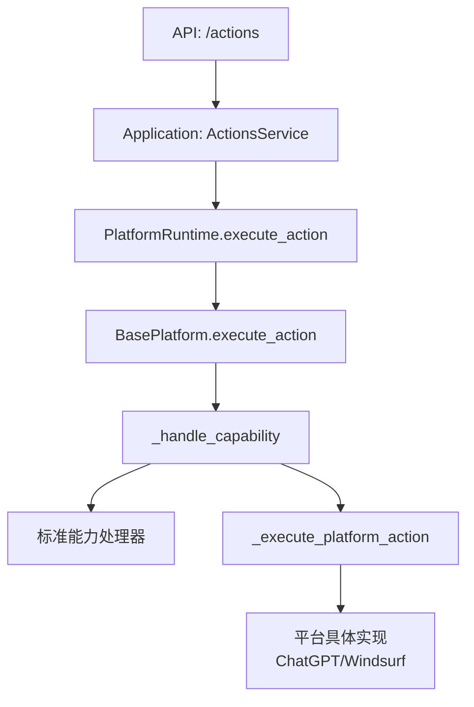
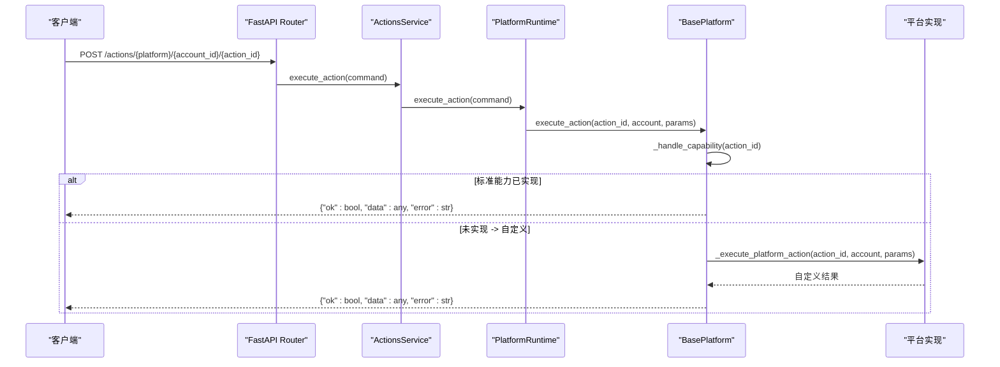
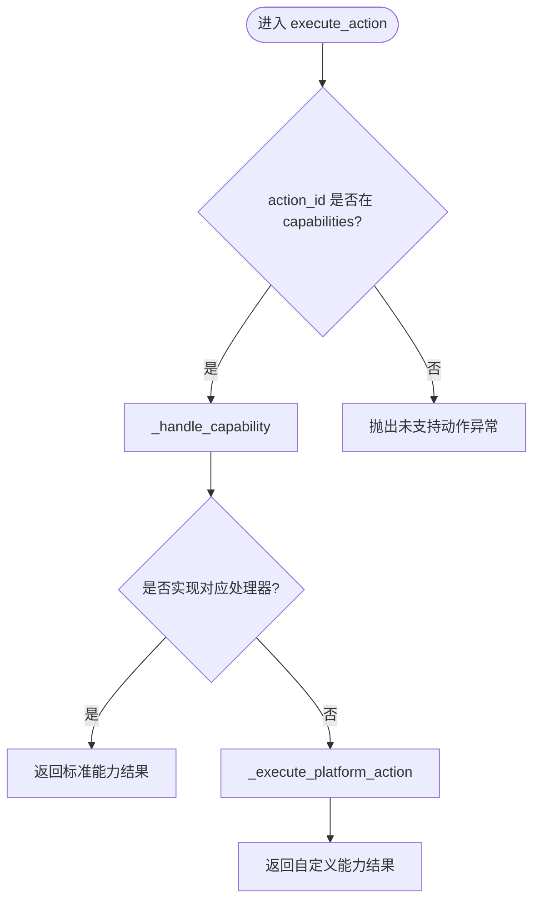
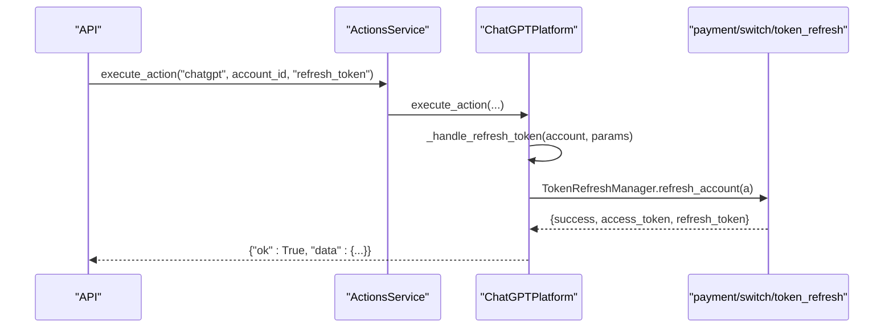
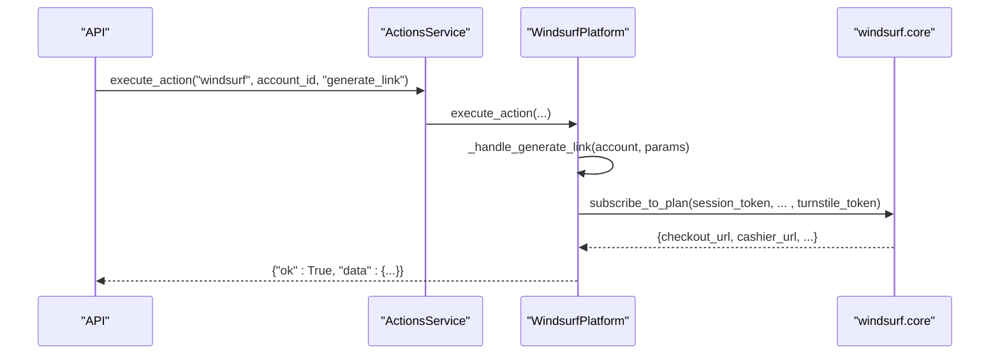
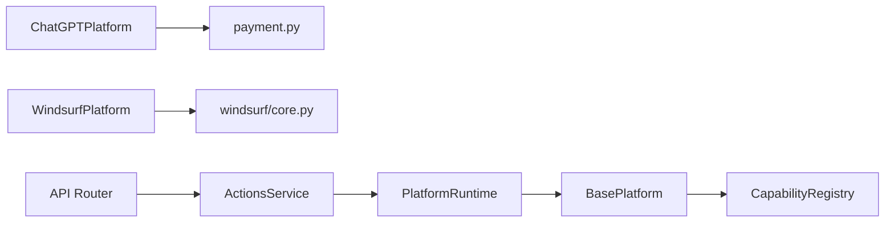

# 自定义能力开发指南

<cite>
**本文引用的文件**
- [core/base_platform.py](file://core/base_platform.py)
- [core/capability_registry.py](file://core/capability_registry.py)
- [domain/platform_caps.py](file://domain/platform_caps.py)
- [platforms/chatgpt/plugin.py](file://platforms/chatgpt/plugin.py)
- [platforms/windsurf/plugin.py](file://platforms/windsurf/plugin.py)
- [application/actions.py](file://application/actions.py)
- [api/actions.py](file://api/actions.py)
- [api/platform_capabilities.py](file://api/platform_capabilities.py)
- [platforms/chatgpt/payment.py](file://platforms/chatgpt/payment.py)
- [platforms/windsurf/core.py](file://platforms/windsurf/core.py)
- [tests/test_windsurf_platform.py](file://tests/test_windsurf_platform.py)
</cite>

## 目录
1. [简介](#简介)
2. [项目结构](#项目结构)
3. [核心组件](#核心组件)
4. [架构总览](#架构总览)
5. [详细组件分析](#详细组件分析)
6. [依赖关系分析](#依赖关系分析)
7. [性能考量](#性能考量)
8. [故障排查指南](#故障排查指南)
9. [结论](#结论)
10. [附录](#附录)

## 简介
本指南面向需要为平台扩展“自定义能力”的开发者，重点说明如何覆盖与实现_execute_platform_action()方法，完成参数校验、业务逻辑与返回值格式化；如何处理异步任务与错误状态；如何将自定义能力与标准能力无缝集成；并提供测试与调试最佳实践、常见陷阱与优化建议。文档同时给出 ChatGPT 与 Windsurf 两个平台的完整实现案例。

## 项目结构
围绕“能力系统”的关键位置如下：
- 基类与能力路由：core/base_platform.py
- 标准能力定义与注册：core/capability_registry.py
- 平台能力声明与覆盖：各平台 plugin.py（如 platforms/chatgpt/plugin.py、platforms/windsurf/plugin.py）
- 动作执行入口（API/应用层）：api/actions.py、application/actions.py
- 平台能力配置接口：api/platform_capabilities.py
- 领域模型：domain/platform_caps.py

图表来源
- [api/actions.py:27-39](file://api/actions.py#L27-L39)
- [application/actions.py:42-55](file://application/actions.py#L42-L55)
- [core/base_platform.py:192-233](file://core/base_platform.py#L192-L233)

章节来源
- [core/base_platform.py:44-310](file://core/base_platform.py#L44-L310)
- [core/capability_registry.py:7-172](file://core/capability_registry.py#L7-L172)
- [api/actions.py:1-39](file://api/actions.py#L1-L39)
- [application/actions.py:1-55](file://application/actions.py#L1-L55)
- [api/platform_capabilities.py:1-19](file://api/platform_capabilities.py#L1-L19)
- [domain/platform_caps.py:1-12](file://domain/platform_caps.py#L1-L12)

## 核心组件
- BasePlatform：提供能力路由、默认处理器、能力到动作的映射、以及_execute_platform_action()钩子。
- CapabilityRegistry：集中管理标准能力定义（ID、标签、分类、参数 schema、UI 提示等）。
- 平台插件（ChatGPT/Windsurf）：声明 capabilities、可选 capability_overrides，并实现具体能力处理器或覆盖_execute_platform_action()。
- 动作服务与应用层：根据能力是否同步决定直接执行或创建后台任务。

章节来源
- [core/base_platform.py:192-310](file://core/base_platform.py#L192-L310)
- [core/capability_registry.py:7-172](file://core/capability_registry.py#L7-L172)
- [platforms/chatgpt/plugin.py:48-423](file://platforms/chatgpt/plugin.py#L48-L423)
- [platforms/windsurf/plugin.py:35-385](file://platforms/windsurf/plugin.py#L35-L385)

## 架构总览
能力执行主流程：
- API 接收请求，调用 Application 层 ActionsService。
- 若能力标记为同步（sync=True），直接执行并返回结果；否则创建任务并唤醒任务调度器。
- PlatformRuntime 将 action_id 分派到 BasePlatform.execute_action。
- BasePlatform 先尝试标准能力处理器；未实现则回退到 _execute_platform_action()。
- 平台在 _execute_platform_action() 中实现自定义逻辑，或以 _handle_xxx 方式覆盖标准能力。

图表来源
- [api/actions.py:27-39](file://api/actions.py#L27-L39)
- [application/actions.py:42-55](file://application/actions.py#L42-L55)
- [core/base_platform.py:192-233](file://core/base_platform.py#L192-L233)

## 详细组件分析

### 能力系统与标准能力
- 标准能力通过 CapabilityDefinition 描述，包含 id、label、description、category、param_schema、ui_hints 等。
- CapabilityRegistry 提供查询、筛选（inline/menu）、排序（priority）等工具。
- 平台通过 capabilities 列表声明支持的能力，并通过 capability_overrides 覆盖 label、params、sync 等显示与行为。

章节来源
- [core/capability_registry.py:7-172](file://core/capability_registry.py#L7-L172)
- [platforms/windsurf/plugin.py:43-69](file://platforms/windsurf/plugin.py#L43-L69)

### BasePlatform 能力路由与默认处理
- execute_action：优先走标准能力处理器；未实现时抛出 NotImplementedError 由 _handle_capability 捕获并回退到 _execute_platform_action。
- _handle_capability：对 query_state、refresh_token、generate_link、switch_desktop、upload_cpa、upload_tm、check_trial、generate_link_browser、create_api_key 提供默认路由。
- _execute_platform_action：平台必须覆盖以实现自定义动作；未覆盖且无标准能力时会报错。

图表来源
- [core/base_platform.py:192-233](file://core/base_platform.py#L192-L233)

章节来源
- [core/base_platform.py:192-310](file://core/base_platform.py#L192-L310)

### 覆盖 _execute_platform_action() 的实现要求
- 方法签名：_execute_platform_action(self, action_id: str, account: Account, params: dict) -> dict
- 返回值约定：
  - 成功：{"ok": True, "data": <任意数据>}
  - 失败：{"ok": False, "error": "<错误信息>"}
- 参数校验：
  - 从 params 读取必要参数，进行类型与存在性校验，缺失时返回错误。
- 业务逻辑：
  - 使用 account.extra 中的凭据（如 access_token、session_token、cookies 等）。
  - 可调用平台专用模块（如支付、桌面端切换、上传等）。
- 错误处理：
  - 捕获异常并转换为 {"ok": False, "error": "..."}。
  - 对于网络/外部依赖失败，记录日志并返回友好错误。
- 异步操作：
  - 若能力标记为 sync=False，上层会创建任务；在 _execute_platform_action 内部应尽快返回，避免阻塞。
  - 如需长耗时操作，建议在任务内启动异步流程，并返回任务 ID。

章节来源
- [core/base_platform.py:231-233](file://core/base_platform.py#L231-L233)
- [application/actions.py:42-55](file://application/actions.py#L42-L55)

### 标准能力处理器覆盖示例
- query_state：用于查询账号状态/额度。
- refresh_token：刷新认证令牌。
- generate_link：生成试用/支付链接。
- switch_desktop：切换到桌面应用。
- upload_cpa/upload_tm：上传至 CPA/Team Manager。
- check_trial：检查试用资格。
- generate_link_browser：浏览器自动化生成链接。
- create_api_key：创建 API Key。

平台可通过覆盖 _handle_xxx 或直接实现 _execute_platform_action 来定制行为。

章节来源
- [core/base_platform.py:235-284](file://core/base_platform.py#L235-L284)

### ChatGPT 平台实现案例
- 能力声明：capabilities 包含 query_state、refresh_token、generate_link、switch_desktop、upload_cpa、upload_tm。
- 自定义动作：
  - switch_account/get_account_state/refresh_token/payment_link/upload_cpa/upload_tm 通过 get_platform_actions 暴露。
  - _execute_platform_action 中按 action_id 分发到具体逻辑（如切换桌面端、上传 CPA/TM）。
- 标准能力覆盖：
  - _handle_query_state：调用后端接口获取订阅/用量，并合并本地桌面端状态。
  - _handle_refresh_token：使用 TokenRefreshManager 刷新 token，并尝试拉取最新账户状态。
  - _handle_generate_link：根据 plan/country 生成 Plus/Team 支付链接，必要时以无痕模式打开浏览器。

图表来源
- [platforms/chatgpt/plugin.py:256-335](file://platforms/chatgpt/plugin.py#L256-L335)
- [platforms/chatgpt/plugin.py:361-389](file://platforms/chatgpt/plugin.py#L361-L389)
- [platforms/chatgpt/payment.py:1-200](file://platforms/chatgpt/payment.py#L1-L200)

章节来源
- [platforms/chatgpt/plugin.py:48-423](file://platforms/chatgpt/plugin.py#L48-L423)
- [platforms/chatgpt/payment.py:1-200](file://platforms/chatgpt/payment.py#L1-L200)

### Windsurf 平台实现案例
- 能力声明：capabilities 包含 query_state、check_trial、generate_link、generate_link_browser、switch_desktop。
- 能力覆盖：capability_overrides 调整 label、params、sync 等。
- 自定义动作：
  - switch_desktop：纯协议实现，通过 session_token 获取 OTT 并使用 deep link 切换桌面端。
  - generate_link_browser：浏览器自动化生成 Pro Trial Stripe 链接，支持 Turnstile token 自动求解。
  - generate_link：自动获取 Turnstile token，检查试用资格，调用订阅接口，必要时刷新会话。
- 标准能力覆盖：
  - _handle_query_state：加载账户状态并返回配额摘要。
  - _handle_check_trial：检查 Pro Trial 资格。

图表来源
- [platforms/windsurf/plugin.py:277-379](file://platforms/windsurf/plugin.py#L277-L379)
- [platforms/windsurf/core.py:1-200](file://platforms/windsurf/core.py#L1-L200)

章节来源
- [platforms/windsurf/plugin.py:35-385](file://platforms/windsurf/plugin.py#L35-L385)
- [platforms/windsurf/core.py:1-200](file://platforms/windsurf/core.py#L1-L200)

### 异步操作与错误状态
- 同步/异步判定：
  - 若能力在 capability_overrides 中标记 sync=False，上层会创建任务并唤醒任务调度器，避免阻塞请求。
- 错误状态：
  - 所有处理器统一返回 {"ok": bool, "data": any, "error": str} 格式。
  - 对外部依赖失败，捕获异常并返回错误信息，便于前端展示与重试。
- 任务化执行：
  - 当能力耗时较长（如浏览器自动化、网络请求），应在任务中执行，并在 _execute_platform_action 中快速返回任务 ID。

章节来源
- [application/actions.py:42-55](file://application/actions.py#L42-L55)
- [core/base_platform.py:231-233](file://core/base_platform.py#L231-L233)

### 自定义能力与标准能力的集成
- 平台声明 capabilities，BasePlatform 自动将能力映射为动作列表，并支持 capability_overrides 覆盖显示与行为。
- 若 action_id 不在标准能力列表中，BasePlatform 会调用 _execute_platform_action 进行自定义处理。
- 通过 CapabilityRegistry 统一管理标准能力定义，确保前后端一致。

章节来源
- [core/base_platform.py:286-310](file://core/base_platform.py#L286-L310)
- [core/capability_registry.py:135-172](file://core/capability_registry.py#L135-L172)

## 依赖关系分析
- BasePlatform 依赖 CapabilityRegistry 获取标准能力定义。
- 平台插件依赖各自业务模块（如 payment、core、switch）。
- 应用层 ActionsService 依赖 PlatformRuntime 执行动作，并根据 sync 标志决定是否创建任务。
- API 层暴露 actions 与 platform_capabilities 接口，供前端查询与更新能力配置。

图表来源
- [core/base_platform.py:286-310](file://core/base_platform.py#L286-L310)
- [platforms/chatgpt/plugin.py:256-423](file://platforms/chatgpt/plugin.py#L256-L423)
- [platforms/windsurf/plugin.py:178-379](file://platforms/windsurf/plugin.py#L178-L379)
- [application/actions.py:1-55](file://application/actions.py#L1-L55)

章节来源
- [core/base_platform.py:286-310](file://core/base_platform.py#L286-L310)
- [application/actions.py:1-55](file://application/actions.py#L1-L55)

## 性能考量
- 避免在 _execute_platform_action 中进行阻塞式长耗时操作；对浏览器自动化或网络请求，建议使用任务化执行。
- 合理设置超时与重试策略，特别是在调用外部 API 或浏览器自动化时。
- 复用连接与上下文（如代理、会话），减少重复初始化开销。
- 对频繁查询的状态（如账户状态），考虑缓存最近一次检查结果。

[本节为通用指导，不直接分析具体文件]

## 故障排查指南
- 常见问题：
  - 未实现的动作：BasePlatform 会抛出未支持动作异常；检查 capabilities 与 _execute_platform_action 实现。
  - 缺少凭据：如 session_token、access_token 为空导致失败；检查 account.extra 与登录流程。
  - 验证码问题：Turnstile/CAPTCHA 未配置或失败；检查 provider 配置与 solve_turnstile_with_fallback 流程。
  - 浏览器自动化失败：确认 headless/headed 模式与代理配置；查看日志定位页面元素或网络错误。
- 调试建议：
  - 启用日志输出，记录关键步骤与参数。
  - 使用单元测试验证解析器与业务流程（参考 tests/test_windsurf_platform.py）。
  - 通过 API 逐步验证能力列表与执行结果。

章节来源
- [platforms/windsurf/plugin.py:213-246](file://platforms/windsurf/plugin.py#L213-L246)
- [tests/test_windsurf_platform.py:1-200](file://tests/test_windsurf_platform.py#L1-L200)

## 结论
通过 BasePlatform 的能力路由与 _execute_platform_action 钩子，平台可以灵活扩展自定义能力，并与标准能力无缝集成。结合 CapabilityRegistry 的统一定义与 application 层的任务化执行，既能保证一致性，又能满足高性能与可扩展性需求。ChatGPT 与 Windsurf 的案例展示了如何在不同场景下实现参数校验、业务逻辑、错误处理与异步任务的最佳实践。

[本节为总结，不直接分析具体文件]

## 附录

### 实现清单（Checklist）
- 在平台类中声明 capabilities 与可选 capability_overrides。
- 实现 _execute_platform_action 或覆盖 _handle_xxx 处理器。
- 参数校验：检查必填字段与类型，返回统一错误格式。
- 业务逻辑：使用 account.extra 中的凭据，调用平台模块。
- 错误处理：捕获异常并返回 {"ok": False, "error": "..."}。
- 异步支持：对耗时操作标记 sync=False，交由任务执行。
- 测试与调试：编写单元测试，覆盖解析器与关键路径。

章节来源
- [core/base_platform.py:192-310](file://core/base_platform.py#L192-L310)
- [platforms/chatgpt/plugin.py:256-423](file://platforms/chatgpt/plugin.py#L256-L423)
- [platforms/windsurf/plugin.py:43-379](file://platforms/windsurf/plugin.py#L43-L379)