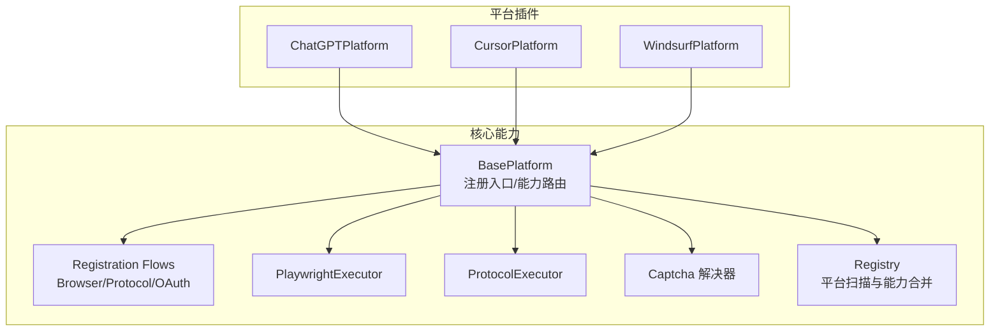
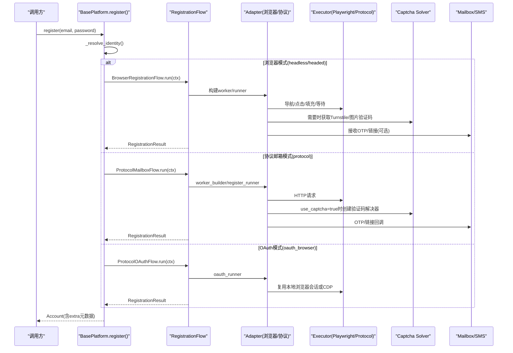
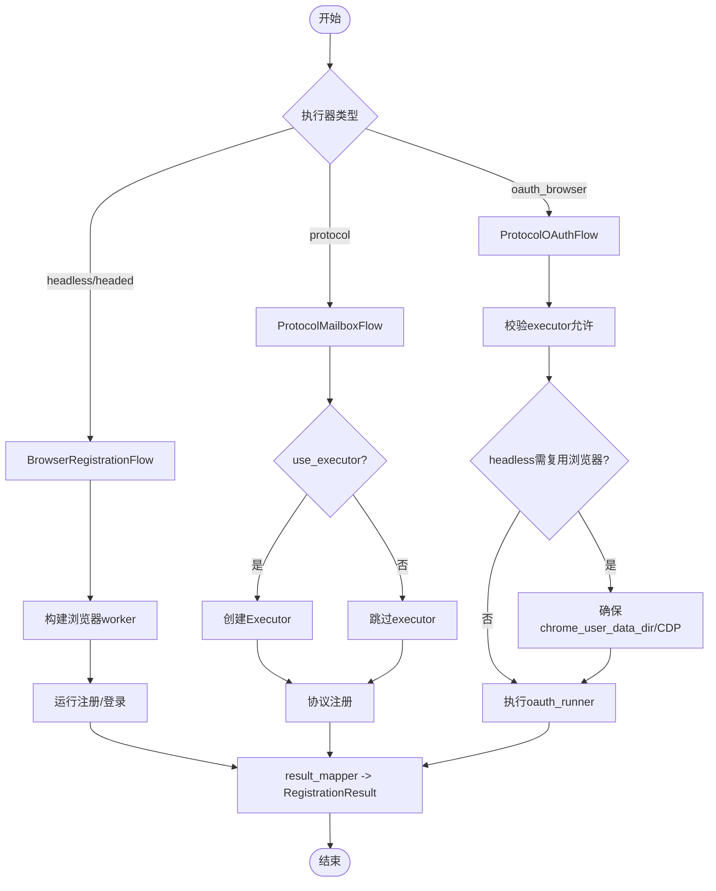
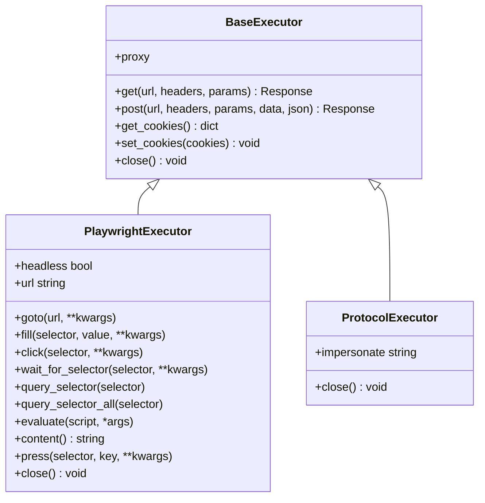

# 平台适配器开发

<cite>
**本文引用的文件**
- [core/base_platform.py](file://core/base_platform.py)
- [core/registration/adapters.py](file://core/registration/adapters.py)
- [core/registration/flows.py](file://core/registration/flows.py)
- [core/executors/playwright.py](file://core/executors/playwright.py)
- [core/executors/protocol.py](file://core/executors/protocol.py)
- [core/base_executor.py](file://core/base_executor.py)
- [core/base_captcha.py](file://core/base_captcha.py)
- [core/registry.py](file://core/registry.py)
- [platforms/chatgpt/plugin.py](file://platforms/chatgpt/plugin.py)
- [platforms/cursor/plugin.py](file://platforms/cursor/plugin.py)
- [platforms/windsurf/plugin.py](file://platforms/windsurf/plugin.py)
- [platforms/chatgpt/browser_register.py](file://platforms/chatgpt/browser_register.py)
- [platforms/cursor/browser_register.py](file://platforms/cursor/browser_register.py)
- [platforms/windsurf/browser_register.py](file://platforms/windsurf/browser_register.py)
</cite>

## 目录
1. [简介](#简介)
2. [项目结构](#项目结构)
3. [核心组件](#核心组件)
4. [架构总览](#架构总览)
5. [详细组件分析](#详细组件分析)
6. [依赖关系分析](#依赖关系分析)
7. [性能考虑](#性能考虑)
8. [故障排查指南](#故障排查指南)
9. [结论](#结论)
10. [附录：新平台接入步骤与最佳实践](#附录新平台接入步骤与最佳实践)

## 简介
本指南面向希望为新AI平台添加支持的开发者，基于现有框架快速实现平台适配。内容涵盖BasePlatform基类的继承方法、注册流程（浏览器自动化与协议调用）、执行器选择与配置、OAuth集成、验证码处理、会话管理，以及ChatGPT、Cursor、Windsurf等平台的实现策略对比与调试技巧。

## 项目结构
本项目采用“平台插件 + 统一注册流 + 执行器抽象”的分层设计：
- core：提供平台基类、注册流、执行器、验证码能力、注册表等通用能力
- platforms：各平台的具体实现（插件），通过装饰器自动注册
- providers：第三方服务（邮箱、短信、代理、验证码）的提供者
- infrastructure：持久化与运行时基础设施
- api/application：对外API与应用编排

图表来源
- [core/base_platform.py:44-160](file://core/base_platform.py#L44-L160)
- [core/registration/flows.py:18-142](file://core/registration/flows.py#L18-L142)
- [core/executors/playwright.py:5-134](file://core/executors/playwright.py#L5-L134)
- [core/executors/protocol.py:6-45](file://core/executors/protocol.py#L6-L45)
- [core/base_captcha.py:48-98](file://core/base_captcha.py#L48-L98)
- [core/registry.py:19-38](file://core/registry.py#L19-L38)

章节来源
- [core/base_platform.py:44-160](file://core/base_platform.py#L44-L160)
- [core/registry.py:19-38](file://core/registry.py#L19-L38)

## 核心组件
- BasePlatform：平台插件基类，定义注册入口、能力声明、执行器与验证码选择、身份解析与元数据附加等。
- Registration Adapters & Flows：将平台具体行为解耦为“适配器+流程”，支持浏览器注册、协议邮箱注册、协议OAuth三种路径。
- Executors：抽象HTTP/浏览器操作，提供Playwright与纯协议两种实现。
- Captcha：统一的验证码解决器创建与回退机制。
- Registry：自动扫描并注册平台插件，合并数据库能力覆盖。

章节来源
- [core/base_platform.py:44-160](file://core/base_platform.py#L44-L160)
- [core/registration/adapters.py:9-59](file://core/registration/adapters.py#L9-L59)
- [core/registration/flows.py:18-142](file://core/registration/flows.py#L18-L142)
- [core/executors/playwright.py:5-134](file://core/executors/playwright.py#L5-L134)
- [core/executors/protocol.py:6-45](file://core/executors/protocol.py#L6-L45)
- [core/base_captcha.py:48-98](file://core/base_captcha.py#L48-L98)
- [core/registry.py:19-38](file://core/registry.py#L19-L38)

## 架构总览
下图展示了从调用register到最终返回Account的完整控制流，包括执行器选择、适配器装配、验证码与邮箱/电话回调、结果映射与身份元数据附加。

图表来源
- [core/base_platform.py:124-160](file://core/base_platform.py#L124-L160)
- [core/registration/flows.py:18-142](file://core/registration/flows.py#L18-L142)
- [core/executors/playwright.py:5-134](file://core/executors/playwright.py#L5-L134)
- [core/executors/protocol.py:6-45](file://core/executors/protocol.py#L6-L45)
- [core/base_captcha.py:48-98](file://core/base_captcha.py#L48-L98)

## 详细组件分析

### BasePlatform 基类与注册流程
- 关键职责
  - 声明平台能力：supported_executors、supported_identity_modes、supported_oauth_providers、capabilities、capability_overrides
  - 构造执行器：根据executor_type选择ProtocolExecutor或PlaywrightExecutor
  - 解析身份：mailbox或oauth_browser，必要时要求email
  - 注册路由：按executor_type与identity_provider选择Browser/Protocol/OAuth流程
  - 验证码：统一创建与回退，支持local_solver、2Captcha、YesCaptcha、manual
  - 结果映射：将RegistrationResult转为Account，并附加identity元数据
- 必须实现的方法
  - check_valid(account): 校验账号有效性
  - build_*_adapter(): 至少实现一个适配器（浏览器/协议邮箱/协议OAuth）
  - get_quota/get_trial_url/get_desktop_state: 可选能力
- 能力系统
  - 通过capabilities声明标准能力（如query_state、refresh_token、generate_link等）
  - 通过capability_overrides自定义动作标签与参数
  - execute_action优先走标准能力，再回退到平台特定action

章节来源
- [core/base_platform.py:44-160](file://core/base_platform.py#L44-L160)
- [core/base_platform.py:162-328](file://core/base_platform.py#L162-L328)
- [core/base_platform.py:330-430](file://core/base_platform.py#L330-L430)
- [core/base_platform.py:432-505](file://core/base_platform.py#L432-L505)

### 注册适配器与流程
- 适配器
  - BrowserRegistrationAdapter：封装浏览器工作流、OTP/链接回调、验证码开关、OAuth runner
  - ProtocolMailboxAdapter：封装协议邮箱注册工作流、验证码、OTP/链接回调
  - ProtocolOAuthAdapter：封装协议OAuth流程
- 流程
  - BrowserRegistrationFlow：处理浏览器模式，必要时复用本地浏览器会话（headless需chrome_user_data_dir或chrome_cdp_url）
  - ProtocolMailboxFlow：使用executor进行HTTP交互，可启用use_captcha
  - ProtocolOAuthFlow：校验executor类型与浏览器复用要求，执行oauth_runner

图表来源
- [core/registration/adapters.py:9-59](file://core/registration/adapters.py#L9-L59)
- [core/registration/flows.py:18-142](file://core/registration/flows.py#L18-L142)

章节来源
- [core/registration/adapters.py:9-59](file://core/registration/adapters.py#L9-L59)
- [core/registration/flows.py:18-142](file://core/registration/flows.py#L18-L142)

### 执行器：Playwright 与 协议
- PlaywrightExecutor
  - 支持headless/headed，设置UA、默认超时、代理
  - 暴露get/post/goto/fill/click/wait_for_selector/query_selector/evaluate/content/url/press/close等方法
  - 适合复杂UI交互、验证码注入、页面元素操作
- ProtocolExecutor
  - 基于curl_cffi，模拟Chrome指纹，支持代理
  - 暴露get/post/get_cookies/set_cookies/close
  - 适合无头HTTP协议注册、轻量交互

图表来源
- [core/base_executor.py:7-49](file://core/base_executor.py#L7-L49)
- [core/executors/playwright.py:5-134](file://core/executors/playwright.py#L5-L134)
- [core/executors/protocol.py:6-45](file://core/executors/protocol.py#L6-L45)

章节来源
- [core/executors/playwright.py:5-134](file://core/executors/playwright.py#L5-L134)
- [core/executors/protocol.py:6-45](file://core/executors/protocol.py#L6-L45)
- [core/base_executor.py:7-49](file://core/base_executor.py#L7-L49)

### 验证码处理与会话管理
- 验证码
  - create_captcha_solver：根据provider_key创建具体实现（local_solver、yescaptcha_api、twocaptcha_api、manual）
  - has_captcha_configured：检查是否已配置且启用
  - solve_turnstile_with_fallback：按候选列表尝试，失败则记录错误并继续下一个
- 会话
  - Executor维护cookies，注册完成后通过result_mapper提取token/session
  - Identity快照包含邮箱、OAuth provider、浏览器用户数据目录、CDP地址等，便于后续复用会话

章节来源
- [core/base_captcha.py:48-98](file://core/base_captcha.py#L48-L98)
- [core/base_platform.py:330-430](file://core/base_platform.py#L330-L430)
- [core/base_platform.py:461-505](file://core/base_platform.py#L461-L505)

### ChatGPT 平台适配器
- 能力与执行器
  - supported_executors: protocol, headless, headed
  - supported_identity_modes: mailbox, oauth_browser
  - capabilities: query_state, refresh_token, generate_link, switch_desktop, upload_cpa, upload_tm
- 注册流程
  - 浏览器模式：BrowserRegistrationAdapter，内部使用Camoufox/Playwright完成注册、OTP、支付链接生成等
  - 协议邮箱模式：ProtocolMailboxAdapter，通过协议邮箱获取验证码并完成注册
  - OAuth模式：ProtocolOAuthAdapter，复用本地浏览器会话或CDP
- 关键实现要点
  - 密码生成更严格，提高通过率
  - 结果映射包含access_token、refresh_token、id_token、session_token、workspace_id、cookies、profile等
  - 能力实现：查询状态、刷新Token、生成支付链接、切换桌面端、上传CPA/TM

章节来源
- [platforms/chatgpt/plugin.py:48-225](file://platforms/chatgpt/plugin.py#L48-L225)
- [platforms/chatgpt/plugin.py:227-423](file://platforms/chatgpt/plugin.py#L227-L423)
- [platforms/chatgpt/browser_register.py:1-200](file://platforms/chatgpt/browser_register.py#L1-L200)

### Cursor 平台适配器
- 能力与执行器
  - supported_executors: protocol, headless, headed
  - supported_identity_modes: mailbox
  - capabilities: switch_desktop, query_state, generate_link
- 注册流程
  - 浏览器模式：BrowserRegistrationAdapter，使用Camoufox处理Turnstile、邮箱OTP、跳转cursor.com获取Session Token
  - 协议邮箱模式：ProtocolMailboxAdapter，通过协议邮箱完成注册
- 关键实现要点
  - 浏览器流程中检测Cloudflare全页拦截并处理
  - 结果映射包含user_info等扩展字段
  - 能力实现：切换桌面应用、查询状态、生成7天Pro试用链接

章节来源
- [platforms/cursor/plugin.py:18-114](file://platforms/cursor/plugin.py#L18-L114)
- [platforms/cursor/plugin.py:116-265](file://platforms/cursor/plugin.py#L116-L265)
- [platforms/cursor/browser_register.py:1-200](file://platforms/cursor/browser_register.py#L1-L200)

### Windsurf 平台适配器
- 能力与执行器
  - supported_executors: protocol, headless, headed
  - supported_identity_modes: mailbox
  - capabilities: query_state, check_trial, generate_link, generate_link_browser, switch_desktop
  - capability_overrides：自定义generate_link与generate_link_browser的参数与同步策略
- 注册流程
  - 浏览器模式：BrowserRegistrationAdapter，使用Playwright/Camoufox处理Turnstile、Stripe支付流程
  - 协议邮箱模式：ProtocolMailboxAdapter，通过协议邮箱完成注册
- 关键实现要点
  - 自动生成Turnstile token（可手动传入），失败时提示使用浏览器辅助
  - 能力实现：查询状态、检查Trial资格、生成Stripe链接（自动打码/浏览器）、切换桌面应用
  - 会话刷新：当订阅接口返回401时，尝试auth_token刷新或密码重新登录

章节来源
- [platforms/windsurf/plugin.py:35-150](file://platforms/windsurf/plugin.py#L35-L150)
- [platforms/windsurf/plugin.py:152-385](file://platforms/windsurf/plugin.py#L152-L385)
- [platforms/windsurf/browser_register.py:1-200](file://platforms/windsurf/browser_register.py#L1-L200)

## 依赖关系分析
- 平台插件通过@装饰器注册到全局注册表，启动时自动扫描platforms目录加载所有插件
- 能力声明会被合并到数据库覆盖项，保证运行时能力可配置
- 执行器与验证码在运行时按需创建，避免不必要的资源占用

图表来源
- [core/registry.py:25-38](file://core/registry.py#L25-L38)
- [core/registry.py:64-107](file://core/registry.py#L64-L107)

章节来源
- [core/registry.py:25-38](file://core/registry.py#L25-L38)
- [core/registry.py:64-107](file://core/registry.py#L64-L107)

## 性能考虑
- 执行器选择
  - 协议模式更快、资源占用更低，适合批量注册与稳定API
  - 浏览器模式更灵活，但开销更大；建议复用浏览器会话减少启动成本
- 验证码
  - 合理配置多个provider并按优先级尝试，提升成功率
  - 对全页拦截与内嵌widget分别处理，避免无效重试
- 网络与代理
  - 使用代理池与区域匹配，降低封禁风险
  - 合理设置超时与重试策略

[本节为通用指导，不直接分析具体文件]

## 故障排查指南
- 未找到可用验证码provider
  - 现象：solve_turnstile_with_fallback抛出异常
  - 处理：确认至少一个captcha provider已启用并配置认证字段
- 浏览器模式未配置默认验证码
  - 现象：headless/headed模式下未配置默认provider时报错
  - 处理：在设置页启用并设为默认，或在配置中指定captcha_solver
- OAuth无头模式需复用浏览器
  - 现象：headless下OAuth需chrome_user_data_dir或chrome_cdp_url
  - 处理：配置本地浏览器用户数据目录或CDP地址以复用会话
- 协议邮箱未获取到邮箱
  - 现象：require_email=true但未获取到邮箱
  - 处理：提供email或配置支持的identity_provider
- 未知执行器类型
  - 现象：executor_type不在supported_executors中
  - 处理：调整executor_type或在平台能力声明中添加支持

章节来源
- [core/base_platform.py:330-430](file://core/base_platform.py#L330-L430)
- [core/base_platform.py:451-459](file://core/base_platform.py#L451-L459)
- [core/registration/flows.py:26-39](file://core/registration/flows.py#L26-L39)
- [core/registration/flows.py:81-122](file://core/registration/flows.py#L81-L122)

## 结论
通过BasePlatform的统一抽象与注册流解耦，平台适配器的实现被简化为“声明能力 + 实现适配器 + 实现check_valid”。结合执行器与验证码能力，开发者可以快速接入新平台，并在浏览器与协议之间灵活切换。ChatGPT、Cursor、Windsurf等平台展示了不同策略：强UI交互、协议邮箱、OAuth复用本地浏览器等。遵循本指南的步骤与最佳实践，可高效完成新平台适配。

[本节为总结性内容，不直接分析具体文件]

## 附录：新平台接入步骤与最佳实践
- 步骤
  1. 新建平台目录与plugin.py，定义类继承BasePlatform，声明name、display_name、version、supported_executors、supported_identity_modes、supported_oauth_providers、capabilities、capability_overrides
  2. 实现check_valid用于账号有效性检测
  3. 实现build_*_adapter：
     - 若平台有复杂UI：实现BrowserRegistrationAdapter，编写browser_worker_builder与browser_register_runner
     - 若平台支持协议邮箱：实现ProtocolMailboxAdapter，编写worker_builder与register_runner
     - 若支持OAuth：实现ProtocolOAuthAdapter，编写oauth_runner
  4. 根据需要实现能力处理器：_handle_query_state、_handle_refresh_token、_handle_generate_link等
  5. 配置验证码provider与代理，确保execute流程顺畅
  6. 测试三种执行器模式（protocol/headless/headed）与不同身份模式（mailbox/oauth_browser）
- 最佳实践
  - 明确能力边界：仅声明平台实际支持的能力，避免过度承诺
  - 验证码回退：配置多个provider并按优先级尝试，记录失败原因便于定位
  - 会话复用：OAuth场景尽量复用本地浏览器会话，减少重复登录
  - 日志与诊断：在关键节点输出日志，便于追踪问题
  - 安全与隐私：敏感信息（token、cookies）存储在account.extra中，避免明文打印

[本节为通用指导，不直接分析具体文件]