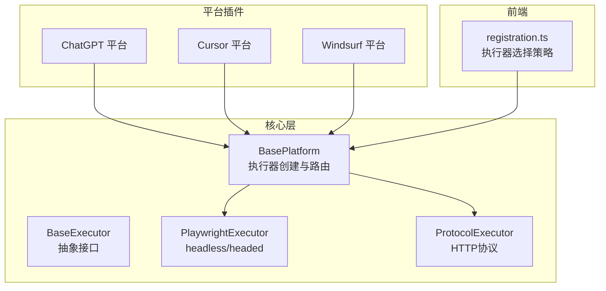
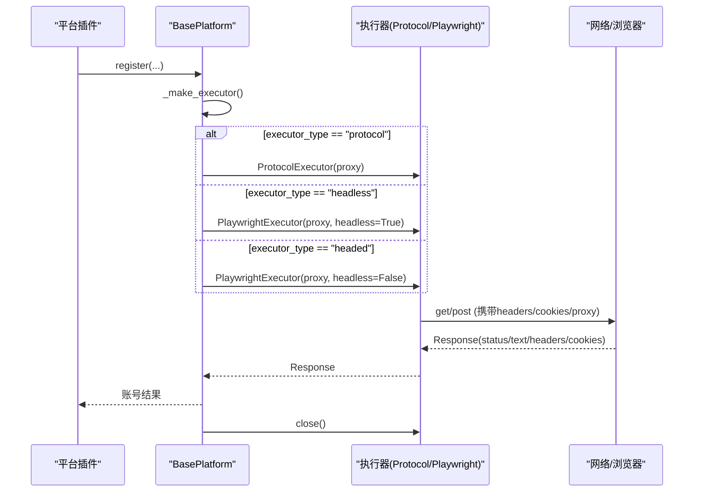
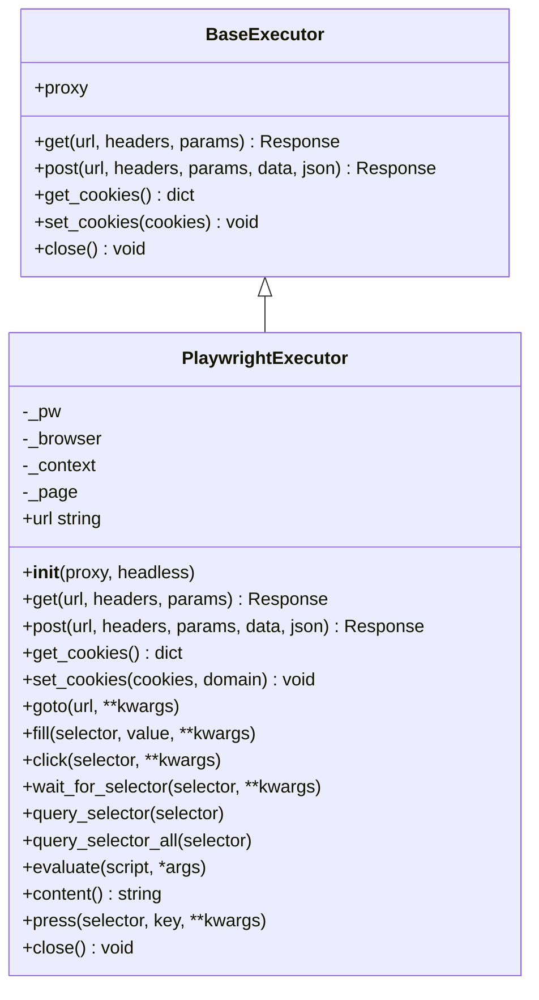
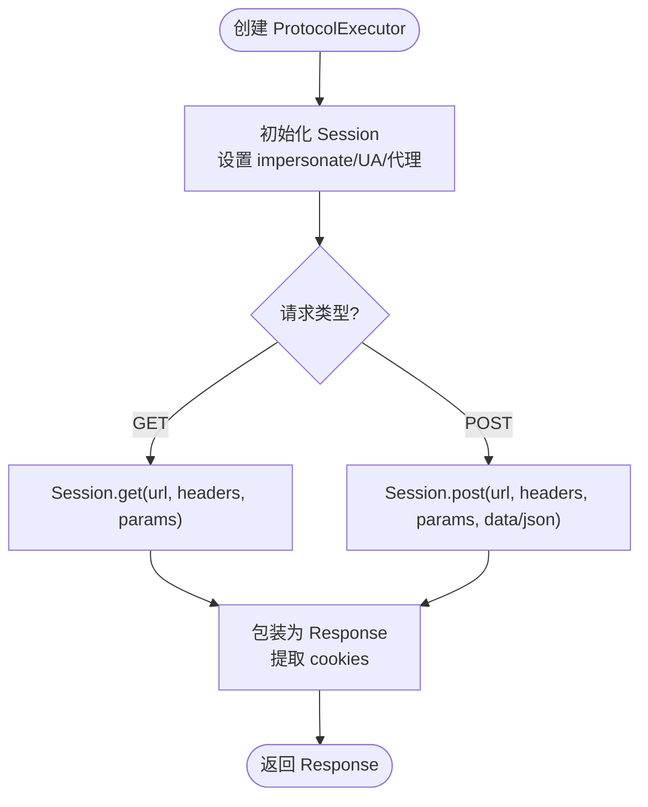
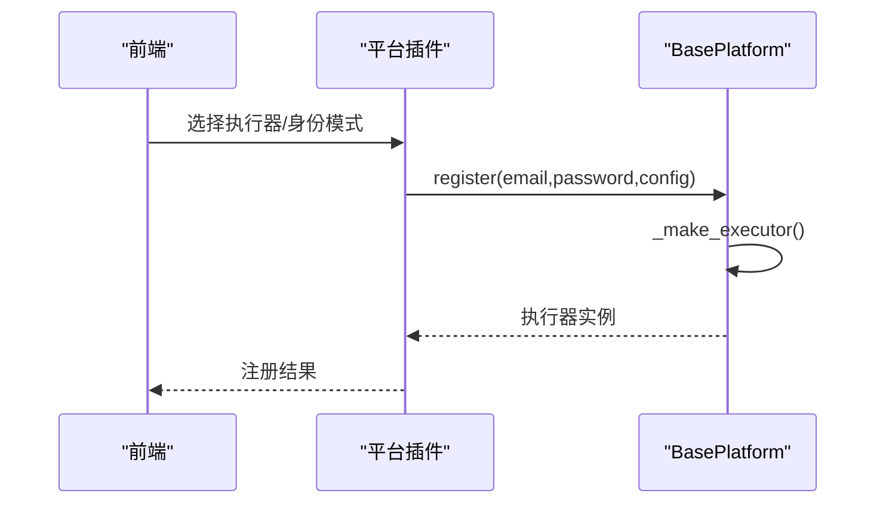
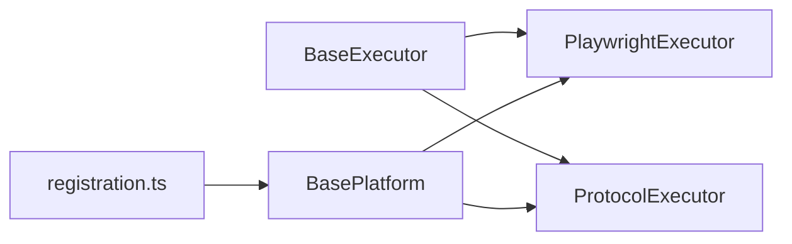

# 执行器模式详解

<cite>
**本文引用的文件**
- [core/base_executor.py](file://core/base_executor.py)
- [core/executors/playwright.py](file://core/executors/playwright.py)
- [core/executors/protocol.py](file://core/executors/protocol.py)
- [core/base_platform.py](file://core/base_platform.py)
- [core/registration/models.py](file://core/registration/models.py)
- [platforms/chatgpt/plugin.py](file://platforms/chatgpt/plugin.py)
- [platforms/cursor/plugin.py](file://platforms/cursor/plugin.py)
- [platforms/windsurf/plugin.py](file://platforms/windsurf/plugin.py)
- [frontend/src/lib/registration.ts](file://frontend/src/lib/registration.ts)
</cite>

## 目录
1. [简介](#简介)
2. [项目结构](#项目结构)
3. [核心组件](#核心组件)
4. [架构总览](#架构总览)
5. [详细组件分析](#详细组件分析)
6. [依赖关系分析](#依赖关系分析)
7. [性能考量](#性能考量)
8. [故障排查指南](#故障排查指南)
9. [结论](#结论)
10. [附录：配置与示例](#附录：配置与示例)

## 简介
本文件面向使用“执行器模式”的开发者，系统讲解两类执行器的工作原理、适用场景与配置要点：
- Playwright 浏览器执行器：支持 headless（无头）和 headed（有头）两种模式，适合需要真实浏览器环境的注册流程。
- HTTP 协议执行器：基于 curl_cffi 的纯协议请求封装，适合无需渲染页面的轻量自动化。

文档还涵盖代理支持、超时设置、执行器选择决策、平台适配器中的正确使用方式、性能优化建议与常见问题排查。

## 项目结构
执行器相关代码集中在 core 层，平台插件通过 BasePlatform 统一调度不同执行器；前端提供执行器选项与选择逻辑。

图表来源
- [core/base_executor.py:19-49](file://core/base_executor.py#L19-L49)
- [core/executors/playwright.py:5-35](file://core/executors/playwright.py#L5-L35)
- [core/executors/protocol.py:6-45](file://core/executors/protocol.py#L6-L45)
- [core/base_platform.py:316-328](file://core/base_platform.py#L316-L328)
- [frontend/src/lib/registration.ts:14-31](file://frontend/src/lib/registration.ts#L14-L31)

章节来源
- [core/base_executor.py:1-49](file://core/base_executor.py#L1-L49)
- [core/base_platform.py:316-328](file://core/base_platform.py#L316-L328)
- [frontend/src/lib/registration.ts:14-31](file://frontend/src/lib/registration.ts#L14-L31)

## 核心组件
- BaseExecutor：定义统一的 HTTP 请求抽象（get/post）、Cookie 管理、上下文管理器（with 自动关闭）。
- PlaywrightExecutor：基于 Playwright 同步 API，启动 Chromium，支持 headless/headed，内置默认 UA、视口、超时与代理注入。
- ProtocolExecutor：基于 curl_cffi 的 Session，支持 impersonate 指纹模拟、代理与 Cookie 管理。
- BasePlatform：根据配置 executor_type 动态创建执行器，并驱动注册流程（浏览器或协议）。

章节来源
- [core/base_executor.py:1-49](file://core/base_executor.py#L1-L49)
- [core/executors/playwright.py:5-35](file://core/executors/playwright.py#L5-L35)
- [core/executors/protocol.py:6-45](file://core/executors/protocol.py#L6-L45)
- [core/base_platform.py:316-328](file://core/base_platform.py#L316-L328)

## 架构总览
下图展示从平台调用到具体执行器的完整链路，包括执行器类型选择、代理传递、Cookie 流转与资源释放。

图表来源
- [core/base_platform.py:316-328](file://core/base_platform.py#L316-L328)
- [core/executors/protocol.py:28-45](file://core/executors/protocol.py#L28-L45)
- [core/executors/playwright.py:37-75](file://core/executors/playwright.py#L37-L75)

## 详细组件分析

### Playwright 执行器（headless/headed）
- 初始化：启动 Chromium，设置禁用自动化检测参数、禁用 dev-shm、no-sandbox；可注入代理；创建上下文并设置 UA、视口与默认超时（60秒）。
- HTTP 能力：通过 page.goto 与 page.request.post 实现 get/post，返回统一 Response。
- Cookie：支持获取与设置，按当前页面 URL 或 domain/path 规则写入。
- 浏览器操作：暴露 goto/fill/click/wait_for_selector/query_selector/evaluate/content/url/press 等方法，便于复杂交互。
- 资源释放：close 时关闭浏览器与 Playwright 实例。

图表来源
- [core/base_executor.py:19-49](file://core/base_executor.py#L19-L49)
- [core/executors/playwright.py:5-134](file://core/executors/playwright.py#L5-L134)

章节来源
- [core/executors/playwright.py:5-134](file://core/executors/playwright.py#L5-L134)

### HTTP 协议执行器（curl_cffi）
- 会话：使用 curl_cffi.requests.Session，支持 impersonate（如 chrome124），统一设置 UA。
- 代理：支持 http/https 代理注入。
- 请求：get/post 均返回统一 Response，包含状态码、文本、头部与 Cookie。
- Cookie：支持读取与设置。
- 资源释放：close 关闭会话。

图表来源
- [core/executors/protocol.py:6-45](file://core/executors/protocol.py#L6-L45)

章节来源
- [core/executors/protocol.py:1-45](file://core/executors/protocol.py#L1-L45)

### 执行器选择与平台适配
- BasePlatform._make_executor：根据 config.executor_type 创建对应执行器；未配置时默认为 protocol。
- 平台插件声明支持的执行器集合（supported_executors），并在构建注册适配器时传入 executor_type 用于 headless/headed 控制。
- 前端 registration.ts 提供 pickOAuthExecutor/buildExecutorOptions 等策略，结合 reusableBrowser 与 supported_executors 决定最终执行器。

图表来源
- [core/base_platform.py:316-328](file://core/base_platform.py#L316-L328)
- [frontend/src/lib/registration.ts:14-31](file://frontend/src/lib/registration.ts#L14-L31)

章节来源
- [core/base_platform.py:316-328](file://core/base_platform.py#L316-L328)
- [platforms/chatgpt/plugin.py:48-57](file://platforms/chatgpt/plugin.py#L48-L57)
- [platforms/cursor/plugin.py:18-25](file://platforms/cursor/plugin.py#L18-L25)
- [platforms/windsurf/plugin.py:35-49](file://platforms/windsurf/plugin.py#L35-L49)
- [frontend/src/lib/registration.ts:14-31](file://frontend/src/lib/registration.ts#L14-L31)

### Headless 与 Headed 模式对比
- Headless（无头）
  - 优点：资源占用低、适合批量自动化、服务器环境友好。
  - 限制：部分站点对无头浏览器检测更严格；调试不便。
  - 配置：PlaywrightExecutor 中 headless=True，默认 UA、视口、超时已设置。
- Headed（有头）
  - 优点：可视化界面便于调试、更容易绕过反爬检测。
  - 限制：需要图形界面环境、资源消耗更高。
  - 配置：PlaywrightExecutor 中 headless=False。

章节来源
- [core/executors/playwright.py:14-35](file://core/executors/playwright.py#L14-L35)
- [core/base_platform.py:316-328](file://core/base_platform.py#L316-L328)

### 协议执行器的适用场景与限制
- 适用场景：纯 HTTP 接口自动化、无需页面渲染、对性能要求高、稳定接口调用。
- 限制：无法处理需浏览器渲染的流程（如验证码、JS 加密、复杂表单交互）；对反爬策略较弱的站点更友好。
- 特性：支持 impersonate 模拟浏览器指纹，提升兼容性。

章节来源
- [core/executors/protocol.py:1-45](file://core/executors/protocol.py#L1-L45)

### 执行器选择的决策指南
- 若平台仅支持协议注册（如邮箱验证码流程），优先选择 protocol。
- 若需要真实浏览器环境（第三方 OAuth、复杂交互），选择 headless 或 headed：
  - 服务器/批量：headless。
  - 本地调试/复杂反爬：headed。
- 当存在可复用本机浏览器登录态（Chrome Profile/CDP）且平台允许时，优先 headless 以复用会话。
- 前端策略会依据 supported_executors、reusableBrowser 与用户偏好自动选择。

章节来源
- [frontend/src/lib/registration.ts:14-31](file://frontend/src/lib/registration.ts#L14-L31)
- [core/registration/models.py:17-41](file://core/registration/models.py#L17-L41)

## 依赖关系分析
- BaseExecutor 被 PlaywrightExecutor 与 ProtocolExecutor 继承，统一对外暴露 HTTP 接口。
- BasePlatform 负责执行器创建与生命周期管理，平台插件通过 supported_executors 声明能力。
- 前端通过 registration.ts 的策略函数影响最终执行器选择。

图表来源
- [core/base_executor.py:19-49](file://core/base_executor.py#L19-L49)
- [core/base_platform.py:316-328](file://core/base_platform.py#L316-L328)
- [frontend/src/lib/registration.ts:14-31](file://frontend/src/lib/registration.ts#L14-L31)

章节来源
- [core/base_executor.py:1-49](file://core/base_executor.py#L1-L49)
- [core/base_platform.py:316-328](file://core/base_platform.py#L316-L328)
- [frontend/src/lib/registration.ts:14-31](file://frontend/src/lib/registration.ts#L14-L31)

## 性能考量
- Playwright 执行器
  - 默认超时设置为 60 秒，避免长耗时请求阻塞。
  - 启动 Chromium 开销较大，适合并发度不高的场景；可通过复用上下文减少开销。
  - 无头模式内存与 CPU 占用更低，适合批量任务。
- 协议执行器
  - 轻量级 HTTP 客户端，延迟低、吞吐高，适合大量简单请求。
  - 使用 impersonate 提升兼容性，但仍有额外计算成本。
- 代理
  - 两者均支持代理注入；建议使用高质量代理池以降低失败率与重试成本。
- 资源释放
  - 务必在 with 上下文或显式调用 close，避免进程/句柄泄漏。

[本节为通用指导，不直接分析具体文件]

## 故障排查指南
- 执行器类型不支持
  - 现象：抛出“暂不支持某执行器”的错误。
  - 原因：平台声明的 supported_executors 不包含所选类型。
  - 解决：调整平台能力或选择受支持的执行器。
- 浏览器模式缺少验证码 provider
  - 现象：浏览器模式运行时提示未配置默认验证码 provider。
  - 原因：未启用或未配置可用的验证码服务。
  - 解决：在前端或后端启用并配置至少一个验证码 provider。
- 协议模式缺少验证码 provider
  - 现象：协议模式运行时提示未配置可用验证码 provider。
  - 原因：未启用任何验证码服务。
  - 解决：启用并配置至少一个验证码 provider。
- 代理连接失败
  - 现象：请求超时或连接错误。
  - 解决：检查代理地址、认证信息与网络连通性；必要时切换代理。
- Cookie 未生效
  - 现象：登录后仍被视为未登录。
  - 解决：确认 set_cookies 的 domain/path 与目标站点一致；确保在正确上下文中访问。

章节来源
- [core/base_platform.py:71-75](file://core/base_platform.py#L71-L75)
- [core/base_platform.py:350-352](file://core/base_platform.py#L350-L352)
- [core/base_platform.py:361-369](file://core/base_platform.py#L361-L369)
- [core/executors/playwright.py:73-85](file://core/executors/playwright.py#L73-L85)
- [core/executors/protocol.py:36-41](file://core/executors/protocol.py#L36-L41)

## 结论
- 对于纯接口自动化与高性能场景，优先选择协议执行器。
- 对于需要真实浏览器环境的注册流程，选择 Playwright 执行器：
  - 服务器/批量：headless。
  - 本地调试/复杂反爬：headed。
- 通过平台插件声明 supported_executors 与前端选择策略，可实现灵活、可扩展的执行器路由。
- 合理配置代理、超时与验证码 provider，能显著提升稳定性与成功率。

[本节为总结，不直接分析具体文件]

## 附录：配置与示例

### 配置参数详解
- executor_type：protocol | headless | headed（默认 protocol）
- proxy：代理地址（http/https）
- extra：扩展配置（如 identity_provider、timeout 等）
- captcha_solver：验证码 provider（auto/指定 provider/manual）

章节来源
- [core/base_platform.py:36-42](file://core/base_platform.py#L36-L42)
- [core/registration/models.py:17-41](file://core/registration/models.py#L17-L41)

### 代理支持与超时设置
- 协议执行器：在 Session 中注入 http/https 代理。
- 浏览器执行器：在 launch_opts 中注入代理；默认超时 60 秒。
- 超时：可在业务层通过参数或上下文控制等待时间。

章节来源
- [core/executors/protocol.py:11-17](file://core/executors/protocol.py#L11-L17)
- [core/executors/playwright.py:25-35](file://core/executors/playwright.py#L25-L35)

### 平台适配器中使用执行器的示例路径
- ChatGPT 平台：声明 supported_executors，并在构建浏览器注册适配器时根据 executor_type 控制 headless。
- Cursor 平台：同样声明 supported_executors，并在浏览器注册适配器中传入 headless。
- Windsurf 平台：声明 supported_executors，并在浏览器注册适配器中传入 headless。

章节来源
- [platforms/chatgpt/plugin.py:48-57](file://platforms/chatgpt/plugin.py#L48-L57)
- [platforms/chatgpt/plugin.py:160-177](file://platforms/chatgpt/plugin.py#L160-L177)
- [platforms/cursor/plugin.py:18-25](file://platforms/cursor/plugin.py#L18-L25)
- [platforms/cursor/plugin.py:72-91](file://platforms/cursor/plugin.py#L72-L91)
- [platforms/windsurf/plugin.py:35-49](file://platforms/windsurf/plugin.py#L35-L49)
- [platforms/windsurf/plugin.py:121-150](file://platforms/windsurf/plugin.py#L121-L150)

### 前端执行器选择策略
- pickOAuthExecutor：优先使用用户首选执行器，否则回退至 headless/headed。
- buildExecutorOptions：为每个执行器生成描述与禁用原因（如 protocol 在非 mailbox 模式下不可用）。

章节来源
- [frontend/src/lib/registration.ts:14-31](file://frontend/src/lib/registration.ts#L14-L31)
- [frontend/src/lib/registration.ts:73-111](file://frontend/src/lib/registration.ts#L73-L111)