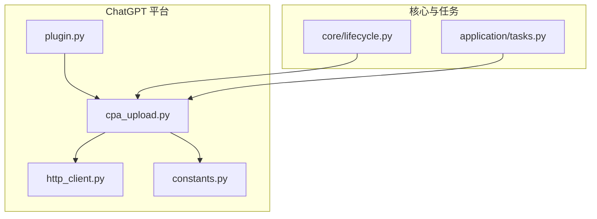
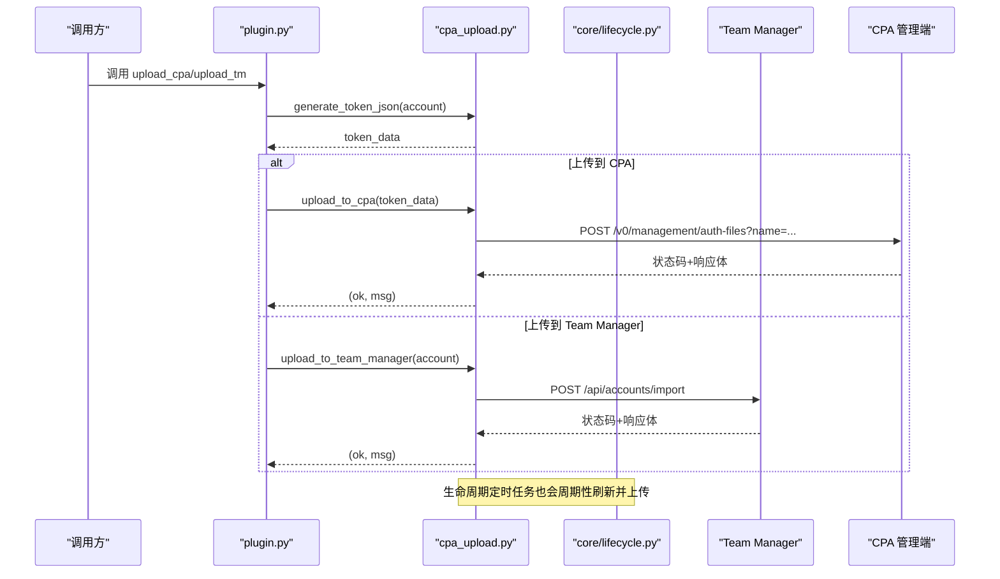
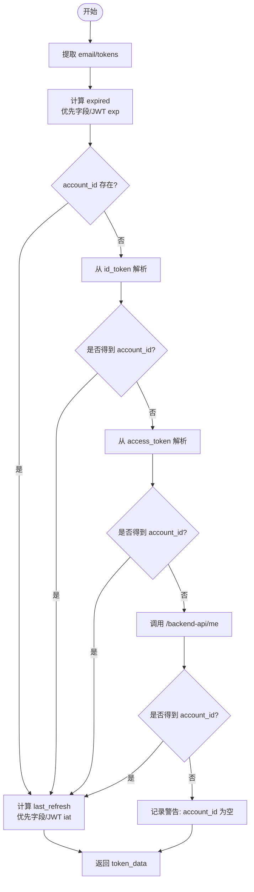
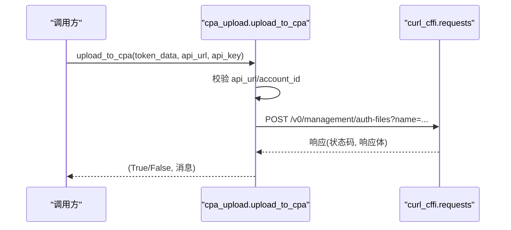
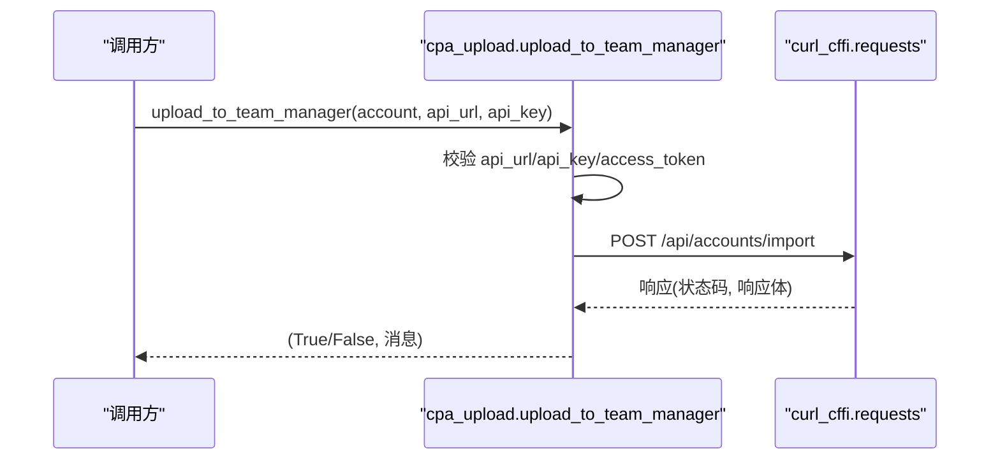
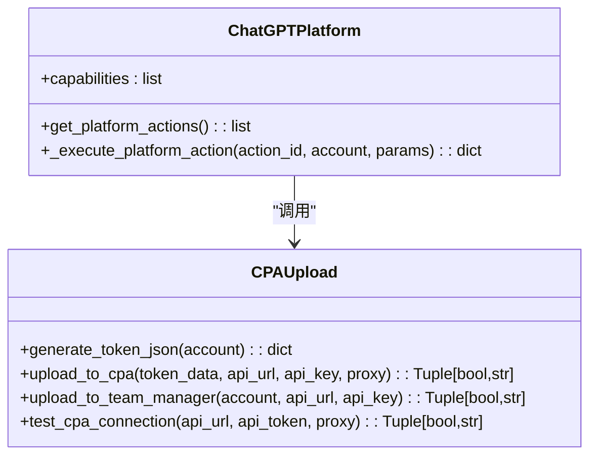
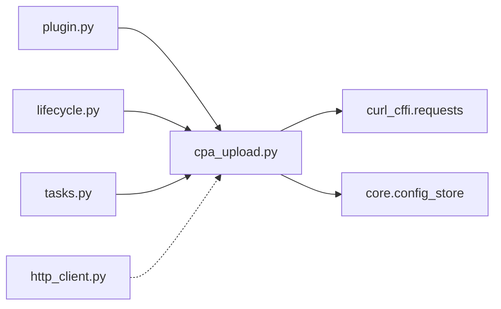

# CPA上传功能

<cite>
**本文引用的文件**
- [cpa_upload.py](file://platforms/chatgpt/cpa_upload.py)
- [plugin.py](file://platforms/chatgpt/plugin.py)
- [http_client.py](file://platforms/chatgpt/http_client.py)
- [constants.py](file://platforms/chatgpt/constants.py)
- [lifecycle.py](file://core/lifecycle.py)
- [tasks.py](file://application/tasks.py)
</cite>

## 目录
1. [简介](#简介)
2. [项目结构](#项目结构)
3. [核心组件](#核心组件)
4. [架构总览](#架构总览)
5. [详细组件分析](#详细组件分析)
6. [依赖关系分析](#依赖关系分析)
7. [性能与可靠性](#性能与可靠性)
8. [故障排除指南](#故障排除指南)
9. [结论](#结论)
10. [附录：配置与使用示例](#附录配置与使用示例)

## 简介
本文件围绕 ChatGPT 平台的 CPA（Codex Protocol API）上传能力，系统性解析其集成机制与实现细节。重点包括：
- Token 数据生成：generate_token_json 如何将账户信息转换为 CPA 系统可识别的 JSON 格式
- API 调用封装：upload_to_cpa 与 upload_to_team_manager 两个上传接口的差异、参数与错误处理
- 生命周期集成：在后台任务中自动刷新 token 并上传至 CPA/Team Manager
- 错误处理与重试策略：网络异常、状态码处理、日志与降级流程
- 配置与使用：如何启用、测试与排障

## 项目结构
CPA 上传相关代码主要位于 ChatGPT 平台插件与核心生命周期模块中：
- platforms/chatgpt/cpa_upload.py：核心实现（token 生成、上传、连接测试）
- platforms/chatgpt/plugin.py：平台动作入口（暴露 upload_cpa/upload_tm 能力）
- core/lifecycle.py：定时任务（刷新 token + CPA 同步）
- application/tasks.py：任务执行中的自动上传逻辑
- platforms/chatgpt/http_client.py：OpenAI HTTP 客户端（通用请求封装）
- platforms/chatgpt/constants.py：常量定义（端点、错误消息等）

图表来源
- [plugin.py:48-66](file://platforms/chatgpt/plugin.py#L48-L66)
- [cpa_upload.py:84-334](file://platforms/chatgpt/cpa_upload.py#L84-L334)
- [lifecycle.py:267-451](file://core/lifecycle.py#L267-L451)
- [tasks.py:470-498](file://application/tasks.py#L470-L498)

章节来源
- [plugin.py:48-66](file://platforms/chatgpt/plugin.py#L48-L66)
- [cpa_upload.py:84-334](file://platforms/chatgpt/cpa_upload.py#L84-L334)
- [lifecycle.py:267-451](file://core/lifecycle.py#L267-L451)
- [tasks.py:470-498](file://application/tasks.py#L470-L498)

## 核心组件
- generate_token_json(account)：将账户对象转换为 CPA 所需的 JSON 数据结构，包含 access_token、account_id、email、expired、id_token、last_refresh、refresh_token、type 等字段；支持从多种来源推导 account_id 与过期时间，并在缺失时尝试通过 /backend-api/me 或 session 刷新获取。
- upload_to_cpa(token_data, api_url=None, api_key=None, proxy=None)：将 token_data 以 JSON 形式 POST 到 CPA 管理端点的 auth-files 接口，文件名基于 email.json，返回 (成功标志, 消息)。
- upload_to_team_manager(account, api_url=None, api_key=None)：将账号凭证直接导入 Team Manager，使用 /api/accounts/import 接口，返回 (成功标志, 消息)。
- test_cpa_connection(api_url, api_token, proxy=None)：测试 CPA 连接可用性（OPTIONS），用于配置校验。

章节来源
- [cpa_upload.py:84-204](file://platforms/chatgpt/cpa_upload.py#L84-L204)
- [cpa_upload.py:207-260](file://platforms/chatgpt/cpa_upload.py#L207-L260)
- [cpa_upload.py:263-307](file://platforms/chatgpt/cpa_upload.py#L263-L307)
- [cpa_upload.py:310-334](file://platforms/chatgpt/cpa_upload.py#L310-L334)

## 架构总览
CPA 上传的整体流程如下：
- 触发点：平台动作（Web UI/任务）、生命周期定时任务、注册后自动任务
- 数据准备：generate_token_json 聚合账户信息与 JWT 解析结果，构造 CPA 兼容 JSON
- 上传目标：
  - CPA 管理平台：POST /v0/management/auth-files?name=xxx.json
  - Team Manager：POST /api/accounts/import
- 错误处理：统一捕获异常，记录日志，返回结构化错误消息
- 集成点：
  - plugin._execute_platform_action 暴露 upload_cpa/upload_tm 能力
  - lifecycle.refresh_and_sync_cpa 周期性刷新并上传
  - tasks 中注册成功后自动上传

图表来源
- [plugin.py:322-333](file://platforms/chatgpt/plugin.py#L322-L333)
- [cpa_upload.py:207-307](file://platforms/chatgpt/cpa_upload.py#L207-L307)
- [lifecycle.py:403-441](file://core/lifecycle.py#L403-L441)

## 详细组件分析

### generate_token_json：Token 数据生成与格式转换
- 输入：Account 对象（支持直接属性与 credentials 列表两种结构）
- 输出：dict，包含 access_token、account_id、email、expired、id_token、last_refresh、refresh_token、type="codex"
- 关键逻辑：
  - 提取 email、access_token、refresh_token、id_token、session_token
  - 计算 expired 与 last_refresh：优先使用账户字段，否则从 JWT 的 exp/iat 解析
  - 推导 account_id：
    1) 直接从账户字段或 credentials 获取
    2) 从 id_token 的 https://api.openai.com/auth.chatgpt_account_id 解析
    3) fallback 从 access_token 的同一位置解析
    4) 若仍为空，调用 /backend-api/me 获取 accounts.account_id
    5) 若仍为空，尝试用 session_token 刷新会话获取新 access_token 并解析
  - 最终若 account_id 仍为空，记录警告并继续（上传会失败）
- 复杂度：JWT 解析为 O(n)，HTTP 调用为 I/O 瓶颈；整体时间复杂度取决于网络延迟

图表来源
- [cpa_upload.py:84-204](file://platforms/chatgpt/cpa_upload.py#L84-L204)

章节来源
- [cpa_upload.py:84-204](file://platforms/chatgpt/cpa_upload.py#L84-L204)

### upload_to_cpa：上传到 CPA 管理平台
- 目的：将单个账号的 token_data 上传至 CPA 管理端点
- 参数：
  - token_data：由 generate_token_json 生成的 dict
  - api_url/api_key：可从配置读取或直接传入
- 行为：
  - 校验 api_url 与 account_id
  - 构建 URL：{api_url}/v0/management/auth-files?name={email}.json
  - 发送 POST，Content-Type: application/json，Authorization: Bearer {api_key}
  - 接受状态码 200/201/207 为成功
  - 错误处理：解析响应体 message，或截取前 200 字符文本；异常捕获并记录日志
- 注意：不走代理（proxies=None），固定超时 30s，模拟浏览器指纹 impersonate="chrome110"

图表来源
- [cpa_upload.py:207-260](file://platforms/chatgpt/cpa_upload.py#L207-L260)

章节来源
- [cpa_upload.py:207-260](file://platforms/chatgpt/cpa_upload.py#L207-L260)

### upload_to_team_manager：上传到 Team Manager
- 目的：将账号凭证直接导入 Team Manager
- 参数：
  - account：账户对象（需包含 email、access_token、可选 session_token/refresh_token/client_id）
  - api_url/api_key：可从配置读取或直接传入
- 行为：
  - 校验 api_url 与 api_key
  - 构建 payload：import_type=single，携带 email、access_token、session_token、refresh_token、client_id
  - 发送 POST 到 {api_url}/api/accounts/import，Header: X-API-Key
  - 接受状态码 200/201 为成功
  - 错误处理：解析响应体 message，或截取前 200 字符文本；异常捕获并记录日志
- 注意：不走代理（proxies=None），固定超时 30s，模拟浏览器指纹 impersonate="chrome110"

图表来源
- [cpa_upload.py:263-307](file://platforms/chatgpt/cpa_upload.py#L263-L307)

章节来源
- [cpa_upload.py:263-307](file://platforms/chatgpt/cpa_upload.py#L263-L307)

### 平台动作与生命周期集成
- 平台动作：
  - plugin.get_platform_actions 暴露 upload_cpa 与 upload_tm 能力，参数包含 api_url 与 api_key
  - _execute_platform_action 根据 action_id 调用对应上传函数
- 生命周期：
  - refresh_and_sync_cpa 定期刷新 token、检查存活、重新上传 CPA
  - 在循环中按间隔触发 CPA 同步任务

图表来源
- [plugin.py:227-333](file://platforms/chatgpt/plugin.py#L227-L333)
- [cpa_upload.py:84-334](file://platforms/chatgpt/cpa_upload.py#L84-L334)

章节来源
- [plugin.py:227-333](file://platforms/chatgpt/plugin.py#L227-L333)
- [lifecycle.py:267-451](file://core/lifecycle.py#L267-L451)

## 依赖关系分析
- cpa_upload.py 依赖：
  - curl_cffi.requests：HTTP 客户端
  - core.config_store：读取配置（cpa_api_url、cpa_api_key、team_manager_url、team_manager_key）
  - datetime/timezone：时间格式化与转换
- plugin.py 依赖：
  - core.base_platform：平台基类与能力框架
  - 其他 ChatGPT 子模块（支付、切换桌面等）
- lifecycle.py 依赖：
  - curl_cffi.requests：HTTP 客户端
  - 内部工具函数：JWT 解码、时间格式化
- http_client.py 提供 OpenAI 专用 HTTP 客户端（非 CPA 上传主路径，但体现通用请求封装风格）

图表来源
- [cpa_upload.py:1-15](file://platforms/chatgpt/cpa_upload.py#L1-L15)
- [plugin.py:1-10](file://platforms/chatgpt/plugin.py#L1-L10)
- [lifecycle.py:267-286](file://core/lifecycle.py#L267-L286)
- [tasks.py:470-498](file://application/tasks.py#L470-L498)
- [http_client.py:1-47](file://platforms/chatgpt/http_client.py#L1-L47)

章节来源
- [cpa_upload.py:1-15](file://platforms/chatgpt/cpa_upload.py#L1-L15)
- [plugin.py:1-10](file://platforms/chatgpt/plugin.py#L1-L10)
- [lifecycle.py:267-286](file://core/lifecycle.py#L267-L286)
- [tasks.py:470-498](file://application/tasks.py#L470-L498)
- [http_client.py:1-47](file://platforms/chatgpt/http_client.py#L1-L47)

## 性能与可靠性
- 性能特性：
  - 所有上传均禁用代理（proxies=None），减少额外跳板开销
  - 固定超时 30s，避免长时间阻塞
  - 使用 impersonate="chrome110" 模拟浏览器指纹，提高兼容性
  - 批量场景下（lifecycle）采用顺序处理与短暂休眠（time.sleep(0.5)）降低并发压力
- 可靠性策略：
  - 严格的状态码判断（200/201/207 视为成功）
  - 错误响应体解析：优先取 message 字段，否则截取前 200 字符
  - 异常捕获与日志记录：便于定位问题
  - 多源 fallback 获取 account_id：提升成功率
- 优化建议：
  - 增加指数退避重试（当前未实现）
  - 对网络异常进行分类重试（连接超时 vs 服务器错误）
  - 增加速率限制与并发控制（针对大量账号）

[本节为通用指导，不直接分析具体文件]

## 故障排除指南
- 常见问题与排查步骤：
  - CPA API URL 未配置：确保配置项 cpa_api_url 已设置
  - account_id 为空：检查 JWT 解析与 /backend-api/me 调用；确认 access_token/id_token/session_token 有效
  - 上传失败（HTTP 状态码非 200/201/207）：查看响应体 message；检查 CPA 服务端状态与权限
  - 连接测试失败：使用 test_cpa_connection 验证连通性与 API Token 有效性
  - Team Manager 上传失败：确认 api_key 与 /api/accounts/import 端点可用；检查 payload 字段完整性
- 日志定位：
  - 搜索 "[CPA]" 日志关键字，关注 account_id 解析过程与上传状态码
  - 关注异常堆栈与错误消息，结合网络环境（防火墙/代理/证书）排查

章节来源
- [cpa_upload.py:214-260](file://platforms/chatgpt/cpa_upload.py#L214-L260)
- [cpa_upload.py:310-334](file://platforms/chatgpt/cpa_upload.py#L310-L334)
- [lifecycle.py:403-441](file://core/lifecycle.py#L403-L441)

## 结论
CPA 上传功能通过 generate_token_json 实现了灵活的账户信息到 CPA 格式的转换，并通过 upload_to_cpa 与 upload_to_team_manager 提供了两套上传路径，分别面向不同的管理系统。系统在错误处理与日志记录方面较为完善，具备较强的健壮性。建议在后续版本中引入重试机制与更细粒度的错误分类，以提升大规模场景下的稳定性与可观测性。

[本节为总结，不直接分析具体文件]

## 附录：配置与使用示例
- 配置项（可通过配置存储设置）：
  - cpa_api_url：CPA 管理平台 API 地址
  - cpa_api_key：CPA 管理平台 API Key
  - team_manager_url：Team Manager API 地址
  - team_manager_key：Team Manager API Key
- 使用方式：
  - 平台动作：通过 Web UI 或任务调用 upload_cpa/upload_tm，传入 api_url 与 api_key
  - 生命周期：开启 CPA 同步周期任务，自动刷新并上传
  - 手动测试：使用 test_cpa_connection 验证连接
- 注意事项：
  - 确保 access_token 有效且未被吊销
  - 确保 CPA/Team Manager 服务端可达且权限正确
  - 注意时间戳格式与时区（+08:00）

章节来源
- [cpa_upload.py:32-37](file://platforms/chatgpt/cpa_upload.py#L32-L37)
- [plugin.py:239-248](file://platforms/chatgpt/plugin.py#L239-L248)
- [lifecycle.py:466-477](file://core/lifecycle.py#L466-L477)