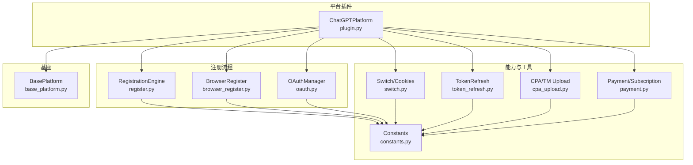
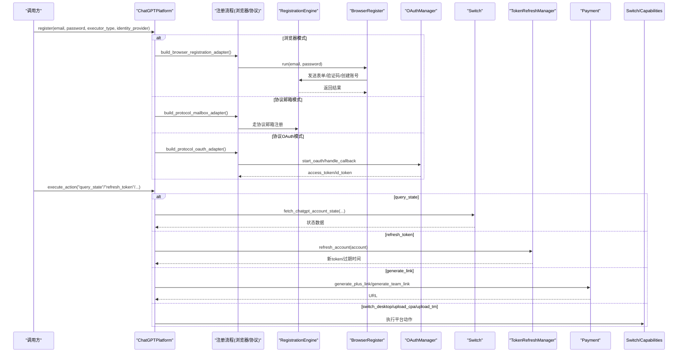
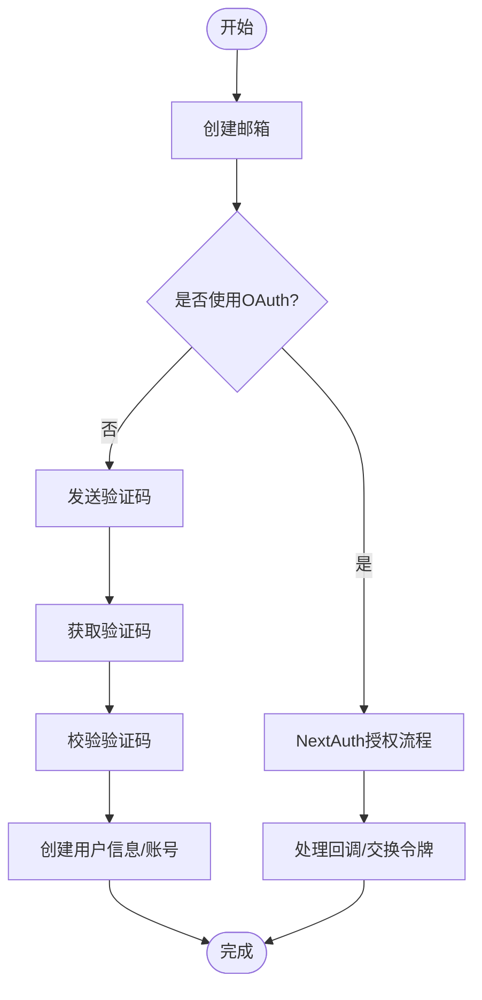
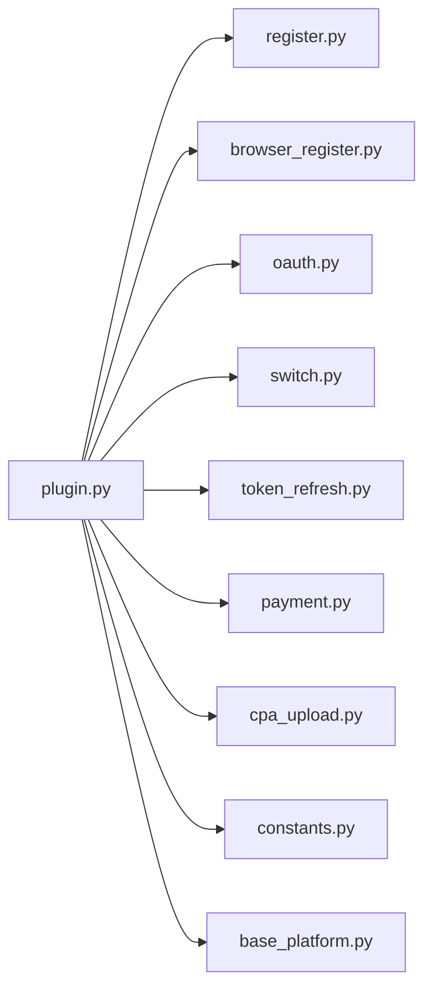

# ChatGPT平台实现

<cite>
**本文引用的文件**   
- [plugin.py](file://platforms/chatgpt/plugin.py)
- [register.py](file://platforms/chatgpt/register.py)
- [browser_register.py](file://platforms/chatgpt/browser_register.py)
- [oauth.py](file://platforms/chatgpt/oauth.py)
- [cpa_upload.py](file://platforms/chatgpt/cpa_upload.py)
- [switch.py](file://platforms/chatgpt/switch.py)
- [token_refresh.py](file://platforms/chatgpt/token_refresh.py)
- [payment.py](file://platforms/chatgpt/payment.py)
- [constants.py](file://platforms/chatgpt/constants.py)
- [base_platform.py](file://core/base_platform.py)
</cite>

## 目录
1. [简介](#简介)
2. [项目结构](#项目结构)
3. [核心组件](#核心组件)
4. [架构总览](#架构总览)
5. [详细组件分析](#详细组件分析)
6. [依赖关系分析](#依赖关系分析)
7. [性能与稳定性](#性能与稳定性)
8. [故障排查指南](#故障排查指南)
9. [结论](#结论)
10. [附录：代码示例路径](#附录代码示例路径)

## 简介
本文件面向“ChatGPT平台适配器”的完整实现，系统性解析注册流程（浏览器自动化、OAuth登录、协议邮箱模式）、能力声明与实现（query_state、refresh_token、generate_link、switch_desktop、upload_cpa、upload_tm），以及高级特性（CPA上传、Team Manager集成、桌面应用切换）。同时覆盖密码生成策略、代理池管理、订阅状态检查等关键逻辑，并提供常见问题定位与优化建议。

## 项目结构
ChatGPT平台适配位于 platforms/chatgpt 目录，围绕以下职责划分：
- 平台插件与能力编排：plugin.py
- 注册引擎与流程控制：register.py
- 浏览器自动化注册：browser_register.py
- OAuth授权与回调处理：oauth.py
- CPA与Team Manager上传：cpa_upload.py
- 本地桌面端Codex切换与状态查询：switch.py
- Token刷新与校验：token_refresh.py
- 支付链接生成与订阅状态检测：payment.py
- 常量与端点定义：constants.py
- 平台基类与能力调度：base_platform.py

图表来源
- [plugin.py:48-225](file://platforms/chatgpt/plugin.py#L48-L225)
- [register.py:187-245](file://platforms/chatgpt/register.py#L187-L245)
- [browser_register.py:1-100](file://platforms/chatgpt/browser_register.py#L1-L100)
- [oauth.py:180-379](file://platforms/chatgpt/oauth.py#L180-L379)
- [switch.py:180-403](file://platforms/chatgpt/switch.py#L180-L403)
- [token_refresh.py:37-339](file://platforms/chatgpt/token_refresh.py#L37-L339)
- [cpa_upload.py:84-334](file://platforms/chatgpt/cpa_upload.py#L84-L334)
- [payment.py:199-379](file://platforms/chatgpt/payment.py#L199-L379)
- [constants.py:53-97](file://platforms/chatgpt/constants.py#L53-L97)
- [base_platform.py:44-160](file://core/base_platform.py#L44-L160)

章节来源
- [plugin.py:48-225](file://platforms/chatgpt/plugin.py#L48-L225)
- [base_platform.py:44-160](file://core/base_platform.py#L44-L160)

## 核心组件
- ChatGPTPlatform（平台插件）
  - 声明能力：query_state、refresh_token、generate_link、switch_desktop、upload_cpa、upload_tm
  - 支持执行器：protocol、headless、headed
  - 支持身份模式：mailbox、oauth_browser
  - 提供注册适配器构建：浏览器注册、协议邮箱、协议OAuth
  - 实现能力处理器：query_state、refresh_token、generate_link；自定义动作：switch_desktop、upload_cpa、upload_tm
- RegistrationEngine（注册引擎）
  - 协调邮箱服务、OpenAI API调用、Sentinel PoW防护、验证码收发与校验、账号创建与后续流程
- BrowserRegister（浏览器自动化）
  - 基于Camoufox/Playwright完成页面交互、国家选择、OTP输入、OAuth同意页处理等
- OAuthManager（OAuth）
  - 生成授权URL、处理回调、交换令牌、提取账户信息
- Switch（桌面端切换）
  - 读写Codex Chromium Cookies数据库，关闭/重启应用，读取当前账号状态
- TokenRefreshManager（Token刷新）
  - 通过Session Token或OAuth Refresh Token刷新access_token，并验证有效性
- Payment（支付与订阅）
  - 生成Plus/Team支付链接，无痕打开浏览器注入Cookie，检测订阅状态
- Constants（常量）
  - OpenAI/OAuth/Sentinel端点、页面类型、密码字符集、默认配置等

章节来源
- [plugin.py:48-225](file://platforms/chatgpt/plugin.py#L48-L225)
- [register.py:187-245](file://platforms/chatgpt/register.py#L187-L245)
- [browser_register.py:1-100](file://platforms/chatgpt/browser_register.py#L1-L100)
- [oauth.py:180-379](file://platforms/chatgpt/oauth.py#L180-L379)
- [switch.py:180-403](file://platforms/chatgpt/switch.py#L180-L403)
- [token_refresh.py:37-339](file://platforms/chatgpt/token_refresh.py#L37-L339)
- [payment.py:199-379](file://platforms/chatgpt/payment.py#L199-L379)
- [constants.py:53-97](file://platforms/chatgpt/constants.py#L53-L97)

## 架构总览
ChatGPT平台适配器以BasePlatform为基座，通过ChatGPTPlatform暴露统一注册入口与能力接口。注册流程根据executor_type和identity_provider自动选择：
- 浏览器模式（headless/headed）：使用BrowserRegistrationAdapter驱动browser_register.py
- 协议邮箱模式（protocol + mailbox）：使用ProtocolMailboxAdapter驱动protocol_mailbox工作流
- 协议OAuth模式（protocol + oauth_browser）：使用ProtocolOAuthAdapter驱动browser_oauth流程

能力层将标准能力（query_state、refresh_token、generate_link）与平台特定动作（switch_desktop、upload_cpa、upload_tm）统一接入execute_action分发。

图表来源
- [plugin.py:124-225](file://platforms/chatgpt/plugin.py#L124-L225)
- [register.py:187-245](file://platforms/chatgpt/register.py#L187-L245)
- [oauth.py:180-379](file://platforms/chatgpt/oauth.py#L180-L379)
- [switch.py:335-403](file://platforms/chatgpt/switch.py#L335-L403)
- [token_refresh.py:208-243](file://platforms/chatgpt/token_refresh.py#L208-L243)
- [payment.py:199-379](file://platforms/chatgpt/payment.py#L199-L379)

## 详细组件分析

### 平台插件与能力声明（ChatGPTPlatform）
- 能力声明：query_state、refresh_token、generate_link、switch_desktop、upload_cpa、upload_tm
- 注册适配器：
  - 浏览器注册：构造BrowserRegistrationAdapter，绑定ChatGPTBrowserRegister
  - 协议邮箱：构造ProtocolMailboxAdapter，绑定ChatGPTProtocolMailboxWorker
  - 协议OAuth：构造ProtocolOAuthAdapter，绑定browser_oauth流程
- 能力处理器：
  - query_state：调用switch.fetch_chatgpt_account_state，附加本地桌面状态
  - refresh_token：调用TokenRefreshManager.refresh_account
  - generate_link：调用payment.generate_plus_link/generate_team_link，并通过open_url_incognito注入Cookie打开
- 平台动作：
  - switch_desktop：关闭/写入Cookies/重启Codex，并拉取远程状态
  - upload_cpa：生成token JSON并上传至CPA
  - upload_tm：直接上传到Team Manager

```mermaid
classDiagram
class BasePlatform {
+capabilities : list
+register(...)
+execute_action(...)
+get_platform_actions()
}
class ChatGPTPlatform {
+capabilities : list
+build_browser_registration_adapter()
+build_protocol_mailbox_adapter()
+build_protocol_oauth_adapter()
+_handle_query_state(...)
+_handle_refresh_token(...)
+_handle_generate_link(...)
+_execute_platform_action(...)
}
BasePlatform <|-- ChatGPTPlatform
```

图表来源
- [base_platform.py:44-160](file://core/base_platform.py#L44-L160)
- [plugin.py:48-225](file://platforms/chatgpt/plugin.py#L48-L225)

章节来源
- [plugin.py:48-225](file://platforms/chatgpt/plugin.py#L48-L225)
- [base_platform.py:44-160](file://core/base_platform.py#L44-L160)

### 注册流程引擎（RegistrationEngine）
- 负责邮箱创建、OAuth启动、Sentinel PoW防护、验证码发送/校验、用户信息创建、账号创建等
- 密码生成策略：确保包含小写、数字、符号，避免纯字母数字导致被拒
- Sentinel防护：动态生成p/t/c令牌，必要时求解PoW与Turnstile dx
- 已注册账号检测：通过page.type判断email_otp_verification，自动切换到登录流程

图表来源
- [register.py:187-245](file://platforms/chatgpt/register.py#L187-L245)
- [register.py:274-287](file://platforms/chatgpt/register.py#L274-L287)
- [register.py:331-392](file://platforms/chatgpt/register.py#L331-L392)
- [register.py:483-549](file://platforms/chatgpt/register.py#L483-L549)
- [register.py:673-752](file://platforms/chatgpt/register.py#L673-L752)
- [register.py:754-800](file://platforms/chatgpt/register.py#L754-L800)

章节来源
- [register.py:187-245](file://platforms/chatgpt/register.py#L187-L245)
- [register.py:274-287](file://platforms/chatgpt/register.py#L274-L287)
- [register.py:331-392](file://platforms/chatgpt/register.py#L331-L392)
- [register.py:483-549](file://platforms/chatgpt/register.py#L483-L549)
- [register.py:673-752](file://platforms/chatgpt/register.py#L673-L752)
- [register.py:754-800](file://platforms/chatgpt/register.py#L754-L800)

### 浏览器自动化注册（BrowserRegister）
- 使用Camoufox/Playwright模拟真实浏览器行为
- 多策略国家选择：原生select设置、React Aria key操作、Playwright selectOption、UI点击+键盘搜索
- 输入填充与提交：兼容多种input选择器与表单提交方式
- 错误提示收集：从可见文本与alert中抽取错误信息
- 一次性验证码登录：在登录页优先选择passwordless选项

章节来源
- [browser_register.py:1-100](file://platforms/chatgpt/browser_register.py#L1-L100)
- [browser_register.py:190-516](file://platforms/chatgpt/browser_register.py#L190-L516)
- [browser_register.py:532-768](file://platforms/chatgpt/browser_register.py#L532-L768)

### OAuth授权（OAuthManager）
- 生成PKCE授权URL，支持不同client_id（ChatGPT Web vs Codex CLI）
- 处理回调URL，校验state，交换access_token/refresh_token/id_token
- 从id_token解析account_id与email

章节来源
- [oauth.py:180-379](file://platforms/chatgpt/oauth.py#L180-L379)

### 桌面端切换与状态（Switch）
- 读取/写入Codex Chromium Cookies数据库，更新session token
- 关闭/重启Codex应用，跨平台支持（macOS/Windows/Linux）
- 查询本地桌面状态与远程账号状态（backend-api/me）

章节来源
- [switch.py:180-403](file://platforms/chatgpt/switch.py#L180-L403)

### Token刷新（TokenRefreshManager）
- 两种刷新方式：Session Token刷新（优先）、OAuth Refresh Token刷新
- 验证access_token有效性（调用backend-api/me）
- 支持批量刷新与数据库更新（封装函数）

章节来源
- [token_refresh.py:37-339](file://platforms/chatgpt/token_refresh.py#L37-L339)

### 支付链接与订阅状态（Payment）
- 生成Plus/Team支付链接，携带cookie/device-id，返回checkout session URL
- 无痕打开浏览器并注入Cookie，保持窗口供用户操作
- 订阅状态检测：优先从backend-api/me解析，回退到wham/usage

章节来源
- [payment.py:199-379](file://platforms/chatgpt/payment.py#L199-L379)

### CPA与Team Manager上传（CPA Upload）
- 生成CPA格式的token JSON，多重fallback获取account_id（JWT解析、/backend-api/me、session刷新）
- 上传到CPA管理平台（直连，不走代理）
- 上传到Team Manager（直连，不走代理）

章节来源
- [cpa_upload.py:84-334](file://platforms/chatgpt/cpa_upload.py#L84-L334)

## 依赖关系分析
- ChatGPTPlatform依赖：
  - 注册流程：register.py、browser_register.py、oauth.py
  - 能力实现：switch.py、token_refresh.py、payment.py、cpa_upload.py
  - 常量：constants.py
  - 基类：base_platform.py
- 内部耦合：
  - plugin.py作为编排中心，集中调用各模块能力
  - register.py与browser_register.py共享constants中的端点与页面类型
  - switch.py与payment.py均可能调用backend-api/me获取状态
- 外部依赖：
  - curl_cffi用于HTTP请求（带浏览器指纹）
  - Camoufox/Playwright用于浏览器自动化
  - SQLite用于读写Codex Cookies数据库

图表来源
- [plugin.py:48-225](file://platforms/chatgpt/plugin.py#L48-L225)
- [register.py:187-245](file://platforms/chatgpt/register.py#L187-L245)
- [browser_register.py:1-100](file://platforms/chatgpt/browser_register.py#L1-L100)
- [oauth.py:180-379](file://platforms/chatgpt/oauth.py#L180-L379)
- [switch.py:180-403](file://platforms/chatgpt/switch.py#L180-L403)
- [token_refresh.py:37-339](file://platforms/chatgpt/token_refresh.py#L37-L339)
- [payment.py:199-379](file://platforms/chatgpt/payment.py#L199-L379)
- [cpa_upload.py:84-334](file://platforms/chatgpt/cpa_upload.py#L84-L334)
- [constants.py:53-97](file://platforms/chatgpt/constants.py#L53-L97)
- [base_platform.py:44-160](file://core/base_platform.py#L44-L160)

章节来源
- [plugin.py:48-225](file://platforms/chatgpt/plugin.py#L48-L225)

## 性能与稳定性
- 代理池管理
  - check_valid中按region尝试代理，成功/失败后上报proxy_pool，提升可用代理命中率
- 密码生成策略
  - 强制包含大小写字母、数字、符号，降低被拒绝概率
- Sentinel PoW与Turnstile
  - 动态生成p/t/c，必要时求解PoW与dx，提高通过率
- 浏览器自动化
  - 多策略国家选择与输入填充，增强鲁棒性
- 订阅状态检测
  - 优先backend-api/me，回退wham/usage，保证可用性
- 桌面端切换
  - 直接写入Cookies数据库，避免重复登录开销

[本节为通用指导，不直接分析具体文件]

## 故障排查指南
- 注册失败
  - 检查Sentinel PoW是否成功求解，查看日志中的flow与t值
  - 确认邮箱服务可用，验证码正则匹配正确
  - 如检测到已注册账号，自动切换到登录流程
- OAuth回调异常
  - 校验state是否匹配，code_verifier是否正确
  - 检查redirect_uri与scope配置
- 桌面端切换失败
  - 确认Codex安装路径与进程名，检查Cookies数据库是否存在
  - 确保session_token有效，必要时先刷新
- Token刷新失败
  - 优先尝试Session Token刷新，再回退OAuth Refresh Token
  - 验证access_token是否有效（backend-api/me）
- 支付链接生成失败
  - 检查access_token与cookies是否完整，country与currency映射是否正确
  - 若playwright不可用，会回退系统浏览器无痕打开

章节来源
- [register.py:483-549](file://platforms/chatgpt/register.py#L483-L549)
- [oauth.py:240-320](file://platforms/chatgpt/oauth.py#L240-L320)
- [switch.py:180-245](file://platforms/chatgpt/switch.py#L180-L245)
- [token_refresh.py:208-243](file://platforms/chatgpt/token_refresh.py#L208-L243)
- [payment.py:199-324](file://platforms/chatgpt/payment.py#L199-L324)

## 结论
ChatGPT平台适配器通过统一的平台插件抽象，实现了多模式注册（浏览器、协议邮箱、协议OAuth）、丰富的能力扩展（状态查询、Token刷新、支付链接、桌面切换、CPA/TM上传），并在稳定性与鲁棒性上做了大量工程化设计（Sentinel PoW、多策略浏览器交互、代理池管理、订阅状态回退）。该实现既满足自动化注册需求，又兼顾了生产环境的可靠性与可维护性。

[本节为总结，不直接分析具体文件]

## 附录：代码示例路径
- 浏览器注册流程入口与适配器构建
  - [plugin.py:160-177](file://platforms/chatgpt/plugin.py#L160-L177)
  - [browser_register.py:1-100](file://platforms/chatgpt/browser_register.py#L1-L100)
- 协议邮箱注册适配器
  - [plugin.py:185-225](file://platforms/chatgpt/plugin.py#L185-L225)
- 协议OAuth注册适配器
  - [plugin.py:179-183](file://platforms/chatgpt/plugin.py#L179-L183)
  - [oauth.py:180-379](file://platforms/chatgpt/oauth.py#L180-L379)
- 密码生成策略
  - [plugin.py:27-45](file://platforms/chatgpt/plugin.py#L27-L45)
  - [register.py:274-287](file://platforms/chatgpt/register.py#L274-L287)
- 代理池管理与订阅状态检查
  - [plugin.py:72-120](file://platforms/chatgpt/plugin.py#L72-L120)
  - [payment.py:327-379](file://platforms/chatgpt/payment.py#L327-L379)
- 桌面端切换
  - [plugin.py:274-320](file://platforms/chatgpt/plugin.py#L274-L320)
  - [switch.py:180-245](file://platforms/chatgpt/switch.py#L180-L245)
- CPA与Team Manager上传
  - [plugin.py:322-333](file://platforms/chatgpt/plugin.py#L322-L333)
  - [cpa_upload.py:207-334](file://platforms/chatgpt/cpa_upload.py#L207-L334)
- Token刷新
  - [plugin.py:361-389](file://platforms/chatgpt/plugin.py#L361-L389)
  - [token_refresh.py:208-243](file://platforms/chatgpt/token_refresh.py#L208-L243)
- 支付链接生成
  - [plugin.py:391-420](file://platforms/chatgpt/plugin.py#L391-L420)
  - [payment.py:199-324](file://platforms/chatgpt/payment.py#L199-L324)