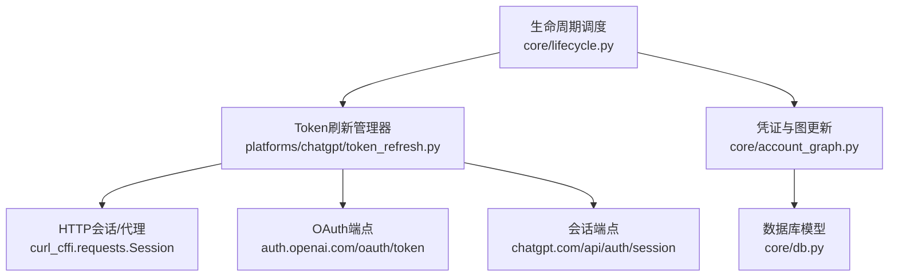
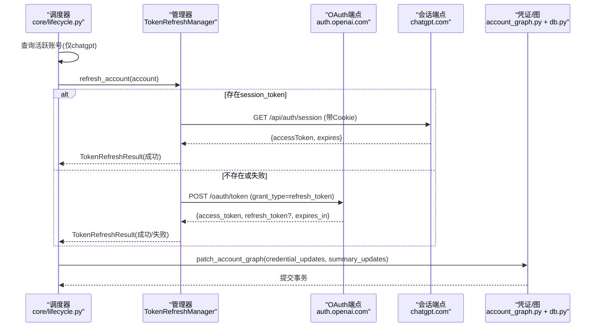
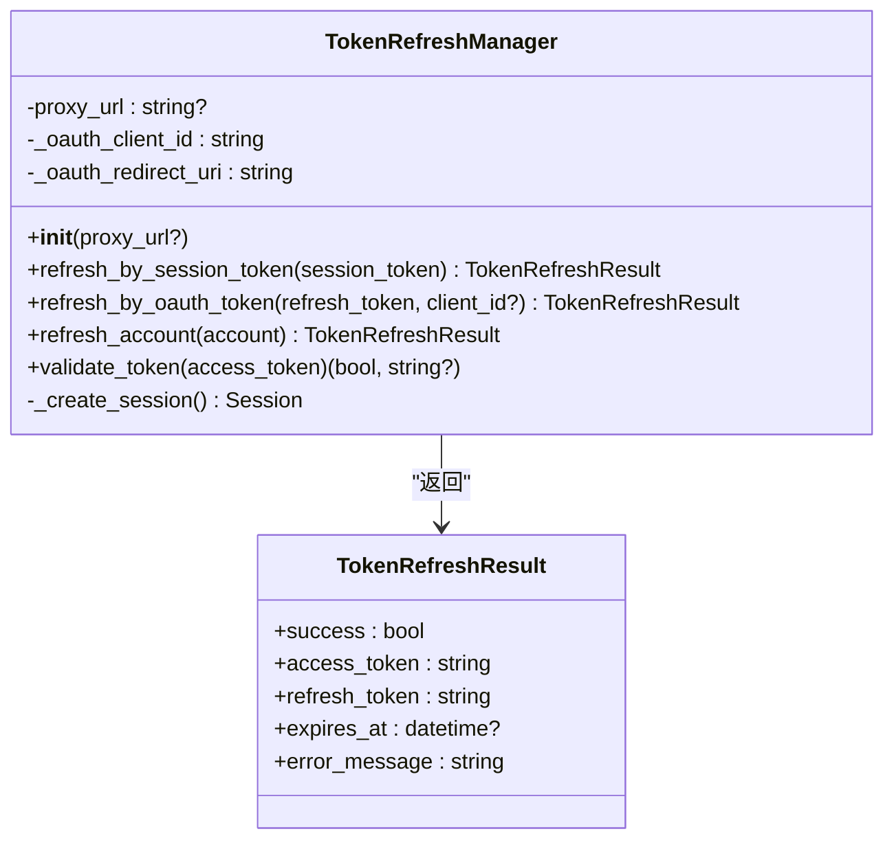
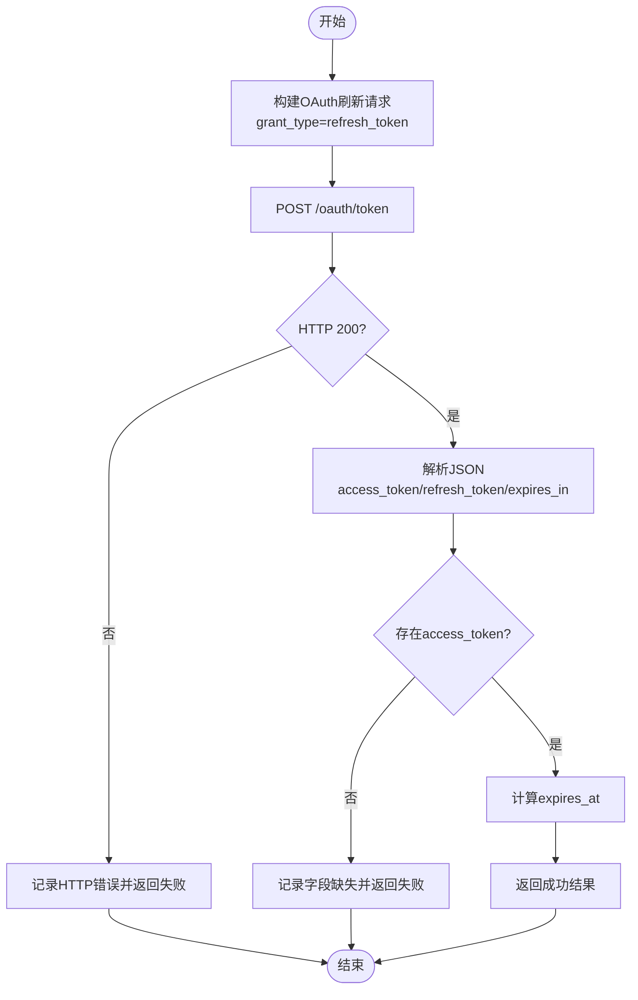
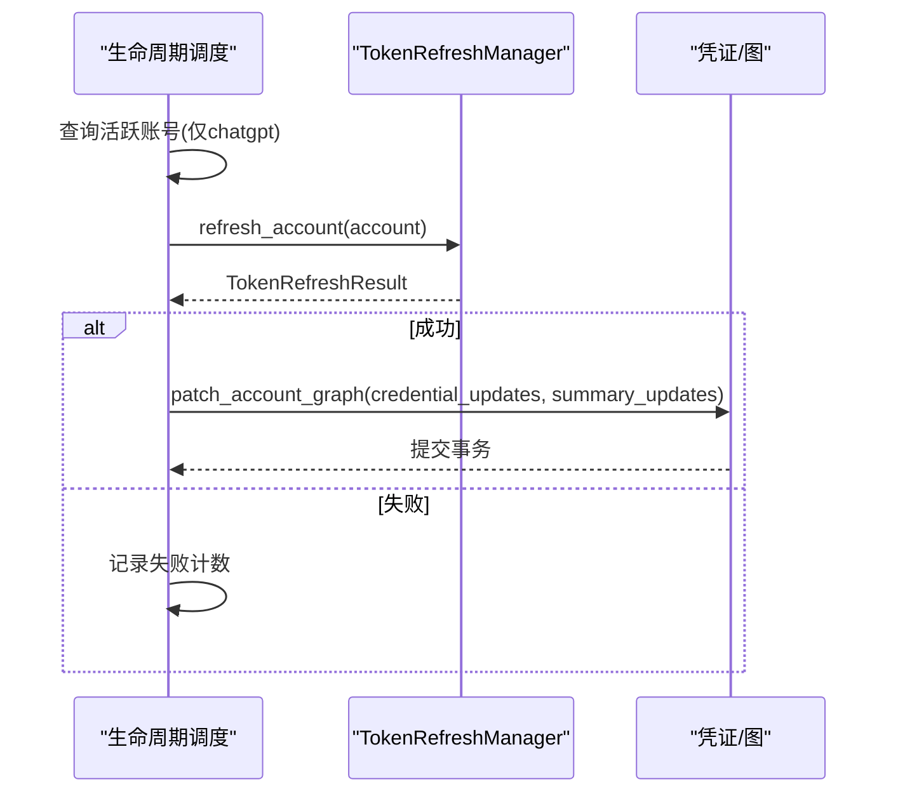
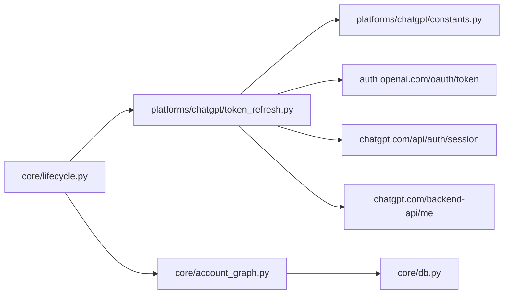

# Token刷新管理

<cite>
**本文引用的文件**
- [platforms/chatgpt/token_refresh.py](file://platforms/chatgpt/token_refresh.py)
- [core/lifecycle.py](file://core/lifecycle.py)
- [platforms/chatgpt/constants.py](file://platforms/chatgpt/constants.py)
- [core/db.py](file://core/db.py)
- [core/account_graph.py](file://core/account_graph.py)
</cite>

## 目录
1. [简介](#简介)
2. [项目结构](#项目结构)
3. [核心组件](#核心组件)
4. [架构总览](#架构总览)
5. [详细组件分析](#详细组件分析)
6. [依赖关系分析](#依赖关系分析)
7. [性能与并发考量](#性能与并发考量)
8. [故障排查指南](#故障排查指南)
9. [结论](#结论)
10. [附录：集成示例与最佳实践](#附录：集成示例与最佳实践)

## 简介
本文件聚焦 ChatGPT 平台的 Token 刷新管理，围绕 TokenRefreshManager 类展开，系统阐述 access_token 与 refresh_token 的自动刷新机制、OAuth2.0 标准刷新流程（请求构造、响应解析、错误处理）、Token 失效检测与自动续期策略、多账户并发安全与数据一致性保障，并提供集成与异常处理的完整指引。同时给出存储安全、刷新频率控制与性能优化建议。

## 项目结构
与 Token 刷新相关的代码主要分布在以下位置：
- 平台实现层：platforms/chatgpt/token_refresh.py 提供 TokenRefreshManager 及工具函数
- 生命周期调度层：core/lifecycle.py 负责批量扫描即将过期的账号并触发刷新
- 配置常量：platforms/chatgpt/constants.py 定义 OAuth 客户端 ID、回调地址等
- 数据模型与凭证存储：core/db.py 与 core/account_graph.py 定义账号、凭证与图结构的持久化

图表来源
- [core/lifecycle.py:104-193](file://core/lifecycle.py#L104-L193)
- [platforms/chatgpt/token_refresh.py:37-243](file://platforms/chatgpt/token_refresh.py#L37-L243)
- [core/account_graph.py:908-939](file://core/account_graph.py#L908-L939)
- [core/db.py:25-73](file://core/db.py#L25-L73)

章节来源
- [core/lifecycle.py:104-193](file://core/lifecycle.py#L104-L193)
- [platforms/chatgpt/token_refresh.py:37-243](file://platforms/chatgpt/token_refresh.py#L37-L243)
- [platforms/chatgpt/constants.py:53-64](file://platforms/chatgpt/constants.py#L53-L64)
- [core/account_graph.py:908-939](file://core/account_graph.py#L908-L939)
- [core/db.py:25-73](file://core/db.py#L25-L73)

## 核心组件
- TokenRefreshManager：封装两种刷新路径（Session Token 与 OAuth Refresh Token），提供统一接口与结果对象
- TokenRefreshResult：标准化刷新结果（成功标志、新令牌、过期时间、错误信息）
- 生命周期调度器 refresh_expiring_tokens：按平台过滤、状态筛选、批量刷新并落库
- 凭证与图持久化：通过 account_graph.patch_account_graph 将刷新后的凭证写入数据库

章节来源
- [platforms/chatgpt/token_refresh.py:27-243](file://platforms/chatgpt/token_refresh.py#L27-L243)
- [core/lifecycle.py:104-193](file://core/lifecycle.py#L104-L193)
- [core/account_graph.py:908-939](file://core/account_graph.py#L908-L939)

## 架构总览
下图展示了从生命周期调度到具体刷新实现的调用链，以及数据落库过程。

图表来源
- [core/lifecycle.py:104-193](file://core/lifecycle.py#L104-L193)
- [platforms/chatgpt/token_refresh.py:66-243](file://platforms/chatgpt/token_refresh.py#L66-L243)
- [core/account_graph.py:908-939](file://core/account_graph.py#L908-L939)
- [core/db.py:25-73](file://core/db.py#L25-L73)

## 详细组件分析

### TokenRefreshManager 类
职责
- 创建 HTTP 会话（支持代理与浏览器指纹伪装）
- Session Token 刷新：通过设置 Cookie 访问会话端点获取 access_token 与过期时间
- OAuth Refresh Token 刷新：按 OAuth2.0 标准使用 refresh_token 换取新的 access_token（可能返回新的 refresh_token）
- 统一入口 refresh_account：优先尝试 Session Token，失败再尝试 OAuth
- 验证 access_token：调用后端接口判断是否有效或已过期/被封禁

关键要点
- 会话端点：https://chatgpt.com/api/auth/session
- OAuth 端点：https://auth.openai.com/oauth/token
- OAuth 参数来自 constants：client_id、redirect_uri
- 结果对象 TokenRefreshResult 包含 success、access_token、refresh_token、expires_at、error_message

图表来源
- [platforms/chatgpt/token_refresh.py:27-243](file://platforms/chatgpt/token_refresh.py#L27-L243)

章节来源
- [platforms/chatgpt/token_refresh.py:37-243](file://platforms/chatgpt/token_refresh.py#L37-L243)
- [platforms/chatgpt/constants.py:53-64](file://platforms/chatgpt/constants.py#L53-L64)

### OAuth2.0 刷新流程（请求构造、响应解析、错误处理）
- 请求构造
  - grant_type=refresh_token
  - 携带 client_id、refresh_token、redirect_uri
  - Content-Type 为 application/x-www-form-urlencoded
- 响应解析
  - 提取 access_token、可选 refresh_token、expires_in
  - 计算 expires_at = now_utc + expires_in
- 错误处理
  - HTTP 非 200：记录错误并返回失败
  - 缺少 access_token：记录警告并返回失败
  - 网络/解析异常：捕获并记录错误

图表来源
- [platforms/chatgpt/token_refresh.py:134-206](file://platforms/chatgpt/token_refresh.py#L134-L206)

章节来源
- [platforms/chatgpt/token_refresh.py:134-206](file://platforms/chatgpt/token_refresh.py#L134-L206)

### Token 失效检测与自动续期策略
- 失效检测
  - validate_token：通过调用后端接口判断 access_token 是否有效；根据状态码区分无效/过期/封禁
- 自动续期
  - refresh_expiring_tokens：按平台过滤（当前仅 chatgpt）、状态过滤（registered/trial/subscribed），读取 credentials 中的 session_token/refresh_token，调用 manager.refresh_account
  - 成功后通过 patch_account_graph 更新凭证与摘要（last_refresh_at、refresh_success）

图表来源
- [core/lifecycle.py:104-193](file://core/lifecycle.py#L104-L193)
- [platforms/chatgpt/token_refresh.py:208-243](file://platforms/chatgpt/token_refresh.py#L208-L243)
- [core/account_graph.py:908-939](file://core/account_graph.py#L908-L939)

章节来源
- [core/lifecycle.py:104-193](file://core/lifecycle.py#L104-L193)
- [platforms/chatgpt/token_refresh.py:208-243](file://platforms/chatgpt/token_refresh.py#L208-L243)
- [core/account_graph.py:908-939](file://core/account_graph.py#L908-L939)

### 多账户管理的并发安全与数据一致性
- 并发安全
  - 调度器以单线程循环遍历账号，避免同一时刻对同一账号重复刷新
  - 数据库操作在 Session 上下文中进行，每次更新后 commit，保证原子性
- 数据一致性
  - 使用 patch_account_graph 合并凭证与摘要更新，避免覆盖无关字段
  - 仅在 credential_updates 非空时更新，减少不必要写放大

章节来源
- [core/lifecycle.py:104-193](file://core/lifecycle.py#L104-L193)
- [core/account_graph.py:908-939](file://core/account_graph.py#L908-L939)
- [core/db.py:25-73](file://core/db.py#L25-L73)

## 依赖关系分析
- TokenRefreshManager 依赖
  - curl_cffi.requests.Session：用于发起 HTTP 请求，支持代理与浏览器指纹
  - constants：OAuth 客户端 ID、回调地址等
- 生命周期调度依赖
  - core/account_graph：加载与更新账号凭证图
  - core/db：数据库引擎与模型
- 外部服务
  - https://auth.openai.com/oauth/token：OAuth 刷新端点
  - https://chatgpt.com/api/auth/session：会话端点
  - https://chatgpt.com/backend-api/me：验证 access_token

图表来源
- [core/lifecycle.py:104-193](file://core/lifecycle.py#L104-L193)
- [platforms/chatgpt/token_refresh.py:37-243](file://platforms/chatgpt/token_refresh.py#L37-L243)
- [platforms/chatgpt/constants.py:53-64](file://platforms/chatgpt/constants.py#L53-L64)
- [core/account_graph.py:908-939](file://core/account_graph.py#L908-L939)
- [core/db.py:25-73](file://core/db.py#L25-L73)

章节来源
- [core/lifecycle.py:104-193](file://core/lifecycle.py#L104-L193)
- [platforms/chatgpt/token_refresh.py:37-243](file://platforms/chatgpt/token_refresh.py#L37-L243)
- [platforms/chatgpt/constants.py:53-64](file://platforms/chatgpt/constants.py#L53-L64)
- [core/account_graph.py:908-939](file://core/account_graph.py#L908-L939)
- [core/db.py:25-73](file://core/db.py#L25-L73)

## 性能与并发考量
- 连接复用
  - 每个管理器实例内部创建独立 Session，适合短任务；若需高并发可考虑共享连接池
- 超时与重试
  - 请求默认超时 30 秒；可在上层增加重试与退避策略
- 批量刷新
  - 通过 limit 限制单次批次数，避免一次性拉取过多账号导致内存压力
- 代理与指纹
  - 使用 impersonate="chrome120" 模拟浏览器，降低被风控概率；可通过 proxy_url 配置代理
- 日志与监控
  - 记录刷新成功/失败与错误信息，便于定位问题与统计成功率

[本节为通用指导，不直接分析具体文件]

## 故障排查指南
常见错误与处理
- HTTP 非 200：检查网络连通性、代理配置、服务端限流
- 缺少 access_token：确认 OAuth 响应结构与字段名
- 401/403：token 无效或账号被封禁，需重新登录或人工干预
- 网络异常：捕获异常并记录堆栈，必要时重试

定位步骤
- 查看日志中 error_message 与 HTTP 状态码
- 校验 credentials 中是否存在 session_token/refresh_token
- 检查 constants 中 client_id 与 redirect_uri 是否正确
- 使用 validate_token 快速验证 access_token 有效性

章节来源
- [platforms/chatgpt/token_refresh.py:99-132](file://platforms/chatgpt/token_refresh.py#L99-L132)
- [platforms/chatgpt/token_refresh.py:175-206](file://platforms/chatgpt/token_refresh.py#L175-L206)
- [platforms/chatgpt/token_refresh.py:245-278](file://platforms/chatgpt/token_refresh.py#L245-L278)

## 结论
TokenRefreshManager 提供了稳定、可扩展的 ChatGPT Token 刷新能力，结合生命周期调度器实现了自动化续期与数据一致性保障。通过 Session Token 优先、OAuth Refresh Token 兜底的策略，兼顾效率与可靠性。配合合理的并发控制、错误处理与监控，可在大规模账号场景下保持高可用。

[本节为总结，不直接分析具体文件]

## 附录：集成示例与最佳实践

### 集成示例（概念流程）
- 初始化管理器：传入可选代理 URL
- 选择刷新方式：优先使用 session_token，否则使用 refresh_token
- 刷新成功后：通过 patch_account_graph 更新凭证与摘要
- 验证 token：调用 validate_token 判断是否有效

参考路径
- 管理器初始化与刷新：[platforms/chatgpt/token_refresh.py:49-64](file://platforms/chatgpt/token_refresh.py#L49-L64)、[platforms/chatgpt/token_refresh.py:208-243](file://platforms/chatgpt/token_refresh.py#L208-L243)
- 生命周期调度与落库：[core/lifecycle.py:104-193](file://core/lifecycle.py#L104-L193)、[core/account_graph.py:908-939](file://core/account_graph.py#L908-L939)

### 存储安全建议
- 凭证最小化：仅持久化必要的 access_token、refresh_token、session_token
- 传输加密：确保 HTTPS 通信，避免明文传输敏感信息
- 访问控制：限制数据库与配置文件访问权限
- 审计与脱敏：日志中避免输出完整 token，使用预览或掩码

### 刷新频率控制
- 基于 expires_at 或 last_refresh_at 控制刷新间隔
- 批量任务中使用 limit 与分页，避免频繁全量刷新
- 对失败账号实施退避重试，防止雪崩

### 性能优化建议
- 连接复用与超时调优：合理设置超时与重试
- 并行度控制：按账号维度串行刷新，避免竞争
- 缓存热点：对频繁验证的 access_token 做短期缓存（注意一致性）
- 代理池：在高并发场景引入代理池提升稳定性

[本节为通用指导，不直接分析具体文件]