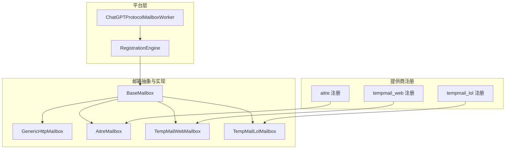
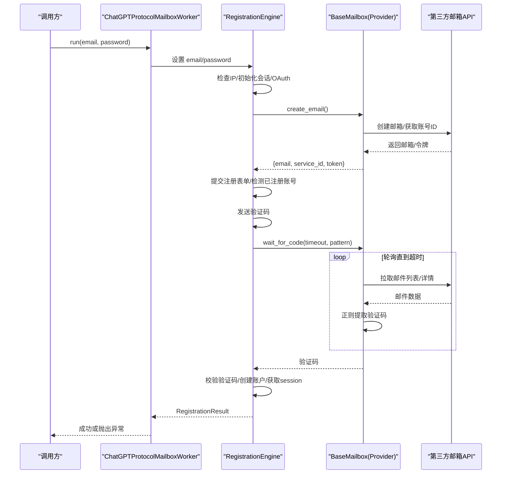
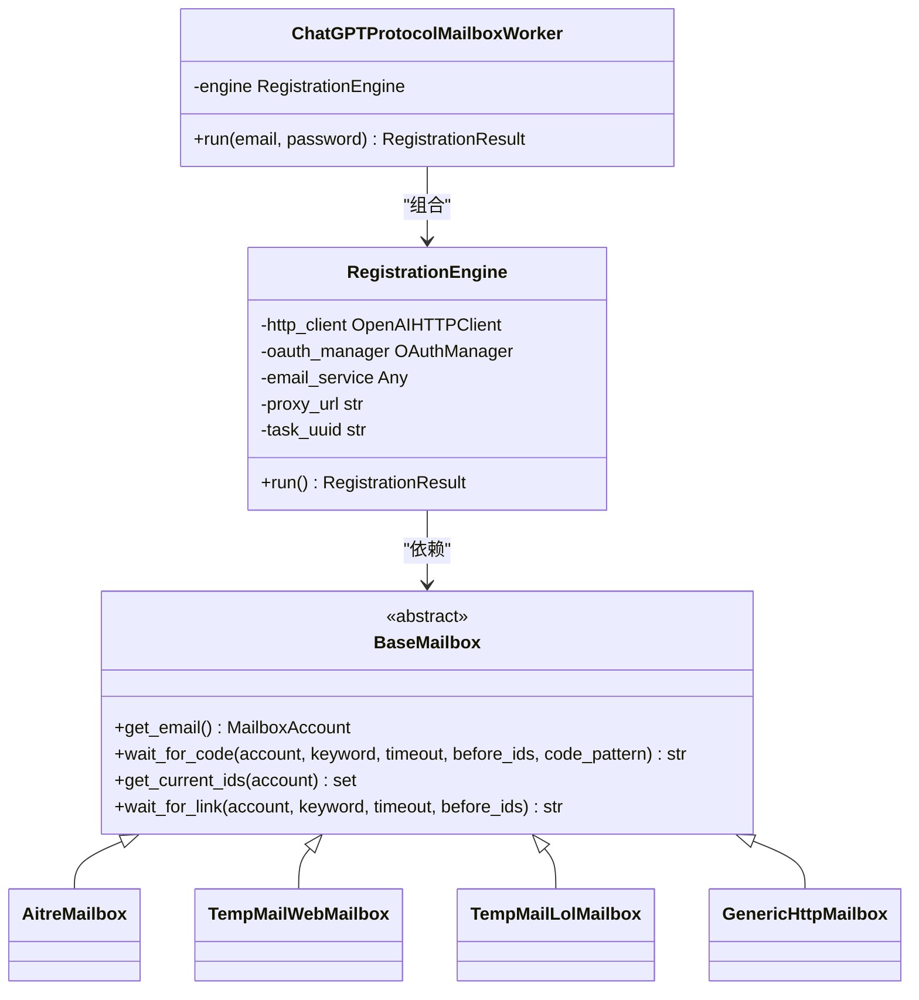
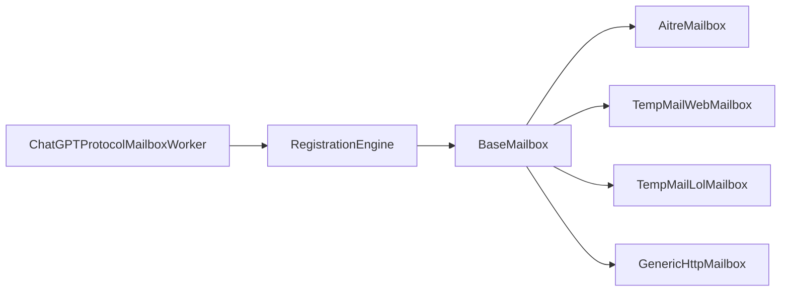

# 协议邮箱注册

<cite>
**本文引用的文件**
- [platforms/chatgpt/protocol_mailbox.py](file://platforms/chatgpt/protocol_mailbox.py)
- [platforms/chatgpt/register.py](file://platforms/chatgpt/register.py)
- [core/base_mailbox.py](file://core/base_mailbox.py)
- [core/generic_http_mailbox.py](file://core/generic_http_mailbox.py)
- [providers/mailbox/aitre.py](file://providers/mailbox/aitre.py)
- [providers/mailbox/tempmail_web.py](file://providers/mailbox/tempmail_web.py)
- [providers/mailbox/tempmail_lol.py](file://providers/mailbox/tempmail_lol.py)
</cite>

## 目录
1. [简介](#简介)
2. [项目结构](#项目结构)
3. [核心组件](#核心组件)
4. [架构总览](#架构总览)
5. [详细组件分析](#详细组件分析)
6. [依赖关系分析](#依赖关系分析)
7. [性能与可靠性](#性能与可靠性)
8. [故障排查指南](#故障排查指南)
9. [结论](#结论)
10. [附录：配置与使用示例](#附录：配置与使用示例)

## 简介
本文件面向“ChatGPT 协议邮箱注册”的完整实现，聚焦于 ChatGPTProtocolMailboxWorker 的工作流程、临时邮箱集成、邮件验证处理、账户激活流程，以及与多种邮箱服务提供商（如 AITRE、TempMail Web、TempMail.lol）的 API 集成。文档还涵盖邮箱账号管理、邮件轮询机制、注册结果映射（token 获取、用户信息提取）、错误处理策略、重试机制和性能优化建议。

## 项目结构
围绕 ChatGPT 协议邮箱注册的关键代码分布在以下模块：
- 平台层：ChatGPT 协议的 Worker 与注册引擎
- 基础能力：通用邮箱抽象与各 Provider 实现
- 提供商注册：将具体邮箱服务接入统一工厂

图表来源
- [platforms/chatgpt/protocol_mailbox.py:36-65](file://platforms/chatgpt/protocol_mailbox.py#L36-L65)
- [platforms/chatgpt/register.py:187-245](file://platforms/chatgpt/register.py#L187-L245)
- [core/base_mailbox.py:27-48](file://core/base_mailbox.py#L27-L48)
- [core/generic_http_mailbox.py:75-104](file://core/generic_http_mailbox.py#L75-L104)
- [providers/mailbox/aitre.py:1-6](file://providers/mailbox/aitre.py#L1-L6)
- [providers/mailbox/tempmail_web.py:1-6](file://providers/mailbox/tempmail_web.py#L1-L6)
- [providers/mailbox/tempmail_lol.py:1-6](file://providers/mailbox/tempmail_lol.py#L1-L6)

章节来源
- [platforms/chatgpt/protocol_mailbox.py:36-65](file://platforms/chatgpt/protocol_mailbox.py#L36-L65)
- [platforms/chatgpt/register.py:187-245](file://platforms/chatgpt/register.py#L187-L245)
- [core/base_mailbox.py:27-48](file://core/base_mailbox.py#L27-L48)

## 核心组件
- ChatGPTProtocolMailboxWorker：封装邮箱服务适配与注册引擎调用，负责启动并执行完整的 ChatGPT 注册流程。
- RegistrationEngine：编排注册全流程，包括创建邮箱、OAuth 授权、验证码发送与校验、账户创建、会话与 token 获取等。
- BaseMailbox 及实现：定义统一的邮箱接口（创建邮箱、等待验证码/链接、获取当前邮件 ID），并提供多种 Provider 实现（AITRE、TempMail Web、TempMail.lol、DuckMail、CFWorker、MoeMail、Freemail 等）。
- GenericHttpMailbox：数据驱动的通用 HTTP 邮箱驱动，通过配置描述认证、创建邮箱、拉取列表、详情等步骤，支持零代码新增邮箱类型。

章节来源
- [platforms/chatgpt/protocol_mailbox.py:9-65](file://platforms/chatgpt/protocol_mailbox.py#L9-L65)
- [platforms/chatgpt/register.py:187-245](file://platforms/chatgpt/register.py#L187-L245)
- [core/base_mailbox.py:27-48](file://core/base_mailbox.py#L27-L48)
- [core/generic_http_mailbox.py:75-104](file://core/generic_http_mailbox.py#L75-L104)

## 架构总览
下图展示了从 Worker 到注册引擎再到邮箱 Provider 的调用链，以及各 Provider 对第三方邮箱服务的轮询与验证码解析逻辑。

图表来源
- [platforms/chatgpt/protocol_mailbox.py:36-65](file://platforms/chatgpt/protocol_mailbox.py#L36-L65)
- [platforms/chatgpt/register.py:1212-1566](file://platforms/chatgpt/register.py#L1212-L1566)
- [core/base_mailbox.py:27-48](file://core/base_mailbox.py#L27-L48)

## 详细组件分析

### ChatGPTProtocolMailboxWorker 工作流程
- 构造阶段：接收 mailbox 实例、mailbox_account、provider 标识、可选代理与日志回调；内部创建 _MailboxEmailService 适配层，并将邮箱服务注入 RegistrationEngine。
- 运行阶段：设置 email/password，调用 engine.run() 完成注册；若失败则抛出包含错误信息的异常。

关键职责
- 隔离邮箱服务细节，仅暴露最小接口给注册引擎。
- 将 provider 名称作为 service_type.value 透传给后续流程。
- 统一错误传播，便于上层捕获并记录。

章节来源
- [platforms/chatgpt/protocol_mailbox.py:9-65](file://platforms/chatgpt/protocol_mailbox.py#L9-L65)

### RegistrationEngine 注册流程
- 初始化：创建 HTTP 客户端与 OAuth 管理器，准备设备 ID、Sentinel Token、注册状态等。
- 主要步骤：
  - 检查 IP 地理位置
  - 创建邮箱（通过邮箱服务）
  - 初始化会话并开始 OAuth 授权
  - 获取 Device ID 与 Sentinel Token
  - 提交注册表单，判断是否已注册账号
  - 发送验证码并等待验证码
  - 校验验证码后进入账户创建或继续流程
  - 跟随 callback URL 获取 session，并从 /api/auth/session 提取 access_token
  - 可选：通过 Codex CLI 登录流程获取 refresh_token + id_token
  - 组装 RegistrationResult（包含 email、password、account_id、workspace_id、access_token、refresh_token、id_token、session_token、source、metadata 等）

错误与分支
- 检测到已注册账号时自动切换登录流程，跳过密码设置与重复 OTP 发送。
- 若某一步失败，记录错误信息并提前返回。

章节来源
- [platforms/chatgpt/register.py:187-245](file://platforms/chatgpt/register.py#L187-L245)
- [platforms/chatgpt/register.py:1212-1566](file://platforms/chatgpt/register.py#L1212-L1566)

### 邮箱 Provider 集成与轮询机制
- AITRE 邮箱：
  - 通过 /poll 与 /emails 接口轮询新邮件，使用 lastCheck 增量拉取，按关键词过滤后以正则提取验证码。
  - 支持 wait_for_link 提取验证链接。
- TempMail Web：
  - 通过浏览器内 fetch 调用服务端 API，具备 429 重试与退避策略；支持消息列表拉取与验证码/链接提取。
- TempMail.lol：
  - 通过 inbox/create 创建邮箱，使用 token 拉取邮件列表，按时间排序查找最新验证码。
- DuckMail、CFWorker、MoeMail、Freemail：
  - 各自实现 get_email/get_current_ids/wait_for_code/wait_for_link，遵循 BaseMailbox 约定。
- GenericHttpMailbox：
  - 通过 pipeline_config 与 settings 构建步骤管道，支持多步认证、动态变量替换、cookie 提取、列表/详情拉取、验证码/链接提取。

轮询共性
- 维护 seen IDs 避免重复处理。
- 支持 keyword 过滤与自定义 code_pattern。
- 超时控制与异常吞掉以保证稳定性。

章节来源
- [core/base_mailbox.py:476-555](file://core/base_mailbox.py#L476-L555)
- [core/base_mailbox.py:557-652](file://core/base_mailbox.py#L557-L652)
- [core/base_mailbox.py:654-903](file://core/base_mailbox.py#L654-L903)
- [core/base_mailbox.py:919-1069](file://core/base_mailbox.py#L919-L1069)
- [core/base_mailbox.py:1071-1198](file://core/base_mailbox.py#L1071-L1198)
- [core/base_mailbox.py:1200-1488](file://core/base_mailbox.py#L1200-L1488)
- [core/base_mailbox.py:1490-1599](file://core/base_mailbox.py#L1490-L1599)
- [core/generic_http_mailbox.py:75-104](file://core/generic_http_mailbox.py#L75-L104)
- [core/generic_http_mailbox.py:195-257](file://core/generic_http_mailbox.py#L195-L257)
- [core/generic_http_mailbox.py:317-412](file://core/generic_http_mailbox.py#L317-L412)
- [core/generic_http_mailbox.py:413-474](file://core/generic_http_mailbox.py#L413-L474)

### 注册结果映射与处理
- RegistrationResult 字段：
  - success、email、password、account_id、workspace_id、access_token、refresh_token、id_token、session_token、error_message、logs、metadata、source
- 映射来源：
  - NextAuth session：accessToken、_account cookie、__Secure-next-auth.session-token
  - Codex CLI 登录：access_token、refresh_token、id_token（更完整）
  - Workspace ID：从 auth cookie 解码 JWT 获取 workspaces[0].id
- 元数据：
  - 记录邮箱服务类型、使用的代理、注册时间、是否已注册账号等

章节来源
- [platforms/chatgpt/register.py:45-79](file://platforms/chatgpt/register.py#L45-L79)
- [platforms/chatgpt/register.py:1071-1145](file://platforms/chatgpt/register.py#L1071-L1145)
- [platforms/chatgpt/register.py:1332-1566](file://platforms/chatgpt/register.py#L1332-L1566)

### 类图：核心对象关系

图表来源
- [platforms/chatgpt/protocol_mailbox.py:36-65](file://platforms/chatgpt/protocol_mailbox.py#L36-L65)
- [platforms/chatgpt/register.py:187-245](file://platforms/chatgpt/register.py#L187-L245)
- [core/base_mailbox.py:27-48](file://core/base_mailbox.py#L27-L48)

## 依赖关系分析
- Worker 依赖注册引擎，注册引擎依赖邮箱服务与 HTTP/OAuth 客户端。
- 邮箱服务通过 BaseMailbox 抽象解耦，具体实现由 providers 注册表装配。
- 通用 HTTP 邮箱驱动通过配置化步骤减少硬编码，提升扩展性。

图表来源
- [platforms/chatgpt/protocol_mailbox.py:36-65](file://platforms/chatgpt/protocol_mailbox.py#L36-L65)
- [core/base_mailbox.py:27-48](file://core/base_mailbox.py#L27-L48)

章节来源
- [platforms/chatgpt/protocol_mailbox.py:36-65](file://platforms/chatgpt/protocol_mailbox.py#L36-L65)
- [core/base_mailbox.py:27-48](file://core/base_mailbox.py#L27-L48)

## 性能与可靠性
- 轮询间隔与超时：
  - 多数 Provider 采用 3-5 秒轮询，超时默认 120 秒，可根据业务调整。
- 重试与退避：
  - TempMail Web 在遇到 429 时进行指数退避式重试，降低限流影响。
- 资源复用：
  - GenericHttpMailbox 使用 Session 保持连接与 Cookie，减少握手开销。
- 并发与线程：
  - TempMail Web 使用线程池执行浏览器请求，避免阻塞主流程。
- 正则与文本处理：
  - 验证码提取使用高效正则，必要时移除邮箱地址与时间戳干扰项。

优化建议
- 根据目标邮箱服务响应延迟调整轮询间隔与超时。
- 对高频限流服务启用退避与缓存 ID 集合，避免重复请求。
- 合理设置 User-Agent、Referer、Origin 等头部，提高成功率。
- 使用代理池分散请求，降低被封禁风险。

## 故障排查指南
常见问题与定位
- 创建邮箱失败：检查邮箱 Provider 配置与网络连通性，确认 API 返回格式。
- 验证码未到达：确认邮件关键词匹配、code_pattern 正确，检查 Provider 轮询逻辑。
- 验证码校验失败：核对发送与校验时序，确保 OTP 发送时间戳传递正确。
- OAuth 回调失败：检查重定向链与参数（code/state），确认代理与域名白名单。
- 已注册账号流程：当检测到已注册账号时，应走登录流程，避免重复设置密码。

调试要点
- 查看 RegistrationEngine 日志输出，关注各步骤状态码与响应片段。
- 检查邮箱 Provider 的 wait_for_code/wait_for_link 返回值与异常。
- 对于 TempMail Web，关注浏览器端 fetch 返回的状态码与 body。

章节来源
- [platforms/chatgpt/register.py:1212-1566](file://platforms/chatgpt/register.py#L1212-L1566)
- [core/base_mailbox.py:476-555](file://core/base_mailbox.py#L476-L555)
- [core/base_mailbox.py:654-903](file://core/base_mailbox.py#L654-L903)

## 结论
ChatGPTProtocolMailboxWorker 通过简洁的适配器将邮箱服务与注册引擎解耦，RegistrationEngine 实现了健壮的注册流程编排，覆盖邮箱创建、验证码处理、账户激活与 token 获取。BaseMailbox 及其多种实现提供了灵活的邮箱集成能力，GenericHttpMailbox 进一步提升了可配置性与可扩展性。整体架构清晰、模块化良好，适合在不同邮箱服务间快速切换与扩展。

## 附录：配置与使用示例
- 选择邮箱 Provider：
  - 通过工厂方法 create_mailbox(provider, extra, proxy) 创建具体邮箱实例，支持 AITRE、TempMail Web、TempMail.lol 等。
- 配置 GenericHttpMailbox：
  - 使用 pipeline_config 与 settings 描述认证、创建邮箱、拉取列表、详情等步骤，无需修改代码即可适配新邮箱服务。
- 使用 Worker：
  - 传入 mailbox、mailbox_account、provider、proxy_url、log_fn，调用 run(email, password) 执行注册。

章节来源
- [core/base_mailbox.py:289-348](file://core/base_mailbox.py#L289-L348)
- [core/generic_http_mailbox.py:75-104](file://core/generic_http_mailbox.py#L75-L104)
- [platforms/chatgpt/protocol_mailbox.py:36-65](file://platforms/chatgpt/protocol_mailbox.py#L36-L65)