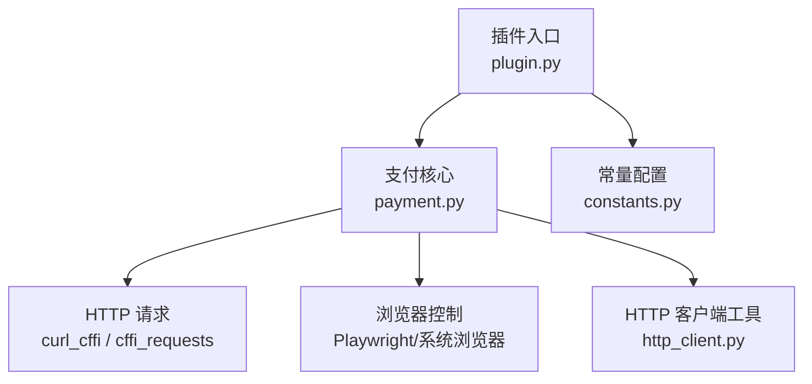
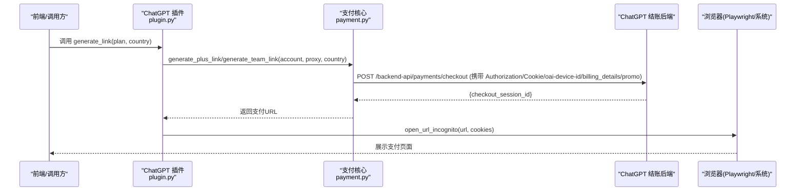
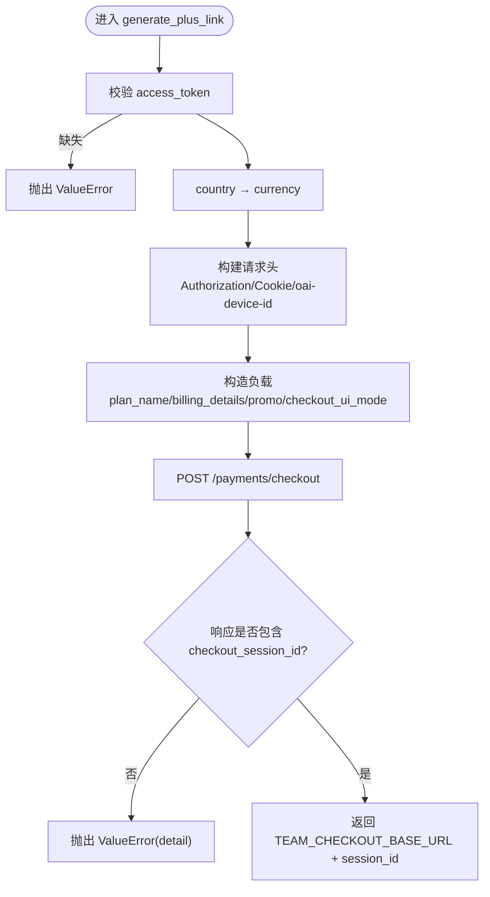
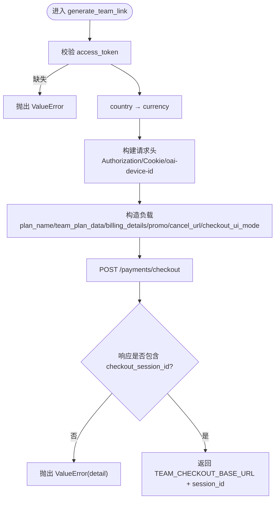
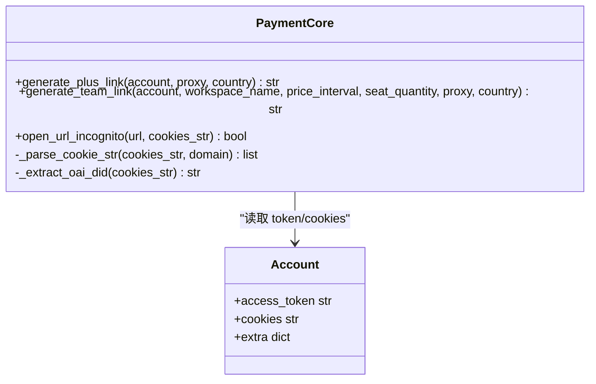
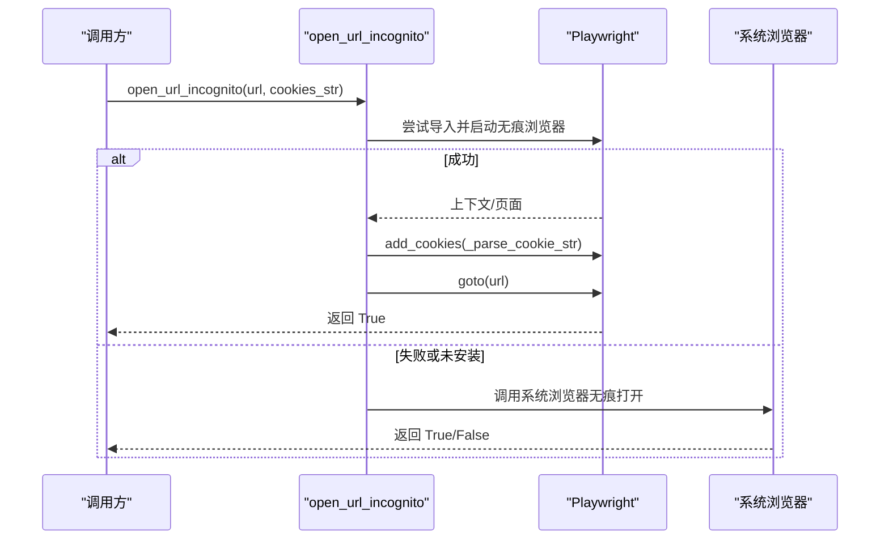
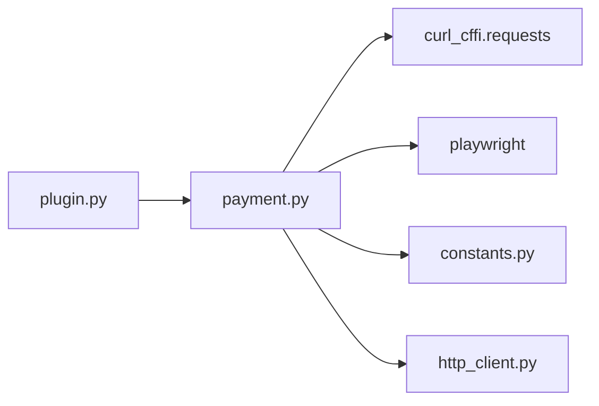

# 支付链接生成

<cite>
**本文引用的文件**
- [payment.py](file://platforms/chatgpt/payment.py)
- [plugin.py](file://platforms/chatgpt/plugin.py)
- [constants.py](file://platforms/chatgpt/constants.py)
- [http_client.py](file://platforms/chatgpt/http_client.py)
</cite>

## 目录
1. [简介](#简介)
2. [项目结构](#项目结构)
3. [核心组件](#核心组件)
4. [架构总览](#架构总览)
5. [详细组件分析](#详细组件分析)
6. [依赖关系分析](#依赖关系分析)
7. [性能考虑](#性能考虑)
8. [故障排除指南](#故障排除指南)
9. [结论](#结论)
10. [附录：代码示例与异常处理](#附录代码示例与异常处理)

## 简介
本文件聚焦于 ChatGPT 支付集成的实现，重点解析“支付链接生成”的完整流程，包括 Plus 套餐与 Team 套餐的差异、地区选择对支付页面的影响（US、SG、TR、HK、JP、GB、AU、CA）、Cookie 与会话管理、以及 open_url_incognito 函数在本地指纹浏览器中的集成与凭据注入。文档同时提供完整的调用路径、错误处理策略、安全注意事项和排错建议，帮助读者快速定位问题并稳定落地。

## 项目结构
与支付链接生成直接相关的模块位于 platforms/chatgpt 下：
- payment.py：支付链接生成、订阅状态检测、Cookie 解析与无痕打开浏览器等核心逻辑
- plugin.py：平台能力入口，暴露“生成支付链接”动作，负责参数组装与调用 payment 模块
- constants.py：常量定义（如 OpenAI/OAuth/Sentinel 相关），支付流程中主要使用其常量引用
- http_client.py：OpenAI HTTP 客户端封装，用于地理位置检查、Sentinel 校验等辅助能力

图表来源
- [plugin.py:391-420](file://platforms/chatgpt/plugin.py#L391-L420)
- [payment.py:19-21](file://platforms/chatgpt/payment.py#L19-L21)
- [payment.py:23-42](file://platforms/chatgpt/payment.py#L23-L42)
- [payment.py:144-170](file://platforms/chatgpt/payment.py#L144-L170)
- [payment.py:300-324](file://platforms/chatgpt/payment.py#L300-L324)
- [http_client.py:47-70](file://platforms/chatgpt/http_client.py#L47-L70)

章节来源
- [plugin.py:391-420](file://platforms/chatgpt/plugin.py#L391-L420)
- [payment.py:19-21](file://platforms/chatgpt/payment.py#L19-L21)
- [payment.py:23-42](file://platforms/chatgpt/payment.py#L23-L42)
- [payment.py:144-170](file://platforms/chatgpt/payment.py#L144-L170)
- [payment.py:300-324](file://platforms/chatgpt/payment.py#L300-L324)
- [http_client.py:47-70](file://platforms/chatgpt/http_client.py#L47-L70)

## 核心组件
- 支付链接生成器
  - generate_plus_link：为 Plus 套餐创建支付会话并返回支付页 URL
  - generate_team_link：为 Team 套餐创建支付会话并返回支付页 URL
- Cookie 与设备标识处理
  - _extract_oai_did：从 Cookie 字符串提取 oai-device-id
  - _parse_cookie_str：将 Cookie 字符串转换为 Playwright 可识别的 cookie 列表，并对 __Secure- 前缀设置 secure=True
- 浏览器打开与会话注入
  - open_url_incognito：使用 Playwright 以无痕模式打开支付页，支持注入 Cookie；若未安装 Playwright，回退到系统浏览器
- 订阅状态检测
  - check_subscription_status / fetch_subscription_status_details：通过后端 API 或 wham/usage 接口获取账号订阅状态
- 地区与货币映射
  - _COUNTRY_CURRENCY_MAP：将国家代码映射为对应货币（如 US→USD、SG→SGD、TR→TRY、HK→HKD、JP→JPY、GB→GBP、AU→AUD、CA→CAD）

章节来源
- [payment.py:29-42](file://platforms/chatgpt/payment.py#L29-L42)
- [payment.py:45-51](file://platforms/chatgpt/payment.py#L45-L51)
- [payment.py:144-170](file://platforms/chatgpt/payment.py#L144-L170)
- [payment.py:199-242](file://platforms/chatgpt/payment.py#L199-L242)
- [payment.py:245-297](file://platforms/chatgpt/payment.py#L245-L297)
- [payment.py:300-324](file://platforms/chatgpt/payment.py#L300-L324)
- [payment.py:327-378](file://platforms/chatgpt/payment.py#L327-L378)

## 架构总览
支付链接生成的端到端流程如下：
- 上层通过插件能力“生成支付链接”，传入 plan（plus/team）与 country（地区）
- 根据 plan 调用对应的生成函数，构造请求头与负载（包含 billing_details.country/currency、promo_campaign、checkout_ui_mode）
- 向支付结账后端发起 POST 请求，获取 checkout_session_id，拼接成最终支付页 URL
- 若存在 cookies，则通过 open_url_incognito 以无痕模式打开支付页，并注入 Cookie，确保登录态正确

图表来源
- [plugin.py:391-420](file://platforms/chatgpt/plugin.py#L391-L420)
- [payment.py:199-242](file://platforms/chatgpt/payment.py#L199-L242)
- [payment.py:245-297](file://platforms/chatgpt/payment.py#L245-L297)
- [payment.py:300-324](file://platforms/chatgpt/payment.py#L300-L324)

## 详细组件分析

### Plus 套餐支付链接生成
- 输入：account（含 access_token、cookies）、proxy、country
- 关键步骤：
  - 根据 country 映射 currency
  - 设置请求头：Authorization、Content-Type、oai-language，必要时附加 Cookie 与 oai-device-id
  - 构造负载：plan_name=chatgptplusplan、billing_details.country/currency、promo_campaign（plus-1-month-free）、checkout_ui_mode=custom
  - 发送 POST 至结账后端，获取 checkout_session_id，拼接为最终支付 URL
- 异常处理：
  - 缺少 access_token 时抛出 ValueError
  - 响应不包含 checkout_session_id 时抛出 ValueError，并附带 detail 信息

图表来源
- [payment.py:199-242](file://platforms/chatgpt/payment.py#L199-L242)

章节来源
- [payment.py:199-242](file://platforms/chatgpt/payment.py#L199-L242)

### Team 套餐支付链接生成
- 输入：account、workspace_name、price_interval、seat_quantity、proxy、country
- 关键步骤：
  - 同样基于 country 映射 currency
  - 设置请求头与 Cookie/oai-device-id
  - 构造负载：plan_name=chatgptteamplan、team_plan_data（工作区名称、计费周期、席位数量）、billing_details、promo_campaign（team-1-month-free）、cancel_url、checkout_ui_mode
  - 发送 POST 至结账后端，获取 checkout_session_id，拼接为最终支付 URL
- 异常处理：
  - 缺少 access_token 时抛出 ValueError
  - 响应不包含 checkout_session_id 时抛出 ValueError，并附带 detail 信息

图表来源
- [payment.py:245-297](file://platforms/chatgpt/payment.py#L245-L297)

章节来源
- [payment.py:245-297](file://platforms/chatgpt/payment.py#L245-L297)

### 地区选择对支付页面的影响
- 地区到货币映射：_COUNTRY_CURRENCY_MAP 定义了 US、SG、TR、HK、JP、GB、EU、AU、CA、IN、BR、MX 等地区的货币
- 地区在负载中的体现：billing_details.country 与 currency 共同决定支付页面的计价与显示
- 地区与代理：插件层在查询状态时会结合 region 选择代理池，支付链接生成也支持传入 proxy 参数，便于按地区路由网络
- 地区特定配置：当前实现未对特定地区做额外分支逻辑，主要通过 country/currency 传递；如需扩展，可在 payload 或 headers 中增加地区相关字段

章节来源
- [payment.py:29-42](file://platforms/chatgpt/payment.py#L29-L42)
- [plugin.py:85-117](file://platforms/chatgpt/plugin.py#L85-L117)

### Cookie 处理与会话管理
- Cookie 注入：
  - _parse_cookie_str 将 "key=val; key2=val2" 格式解析为 Playwright cookie 列表，domain 自动修正为 .chatgpt.com
  - 对 __Secure- 前缀的 cookie 强制设置 secure=True，符合 Chromium/Playwright 的安全要求
- 设备标识：
  - _extract_oai_did 从 Cookie 中提取 oai-device-id，并在请求头中附加，有助于服务端识别设备上下文
- 会话保持：
  - 支付链接生成时，headers 中携带 account.cookies，保证结账后端能识别用户身份
  - open_url_incognito 在浏览器中注入 Cookie，确保支付页加载时已登录

图表来源
- [payment.py:45-51](file://platforms/chatgpt/payment.py#L45-L51)
- [payment.py:144-170](file://platforms/chatgpt/payment.py#L144-L170)
- [payment.py:199-242](file://platforms/chatgpt/payment.py#L199-L242)
- [payment.py:245-297](file://platforms/chatgpt/payment.py#L245-L297)
- [payment.py:300-324](file://platforms/chatgpt/payment.py#L300-L324)

章节来源
- [payment.py:45-51](file://platforms/chatgpt/payment.py#L45-L51)
- [payment.py:144-170](file://platforms/chatgpt/payment.py#L144-L170)
- [payment.py:199-242](file://platforms/chatgpt/payment.py#L199-L242)
- [payment.py:245-297](file://platforms/chatgpt/payment.py#L245-L297)
- [payment.py:300-324](file://platforms/chatgpt/payment.py#L300-L324)

### open_url_incognito 函数实现
- 功能：以无痕模式打开支付页，支持注入 Cookie；若未安装 Playwright，回退到系统浏览器
- 实现要点：
  - 尝试导入 playwright.sync_api，失败则记录警告并回退
  - 使用 chromium.launch(headless=False, args=["--incognito"]) 启动浏览器
  - 创建新上下文并注入 Cookie（domain 修正为 .chatgpt.com，__Secure- 前缀设置 secure=True）
  - 打开支付页后等待一段时间，避免窗口立即关闭
  - 线程化执行，不阻塞主流程
- 系统浏览器回退：
  - Windows：尝试 chrome --incognito 或 msedge --inprivate
  - macOS：open -a Google Chrome --args --incognito url
  - Linux：尝试 google-chrome/chromium-browser/chromium --incognito

图表来源
- [payment.py:300-324](file://platforms/chatgpt/payment.py#L300-L324)
- [payment.py:173-196](file://platforms/chatgpt/payment.py#L173-L196)
- [payment.py:144-170](file://platforms/chatgpt/payment.py#L144-L170)

章节来源
- [payment.py:300-324](file://platforms/chatgpt/payment.py#L300-L324)
- [payment.py:173-196](file://platforms/chatgpt/payment.py#L173-L196)
- [payment.py:144-170](file://platforms/chatgpt/payment.py#L144-L170)

### 插件入口与参数处理
- 插件暴露“生成支付链接”动作，参数包括：
  - country：地区（US、SG、TR、HK、JP、GB、AU、CA）
  - plan：套餐（plus、team）
- 处理逻辑：
  - 从 account.extra 中取出 access_token、cookies、session_token 等
  - 若 cookies 为空但存在 session_token，则手动构造基础 Cookie
  - 根据 plan 调用 generate_plus_link 或 generate_team_link
  - 若返回 URL 且存在 cookies，则调用 open_url_incognito 打开支付页

章节来源
- [plugin.py:227-249](file://platforms/chatgpt/plugin.py#L227-L249)
- [plugin.py:391-420](file://platforms/chatgpt/plugin.py#L391-L420)

## 依赖关系分析
- 外部依赖：
  - curl_cffi.requests：用于模拟真实浏览器指纹的请求发送（impersonate="chrome110"/"chrome124"）
  - playwright：用于无痕浏览器控制与 Cookie 注入（可选，未安装则回退系统浏览器）
- 内部依赖：
  - constants：常量与错误消息
  - http_client：OpenAI HTTP 客户端封装（地理位置检查、Sentinel 校验）

图表来源
- [payment.py:11-21](file://platforms/chatgpt/payment.py#L11-L21)
- [payment.py:300-324](file://platforms/chatgpt/payment.py#L300-L324)
- [plugin.py:391-420](file://platforms/chatgpt/plugin.py#L391-L420)

章节来源
- [payment.py:11-21](file://platforms/chatgpt/payment.py#L11-L21)
- [payment.py:300-324](file://platforms/chatgpt/payment.py#L300-L324)
- [plugin.py:391-420](file://platforms/chatgpt/plugin.py#L391-L420)

## 性能考虑
- 请求超时与重试：
  - 支付链接生成默认超时 30 秒，可根据网络情况调整
  - 可通过代理池与 region 提升成功率与速度
- 浏览器启动开销：
  - Playwright 启动有冷启动成本，建议在需要时再触发 open_url_incognito
  - 系统浏览器回退更快，但无法注入 Cookie，仅作为兜底
- 并发与线程：
  - open_url_incognito 使用独立线程启动浏览器，避免阻塞主流程

[本节为通用指导，无需具体文件引用]

## 故障排除指南
- 常见错误与原因
  - 缺少 access_token：generate_plus_link/generate_team_link 会抛出 ValueError，需确保 account.extra.access_token 有效
  - 未返回 checkout_session_id：后端可能因风控、地区限制或参数错误拒绝，查看 detail 信息定位
  - Cookie 无效或过期：确保 cookies 包含必要的会话 Cookie，必要时重新登录获取
  - Playwright 未安装：open_url_incognito 会回退系统浏览器，但无法注入 Cookie，导致支付页未登录
- 排查步骤
  - 检查代理与地区：确认 proxy 与 country 匹配，必要时更换代理
  - 验证 Cookie：使用 _parse_cookie_str 解析并确认 domain 与 secure 标志
  - 日志与调试：关注 open_url_incognito 的警告日志，确认浏览器是否成功打开
  - 降级方案：若 Playwright 失败，使用系统浏览器打开支付页，手动复制 Cookie 到浏览器

章节来源
- [payment.py:199-242](file://platforms/chatgpt/payment.py#L199-L242)
- [payment.py:245-297](file://platforms/chatgpt/payment.py#L245-L297)
- [payment.py:300-324](file://platforms/chatgpt/payment.py#L300-L324)
- [payment.py:144-170](file://platforms/chatgpt/payment.py#L144-L170)

## 结论
本实现通过清晰的职责划分与健壮的错误处理，完成了 ChatGPT 支付链接的自动生成与浏览器打开。Plus 与 Team 套餐在负载构造上有所差异，但整体流程一致。地区选择通过 country/currency 影响支付页面，Cookie 与设备标识的注入确保了会话的正确性。open_url_incognito 提供了灵活的浏览器打开方式，兼顾了功能性与容错性。生产环境中建议结合代理池与监控日志，持续优化成功率与用户体验。

[本节为总结性内容，无需具体文件引用]

## 附录：代码示例与异常处理
以下示例展示如何调用插件能力生成支付链接，并处理异常情况。请根据实际环境替换参数。

- 生成 Plus 支付链接
  - 调用：plugin._handle_generate_link(account, {"plan": "plus", "country": "SG"})
  - 预期：返回包含 URL 的字典，并自动打开浏览器
  - 异常：若缺少 access_token 或后端未返回 checkout_session_id，抛出 ValueError

- 生成 Team 支付链接
  - 调用：plugin._handle_generate_link(account, {"plan": "team", "country": "US"})
  - 预期：返回包含 URL 的字典，并自动打开浏览器
  - 异常：同上

- 地区与货币映射
  - 参考 _COUNTRY_CURRENCY_MAP，确保 country 值在支持列表中
  - 若 country 不在映射中，将默认使用 USD

- Cookie 注入与浏览器打开
  - 确保 account.cookies 有效，必要时使用 session_token 构造基础 Cookie
  - open_url_incognito 会优先使用 Playwright，否则回退系统浏览器

章节来源
- [plugin.py:391-420](file://platforms/chatgpt/plugin.py#L391-L420)
- [payment.py:29-42](file://platforms/chatgpt/payment.py#L29-L42)
- [payment.py:199-242](file://platforms/chatgpt/payment.py#L199-L242)
- [payment.py:245-297](file://platforms/chatgpt/payment.py#L245-L297)
- [payment.py:300-324](file://platforms/chatgpt/payment.py#L300-L324)