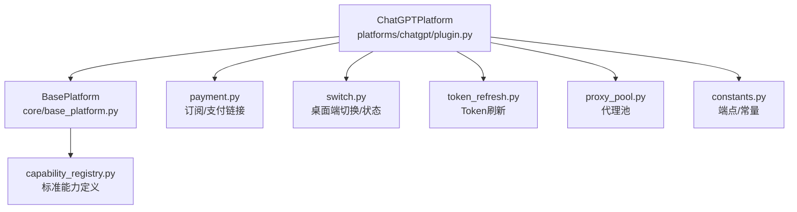
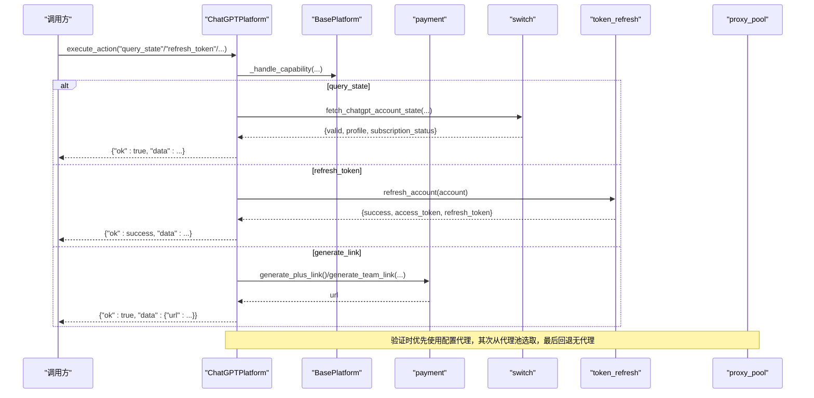
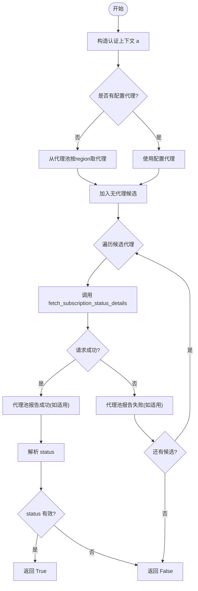
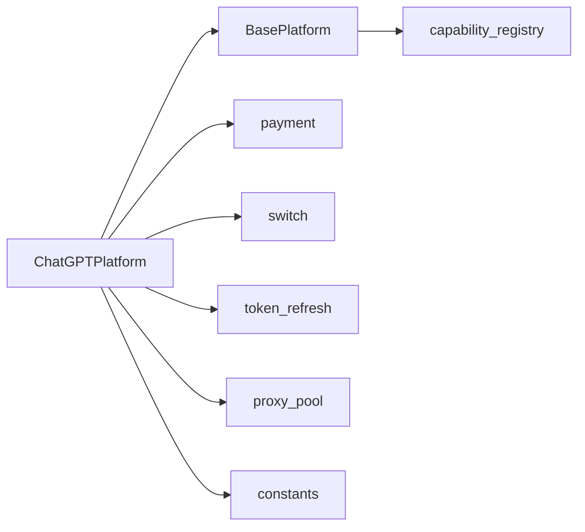
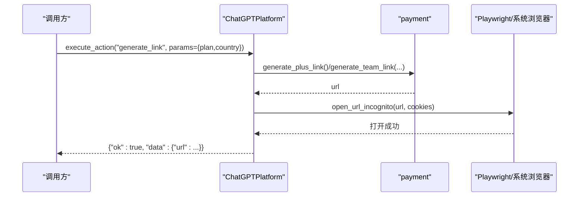

# 核心平台类实现

<cite>
**本文引用的文件**
- [platforms/chatgpt/plugin.py](file://platforms/chatgpt/plugin.py)
- [core/base_platform.py](file://core/base_platform.py)
- [platforms/chatgpt/payment.py](file://platforms/chatgpt/payment.py)
- [platforms/chatgpt/switch.py](file://platforms/chatgpt/switch.py)
- [platforms/chatgpt/token_refresh.py](file://platforms/chatgpt/token_refresh.py)
- [core/proxy_pool.py](file://core/proxy_pool.py)
- [core/capability_registry.py](file://core/capability_registry.py)
- [platforms/chatgpt/constants.py](file://platforms/chatgpt/constants.py)
</cite>

## 目录
1. [简介](#简介)
2. [项目结构](#项目结构)
3. [核心组件](#核心组件)
4. [架构总览](#架构总览)
5. [详细组件分析](#详细组件分析)
6. [依赖关系分析](#依赖关系分析)
7. [性能考虑](#性能考虑)
8. [故障排查指南](#故障排查指南)
9. [结论](#结论)
10. [附录：扩展指南与示例](#附录：扩展指南与示例)

## 简介
本文聚焦 ChatGPT 平台的核心类 ChatGPTPlatform，系统性解析其能力声明、账号验证流程、密码生成策略、结果映射机制，以及能力执行（query_state、refresh_token、generate_link、switch_desktop、upload_cpa、upload_tm）的完整实现。同时给出扩展新能力与自定义验证逻辑的实践建议，并总结性能优化与常见问题解决方案。

## 项目结构
围绕 ChatGPT 平台的关键代码分布在以下模块：
- 平台插件与能力入口：platforms/chatgpt/plugin.py
- 平台基类与能力路由：core/base_platform.py
- 订阅状态与支付链接：platforms/chatgpt/payment.py
- 桌面端切换与状态查询：platforms/chatgpt/switch.py
- Token 刷新：platforms/chatgpt/token_refresh.py
- 代理池管理：core/proxy_pool.py
- 标准能力定义：core/capability_registry.py
- 常量与端点：platforms/chatgpt/constants.py

图表来源
- [platforms/chatgpt/plugin.py:48-66](file://platforms/chatgpt/plugin.py#L48-L66)
- [core/base_platform.py:44-76](file://core/base_platform.py#L44-L76)
- [platforms/chatgpt/payment.py:17-42](file://platforms/chatgpt/payment.py#L17-L42)
- [platforms/chatgpt/switch.py:1-23](file://platforms/chatgpt/switch.py#L1-L23)
- [platforms/chatgpt/token_refresh.py:37-64](file://platforms/chatgpt/token_refresh.py#L37-L64)
- [core/proxy_pool.py:9-45](file://core/proxy_pool.py#L9-L45)
- [core/capability_registry.py:27-132](file://core/capability_registry.py#L27-L132)
- [platforms/chatgpt/constants.py:53-91](file://platforms/chatgpt/constants.py#L53-L91)

章节来源
- [platforms/chatgpt/plugin.py:48-66](file://platforms/chatgpt/plugin.py#L48-L66)
- [core/base_platform.py:44-76](file://core/base_platform.py#L44-L76)

## 核心组件
- ChatGPTPlatform：继承 BasePlatform，声明平台能力列表，实现 check_valid()、_prepare_registration_password()、_map_chatgpt_result()，并重写标准能力处理器以对接支付、桌面端、Token 刷新等子系统。
- BasePlatform：提供注册流程、能力路由、默认处理器、验证码解决器选择、身份提供者解析等通用能力。
- payment：负责订阅状态检测、Plus/Team 支付链接生成、无痕浏览器打开。
- switch：负责本地 Codex 桌面端的状态读取、关闭/重启、Cookie 写入以实现切号。
- token_refresh：支持 Session Token 与 OAuth Refresh Token 两种刷新方式，并提供校验接口。
- proxy_pool：从数据库或动态提供商获取代理，按区域筛选，统计成功/失败次数并自动禁用失效代理。
- capability_registry：定义标准能力的元数据（标签、参数、UI 提示），供 UI 渲染与能力排序。
- constants：OpenAI/OAuth/Sentinel 端点、页面类型、密码字符集等常量。

章节来源
- [platforms/chatgpt/plugin.py:48-66](file://platforms/chatgpt/plugin.py#L48-L66)
- [core/base_platform.py:44-76](file://core/base_platform.py#L44-L76)
- [platforms/chatgpt/payment.py:17-42](file://platforms/chatgpt/payment.py#L17-L42)
- [platforms/chatgpt/switch.py:1-23](file://platforms/chatgpt/switch.py#L1-L23)
- [platforms/chatgpt/token_refresh.py:37-64](file://platforms/chatgpt/token_refresh.py#L37-L64)
- [core/proxy_pool.py:9-45](file://core/proxy_pool.py#L9-L45)
- [core/capability_registry.py:27-132](file://core/capability_registry.py#L27-L132)
- [platforms/chatgpt/constants.py:53-91](file://platforms/chatgpt/constants.py#L53-L91)

## 架构总览
ChatGPTPlatform 通过 BasePlatform 的能力路由统一对外暴露能力，内部委托至各子系统完成具体业务。关键调用链如下：

图表来源
- [core/base_platform.py:192-233](file://core/base_platform.py#L192-L233)
- [platforms/chatgpt/plugin.py:337-420](file://platforms/chatgpt/plugin.py#L337-L420)
- [platforms/chatgpt/payment.py:199-297](file://platforms/chatgpt/payment.py#L199-L297)
- [platforms/chatgpt/switch.py:335-403](file://platforms/chatgpt/switch.py#L335-L403)
- [platforms/chatgpt/token_refresh.py:208-243](file://platforms/chatgpt/token_refresh.py#L208-L243)
- [core/proxy_pool.py:14-45](file://core/proxy_pool.py#L14-L45)

## 详细组件分析

### ChatGPTPlatform 能力声明与路由
- 能力声明：capabilities 包含 query_state、refresh_token、generate_link、switch_desktop、upload_cpa、upload_tm。
- 能力路由：BasePlatform.execute_action 将 action_id 分发到对应处理器；若为已知标准能力则进入 _handle_capability，否则回退到平台自定义 _execute_platform_action。
- 平台覆盖：ChatGPTPlatform 重写 _handle_query_state、_handle_refresh_token、_handle_generate_link，并在 _execute_platform_action 中处理 switch_desktop、upload_cpa、upload_tm 等平台特定动作。

章节来源
- [platforms/chatgpt/plugin.py:48-66](file://platforms/chatgpt/plugin.py#L48-L66)
- [core/base_platform.py:192-233](file://core/base_platform.py#L192-L233)
- [platforms/chatgpt/plugin.py:256-335](file://platforms/chatgpt/plugin.py#L256-L335)

### 账户验证流程 check_valid()
check_valid() 的目标是判断账号是否有效，核心逻辑包括：
- 构造轻量对象 a，填充 access_token、id_token、cookies、extra 等认证信息。
- 代理候选策略：优先使用显式配置的 proxy；否则从代理池按 region 取一个代理；最后尝试无代理。
- 调用 payment.fetch_subscription_status_details(a, proxy=proxy) 获取订阅详情与状态。
- 代理反馈：若来自代理池且成功，标记成功；若失败，标记失败。
- 有效性判定：status 不为 expired/invalid/banned/None 即视为有效。
- 异常兜底：外层 try-except 捕获异常返回 False。

图表来源
- [platforms/chatgpt/plugin.py:72-117](file://platforms/chatgpt/plugin.py#L72-L117)
- [platforms/chatgpt/payment.py:337-378](file://platforms/chatgpt/payment.py#L337-L378)
- [core/proxy_pool.py:14-45](file://core/proxy_pool.py#L14-L45)

章节来源
- [platforms/chatgpt/plugin.py:72-117](file://platforms/chatgpt/plugin.py#L72-L117)
- [platforms/chatgpt/payment.py:337-378](file://platforms/chatgpt/payment.py#L337-L378)
- [core/proxy_pool.py:14-45](file://core/proxy_pool.py#L14-L45)

### 密码生成策略 _generate_chatgpt_registration_password()
设计要点：
- 强制包含小写、大写、数字、特殊符号四类字符，确保复杂度满足 OpenAI 注册页校验。
- 最小长度保护：至少 12 位，避免过短导致被拒绝。
- 安全随机：使用 secrets 模块生成强随机字符，并进行打乱，降低可预测性。
- 兼容旧协议：在已有“带小写+数字+符号”的基础上补充大写，提升成功率。

章节来源
- [platforms/chatgpt/plugin.py:27-45](file://platforms/chatgpt/plugin.py#L27-L45)

### 结果映射机制 _map_chatgpt_result()
作用：将不同注册方式（浏览器注册、OAuth 回调、协议邮箱注册）返回的数据统一映射为 RegistrationResult。
- 校验必需字段：account_id、access_token 必须存在，否则抛出运行时错误。
- 字段映射：email、password、user_id、token、status、extra（包含 access_token、refresh_token、id_token、session_token、workspace_id、cookies、profile）。
- 对协议邮箱注册路径，额外提取 session_token、workspace_id 等字段。

章节来源
- [platforms/chatgpt/plugin.py:127-144](file://platforms/chatgpt/plugin.py#L127-L144)
- [platforms/chatgpt/plugin.py:197-216](file://platforms/chatgpt/plugin.py#L197-L216)

### 能力处理器详解

#### query_state
- 组装认证上下文（access_token、session_token、cookies）。
- 调用 switch.fetch_chatgpt_account_state 获取远程状态与本地桌面端状态。
- 返回包含 valid、profile、subscription_status、desktop_app_state 等数据的聚合结果。

章节来源
- [platforms/chatgpt/plugin.py:337-359](file://platforms/chatgpt/plugin.py#L337-L359)
- [platforms/chatgpt/switch.py:335-403](file://platforms/chatgpt/switch.py#L335-L403)

#### refresh_token
- 使用 TokenRefreshManager.refresh_account 进行刷新，优先尝试 Session Token，再尝试 OAuth Refresh Token。
- 成功后可选再次拉取账号状态，封装返回。

章节来源
- [platforms/chatgpt/plugin.py:361-389](file://platforms/chatgpt/plugin.py#L361-L389)
- [platforms/chatgpt/token_refresh.py:208-243](file://platforms/chatgpt/token_refresh.py#L208-L243)

#### generate_link
- 根据 plan（plus/team）与 country 生成支付链接。
- 若 cookies 不完整，基于 session_token 构造基础 cookie 字符串。
- 使用 Playwright 无痕模式打开链接，注入 cookies 并等待用户操作。

章节来源
- [platforms/chatgpt/plugin.py:391-420](file://platforms/chatgpt/plugin.py#L391-L420)
- [platforms/chatgpt/payment.py:199-297](file://platforms/chatgpt/payment.py#L199-L297)
- [platforms/chatgpt/payment.py:300-324](file://platforms/chatgpt/payment.py#L300-L324)

#### switch_desktop
- 关闭 Codex 应用，写入本地 Chromium Cookies 数据库中的 __Secure-next-auth.session-token，重启应用。
- 拉取远程账号状态与本地应用状态，合并返回。

章节来源
- [platforms/chatgpt/plugin.py:274-320](file://platforms/chatgpt/plugin.py#L274-L320)
- [platforms/chatgpt/switch.py:180-244](file://platforms/chatgpt/switch.py#L180-L244)
- [platforms/chatgpt/switch.py:293-309](file://platforms/chatgpt/switch.py#L293-L309)

#### upload_cpa / upload_tm
- 将账号令牌信息转换为目标系统所需格式后上传。
- 返回上传结果与消息。

章节来源
- [platforms/chatgpt/plugin.py:322-333](file://platforms/chatgpt/plugin.py#L322-L333)

## 依赖关系分析
- ChatGPTPlatform 依赖 BasePlatform 的能力路由与注册流程。
- 订阅状态与支付链接由 payment 模块提供，依赖 OpenAI 后端 API。
- 桌面端切换与状态查询由 switch 模块提供，直接操作本地 Chromium Cookies 数据库。
- Token 刷新由 token_refresh 模块提供，支持 Session Token 与 OAuth Refresh Token。
- 代理池由 proxy_pool 提供，支持动态代理与静态池，按区域选择并维护健康度。
- 标准能力定义由 capability_registry 提供，用于 UI 展示与排序。
- 常量与端点由 constants 提供，便于集中管理与环境变量覆盖。

图表来源
- [platforms/chatgpt/plugin.py:48-66](file://platforms/chatgpt/plugin.py#L48-L66)
- [core/base_platform.py:44-76](file://core/base_platform.py#L44-L76)
- [platforms/chatgpt/payment.py:17-42](file://platforms/chatgpt/payment.py#L17-L42)
- [platforms/chatgpt/switch.py:1-23](file://platforms/chatgpt/switch.py#L1-L23)
- [platforms/chatgpt/token_refresh.py:37-64](file://platforms/chatgpt/token_refresh.py#L37-L64)
- [core/proxy_pool.py:9-45](file://core/proxy_pool.py#L9-L45)
- [core/capability_registry.py:27-132](file://core/capability_registry.py#L27-L132)
- [platforms/chatgpt/constants.py:53-91](file://platforms/chatgpt/constants.py#L53-L91)

章节来源
- [platforms/chatgpt/plugin.py:48-66](file://platforms/chatgpt/plugin.py#L48-L66)
- [core/base_platform.py:44-76](file://core/base_platform.py#L44-L76)

## 性能考虑
- 代理池健康度：proxy_pool 按 success_count/(success_count+fail_count) 排序，连续失败超过阈值自动禁用，减少无效请求。
- 重试与回退：check_valid() 多代理候选顺序执行，失败时快速切换到下一个候选；fetch_subscription_status_details 先尝试 backend-api/me，失败回退到 wham/usage。
- 浏览器打开开销：generate_link 使用 Playwright 无痕模式打开链接，线程后台运行，避免阻塞主流程；若未安装 playwright，回退到系统浏览器。
- Token 刷新优先级：优先使用 Session Token 刷新，失败再尝试 OAuth Refresh Token，提高成功率并减少不必要网络请求。
- 常量集中管理：constants 集中管理端点与配置，便于缓存与批量更新。

[本节为通用性能讨论，不直接分析具体文件]

## 故障排查指南
- 订阅状态检测失败：
  - 检查 access_token 是否存在；若缺失，尝试通过 session_token 刷新。
  - 确认代理可用性与区域匹配；查看代理池成功/失败计数。
  - 参考 fallback 逻辑：backend-api/me 失败时回退到 wham/usage。
- 支付链接生成失败：
  - 检查 cookies 完整性；若缺少，基于 session_token 构造基础 cookie。
  - 确认 country 与 currency 映射正确；检查代理与超时设置。
- 桌面端切换失败：
  - 确认 __Secure-next-auth.session-token 存在；检查 Codex 安装路径与进程状态。
  - 查看 Cookies 数据库写入是否成功；必要时手动重启应用。
- Token 刷新失败：
  - 检查 session_token 与 refresh_token 是否有效；查看错误消息定位问题。
  - 若均不可用，需重新登录或触发 OAuth 流程。

章节来源
- [platforms/chatgpt/payment.py:337-378](file://platforms/chatgpt/payment.py#L337-L378)
- [platforms/chatgpt/switch.py:180-244](file://platforms/chatgpt/switch.py#L180-L244)
- [platforms/chatgpt/token_refresh.py:208-243](file://platforms/chatgpt/token_refresh.py#L208-L243)
- [core/proxy_pool.py:47-66](file://core/proxy_pool.py#L47-L66)

## 结论
ChatGPTPlatform 通过 BasePlatform 的能力路由与标准化能力定义，实现了统一的平台能力接入点。其核心优势在于：
- 清晰的职责划分：注册、验证、支付、桌面端、Token 刷新各司其职。
- 健壮的容错机制：多代理候选、API 回退、异常兜底。
- 可扩展性：通过能力声明与处理器重写，轻松扩展新能力。
- 安全性：强密码生成、敏感信息脱敏、代理健康度管理。

[本节为总结性内容，不直接分析具体文件]

## 附录：扩展指南与示例

### 扩展新平台能力
步骤：
1. 在 ChatGPTPlatform.capabilities 中添加新能力 ID。
2. 在 BasePlatform._handle_capability 中增加分支（如需），或在 ChatGPTPlatform 中重写对应处理器。
3. 在 _execute_platform_action 中实现平台特定逻辑（如需要）。
4. 如需 UI 展示，可在 capability_registry 中定义标准能力元数据。

示例路径参考：
- 能力声明与处理器：[platforms/chatgpt/plugin.py:48-66](file://platforms/chatgpt/plugin.py#L48-L66)、[platforms/chatgpt/plugin.py:337-420](file://platforms/chatgpt/plugin.py#L337-L420)
- 能力路由与默认处理器：[core/base_platform.py:192-289](file://core/base_platform.py#L192-L289)
- 标准能力定义：[core/capability_registry.py:27-132](file://core/capability_registry.py#L27-L132)

### 自定义验证逻辑
- 在 ChatGPTPlatform.check_valid() 中实现自定义验证流程，结合代理池与支付模块进行状态检测。
- 可复用 payment.fetch_subscription_status_details 与 token_refresh.TokenRefreshManager 进行认证与状态获取。
- 示例路径参考：[platforms/chatgpt/plugin.py:72-117](file://platforms/chatgpt/plugin.py#L72-L117)、[platforms/chatgpt/payment.py:337-378](file://platforms/chatgpt/payment.py#L337-L378)、[platforms/chatgpt/token_refresh.py:208-243](file://platforms/chatgpt/token_refresh.py#L208-L243)

### 完整调用序列示例（以 generate_link 为例）

图表来源
- [platforms/chatgpt/plugin.py:391-420](file://platforms/chatgpt/plugin.py#L391-L420)
- [platforms/chatgpt/payment.py:199-297](file://platforms/chatgpt/payment.py#L199-L297)
- [platforms/chatgpt/payment.py:300-324](file://platforms/chatgpt/payment.py#L300-L324)