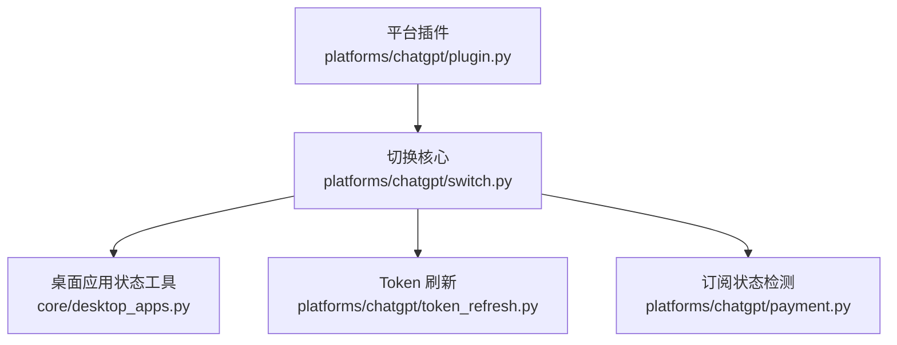
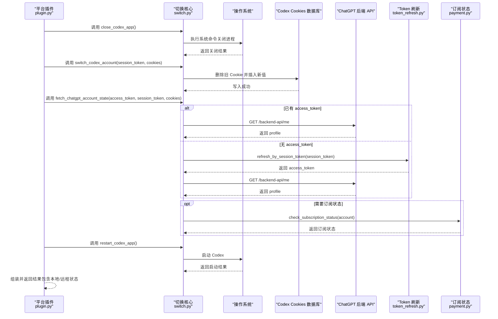
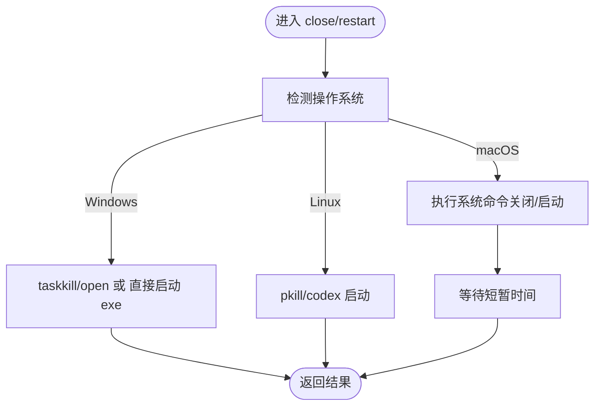
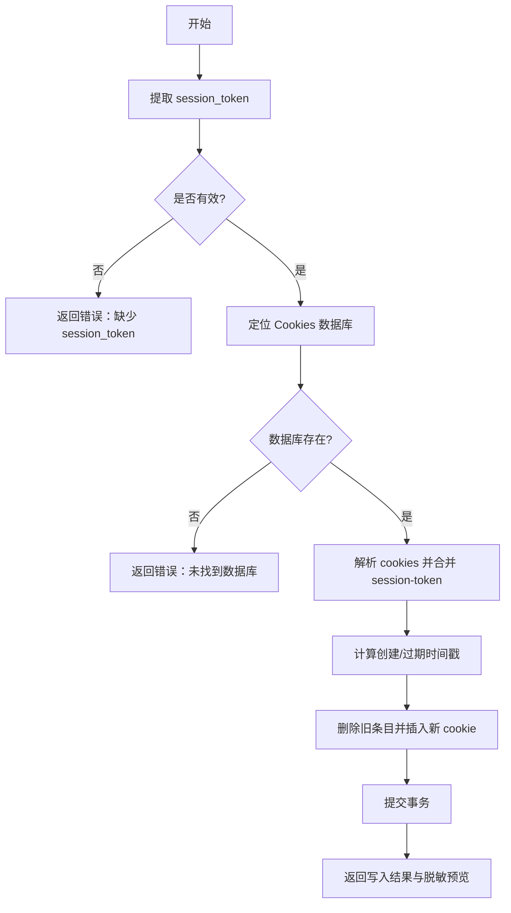
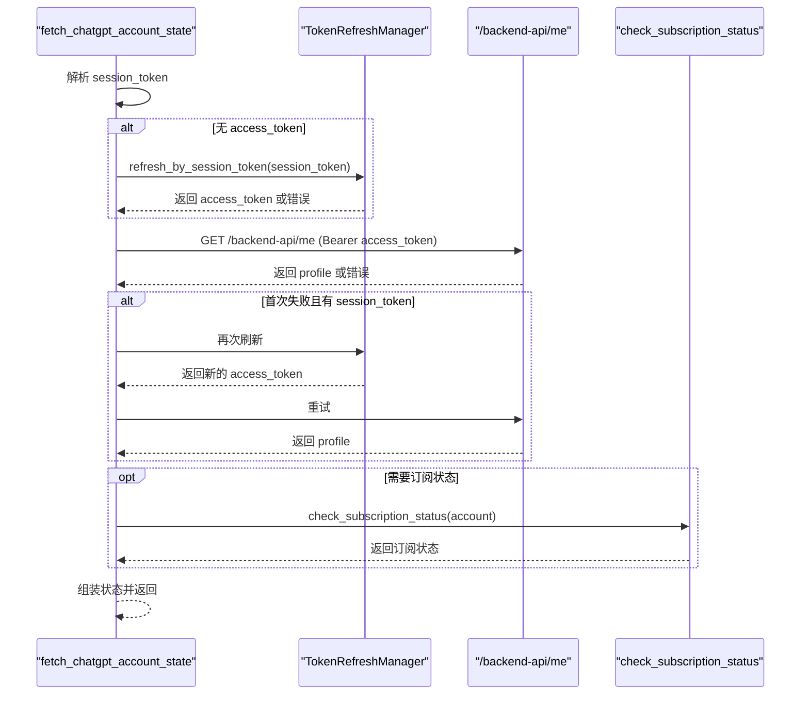
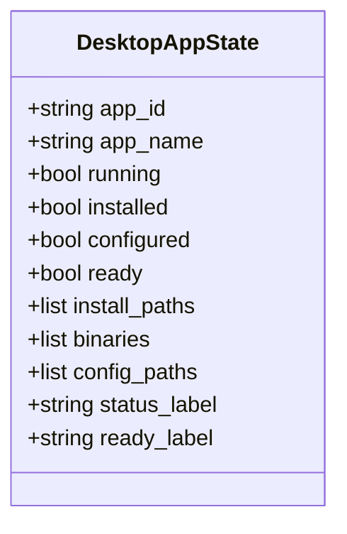
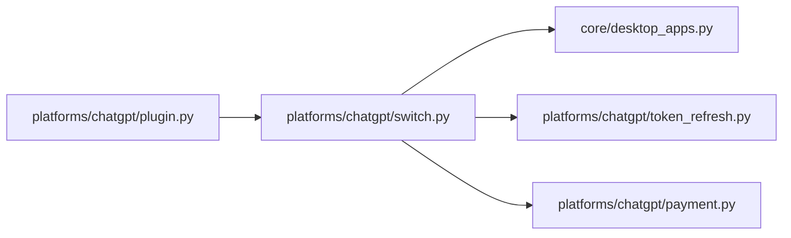

# 桌面应用切换

<cite>
**本文引用的文件**
- [platforms/chatgpt/switch.py](file://platforms/chatgpt/switch.py)
- [core/desktop_apps.py](file://core/desktop_apps.py)
- [platforms/chatgpt/plugin.py](file://platforms/chatgpt/plugin.py)
- [platforms/chatgpt/token_refresh.py](file://platforms/chatgpt/token_refresh.py)
- [platforms/chatgpt/payment.py](file://platforms/chatgpt/payment.py)
</cite>

## 目录
1. [简介](#简介)
2. [项目结构](#项目结构)
3. [核心组件](#核心组件)
4. [架构总览](#架构总览)
5. [详细组件分析](#详细组件分析)
6. [依赖关系分析](#依赖关系分析)
7. [性能与可靠性](#性能与可靠性)
8. [故障排查指南](#故障排查指南)
9. [结论](#结论)
10. [附录：完整流程示例与最佳实践](#附录完整流程示例与最佳实践)

## 简介
本文件聚焦于 ChatGPT/Codex 桌面端（Electron）的账户切换机制，覆盖进程管理、配置文件（Cookies SQLite 数据库）写入、会话状态同步、远程账户状态获取与订阅状态检测。文档重点解析以下能力：
- 进程控制：关闭与重启 Codex 桌面应用
- 本地会话注入：session_token 提取与注入到 Chromium Cookies 数据库
- 远程状态查询：通过 access_token/session_token 刷新并调用后端 API 获取账号 profile 与订阅状态
- 安全与兼容性：敏感信息脱敏、跨平台路径与进程识别、权限与调试方法

## 项目结构
围绕桌面应用切换的关键代码分布在以下模块：
- platforms/chatgpt/switch.py：实现 Codex 桌面端切换的核心逻辑（进程控制、Cookies 写入、状态读取、远程状态获取）
- core/desktop_apps.py：通用桌面应用状态探测工具（进程是否存在、安装路径、二进制名、配置路径）
- platforms/chatgpt/plugin.py：将切换动作编排为平台能力（关闭→写入→验证→重启→汇总结果）
- platforms/chatgpt/token_refresh.py：基于 session_token 或 OAuth refresh_token 刷新 access_token
- platforms/chatgpt/payment.py：订阅状态检测与支付链接生成（辅助用于状态校验）

**图表来源**
- [platforms/chatgpt/plugin.py:280-320](file://platforms/chatgpt/plugin.py#L280-L320)
- [platforms/chatgpt/switch.py:180-309](file://platforms/chatgpt/switch.py#L180-L309)
- [core/desktop_apps.py:104-139](file://core/desktop_apps.py#L104-L139)
- [platforms/chatgpt/token_refresh.py:66-132](file://platforms/chatgpt/token_refresh.py#L66-L132)
- [platforms/chatgpt/payment.py:327-379](file://platforms/chatgpt/payment.py#L327-L379)

**章节来源**
- [platforms/chatgpt/switch.py:1-403](file://platforms/chatgpt/switch.py#L1-L403)
- [core/desktop_apps.py:1-139](file://core/desktop_apps.py#L1-L139)
- [platforms/chatgpt/plugin.py:280-423](file://platforms/chatgpt/plugin.py#L280-L423)
- [platforms/chatgpt/token_refresh.py:1-339](file://platforms/chatgpt/token_refresh.py#L1-L339)
- [platforms/chatgpt/payment.py:1-379](file://platforms/chatgpt/payment.py#L1-L379)

## 核心组件
- 进程控制
  - close_codex_app：按平台调用系统命令关闭 Codex 进程（macOS 使用 osascript，Windows 使用 taskkill，Linux 使用 pkill），并等待短暂时间确保进程退出。
  - restart_codex_app：按平台查找可执行路径并启动 Codex；若未找到则返回提示以便手动启动。
- 本地会话注入
  - extract_session_token：从 session_token 或 cookies 字符串中提取 __Secure-next-auth.session-token。
  - switch_codex_account：定位 Codex 的 Chromium Cookies 数据库，删除旧条目并插入新 cookie（含过期时间、secure、httponly 等字段），提交事务。
  - read_current_codex_account：读取当前本地会话（session-token、oai-did）并返回脱敏预览。
- 远程状态获取
  - fetch_chatgpt_account_state：优先使用 access_token 调用 /backend-api/me 获取 profile；若无 access_token，尝试用 session_token 刷新；成功后再拉取 profile，并可选调用订阅状态检测。
- 桌面应用状态聚合
  - get_codex_desktop_state：结合进程、安装路径、配置路径与当前账户存在性，输出统一的状态对象。

**章节来源**
- [platforms/chatgpt/switch.py:127-178](file://platforms/chatgpt/switch.py#L127-L178)
- [platforms/chatgpt/switch.py:180-244](file://platforms/chatgpt/switch.py#L180-L244)
- [platforms/chatgpt/switch.py:247-309](file://platforms/chatgpt/switch.py#L247-L309)
- [platforms/chatgpt/switch.py:312-403](file://platforms/chatgpt/switch.py#L312-L403)
- [core/desktop_apps.py:104-139](file://core/desktop_apps.py#L104-L139)

## 架构总览
下图展示了“切换账户”的端到端流程：插件触发 → 关闭应用 → 写入本地 Cookies → 验证远程状态 → 重启应用 → 汇总结果。

**图表来源**
- [platforms/chatgpt/plugin.py:280-320](file://platforms/chatgpt/plugin.py#L280-L320)
- [platforms/chatgpt/switch.py:127-178](file://platforms/chatgpt/switch.py#L127-L178)
- [platforms/chatgpt/switch.py:180-244](file://platforms/chatgpt/switch.py#L180-L244)
- [platforms/chatgpt/switch.py:312-403](file://platforms/chatgpt/switch.py#L312-L403)
- [platforms/chatgpt/token_refresh.py:66-132](file://platforms/chatgpt/token_refresh.py#L66-L132)
- [platforms/chatgpt/payment.py:327-379](file://platforms/chatgpt/payment.py#L327-L379)

## 详细组件分析

### 进程控制函数
- close_codex_app
  - 行为：根据平台选择命令关闭进程，并等待短暂时间确保退出。
  - 错误处理：捕获异常并记录日志，返回失败与错误消息。
- restart_codex_app
  - 行为：按平台查找可执行路径并启动；若找不到则返回提示信息。
  - 错误处理：捕获异常并记录日志，返回失败与错误消息。

**图表来源**
- [platforms/chatgpt/switch.py:127-178](file://platforms/chatgpt/switch.py#L127-L178)

**章节来源**
- [platforms/chatgpt/switch.py:127-178](file://platforms/chatgpt/switch.py#L127-L178)

### 会话令牌提取与注入
- extract_session_token
  - 支持从 session_token 或 cookies 字符串中解析出 __Secure-next-auth.session-token。
- switch_codex_account
  - 定位 Codex 的 Chromium Cookies 数据库路径（跨平台）。
  - 解析 cookies 字符串，合并目标 session-token。
  - 计算 Chromium 时间戳（UTC），删除旧条目并插入新 cookie（设置 secure、httponly、过期时间等）。
  - 提交事务并返回写入结果与脱敏预览。
- read_current_codex_account
  - 读取当前本地会话（session-token、oai-did），返回可用性与脱敏预览。

**图表来源**
- [platforms/chatgpt/switch.py:74-79](file://platforms/chatgpt/switch.py#L74-L79)
- [platforms/chatgpt/switch.py:180-244](file://platforms/chatgpt/switch.py#L180-L244)
- [platforms/chatgpt/switch.py:247-290](file://platforms/chatgpt/switch.py#L247-L290)

**章节来源**
- [platforms/chatgpt/switch.py:74-79](file://platforms/chatgpt/switch.py#L74-L79)
- [platforms/chatgpt/switch.py:180-244](file://platforms/chatgpt/switch.py#L180-L244)
- [platforms/chatgpt/switch.py:247-290](file://platforms/chatgpt/switch.py#L247-L290)

### 远程账户状态获取
- fetch_chatgpt_account_state
  - 输入：access_token、session_token、cookies、proxy。
  - 流程：
    - 若未提供 access_token，尝试用 session_token 通过 TokenRefreshManager.refresh_by_session_token 刷新。
    - 使用 access_token 调用 /backend-api/me 获取 profile。
    - 若首次失败且具备 session_token，再次尝试刷新并重试。
    - 成功后可选调用 payment.check_subscription_status 获取订阅状态。
  - 输出：valid、profile、subscription_status、token_refresh_error、profile_error 等。

**图表来源**
- [platforms/chatgpt/switch.py:312-403](file://platforms/chatgpt/switch.py#L312-L403)
- [platforms/chatgpt/token_refresh.py:66-132](file://platforms/chatgpt/token_refresh.py#L66-L132)
- [platforms/chatgpt/payment.py:327-379](file://platforms/chatgpt/payment.py#L327-L379)

**章节来源**
- [platforms/chatgpt/switch.py:312-403](file://platforms/chatgpt/switch.py#L312-L403)
- [platforms/chatgpt/token_refresh.py:66-132](file://platforms/chatgpt/token_refresh.py#L66-L132)
- [platforms/chatgpt/payment.py:327-379](file://platforms/chatgpt/payment.py#L327-L379)

### 桌面应用状态聚合
- get_codex_desktop_state
  - 使用 build_desktop_app_state 聚合：
    - 进程是否存在（process_patterns）
    - 安装路径是否存在（install_paths）
    - 二进制名是否可执行（binary_names）
    - 配置路径是否存在（config_paths）
    - 当前账户是否存在（current_account_present）
  - 输出 ready、installed、configured、running 等状态标签。

**图表来源**
- [core/desktop_apps.py:104-139](file://core/desktop_apps.py#L104-L139)
- [platforms/chatgpt/switch.py:293-309](file://platforms/chatgpt/switch.py#L293-L309)

**章节来源**
- [core/desktop_apps.py:104-139](file://core/desktop_apps.py#L104-L139)
- [platforms/chatgpt/switch.py:293-309](file://platforms/chatgpt/switch.py#L293-L309)

## 依赖关系分析
- 平台插件（plugin.py）编排切换流程，依赖 switch.py 提供的进程控制与状态读写能力。
- switch.py 依赖 core/desktop_apps.py 进行桌面应用状态探测。
- switch.py 在获取远程状态时依赖 token_refresh.py 刷新 access_token，以及 payment.py 获取订阅状态。
- 所有网络请求均使用 curl_cffi，支持代理与浏览器指纹模拟。

**图表来源**
- [platforms/chatgpt/plugin.py:280-320](file://platforms/chatgpt/plugin.py#L280-L320)
- [platforms/chatgpt/switch.py:180-309](file://platforms/chatgpt/switch.py#L180-L309)
- [core/desktop_apps.py:104-139](file://core/desktop_apps.py#L104-L139)
- [platforms/chatgpt/token_refresh.py:66-132](file://platforms/chatgpt/token_refresh.py#L66-L132)
- [platforms/chatgpt/payment.py:327-379](file://platforms/chatgpt/payment.py#L327-L379)

**章节来源**
- [platforms/chatgpt/plugin.py:280-320](file://platforms/chatgpt/plugin.py#L280-L320)
- [platforms/chatgpt/switch.py:180-309](file://platforms/chatgpt/switch.py#L180-L309)
- [core/desktop_apps.py:104-139](file://core/desktop_apps.py#L104-L139)
- [platforms/chatgpt/token_refresh.py:66-132](file://platforms/chatgpt/token_refresh.py#L66-L132)
- [platforms/chatgpt/payment.py:327-379](file://platforms/chatgpt/payment.py#L327-L379)

## 性能与可靠性
- 进程控制
  - 使用系统命令关闭/启动，超时控制避免阻塞；建议在前端或上层服务增加重试与超时策略。
- 数据库写入
  - SQLite 连接设置超时，避免长时间阻塞；写入前删除旧条目减少冲突；事务提交保证一致性。
- 网络请求
  - 使用 curl_cffi 的 impersonate 参数模拟浏览器指纹，降低被风控概率；支持代理配置提升稳定性。
- 状态聚合
  - 通过 build_desktop_app_state 快速判断就绪状态，减少不必要的操作。

[本节为通用指导，无需特定文件引用]

## 故障排查指南
- 无法关闭/重启 Codex
  - 检查系统命令是否可用（osascript、taskkill、pkill）。
  - 确认进程名称与路径匹配（_codex_process_patterns、_codex_install_paths）。
  - 查看日志中的警告与错误信息。
- 写入 Cookies 失败
  - 确认 Cookies 数据库路径存在且可写。
  - 检查 SQLite 连接与事务提交是否成功。
  - 关注异常堆栈与错误消息。
- 远程状态获取失败
  - 检查 access_token 是否有效；必要时通过 session_token 刷新。
  - 确认代理配置正确，网络可达。
  - 查看 token_refresh_error、profile_error 字段定位问题。
- 订阅状态检测失败
  - 确认 account.access_token 存在。
  - 检查 /backend-api/me 与 /wham/usage 接口响应。
  - 关注 subscription_error 字段。

**章节来源**
- [platforms/chatgpt/switch.py:127-178](file://platforms/chatgpt/switch.py#L127-L178)
- [platforms/chatgpt/switch.py:180-244](file://platforms/chatgpt/switch.py#L180-L244)
- [platforms/chatgpt/switch.py:312-403](file://platforms/chatgpt/switch.py#L312-L403)
- [platforms/chatgpt/token_refresh.py:66-132](file://platforms/chatgpt/token_refresh.py#L66-L132)
- [platforms/chatgpt/payment.py:327-379](file://platforms/chatgpt/payment.py#L327-L379)

## 结论
该实现通过统一的进程控制、安全的本地会话注入与健壮的远程状态获取，提供了可靠的 ChatGPT/Codex 桌面端账户切换能力。其设计兼顾跨平台兼容性与错误恢复，适合在生产环境中集成到自动化流程中。建议在部署时关注权限配置、代理设置与日志监控，以确保切换过程的稳定与安全。

[本节为总结，无需特定文件引用]

## 附录：完整流程示例与最佳实践
- 典型调用顺序（来自平台插件）
  - 关闭应用：close_codex_app()
  - 写入本地会话：switch_codex_account(session_token, cookies)
  - 获取远程状态：fetch_chatgpt_account_state(access_token, session_token, cookies, proxy)
  - 读取本地账户：read_current_codex_account()
  - 重启应用：restart_codex_app()
  - 汇总结果：包含 close、restart、local_app_account、desktop_app_state、remote_state、switch_details
- 安全最佳实践
  - 对敏感字段（如 session_token）进行脱敏展示（_mask_secret）。
  - 仅写入必要的 cookie 字段，并确保 secure、httponly 标志正确。
  - 使用代理与浏览器指纹模拟提高稳定性。
- 调试建议
  - 启用详细日志，关注关闭/启动命令的输出与异常。
  - 检查 Cookies 数据库路径与内容（注意备份后再修改）。
  - 在网络层记录请求头与响应体（注意脱敏）。

**章节来源**
- [platforms/chatgpt/plugin.py:280-320](file://platforms/chatgpt/plugin.py#L280-L320)
- [platforms/chatgpt/switch.py:32-38](file://platforms/chatgpt/switch.py#L32-L38)
- [platforms/chatgpt/switch.py:180-244](file://platforms/chatgpt/switch.py#L180-L244)
- [platforms/chatgpt/switch.py:312-403](file://platforms/chatgpt/switch.py#L312-L403)