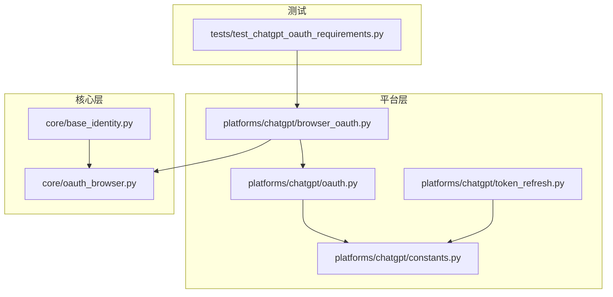
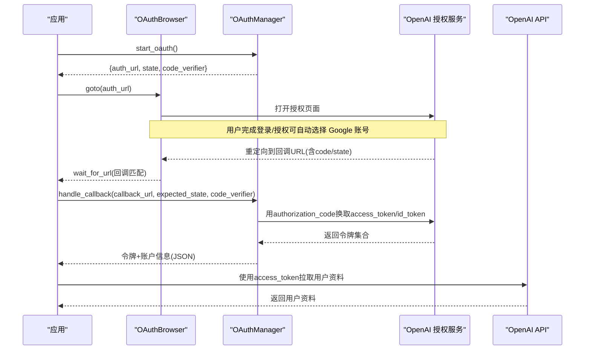
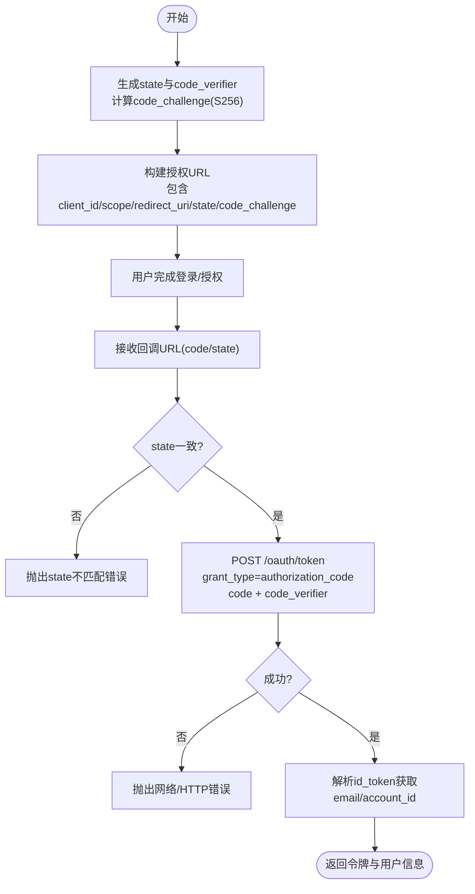
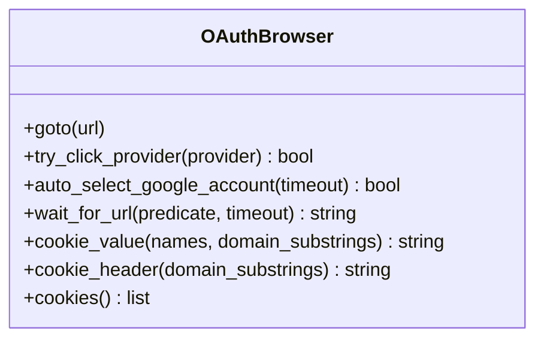
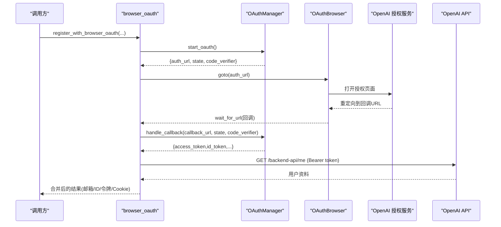
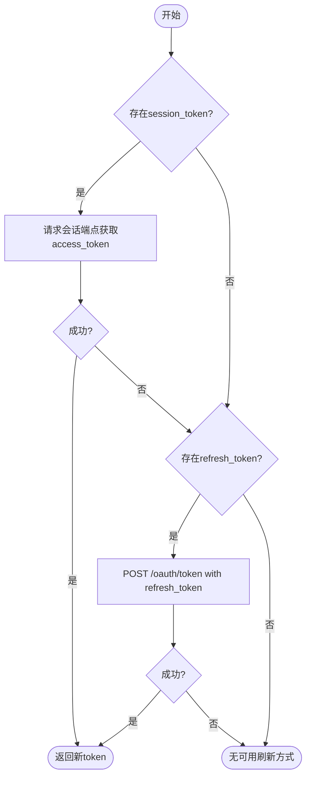
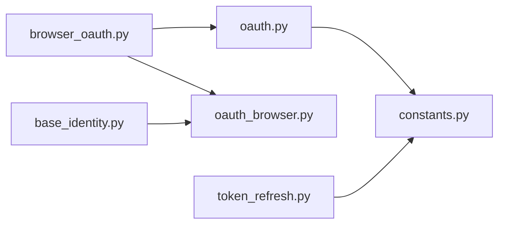

# OAuth第三方登录集成

<cite>
**本文引用的文件**
- [platforms/chatgpt/oauth.py](file://platforms/chatgpt/oauth.py)
- [platforms/chatgpt/constants.py](file://platforms/chatgpt/constants.py)
- [platforms/chatgpt/browser_oauth.py](file://platforms/chatgpt/browser_oauth.py)
- [core/oauth_browser.py](file://core/oauth_browser.py)
- [core/base_identity.py](file://core/base_identity.py)
- [platforms/chatgpt/token_refresh.py](file://platforms/chatgpt/token_refresh.py)
- [tests/test_chatgpt_oauth_requirements.py](file://tests/test_chatgpt_oauth_requirements.py)
</cite>

## 目录
1. [简介](#简介)
2. [项目结构](#项目结构)
3. [核心组件](#核心组件)
4. [架构总览](#架构总览)
5. [详细组件分析](#详细组件分析)
6. [依赖关系分析](#依赖关系分析)
7. [性能与可靠性](#性能与可靠性)
8. [故障排查指南](#故障排查指南)
9. [结论](#结论)
10. [附录：配置与安全最佳实践](#附录配置与安全最佳实践)

## 简介
本文件面向实现 ChatGPT 的 OAuth 第三方登录集成，重点解析 Google、Microsoft 等提供商在浏览器自动化流程中的授权码获取、令牌交换、用户信息提取、状态管理与安全性保障。文档同时覆盖回调 URL 处理、重定向机制、不同提供商的差异适配、错误处理策略、调试方法以及 Token 刷新方案。

## 项目结构
围绕 OAuth 的核心代码分布在以下模块：
- 平台层（ChatGPT）：OAuth 流程封装、常量配置、浏览器自动化入口、Token 刷新
- 核心层：共享的 OAuth 浏览器能力、身份提供者抽象
- 测试：对关键行为进行断言

图表来源
- [platforms/chatgpt/browser_oauth.py:1-115](file://platforms/chatgpt/browser_oauth.py#L1-L115)
- [platforms/chatgpt/oauth.py:1-379](file://platforms/chatgpt/oauth.py#L1-L379)
- [platforms/chatgpt/constants.py:50-70](file://platforms/chatgpt/constants.py#L50-L70)
- [core/oauth_browser.py:1-459](file://core/oauth_browser.py#L1-L459)
- [core/base_identity.py:1-131](file://core/base_identity.py#L1-L131)
- [platforms/chatgpt/token_refresh.py:1-339](file://platforms/chatgpt/token_refresh.py#L1-L339)
- [tests/test_chatgpt_oauth_requirements.py:1-107](file://tests/test_chatgpt_oauth_requirements.py#L1-L107)

章节来源
- [platforms/chatgpt/browser_oauth.py:1-115](file://platforms/chatgpt/browser_oauth.py#L1-L115)
- [platforms/chatgpt/oauth.py:1-379](file://platforms/chatgpt/oauth.py#L1-L379)
- [platforms/chatgpt/constants.py:50-70](file://platforms/chatgpt/constants.py#L50-L70)
- [core/oauth_browser.py:1-459](file://core/oauth_browser.py#L1-L459)
- [core/base_identity.py:1-131](file://core/base_identity.py#L1-L131)
- [platforms/chatgpt/token_refresh.py:1-339](file://platforms/chatgpt/token_refresh.py#L1-L339)
- [tests/test_chatgpt_oauth_requirements.py:1-107](file://tests/test_chatgpt_oauth_requirements.py#L1-L107)

## 核心组件
- OAuthManager：负责生成授权链接、处理回调并换取访问令牌，支持 PKCE 和 state 校验
- OAuthBrowser：基于 Playwright 的浏览器自动化，支持连接系统 Chrome/CDP、持久化上下文、自动选择 Google 账号、等待回调 URL、读取 Cookie
- 常量配置：OpenAI/OAuth 端点、Client ID、Scope、回调地址等，支持环境变量覆盖
- TokenRefreshManager：支持 Session Token 与 OAuth Refresh Token 两种刷新方式，并提供 Token 有效性验证
- 身份提供者抽象：统一归一化 OAuth 提供商别名（Google/Microsoft 等），便于上层按需提供提示文本或点击逻辑

章节来源
- [platforms/chatgpt/oauth.py:180-379](file://platforms/chatgpt/oauth.py#L180-L379)
- [core/oauth_browser.py:139-397](file://core/oauth_browser.py#L139-L397)
- [platforms/chatgpt/constants.py:50-70](file://platforms/chatgpt/constants.py#L50-L70)
- [platforms/chatgpt/token_refresh.py:37-243](file://platforms/chatgpt/token_refresh.py#L37-L243)
- [core/base_identity.py:18-46](file://core/base_identity.py#L18-L46)

## 架构总览
整体流程分为“发起授权”、“浏览器交互”、“回调处理”、“令牌交换”、“用户信息提取”、“会话维持”六个阶段。

图表来源
- [platforms/chatgpt/browser_oauth.py:44-110](file://platforms/chatgpt/browser_oauth.py#L44-L110)
- [platforms/chatgpt/oauth.py:190-320](file://platforms/chatgpt/oauth.py#L190-L320)
- [core/oauth_browser.py:242-341](file://core/oauth_browser.py#L242-L341)

## 详细组件分析

### OAuthManager：授权码流程与PKCE
- 生成授权链接：构造 state、code_challenge（S256）、scope、redirect_uri，并根据 client_id 选择不同端点（Codex CLI 使用 /oauth/authorize）
- 回调处理：解析回调 URL（支持 query 与 fragment 参数），校验 state 一致性，调用 token 端点换取 access_token、refresh_token、id_token
- 用户信息提取：从 id_token 中解析 email 与 OpenAI 自定义 claims（如 chatgpt_account_id）
- 安全要点：state 防 CSRF；PKCE 防授权码拦截；代理支持；异常时抛出明确错误

图表来源
- [platforms/chatgpt/oauth.py:190-320](file://platforms/chatgpt/oauth.py#L190-L320)

章节来源
- [platforms/chatgpt/oauth.py:190-320](file://platforms/chatgpt/oauth.py#L190-L320)

### OAuthBrowser：浏览器自动化与重定向处理
- 启动模式：优先连接已运行的 Chrome（CDP），否则尝试持久化上下文加载用户数据目录，最后回退到普通 Chromium
- 提供商选择：通过文本匹配智能定位并点击 Google/Microsoft/GitHub 等按钮
- 自动选择 Google 账号：当出现账号选择器时自动点击第一个账号
- 回调等待：轮询当前页 URL，直到匹配回调前缀且包含 code 参数
- Cookie 管理：提供 cookie_value/cookie_header/cookie_dict，支持按域名过滤

图表来源
- [core/oauth_browser.py:139-397](file://core/oauth_browser.py#L139-L397)

章节来源
- [core/oauth_browser.py:139-397](file://core/oauth_browser.py#L139-L397)

### 浏览器登录入口：register_with_browser_oauth
- 初始化 OAuthManager，生成授权链接
- 使用 OAuthBrowser 导航至授权页，必要时自动选择提供商或 Google 账号
- 等待回调 URL，调用 OAuthManager.handle_callback 换取令牌
- 使用 access_token 拉取用户资料，最终合并邮箱、account_id、session_token、cookies 等信息返回

图表来源
- [platforms/chatgpt/browser_oauth.py:44-110](file://platforms/chatgpt/browser_oauth.py#L44-L110)
- [platforms/chatgpt/oauth.py:323-366](file://platforms/chatgpt/oauth.py#L323-L366)
- [core/oauth_browser.py:242-341](file://core/oauth_browser.py#L242-L341)

章节来源
- [platforms/chatgpt/browser_oauth.py:44-110](file://platforms/chatgpt/browser_oauth.py#L44-L110)

### 身份提供者与提供商别名
- 统一归一化 OAuth 提供商名称（google/google-oauth2、microsoft/windowslive/live 等）
- 提供标签与提示文本，用于 UI 显示与引导用户操作
- 支持将 oauth_provider 与 email_hint 注入 IdentityMaterial，供上层流程使用

章节来源
- [core/base_identity.py:18-46](file://core/base_identity.py#L18-L46)
- [core/oauth_browser.py:11-45](file://core/oauth_browser.py#L11-L45)

### Token 刷新与会话维持
- 支持两种方式：
  - Session Token 刷新：设置 __Secure-next-auth.session-token 后请求会话端点获取 access_token
  - OAuth Refresh Token 刷新：使用 refresh_token 调用 /oauth/token 换取新 access_token
- 优先级：优先 Session Token，失败则尝试 OAuth Refresh Token
- 验证：调用 /backend-api/me 验证 access_token 是否有效

图表来源
- [platforms/chatgpt/token_refresh.py:66-243](file://platforms/chatgpt/token_refresh.py#L66-L243)

章节来源
- [platforms/chatgpt/token_refresh.py:66-243](file://platforms/chatgpt/token_refresh.py#L66-L243)

### 不同提供商的差异化处理
- Google：
  - 自动选择账号：当出现账号选择器时自动点击第一个账号
  - 提供商按钮识别：支持多种选择器与文本匹配
- Microsoft：
  - 提供商别名映射：microsoft/windowslive/live
  - 提示文本与按钮识别：通过 hints 列表匹配
- GitHub/LinkedIn/Apple/X：
  - 同样通过别名与 hints 列表进行按钮识别与提示

章节来源
- [core/oauth_browser.py:11-45](file://core/oauth_browser.py#L11-L45)
- [core/base_identity.py:18-46](file://core/base_identity.py#L18-L46)

## 依赖关系分析
- browser_oauth 依赖 OAuthManager 与 OAuthBrowser
- OAuthManager 依赖 constants 中的端点与 Client ID
- TokenRefreshManager 依赖 constants 中的回调地址与 Client ID
- base_identity 提供提供商别名与身份材料，被上层注册流程使用

图表来源
- [platforms/chatgpt/browser_oauth.py:1-115](file://platforms/chatgpt/browser_oauth.py#L1-L115)
- [platforms/chatgpt/oauth.py:1-379](file://platforms/chatgpt/oauth.py#L1-L379)
- [platforms/chatgpt/constants.py:50-70](file://platforms/chatgpt/constants.py#L50-L70)
- [platforms/chatgpt/token_refresh.py:1-339](file://platforms/chatgpt/token_refresh.py#L1-L339)
- [core/base_identity.py:1-131](file://core/base_identity.py#L1-L131)
- [core/oauth_browser.py:1-459](file://core/oauth_browser.py#L1-L459)

章节来源
- [platforms/chatgpt/browser_oauth.py:1-115](file://platforms/chatgpt/browser_oauth.py#L1-L115)
- [platforms/chatgpt/oauth.py:1-379](file://platforms/chatgpt/oauth.py#L1-L379)
- [platforms/chatgpt/constants.py:50-70](file://platforms/chatgpt/constants.py#L50-L70)
- [platforms/chatgpt/token_refresh.py:1-339](file://platforms/chatgpt/token_refresh.py#L1-L339)
- [core/base_identity.py:1-131](file://core/base_identity.py#L1-L131)
- [core/oauth_browser.py:1-459](file://core/oauth_browser.py#L1-L459)

## 性能与可靠性
- 浏览器启动优化：优先复用系统 Chrome（CDP），减少启动开销；支持持久化上下文保留登录态
- 网络请求：使用 curl_cffi 模拟浏览器指纹，提高成功率；支持代理配置
- 超时与重试：回调等待、Cookie 等待均支持超时控制；Token 刷新具备明确的错误路径
- 资源释放：确保 Context/Browser/PW 正确关闭，避免资源泄漏

[本节为通用指导，无需具体文件引用]

## 故障排查指南
- 回调缺少必要参数：检查回调 URL 是否包含 code 与 state，注意 query 与 fragment 的解析差异
- state 不匹配：确认传递的 expected_state 与回调中的 state 一致，防止 CSRF
- 令牌交换失败：检查 HTTP 状态码与响应体，关注网络错误与代理配置
- 未识别邮箱：若实际邮箱与预期不一致会抛出错误；确保 email_hint 与实际一致
- 提供商按钮未点击：检查页面元素是否存在，必要时调整 hints 列表或选择器
- Token 刷新失败：优先尝试 Session Token，再尝试 OAuth Refresh Token；查看日志中的错误信息

章节来源
- [platforms/chatgpt/oauth.py:240-320](file://platforms/chatgpt/oauth.py#L240-L320)
- [core/oauth_browser.py:305-341](file://core/oauth_browser.py#L305-L341)
- [platforms/chatgpt/token_refresh.py:66-243](file://platforms/chatgpt/token_refresh.py#L66-L243)
- [tests/test_chatgpt_oauth_requirements.py:16-68](file://tests/test_chatgpt_oauth_requirements.py#L16-L68)

## 结论
该实现以 OAuth2 PKCE 为核心，结合浏览器自动化与状态管理，提供了稳定可靠的 ChatGPT 第三方登录流程。通过对不同提供商的统一别名与提示机制，简化了上层集成；Token 刷新模块保障了长期可用性。建议在生产环境严格配置环境变量、启用代理与日志记录，并结合测试用例持续验证关键路径。

[本节为总结性内容，无需具体文件引用]

## 附录：配置与安全最佳实践
- 配置管理
  - 通过环境变量覆盖 OpenAI 基础地址、OAuth 客户端 ID、回调地址、Scope 等
  - 使用默认值保证本地开发便捷，生产环境务必显式配置
- 安全最佳实践
  - 始终使用 state 与 PKCE 防止 CSRF 与授权码劫持
  - 校验回调中的 state 与预期一致
  - 仅在后端进行令牌交换与敏感数据处理
  - 使用 HTTPS 回调地址，避免中间人攻击
  - 限制 scope 最小权限原则
- 调试方法
  - 启用浏览器可视化模式观察交互过程
  - 打印回调 URL 与解析结果，确认 code/state/error 字段
  - 捕获网络请求日志，检查代理与指纹设置
  - 使用 Token 验证接口快速判断 access_token 有效性

章节来源
- [platforms/chatgpt/constants.py:50-70](file://platforms/chatgpt/constants.py#L50-L70)
- [platforms/chatgpt/oauth.py:240-320](file://platforms/chatgpt/oauth.py#L240-L320)
- [platforms/chatgpt/token_refresh.py:245-279](file://platforms/chatgpt/token_refresh.py#L245-L279)