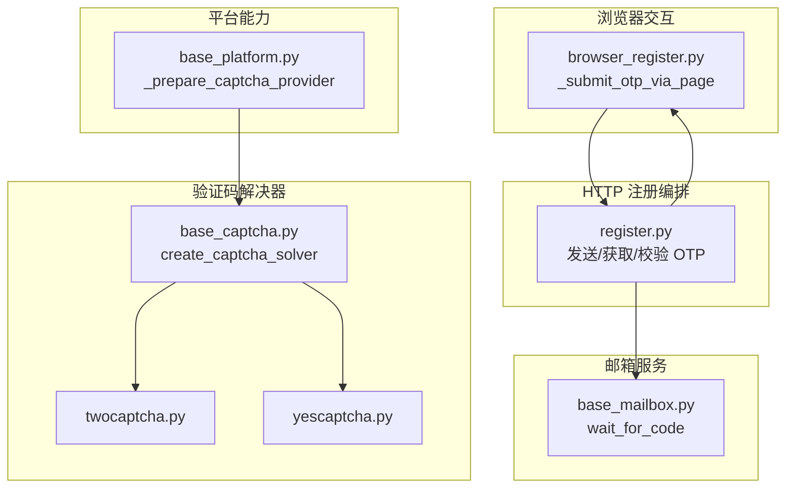
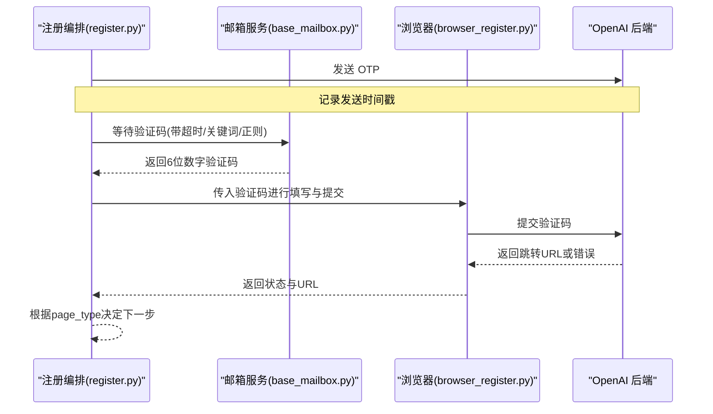
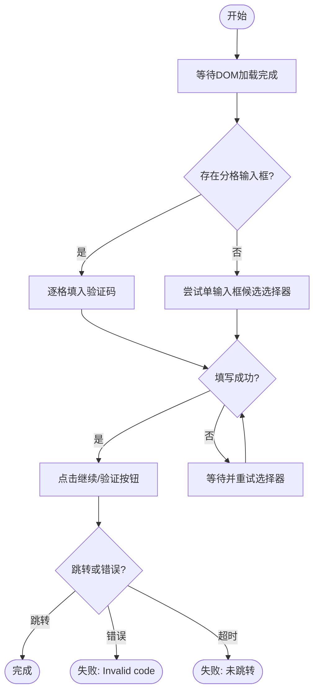
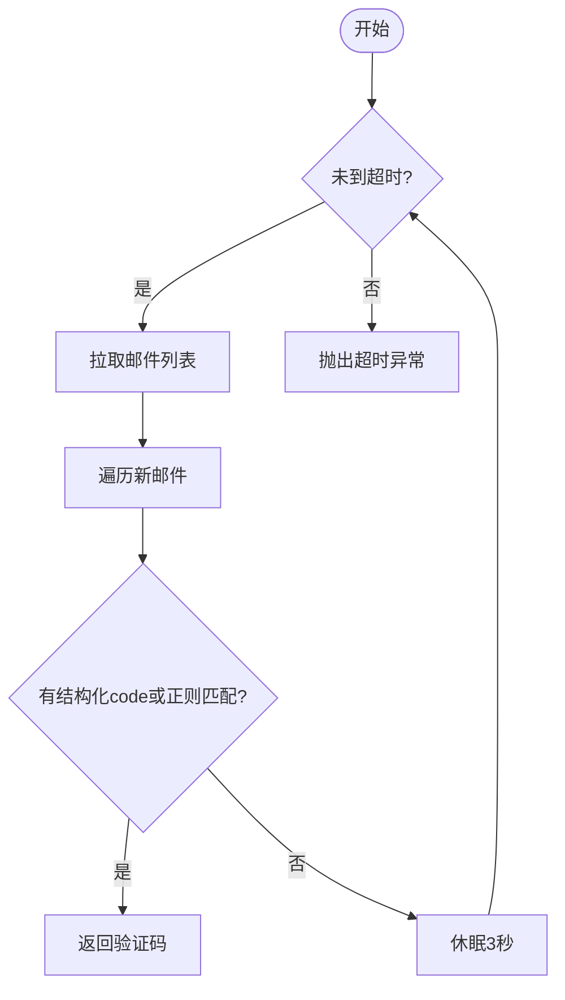
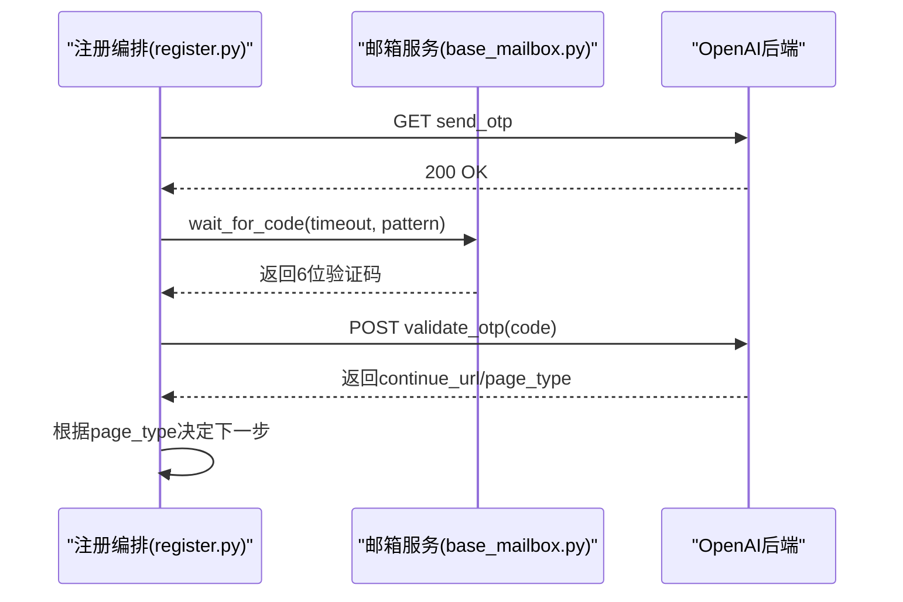
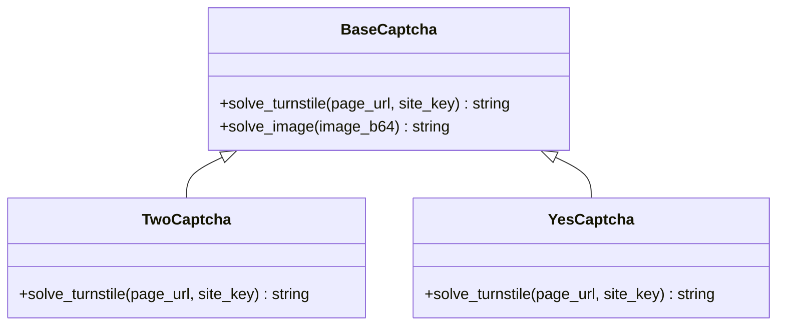
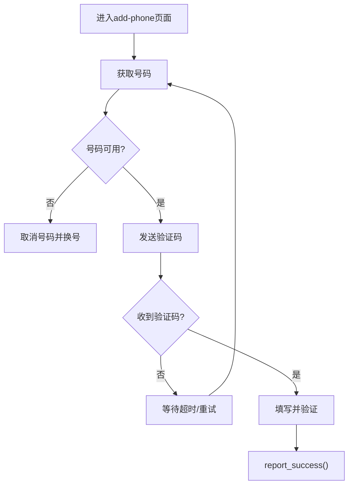
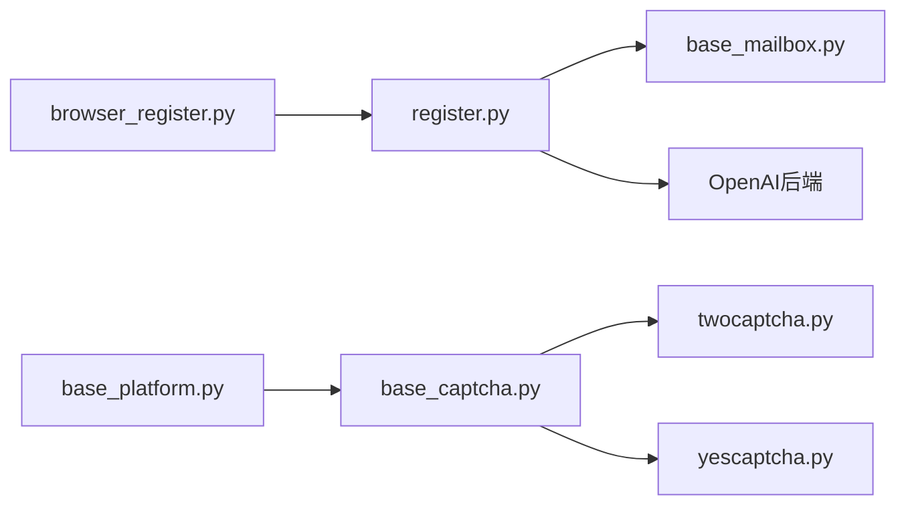

# OTP验证码处理

<cite>
**本文引用的文件**
- [platforms/chatgpt/browser_register.py](file://platforms/chatgpt/browser_register.py)
- [platforms/chatgpt/constants.py](file://platforms/chatgpt/constants.py)
- [platforms/chatgpt/register.py](file://platforms/chatgpt/register.py)
- [core/base_mailbox.py](file://core/base_mailbox.py)
- [core/base_captcha.py](file://core/base_captcha.py)
- [providers/captcha/twocaptcha.py](file://providers/captcha/twocaptcha.py)
- [providers/captcha/yescaptcha.py](file://providers/captcha/yescaptcha.py)
- [core/registration/helpers.py](file://core/registration/helpers.py)
- [core/registration/errors.py](file://core/registration/errors.py)
- [core/base_platform.py](file://core/base_platform.py)
- [tests/test_sms_provider.py](file://tests/test_sms_provider.py)
</cite>

## 目录
1. [简介](#简介)
2. [项目结构](#项目结构)
3. [核心组件](#核心组件)
4. [架构总览](#架构总览)
5. [详细组件分析](#详细组件分析)
6. [依赖关系分析](#依赖关系分析)
7. [性能考虑](#性能考虑)
8. [故障排查指南](#故障排查指南)
9. [结论](#结论)
10. [附录](#附录)

## 简介
本文件聚焦 ChatGPT 注册流程中的一次性验证码（OTP）自动识别、输入与验证的完整实现。内容涵盖：
- 多种输入框定位策略与选择器匹配机制
- 邮箱与短信两种 OTP 来源的等待与提取
- 超时处理与重试逻辑
- 不同验证码格式的正则容错
- 自定义验证码处理流程与异常恢复示例
- 性能优化、错误诊断与调试技巧

## 项目结构
围绕 OTP 的关键代码分布在以下模块：
- 浏览器端 OTP 填写与提交：platforms/chatgpt/browser_register.py
- 常量与正则模式：platforms/chatgpt/constants.py
- HTTP 注册流程编排：platforms/chatgpt/register.py
- 邮箱收件与验证码提取：core/base_mailbox.py
- 验证码解决器抽象与工厂：core/base_captcha.py，以及 providers/captcha/*
- 注册流程辅助回调构建：core/registration/helpers.py
- 平台级验证码能力准备：core/base_platform.py
- 短信侧重试与失败释放锁等测试用例：tests/test_sms_provider.py

图表来源
- [platforms/chatgpt/browser_register.py:2895-3021](file://platforms/chatgpt/browser_register.py#L2895-L3021)
- [platforms/chatgpt/register.py:673-752](file://platforms/chatgpt/register.py#L673-L752)
- [core/base_mailbox.py:1575-1598](file://core/base_mailbox.py#L1575-L1598)
- [core/base_captcha.py:67-97](file://core/base_captcha.py#L67-L97)
- [providers/captcha/twocaptcha.py:19-60](file://providers/captcha/twocaptcha.py#L19-L60)
- [providers/captcha/yescaptcha.py:20-39](file://providers/captcha/yescaptcha.py#L20-L39)
- [core/base_platform.py:372-410](file://core/base_platform.py#L372-L410)

章节来源
- [platforms/chatgpt/browser_register.py:2895-3021](file://platforms/chatgpt/browser_register.py#L2895-L3021)
- [platforms/chatgpt/register.py:673-752](file://platforms/chatgpt/register.py#L673-L752)
- [core/base_mailbox.py:1575-1598](file://core/base_mailbox.py#L1575-L1598)
- [core/base_captcha.py:67-97](file://core/base_captcha.py#L67-L97)
- [providers/captcha/twocaptcha.py:19-60](file://providers/captcha/twocaptcha.py#L19-L60)
- [providers/captcha/yescaptcha.py:20-39](file://providers/captcha/yescaptcha.py#L20-L39)
- [core/base_platform.py:372-410](file://core/base_platform.py#L372-L410)

## 核心组件
- 浏览器 OTP 填写器：负责在页面渲染后定位并填充 OTP 输入框，支持分格输入与单输入框，随后点击“继续/验证”按钮并监控跳转或错误提示。
- 注册编排器：协调发送 OTP、从邮箱拉取验证码、校验 OTP，并在检测到已注册账号时切换登录路径。
- 邮箱服务：轮询收件箱，按关键词和正则提取 6 位数字验证码，支持超时与自定义正则。
- 验证码解决器：通过统一接口创建具体云服务商（2Captcha、YesCaptcha）或本地求解器，用于 Turnstile 等挑战。
- 平台能力准备：根据配置启用并启动本地求解器等前置条件。

章节来源
- [platforms/chatgpt/browser_register.py:2895-3021](file://platforms/chatgpt/browser_register.py#L2895-L3021)
- [platforms/chatgpt/register.py:673-752](file://platforms/chatgpt/register.py#L673-L752)
- [core/base_mailbox.py:1575-1598](file://core/base_mailbox.py#L1575-L1598)
- [core/base_captcha.py:67-97](file://core/base_captcha.py#L67-L97)
- [core/base_platform.py:372-410](file://core/base_platform.py#L372-L410)

## 架构总览
下图展示 OTP 端到端流程：注册编排触发发送 OTP；邮箱服务轮询并提取验证码；浏览器端将验证码填入对应输入框并提交；服务端返回下一步页面或错误信息。

图表来源
- [platforms/chatgpt/register.py:673-752](file://platforms/chatgpt/register.py#L673-L752)
- [core/base_mailbox.py:1575-1598](file://core/base_mailbox.py#L1575-L1598)
- [platforms/chatgpt/browser_register.py:2895-3021](file://platforms/chatgpt/browser_register.py#L2895-L3021)

## 详细组件分析

### 浏览器端 OTP 填写与提交
- 输入框定位策略（优先级从高到低）：
  - 分格输入：匹配 inputmode=numeric、autocomplete=one-time-code、type=tel/number 的多个输入框，逐格填入每位数字。
  - 单输入框候选：按 label/role/name/id/type 等多类选择器尝试，包含“verification code/code/otp”语义匹配。
  - 延迟重试：若首次未命中，等待数秒后再次尝试更宽泛的选择器。
- 提交与结果判断：
  - 自动点击 Continue/Verify/Next 等按钮。
  - 循环检测是否跳转到目标页面（about-you/add-phone/chatgpt.com 等），或在页面上出现 “Invalid code” 错误文本。
  - 超时或未跳转返回失败状态。

图表来源
- [platforms/chatgpt/browser_register.py:2895-3021](file://platforms/chatgpt/browser_register.py#L2895-L3021)

章节来源
- [platforms/chatgpt/browser_register.py:2895-3021](file://platforms/chatgpt/browser_register.py#L2895-L3021)

### 邮箱 OTP 等待与提取
- 轮询策略：周期性调用邮箱 API 拉取邮件列表，优先使用结构化字段（如 verification_code），否则从预览/主题中用正则提取 6 位数字。
- 过滤与去重：基于 before_ids 避免重复处理旧邮件；支持 keyword 过滤。
- 超时控制：达到 timeout 仍未找到则抛出超时异常。

图表来源
- [core/base_mailbox.py:1575-1598](file://core/base_mailbox.py#L1575-L1598)
- [core/base_mailbox.py:1758-1783](file://core/base_mailbox.py#L1758-L1783)

章节来源
- [core/base_mailbox.py:1575-1598](file://core/base_mailbox.py#L1575-L1598)
- [core/base_mailbox.py:1758-1783](file://core/base_mailbox.py#L1758-L1783)

### 注册编排中的 OTP 流程
- 发送 OTP：调用 OpenAI 后端发送邮箱验证码，记录发送时间戳。
- 获取验证码：委托邮箱服务等待并提取验证码，支持自定义正则与超时。
- 校验 OTP：提交验证码到后端，解析 continue_url 与 page_type，用于后续流程分支。
- 已注册账号处理：当响应指示为 email_otp_verification 时，切换到登录路径。

图表来源
- [platforms/chatgpt/register.py:673-752](file://platforms/chatgpt/register.py#L673-L752)
- [core/base_mailbox.py:1575-1598](file://core/base_mailbox.py#L1575-L1598)

章节来源
- [platforms/chatgpt/register.py:673-752](file://platforms/chatgpt/register.py#L673-L752)

### 验证码解决器（Turnstile）集成
- 抽象接口：BaseCaptcha 定义 solve_turnstile/solve_image。
- 工厂方法：create_captcha_solver 根据配置创建具体实现（local_solver、yescaptcha_api、twocaptcha_api）。
- 平台准备：_prepare_captcha_provider 在需要时启动本地求解器服务。
- 云服务商实现：TwoCaptcha、YesCaptcha 提供轮询任务结果的超时保护。

图表来源
- [core/base_captcha.py:5-14](file://core/base_captcha.py#L5-L14)
- [core/base_captcha.py:67-97](file://core/base_captcha.py#L67-L97)
- [providers/captcha/twocaptcha.py:19-60](file://providers/captcha/twocaptcha.py#L19-L60)
- [providers/captcha/yescaptcha.py:20-39](file://providers/captcha/yescaptcha.py#L20-L39)
- [core/base_platform.py:372-410](file://core/base_platform.py#L372-L410)

章节来源
- [core/base_captcha.py:67-97](file://core/base_captcha.py#L67-L97)
- [providers/captcha/twocaptcha.py:19-60](file://providers/captcha/twocaptcha.py#L19-L60)
- [providers/captcha/yescaptcha.py:20-39](file://providers/captcha/yescaptcha.py#L20-L39)
- [core/base_platform.py:372-410](file://core/base_platform.py#L372-L410)

### 手机号 OTP（短信）与重试
- add-phone 流程：选择国家、输入号码、发送验证码、填写 OTP、点击验证。
- 超时换号：若未收到验证码或号码被占用，自动取消当前号码并重置状态，重新获取号码重试（最多指定次数）。
- 成功上报：完成后调用 provider.report_success 标记号码使用完成。

图表来源
- [platforms/chatgpt/browser_register.py:2048-2109](file://platforms/chatgpt/browser_register.py#L2048-L2109)
- [platforms/chatgpt/browser_register.py:2287-2315](file://platforms/chatgpt/browser_register.py#L2287-L2315)
- [tests/test_sms_provider.py:182-253](file://tests/test_sms_provider.py#L182-L253)

章节来源
- [platforms/chatgpt/browser_register.py:2048-2109](file://platforms/chatgpt/browser_register.py#L2048-L2109)
- [platforms/chatgpt/browser_register.py:2287-2315](file://platforms/chatgpt/browser_register.py#L2287-L2315)
- [tests/test_sms_provider.py:182-253](file://tests/test_sms_provider.py#L182-L253)

### 验证码格式与容错
- 默认正则：匹配前后非数字的 6 位数字序列。
- 增强语义匹配：支持“code is ...”、“验证码...”等上下文。
- 邮箱服务兜底：优先使用结构化字段，其次从预览/主题中提取。

章节来源
- [platforms/chatgpt/constants.py:145-153](file://platforms/chatgpt/constants.py#L145-L153)
- [core/base_mailbox.py:1575-1598](file://core/base_mailbox.py#L1575-L1598)
- [core/base_mailbox.py:1758-1783](file://core/base_mailbox.py#L1758-L1783)

### 自定义验证码处理流程与异常恢复示例
- 构建 OTP 回调：通过 build_otp_callback 封装邮箱等待逻辑，支持 keyword、timeout、code_pattern、wait_message、success_label。
- 异常恢复：
  - 邮箱服务超时抛出超时异常，上层可捕获并执行重试或降级策略。
  - 浏览器端未找到输入框或提交失败，返回明确状态码与文本，便于上层决策。
  - 短信侧首次获取号码失败不污染后续重试，失败时释放验证锁。

章节来源
- [core/registration/helpers.py:46-72](file://core/registration/helpers.py#L46-L72)
- [core/registration/errors.py:16-18](file://core/registration/errors.py#L16-L18)
- [tests/test_sms_provider.py:204-253](file://tests/test_sms_provider.py#L204-L253)

## 依赖关系分析
- 浏览器端依赖注册编排提供的验证码字符串，并通过选择器与 DOM 交互。
- 注册编排依赖邮箱服务获取验证码，依赖后端 API 发送与校验。
- 验证码解决器通过工厂按需创建，平台层确保本地求解器就绪。
- 短信侧与平台无关，但通过统一的回调与清理接口参与整体流程。

图表来源
- [platforms/chatgpt/browser_register.py:2895-3021](file://platforms/chatgpt/browser_register.py#L2895-L3021)
- [platforms/chatgpt/register.py:673-752](file://platforms/chatgpt/register.py#L673-L752)
- [core/base_mailbox.py:1575-1598](file://core/base_mailbox.py#L1575-L1598)
- [core/base_platform.py:372-410](file://core/base_platform.py#L372-L410)
- [core/base_captcha.py:67-97](file://core/base_captcha.py#L67-L97)
- [providers/captcha/twocaptcha.py:19-60](file://providers/captcha/twocaptcha.py#L19-L60)
- [providers/captcha/yescaptcha.py:20-39](file://providers/captcha/yescaptcha.py#L20-L39)

章节来源
- [platforms/chatgpt/browser_register.py:2895-3021](file://platforms/chatgpt/browser_register.py#L2895-L3021)
- [platforms/chatgpt/register.py:673-752](file://platforms/chatgpt/register.py#L673-L752)
- [core/base_mailbox.py:1575-1598](file://core/base_mailbox.py#L1575-L1598)
- [core/base_platform.py:372-410](file://core/base_platform.py#L372-L410)
- [core/base_captcha.py:67-97](file://core/base_captcha.py#L67-L97)
- [providers/captcha/twocaptcha.py:19-60](file://providers/captcha/twocaptcha.py#L19-L60)
- [providers/captcha/yescaptcha.py:20-39](file://providers/captcha/yescaptcha.py#L20-L39)

## 性能考虑
- 减少不必要的等待：浏览器端仅在必要时 sleep，并使用可见性等待与短超时提升响应速度。
- 邮箱轮询间隔：采用固定 3 秒轮询，平衡负载与时效。
- 选择器优先级：先尝试高确定性选择器（inputmode/autocomplete），再回退到语义匹配，降低误匹配成本。
- 验证码解决器：云服务商轮询间隔 3 秒，设置最大轮询次数防止无限等待。
- 短信侧：首次失败不污染后续重试，避免无效缓存影响性能。

[本节为通用指导，无需特定文件引用]

## 故障排查指南
- 未找到输入框：检查页面是否已渲染完成，确认选择器是否正确；查看日志输出以定位失败阶段。
- 验证码为空：确认邮箱服务是否成功拉取到验证码；检查正则与关键词配置。
- 提交失败：关注 “Invalid code” 错误文本；确认验证码位数与格式。
- 超时问题：调整邮箱服务的 timeout；检查网络与第三方服务可用性。
- 短信侧失败：参考测试用例行为，确认 cancel/report_success 钩子是否被正确调用。

章节来源
- [platforms/chatgpt/browser_register.py:2895-3021](file://platforms/chatgpt/browser_register.py#L2895-L3021)
- [core/base_mailbox.py:1575-1598](file://core/base_mailbox.py#L1575-L1598)
- [tests/test_sms_provider.py:204-253](file://tests/test_sms_provider.py#L204-L253)

## 结论
该实现通过分层协作完成了 ChatGPT OTP 的全链路自动化：浏览器端智能定位与输入、邮箱服务稳定提取、注册编排精准流转、验证码解决器灵活接入。其设计兼顾了鲁棒性与可维护性，提供了丰富的选择器策略、超时与重试机制，以及清晰的错误反馈，便于扩展与定制。

[本节为总结性内容，无需特定文件引用]

## 附录
- 关键常量与正则：OTP_CODE_PATTERN、OTP_MAX_ATTEMPTS、OPENAI_VERIFICATION_KEYWORDS 等。
- 常见选择器集合：分格输入、单输入框、语义匹配等。
- 回调构建：build_otp_callback 参数说明与用法。

章节来源
- [platforms/chatgpt/constants.py:145-171](file://platforms/chatgpt/constants.py#L145-L171)
- [core/registration/helpers.py:46-72](file://core/registration/helpers.py#L46-L72)