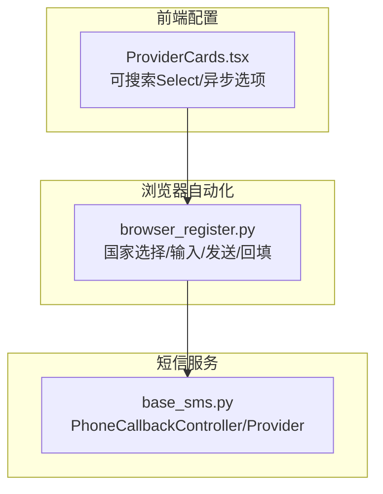
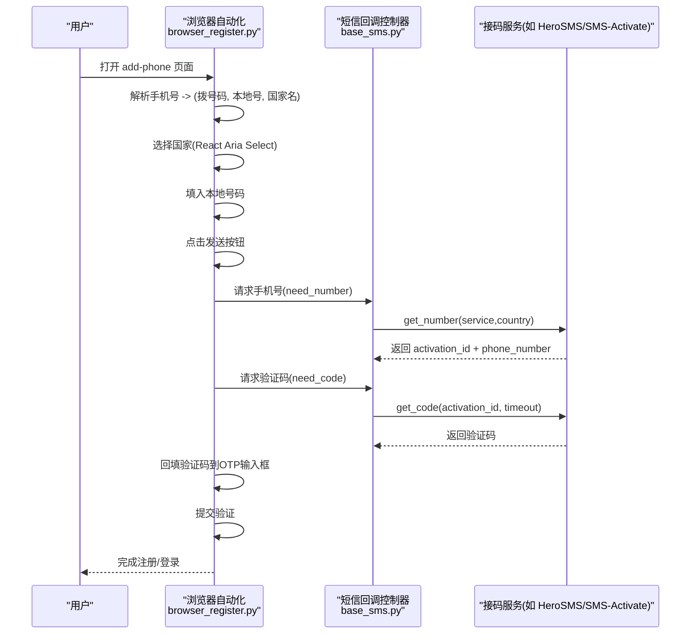
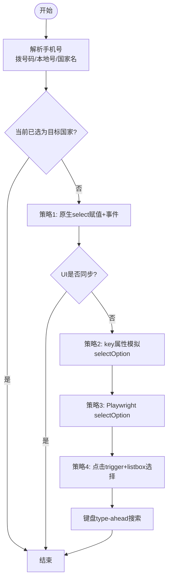
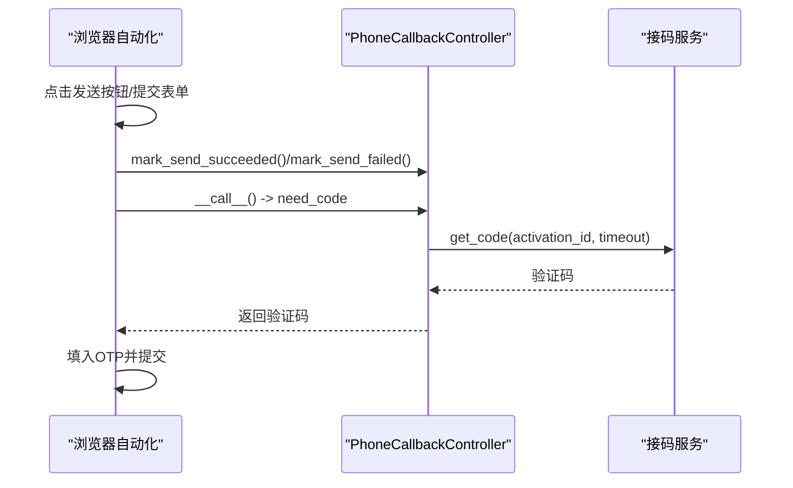
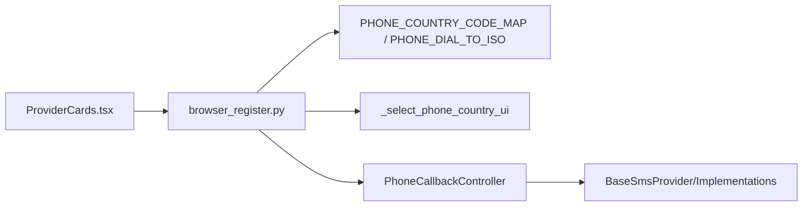

# 手机号验证流程

<cite>
**本文引用的文件**
- [browser_register.py](file://platforms/chatgpt/browser_register.py)
- [base_sms.py](file://core/base_sms.py)
- [ProviderCards.tsx](file://frontend/src/components/settings/ProviderCards.tsx)
- [test_sms_provider.py](file://tests/test_sms_provider.py)
</cite>

## 目录
1. [简介](#简介)
2. [项目结构](#项目结构)
3. [核心组件](#核心组件)
4. [架构总览](#架构总览)
5. [详细组件分析](#详细组件分析)
6. [依赖关系分析](#依赖关系分析)
7. [性能考量](#性能考量)
8. [故障排查指南](#故障排查指南)
9. [结论](#结论)
10. [附录](#附录)

## 简介
本文件面向“ChatGPT 手机号验证”的端到端实现，覆盖以下关键点：
- 国际电话号码格式解析与本地号码提取
- 国家代码选择与 React Aria Select 交互自动化
- 拨号码到 ISO 国家代码映射机制
- 手机验证码接收、回填与校验的完整流程
- 错误处理策略、重试与换号机制
- 多语言支持、地区适配与性能优化建议

## 项目结构
围绕手机号验证的核心代码分布在三个层次：
- 浏览器自动化层（前端页面交互）：负责在 ChatGPT 注册页面上自动填写手机号、选择国家、发送验证码并回填 OTP。
- 短信服务层（接码平台）：负责租赁手机号、轮询获取验证码、释放或标记成功。
- 前端配置层（可选）：提供可搜索的选择器 UI，便于用户配置接码服务与国家等参数。

图表来源
- [browser_register.py:101-153](file://platforms/chatgpt/browser_register.py#L101-L153)
- [base_sms.py:1103-1266](file://core/base_sms.py#L1103-L1266)
- [ProviderCards.tsx:39-117](file://frontend/src/components/settings/ProviderCards.tsx#L39-L117)

章节来源
- [browser_register.py:101-153](file://platforms/chatgpt/browser_register.py#L101-L153)
- [base_sms.py:1103-1266](file://core/base_sms.py#L1103-L1266)
- [ProviderCards.tsx:39-117](file://frontend/src/components/settings/ProviderCards.tsx#L39-L117)

## 核心组件
- 国际号码解析与国家选择
  - 通过拨号前缀匹配国家名与 ISO 代码，用于 UI 下拉框定位目标国家。
  - 使用多种策略操作 React Aria Select（原生 select、事件触发、Playwright API、键盘 type-ahead）。
- 短信回调控制器
  - 管理号码租赁、验证码等待、成功/失败上报、资源释放。
  - 支持智能国家选择（价格最低且库存充足），以及自动回退到默认国家。
- 前端可搜索选择器
  - 提供带搜索的下拉组件，支持异步加载选项，便于配置接码服务与国家。

章节来源
- [browser_register.py:190-202](file://platforms/chatgpt/browser_register.py#L190-L202)
- [browser_register.py:205-515](file://platforms/chatgpt/browser_register.py#L205-L515)
- [base_sms.py:1103-1266](file://core/base_sms.py#L1103-L1266)
- [ProviderCards.tsx:39-117](file://frontend/src/components/settings/ProviderCards.tsx#L39-L117)

## 架构总览
下图展示了从“输入手机号”到“回填验证码”的端到端调用链，包括浏览器自动化与短信服务的协作。

图表来源
- [browser_register.py:205-515](file://platforms/chatgpt/browser_register.py#L205-L515)
- [browser_register.py:2258-2285](file://platforms/chatgpt/browser_register.py#L2258-L2285)
- [base_sms.py:1103-1266](file://core/base_sms.py#L1103-L1266)

## 详细组件分析

### 国际电话号码格式与国家选择
- 号码解析
  - 去除“+”并尝试按3位、2位、1位前缀匹配国家拨号码，得到拨号码、本地号码和国家名。
- 国家选择器自动化
  - 优先通过底层隐藏的原生 <select> 设置值并触发 change/input 事件，以同步 React 状态。
  - 若 UI 未同步，则尝试 Playwright 的 selectOption API。
  - 再失败时，点击触发按钮打开 listbox，查找并点击对应 option。
  - 最后采用键盘 type-ahead 搜索国家名并按 Enter 确认。
- 拨号码到 ISO 映射
  - 维护拨号码到 ISO 3166-1 alpha-2 的映射表，用于精确匹配 React Aria Select 的 value。

图表来源
- [browser_register.py:190-202](file://platforms/chatgpt/browser_register.py#L190-L202)
- [browser_register.py:205-515](file://platforms/chatgpt/browser_register.py#L205-L515)

章节来源
- [browser_register.py:101-153](file://platforms/chatgpt/browser_register.py#L101-L153)
- [browser_register.py:190-202](file://platforms/chatgpt/browser_register.py#L190-L202)
- [browser_register.py:205-515](file://platforms/chatgpt/browser_register.py#L205-L515)

### 拨号码到ISO国家代码映射机制
- 目的：将拨号码转换为 ISO 代码，以便在 React Aria Select 中通过 value 精确匹配。
- 方法：维护拨号码到 ISO 的双向映射；在选择逻辑中先尝试 ISO 匹配，再回退到文本包含匹配。
- 扩展性：新增国家只需在映射表中添加拨号码、国家名和 ISO 代码。

章节来源
- [browser_register.py:101-153](file://platforms/chatgpt/browser_register.py#L101-L153)

### 手机验证码接收与输入流程
- 发送阶段
  - 查找并点击“发送验证码”按钮，或通过表单 fallback 提交。
  - 检查页面错误信息，必要时通知回调控制器标记发送失败。
- 等待验证码
  - 回调控制器进入 need_code 阶段，轮询接码服务获取验证码。
  - 若接码服务支持自动上报成功，则在收到验证码后直接标记成功；否则等待外部成功信号。
- 回填与提交
  - 将验证码填入 OTP 输入框并提交，完成验证。

图表来源
- [browser_register.py:2258-2285](file://platforms/chatgpt/browser_register.py#L2258-L2285)
- [base_sms.py:1180-1192](file://core/base_sms.py#L1180-L1192)

章节来源
- [browser_register.py:2258-2285](file://platforms/chatgpt/browser_register.py#L2258-L2285)
- [base_sms.py:1180-1192](file://core/base_sms.py#L1180-L1192)

### React Aria Select 国家选择器交互实现
- 识别目标国家
  - 通过 ISO 代码、拨号码文本（如 “(+66)”）、国家名进行匹配。
- 同步 React 状态
  - 直接修改隐藏 <select> 的值并触发 change/input 事件，确保 React 状态更新。
- 容错与回退
  - 若 UI 未同步，依次尝试 Playwright selectOption、点击 trigger 打开 listbox、键盘搜索。
- 验证结果
  - 选择后读取触发按钮文本，确认显示包含拨号码。

章节来源
- [browser_register.py:205-515](file://platforms/chatgpt/browser_register.py#L205-L515)

### 错误处理与重试策略
- 发送失败
  - 检测页面错误文本，调用回调控制器的 mark_send_failed，抛出运行时异常。
- 验证码超时或未收到
  - 捕获“未获取到短信验证码”等错误，清理当前号码并重置回调状态为 need_number，触发换号重试。
- 号码被占用
  - 若服务端提示号码已被使用，同样走换号重试流程。
- 资源释放
  - 清理时根据 provider 行为决定 cancel 或 report_success，避免资源泄漏。

章节来源
- [browser_register.py:2080-2109](file://platforms/chatgpt/browser_register.py#L2080-L2109)
- [base_sms.py:1233-1246](file://core/base_sms.py#L1233-L1246)
- [test_sms_provider.py:182-292](file://tests/test_sms_provider.py#L182-L292)

### 多语言支持与地区适配
- 多语言按钮/文本选择器
  - 使用多语言文本匹配发送/验证按钮，兼容中英文及本地化文案。
- 国家名与拨号码
  - 通过国家名与拨号码双重匹配，提升在不同语言环境下的鲁棒性。
- 地区适配
  - 智能国家选择基于接码服务的价格与库存，优先选择可用且便宜的地区。

章节来源
- [browser_register.py:166-187](file://platforms/chatgpt/browser_register.py#L166-L187)
- [base_sms.py:1131-1153](file://core/base_sms.py#L1131-L1153)

### 性能优化技巧
- 减少不必要的 DOM 操作
  - 优先通过原生 <select> 赋值并触发事件，避免多次 UI 交互。
- 快速匹配
  - 使用 ISO 代码优先匹配，减少字符串比较开销。
- 并发与锁
  - 对特定接码服务（如 HeroSMS）使用线程锁保护关键路径，避免竞争条件。
- 缓存与复用
  - 支持号码复用与缓存，降低重复租赁成本与网络开销。

章节来源
- [browser_register.py:244-371](file://platforms/chatgpt/browser_register.py#L244-L371)
- [base_sms.py:581-634](file://core/base_sms.py#L581-L634)
- [base_sms.py:1127-1129](file://core/base_sms.py#L1127-L1129)

## 依赖关系分析
- 浏览器自动化依赖国家映射表与选择器策略，确保在不同 UI 结构下稳定工作。
- 短信回调控制器依赖具体接码服务实现，封装号码租赁与验证码获取细节。
- 前端配置层通过可搜索选择器简化用户配置过程，支持异步加载选项。

图表来源
- [browser_register.py:101-153](file://platforms/chatgpt/browser_register.py#L101-L153)
- [browser_register.py:205-515](file://platforms/chatgpt/browser_register.py#L205-L515)
- [base_sms.py:1103-1266](file://core/base_sms.py#L1103-L1266)
- [ProviderCards.tsx:39-117](file://frontend/src/components/settings/ProviderCards.tsx#L39-L117)

章节来源
- [browser_register.py:101-153](file://platforms/chatgpt/browser_register.py#L101-L153)
- [base_sms.py:1103-1266](file://core/base_sms.py#L1103-L1266)
- [ProviderCards.tsx:39-117](file://frontend/src/components/settings/ProviderCards.tsx#L39-L117)

## 性能考量
- 选择策略优先级
  - 原生 select 赋值最快，其次 Playwright API，最后 UI 交互。
- 事件冒泡与状态同步
  - 正确触发 change/input 事件，避免 React 状态不同步导致的额外重试。
- 锁与并发
  - 对关键路径加锁，防止多线程竞争导致的状态不一致。
- 缓存与复用
  - 号码复用减少网络请求与费用，同时缩短整体流程耗时。

[本节为通用性能讨论，不直接分析具体文件]

## 故障排查指南
- 无法找到发送按钮
  - 检查多语言选择器列表，确认页面文案是否变化。
  - 使用表单 fallback 提交作为兜底。
- 国家选择失败
  - 查看是否已选中目标国家，避免重复操作。
  - 逐步尝试各策略并记录日志，定位失败点。
- 验证码未收到
  - 检查接码服务状态与余额，确认激活 ID 有效。
  - 若超时，清理并换号重试。
- 资源未释放
  - 确保 cleanup 被调用，避免号码长期占用。

章节来源
- [browser_register.py:2258-2285](file://platforms/chatgpt/browser_register.py#L2258-L2285)
- [base_sms.py:1233-1246](file://core/base_sms.py#L1233-L1246)
- [test_sms_provider.py:182-292](file://tests/test_sms_provider.py#L182-L292)

## 结论
该实现通过严谨的号码解析、稳健的国家选择策略、健壮的验证码接收与回填流程，以及完善的错误处理与资源管理机制，实现了 ChatGPT 手机号验证的高成功率自动化。结合前端可搜索选择器与智能国家选择，进一步提升了用户体验与系统稳定性。

[本节为总结性内容，不直接分析具体文件]

## 附录
- 自定义手机号验证流程示例要点
  - 定义拨号码到国家名与 ISO 的映射表。
  - 实现 _select_phone_country_ui 的多策略选择逻辑。
  - 使用 PhoneCallbackController 管理号码租赁与验证码获取。
  - 在前端提供可搜索选择器，支持异步加载国家与服务选项。
- 错误处理策略
  - 发送失败：标记失败并抛出异常。
  - 验证码超时：清理并换号重试。
  - 资源释放：根据 provider 行为决定 cancel 或 report_success。

章节来源
- [browser_register.py:101-153](file://platforms/chatgpt/browser_register.py#L101-L153)
- [browser_register.py:205-515](file://platforms/chatgpt/browser_register.py#L205-L515)
- [base_sms.py:1103-1266](file://core/base_sms.py#L1103-L1266)
- [ProviderCards.tsx:39-117](file://frontend/src/components/settings/ProviderCards.tsx#L39-L117)