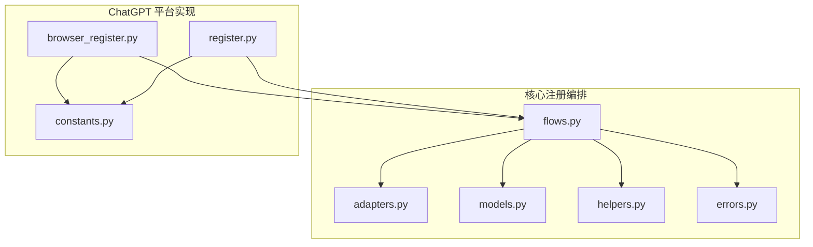
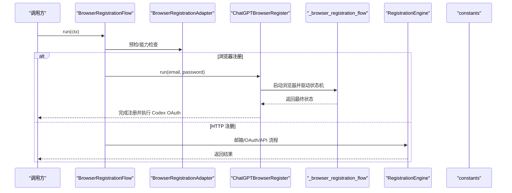
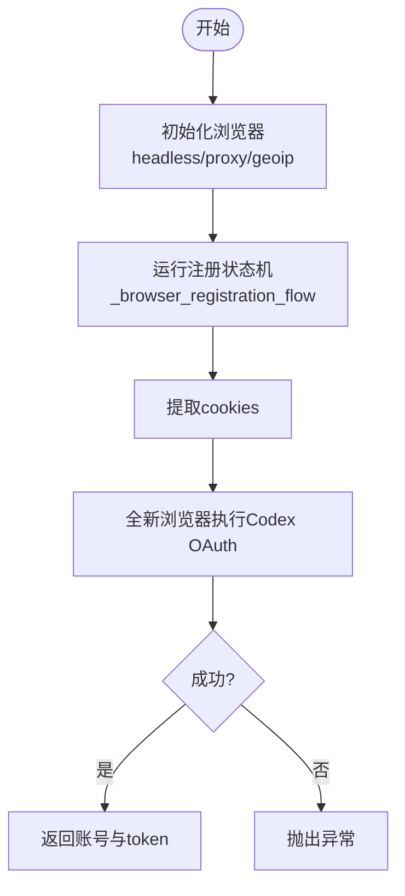
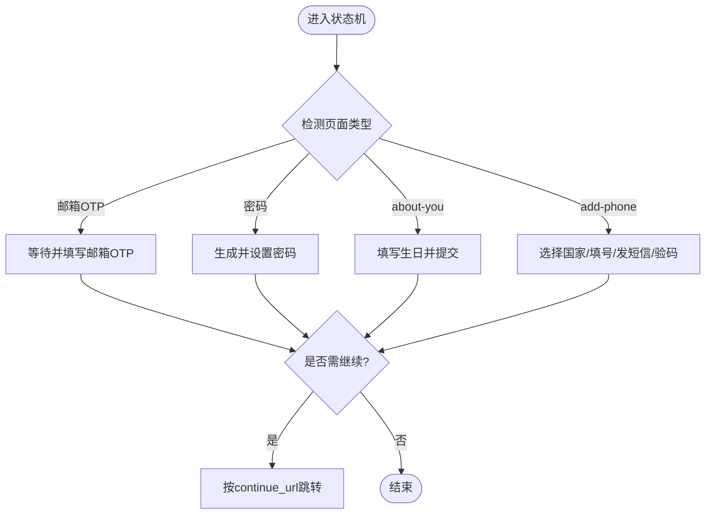
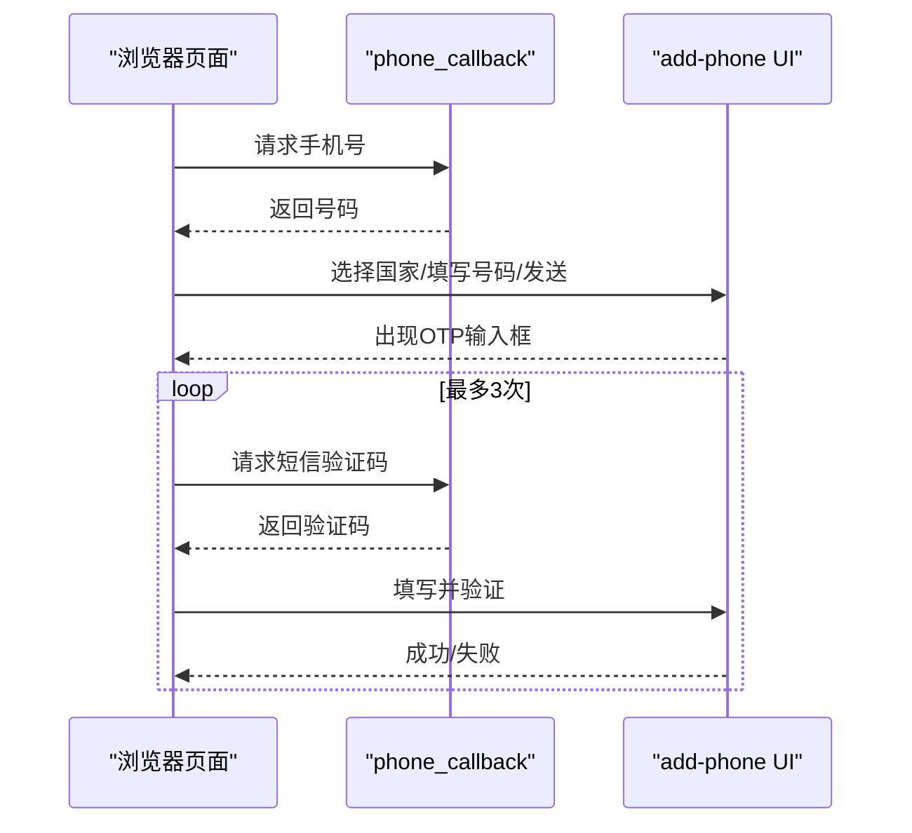
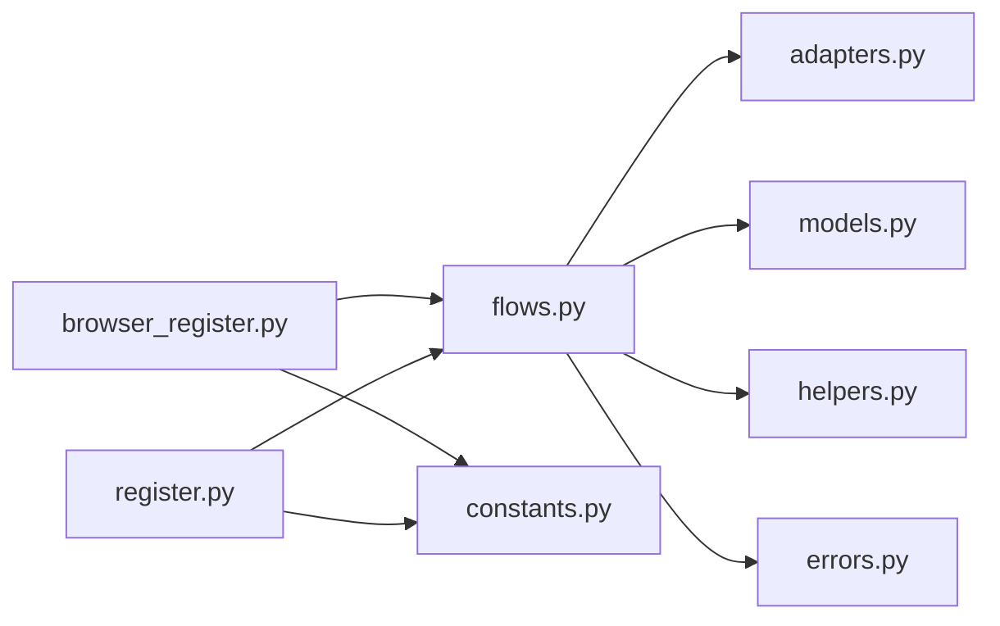

# 核心注册流程

<cite>
**本文引用的文件**
- [browser_register.py](file://platforms/chatgpt/browser_register.py)
- [register.py](file://platforms/chatgpt/register.py)
- [constants.py](file://platforms/chatgpt/constants.py)
- [flows.py](file://core/registration/flows.py)
- [adapters.py](file://core/registration/adapters.py)
- [helpers.py](file://core/registration/helpers.py)
- [models.py](file://core/registration/models.py)
- [errors.py](file://core/registration/errors.py)
</cite>

## 目录
1. [简介](#简介)
2. [项目结构](#项目结构)
3. [核心组件](#核心组件)
4. [架构总览](#架构总览)
5. [详细组件分析](#详细组件分析)
6. [依赖关系分析](#依赖关系分析)
7. [性能考虑](#性能考虑)
8. [故障排查指南](#故障排查指南)
9. [结论](#结论)
10. [附录](#附录)

## 简介
本文件聚焦 ChatGPT 浏览器端注册流程的核心实现，围绕 ChatGPTBrowserRegister 类展开，系统阐述从浏览器实例初始化、页面导航控制、表单自动填充、邮箱与密码设置、验证码处理到手机号验证的完整链路。文档同时覆盖页面元素定位策略、选择器匹配机制、错误处理与重试逻辑，并提供自定义注册流程与异常处理的实践建议，以及浏览器兼容性配置、性能优化技巧与调试方法。

## 项目结构
该仓库采用平台化分层组织：核心注册编排位于 core/registration，具体平台（如 ChatGPT）的实现位于 platforms/chatgpt。ChatGPT 的浏览器注册由 browser_register.py 提供，HTTP 注册引擎在 register.py 中实现；常量与端点定义集中在 constants.py；通用注册流适配器与模型在 core/registration 下。

图表来源
- [flows.py:18-79](file://core/registration/flows.py#L18-L79)
- [adapters.py:27-59](file://core/registration/adapters.py#L27-L59)
- [models.py:7-66](file://core/registration/models.py#L7-L66)
- [helpers.py:46-177](file://core/registration/helpers.py#L46-L177)
- [errors.py:1-27](file://core/registration/errors.py#L1-L27)
- [browser_register.py:3831-3909](file://platforms/chatgpt/browser_register.py#L3831-L3909)
- [register.py:187-800](file://platforms/chatgpt/register.py#L187-L800)
- [constants.py:53-91](file://platforms/chatgpt/constants.py#L53-L91)

章节来源
- [flows.py:18-79](file://core/registration/flows.py#L18-L79)
- [browser_register.py:3831-3909](file://platforms/chatgpt/browser_register.py#L3831-L3909)
- [register.py:187-800](file://platforms/chatgpt/register.py#L187-L800)
- [constants.py:53-91](file://platforms/chatgpt/constants.py#L53-L91)

## 核心组件
- ChatGPTBrowserRegister：浏览器注册入口，负责启动 Camoufox 浏览器上下文、驱动注册状态机、获取 cookies，并在注册完成后通过全新浏览器执行 Codex CLI OAuth 以获取稳定 token。
- _browser_registration_flow：浏览器注册状态机，根据 page_type/current_url/continue_url 推进流程，处理邮箱 OTP、密码设置、about-you、add-phone 等阶段。
- RegistrationEngine：HTTP 模式注册引擎，协调邮箱服务、OAuth 流程与 OpenAI API 调用，包含 Sentinel PoW 与 Turnstile 处理。
- BrowserRegistrationAdapter / flows：通用注册编排，装配 OTP/链接/短信回调、能力校验、结果映射。
- helpers：构建 OTP/链接/短信回调，校验身份与执行器类型，复用浏览器会话等。
- models/errors：注册上下文、工件、结果与异常类型。

章节来源
- [browser_register.py:3831-3909](file://platforms/chatgpt/browser_register.py#L3831-L3909)
- [browser_register.py:2005-2340](file://platforms/chatgpt/browser_register.py#L2005-L2340)
- [register.py:187-800](file://platforms/chatgpt/register.py#L187-L800)
- [flows.py:18-79](file://core/registration/flows.py#L18-L79)
- [helpers.py:46-177](file://core/registration/helpers.py#L46-L177)
- [models.py:7-66](file://core/registration/models.py#L7-L66)
- [errors.py:1-27](file://core/registration/errors.py#L1-L27)

## 架构总览
下图展示浏览器注册与 HTTP 注册的协作关系：上层 flows 根据适配器装配回调与能力；ChatGPT 平台提供浏览器注册与 HTTP 注册两种路径；两者均依赖 constants 中的端点与常量。

图表来源
- [flows.py:18-79](file://core/registration/flows.py#L18-L79)
- [browser_register.py:3831-3909](file://platforms/chatgpt/browser_register.py#L3831-L3909)
- [register.py:187-800](file://platforms/chatgpt/register.py#L187-L800)
- [constants.py:53-91](file://platforms/chatgpt/constants.py#L53-L91)

## 详细组件分析

### ChatGPTBrowserRegister 类与浏览器注册主流程
- 职责
  - 初始化 Camoufox 浏览器（支持 headless/proxy/geoip）。
  - 调用 _browser_registration_flow 驱动注册状态机。
  - 提取 cookies，随后用全新浏览器执行 Codex CLI OAuth，确保获得稳定的 access_token/refresh_token/id_token。
- 关键行为
  - 代理配置解析与注入。
  - 注册完成后拒绝半成品 session/token，强制走 OAuth 回调。
  - 失败时抛出运行时异常，便于上层重试或告警。

图表来源
- [browser_register.py:3831-3909](file://platforms/chatgpt/browser_register.py#L3831-L3909)

章节来源
- [browser_register.py:3831-3909](file://platforms/chatgpt/browser_register.py#L3831-L3909)

### 浏览器注册状态机：邮箱、密码、验证码、手机号
- 状态识别
  - 邮箱 OTP：email_otp_verification 或 URL 包含 email-verification/email-otp。
  - 密码设置：create_account_password/password。
  - about-you：about_you 或 URL 包含 about-you。
  - add-phone：add_phone 或 URL 包含 add-phone。
- 导航控制
  - 当存在 continue_url 且与当前 URL 不同，按 continue_url 跳转。
- 邮箱 OTP
  - 等待并填写 OTP 输入框，提交后进入下一步。
- 密码设置
  - 生成并尝试多组密码，必要时刷新页面与重新计算 Sentinel。
- about-you
  - 同步隐藏 birthday 字段并提交用户信息。
- add-phone
  - 选择国家（React Aria Select 多策略）、输入本地号码、发送验证码、填写 OTP、验证并通过 resume_url 继续。

图表来源
- [browser_register.py:2005-2340](file://platforms/chatgpt/browser_register.py#L2005-L2340)

章节来源
- [browser_register.py:2005-2340](file://platforms/chatgpt/browser_register.py#L2005-L2340)

### 页面元素定位策略与选择器匹配机制
- 邮箱输入选择器集合：优先精确 id/name，其次 autocomplete/inputmode/id 模糊匹配。
- 密码输入选择器集合：type="password"/name="password"/autocomplete="new-password"。
- 提交按钮选择器：优先 data-testid，其次文本匹配 Continue/Next/Sign up/Create account。
- OTP 输入选择器：numeric inputmode、one-time-code、tel/number、code name/id 模糊匹配。
- 手机号相关：国家下拉框使用 React Aria Select，先尝试原生 <select> 值设置与事件触发，再回退到 Playwright selectOption、UI 交互与键盘 type-ahead。
- 通用工具
  - _wait_for_any_selector/_find_first_selector/_click_first：按优先级轮询选择器并点击。
  - _fill_input_like_user：先 click/fill/type，再 fallback 到 JS setValue 并派发 input/change 事件。
  - _submit_form_with_fallback：优先 form.requestSubmit，否则模拟 Enter 键。

章节来源
- [browser_register.py:25-84](file://platforms/chatgpt/browser_register.py#L25-L84)
- [browser_register.py:155-187](file://platforms/chatgpt/browser_register.py#L155-L187)
- [browser_register.py:541-570](file://platforms/chatgpt/browser_register.py#L541-L570)
- [browser_register.py:686-767](file://platforms/chatgpt/browser_register.py#L686-L767)
- [browser_register.py:205-515](file://platforms/chatgpt/browser_register.py#L205-L515)

### 验证码处理与短信验证
- 邮箱 OTP
  - 通过 _validate_browser_email_otp 提交验证码，携带设备 ID 与 Sentinel token。
- 短信 OTP（add-phone）
  - 通过 phone_callback 租号与收码，支持 resend 回调。
  - 多次尝试无效时标记失败并继续等待下一条短信。
  - 失败或超时可换号重试（最多 3 次），重置 phone_callback 状态。

图表来源
- [browser_register.py:2048-2330](file://platforms/chatgpt/browser_register.py#L2048-L2330)

章节来源
- [browser_register.py:2048-2330](file://platforms/chatgpt/browser_register.py#L2048-L2330)

### HTTP 注册引擎（RegistrationEngine）要点
- 邮箱创建、OAuth 发起、Device ID 获取、Sentinel PoW/Turnstile 处理。
- 提交注册表单、设置密码、发送并校验邮箱 OTP、创建账户。
- 遇到已注册账号自动切换登录流程，记录日志与数据库标记。

章节来源
- [register.py:187-800](file://platforms/chatgpt/register.py#L187-L800)
- [constants.py:53-91](file://platforms/chatgpt/constants.py#L53-L91)

### 错误处理与重试逻辑
- 统一异常体系：RegistrationError 及其子类（身份解析、验证码配置、OTP 超时、无头 OAuth 需要复用浏览器、不支持的路径）。
- 浏览器侧重试
  - add-phone 短信验证失败（超时/号码占用/无效）自动换号重试。
  - 密码设置多候选密码尝试，必要时刷新页面与重新计算 Sentinel。
- 回调与清理
  - phone_cleanup 在 finally 中释放资源。
  - phone_callback 支持 mark_send_failed/mark_code_failed/report_success 等钩子。

章节来源
- [errors.py:1-27](file://core/registration/errors.py#L1-L27)
- [browser_register.py:2048-2330](file://platforms/chatgpt/browser_register.py#L2048-L2330)
- [register.py:551-650](file://platforms/chatgpt/register.py#L551-L650)
- [flows.py:69-79](file://core/registration/flows.py#L69-L79)

### 自定义注册流程与异常处理策略
- 通过 BrowserRegistrationAdapter 注入 result_mapper、browser_worker_builder、browser_register_runner、oauth_runner 等回调，结合 flows 组装 OTP/链接/短信回调。
- 在 RegistrationContext 中传入 platform_name、identity、config、log_fn 等，利用 extra 传递额外参数（如 sms_provider、proxy）。
- 自定义异常捕获与重试：在 runner 外层包裹 try/except，区分可重试错误（网络/验证码超时）与不可重试错误（配置错误/账号已存在）。

章节来源
- [adapters.py:27-59](file://core/registration/adapters.py#L27-L59)
- [flows.py:18-79](file://core/registration/flows.py#L18-L79)
- [helpers.py:75-147](file://core/registration/helpers.py#L75-L147)
- [models.py:17-66](file://core/registration/models.py#L17-L66)

## 依赖关系分析
- flows 依赖 adapters/models/helpers/errors，负责编排注册流程。
- ChatGPT 平台实现依赖 constants 提供的端点与常量。
- browser_register 与 register 分别实现浏览器与 HTTP 两条注册路径，二者均可被 flows 调度。

图表来源
- [flows.py:18-79](file://core/registration/flows.py#L18-L79)
- [adapters.py:27-59](file://core/registration/adapters.py#L27-L59)
- [models.py:7-66](file://core/registration/models.py#L7-L66)
- [helpers.py:46-177](file://core/registration/helpers.py#L46-L177)
- [errors.py:1-27](file://core/registration/errors.py#L1-L27)
- [browser_register.py:3831-3909](file://platforms/chatgpt/browser_register.py#L3831-L3909)
- [register.py:187-800](file://platforms/chatgpt/register.py#L187-L800)
- [constants.py:53-91](file://platforms/chatgpt/constants.py#L53-L91)

章节来源
- [flows.py:18-79](file://core/registration/flows.py#L18-L79)
- [browser_register.py:3831-3909](file://platforms/chatgpt/browser_register.py#L3831-L3909)
- [register.py:187-800](file://platforms/chatgpt/register.py#L187-L800)
- [constants.py:53-91](file://platforms/chatgpt/constants.py#L53-L91)

## 性能考虑
- 选择器查找与等待
  - 使用 _wait_for_any_selector 批量选择器轮询，减少重复 DOM 查询。
  - 合理设置超时与休眠，避免频繁轮询导致 CPU 升高。
- 输入填充
  - 优先使用 locator.fill/type，失败再回退到 JS setValue 并派发事件，降低框架绑定导致的失败率。
- 国家选择
  - 优先直接操作底层 <select>，避免昂贵的 UI 交互；必要时再打开 listbox 并 type-ahead。
- 验证码与短信
  - 限制短信验证码尝试次数，及时标记失败并换号，避免长时间阻塞。
- 代理与地理
  - 启用 geoip 与合适的 proxy，减少风控拦截带来的重试成本。

[本节为通用指导，不直接分析具体文件]

## 故障排查指南
- 未找到输入框/按钮
  - 检查选择器列表是否覆盖目标页面版本；使用 _get_visible_page_text 查看可见文本辅助定位。
- 国家选择失败
  - 确认拨号码与国家名解析正确；优先尝试原生 <select> 设置；若失败，打开 listbox 并 type-ahead。
- 短信验证码超时或未收到
  - 检查 phone_callback 配置与 provider 可用性；必要时调用 cleanup 并重置状态；确认 resend 回调可用。
- 验证码无效
  - 标记 code_failed 并继续等待下一条；避免立即换号导致号码浪费。
- 密码设置失败
  - 多候选密码重试；刷新页面并重新计算 Sentinel；关注错误消息中的“已存在”提示。
- OAuth 回调不稳定
  - 注册完成后使用全新浏览器执行 Codex OAuth，避免 session 中断问题。

章节来源
- [browser_register.py:205-515](file://platforms/chatgpt/browser_register.py#L205-L515)
- [browser_register.py:2048-2330](file://platforms/chatgpt/browser_register.py#L2048-L2330)
- [register.py:551-650](file://platforms/chatgpt/register.py#L551-L650)
- [browser_register.py:3831-3909](file://platforms/chatgpt/browser_register.py#L3831-L3909)

## 结论
ChatGPTBrowserRegister 通过浏览器状态机与多策略选择器匹配，稳健地完成邮箱 OTP、密码设置、about-you 与 add-phone 等注册步骤；配合 flows 与 adapters 实现可插拔的 OTP/链接/短信回调与能力校验。HTTP 注册引擎则提供另一条高效路径，并内置 Sentinel PoW/Turnstile 处理。整体方案兼顾稳定性与可扩展性，适合在不同环境与风控条件下持续演进。

[本节为总结性内容，不直接分析具体文件]

## 附录

### 浏览器兼容性配置
- headless：在无头模式下运行，适合自动化场景。
- proxy：支持 http/socks5 等协议，可附带认证信息。
- geoip：开启地理 IP 伪装，降低风控风险。

章节来源
- [browser_register.py:3831-3909](file://platforms/chatgpt/browser_register.py#L3831-L3909)

### 调试方法
- 日志输出：通过 log_fn 打印关键步骤与错误信息。
- 页面文本抓取：使用 _get_visible_page_text 快速定位文案变化。
- 选择器诊断：逐步缩小选择器范围，确认元素可见性与可交互性。
- 断点与截图：在关键步骤前后插入截图或断点，观察页面状态。

章节来源
- [browser_register.py:584-598](file://platforms/chatgpt/browser_register.py#L584-L598)