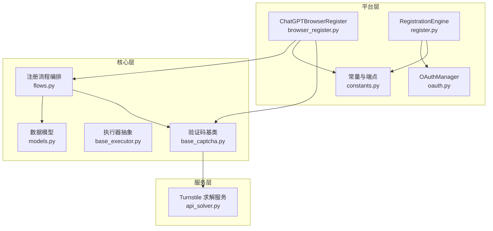
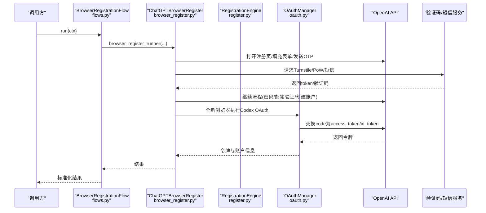
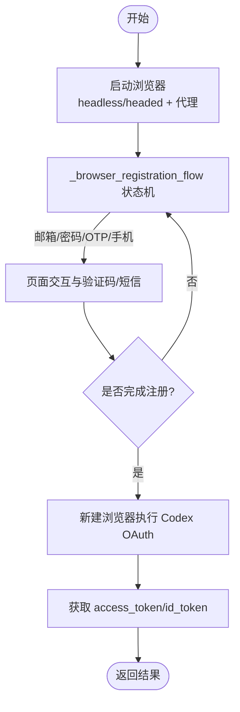
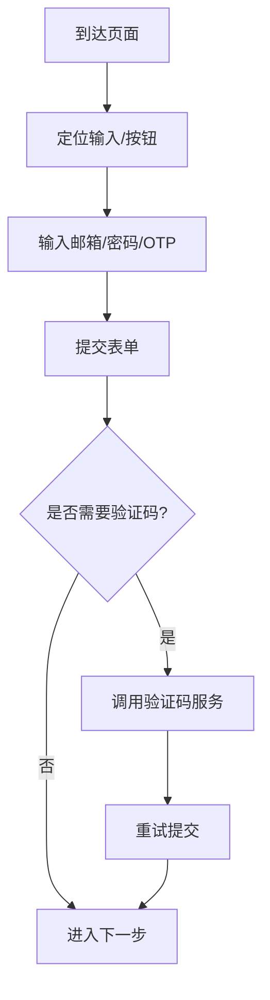
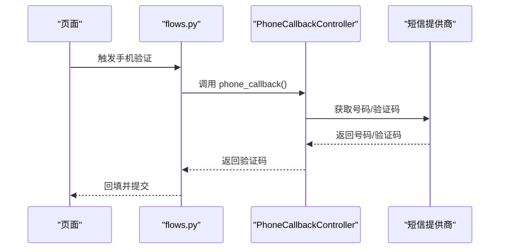
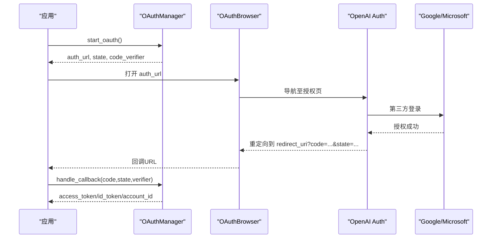
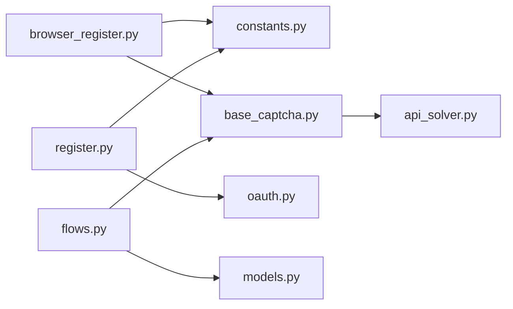

# 浏览器自动化注册

<cite>
**本文引用的文件**
- [browser_register.py](file://platforms/chatgpt/browser_register.py)
- [register.py](file://platforms/chatgpt/register.py)
- [oauth.py](file://platforms/chatgpt/oauth.py)
- [constants.py](file://platforms/chatgpt/constants.py)
- [flows.py](file://core/registration/flows.py)
- [models.py](file://core/registration/models.py)
- [base_executor.py](file://core/base_executor.py)
- [base_captcha.py](file://core/base_captcha.py)
- [browser_oauth.py](file://platforms/chatgpt/browser_oauth.py)
- [local_ms_mailbox.py](file://core/local_ms_mailbox.py)
- [api_solver.py](file://services/turnstile_solver/api_solver.py)
</cite>

## 目录
1. [简介](#简介)
2. [项目结构](#项目结构)
3. [核心组件](#核心组件)
4. [架构总览](#架构总览)
5. [详细组件分析](#详细组件分析)
6. [依赖关系分析](#依赖关系分析)
7. [性能与稳定性](#性能与稳定性)
8. [故障排查指南](#故障排查指南)
9. [结论](#结论)
10. [附录：示例与最佳实践](#附录示例与最佳实践)

## 简介
本文件面向“ChatGPT 浏览器自动化注册”的完整实现，重点解析 ChatGPTBrowserRegister 类的注册流程、浏览器实例管理、页面交互自动化、验证码处理、OAuth 登录（Google/Microsoft）、headless/headed 模式切换、OTP 回调机制与手机验证码处理。同时提供兼容性配置、性能优化技巧与调试方法，帮助读者快速搭建并稳定运行自动化注册流程。

## 项目结构
本项目采用平台化分层设计：
- platforms/chatgpt：ChatGPT 平台的注册、OAuth、常量与浏览器相关逻辑
- core：通用执行器、注册流程编排、模型定义、验证码抽象等
- services：Turnstile 验证码求解服务
- providers：第三方能力（邮箱、短信、代理、验证码）接入
- frontend/electron：前端与桌面端入口（与本主题关联较少）

**图表来源**
- [browser_register.py:3831-3909](file://platforms/chatgpt/browser_register.py#L3831-L3909)
- [register.py:187-245](file://platforms/chatgpt/register.py#L187-L245)
- [oauth.py:180-379](file://platforms/chatgpt/oauth.py#L180-L379)
- [constants.py:53-97](file://platforms/chatgpt/constants.py#L53-L97)
- [flows.py:18-79](file://core/registration/flows.py#L18-L79)
- [models.py:7-66](file://core/registration/models.py#L7-L66)
- [base_executor.py:19-49](file://core/base_executor.py#L19-L49)
- [base_captcha.py:5-98](file://core/base_captcha.py#L5-L98)
- [api_solver.py:193-779](file://services/turnstile_solver/api_solver.py#L193-L779)

**章节来源**
- [browser_register.py:3831-3909](file://platforms/chatgpt/browser_register.py#L3831-L3909)
- [register.py:187-245](file://platforms/chatgpt/register.py#L187-L245)
- [oauth.py:180-379](file://platforms/chatgpt/oauth.py#L180-L379)
- [constants.py:53-97](file://platforms/chatgpt/constants.py#L53-L97)
- [flows.py:18-79](file://core/registration/flows.py#L18-L79)
- [models.py:7-66](file://core/registration/models.py#L7-L66)
- [base_executor.py:19-49](file://core/base_executor.py#L19-L49)
- [base_captcha.py:5-98](file://core/base_captcha.py#L5-L98)
- [api_solver.py:193-779](file://services/turnstile_solver/api_solver.py#L193-L779)

## 核心组件
- ChatGPTBrowserRegister：基于 Camoufox 的浏览器注册入口，封装 headless/headed 启动、代理、GeoIP、状态机驱动、最终 OAuth 获取 token。
- RegistrationEngine：HTTP 驱动的注册引擎，负责邮箱创建、Sentinel PoW/Turnstile、表单提交、OTP 校验、账户信息创建、工作区选择等。
- OAuthManager：OpenAI OAuth 授权流程（PKCE），支持 Google/Microsoft 等第三方登录。
- BrowserRegistrationFlow / Protocol*Flow：统一编排不同注册路径（浏览器/协议/邮箱/OAuth）。
- BaseExecutor：抽象 HTTP 执行器，支持 protocol/headless/headed 三种模式。
- BaseCaptcha：验证码抽象，对接本地或第三方 Turnstile/图片验证码求解。

**章节来源**
- [browser_register.py:3831-3909](file://platforms/chatgpt/browser_register.py#L3831-L3909)
- [register.py:187-245](file://platforms/chatgpt/register.py#L187-L245)
- [oauth.py:180-379](file://platforms/chatgpt/oauth.py#L180-L379)
- [flows.py:18-142](file://core/registration/flows.py#L18-L142)
- [base_executor.py:19-49](file://core/base_executor.py#L19-L49)
- [base_captcha.py:5-98](file://core/base_captcha.py#L5-L98)

## 架构总览
下图展示从调用方到具体实现的端到端流程：用户触发注册 → 流程编排 → 浏览器/协议执行 → 验证码/OTP/短信 → OpenAI 服务端 → 返回结果。

**图表来源**
- [flows.py:18-79](file://core/registration/flows.py#L18-L79)
- [browser_register.py:3831-3909](file://platforms/chatgpt/browser_register.py#L3831-L3909)
- [register.py:187-245](file://platforms/chatgpt/register.py#L187-L245)
- [oauth.py:180-379](file://platforms/chatgpt/oauth.py#L180-L379)

## 详细组件分析

### ChatGPTBrowserRegister 注册流程
- 职责
  - 管理浏览器生命周期（Camoufox），支持 headless/headed、代理、GeoIP。
  - 驱动浏览器注册状态机，处理邮箱/密码/OTP/手机号等页面跳转。
  - 完成后通过全新浏览器执行 Codex OAuth 获取稳定的 access_token/id_token。
- 关键行为
  - 启动浏览器上下文，进入 _browser_registration_flow 状态机。
  - 根据页面类型判断是否进入 add_phone、email_otp_verification、password 等分支。
  - 完成注册后，使用独立浏览器执行 _do_codex_oauth，避免会话不稳定问题。
- 错误处理
  - 若未得到完整 OAuth callback，拒绝回退到半成品 session/access_token。

**图表来源**
- [browser_register.py:3831-3909](file://platforms/chatgpt/browser_register.py#L3831-L3909)

**章节来源**
- [browser_register.py:3831-3909](file://platforms/chatgpt/browser_register.py#L3831-L3909)

### 浏览器实例管理与模式切换
- 模式
  - headless：无头模式，适合服务器环境批量注册。
  - headed：有头模式，便于调试与人工干预。
- 配置要点
  - 通过 launch_opts 传入 headless、proxy、geoip。
  - 代理支持 http/socks5，可带认证；GeoIP 用于模拟地理位置。
- 复用策略
  - 对于需要复用本机已登录会话的场景，可通过 chrome_user_data_dir 或 chrome_cdp_url 复用浏览器（见前端选择逻辑与 OAuth 浏览器辅助）。

**章节来源**
- [browser_register.py:3847-3909](file://platforms/chatgpt/browser_register.py#L3847-L3909)
- [frontend/src/lib/registration.ts:6-32](file://frontend/src/lib/registration.ts#L6-L32)

### 页面交互自动化与验证码处理
- 页面元素定位
  - 邮箱/密码输入框、提交按钮、OTP 输入框、国家下拉选择器等均有多种 selector 兼容。
  - 针对 React Aria Select 的国家选择器，采用原生 select 值设置、Playwright selectOption、UI 点击与键盘 type-ahead 等多策略。
- 验证码
  - Sentinel PoW：动态生成 p/c/t 参数，必要时进行难度挑战计算。
  - Turnstile：通过 BaseCaptcha 抽象，调用本地或第三方求解服务（如 api_solver.py）。
- 表单提交
  - 优先使用 requestSubmit，其次 submit，最后模拟 Enter 键事件，确保兼容不同框架。

**图表来源**
- [browser_register.py:205-516](file://platforms/chatgpt/browser_register.py#L205-L516)
- [base_captcha.py:5-98](file://core/base_captcha.py#L5-L98)
- [api_solver.py:193-779](file://services/turnstile_solver/api_solver.py#L193-L779)

**章节来源**
- [browser_register.py:205-516](file://platforms/chatgpt/browser_register.py#L205-L516)
- [base_captcha.py:5-98](file://core/base_captcha.py#L5-L98)
- [api_solver.py:193-779](file://services/turnstile_solver/api_solver.py#L193-L779)

### OTP 回调机制与手机验证码处理
- OTP（邮箱验证码）
  - 通过 RegistrationArtifacts.otp_callback 注入等待与提取逻辑，支持关键词、超时、正则匹配。
  - 在 flows.py 中构建 otp_callback，供浏览器/协议注册流程调用。
- 手机验证码
  - 通过 build_phone_callbacks 构造 phone_callback 与 cleanup，内部封装短信提供商（如 sms_activate、herosms）。
  - PhoneCallbackController 管理号码获取、验证码轮询、成功标记与清理，支持失败重试与锁释放。
- 典型场景
  - 当页面跳转到 add-phone 时，调用 phone_callback 获取号码与验证码，自动填入并提交。

**图表来源**
- [flows.py:46-67](file://core/registration/flows.py#L46-L67)
- [base_sms.py:1103-1231](file://core/base_sms.py#L1103-L1231)

**章节来源**
- [flows.py:46-67](file://core/registration/flows.py#L46-L67)
- [base_sms.py:1103-1231](file://core/base_sms.py#L1103-L1231)

### OAuth 登录流程（Google/Microsoft）
- 流程概述
  - 使用 OAuthManager 生成授权 URL（含 PKCE），引导至 OpenAI 授权页。
  - 支持 Google/Microsoft 等第三方登录，通过浏览器自动选择账号或手动授权。
  - 回调地址携带 code/state，后端交换 access_token/id_token。
- 集成方式
  - 浏览器模式：通过 browser_oauth.py 中的 register_with_browser_oauth 启动浏览器，等待回调。
  - 协议模式：通过 RegistrationEngine._start_oauth 发起 NextAuth 流程，获取 authorize URL。
- 注意事项
  - 对于无头模式且需要复用本机登录会话，建议配置 chrome_user_data_dir 或 chrome_cdp_url。
  - Microsoft 邮箱访问需 Graph API 或 IMAP 相应 scope，参考 local_ms_mailbox.py。

**图表来源**
- [oauth.py:180-379](file://platforms/chatgpt/oauth.py#L180-L379)
- [browser_oauth.py:44-83](file://platforms/chatgpt/browser_oauth.py#L44-L83)
- [register.py:331-392](file://platforms/chatgpt/register.py#L331-L392)
- [local_ms_mailbox.py:344-363](file://core/local_ms_mailbox.py#L344-L363)

**章节来源**
- [oauth.py:180-379](file://platforms/chatgpt/oauth.py#L180-L379)
- [browser_oauth.py:44-83](file://platforms/chatgpt/browser_oauth.py#L44-L83)
- [register.py:331-392](file://platforms/chatgpt/register.py#L331-L392)
- [local_ms_mailbox.py:344-363](file://core/local_ms_mailbox.py#L344-L363)

### 注册引擎（HTTP 驱动）
- 职责
  - 协调邮箱服务、Sentinel PoW/Turnstile、表单提交、OTP 校验、创建账户与工作区选择。
  - 检测已注册账号并自动切换到登录流程。
- 关键点
  - 预加载密码页以获取阶段 cookie。
  - 每次密码尝试前刷新 Sentinel token（单用）。
  - 通过 client_auth_session_dump 推进服务器状态机。
  - 对错误响应进行语义识别（如 user_exists），标记邮箱已注册。

**章节来源**
- [register.py:288-800](file://platforms/chatgpt/register.py#L288-L800)

## 依赖关系分析
- 模块耦合
  - ChatGPTBrowserRegister 依赖 constants（端点/常量）、BaseCaptcha（验证码）、以及内部状态机函数。
  - RegistrationEngine 依赖 OAuthManager、OpenAIHTTPClient、Sentinel VM（可选）。
  - flows.py 将适配器与回调组装为统一流程，屏蔽底层差异。
- 外部依赖
  - Camoufox/Playwright：浏览器控制。
  - curl_cffi：HTTP 客户端，支持指纹与代理。
  - 第三方验证码/短信/邮箱服务：通过 providers 与 services 层接入。

**图表来源**
- [browser_register.py:3831-3909](file://platforms/chatgpt/browser_register.py#L3831-L3909)
- [register.py:187-245](file://platforms/chatgpt/register.py#L187-L245)
- [flows.py:18-79](file://core/registration/flows.py#L18-L79)
- [base_captcha.py:5-98](file://core/base_captcha.py#L5-L98)
- [api_solver.py:193-779](file://services/turnstile_solver/api_solver.py#L193-L779)

**章节来源**
- [browser_register.py:3831-3909](file://platforms/chatgpt/browser_register.py#L3831-L3909)
- [register.py:187-245](file://platforms/chatgpt/register.py#L187-L245)
- [flows.py:18-79](file://core/registration/flows.py#L18-L79)
- [base_captcha.py:5-98](file://core/base_captcha.py#L5-L98)
- [api_solver.py:193-779](file://services/turnstile_solver/api_solver.py#L193-L779)

## 性能与稳定性
- 浏览器性能
  - 优先使用 headless 模式提升吞吐；调试时使用 headed。
  - 合理设置 viewport 与资源拦截（如 api_solver.py 中对渲染阻塞的处理）。
- 网络与代理
  - 使用稳定代理，开启 GeoIP 模拟目标地区。
  - 对 OpenAI API 请求添加必要 headers（如 sec-ch-ua、origin、referer）。
- 验证码与 PoW
  - 合理配置验证码求解并发与超时，避免频繁重试导致限流。
  - Sentinel PoW 难度较高时，适当增加重试次数与间隔。
- 会话与 Cookie
  - 注册完成后通过全新浏览器执行 OAuth，避免会话不稳定导致的 token 获取失败。
  - 复用本机登录会话时，配置 chrome_user_data_dir 或 chrome_cdp_url。

[本节为通用指导，不直接分析具体文件]

## 故障排查指南
- 常见问题
  - 验证码失败：检查验证码 provider 配置与可用性；确认 site_key、url、action、cdata 正确。
  - OTP 未收到：检查邮箱服务与过滤规则；延长超时时间；确认发件人与关键词匹配。
  - 手机验证码失败：检查短信提供商配额与号码池；关注临时失败与锁释放。
  - OAuth 回调异常：核对 redirect_uri、state、code_verifier；确认浏览器能访问回调地址。
- 调试建议
  - 使用 headed 模式观察页面变化；记录关键步骤日志。
  - 打印请求头与响应体（脱敏），定位服务端限制或反爬策略。
  - 对关键选择器进行断言，确保 UI 结构未变更。

**章节来源**
- [base_captcha.py:48-98](file://core/base_captcha.py#L48-L98)
- [base_sms.py:1103-1231](file://core/base_sms.py#L1103-L1231)
- [api_solver.py:193-779](file://services/turnstile_solver/api_solver.py#L193-L779)

## 结论
本方案通过浏览器自动化与 HTTP 引擎双轨并行，结合验证码求解、OTP/短信回调与 OAuth 流程，实现了高鲁棒性的 ChatGPT 账号注册与登录。关键在于：
- 清晰的流程编排（flows.py）与适配器模式
- 灵活的浏览器模式与代理/GeoIP 配置
- 健壮的验证码与 OTP/短信处理
- 稳定的 OAuth 令牌获取（全新浏览器执行）

## 附录：示例与最佳实践
- 自定义浏览器注册流程
  - 通过 BrowserRegistrationAdapter 注入 browser_worker_builder 与 browser_register_runner，实现特定平台的页面交互与结果映射。
  - 在 RegistrationContext 中配置 executor_type、proxy、extra 等参数。
- 错误处理策略
  - 对网络异常、验证码失败、OTP 超时进行分级重试与降级。
  - 对“邮箱已注册”等确定性错误快速终止并记录。
- 兼容性配置
  - 环境变量覆盖 OpenAI 基础 URL、OAuth 参数、Sentinel 版本等。
  - 针对不同地区与语言环境调整选择器与文案匹配。
- 调试方法
  - 启用 headed 模式与详细日志；截图关键页面。
  - 使用抓包工具核对请求/响应，确认签名与 token 生成逻辑。

**章节来源**
- [flows.py:18-142](file://core/registration/flows.py#L18-L142)
- [models.py:7-66](file://core/registration/models.py#L7-L66)
- [constants.py:53-97](file://platforms/chatgpt/constants.py#L53-L97)