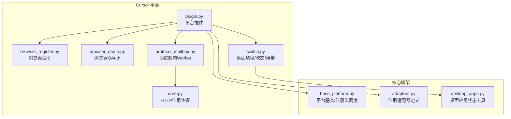
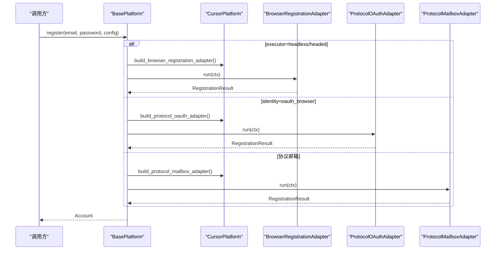
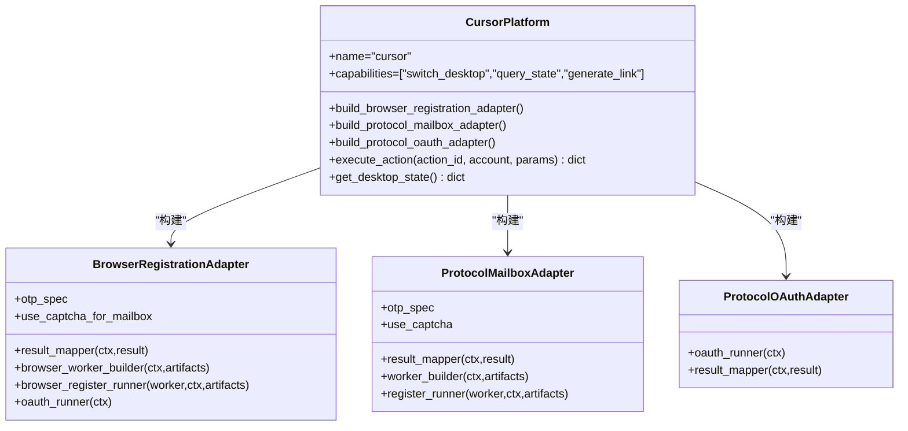
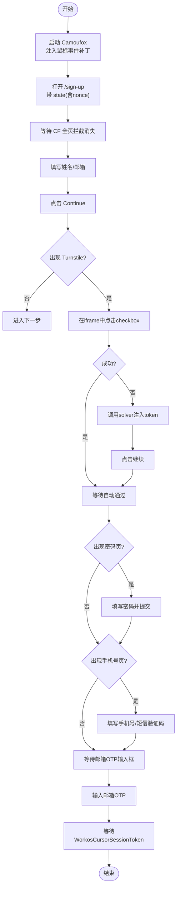
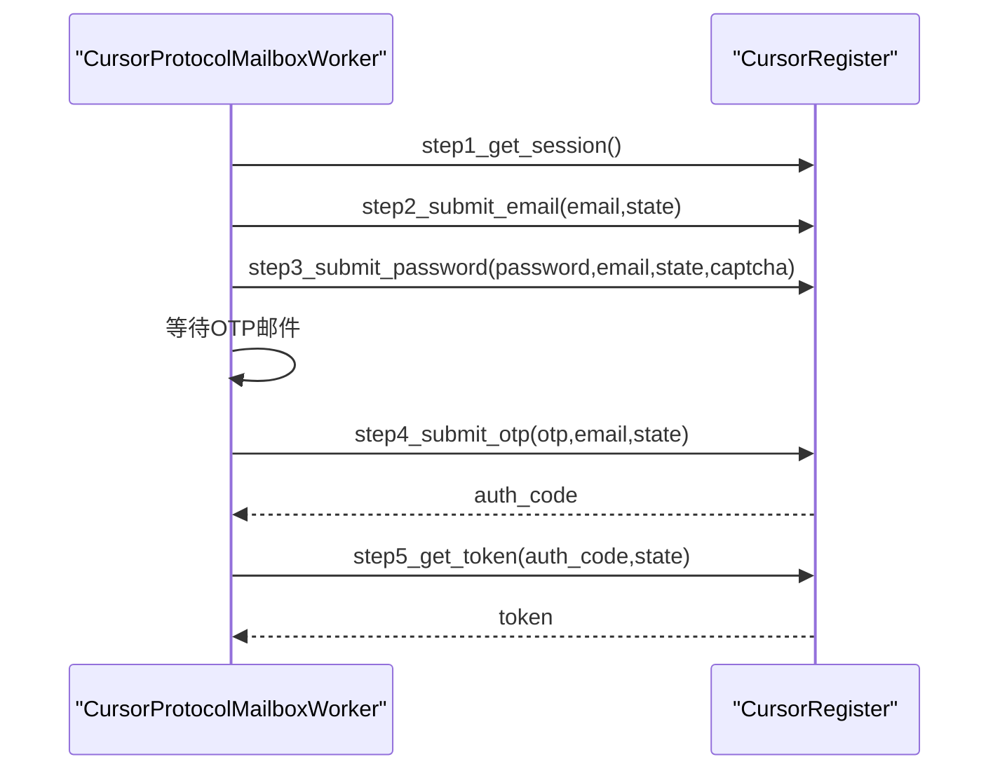
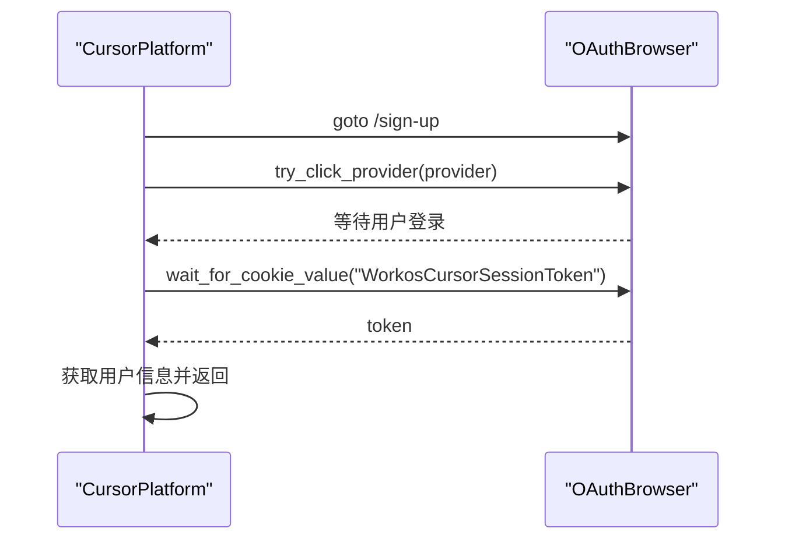
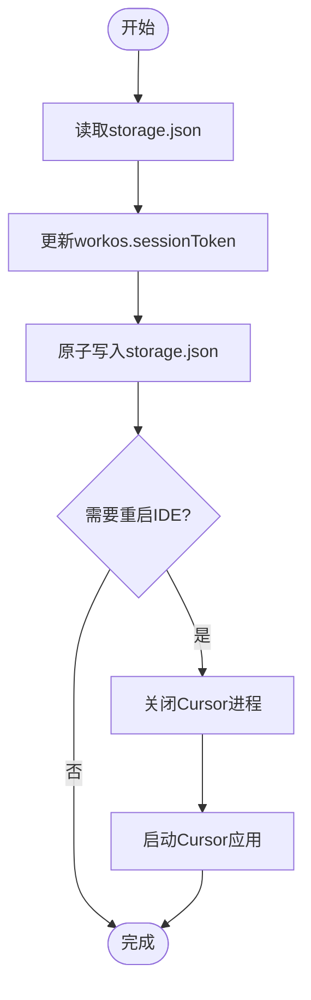
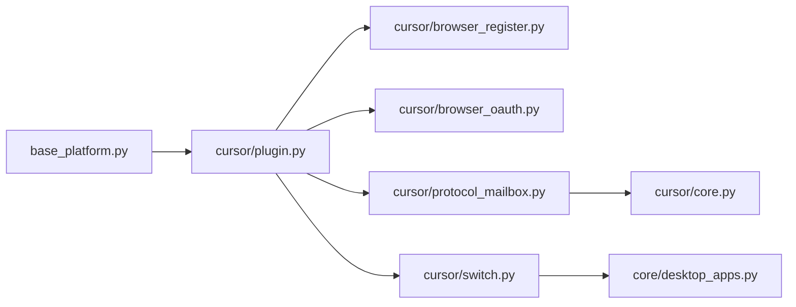

# Cursor平台实现

<cite>
**本文引用的文件**
- [platforms/cursor/core.py](file://platforms/cursor/core.py)
- [platforms/cursor/plugin.py](file://platforms/cursor/plugin.py)
- [platforms/cursor/browser_register.py](file://platforms/cursor/browser_register.py)
- [platforms/cursor/browser_oauth.py](file://platforms/cursor/browser_oauth.py)
- [platforms/cursor/protocol_mailbox.py](file://platforms/cursor/protocol_mailbox.py)
- [platforms/cursor/switch.py](file://platforms/cursor/switch.py)
- [core/base_platform.py](file://core/base_platform.py)
- [core/registration/adapters.py](file://core/registration/adapters.py)
- [core/desktop_apps.py](file://core/desktop_apps.py)
</cite>

## 目录
1. [简介](#简介)
2. [项目结构](#项目结构)
3. [核心组件](#核心组件)
4. [架构总览](#架构总览)
5. [详细组件分析](#详细组件分析)
6. [依赖关系分析](#依赖关系分析)
7. [性能考虑](#性能考虑)
8. [故障排查指南](#故障排查指南)
9. [结论](#结论)
10. [附录：配置与执行示例](#附录配置与执行示例)

## 简介
本文件面向开发者，系统性解析 Cursor 平台的注册流程与架构设计，覆盖浏览器自动化注册、OAuth 认证、协议模式支持、桌面应用切换机制、账户状态管理、平台插件组织方式、不同注册模式的配置与执行、错误处理策略、性能优化建议以及常见问题解决方案。目标是帮助读者快速理解并扩展 Cursor 平台的实现模式。

## 项目结构
Cursor 平台相关代码集中在 platforms/cursor 目录下，按职责拆分：
- core.py：协议模式下的 HTTP 注册步骤封装（会话、邮箱、密码、OTP、Token）
- browser_register.py：基于 Camoufox 的浏览器自动化注册（含 Turnstile 处理、验证码输入、Token 获取）
- browser_oauth.py：基于 OAuthBrowser 的浏览器 OAuth 登录流程
- protocol_mailbox.py：协议邮箱注册 Worker，编排 core.py 的步骤
- switch.py：桌面端账号切换、重启 IDE、查询用户/账单/用量、生成试用链接等
- plugin.py：平台插件入口，声明能力、构建适配器、暴露平台操作

图表来源
- [platforms/cursor/plugin.py:18-114](file://platforms/cursor/plugin.py#L18-L114)
- [platforms/cursor/browser_register.py:424-741](file://platforms/cursor/browser_register.py#L424-L741)
- [platforms/cursor/browser_oauth.py:13-61](file://platforms/cursor/browser_oauth.py#L13-L61)
- [platforms/cursor/protocol_mailbox.py:9-39](file://platforms/cursor/protocol_mailbox.py#L9-L39)
- [platforms/cursor/core.py:41-118](file://platforms/cursor/core.py#L41-L118)
- [platforms/cursor/switch.py:99-234](file://platforms/cursor/switch.py#L99-L234)
- [core/base_platform.py:44-160](file://core/base_platform.py#L44-L160)
- [core/registration/adapters.py:27-59](file://core/registration/adapters.py#L27-L59)
- [core/desktop_apps.py:104-139](file://core/desktop_apps.py#L104-L139)

章节来源
- [platforms/cursor/plugin.py:18-114](file://platforms/cursor/plugin.py#L18-L114)
- [core/base_platform.py:44-160](file://core/base_platform.py#L44-L160)

## 核心组件
- 平台插件（CursorPlatform）：声明能力（桌面切换、状态查询、生成试用链接），提供浏览器注册、协议邮箱注册、协议 OAuth 注册的适配器构建方法，并实现平台特有操作（切换账号、查询状态、生成试用链接）。
- 浏览器注册（Camoufox）：自动填写表单、处理 Cloudflare Turnstile、处理手机号验证（可选）、输入邮箱 OTP、等待并提取 WorkosCursorSessionToken。
- 协议邮箱注册（HTTP）：通过 curl_cffi 模拟 WorkOS 注册流程，分步提交邮箱、密码+Turnstile、OTP，最终换取 Token。
- 浏览器 OAuth：使用 OAuthBrowser 引导至 authenticator.cursor.sh，选择第三方登录或复用本地 Chrome 会话，等待 Cookie 中的 Session Token。
- 桌面切换与状态：写入 storage.json 切换当前账号，跨平台重启 IDE，读取当前账号、查询用户信息、账单、用量，生成试用结账链接。

章节来源
- [platforms/cursor/plugin.py:18-265](file://platforms/cursor/plugin.py#L18-L265)
- [platforms/cursor/browser_register.py:424-741](file://platforms/cursor/browser_register.py#L424-L741)
- [platforms/cursor/protocol_mailbox.py:9-39](file://platforms/cursor/protocol_mailbox.py#L9-L39)
- [platforms/cursor/browser_oauth.py:13-61](file://platforms/cursor/browser_oauth.py#L13-L61)
- [platforms/cursor/switch.py:99-402](file://platforms/cursor/switch.py#L99-L402)

## 架构总览
整体注册路径由 base_platform 统一调度，根据 executor_type 和 identity_provider 选择具体流程：
- headless/headed：走 BrowserRegistrationFlow，调用 CursorPlatform.build_browser_registration_adapter
- oauth_browser：走 ProtocolOAuthFlow，调用 CursorPlatform.build_protocol_oauth_adapter
- 默认协议邮箱：走 ProtocolMailboxFlow，调用 CursorPlatform.build_protocol_mailbox_adapter

图表来源
- [core/base_platform.py:124-160](file://core/base_platform.py#L124-L160)
- [platforms/cursor/plugin.py:72-114](file://platforms/cursor/plugin.py#L72-L114)
- [core/registration/adapters.py:27-59](file://core/registration/adapters.py#L27-L59)

## 详细组件分析

### 平台插件（CursorPlatform）
- 能力声明：switch_desktop、query_state、generate_link
- 注册适配器：
  - 浏览器注册：构造 BrowserRegistrationAdapter，绑定 CursorBrowserRegister、结果映射、OTP 提示、是否启用验证码
  - 协议邮箱注册：构造 ProtocolMailboxAdapter，绑定 CursorProtocolMailboxWorker、结果映射、OTP 提示、是否启用验证码
  - 协议 OAuth 注册：构造 ProtocolOAuthAdapter，绑定 _run_browser_oauth、结果映射
- 平台操作：
  - switch_account：切换本地 storage.json 中的 token，并尝试重启 IDE，返回用户/账单/用量摘要及本地匹配情况
  - get_user_info/get_account_state：查询用户、账单、支付方式、用量摘要、桌面状态
  - generate_trial_link：生成 7 天 Pro 试用结账链接

图表来源
- [platforms/cursor/plugin.py:18-114](file://platforms/cursor/plugin.py#L18-L114)
- [core/registration/adapters.py:27-59](file://core/registration/adapters.py#L27-L59)

章节来源
- [platforms/cursor/plugin.py:18-265](file://platforms/cursor/plugin.py#L18-L265)

### 浏览器自动化注册（Camoufox）
关键流程：
- 启动 Camoufox，注入 MouseEvent.screenX/Y 补丁以绕过 Turnstile 检测
- 访问 /sign-up，带 state（含 nonce），等待 CF 全页拦截消失
- 填写 firstName/lastName/email，点击 Continue
- 检测并处理 Turnstile：优先在 iframe 内直接点击 checkbox；失败则调用外部 solver 注入 token；必要时等待手动完成
- 处理密码设置页（如出现），继续下一步
- 处理手机号验证（可选，需 phone_callback）
- 等待邮箱 OTP 输入框，调用 otp_callback 获取验证码并逐键输入
- 等待 WorkosCursorSessionToken 并返回结果

图表来源
- [platforms/cursor/browser_register.py:424-741](file://platforms/cursor/browser_register.py#L424-L741)

章节来源
- [platforms/cursor/browser_register.py:424-741](file://platforms/cursor/browser_register.py#L424-L741)

### 协议邮箱注册（HTTP 步骤）
- step1_get_session：初始化 state（含 returnTo、nonce），访问 authenticator 获取 state cookie
- step2_submit_email：multipart/form-data 提交邮箱
- step3_submit_password：提交密码与 Turnstile token（可选外部 solver）
- step4_submit_otp：提交 OTP，从 location 头解析 auth_code
- step5_get_token：回调 cursor.com 获取 WorkosCursorSessionToken

图表来源
- [platforms/cursor/protocol_mailbox.py:9-39](file://platforms/cursor/protocol_mailbox.py#L9-L39)
- [platforms/cursor/core.py:41-118](file://platforms/cursor/core.py#L41-L118)

章节来源
- [platforms/cursor/core.py:41-118](file://platforms/cursor/core.py#L41-L118)
- [platforms/cursor/protocol_mailbox.py:9-39](file://platforms/cursor/protocol_mailbox.py#L9-L39)

### 浏览器 OAuth 流程
- 使用 OAuthBrowser 打开 /sign-up，选择 OAuth 提供商（Google/GitHub 等）
- 若提供 chrome_user_data_dir 或 cdp_url，自动选择已登录账号
- 否则提示用户在浏览器中完成登录，最长等待超时
- 等待 Cookie 中的 WorkosCursorSessionToken，校验并返回用户信息与邮箱

图表来源
- [platforms/cursor/browser_oauth.py:13-61](file://platforms/cursor/browser_oauth.py#L13-L61)

章节来源
- [platforms/cursor/browser_oauth.py:13-61](file://platforms/cursor/browser_oauth.py#L13-L61)

### 桌面应用切换与状态管理
- 切换账号：写入 storage.json 的 workos.sessionToken，原子写入避免损坏
- 重启 IDE：跨平台关闭并启动 Cursor，返回重启结果
- 读取当前账号：从 storage.json 读取当前 token
- 桌面状态：探测安装路径、进程、配置文件，汇总 ready/running/configured 等状态
- 查询用户/账单/用量：通过 API 获取用户信息、套餐、支付方式、usage，并生成摘要
- 生成试用链接：POST /api/checkout 生成 7 天 Pro 结账链接

图表来源
- [platforms/cursor/switch.py:99-193](file://platforms/cursor/switch.py#L99-L193)
- [core/desktop_apps.py:104-139](file://core/desktop_apps.py#L104-L139)

章节来源
- [platforms/cursor/switch.py:99-402](file://platforms/cursor/switch.py#L99-L402)
- [core/desktop_apps.py:104-139](file://core/desktop_apps.py#L104-L139)

## 依赖关系分析
- CursorPlatform 依赖 BasePlatform 提供的注册调度与能力系统
- 浏览器注册依赖 Camoufox 与 Turnstile 处理逻辑
- 协议邮箱注册依赖 curl_cffi 模拟 WorkOS 接口
- 桌面切换依赖操作系统命令与文件系统操作
- 平台能力通过 capability_registry 与数据库能力表驱动

图表来源
- [core/base_platform.py:44-160](file://core/base_platform.py#L44-L160)
- [platforms/cursor/plugin.py:18-114](file://platforms/cursor/plugin.py#L18-L114)
- [platforms/cursor/browser_register.py:424-741](file://platforms/cursor/browser_register.py#L424-L741)
- [platforms/cursor/browser_oauth.py:13-61](file://platforms/cursor/browser_oauth.py#L13-L61)
- [platforms/cursor/protocol_mailbox.py:9-39](file://platforms/cursor/protocol_mailbox.py#L9-L39)
- [platforms/cursor/core.py:41-118](file://platforms/cursor/core.py#L41-L118)
- [platforms/cursor/switch.py:99-234](file://platforms/cursor/switch.py#L99-L234)
- [core/desktop_apps.py:104-139](file://core/desktop_apps.py#L104-L139)

章节来源
- [core/base_platform.py:44-160](file://core/base_platform.py#L44-L160)
- [platforms/cursor/plugin.py:18-114](file://platforms/cursor/plugin.py#L18-L114)

## 性能考虑
- 浏览器注册
  - 使用 Camoufox 减少指纹检测风险，但需注意页面加载与等待时间，合理设置超时
  - Turnstile 处理优先 iframe 点击，其次外部 solver，最后手动兜底，避免长时间阻塞
  - 对 CF 全页拦截进行专门检测与处理，减少误判与重试
- 协议邮箱注册
  - 使用 curl_cffi 并发控制与超时，避免网络抖动导致长时间挂起
  - multipart/form-data 构造边界值随机化，降低被风控概率
- 桌面切换
  - 原子写入 storage.json，避免并发写冲突
  - 重启 IDE 时捕获异常并给出明确提示，便于上层重试或回滚
- 通用
  - 日志输出关键节点，便于定位瓶颈与问题
  - 合理配置代理与 UA，提高成功率

[本节为通用指导，不直接分析具体文件]

## 故障排查指南
- 未出现验证码输入框
  - 检查页面 URL 是否到达 email-verification 或 verify 阶段
  - 确认 otp_callback 已正确配置并返回有效验证码
  - 参考路径：[platforms/cursor/browser_register.py:671-713](file://platforms/cursor/browser_register.py#L671-L713)
- Turnstile 无法通过
  - 优先尝试在 iframe 中点击 checkbox
  - 若失败，配置外部 solver 并注入 token
  - 必要时等待手动完成
  - 参考路径：[platforms/cursor/browser_register.py:372-421](file://platforms/cursor/browser_register.py#L372-L421)
- 未获取到 Session Token
  - 检查 Cookie 域是否为 cursor.com/cursor.sh
  - 增加等待时间或重试
  - 参考路径：[platforms/cursor/browser_register.py:126-140](file://platforms/cursor/browser_register.py#L126-L140)
- 桌面切换失败
  - 检查 storage.json 权限与路径
  - 确认 IDE 进程可被终止与重启
  - 参考路径：[platforms/cursor/switch.py:99-193](file://platforms/cursor/switch.py#L99-L193)
- 查询用户/账单/用量失败
  - 检查 Token 有效性
  - 关注 HTTP 状态码与响应体
  - 参考路径：[platforms/cursor/switch.py:237-323](file://platforms/cursor/switch.py#L237-L323)

章节来源
- [platforms/cursor/browser_register.py:372-421](file://platforms/cursor/browser_register.py#L372-L421)
- [platforms/cursor/browser_register.py:671-713](file://platforms/cursor/browser_register.py#L671-L713)
- [platforms/cursor/browser_register.py:126-140](file://platforms/cursor/browser_register.py#L126-L140)
- [platforms/cursor/switch.py:99-193](file://platforms/cursor/switch.py#L99-L193)
- [platforms/cursor/switch.py:237-323](file://platforms/cursor/switch.py#L237-L323)

## 结论
Cursor 平台实现了多模式注册（浏览器自动化、协议邮箱、浏览器 OAuth），并通过平台插件统一接入框架的能力系统与调度机制。其亮点包括：
- 完善的 Turnstile 处理策略（iframe 点击、外部 solver、手动兜底）
- 灵活的桌面切换与状态管理（跨平台、原子写入、重启 IDE）
- 丰富的平台操作（切换账号、查询状态、生成试用链接）
- 清晰的适配器分层（Browser/Protocol Mailbox/Protocol OAuth）

建议在生产环境中：
- 合理配置验证码 provider 与代理
- 监控 Turnstile 通过率与失败原因
- 记录桌面切换与重启结果，便于审计与回滚
- 对网络请求设置超时与重试策略，提升稳定性

[本节为总结性内容，不直接分析具体文件]

## 附录：配置与执行示例
- 浏览器模式注册（headless/headed）
  - 配置 executor_type 为 headless 或 headed
  - 确保 captcha solver 可用（用于 Turnstile）
  - 调用 platform.register(email, password)
  - 参考路径：[core/base_platform.py:124-160](file://core/base_platform.py#L124-L160)
- 协议邮箱模式注册
  - 配置 executor_type 为 protocol
  - 提供 otp_callback 获取邮箱验证码
  - 参考路径：[platforms/cursor/protocol_mailbox.py:14-39](file://platforms/cursor/protocol_mailbox.py#L14-L39)
- 浏览器 OAuth 模式注册
  - 配置 identity_provider 为 oauth_browser
  - 可选择指定 chrome_user_data_dir 或 cdp_url 复用本地会话
  - 参考路径：[platforms/cursor/browser_oauth.py:13-61](file://platforms/cursor/browser_oauth.py#L13-L61)
- 平台操作
  - switch_account：切换本地账号并重启 IDE
  - get_user_info/get_account_state：查询用户、账单、用量、桌面状态
  - generate_trial_link：生成 7 天 Pro 试用链接
  - 参考路径：[platforms/cursor/plugin.py:129-265](file://platforms/cursor/plugin.py#L129-L265)

章节来源
- [core/base_platform.py:124-160](file://core/base_platform.py#L124-L160)
- [platforms/cursor/protocol_mailbox.py:14-39](file://platforms/cursor/protocol_mailbox.py#L14-L39)
- [platforms/cursor/browser_oauth.py:13-61](file://platforms/cursor/browser_oauth.py#L13-L61)
- [platforms/cursor/plugin.py:129-265](file://platforms/cursor/plugin.py#L129-L265)