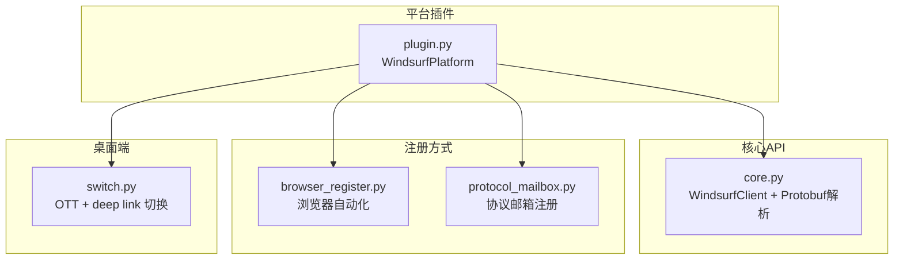
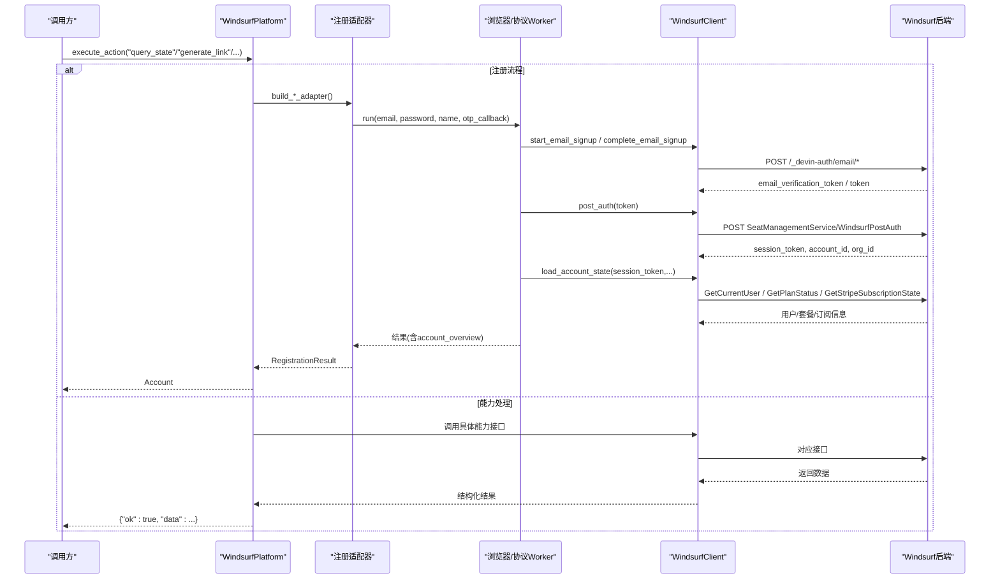
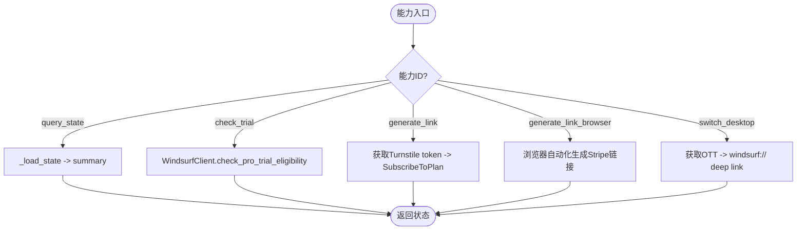
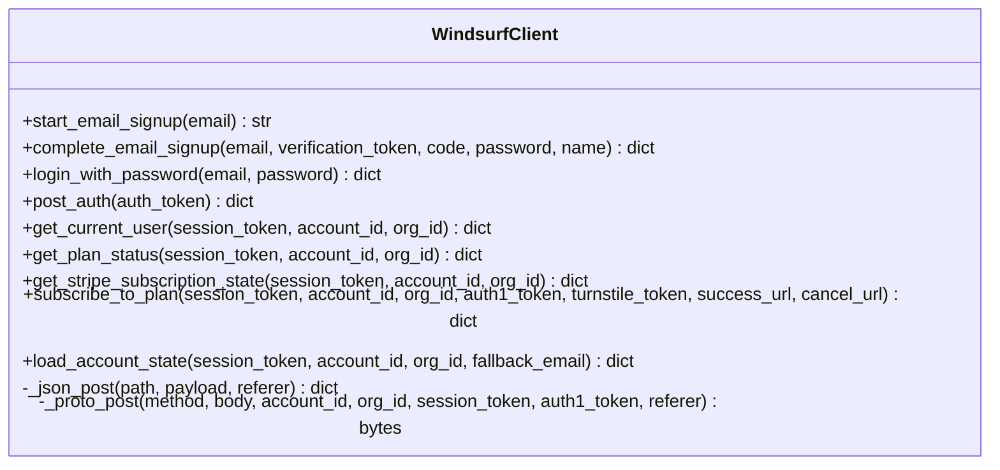
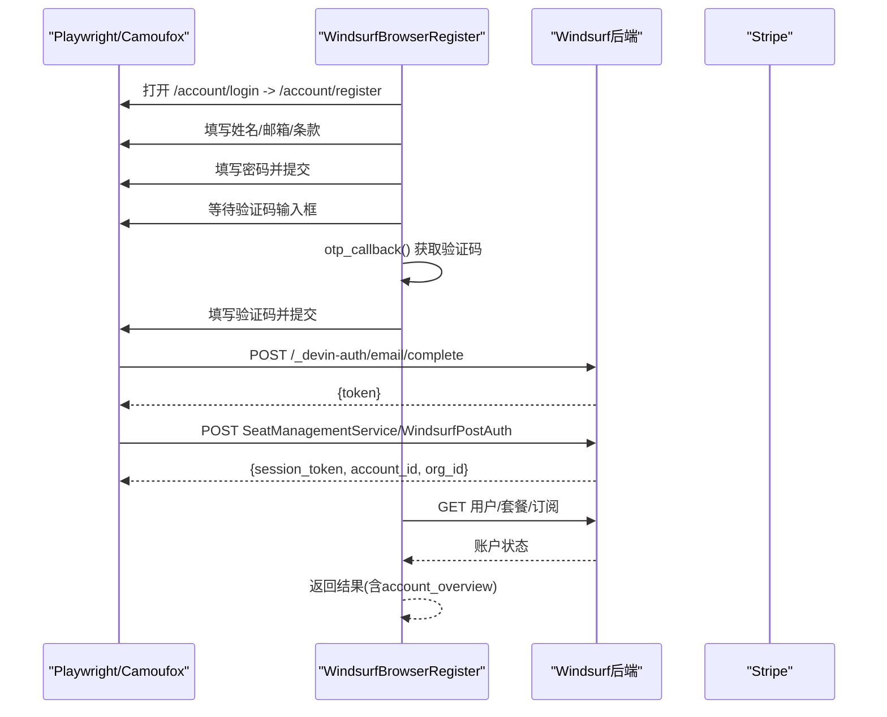
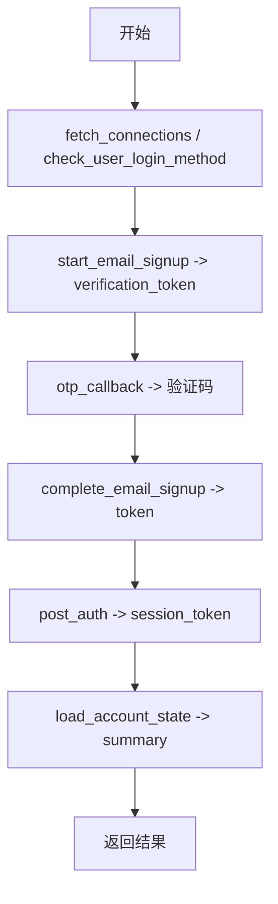
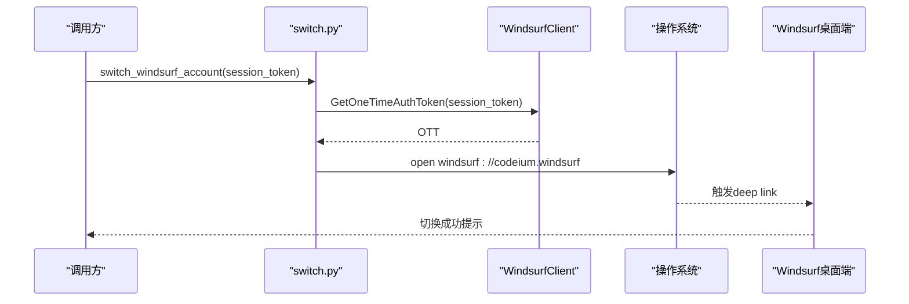
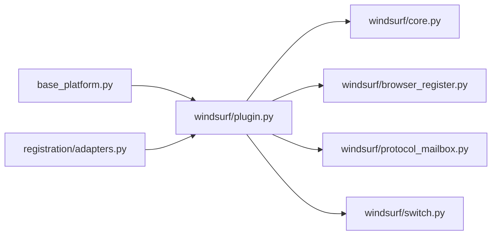

# Windsurf平台实现

<cite>
**本文引用的文件**
- [platforms/windsurf/core.py](file://platforms/windsurf/core.py)
- [platforms/windsurf/plugin.py](file://platforms/windsurf/plugin.py)
- [platforms/windsurf/browser_register.py](file://platforms/windsurf/browser_register.py)
- [platforms/windsurf/protocol_mailbox.py](file://platforms/windsurf/protocol_mailbox.py)
- [platforms/windsurf/switch.py](file://platforms/windsurf/switch.py)
- [core/base_platform.py](file://core/base_platform.py)
- [core/registration/adapters.py](file://core/registration/adapters.py)
- [tests/test_windsurf_platform.py](file://tests/test_windsurf_platform.py)
</cite>

## 目录
1. [简介](#简介)
2. [项目结构](#项目结构)
3. [核心组件](#核心组件)
4. [架构总览](#架构总览)
5. [详细组件分析](#详细组件分析)
6. [依赖关系分析](#依赖关系分析)
7. [性能考虑](#性能考虑)
8. [故障排查指南](#故障排查指南)
9. [结论](#结论)
10. [附录：配置与扩展](#附录：配置与扩展)

## 简介
本文件面向需要集成或扩展Windsurf平台的开发者，系统性说明Windsurf平台的注册架构、浏览器自动化注册、协议模式支持、桌面应用切换、账户管理、能力（capabilities）执行流程、错误处理机制与性能优化建议。文档以代码级视角展开，配合图示帮助快速理解并安全扩展。

## 项目结构
Windsurf平台相关代码集中在 platforms/windsurf 目录下，围绕以下职责划分：
- core.py：HTTP客户端封装、轻量Protobuf编解码、账号状态聚合、订阅链接生成等核心逻辑
- plugin.py：平台插件入口，声明能力、构建注册适配器、实现能力处理器
- browser_register.py：基于Playwright/Camoufox的浏览器自动化注册与Stripe支付流程
- protocol_mailbox.py：纯协议邮箱验证码注册Worker
- switch.py：通过一次性认证令牌和deep link实现桌面端账号切换

图表来源
- [platforms/windsurf/plugin.py:35-150](file://platforms/windsurf/plugin.py#L35-L150)
- [platforms/windsurf/core.py:401-667](file://platforms/windsurf/core.py#L401-L667)
- [platforms/windsurf/browser_register.py:598-741](file://platforms/windsurf/browser_register.py#L598-L741)
- [platforms/windsurf/protocol_mailbox.py:10-83](file://platforms/windsurf/protocol_mailbox.py#L10-L83)
- [platforms/windsurf/switch.py:179-208](file://platforms/windsurf/switch.py#L179-L208)

章节来源
- [platforms/windsurf/plugin.py:35-150](file://platforms/windsurf/plugin.py#L35-L150)
- [platforms/windsurf/core.py:401-667](file://platforms/windsurf/core.py#L401-L667)

## 核心组件
- WindsurfPlatform（平台插件）
  - 声明名称、显示名、版本、支持的执行器与身份模式、能力集及能力参数覆盖
  - 提供浏览器注册适配器与协议邮箱注册适配器的构建方法
  - 实现 query_state、check_trial、generate_link、generate_link_browser、switch_desktop 等能力处理器
  - 统一将内部结果映射为 RegistrationResult，并转换为 Account
- WindsurfClient（HTTP+Protobuf客户端）
  - 封装JSON接口与application/proto接口的调用
  - 实现邮箱验证码注册、登录、兑换session、查询用户/套餐/Stripe订阅、生成订阅链接等
  - 提供轻量Protobuf编解码与响应解析工具
- 浏览器注册器（WindsurfBrowserRegister）
  - 使用Playwright或Camoufox打开Windsurf页面，自动填写表单、输入验证码、拦截关键响应获取session
  - 处理Turnstile人机验证、Cloudflare全页拦截、Stripe支付跳转等复杂交互
- 协议邮箱注册器（WindsurfProtocolMailboxWorker）
  - 通过/_devin-auth/* JSON接口完成邮箱验证码注册，再调用proto接口兑换session并拉取账户状态
- 桌面端切换（switch_windsurf_account）
  - 用session_token换取一次性认证令牌（OTT），通过windsurf:// deep link触发桌面端切换账号
  - 读取state.vscdb数据库中的当前账号信息，支持清理旧缓存、重启IDE等辅助操作

章节来源
- [platforms/windsurf/plugin.py:35-385](file://platforms/windsurf/plugin.py#L35-L385)
- [platforms/windsurf/core.py:401-667](file://platforms/windsurf/core.py#L401-L667)
- [platforms/windsurf/browser_register.py:598-741](file://platforms/windsurf/browser_register.py#L598-L741)
- [platforms/windsurf/protocol_mailbox.py:10-83](file://platforms/windsurf/protocol_mailbox.py#L10-L83)
- [platforms/windsurf/switch.py:179-311](file://platforms/windsurf/switch.py#L179-L311)

## 架构总览
Windsurf平台采用“平台插件 + 注册适配器 + 核心客户端”的分层架构：
- 上层：平台插件暴露能力（capabilities）和执行入口，负责编排注册流程与能力处理
- 中层：注册适配器屏蔽不同执行器（headless/headed/protocol）差异，统一OTP等待、回调与结果映射
- 下层：核心客户端直接对接Windsurf后端接口（JSON与application/proto），完成认证、状态查询与订阅

图表来源
- [platforms/windsurf/plugin.py:94-150](file://platforms/windsurf/plugin.py#L94-L150)
- [platforms/windsurf/core.py:479-667](file://platforms/windsurf/core.py#L479-L667)
- [platforms/windsurf/browser_register.py:647-741](file://platforms/windsurf/browser_register.py#L647-L741)
- [platforms/windsurf/protocol_mailbox.py:15-73](file://platforms/windsurf/protocol_mailbox.py#L15-L73)

## 详细组件分析

### 平台插件：WindsurfPlatform
- 能力声明与覆盖
  - capabilities包含：query_state、check_trial、generate_link、generate_link_browser、switch_desktop
  - capability_overrides定义各能力的UI标签与参数，如generate_link_browser支持turnstile_token、timeout、headless
- 注册适配器构建
  - build_protocol_mailbox_adapter：构造ProtocolMailboxAdapter，指定OtpSpec（关键词、正则、超时）
  - build_browser_registration_adapter：构造BrowserRegistrationAdapter，传入浏览器Worker构建器与运行器
- 能力处理器
  - _handle_query_state：加载账户状态并返回摘要
  - _handle_check_trial：检查Pro Trial资格
  - _handle_generate_link：自动或手动获取Turnstile token，调用SubscribeToPlan生成Stripe结账链接，支持401时刷新session
  - _handle_generate_link_browser：通过浏览器UI走Windsurf注册/支付流程，支持自动打码
  - _handle_switch_desktop：纯协议切换桌面端账号，返回桌面端状态

图表来源
- [platforms/windsurf/plugin.py:152-385](file://platforms/windsurf/plugin.py#L152-L385)

章节来源
- [platforms/windsurf/plugin.py:35-385](file://platforms/windsurf/plugin.py#L35-L385)

### 核心客户端：WindsurfClient与Protobuf解析
- HTTP封装
  - _json_post：POST JSON到/_devin-auth/*，设置Referer、Origin等头，校验状态码与返回格式
  - _proto_post：POST application/proto到SeatManagementService，注入x-devin-*头，支持account_id/org_id/session_token/auth1_token
- 认证流程
  - start_email_signup：发送验证码，返回email_verification_token
  - complete_email_signup：提交验证码、密码、姓名，返回token
  - login_with_password：邮箱+密码登录，返回session上下文
  - post_auth：兑换session，返回session_token、auth_token、account_id、org_id
- 账户状态
  - get_current_user / get_plan_status / get_stripe_subscription_state：分别拉取用户、套餐、Stripe订阅信息
  - load_account_state：聚合上述信息，生成summary与account_overview
- 订阅链接
  - subscribe_to_plan：构造protobuf body，携带success/cancel URL与turnstile_token，返回checkout_url
- Protobuf解析
  - 轻量实现varint编码/解码、字段键编码、消息解析
  - parse_current_user_response / parse_plan_status_response / parse_subscribe_to_plan_response等

图表来源
- [platforms/windsurf/core.py:401-667](file://platforms/windsurf/core.py#L401-L667)

章节来源
- [platforms/windsurf/core.py:401-667](file://platforms/windsurf/core.py#L401-L667)

### 浏览器自动化注册：WindsurfBrowserRegister
- 启动策略
  - 优先尝试Camoufox，失败回退到Playwright；支持headless与headed模式
  - 支持代理配置，解析server/username/password
- 注册流程
  - 打开登录页并进入注册页，填写姓名、邮箱、同意条款
  - 填写密码并提交，等待验证码输入框出现
  - 通过otp_callback获取验证码，填充并提交创建账号
  - 监听响应捕获complete与post_auth结果，若未捕获则调用post_auth补充
  - 拉取账户状态并返回结果
- Turnstile与Cloudflare处理
  - 检测Turnstile iframe与弹窗，支持点击checkbox、注入token、继续按钮点击
  - 检测Cloudflare全页拦截，自动移动鼠标、点击验证、等待放行
- Stripe支付流程
  - 支持提取alipay_handle_redirect或redirect_to_url
  - 识别最终支付宝收银台URL与中间跳转URL，便于后续处理

图表来源
- [platforms/windsurf/browser_register.py:598-741](file://platforms/windsurf/browser_register.py#L598-L741)
- [platforms/windsurf/core.py:479-667](file://platforms/windsurf/core.py#L479-L667)

章节来源
- [platforms/windsurf/browser_register.py:598-741](file://platforms/windsurf/browser_register.py#L598-L741)

### 协议邮箱注册：WindsurfProtocolMailboxWorker
- 预检：尝试connections与CheckUserLoginMethod，失败不影响后续流程
- 注册：start_email_signup -> 获取验证码 -> complete_email_signup -> post_auth -> load_account_state
- 结果：返回email、password、name、user_id、auth_token、session_token、account_id、org_id、account_overview、state_summary

图表来源
- [platforms/windsurf/protocol_mailbox.py:15-73](file://platforms/windsurf/protocol_mailbox.py#L15-L73)

章节来源
- [platforms/windsurf/protocol_mailbox.py:15-73](file://platforms/windsurf/protocol_mailbox.py#L15-L73)

### 桌面应用切换：switch_windsurf_account
- 流程
  - 用session_token调用GetOneTimeAuthToken获取OTT
  - 通过windsurf:// deep link将OTT传给桌面端，完成认证切换
- 辅助功能
  - read_current_windsurf_account：读取state.vscdb中当前账号信息
  - restart_windsurf_ide：跨平台关闭并重启Windsurf IDE
  - get_windsurf_desktop_state：汇总进程、安装路径、配置目录、当前账号存在性等信息

图表来源
- [platforms/windsurf/switch.py:179-208](file://platforms/windsurf/switch.py#L179-L208)
- [platforms/windsurf/core.py:439-477](file://platforms/windsurf/core.py#L439-L477)

章节来源
- [platforms/windsurf/switch.py:179-311](file://platforms/windsurf/switch.py#L179-L311)

## 依赖关系分析
- 平台插件依赖
  - base_platform.BasePlatform：统一注册流程、能力系统、验证码解决器选择、身份提供者解析
  - registration.adapters：BrowserRegistrationAdapter与ProtocolMailboxAdapter，封装注册工作流
- 核心客户端依赖
  - curl_cffi.requests：模拟Chrome指纹，发送JSON与proto请求
  - 自定义Protobuf解析：轻量实现varint与字段解析
- 浏览器注册依赖
  - playwright.sync_api：浏览器控制
  - camoufox.sync_api（可选）：反检测浏览器
- 桌面端切换依赖
  - sqlite3：读写state.vscdb
  - subprocess/os：跨平台打开deep link与进程管理

图表来源
- [core/base_platform.py:44-160](file://core/base_platform.py#L44-L160)
- [core/registration/adapters.py:27-59](file://core/registration/adapters.py#L27-L59)
- [platforms/windsurf/plugin.py:35-150](file://platforms/windsurf/plugin.py#L35-L150)

章节来源
- [core/base_platform.py:44-160](file://core/base_platform.py#L44-L160)
- [core/registration/adapters.py:27-59](file://core/registration/adapters.py#L27-L59)
- [platforms/windsurf/plugin.py:35-150](file://platforms/windsurf/plugin.py#L35-L150)

## 性能考虑
- 网络请求
  - 合理设置超时（默认30秒），避免阻塞
  - 复用curl_cffi Session减少握手开销
- 浏览器自动化
  - 优先使用Camoufox降低被检测概率；失败回退到Playwright
  - 设置合理的viewport与默认超时，减少资源消耗
  - 对Turnstile与Cloudflare拦截进行快速检测与重试，避免长时间等待
- Protobuf解析
  - 轻量实现避免引入完整protobuf库，降低内存与CPU占用
- 桌面端切换
  - 仅读取必要DB键值，避免全表扫描
  - 清理旧缓存键减少干扰，提高切换成功率

[本节为通用指导，不直接分析具体文件]

## 故障排查指南
- 常见错误与定位
  - 未返回email_verification_token：检查/_devin-auth/email/start响应，确认product与mode参数
  - 未返回auth token：检查/_devin-auth/email/complete响应，确认验证码与密码正确
  - 未返回session_token：检查WindsurfPostAuth响应，确认auth_token有效
  - SubscribeToPlan返回401：尝试用auth_token刷新session，或重新密码登录
  - Cloudflare全页拦截：等待并点击Turnstile checkbox，必要时注入token
  - 桌面端切换失败：确认OTT获取成功，检查deep link是否被系统拦截
- 日志与调试
  - 启用log_fn输出关键步骤，如Step1/Step2/Step3
  - 记录可见按钮文本与页面内容，辅助定位元素变化
  - 打印异常堆栈与HTTP状态码，便于快速定位问题

章节来源
- [platforms/windsurf/core.py:417-477](file://platforms/windsurf/core.py#L417-L477)
- [platforms/windsurf/browser_register.py:388-436](file://platforms/windsurf/browser_register.py#L388-L436)
- [platforms/windsurf/switch.py:179-208](file://platforms/windsurf/switch.py#L179-L208)

## 结论
Windsurf平台实现了完整的注册与账户管理能力，涵盖协议与浏览器两种注册方式、桌面端账号切换、Turnstile人机验证处理、Stripe支付链接生成与会话刷新等。通过平台插件的能力系统，开发者可便捷扩展新能力，同时保持与现有框架的一致性。建议在集成时关注网络超时、浏览器反检测、Protobuf解析健壮性与桌面端状态一致性，以获得稳定高效的自动化体验。

[本节为总结，不直接分析具体文件]

## 附录：配置与扩展
- 配置选项
  - executor_type：protocol | headless | headed
  - proxy：HTTP/HTTPS代理地址
  - extra：额外配置，如identity_provider、mail_provider、otp_timeout等
  - captcha_solver：验证码解决器选择，支持auto与具体provider_key
- 能力扩展
  - 在capabilities中添加新能力ID
  - 在capability_overrides中定义UI标签与参数schema
  - 在_base_platform.execute_action中新增分支或重写_execute_platform_action
- 最佳实践
  - 使用OtpSpec统一验证码等待与提取逻辑
  - 对关键接口调用增加重试与超时保护
  - 对浏览器自动化增加健壮的元素定位与回退策略
  - 对桌面端切换增加状态校验与清理旧缓存

章节来源
- [core/base_platform.py:35-160](file://core/base_platform.py#L35-L160)
- [platforms/windsurf/plugin.py:35-150](file://platforms/windsurf/plugin.py#L35-L150)