# 其他平台实现

<cite>
**本文引用的文件**
- [core/base_platform.py](file://core/base_platform.py)
- [core/registry.py](file://core/registry.py)
- [platforms/anything/core.py](file://platforms/anything/core.py)
- [platforms/anything/plugin.py](file://platforms/anything/plugin.py)
- [platforms/blink/core.py](file://platforms/blink/core.py)
- [platforms/blink/plugin.py](file://platforms/blink/plugin.py)
- [platforms/cerebras/core.py](file://platforms/cerebras/core.py)
- [platforms/cerebras/plugin.py](file://platforms/cerebras/plugin.py)
- [platforms/grok/core.py](file://platforms/grok/core.py)
- [platforms/grok/plugin.py](file://platforms/grok/plugin.py)
- [platforms/kiro/core.py](file://platforms/kiro/core.py)
- [platforms/kiro/plugin.py](file://platforms/kiro/plugin.py)
- [platforms/openblocklabs/core.py](file://platforms/openblocklabs/core.py)
- [platforms/tavily/core.py](file://platforms/tavily/core.py)
- [platforms/trae/core.py](file://platforms/trae/core.py)
</cite>

## 目录
1. [简介](#简介)
2. [项目结构](#项目结构)
3. [核心组件](#核心组件)
4. [架构总览](#架构总览)
5. [详细组件分析](#详细组件分析)
6. [依赖关系分析](#依赖关系分析)
7. [性能与稳定性考量](#性能与稳定性考量)
8. [故障排查指南](#故障排查指南)
9. [结论](#结论)
10. [附录：平台选择与集成实践](#附录：平台选择与集成实践)

## 简介
本文件面向“其他AI平台适配器”的综合实现，覆盖 Anything、Blink、Cerebras、Grok、Kiro、OpenBlockLabs、Tavily、Trae 等平台的注册、认证、状态查询与支付/能力扩展。文档从统一基类与注册表出发，总结各平台的共同模式与差异化特性，给出统一的开发范式、配置要点、最佳实践与兼容性说明，帮助开发者快速选型与集成。

## 项目结构
- 平台插件位于 platforms/<平台>/ 下，每个平台通常包含 core（协议实现）、plugin（平台适配与动作）、可选的 protocol_mailbox/browser_register/oauth 等流程实现。
- 统一基类与注册机制位于 core/base_platform.py 与 core/registry.py，负责执行器选择、身份来源、验证码策略、能力声明与动作分发。
- 各平台通过 @register 装饰器在启动时自动加载到全局注册表，供上层 API/任务调度使用。

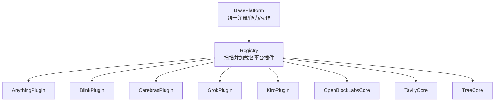

**图表来源**
- [core/registry.py:25-33](file://core/registry.py#L25-L33)
- [core/base_platform.py:44-75](file://core/base_platform.py#L44-L75)

**章节来源**
- [core/registry.py:25-33](file://core/registry.py#L25-L33)
- [core/base_platform.py:44-75](file://core/base_platform.py#L44-L75)

## 核心组件
- BasePlatform：定义统一注册流程、执行器选择、验证码策略、能力声明、动作执行入口；提供 query_state/refresh_token/generate_link 等标准能力默认处理。
- Registry：自动扫描 platforms 子模块，导入各 plugin 完成注册；维护平台能力元数据（可被数据库覆盖）。
- 平台 Plugin：将具体协议的 Worker/Adapter 组装为统一的注册流程，映射结果到 RegistrationResult，并暴露 get_platform_actions/execute_action。

**章节来源**
- [core/base_platform.py:44-160](file://core/base_platform.py#L44-L160)
- [core/registry.py:19-38](file://core/registry.py#L19-L38)

## 架构总览
下图展示“统一平台适配器”的通用调用链：上层通过 BasePlatform.register 触发，根据 executor_type 选择浏览器或协议流程；协议邮箱流程由 ProtocolMailboxFlow 驱动，结合 LinkSpec/OtpSpec 等待验证码或魔法链接；最终返回 Account 并附带 extra 信息。

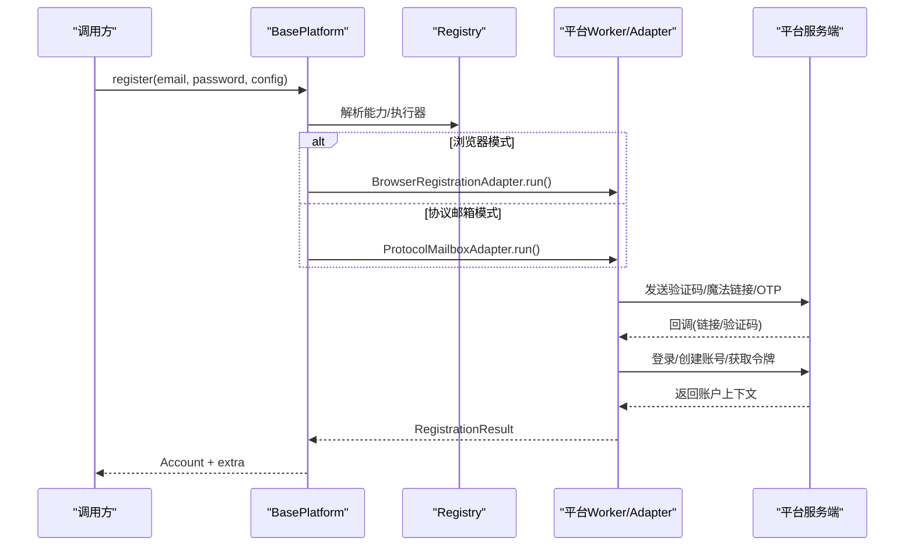

**图表来源**
- [core/base_platform.py:124-160](file://core/base_platform.py#L124-L160)
- [core/base_platform.py:316-328](file://core/base_platform.py#L316-L328)

## 详细组件分析

### Anything 平台
- 协议特点：GraphQL 接口，支持魔法链接注册、刷新 token、组织维度用量聚合、Checkout 支付链接生成。
- 注册流程：通过 GraphQL mutation 发起注册，接收 magic link，使用 code 换取 access_token/refresh_token，随后批量查询 me 与 organizations，并可选拉取用量摘要。
- 特殊配置：支持 referral_code、language、post_login_redirect；checkout lookup 可配置。
- 能力与动作：查询账号状态、生成支付链接。

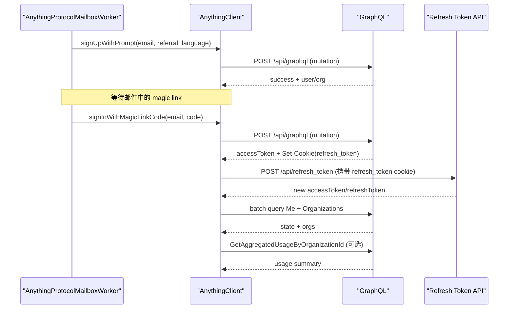

**图表来源**
- [platforms/anything/core.py:392-452](file://platforms/anything/core.py#L392-L452)
- [platforms/anything/core.py:486-564](file://platforms/anything/core.py#L486-L564)
- [platforms/anything/core.py:566-598](file://platforms/anything/core.py#L566-L598)

**章节来源**
- [platforms/anything/core.py:392-598](file://platforms/anything/core.py#L392-L598)
- [platforms/anything/plugin.py:24-144](file://platforms/anything/plugin.py#L24-L144)

### Blink 平台
- 协议特点：Firebase 认证链路 + 应用层 token/session，支持工作区、额度、Stripe Checkout、API Key 创建。
- 注册流程：发送魔法链接 → 兑换 customToken → Firebase signInWithCustomToken → 交换 app token → 获取 session cookie → 创建用户记录 → 后续迁移/推荐码 → 查询 session-data。
- 特殊配置：workspace_slug、referral_code、plan_id/price_id 用于支付；session_token 用于鉴权。
- 能力与动作：查询状态/额度、生成 Pro 支付链接、创建 API Key。

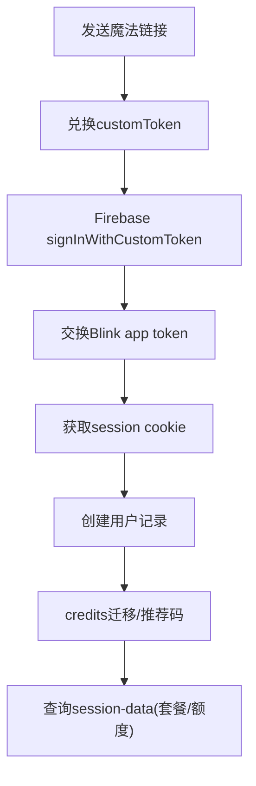

**图表来源**
- [platforms/blink/core.py:236-463](file://platforms/blink/core.py#L236-L463)
- [platforms/blink/core.py:465-544](file://platforms/blink/core.py#L465-L544)

**章节来源**
- [platforms/blink/core.py:236-544](file://platforms/blink/core.py#L236-L544)
- [platforms/blink/plugin.py:20-199](file://platforms/blink/plugin.py#L20-L199)

### Cerebras 平台
- 协议特点：Stytch Email OTP 无密码认证，登录后获取/创建 API Key。
- 注册流程：发送 OTP → 验证 OTP 获取 session → 获取已有 API Key 或创建新 Key。
- 特殊配置：Stytch public token、环境地址；无需密码。
- 能力与动作：查询账号状态（通过 API Key 访问模型列表）。

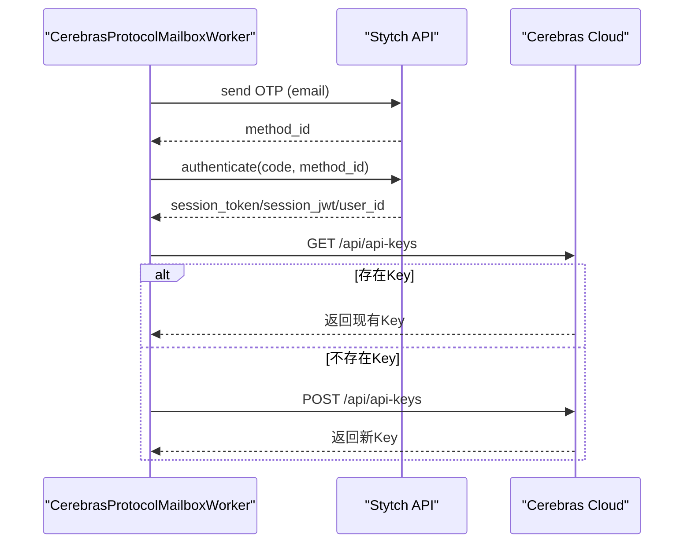

**图表来源**
- [platforms/cerebras/core.py:36-153](file://platforms/cerebras/core.py#L36-L153)

**章节来源**
- [platforms/cerebras/core.py:36-153](file://platforms/cerebras/core.py#L36-L153)
- [platforms/cerebras/plugin.py:8-89](file://platforms/cerebras/plugin.py#L8-L89)

### Grok 平台
- 协议特点：gRPC-Web + Turnstile 验证码，支持邮箱+密码注册、浏览器 OAuth、协议邮箱模式。
- 注册流程：发送验证码 → 校验验证码 → 提交注册（含 Turnstile token）→ 设置 cookies。
- 特殊配置：Turnstile sitekey、next-action；支持 headless/headed 浏览器模式与 OAuth。
- 能力与动作：当前未暴露额外动作；check_valid 基于 sso 字段。

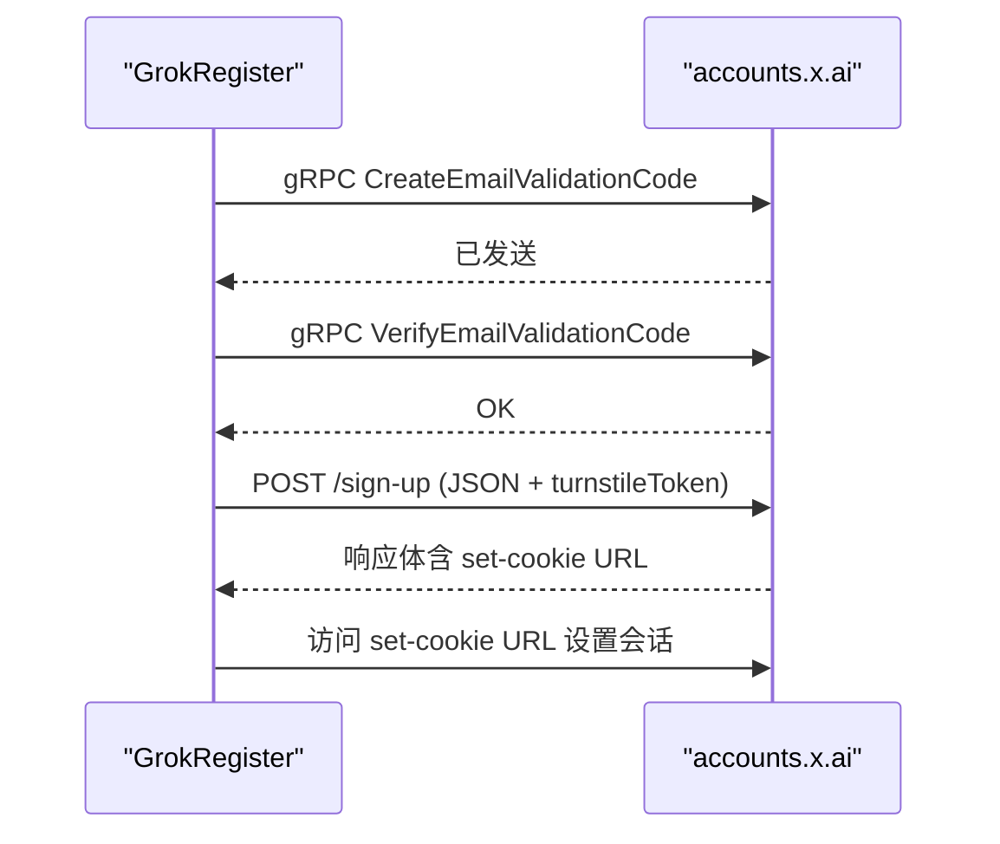

**图表来源**
- [platforms/grok/core.py:75-122](file://platforms/grok/core.py#L75-L122)

**章节来源**
- [platforms/grok/core.py:75-122](file://platforms/grok/core.py#L75-L122)
- [platforms/grok/plugin.py:9-98](file://platforms/grok/plugin.py#L9-L98)

### Kiro 平台
- 协议特点：AWS Builder ID 深度协议，含指纹采集、JWE 密码加密、CSRF 同步、多步工作流；支持桌面端切换与 token 刷新。
- 注册流程：InitiateLogin → OIDC/Portal 重定向链 → signin.aws 工作流 → profile.aws 页面 → send-otp → create-identity → registrationCode → 设置密码(JWE) → 后续步骤。
- 特殊配置：PKCE、FWCIM 指纹、directory-csrf-token 同步、awsd2c-token、JWE 公钥。
- 能力与动作：切换到桌面应用、刷新 token、查询账号状态/用量提示。

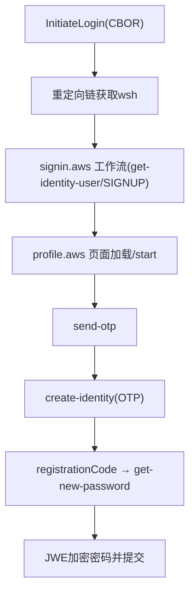

**图表来源**
- [platforms/kiro/core.py:423-800](file://platforms/kiro/core.py#L423-L800)

**章节来源**
- [platforms/kiro/core.py:423-800](file://platforms/kiro/core.py#L423-L800)
- [platforms/kiro/plugin.py:27-320](file://platforms/kiro/plugin.py#L27-L320)

### OpenBlockLabs 平台
- 协议特点：WorkOS AuthKit + Next.js RSC，流程包括 initiate_signup → sign-up → password → email-verification → callback → 创建个人组织。
- 注册流程：GET /sign-up 提取 authorization_session_id 与 next-action → 提交表单 → 获取 pendingAuthenticationToken → 提交 OTP → 回调获取 wos-session → 创建组织。
- 特殊配置：Next router state tree、signals 伪造、CF 拦截重试。
- 能力与动作：当前以协议为主，未暴露额外动作。

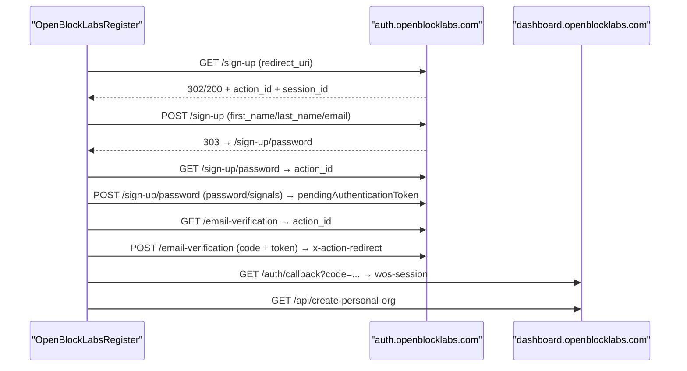

**图表来源**
- [platforms/openblocklabs/core.py:137-316](file://platforms/openblocklabs/core.py#L137-L316)

**章节来源**
- [platforms/openblocklabs/core.py:137-316](file://platforms/openblocklabs/core.py#L137-L316)

### Tavily 平台
- 协议特点：Auth0 授权流程 + Turnstile，支持邮箱/OTP/密码设置，完成后获取 API Key。
- 注册流程：authorize(state/PKCE) → solve captcha → 提交邮箱 → 提交 OTP → 设置密码 → resume → 获取 keys。
- 特殊配置：AUTH0_CLIENT_ID、TURNSTILE_SITEKEY、REDIRECT_URI。
- 能力与动作：当前以协议为主，未暴露额外动作。

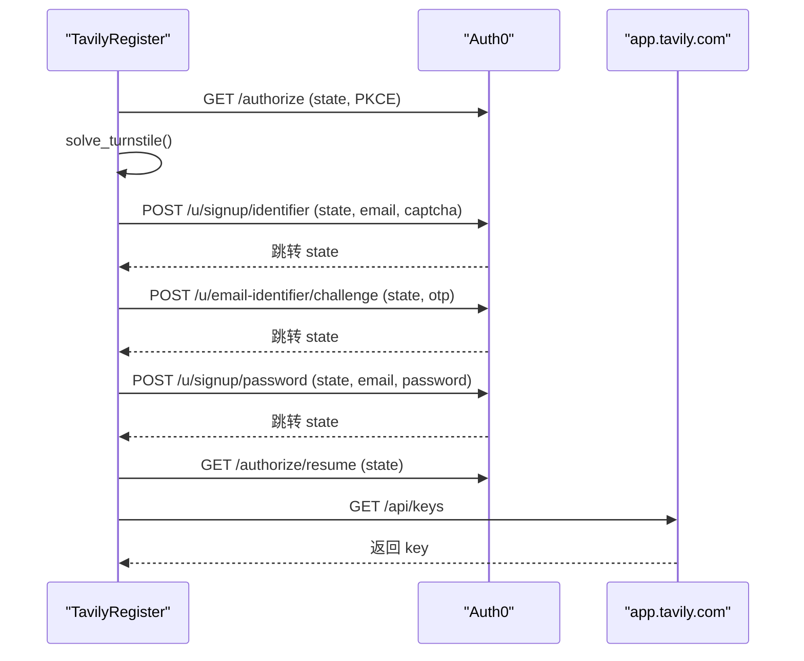

**图表来源**
- [platforms/tavily/core.py:18-90](file://platforms/tavily/core.py#L18-L90)

**章节来源**
- [platforms/tavily/core.py:18-90](file://platforms/tavily/core.py#L18-L90)

### Trae 平台
- 协议特点：TikTok SDK 风格参数，邮箱验证码注册，登录获取 Token，下单支付。
- 注册流程：region → send_code → register_verify_login → Login → GetUserToken → CheckLogin → create_order。
- 特殊配置：aid、sdk_version、verifyFp、语言等基础参数。
- 能力与动作：当前以协议为主，未暴露额外动作。

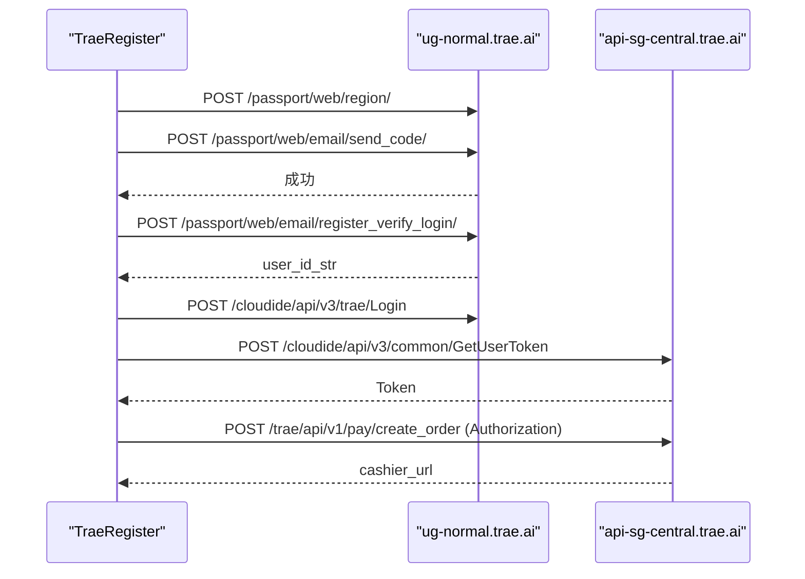

**图表来源**
- [platforms/trae/core.py:32-84](file://platforms/trae/core.py#L32-L84)

**章节来源**
- [platforms/trae/core.py:32-84](file://platforms/trae/core.py#L32-L84)

## 依赖关系分析
- 所有平台均依赖 BasePlatform 提供的统一注册与能力框架；通过 @register 注入 Registry。
- 协议差异主要体现在：
  - 认证方式：魔法链接（Anything/Blink）、OTP（Cerebras/Tavily/Kiro/Trae）、gRPC-Web（Grok）。
  - 支付/能力：Anything/Blink 提供 Checkout；Kiro 提供桌面切换与 token 刷新；其余平台侧重注册与密钥获取。
- 验证码策略：BasePlatform 提供 solve_turnstile_with_fallback，按配置顺序尝试多个 provider；Grok/Tavily 显式集成 Turnstile。

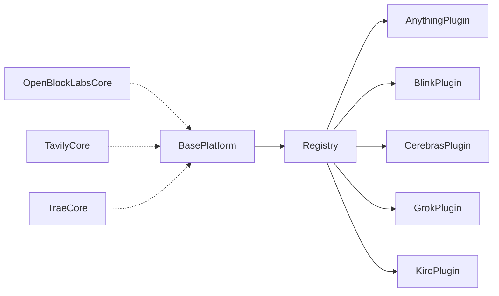

**图表来源**
- [core/base_platform.py:44-75](file://core/base_platform.py#L44-L75)
- [core/registry.py:25-33](file://core/registry.py#L25-L33)

**章节来源**
- [core/base_platform.py:44-75](file://core/base_platform.py#L44-L75)
- [core/registry.py:25-33](file://core/registry.py#L25-L33)

## 性能与稳定性考量
- 网络与并发：
  - Anything 使用 GraphQL Batch 请求减少往返；Blink/Cerebras/Grok/Kiro 等多步流程建议合理超时与重试。
  - Kiro 的指纹与 CSRF 同步较复杂，需避免重复 Cookie 导致冲突。
- 验证码与反爬：
  - Grok/Tavily 依赖 Turnstile，应配置可靠 solver；Anything/Blink 使用魔法链接，需稳定邮箱服务。
- 令牌刷新：
  - Anything/Blink/Kiro 支持 refresh_token；Anything 通过 Set-Cookie 绑定 refresh_token，Kiro 通过远端刷新接口。
- 支付链接：
  - Anything/Blink 支持 checkout 链接生成；注意 organization/workspace 上下文与 redirect/cancel URL。

[本节为通用指导，不直接分析具体文件]

## 故障排查指南
- 魔法链接/OTP 无法到达：检查邮箱提供商与过滤规则；确认 LinkSpec/OtpSpec 的 wait_message 与回调是否匹配。
- Token 失效：优先尝试 refresh_token；Anything 需确保 refresh_token 已绑定到 Session Cookie；Kiro 需要 clientId/clientSecret。
- 支付链接失败：确认 organization/workspace 上下文与 price_id/lookup 配置；Blink 需 workspace_id，Anything 需 organization_id。
- 验证码失败：检查 Turnstile sitekey 与页面 URL；BasePlatform 会按配置顺序尝试多个 solver，查看日志定位失败 provider。

**章节来源**
- [platforms/anything/core.py:486-509](file://platforms/anything/core.py#L486-L509)
- [platforms/blink/core.py:525-544](file://platforms/blink/core.py#L525-L544)
- [platforms/kiro/plugin.py:132-147](file://platforms/kiro/plugin.py#L132-L147)
- [core/base_platform.py:412-430](file://core/base_platform.py#L412-L430)

## 结论
本项目通过 BasePlatform 与 Registry 实现了跨平台的统一注册与能力扩展。各平台在认证流程、验证码、支付与桌面集成等方面各有特色，但都遵循一致的插件化模式。开发者可按需启用浏览器/协议模式、配置验证码与代理、并通过 execute_action 扩展平台特定功能。对于新增平台，建议优先复用 ProtocolMailboxAdapter/ProtocolOAuthAdapter，并在 plugin 中声明 capabilities 与 actions。

[本节为总结性内容，不直接分析具体文件]

## 附录：平台选择与集成实践
- 平台选择指南
  - 需要 GraphQL 与组织级用量/支付：Anything
  - 需要工作区、Stripe 支付与 API Key：Blink
  - 无密码 OTP + API Key：Cerebras
  - gRPC-Web + Turnstile：Grok
  - AWS Builder ID 深度协议 + 桌面切换：Kiro
  - WorkOS AuthKit + Next.js RSC：OpenBlockLabs
  - Auth0 授权 + Turnstile：Tavily
  - TikTok SDK 风格参数 + 订单支付：Trae
- 通用配置建议
  - 执行器：protocol 优先，必要时使用 headless/headed 浏览器模式。
  - 验证码：配置至少一个可用的 Turnstile solver；浏览器模式必须配置默认 provider。
  - 代理：为 curl_cffi Session 配置 http/https 代理，避免地域限制。
  - 超时与重试：对魔法链接/OTP 设置合理超时；对支付链接生成增加重试与错误回退。
- 兼容性说明
  - Anything/Blink/Kiro 支持 refresh_token；Grok/Tavily 更依赖短期会话；OpenBlockLabs/Trae 侧重一次性注册流程。
  - 支付链接：Anything/Blink 成熟；Trae 通过订单接口生成 cashier_url；其余平台以注册/密钥为主。

[本节为通用指导，不直接分析具体文件]