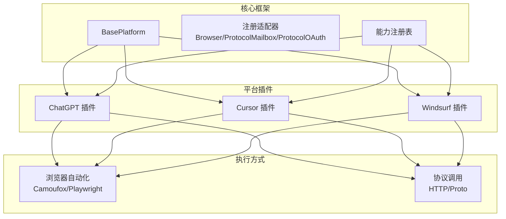
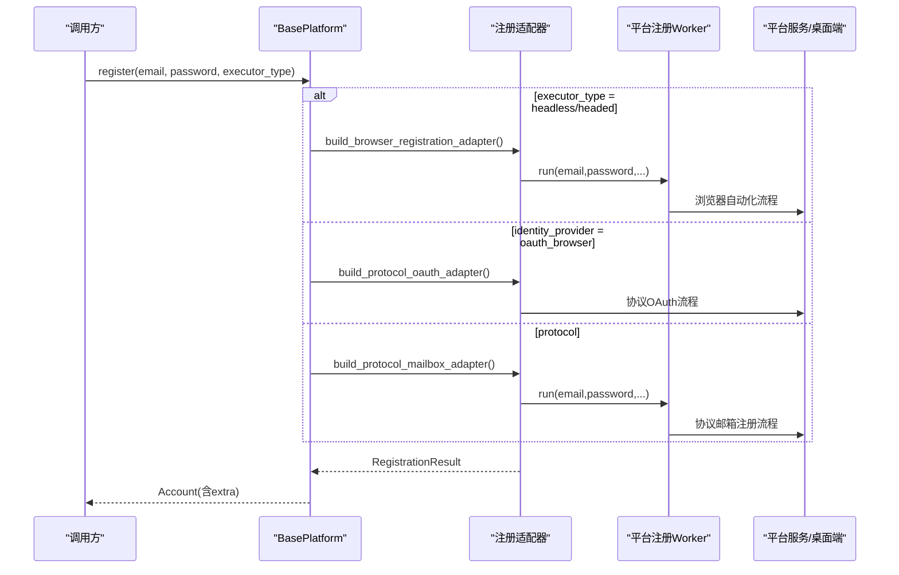
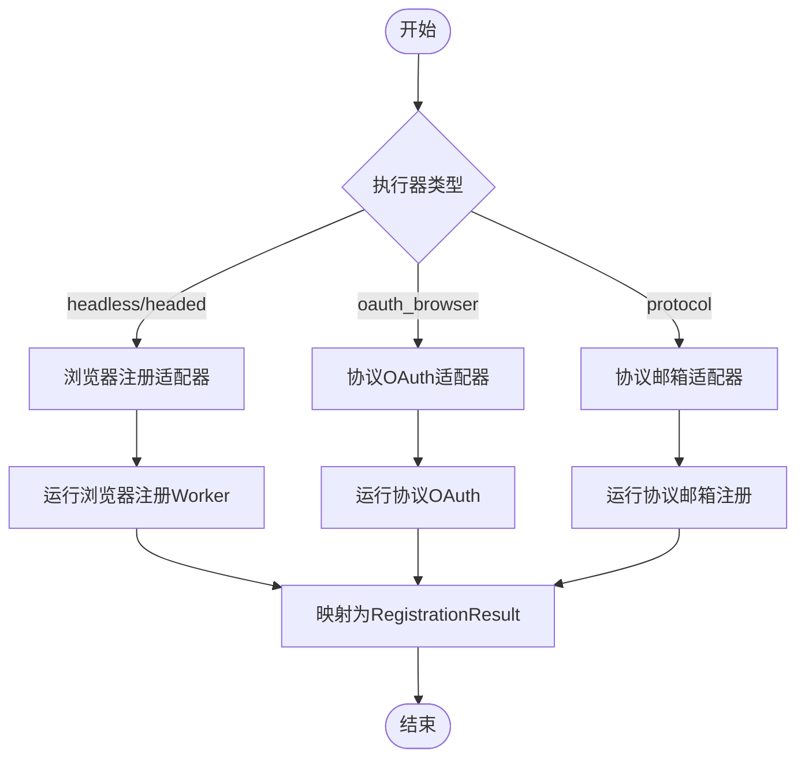
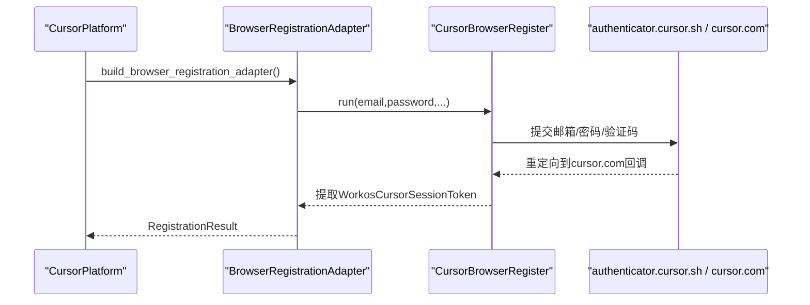
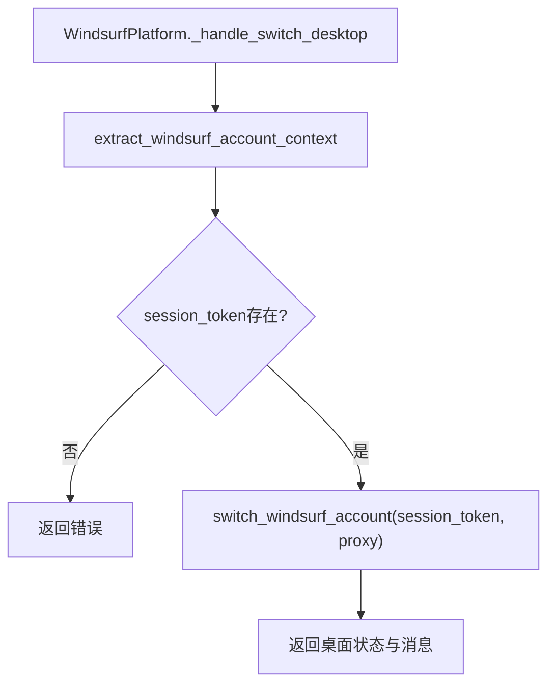
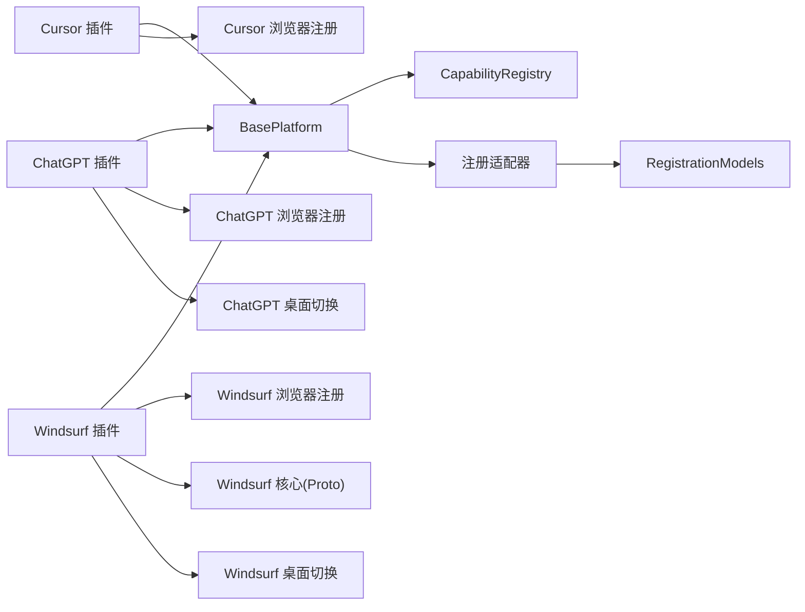

# 现有平台实现分析

<cite>
**本文引用的文件**
- [platforms/chatgpt/plugin.py](file://platforms/chatgpt/plugin.py)
- [platforms/cursor/plugin.py](file://platforms/cursor/plugin.py)
- [platforms/windsurf/plugin.py](file://platforms/windsurf/plugin.py)
- [core/base_platform.py](file://core/base_platform.py)
- [core/registration/adapters.py](file://core/registration/adapters.py)
- [core/registration/models.py](file://core/registration/models.py)
- [core/capability_registry.py](file://core/capability_registry.py)
- [platforms/cursor/core.py](file://platforms/cursor/core.py)
- [platforms/windsurf/core.py](file://platforms/windsurf/core.py)
- [platforms/chatgpt/browser_register.py](file://platforms/chatgpt/browser_register.py)
- [platforms/cursor/browser_register.py](file://platforms/cursor/browser_register.py)
- [platforms/windsurf/browser_register.py](file://platforms/windsurf/browser_register.py)
- [platforms/chatgpt/switch.py](file://platforms/chatgpt/switch.py)
- [platforms/windsurf/switch.py](file://platforms/windsurf/switch.py)
</cite>

## 目录
1. [简介](#简介)
2. [项目结构](#项目结构)
3. [核心组件](#核心组件)
4. [架构总览](#架构总览)
5. [详细组件分析](#详细组件分析)
6. [依赖关系分析](#依赖关系分析)
7. [性能考量](#性能考量)
8. [故障排查指南](#故障排查指南)
9. [结论](#结论)
10. [附录](#附录)

## 简介
本文件聚焦于现有平台适配器的实现模式，深入解析 ChatGPT、Cursor、Windsurf 三大平台的插件与注册流程。文档从系统架构、组件关系、数据流、处理逻辑、集成点、错误处理与性能特征等维度展开，并结合代码级图示说明浏览器自动化与协议调用的不同应用场景。同时提供平台特定功能示例（如 ChatGPT 的 CPA 上传、Windsurf 的桌面应用切换）以及最佳实践与常见问题解决方案，帮助开发者理解如何实现类似的平台适配器。

## 项目结构
仓库采用分层模块化设计：
- core：平台基类、注册适配器与模型、能力注册表、执行器选择、验证码解决器等通用能力
- platforms：各平台插件与具体实现（浏览器注册、协议邮箱/OAuth、桌面端切换、支付链接生成等）
- infrastructure：基础设施仓储与运行时
- api/application：对外 API 与应用层编排
- providers：第三方服务（验证码、短信、代理、邮箱等）

**图表来源**
- [core/base_platform.py:44-160](file://core/base_platform.py#L44-L160)
- [core/registration/adapters.py:27-59](file://core/registration/adapters.py#L27-L59)
- [core/capability_registry.py:27-132](file://core/capability_registry.py#L27-L132)

**章节来源**
- [core/base_platform.py:44-160](file://core/base_platform.py#L44-L160)
- [core/registration/adapters.py:27-59](file://core/registration/adapters.py#L27-L59)
- [core/capability_registry.py:27-132](file://core/capability_registry.py#L27-L132)

## 核心组件
- BasePlatform：定义平台抽象、注册流程调度、能力分发、执行器选择、验证码策略、身份提供者解析等
- 注册适配器：
  - BrowserRegistrationAdapter：封装浏览器注册工作流、OAuth 运行器、OTP/Link 规范、验证码开关
  - ProtocolMailboxAdapter：封装协议邮箱注册工作流、OTP/Link 规范、验证码开关
  - ProtocolOAuthAdapter：封装协议 OAuth 工作流
- RegistrationContext/Artifacts/Result：注册上下文、产物与结果统一数据结构
- CapabilityRegistry：标准能力定义与 UI 提示、排序、筛选

这些组件共同构成“平台无关”的注册与能力体系，平台插件只需声明能力、构建适配器并实现平台特有动作。

**章节来源**
- [core/base_platform.py:44-160](file://core/base_platform.py#L44-L160)
- [core/registration/adapters.py:27-59](file://core/registration/adapters.py#L27-L59)
- [core/registration/models.py:7-66](file://core/registration/models.py#L7-L66)
- [core/capability_registry.py:27-132](file://core/capability_registry.py#L27-L132)

## 架构总览
下图展示了平台插件如何通过 BasePlatform 选择执行器（protocol/headless/headed），并借助注册适配器完成邮箱或 OAuth 注册；随后通过能力系统暴露查询状态、刷新 Token、生成支付链接、切换桌面应用等平台操作。

**图表来源**
- [core/base_platform.py:124-160](file://core/base_platform.py#L124-L160)
- [core/registration/adapters.py:27-59](file://core/registration/adapters.py#L27-L59)

## 详细组件分析

### ChatGPT 平台适配器
- 核心特性
  - 支持执行器：protocol、headless、headed
  - 身份模式：mailbox、oauth_browser
  - 支持 OAuth 提供商：google、microsoft
  - 能力：query_state、refresh_token、generate_link、switch_desktop、upload_cpa、upload_tm
- 注册流程差异
  - 浏览器注册：使用 Camoufox 驱动，处理多语言/多步骤表单、Turnstile、手机号验证、一次性码输入等
  - 协议邮箱：通过自定义 ProtocolMailboxAdapter 与邮件服务协作
  - 协议 OAuth：通过 ProtocolOAuthAdapter 调用 browser_oauth 模块完成 NextAuth/Codex CLI 流程
- 特殊配置要求
  - 密码强度：内置更稳定的密码生成策略，满足 OpenAI 注册页校验
  - 超时：browser_oauth_timeout/manual_oauth_timeout 可配置
  - 代理：check_valid 中按 region 选择代理池并上报成功/失败
- 插件能力与动作
  - switch_desktop：关闭 Codex 桌面端、写入 Chromium Cookies DB、重启应用、拉取远程账号状态
  - upload_cpa/upload_tm：构造 token JSON 并上传至 CPA/Team Manager
  - generate_link：生成 Plus/Team 支付链接，必要时以本地指纹浏览器隐身打开
  - query_state/refresh_token：查询订阅状态、刷新 Token 并回填状态

**图表来源**
- [platforms/chatgpt/plugin.py:160-225](file://platforms/chatgpt/plugin.py#L160-L225)
- [core/registration/adapters.py:27-59](file://core/registration/adapters.py#L27-L59)

**章节来源**
- [platforms/chatgpt/plugin.py:48-225](file://platforms/chatgpt/plugin.py#L48-L225)
- [platforms/chatgpt/browser_register.py:1-200](file://platforms/chatgpt/browser_register.py#L1-L200)
- [platforms/chatgpt/switch.py:180-200](file://platforms/chatgpt/switch.py#L180-L200)

### Cursor 平台适配器
- 核心特性
  - 支持执行器：protocol、headless、headed
  - 身份模式：mailbox
  - 能力：switch_desktop、query_state、generate_link
- 注册流程差异
  - 浏览器注册：Camoufox 驱动，处理 authenticator.cursor.sh 注册、Turnstile、邮箱验证码、跳转获取 WorkosCursorSessionToken
  - 协议邮箱：通过 ProtocolMailboxAdapter 直接走协议接口完成注册
  - 协议 OAuth：复用浏览器 OAuth 流程
- 特殊配置要求
  - Turnstile：自动注入 token，兼容 explicit 渲染模式
  - UA/Impersonate：使用 curl_cffi 模拟浏览器指纹
- 平台动作
  - switch_account：切换桌面应用、读取当前账户、重启 IDE、汇总用量信息
  - get_account_state：查询用户信息、账单、试用资格、用量摘要
  - generate_trial_link：生成 7 天 Pro 试用链接

**图表来源**
- [platforms/cursor/plugin.py:72-114](file://platforms/cursor/plugin.py#L72-L114)
- [platforms/cursor/browser_register.py:1-200](file://platforms/cursor/browser_register.py#L1-L200)
- [platforms/cursor/core.py:41-118](file://platforms/cursor/core.py#L41-L118)

**章节来源**
- [platforms/cursor/plugin.py:18-114](file://platforms/cursor/plugin.py#L18-L114)
- [platforms/cursor/core.py:1-122](file://platforms/cursor/core.py#L1-L122)
- [platforms/cursor/browser_register.py:1-200](file://platforms/cursor/browser_register.py#L1-L200)

### Windsurf 平台适配器
- 核心特性
  - 支持执行器：protocol、headless、headed
  - 身份模式：mailbox
  - 能力：query_state、check_trial、generate_link、generate_link_browser、switch_desktop
- 注册流程差异
  - 协议邮箱：通过 ProtocolMailboxAdapter 调用 /_devin-auth/* 接口完成注册
  - 浏览器注册：Playwright/Camoufox 辅助，处理 Turnstile、Stripe 支付流程
  - 桌面切换：纯协议实现，通过 GetOneTimeAuthToken + windsurf:// deep link 切换账号
- 特殊配置要求
  - Turnstile：支持自动打码或传入 token
  - 协议：轻量 protobuf 编解码，无需完整 proto 生成
- 平台动作
  - switch_desktop：获取 OTT 并通过 deep link 触发桌面端认证切换
  - generate_link：生成 Pro Trial Stripe 链接，必要时自动刷新 session/auth_token
  - check_trial：检查试用资格
  - query_state：聚合 current_user、plan_status、stripe_subscription 并输出配额摘要

**图表来源**
- [platforms/windsurf/plugin.py:178-211](file://platforms/windsurf/plugin.py#L178-L211)
- [platforms/windsurf/switch.py:179-200](file://platforms/windsurf/switch.py#L179-L200)

**章节来源**
- [platforms/windsurf/plugin.py:35-385](file://platforms/windsurf/plugin.py#L35-L385)
- [platforms/windsurf/core.py:401-667](file://platforms/windsurf/core.py#L401-L667)
- [platforms/windsurf/switch.py:1-200](file://platforms/windsurf/switch.py#L1-L200)

### 平台对比与实现策略
- 浏览器自动化 vs 协议调用
  - ChatGPT：复杂多步表单与风控，优先浏览器自动化；协议邮箱用于稳定场景；OAuth 走 NextAuth/Codex CLI
  - Cursor：注册流程相对简单，浏览器自动化为主；协议邮箱用于快速注册；桌面切换通过 IDE 状态与重启
  - Windsurf：大量使用 application/proto 接口，协议调用效率高；桌面切换通过 deep link 与 OTT，无需浏览器
- 注册能力声明与动作
  - 三者均通过 capabilities 声明能力，并在 BasePlatform 的能力分发机制下统一处理
  - 平台插件通过 capability_overrides 定制参数与标签，提升前端展示一致性
- 安全与风控
  - Turnstile 注入与全页拦截检测在各平台浏览器注册中均有实现
  - 代理池与成功率上报在 ChatGPT 的状态检查中体现

**章节来源**
- [core/base_platform.py:171-233](file://core/base_platform.py#L171-L233)
- [core/capability_registry.py:27-132](file://core/capability_registry.py#L27-L132)
- [platforms/chatgpt/plugin.py:227-335](file://platforms/chatgpt/plugin.py#L227-L335)
- [platforms/cursor/plugin.py:129-264](file://platforms/cursor/plugin.py#L129-L264)
- [platforms/windsurf/plugin.py:178-385](file://platforms/windsurf/plugin.py#L178-L385)

## 依赖关系分析
- 平台插件依赖 BasePlatform 提供的注册流程与能力分发
- 注册适配器依赖 models 中的 Context/Artifacts/Result 统一数据结构
- 平台核心模块（如 WindsurfClient、CursorRegister）封装 HTTP/Proto 调用
- 浏览器注册模块依赖 Camoufox/Playwright 进行页面交互与风控绕过
- 桌面切换模块依赖操作系统命令与 SQLite 数据库读写

**图表来源**
- [core/base_platform.py:44-160](file://core/base_platform.py#L44-L160)
- [core/registration/models.py:7-66](file://core/registration/models.py#L7-L66)
- [platforms/windsurf/core.py:401-667](file://platforms/windsurf/core.py#L401-L667)
- [platforms/chatgpt/switch.py:180-200](file://platforms/chatgpt/switch.py#L180-L200)
- [platforms/windsurf/switch.py:179-200](file://platforms/windsurf/switch.py#L179-L200)

**章节来源**
- [core/base_platform.py:44-160](file://core/base_platform.py#L44-L160)
- [core/registration/models.py:7-66](file://core/registration/models.py#L7-L66)
- [platforms/windsurf/core.py:401-667](file://platforms/windsurf/core.py#L401-L667)

## 性能考量
- 协议调用优先：Windsurf 大量使用 application/proto 接口，避免浏览器开销，提高吞吐
- 代理池与重试：ChatGPT 的状态检查按 region 选择代理并上报成功/失败，有助于降低失败率
- 验证码解算：Turnstile 自动打码与回退策略减少阻塞，提升注册成功率
- 桌面切换：Windsurf 通过 deep link 与 OTT 切换账号，无需浏览器，速度快且稳定
- 资源隔离：浏览器模式使用 Camoufox/Playwright，注意并发与资源占用，合理设置超时与重试

[本节为通用指导，不直接分析具体文件]

## 故障排查指南
- 注册未完成完整 OAuth callback
  - 现象：缺少 account_id/access_token
  - 处理：检查 NextAuth/Codex CLI 流程返回值，确保必要字段齐全
  - 参考路径：[platforms/chatgpt/plugin.py:16-24](file://platforms/chatgpt/plugin.py#L16-L24)
- 桌面切换失败
  - 现象：缺少 session_token 或无法写入 Cookies DB
  - 处理：确认 session_token 存在，检查目标应用安装路径与数据库权限
  - 参考路径：[platforms/chatgpt/switch.py:180-200](file://platforms/chatgpt/switch.py#L180-L200)
- Windsurf 切换失败
  - 现象：GetOneTimeAuthToken 返回异常或 deep link 未触发
  - 处理：检查 session_token 格式、代理配置、deep link 是否被系统注册
  - 参考路径：[platforms/windsurf/switch.py:179-200](file://platforms/windsurf/switch.py#L179-L200)
- Turnstile 验证失败
  - 现象：页面被 CF 全页拦截或 widget 未响应
  - 处理：注入 token、点击 interstitial checkbox、等待加载
  - 参考路径：[platforms/cursor/browser_register.py:35-103](file://platforms/cursor/browser_register.py#L35-L103)
- 协议邮箱注册 OTP 超时
  - 现象：未在规定时间内收到验证码
  - 处理：调整 otp_timeout，检查邮箱服务可用性
  - 参考路径：[platforms/windsurf/plugin.py:112-118](file://platforms/windsurf/plugin.py#L112-L118)

**章节来源**
- [platforms/chatgpt/plugin.py:16-24](file://platforms/chatgpt/plugin.py#L16-L24)
- [platforms/chatgpt/switch.py:180-200](file://platforms/chatgpt/switch.py#L180-L200)
- [platforms/windsurf/switch.py:179-200](file://platforms/windsurf/switch.py#L179-L200)
- [platforms/cursor/browser_register.py:35-103](file://platforms/cursor/browser_register.py#L35-L103)
- [platforms/windsurf/plugin.py:112-118](file://platforms/windsurf/plugin.py#L112-L118)

## 结论
- 平台适配器通过 BasePlatform 与注册适配器实现了统一的注册与能力体系，平台插件仅需声明能力与实现平台特有逻辑
- ChatGPT 侧重复杂表单与 OAuth 流程，结合桌面端切换与 CPA/TM 上传；Cursor 侧重浏览器自动化与 IDE 切换；Windsurf 侧重协议调用与 deep link 切换
- 浏览器自动化与协议调用各有适用场景：前者适合复杂风控与多步交互，后者适合高吞吐与稳定接口
- 建议在新平台接入时：优先评估协议可行性，必要时结合浏览器自动化；完善 Turnstile 与代理策略；标准化能力声明与动作实现

[本节为总结性内容，不直接分析具体文件]

## 附录
- 平台能力定义与 UI 提示
  - 查询状态、刷新 Token、生成链接、切换桌面、上传 CPA/TM、检查试用、创建 API Key
  - 参考路径：[core/capability_registry.py:27-132](file://core/capability_registry.py#L27-L132)
- 注册适配器与模型
  - OtpSpec/LinkSpec、BrowserRegistrationAdapter/ProtocolMailboxAdapter/ProtocolOAuthAdapter
  - RegistrationContext/Artifacts/Result
  - 参考路径：[core/registration/adapters.py:27-59](file://core/registration/adapters.py#L27-L59)、[core/registration/models.py:7-66](file://core/registration/models.py#L7-L66)
- 平台核心模块
  - WindsurfClient：登录、状态查询、订阅、Proto 编解码
  - CursorRegister：邮箱注册、验证码、Token 获取
  - 参考路径：[platforms/windsurf/core.py:401-667](file://platforms/windsurf/core.py#L401-L667)、[platforms/cursor/core.py:41-118](file://platforms/cursor/core.py#L41-L118)

**章节来源**
- [core/capability_registry.py:27-132](file://core/capability_registry.py#L27-L132)
- [core/registration/adapters.py:27-59](file://core/registration/adapters.py#L27-L59)
- [core/registration/models.py:7-66](file://core/registration/models.py#L7-L66)
- [platforms/windsurf/core.py:401-667](file://platforms/windsurf/core.py#L401-L667)
- [platforms/cursor/core.py:41-118](file://platforms/cursor/core.py#L41-L118)