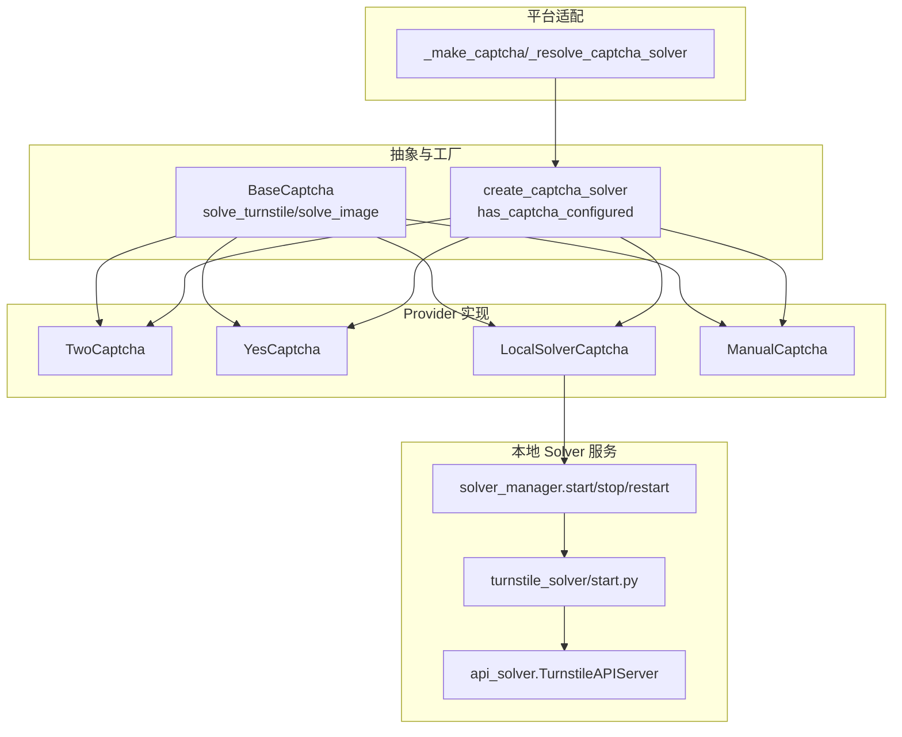
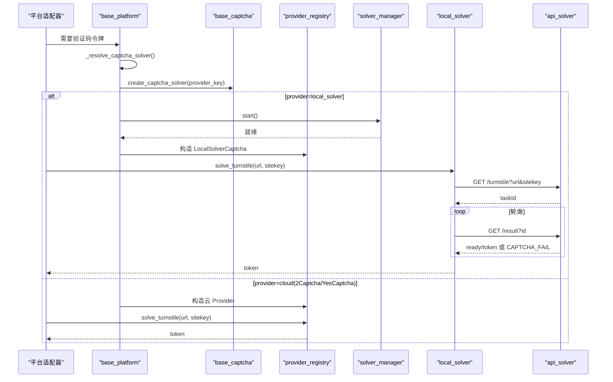
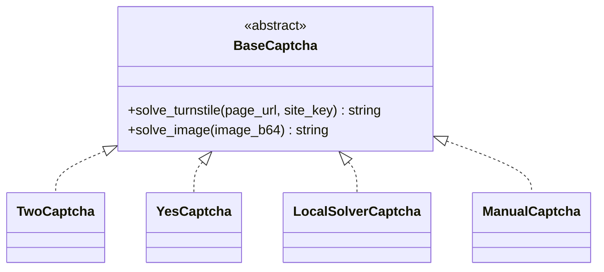
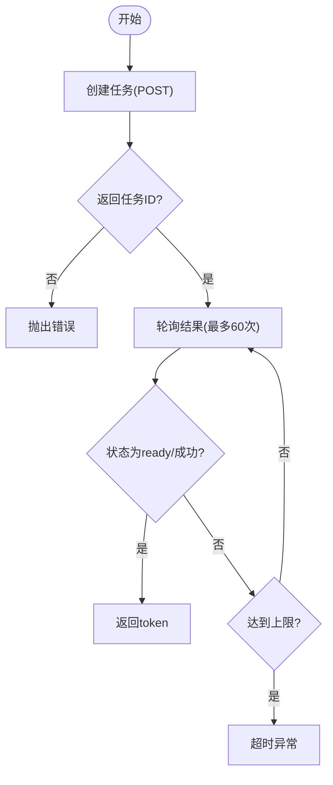
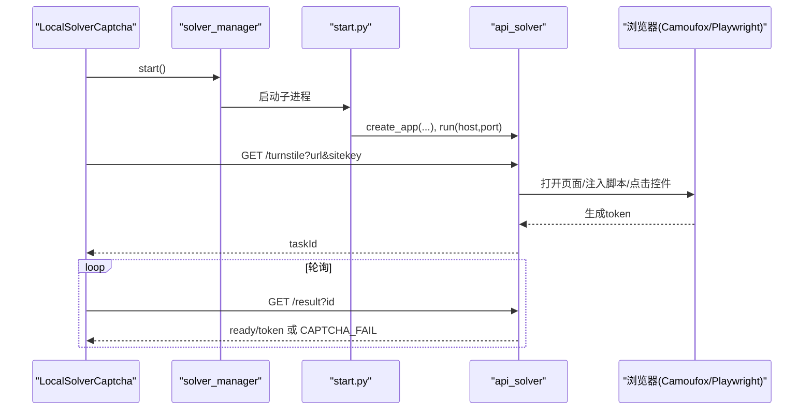
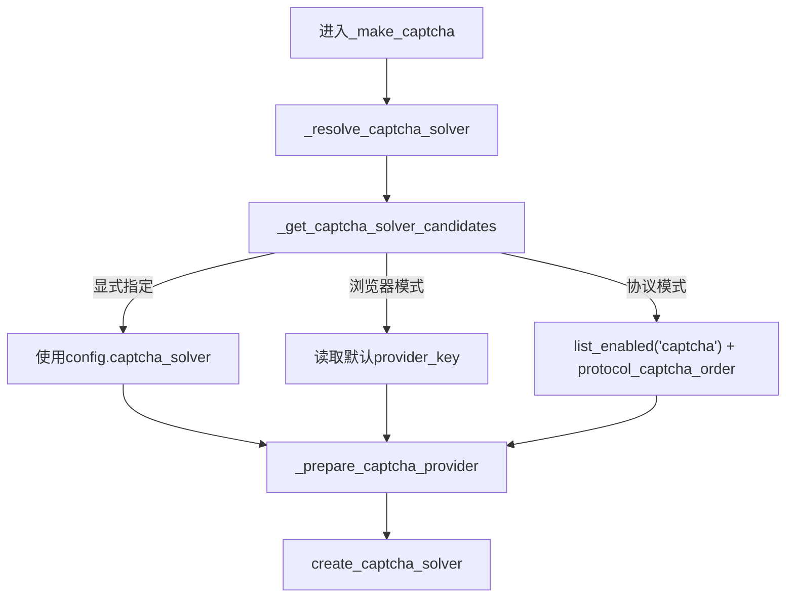
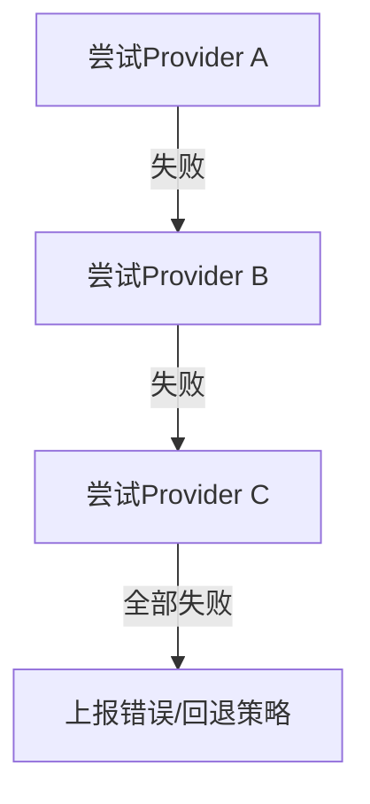
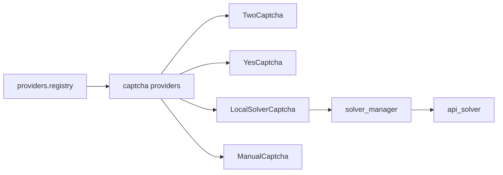

# 验证码处理机制

<cite>
**本文引用的文件**
- [base_captcha.py](file://core/base_captcha.py)
- [registry.py](file://providers/registry.py)
- [twocaptcha.py](file://providers/captcha/twocaptcha.py)
- [yescaptcha.py](file://providers/captcha/yescaptcha.py)
- [local_solver.py](file://providers/captcha/local_solver.py)
- [manual.py](file://providers/captcha/manual.py)
- [solver_manager.py](file://services/solver_manager.py)
- [start.py](file://services/turnstile_solver/start.py)
- [api_solver.py](file://services/turnstile_solver/api_solver.py)
- [base_platform.py](file://core/base_platform.py)
- [test_windsurf_platform.py](file://tests/test_windsurf_platform.py)
</cite>

## 目录
1. [简介](#简介)
2. [项目结构](#项目结构)
3. [核心组件](#核心组件)
4. [架构总览](#架构总览)
5. [详细组件分析](#详细组件分析)
6. [依赖关系分析](#依赖关系分析)
7. [性能考虑](#性能考虑)
8. [故障排查指南](#故障排查指南)
9. [结论](#结论)
10. [附录：配置与集成要点](#附录配置与集成要点)

## 简介
本技术文档围绕系统内的验证码处理机制展开，重点说明支持的验证码类型（Turnstile、reCAPTCHA 等）、解决策略与提供商选择机制；详解 2Captcha、YesCaptcha、本地 Turnstile Solver、人工打码等不同服务的集成方式；给出配置选项、降级与重试策略；并提供平台适配器中集成验证码解决的完整流程与示例路径。目标是帮助开发者在各类注册场景中稳定、高效地获取验证码令牌并完成自动化流程。

## 项目结构
验证码能力由“抽象基类 + 多实现 Provider + 进程管理 + 平台适配”四层组成：
- 抽象层：定义统一接口 solve_turnstile / solve_image
- Provider 层：2Captcha、YesCaptcha、本地 Solver、人工打码等具体实现
- 进程管理层：启动/停止/健康检查本地 Turnstile Solver 服务
- 平台适配层：根据执行器模式与配置自动选择并创建合适的验证码解决器

图表来源
- [base_captcha.py:5-98](file://core/base_captcha.py#L5-L98)
- [registry.py:28-91](file://providers/registry.py#L28-L91)
- [twocaptcha.py:6-64](file://providers/captcha/twocaptcha.py#L6-L64)
- [yescaptcha.py:7-43](file://providers/captcha/yescaptcha.py#L7-L43)
- [local_solver.py:6-80](file://providers/captcha/local_solver.py#L6-L80)
- [manual.py:6-19](file://providers/captcha/manual.py#L6-L19)
- [solver_manager.py:21-229](file://services/solver_manager.py#L21-L229)
- [start.py:1-33](file://services/turnstile_solver/start.py#L1-L33)
- [api_solver.py:62-140](file://services/turnstile_solver/api_solver.py#L62-L140)
- [base_platform.py:330-410](file://core/base_platform.py#L330-L410)

章节来源
- [base_captcha.py:5-98](file://core/base_captcha.py#L5-L98)
- [registry.py:28-91](file://providers/registry.py#L28-L91)
- [solver_manager.py:21-229](file://services/solver_manager.py#L21-L229)
- [start.py:1-33](file://services/turnstile_solver/start.py#L1-L33)
- [api_solver.py:62-140](file://services/turnstile_solver/api_solver.py#L62-L140)
- [base_platform.py:330-410](file://core/base_platform.py#L330-L410)

## 核心组件
- BaseCaptcha 抽象接口：统一 solve_turnstile(page_url, site_key) -> token 与 solve_image(image_b64) -> text
- Provider 注册表：通过装饰器 @register_provider("captcha", driver_type) 将实现注入全局注册表，支持运行时按 driver_type 创建实例
- 具体 Provider：
  - TwoCaptcha：调用 2Captcha API 提交 turnstile 任务并轮询结果
  - YesCaptcha：调用 YesCaptcha API 提交 TurnstileTaskProxyless 任务并轮询结果
  - LocalSolverCaptcha：调用本地 api_solver 服务（Camoufox/patchright）完成 Turnstile 求解
  - ManualCaptcha：阻塞等待用户输入 token（调试/兜底）
- 本地 Solver 进程管理：自动检测/下载 Camoufox 浏览器，启动/停止/重启 solver 子进程，健康检查与失败保护
- 平台适配：根据执行器模式与配置自动选择 provider，必要时自动拉起本地 solver

章节来源
- [base_captcha.py:5-98](file://core/base_captcha.py#L5-L98)
- [registry.py:28-91](file://providers/registry.py#L28-L91)
- [twocaptcha.py:6-64](file://providers/captcha/twocaptcha.py#L6-L64)
- [yescaptcha.py:7-43](file://providers/captcha/yescaptcha.py#L7-L43)
- [local_solver.py:6-80](file://providers/captcha/local_solver.py#L6-L80)
- [manual.py:6-19](file://providers/captcha/manual.py#L6-L19)
- [solver_manager.py:21-229](file://services/solver_manager.py#L21-L229)

## 架构总览
验证码请求从平台侧发起，经 base_platform 的 _make_captcha 解析 provider_key，再调用 create_captcha_solver 构造具体 Provider。若选择 local_solver，则通过 solver_manager 确保本地 solver 服务运行，随后通过 HTTP 与 api_solver 交互，最终由浏览器引擎（Camoufox/Playwright）加载目标页面并提取 Turnstile token。

图表来源
- [base_platform.py:330-410](file://core/base_platform.py#L330-L410)
- [base_captcha.py:67-98](file://core/base_captcha.py#L67-L98)
- [registry.py:51-63](file://providers/registry.py#L51-L63)
- [solver_manager.py:73-155](file://services/solver_manager.py#L73-L155)
- [local_solver.py:17-49](file://providers/captcha/local_solver.py#L17-L49)
- [api_solver.py:135-140](file://services/turnstile_solver/api_solver.py#L135-L140)

## 详细组件分析

### 抽象与工厂：BaseCaptcha 与 create_captcha_solver
- BaseCaptcha 定义统一接口，屏蔽不同后端差异
- create_captcha_solver 根据 provider_key 与驱动类型映射到具体实现，并对 local_solver 做特殊处理
- has_captcha_configured 用于校验某 provider 是否已启用且具备必要认证字段

图表来源
- [base_captcha.py:5-14](file://core/base_captcha.py#L5-L14)
- [twocaptcha.py:6-64](file://providers/captcha/twocaptcha.py#L6-L64)
- [yescaptcha.py:7-43](file://providers/captcha/yescaptcha.py#L7-L43)
- [local_solver.py:6-80](file://providers/captcha/local_solver.py#L6-L80)
- [manual.py:6-19](file://providers/captcha/manual.py#L6-L19)

章节来源
- [base_captcha.py:48-98](file://core/base_captcha.py#L48-L98)

### 云 Provider：2Captcha 与 YesCaptcha
- 2Captcha：POST 创建任务，轮询 getTaskResult，超时抛出异常
- YesCaptcha：POST createTask，轮询 getTaskResult，超时抛出异常
- 两者均仅实现 solve_turnstile，图片验证码未实现

图表来源
- [twocaptcha.py:19-60](file://providers/captcha/twocaptcha.py#L19-L60)
- [yescaptcha.py:20-39](file://providers/captcha/yescaptcha.py#L20-L39)

章节来源
- [twocaptcha.py:6-64](file://providers/captcha/twocaptcha.py#L6-L64)
- [yescaptcha.py:7-43](file://providers/captcha/yescaptcha.py#L7-L43)

### 本地 Provider：LocalSolverCaptcha 与 Turnstile Solver 服务
- LocalSolverCaptcha：向本地 solver 提交 url/sitekey，轮询 /result 获取 token
- solver_manager：负责启动/停止/重启本地 solver，自动安装 Camoufox，连续失败保护
- api_solver：Quart 服务，维护浏览器池，拦截无关资源，注入脚本，定位并点击 Turnstile 元素，捕获 token

图表来源
- [local_solver.py:17-49](file://providers/captcha/local_solver.py#L17-L49)
- [solver_manager.py:73-155](file://services/solver_manager.py#L73-L155)
- [start.py:15-28](file://services/turnstile_solver/start.py#L15-L28)
- [api_solver.py:135-140](file://services/turnstile_solver/api_solver.py#L135-L140)
- [api_solver.py:624-800](file://services/turnstile_solver/api_solver.py#L624-L800)

章节来源
- [local_solver.py:6-80](file://providers/captcha/local_solver.py#L6-L80)
- [solver_manager.py:21-229](file://services/solver_manager.py#L21-L229)
- [start.py:1-33](file://services/turnstile_solver/start.py#L1-L33)
- [api_solver.py:62-140](file://services/turnstile_solver/api_solver.py#L62-L140)

### 人工打码：ManualCaptcha
- 阻塞等待用户输入 token，适用于调试或无法自动化的场景

章节来源
- [manual.py:6-19](file://providers/captcha/manual.py#L6-L19)

### 平台适配：选择机制与优先级
- 选择入口：_make_captcha -> _resolve_captcha_solver -> _get_captcha_solver_candidates
- 候选来源：
  - 显式指定：config.captcha_solver（非空且非 auto）
  - 浏览器模式：读取默认 provider_key（若已配置）
  - 协议模式：遍历已启用的 captcha providers，并结合 protocol_captcha_order 去重合并
- 准备阶段：若选中 local_solver，自动调用 solver_manager.start()
- 创建实例：create_captcha_solver(provider_key, extra)

图表来源
- [base_platform.py:330-410](file://core/base_platform.py#L330-L410)

章节来源
- [base_platform.py:330-410](file://core/base_platform.py#L330-L410)

### 降级策略与重试机制
- 云 Provider 内部：
  - 2Captcha/YesCaptcha：创建任务失败抛错；轮询期间遇到非“未完成”错误直接抛错；达到轮询上限抛出超时
- 本地 Provider：
  - 轮询 /result 时，若返回 errorId 或 CAPTCHA_FAIL，立即抛错；达到轮询上限抛出超时
- 进程级保护：
  - solver_manager 记录连续失败次数，超过阈值后拒绝继续自动重启，需手动干预
- 平台级降级：
  - 测试用例展示了按顺序尝试多个 provider（如 yescaptcha -> local_solver），任一成功即返回

图表来源
- [test_windsurf_platform.py:214-255](file://tests/test_windsurf_platform.py#L214-L255)

章节来源
- [twocaptcha.py:19-60](file://providers/captcha/twocaptcha.py#L19-L60)
- [yescaptcha.py:20-39](file://providers/captcha/yescaptcha.py#L20-L39)
- [local_solver.py:17-49](file://providers/captcha/local_solver.py#L17-L49)
- [solver_manager.py:15-38](file://services/solver_manager.py#L15-L38)
- [test_windsurf_platform.py:214-255](file://tests/test_windsurf_platform.py#L214-L255)

## 依赖关系分析
- 抽象与实现解耦：BaseCaptcha 不感知具体后端，便于扩展新 Provider
- 注册表集中管理：providers.registry 统一管理 captcha/mailbox/sms/proxy 四类 Provider 的发现与创建
- 进程与业务分离：solver_manager 专注进程生命周期，api_solver 专注浏览器自动化
- 平台适配透明化：平台代码只需关心“获取 token”，无需关心底层实现

图表来源
- [registry.py:28-91](file://providers/registry.py#L28-L91)
- [solver_manager.py:73-155](file://services/solver_manager.py#L73-L155)
- [api_solver.py:135-140](file://services/turnstile_solver/api_solver.py#L135-L140)

章节来源
- [registry.py:28-91](file://providers/registry.py#L28-L91)

## 性能考虑
- 资源过滤：api_solver 对非必要资源（媒体、字体、统计、广告等）进行拦截，减少带宽与渲染开销
- 浏览器池：按线程数预初始化浏览器实例，复用上下文，降低启动成本
- 反检测：注入脚本隐藏 webdriver、设置固定 UA/sec-ch-ua，提升通过率
- 轮询间隔：云 Provider 与本地 Provider 均采用固定间隔轮询，避免频繁请求导致限流
- 进程保护：连续失败计数防止雪崩式重启

章节来源
- [api_solver.py:269-307](file://services/turnstile_solver/api_solver.py#L269-L307)
- [api_solver.py:158-239](file://services/turnstile_solver/api_solver.py#L158-L239)
- [api_solver.py:746-768](file://services/turnstile_solver/api_solver.py#L746-L768)
- [twocaptcha.py:42-60](file://providers/captcha/twocaptcha.py#L42-L60)
- [yescaptcha.py:30-39](file://providers/captcha/yescaptcha.py#L30-L39)
- [local_solver.py:30-49](file://providers/captcha/local_solver.py#L30-L49)
- [solver_manager.py:15-38](file://services/solver_manager.py#L15-L38)

## 故障排查指南
- 本地 Solver 无法启动
  - 检查 Camoufox 是否已安装/下载成功
  - 查看连续失败原因与 stderr 输出
  - 确认端口未被占用
- 云 Provider 报错
  - 检查 API Key 是否配置正确
  - 关注轮询返回的错误码与消息
- 平台未配置默认验证码
  - 浏览器模式需在设置页启用并设为默认
  - 协议模式需至少启用一个可用的验证码 provider
- 人工打码卡住
  - 确认终端有输入权限，或切换至自动 provider

章节来源
- [solver_manager.py:41-70](file://services/solver_manager.py#L41-L70)
- [solver_manager.py:115-155](file://services/solver_manager.py#L115-L155)
- [solver_manager.py:158-183](file://services/solver_manager.py#L158-L183)
- [twocaptcha.py:19-60](file://providers/captcha/twocaptcha.py#L19-L60)
- [yescaptcha.py:20-39](file://providers/captcha/yescaptcha.py#L20-L39)
- [base_platform.py:345-352](file://core/base_platform.py#L345-L352)

## 结论
本系统以清晰的抽象与插件化设计实现了多源验证码解决能力，既支持云端服务（2Captcha、YesCaptcha），也提供高性能的本地 Turnstile Solver。平台适配层自动选择最优 provider，并在必要时拉起本地服务；同时内置失败保护与降级策略，保障注册流程的稳定性与可维护性。

## 附录：配置与集成要点
- 配置项建议
  - cloud 类：API Key（如 twocaptcha_key、yescaptcha_key）
  - local_solver：solver_url（默认本地端口）
  - 平台侧：executor_type（headless/headed/protocol）、captcha_solver（auto/指定键）、默认 provider_key（浏览器模式）
- 平台适配器集成步骤
  - 在平台类中通过 _make_captcha(**kwargs) 获取验证码解决器
  - 如需指定 provider，传入 provider_key；否则由 _resolve_captcha_solver 自动选择
  - 调用 solve_turnstile(page_url, site_key) 获取 token 并参与后续注册流程
- 参考路径
  - 平台侧调用入口：[base_platform.py:330-410](file://core/base_platform.py#L330-L410)
  - 云 Provider 示例：[twocaptcha.py:19-60](file://providers/captcha/twocaptcha.py#L19-L60)、[yescaptcha.py:20-39](file://providers/captcha/yescaptcha.py#L20-L39)
  - 本地 Provider 示例：[local_solver.py:17-49](file://providers/captcha/local_solver.py#L17-L49)
  - 进程管理示例：[solver_manager.py:73-155](file://services/solver_manager.py#L73-L155)
  - 测试中的降级策略示例：[test_windsurf_platform.py:214-255](file://tests/test_windsurf_platform.py#L214-L255)