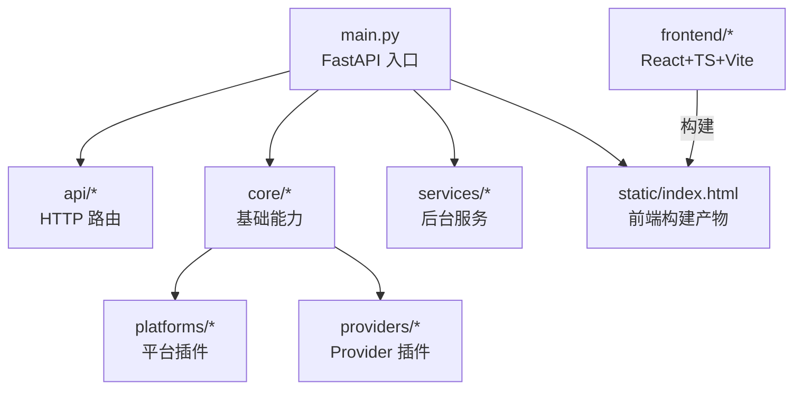
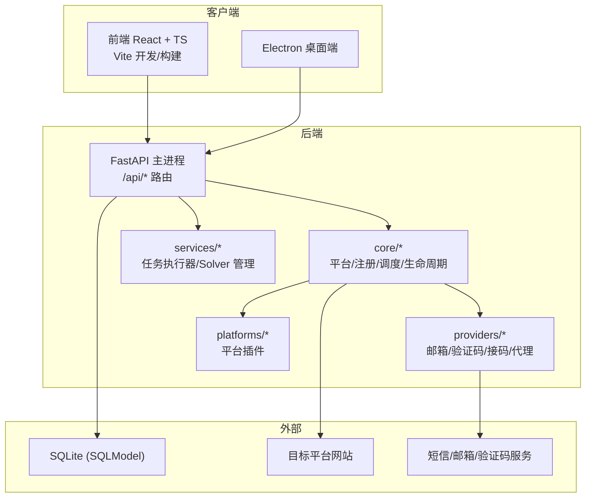
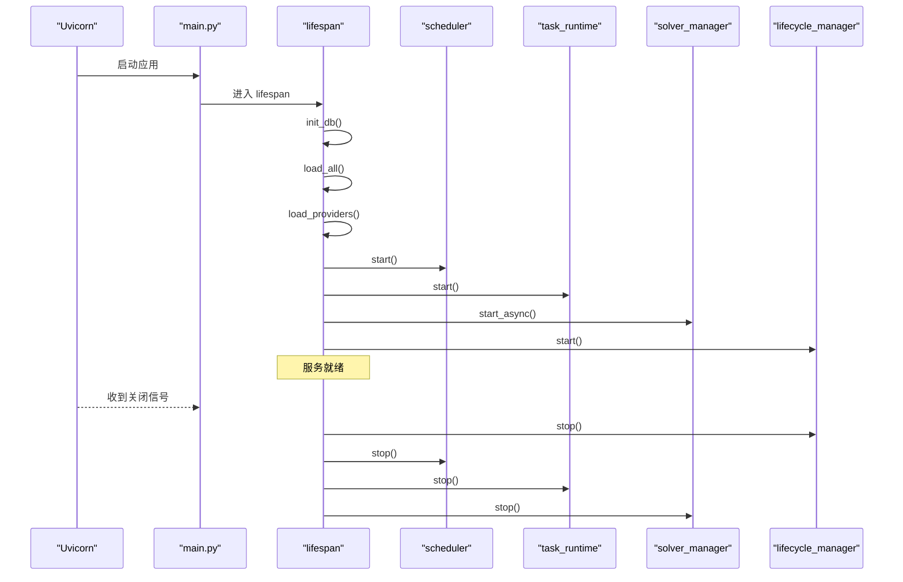
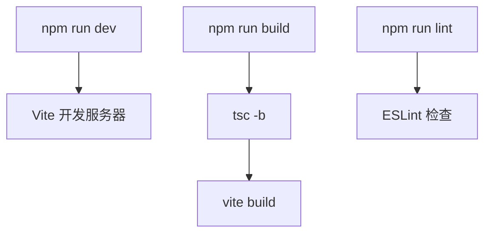
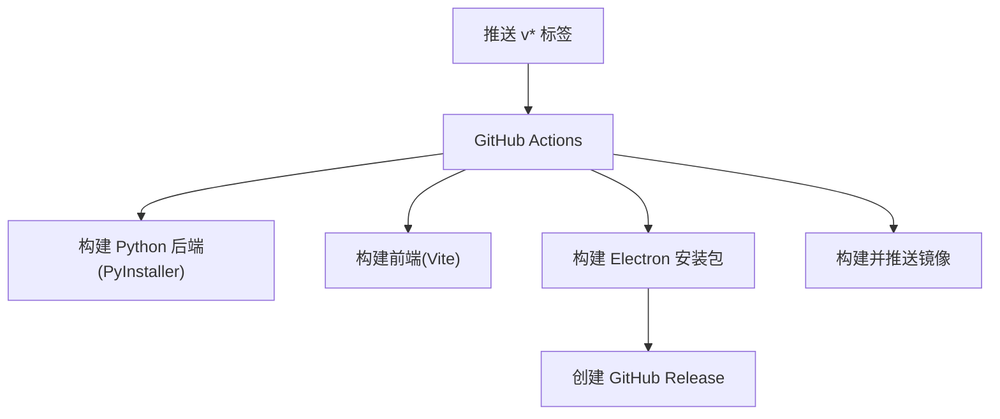
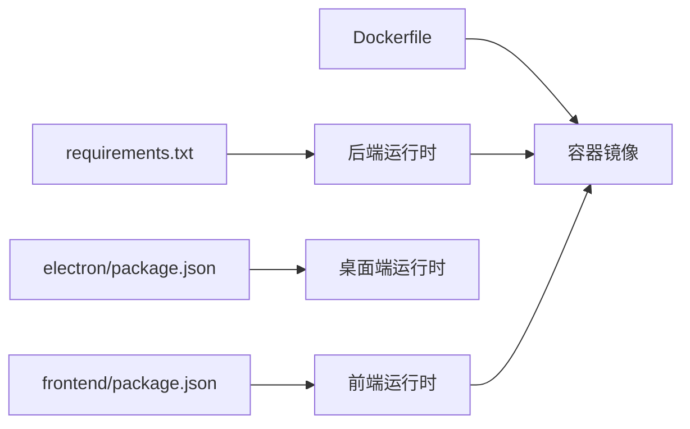

# 开发者指南

<cite>
**本文引用的文件**
- [main.py](file://main.py)
- [requirements.txt](file://requirements.txt)
- [pytest.ini](file://pytest.ini)
- [Dockerfile](file://Dockerfile)
- [docker-compose.yml](file://docker-compose.yml)
- [CONTRIBUTING.md](file://CONTRIBUTING.md)
- [README.md](file://README.md)
- [frontend/package.json](file://frontend/package.json)
- [frontend/eslint.config.js](file://frontend/eslint.config.js)
- [frontend/tsconfig.json](file://frontend/tsconfig.json)
- [electron/package.json](file://electron/package.json)
- [.github/workflows/release.yml](file://.github/workflows/release.yml)
</cite>

## 目录
1. [简介](#简介)
2. [项目结构](#项目结构)
3. [核心组件](#核心组件)
4. [架构总览](#架构总览)
5. [详细组件分析](#详细组件分析)
6. [依赖关系分析](#依赖关系分析)
7. [性能考量](#性能考量)
8. [故障排查指南](#故障排查指南)
9. [结论](#结论)
10. [附录](#附录)

## 简介
本指南面向贡献者，目标是帮助你在最短时间内搭建开发环境、理解代码结构与模块职责、遵循编码与提交流程、使用常用脚本与工具，并掌握性能分析与调试技巧。项目采用 FastAPI + SQLite（SQLModel）后端、React + TypeScript + Vite 前端、Electron 桌面端打包，支持浏览器自动化与协议模式注册，具备平台/邮箱/验证码/接码/代理等插件化能力。

## 项目结构
仓库采用分层与插件化组织：
- 入口与路由层：main.py 启动 FastAPI 应用，统一挂载 /api/* 路由；各 api/*.py 按领域拆分路由。
- 应用服务层：application/ 聚合业务编排。
- 领域模型：domain/ 定义核心实体与契约。
- 基础设施：infrastructure/ 仓储与运行时适配。
- 核心能力：core/ 提供平台基类、调度器、生命周期管理、数据库初始化、注册流程等。
- 平台插件：platforms/*/ 每个平台一个子目录，通过 plugin.py 注册。
- Provider 插件：providers/ 下包含 mailbox/captcha/sms/proxy 等可插拔实现。
- 后台服务：services/ 任务执行器、Solver 管理等。
- 前端：frontend/ React + TS + Vite，构建产物由后端静态托管。
- 桌面端：electron/ 打包为跨平台桌面应用。
- 测试：tests/ pytest 用例。
- 文档与脚本：scripts/, tools/ 等辅助工具。

图表来源
- [main.py:30-121](file://main.py#L30-L121)
- [README.md:286-323](file://README.md#L286-L323)

章节来源
- [README.md:286-323](file://README.md#L286-L323)
- [main.py:30-121](file://main.py#L30-L121)

## 核心组件
- 应用生命周期：lifespan 中完成数据库初始化、平台与 Provider 加载、调度器与任务运行器启动、Solver 管理与生命周期管理器启停。
- 路由装配：统一以 /api 前缀挂载多个路由模块，便于前后端契约与权限控制。
- 静态资源：当存在 static 目录时，自动挂载 /assets 并提供 SPA 回退路由。
- 环境变量与编码：强制 UTF-8 输出，避免 Windows 中文环境崩溃。

章节来源
- [main.py:67-92](file://main.py#L67-L92)
- [main.py:94-131](file://main.py#L94-L131)
- [main.py:1-28](file://main.py#L1-L28)

## 架构总览
系统由“后端 API + 前端 UI + 桌面端 + 后台服务”组成。后端负责账号注册、任务队列、统计、配置、生命周期管理等；前端提供可视化界面；桌面端将后端与前端打包分发；后台服务包括任务执行器与 Turnstile Solver。

图表来源
- [main.py:30-121](file://main.py#L30-L121)
- [README.md:276-284](file://README.md#L276-L284)

## 详细组件分析

### 后端启动与服务装配
- 启动流程：设置 UTF-8 输出 -> 创建 FastAPI 实例 -> 添加认证中间件与 CORS -> 挂载所有 /api 路由 -> 挂载静态资源 -> 启动 Uvicorn。
- 生命周期：init_db -> load_all(平台) -> load_providers(邮箱/验证码/接码/代理) -> 启动 scheduler -> 启动 task_runtime -> 启动 solver_manager -> 启动 lifecycle_manager。
- 优雅关闭：停止 lifecycle_manager、scheduler、task_runtime、solver_manager。

图表来源
- [main.py:67-92](file://main.py#L67-L92)
- [main.py:94-146](file://main.py#L94-L146)

章节来源
- [main.py:1-28](file://main.py#L1-L28)
- [main.py:67-146](file://main.py#L67-L146)

### 前端工程与规范
- 技术栈：React + TypeScript + Vite + TailwindCSS。
- 脚本命令：dev/build/lint/preview。
- ESLint：启用 JS 推荐规则、TypeScript ESLint、React Hooks、React Refresh 的 Vite 配置。
- TypeScript：使用 project references 分离 app/node 配置。

图表来源
- [frontend/package.json:6-10](file://frontend/package.json#L6-L10)
- [frontend/eslint.config.js:8-23](file://frontend/eslint.config.js#L8-L23)
- [frontend/tsconfig.json:1-7](file://frontend/tsconfig.json#L1-L7)

章节来源
- [frontend/package.json:1-44](file://frontend/package.json#L1-L44)
- [frontend/eslint.config.js:1-24](file://frontend/eslint.config.js#L1-L24)
- [frontend/tsconfig.json:1-8](file://frontend/tsconfig.json#L1-L8)

### 桌面端打包
- Electron 工程：提供 dev/build 脚本，支持多平台打包。
- 构建流程：先构建后端（PyInstaller），再构建 Electron 安装包。
- CI/CD：GitHub Actions 在打 tag 时触发 macOS/Windows/Docker 构建与发布。

图表来源
- [.github/workflows/release.yml:1-219](file://.github/workflows/release.yml#L1-L219)
- [electron/package.json:6-12](file://electron/package.json#L6-L12)

章节来源
- [electron/package.json:1-22](file://electron/package.json#L1-L22)
- [.github/workflows/release.yml:1-219](file://.github/workflows/release.yml#L1-L219)

### 测试与质量保障
- 测试框架：pytest，配置文件指定 tests 目录与 pythonpath。
- 运行方式：全局运行或单文件运行。
- 建议：新增功能需补充对应测试用例，保证回归稳定。

章节来源
- [pytest.ini:1-4](file://pytest.ini#L1-L4)
- [CONTRIBUTING.md:13-23](file://CONTRIBUTING.md#L13-L23)

## 依赖关系分析
- 后端依赖：FastAPI、uvicorn、sqlmodel、curl_cffi、playwright、pydantic、quart、rich、pyinstaller 等。
- 前端依赖：React、Tailwind、Radix UI、Vite、TypeScript、ESLint 等。
- 桌面端依赖：Electron、electron-builder、electron-updater。
- 容器化：Dockerfile 分阶段构建前端，安装系统依赖与 Python 依赖，预装 Playwright/Camoufox 浏览器。

图表来源
- [requirements.txt:1-20](file://requirements.txt#L1-L20)
- [frontend/package.json:12-41](file://frontend/package.json#L12-L41)
- [electron/package.json:14-20](file://electron/package.json#L14-L20)
- [Dockerfile:1-61](file://Dockerfile#L1-L61)

章节来源
- [requirements.txt:1-20](file://requirements.txt#L1-L20)
- [Dockerfile:1-61](file://Dockerfile#L1-L61)

## 性能考量
- 并发与队列：任务执行器与调度器支持可配置并发，合理降低并发可减少被风控概率。
- 代理策略：优先动态代理，失败或未配置回退到静态池；低成功率代理自动禁用。
- 浏览器模式：Headless 更快，Headed 用于调试；必要时结合 noVNC 可视化。
- 验证码：优先远程 Solver，本地 Camoufox 作为备选；持续失败需检查代理 IP 质量。
- 构建优化：前端使用 Vite 构建，CI 缓存依赖；后端使用 PyInstaller 打包减少体积。

[本节为通用指导，不直接分析具体文件]

## 故障排查指南
- 验证码失败：确认验证码 provider 已正确配置；协议模式优先远程；浏览器模式失败回退远程；检查代理 IP 质量。
- 代理被封/注册失败率高：查看代理成功率，禁用低成功率代理；使用住宅代理；降低并发；按平台分配代理池。
- Solver 启动超时：首次启动需下载或初始化 Camoufox；检查 8889 端口占用；Docker 建议使用预构建镜像。
- ARM 镜像构建失败：若日志出现前端 TS 错误，先在本地执行前端构建，确认通过后再次构建镜像。

章节来源
- [README.md:390-436](file://README.md#L390-L436)

## 结论
本项目以插件化为核心，围绕“注册流程 + 运营管理 + 系统能力”形成完整闭环。贡献者应遵循 PEP 8、Conventional Commits、ESLint 与 pytest 规范，利用 Docker/Electron 进行部署与打包，借助 CI/CD 自动化构建与发布。遇到问题时优先从代理质量、验证码服务、浏览器依赖与环境变量入手定位。

[本节为总结性内容，不直接分析具体文件]

## 附录

### 开发环境搭建
- 后端环境
  - 创建虚拟环境并安装依赖。
  - 可选：安装 Playwright/Camoufox 浏览器。
  - 启动后端服务。
- 前端环境
  - 安装依赖并启动开发服务器。
  - 使用 ESLint 进行代码检查。
- 桌面端
  - 安装依赖后运行开发或构建脚本。
- 容器化
  - 使用 docker-compose 一键启动，暴露 Web UI、noVNC、Solver 端口。

章节来源
- [README.md:157-179](file://README.md#L157-L179)
- [README.md:125-155](file://README.md#L125-L155)
- [CONTRIBUTING.md:5-11](file://CONTRIBUTING.md#L5-L11)
- [docker-compose.yml:1-18](file://docker-compose.yml#L1-L18)

### 代码规范与命名约定
- Python：遵循 PEP 8，尽量完整类型注解，中文注释和日志。
- TypeScript：启用 ESLint 推荐规则与 React Hooks/Refresh 配置；使用 TypeScript project references。
- Git 提交：遵循 Conventional Commits（feat/fix/docs/refactor/test/chore）。

章节来源
- [CONTRIBUTING.md:25-50](file://CONTRIBUTING.md#L25-L50)
- [frontend/eslint.config.js:8-23](file://frontend/eslint.config.js#L8-L23)
- [frontend/tsconfig.json:1-7](file://frontend/tsconfig.json#L1-L7)

### 目录结构与模块划分原则
- 分层：api/application/domain/infrastructure/core 明确职责边界。
- 插件化：platforms 与 providers 通过注册机制热插拔。
- 服务化：services 独立后台进程，解耦主服务。
- 前端：按页面/组件/库组织，构建产物由后端静态托管。

章节来源
- [README.md:286-323](file://README.md#L286-L323)

### 代码审查与提交流程
- Fork 仓库，创建特性分支。
- 提交信息遵循 Conventional Commits。
- 推送分支并提交 Pull Request。
- 确保测试通过，必要时补充测试用例。
- 更新相关文档（如新增平台能力声明、配置说明）。

章节来源
- [README.md:377-386](file://README.md#L377-L386)
- [CONTRIBUTING.md:25-44](file://CONTRIBUTING.md#L25-L44)

### 常用脚本与工具
- 后端：uvicorn main:app --port 8000。
- 前端：npm run dev/build/lint/preview。
- 桌面端：electron 开发或 electron-builder 打包。
- 测试：pytest 或指定测试文件。
- 容器：docker compose up -d。

章节来源
- [README.md:157-179](file://README.md#L157-L179)
- [frontend/package.json:6-10](file://frontend/package.json#L6-L10)
- [electron/package.json:6-12](file://electron/package.json#L6-L12)
- [pytest.ini:1-4](file://pytest.ini#L1-L4)
- [docker-compose.yml:1-18](file://docker-compose.yml#L1-L18)

### 性能分析与调试技巧
- 浏览器调试：启用 Headed 模式并通过 noVNC 可视化；必要时切换 Headless。
- 验证码调试：优先远程 Solver，本地失败时回退；检查代理 IP 质量。
- 任务与日志：使用任务队列与 SSE 实时日志定位步骤。
- 构建与打包：前端构建失败优先本地验证；后端打包注意收集依赖。

章节来源
- [README.md:390-436](file://README.md#L390-L436)