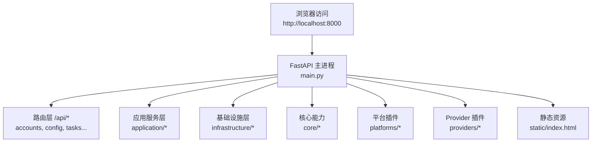
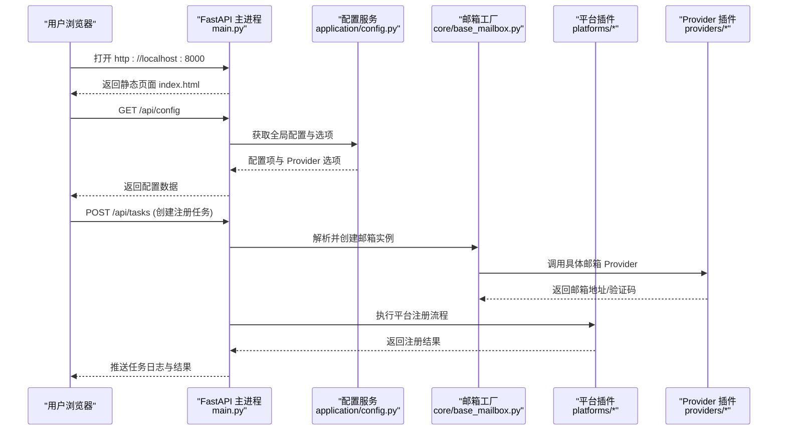
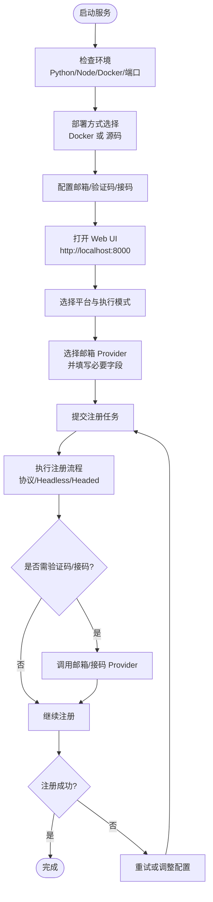
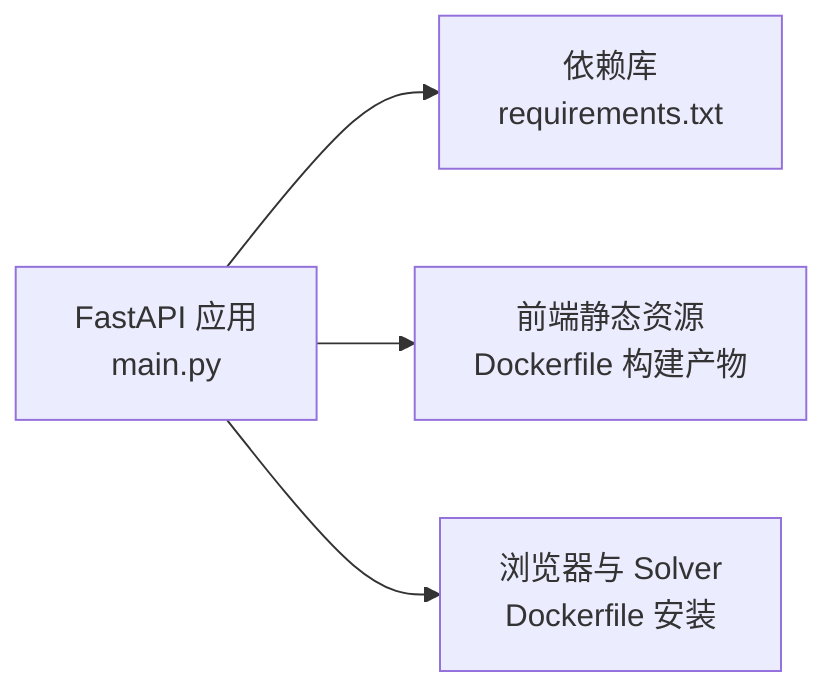

# 快速开始

<cite>
**本文引用的文件**
- [README.md](file://README.md)
- [Dockerfile](file://Dockerfile)
- [docker-compose.yml](file://docker-compose.yml)
- [main.py](file://main.py)
- [requirements.txt](file://requirements.txt)
- [api/config.py](file://api/config.py)
- [application/config.py](file://application/config.py)
- [core/config_store.py](file://core/config_store.py)
- [core/base_mailbox.py](file://core/base_mailbox.py)
- [frontend/src/pages/Register.tsx](file://frontend/src/pages/Register.tsx)
- [frontend/src/lib/registration.ts](file://frontend/src/lib/registration.ts)
</cite>

## 目录
1. [简介](#简介)
2. [项目结构](#项目结构)
3. [核心组件](#核心组件)
4. [架构总览](#架构总览)
5. [详细组件分析](#详细组件分析)
6. [依赖分析](#依赖分析)
7. [性能注意事项](#性能注意事项)
8. [故障排除指南](#故障排除指南)
9. [结论](#结论)
10. [附录](#附录)

## 简介
本指南面向首次使用者，目标是在 30 分钟内完成 Any Auto Register 的部署与首次注册。你将学到：
- 环境要求检查（Python、Node.js、Docker）
- 依赖安装与本地开发环境搭建
- Docker 一键部署方案
- 基础配置、邮箱服务、验证码服务、接码服务的配置要点
- 从启动服务到成功注册第一个账户的完整流程
- 常见问题定位与解决

## 项目结构
Any Auto Register 采用前后端分离与插件化架构：
- 后端 FastAPI 提供 REST API，负责账号管理、任务执行、生命周期管理等
- 前端 React + Vite 提供 Web UI，支持可视化注册、设置、统计等
- 插件体系覆盖平台、邮箱、验证码、接码、代理等能力，支持热插拔
- 通过 Docker 镜像内置浏览器与 noVNC，便于可视化调试

图表来源
- [main.py:30-121](file://main.py#L30-L121)
- [Dockerfile:1-61](file://Dockerfile#L1-L61)

章节来源
- [README.md:112-179](file://README.md#L112-L179)
- [main.py:30-121](file://main.py#L30-L121)

## 核心组件
- 后端入口与生命周期：FastAPI 应用启动时初始化数据库、加载平台与 Provider、启动调度器、任务运行时、Solver 管理器、生命周期管理器
- 配置系统：基于 SQLite 的 key-value 配置存储，配合 Provider 定义与设置，动态渲染表单
- 邮箱服务：多 Provider 工厂与回退机制，支持临时邮箱、自建邮箱、公共邮箱等
- 注册流程：根据平台能力选择执行模式（协议/Headless/Headed），结合邮箱与验证码完成注册
- 前端页面：注册页动态展示可用邮箱 Provider 与字段，支持实时反馈

章节来源
- [main.py:67-91](file://main.py#L67-L91)
- [core/config_store.py:7-48](file://core/config_store.py#L7-L48)
- [core/base_mailbox.py:27-118](file://core/base_mailbox.py#L27-L118)
- [frontend/src/pages/Register.tsx:453-475](file://frontend/src/pages/Register.tsx#L453-L475)

## 架构总览
下图展示了从浏览器访问到后端处理、再到外部服务交互的整体流程。

图表来源
- [main.py:67-121](file://main.py#L67-L121)
- [application/config.py:9-21](file://application/config.py#L9-L21)
- [core/base_mailbox.py:289-347](file://core/base_mailbox.py#L289-L347)

章节来源
- [main.py:67-121](file://main.py#L67-L121)
- [application/config.py:9-21](file://application/config.py#L9-L21)
- [core/base_mailbox.py:289-347](file://core/base_mailbox.py#L289-L347)

## 详细组件分析

### 环境要求与环境检查
- Python 版本：建议 3.11+（Docker 镜像使用 3.12）
- Node.js 版本：18+（构建前端使用 Node 20）
- 浏览器自动化依赖：Playwright Chromium、Camoufox（Docker 镜像已预装）
- 端口占用：8000（Web UI）、6080（noVNC）、8889（Turnstile Solver）

章节来源
- [requirements.txt:1-20](file://requirements.txt#L1-L20)
- [Dockerfile:1-61](file://Dockerfile#L1-L61)
- [README.md:112-179](file://README.md#L112-L179)

### Docker 一键部署
- 使用 docker-compose 拉起服务，映射 8000/6080/8889 端口，持久化 SQLite 数据
- 可选环境变量：APP_PASSWORD（访问密码）、VNC_PASSWORD（VNC 密码）、ACCOUNT_MANAGER_DATABASE_URL（数据库路径）
- 启动后访问：
  - Web UI：http://localhost:8000
  - noVNC：http://localhost:6080/vnc.html
  - Solver：http://localhost:8889

章节来源
- [docker-compose.yml:1-18](file://docker-compose.yml#L1-L18)
- [Dockerfile:1-61](file://Dockerfile#L1-L61)
- [README.md:125-155](file://README.md#L125-L155)

### 本地开发环境搭建
- 源码运行步骤：
  - 克隆仓库，进入 account_manager 目录
  - 创建虚拟环境并安装 Python 依赖
  - 构建前端静态资源
  - 安装 Playwright Chromium 与 Camoufox（如需浏览器模式）
  - 启动 uvicorn 服务
- 前端开发模式：在 frontend 目录运行 npm run dev，通过 Vite 代理转发 API

章节来源
- [README.md:157-179](file://README.md#L157-L179)
- [main.py:133-145](file://main.py#L133-L145)

### 配置示例与说明
- 基础设置：
  - 通过 /api/config 接口获取与更新全局配置
  - 配置项以 key-value 形式持久化到 SQLite
- 邮箱服务配置：
  - 在“设置”页新增并启用一个默认邮箱 Provider
  - 支持的 Provider 包括 MoeMail、Laoudo、Cloudflare Worker 自建、Testmail、DuckDuckGo Email、Freemail、DuckMail、TempMail.lol、Temp-Mail Web
  - 各 Provider 字段由后端 catalog 动态渲染，按提示填写即可
- 验证码服务配置：
  - YesCaptcha：填写 Client Key
  - 2Captcha：填写 API Key
  - 本地 Solver：需先执行 camoufox fetch，并在“全局配置”中重启 Solver
- 接码服务配置：
  - SMS-Activate：填写 API Key，可配置默认国家
  - HeroSMS：填写 API Key，可配置服务代码、国家 ID、最高单价、号码复用策略

章节来源
- [api/config.py:1-29](file://api/config.py#L1-L29)
- [application/config.py:9-21](file://application/config.py#L9-L21)
- [core/config_store.py:7-48](file://core/config_store.py#L7-L48)
- [README.md:181-231](file://README.md#L181-L231)

### 第一个账户注册流程演示
以下流程从启动服务到成功注册账户，涵盖关键步骤与可能遇到的分支判断。

图表来源
- [frontend/src/pages/Register.tsx:453-475](file://frontend/src/pages/Register.tsx#L453-L475)
- [frontend/src/lib/registration.ts:34-71](file://frontend/src/lib/registration.ts#L34-L71)
- [core/base_mailbox.py:289-347](file://core/base_mailbox.py#L289-L347)

章节来源
- [frontend/src/pages/Register.tsx:453-475](file://frontend/src/pages/Register.tsx#L453-L475)
- [frontend/src/lib/registration.ts:34-71](file://frontend/src/lib/registration.ts#L34-L71)
- [core/base_mailbox.py:289-347](file://core/base_mailbox.py#L289-L347)

## 依赖分析
- 后端依赖：FastAPI、uvicorn、SQLModel、curl_cffi、playwright、pydantic、camoufox 等
- 前端依赖：React、TypeScript、Vite、TailwindCSS
- 运行时依赖：Chromium、Xvfb、x11vnc、noVNC（Docker 镜像内预装）

图表来源
- [requirements.txt:1-20](file://requirements.txt#L1-L20)
- [Dockerfile:1-61](file://Dockerfile#L1-L61)
- [main.py:30-121](file://main.py#L30-L121)

章节来源
- [requirements.txt:1-20](file://requirements.txt#L1-L20)
- [Dockerfile:1-61](file://Dockerfile#L1-L61)

## 性能注意事项
- 并发控制：合理设置注册任务并发数，避免同一 IP 短时间大量请求导致风控
- 代理质量：优先使用住宅代理，降低被封概率；监控各代理成功率，禁用低成功率代理
- 浏览器模式：Headless 模式更快，Headed 模式便于调试但资源消耗更高
- 验证码服务：远程验证码服务（YesCaptcha/2Captcha）更稳定；本地 Solver 需确保健康检查通过
- 邮箱 Provider：选择稳定性高的 Provider（如 Laoudo），必要时配置回退列表提升成功率

[本节为通用指导，不直接分析具体文件]

## 故障排除指南
- 验证码失败
  - 确认验证码 Provider 已正确配置（Client Key 或本地 Solver）
  - 协议模式下优先使用远程验证码服务
  - 浏览器模式下 Camoufox 自动尝试点击 Turnstile checkbox，失败回退到远程 Solver
  - 持续失败检查代理 IP 质量
- 代理被封/注册失败率高
  - 查看各代理成功率，禁用低成功率代理
  - 使用住宅代理而非数据中心代理
  - 降低并发数，按平台分配代理池
- Solver 启动超时
  - 本地执行 camoufox fetch 后重启 Solver
  - 如不依赖本地 Solver，配置 YesCaptcha 或 2Captcha
  - Docker 环境建议使用预构建镜像；检查 8889 端口与 Camoufox 安装
- ARM 镜像构建失败
  - 实际失败点常为前端 TypeScript 构建，先本地执行 npm run build
  - 确认构建通过后重新构建镜像并启动

章节来源
- [README.md:388-436](file://README.md#L388-L436)

## 结论
通过本指南，你可以在 30 分钟内完成 Any Auto Register 的部署与首次注册。推荐优先使用 Docker 一键部署，配合稳定的邮箱与验证码 Provider，以获得最佳体验。遇到问题时，参考故障排除指南逐步定位与解决。

[本节为总结性内容，不直接分析具体文件]

## 附录
- 常用接口
  - 获取配置：GET /api/config
  - 更新配置：PUT /api/config
  - 获取配置选项：GET /api/config/options
- 常见环境变量
  - APP_PASSWORD：访问密码（可选）
  - VNC_PASSWORD：VNC 密码（可选）
  - ACCOUNT_MANAGER_DATABASE_URL：SQLite 数据库路径（可选）

章节来源
- [api/config.py:1-29](file://api/config.py#L1-L29)
- [docker-compose.yml:1-18](file://docker-compose.yml#L1-L18)