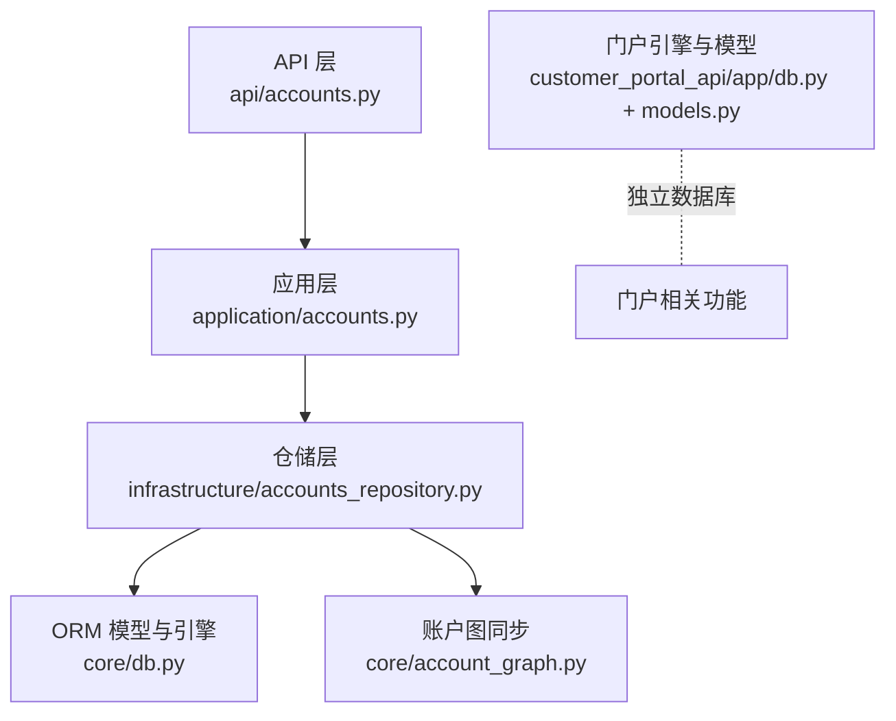
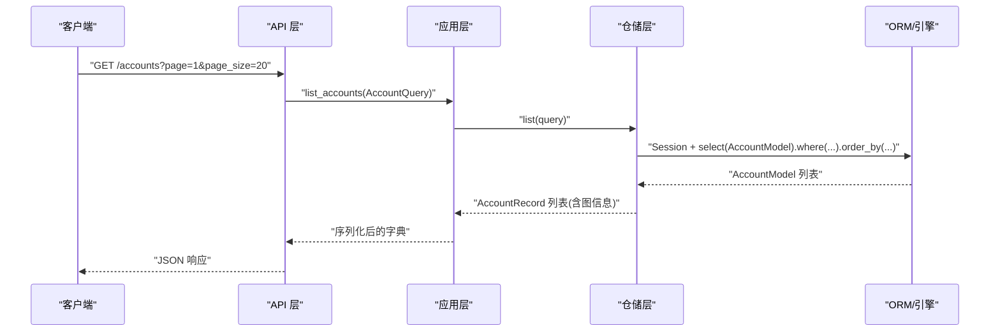
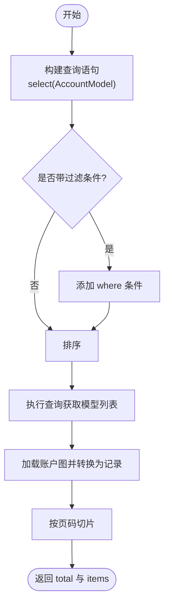
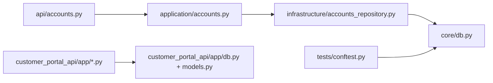

# ORM使用指南

<cite>
**本文引用的文件**
- [core/db.py](file://core/db.py)
- [customer_portal_api/app/models.py](file://customer_portal_api/app/models.py)
- [customer_portal_api/app/db.py](file://customer_portal_api/app/db.py)
- [infrastructure/accounts_repository.py](file://infrastructure/accounts_repository.py)
- [application/accounts.py](file://application/accounts.py)
- [api/accounts.py](file://api/accounts.py)
- [infrastructure/tasks_read_repository.py](file://infrastructure/tasks_read_repository.py)
- [tests/conftest.py](file://tests/conftest.py)
</cite>

## 目录
1. [简介](#简介)
2. [项目结构](#项目结构)
3. [核心组件](#核心组件)
4. [架构总览](#架构总览)
5. [详细组件分析](#详细组件分析)
6. [依赖关系分析](#依赖关系分析)
7. [性能考量](#性能考量)
8. [故障排查指南](#故障排查指南)
9. [结论](#结论)
10. [附录：常见查询模式与示例路径](#附录：常见查询模式与示例路径)

## 简介
本指南面向希望在本项目中正确使用 SQLAlchemy/SQLModel 的开发者，系统说明数据库连接管理、会话与事务处理、CRUD 操作模式、复杂查询（JOIN、子查询、聚合）、JSON 字段序列化/反序列化、异步支持与性能优化技巧，并给出常见查询模式的代码片段路径。本项目采用 SQLModel 作为 ORM，结合 Repository 模式将数据访问逻辑封装在基础设施层，应用层通过服务类编排业务，API 层仅负责参数校验与响应组装。

## 项目结构
- 模型定义
  - 主引擎与模型：core/db.py
  - 门户引擎与模型：customer_portal_api/app/db.py、customer_portal_api/app/models.py
- 仓储层
  - 账户仓储：infrastructure/accounts_repository.py
  - 任务只读仓储：infrastructure/tasks_read_repository.py
- 应用层
  - 账户服务：application/accounts.py
- API 层
  - 账户路由：api/accounts.py
- 测试
  - 测试夹具与临时数据库：tests/conftest.py

图表来源
- [api/accounts.py:79-110](file://api/accounts.py#L79-L110)
- [application/accounts.py:42-122](file://application/accounts.py#L42-L122)
- [infrastructure/accounts_repository.py:98-162](file://infrastructure/accounts_repository.py#L98-L162)
- [core/db.py:21-23](file://core/db.py#L21-L23)
- [customer_portal_api/app/db.py:20-24](file://customer_portal_api/app/db.py#L20-L24)
- [customer_portal_api/app/models.py:12-253](file://customer_portal_api/app/models.py#L12-L253)

章节来源
- [core/db.py:1-23](file://core/db.py#L1-L23)
- [customer_portal_api/app/db.py:1-33](file://customer_portal_api/app/db.py#L1-L33)
- [customer_portal_api/app/models.py:12-253](file://customer_portal_api/app/models.py#L12-L253)

## 核心组件
- 数据库引擎与会话
  - 主数据库引擎与初始化：core/db.py
  - 门户数据库引擎与会话：customer_portal_api/app/db.py
  - 测试环境临时数据库：tests/conftest.py
- 数据模型
  - 账号、凭证、概览、任务、代理等模型：core/db.py
  - 门户用户、权限、订单、订阅等模型：customer_portal_api/app/models.py
- 仓储与服务
  - 账户仓储实现 CRUD、分页、导入导出、统计：infrastructure/accounts_repository.py
  - 账户服务编排请求/响应与序列化：application/accounts.py
  - 任务只读仓储：infrastructure/tasks_read_repository.py
- API 路由
  - 账户增删改查、批量导出、导入：api/accounts.py

章节来源
- [core/db.py:25-303](file://core/db.py#L25-L303)
- [customer_portal_api/app/models.py:12-253](file://customer_portal_api/app/models.py#L12-L253)
- [infrastructure/accounts_repository.py:98-392](file://infrastructure/accounts_repository.py#L98-L392)
- [application/accounts.py:42-160](file://application/accounts.py#L42-L160)
- [api/accounts.py:79-239](file://api/accounts.py#L79-L239)

## 架构总览
- 分层职责清晰：API 层只做入参校验与响应；应用层编排业务；仓储层专注数据访问；模型层定义表结构与 JSON 存取方法。
- 会话与事务：所有写操作均通过 with Session(engine) as session 开启会话，并在块内 commit；迁移或DDL 使用 engine.begin() 保证原子性。
- JSON 字段：大量使用字符串列存储 JSON，并提供 get_/set_ 方法完成序列化/反序列化，避免在 ORM 层直接暴露原始字符串。
- 多数据库：主模块使用 account_manager.db，门户模块使用 customer_portal.db，互不干扰。

图表来源
- [api/accounts.py:79-88](file://api/accounts.py#L79-L88)
- [application/accounts.py:46-52](file://application/accounts.py#L46-L52)
- [infrastructure/accounts_repository.py:111-133](file://infrastructure/accounts_repository.py#L111-L133)
- [core/db.py:21-23](file://core/db.py#L21-L23)

## 详细组件分析

### 数据库连接与会话管理
- 引擎创建
  - 主库：core/db.py 中 create_engine(DATABASE_URL)，默认 SQLite 文件路径由环境变量覆盖。
  - 门户库：customer_portal_api/app/db.py 中 create_engine(DATABASE_URL)，对 SQLite 启用 check_same_thread=False。
- 会话生命周期
  - 读写操作统一使用 with Session(engine) as session 上下文管理器，确保自动提交/回滚与资源释放。
  - 迁移/DDL 使用 engine.begin() 包裹多条语句，保证原子性与外键开关控制。
- 测试隔离
  - tests/conftest.py 注入临时 SQLite 引擎，并在每个用例前后 drop_all/create_all 以隔离状态。

章节来源
- [core/db.py:16-23](file://core/db.py#L16-L23)
- [customer_portal_api/app/db.py:15-24](file://customer_portal_api/app/db.py#L15-L24)
- [core/db.py:401-428](file://core/db.py#L401-L428)
- [tests/conftest.py:11-35](file://tests/conftest.py#L11-L35)

### 数据模型与 JSON 字段
- 模型设计
  - 账号、概览、凭证、提供商定义/设置、任务、事件、代理等均在 core/db.py 中以 SQLModel 声明。
  - 门户模型在 customer_portal_api/app/models.py 中定义，包含用户、角色、权限、产品、订单、订阅、任务等。
- JSON 存取模式
  - 各模型提供 get_xxx()/set_xxx() 方法，内部使用 json.loads/json.dumps，确保空值安全与编码一致。
  - 示例：AccountOverviewModel.get_summary/set_summary、ProviderDefinitionModel.get_auth_modes/set_fields 等。
- 时间戳
  - 统一使用 UTC 时间，默认工厂函数 _utcnow/utcnow。

章节来源
- [core/db.py:25-303](file://core/db.py#L25-L303)
- [customer_portal_api/app/models.py:12-253](file://customer_portal_api/app/models.py#L12-L253)

### CRUD 操作与分页
- 创建
  - 仓储层构造模型对象，session.add -> commit -> refresh，再回填关联图信息。
- 读取
  - 支持按平台、邮箱模糊匹配、状态过滤、排序与分页；返回记录时合并账户图信息。
- 更新
  - 选择性字段更新，更新时间戳，再次同步账户图并提交。
- 删除
  - 先清理关联图，再删除主记录并提交。
- 分页
  - 应用层接收 page/page_size，仓储层计算切片范围并返回 total。

图表来源
- [infrastructure/accounts_repository.py:111-133](file://infrastructure/accounts_repository.py#L111-L133)

章节来源
- [infrastructure/accounts_repository.py:164-242](file://infrastructure/accounts_repository.py#L164-L242)
- [infrastructure/accounts_repository.py:111-162](file://infrastructure/accounts_repository.py#L111-L162)

### 复杂查询：JOIN、子查询、聚合
- JOIN
  - 当前仓库层未直接使用 join，而是通过“账户图”机制将多表数据组合为单一视图后再转换，降低查询复杂度。
- 子查询
  - 可通过 select 链式组合子查询，但当前代码更倾向分步查询与内存组装。
- 聚合
  - 统计通过 Python 侧 compute_account_stats 汇总，而非 SQL 聚合。

建议
- 对于大数据量场景，可在仓储层引入原生 SQL 或 SQLAlchemy 聚合函数，减少内存压力。

章节来源
- [infrastructure/accounts_repository.py:334-358](file://infrastructure/accounts_repository.py#L334-L358)

### 事务处理与一致性
- 写操作统一在 with Session(engine) 块内执行，commit 前可多次 add/update/delete。
- 迁移/DDL 使用 engine.begin() 包裹，必要时关闭外键约束以避免级联失败。
- 导入批量写入后统一提交，减少频繁 IO。

章节来源
- [core/db.py:401-428](file://core/db.py#L401-L428)
- [infrastructure/accounts_repository.py:244-332](file://infrastructure/accounts_repository.py#L244-L332)

### 错误处理与异常管理
- API 层对不存在资源抛出 HTTPException(404)。
- 仓储层对缺失记录返回 None/False，由上层决定行为。
- JSON 解析使用 try/except 兜底，避免脏数据导致崩溃。
- 任务中断标记在服务启动时批量修正，并追加事件日志。

章节来源
- [api/accounts.py:217-239](file://api/accounts.py#L217-L239)
- [infrastructure/accounts_repository.py:135-142](file://infrastructure/accounts_repository.py#L135-L142)
- [core/db.py:347-352](file://core/db.py#L347-L352)
- [application/tasks.py:296-315](file://application/tasks.py#L296-L315)

### 异步支持与性能优化
- 当前实现均为同步 Session，适合 SQLite 与中小规模数据。
- 若需异步，可考虑改用 async_sessionmaker 与异步驱动，并对热点查询加缓存。
- 性能建议
  - 合理使用索引（platform、email、status 等已建索引）。
  - 分页查询限制返回字段，避免大对象传输。
  - 批量导入使用单次 commit。
  - 对只读报表可考虑物化视图或离线统计。

章节来源
- [core/db.py:28-34](file://core/db.py#L28-L34)
- [infrastructure/accounts_repository.py:244-332](file://infrastructure/accounts_repository.py#L244-L332)

## 依赖关系分析
- API 层依赖应用层服务，应用层依赖仓储层，仓储层依赖 ORM 模型与引擎。
- 门户模块与主模块各自维护独立引擎与模型，避免耦合。
- 测试夹具替换引擎，确保测试隔离。

图表来源
- [api/accounts.py:79-110](file://api/accounts.py#L79-L110)
- [application/accounts.py:42-122](file://application/accounts.py#L42-L122)
- [infrastructure/accounts_repository.py:98-162](file://infrastructure/accounts_repository.py#L98-L162)
- [core/db.py:21-23](file://core/db.py#L21-L23)
- [customer_portal_api/app/db.py:20-24](file://customer_portal_api/app/db.py#L20-L24)
- [customer_portal_api/app/models.py:12-253](file://customer_portal_api/app/models.py#L12-L253)
- [tests/conftest.py:11-35](file://tests/conftest.py#L11-L35)

章节来源
- [api/accounts.py:79-110](file://api/accounts.py#L79-L110)
- [application/accounts.py:42-122](file://application/accounts.py#L42-L122)
- [infrastructure/accounts_repository.py:98-162](file://infrastructure/accounts_repository.py#L98-L162)
- [core/db.py:21-23](file://core/db.py#L21-L23)
- [customer_portal_api/app/db.py:20-24](file://customer_portal_api/app/db.py#L20-L24)
- [customer_portal_api/app/models.py:12-253](file://customer_portal_api/app/models.py#L12-L253)
- [tests/conftest.py:11-35](file://tests/conftest.py#L11-L35)

## 性能考量
- 索引策略：对高频查询字段建立索引（如 platform、email、status），已在多处使用 Field(index=True)。
- 分页与限流：API 层默认 page_size=20，避免一次性拉取过多数据。
- 批量写入：导入时使用单事务提交，减少锁竞争。
- JSON 字段：尽量在模型层封装 get_/set_ 方法，避免重复解析。
- 只读查询：任务列表等只读接口可考虑缓存或物化结果。

[本节为通用指导，无需特定文件引用]

## 故障排查指南
- 数据库连接问题
  - 检查 DATABASE_URL 环境变量是否正确指向目标数据库文件。
  - SQLite 多线程访问需启用 check_same_thread=False（门户引擎已配置）。
- 会话未提交
  - 确认所有写操作在 with Session(engine) 块内且显式 commit。
- JSON 解析异常
  - 检查 get_/set_ 方法是否被正确调用，避免直接写入非法 JSON。
- 迁移失败
  - 迁移脚本会关闭外键约束，确保无级联冲突；如遇失败，检查外键关系与数据完整性。
- 测试数据污染
  - 使用 conftest.py 提供的临时数据库夹具，确保用例间隔离。

章节来源
- [customer_portal_api/app/db.py:20-24](file://customer_portal_api/app/db.py#L20-L24)
- [core/db.py:401-428](file://core/db.py#L401-L428)
- [core/db.py:347-352](file://core/db.py#L347-L352)
- [tests/conftest.py:11-35](file://tests/conftest.py#L11-L35)

## 结论
本项目基于 SQLModel 构建了清晰的 ORM 分层：模型定义集中、仓储封装数据访问、应用层编排业务、API 层负责协议交互。通过统一的会话与事务管理、JSON 字段的规范化存取、以及合理的索引与分页策略，实现了稳定高效的数据库操作。后续可按需引入异步 ORM、缓存与更丰富的聚合查询以提升扩展性与性能。

[本节为总结，无需特定文件引用]

## 附录：常见查询模式与示例路径
- 条件查询（平台、邮箱模糊匹配）
  - 参考路径：[infrastructure/accounts_repository.py:111-133](file://infrastructure/accounts_repository.py#L111-L133)
- 排序与分页
  - 参考路径：[infrastructure/accounts_repository.py:111-133](file://infrastructure/accounts_repository.py#L111-L133)
- 批量导入与提交
  - 参考路径：[infrastructure/accounts_repository.py:244-332](file://infrastructure/accounts_repository.py#L244-L332)
- 统计与聚合（Python 侧）
  - 参考路径：[infrastructure/accounts_repository.py:334-358](file://infrastructure/accounts_repository.py#L334-L358)
- JSON 字段序列化/反序列化
  - 参考路径：[core/db.py:52-57](file://core/db.py#L52-L57)、[core/db.py:75-79](file://core/db.py#L75-L79)、[core/db.py:96-106](file://core/db.py#L96-L106)、[core/db.py:153-169](file://core/db.py#L153-L169)、[core/db.py:191-207](file://core/db.py#L191-L207)、[core/db.py:222-227](file://core/db.py#L222-L227)、[core/db.py:260-270](file://core/db.py#L260-L270)、[core/db.py:284-288](file://core/db.py#L284-L288)
- 任务事件追加与事务
  - 参考路径：[application/tasks.py:281-293](file://application/tasks.py#L281-L293)
- 服务重启后任务状态修复
  - 参考路径：[application/tasks.py:296-315](file://application/tasks.py#L296-L315)
- API 层 404 异常处理
  - 参考路径：[api/accounts.py:217-239](file://api/accounts.py#L217-L239)