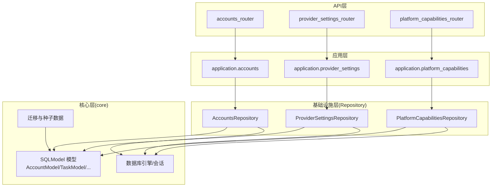
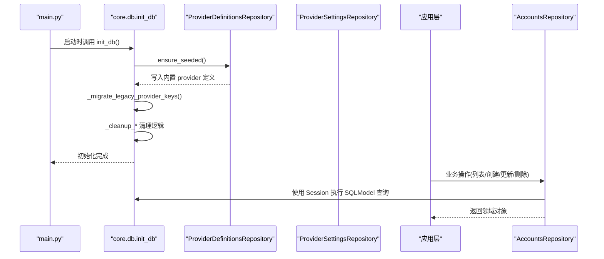
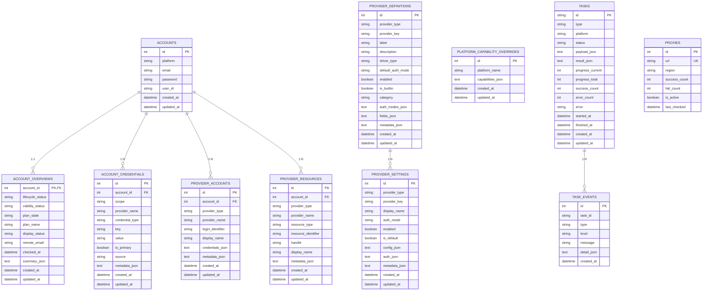
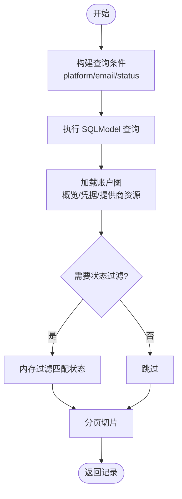
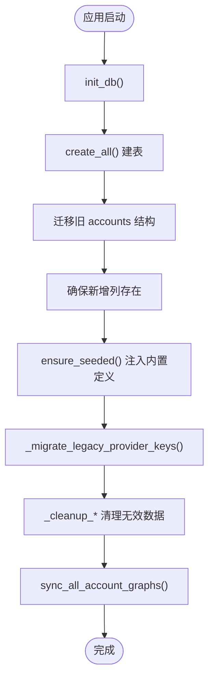
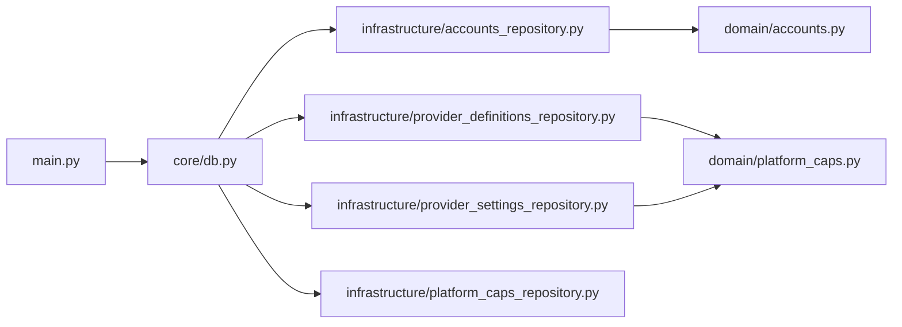

# 数据库设计

<cite>
**本文引用的文件**
- [core/db.py](file://core/db.py)
- [infrastructure/accounts_repository.py](file://infrastructure/accounts_repository.py)
- [infrastructure/provider_definitions_repository.py](file://infrastructure/provider_definitions_repository.py)
- [infrastructure/provider_settings_repository.py](file://infrastructure/provider_settings_repository.py)
- [infrastructure/platform_caps_repository.py](file://infrastructure/platform_caps_repository.py)
- [domain/accounts.py](file://domain/accounts.py)
- [domain/tasks.py](file://domain/tasks.py)
- [domain/platform_caps.py](file://domain/platform_caps.py)
- [main.py](file://main.py)
</cite>

## 目录
1. [简介](#简介)
2. [项目结构](#项目结构)
3. [核心组件](#核心组件)
4. [架构总览](#架构总览)
5. [详细组件分析](#详细组件分析)
6. [依赖关系分析](#依赖关系分析)
7. [性能考虑](#性能考虑)
8. [故障排查指南](#故障排查指南)
9. [结论](#结论)
10. [附录](#附录)

## 简介
本文件面向开发者与维护者，系统化说明系统的数据库模型、存储策略与数据访问层设计。重点覆盖：
- SQLAlchemy/SQLModel ORM 的使用方式与数据库连接管理
- 核心实体（账户、任务、平台能力、提供商设置等）的字段定义、关系映射与索引设计
- 数据访问层 Repository 模式实现、查询优化与事务管理
- 数据库初始化脚本与迁移策略
- 备份、恢复与性能优化建议
- 敏感数据的加密存储与安全访问控制
- 数据模型变更的管理流程与版本兼容性

## 项目结构
系统采用分层架构：
- 领域层 domain：以 dataclass 表达业务对象与命令/查询参数
- 基础设施层 infrastructure：Repository 实现，封装 SQLModel 查询与持久化细节
- 核心层 core：ORM 模型定义、数据库引擎、迁移逻辑、账号图聚合等
- 应用层 application：编排用例，调用 Repository
- API 层 api：HTTP 路由，暴露业务接口
- 启动入口 main.py：生命周期内完成数据库初始化与服务启动

**图表来源**
- [main.py:67-83](file://main.py#L67-L83)
- [core/db.py:21-23](file://core/db.py#L21-L23)

**章节来源**
- [main.py:67-83](file://main.py#L67-L83)

## 核心组件
- 数据库引擎与会话
  - SQLite 引擎通过环境变量或默认路径创建，提供全局 engine
  - 使用 Session(engine) 作为上下文管理器进行事务边界控制
- ORM 模型
  - 账户相关：AccountModel、AccountOverviewModel、AccountCredentialModel、ProviderAccountModel、ProviderResourceModel
  - 提供商相关：ProviderDefinitionModel、ProviderSettingModel
  - 平台能力：PlatformCapabilityOverrideModel
  - 任务与日志：TaskModel、TaskEventModel、TaskLog、ProxyModel
- 仓库实现
  - AccountsRepository：账户 CRUD、导入导出、统计
  - ProviderDefinitionsRepository：内置定义种子、增删改查
  - ProviderSettingsRepository：运行时配置解析、启用排序、默认值处理
  - PlatformCapabilitiesRepository：平台能力覆盖更新与重置
- 领域模型
  - AccountRecord/AccountQuery/AccountCreateCommand/AccountUpdateCommand 等
  - TaskSummary/TaskEvent 等

**章节来源**
- [core/db.py:25-302](file://core/db.py#L25-L302)
- [infrastructure/accounts_repository.py:98-392](file://infrastructure/accounts_repository.py#L98-L392)
- [infrastructure/provider_definitions_repository.py:387-561](file://infrastructure/provider_definitions_repository.py#L387-L561)
- [infrastructure/provider_settings_repository.py:15-167](file://infrastructure/provider_settings_repository.py#L15-L167)
- [infrastructure/platform_caps_repository.py:12-54](file://infrastructure/platform_caps_repository.py#L12-L54)
- [domain/accounts.py:8-100](file://domain/accounts.py#L8-L100)
- [domain/tasks.py:8-44](file://domain/tasks.py#L8-L44)

## 架构总览
系统启动时执行数据库初始化与种子数据注入，随后加载平台与提供商插件，并启动调度器与任务运行器。所有数据访问均通过 Repository 统一抽象，屏蔽底层 SQLModel 细节。

**图表来源**
- [main.py:67-83](file://main.py#L67-L83)
- [core/db.py:430-445](file://core/db.py#L430-L445)
- [infrastructure/provider_definitions_repository.py:389-433](file://infrastructure/provider_definitions_repository.py#L389-L433)

## 详细组件分析

### 数据模型与关系映射
- 账户主表 accounts
  - 字段：id, platform, email, password, user_id, created_at, updated_at
  - 索引：platform, email
  - 用途：平台账号基础信息
- 账户概览 account_overviews
  - 字段：account_id(PK, FK), lifecycle_status, validity_status, plan_state, plan_name, display_status, remote_email, checked_at, summary_json, created_at, updated_at
  - 索引：lifecycle_status, validity_status, display_status
  - 用途：账户生命周期、有效性、计划状态与展示态
- 账户凭据 account_credentials
  - 字段：id, account_id(FK), scope, provider_name, credential_type, key, value, is_primary, source, metadata_json, created_at, updated_at
  - 索引：account_id, scope, provider_name, credential_type, key
  - 用途：多类型凭据存储（token/cookie/secret 等），支持元数据扩展
- 提供商账户 provider_accounts
  - 字段：id, account_id(FK), provider_type, provider_name, login_identifier, display_name, credentials_json, metadata_json, created_at, updated_at
  - 索引：account_id, provider_type, provider_name, login_identifier
  - 用途：第三方邮箱/短信等提供商账户绑定
- 提供商资源 provider_resources
  - 字段：id, account_id(FK), provider_type, provider_name, resource_type, resource_identifier, handle, display_name, metadata_json, created_at, updated_at
  - 索引：account_id, provider_type, provider_name, resource_type, resource_identifier
  - 用途：邮箱别名、号码等资源项
- 提供商定义 provider_definitions
  - 字段：id, provider_type, provider_key, label, description, driver_type, default_auth_mode, enabled, is_builtin, category, auth_modes_json, fields_json, metadata_json, created_at, updated_at
  - 唯一约束：(provider_type, provider_key)
  - 索引：provider_type, provider_key
  - 用途：驱动模板、认证模式、表单字段定义
- 提供商设置 provider_settings
  - 字段：id, provider_type, provider_key, display_name, auth_mode, enabled, is_default, config_json, auth_json, metadata_json, created_at, updated_at
  - 唯一约束：(provider_type, provider_key)
  - 索引：provider_type, provider_key
  - 用途：用户配置的运行时参数与认证信息
- 平台能力覆盖 platform_capability_overrides
  - 字段：id, platform_name, capabilities_json, created_at, updated_at
  - 唯一约束：platform_name
  - 索引：platform_name
  - 用途：覆盖平台能力集合
- 任务 tasks
  - 字段：id(PK), type, platform, status, payload_json, result_json, progress_current, progress_total, success_count, error_count, error, started_at, finished_at, created_at, updated_at
  - 索引：type, platform, status
  - 用途：异步任务记录
- 任务事件 task_events
  - 字段：id, task_id, type, level, message, detail_json, created_at
  - 索引：task_id, type
  - 用途：任务过程日志
- 代理 proxies
  - 字段：id, url(unique), region, success_count, fail_count, is_active, last_checked
  - 用途：代理池管理

**图表来源**
- [core/db.py:25-302](file://core/db.py#L25-L302)

**章节来源**
- [core/db.py:25-302](file://core/db.py#L25-L302)

### 数据访问层设计（Repository 模式）
- AccountsRepository
  - 列表/分页/过滤：基于 AccountModel 构建查询，结合状态过滤器在内存中二次筛选
  - 创建/更新：写入 AccountModel 后，通过 patch_account_graph 同步概览、凭据、提供商账户/资源
  - 导入：批量插入并回填概览与凭据
  - 导出：CSV 输出常用字段
- ProviderDefinitionsRepository
  - ensure_seeded：启动时将内置定义写入数据库，增量更新元数据
  - list/get/save/delete：按 provider_type/key 管理定义
- ProviderSettingsRepository
  - resolve_runtime_settings：合并 definition 默认字段 + setting 配置 + 运行时覆盖
  - list_enabled/get_default_provider_key：按启用状态与默认标记排序
  - save/delete：维护 is_default 互斥与默认回退
- PlatformCapabilitiesRepository
  - update/reset：按平台名覆盖能力集合

**图表来源**
- [infrastructure/accounts_repository.py:111-133](file://infrastructure/accounts_repository.py#L111-L133)

**章节来源**
- [infrastructure/accounts_repository.py:98-392](file://infrastructure/accounts_repository.py#L98-L392)
- [infrastructure/provider_definitions_repository.py:387-561](file://infrastructure/provider_definitions_repository.py#L387-L561)
- [infrastructure/provider_settings_repository.py:15-167](file://infrastructure/provider_settings_repository.py#L15-L167)
- [infrastructure/platform_caps_repository.py:12-54](file://infrastructure/platform_caps_repository.py#L12-L54)

### 事务管理与会话
- 所有写操作使用 with Session(engine) as session 包裹，确保自动提交与回滚
- 复杂流程（如账户保存与图同步）在同一会话内多次 commit，保证一致性
- 迁移与列添加使用 engine.begin() 直接执行原生 SQL，避免 ORM 层限制

**章节来源**
- [core/db.py:303-334](file://core/db.py#L303-L334)
- [core/db.py:430-445](file://core/db.py#L430-L445)
- [core/db.py:448-459](file://core/db.py#L448-L459)

### 查询优化
- 索引设计
  - accounts: platform, email
  - account_overviews: lifecycle_status, validity_status, display_status
  - account_credentials: account_id, scope, provider_name, credential_type, key
  - provider_accounts/resources: account_id, provider_type, provider_name, 标识类字段
  - provider_definitions/settings: provider_type, provider_key
  - tasks: type, platform, status
  - task_events: task_id, type
- 查询策略
  - 列表查询先按 created_at/id 降序，减少大表扫描
  - 状态过滤在内存中进行，避免复杂 JOIN
  - 使用 contains 模糊搜索 email，注意大数据量下的性能

**章节来源**
- [core/db.py:25-302](file://core/db.py#L25-L302)
- [infrastructure/accounts_repository.py:111-133](file://infrastructure/accounts_repository.py#L111-L133)

### 数据库初始化与迁移策略
- 初始化
  - 启动时调用 init_db()，创建所有表并执行迁移与种子数据
  - 注入内置 provider definitions，清理无效/空配置，重建账户图
- 迁移
  - 旧版 accounts 表结构检测与重命名，保留必要字段并重建索引
  - 安全添加新列（SQLite 不支持 IF NOT EXISTS ADD COLUMN）
  - 旧版 provider_key/auth_mode 映射到新版，修正不合法值
  - 清理非真实提供商与空设置

**图表来源**
- [core/db.py:430-445](file://core/db.py#L430-L445)
- [core/db.py:363-428](file://core/db.py#L363-L428)
- [core/db.py:448-459](file://core/db.py#L448-L459)
- [core/db.py:462-480](file://core/db.py#L462-L480)
- [core/db.py:513-599](file://core/db.py#L513-L599)
- [core/db.py:602-631](file://core/db.py#L602-L631)

**章节来源**
- [core/db.py:363-459](file://core/db.py#L363-L459)
- [core/db.py:462-631](file://core/db.py#L462-L631)
- [main.py:67-83](file://main.py#L67-L83)

### 敏感数据存储与安全访问控制
- 敏感字段
  - 密码：存储在 AccountModel.password
  - 凭据：AccountCredentialModel.value、ProviderSettingModel.auth_json/config_json
  - 其他密钥：各 JSON 字段中的 secret 标记字段
- 存储策略
  - 当前未对密码与凭据做应用层加密；JSON 字段仅序列化存储
  - 建议在后续版本引入可插拔加密器（如 KMS/本地密钥）对敏感字段加密
- 访问控制
  - 应用层通过 Repository 统一访问，避免直连数据库
  - 对外 API 需配合鉴权中间件（已集成 AuthMiddleware）

**章节来源**
- [core/db.py:25-302](file://core/db.py#L25-L302)
- [main.py:96-102](file://main.py#L96-L102)

### 数据模型变更管理与版本兼容
- 向后兼容
  - 迁移函数检测旧列并安全重命名列，保留历史数据
  - 旧 provider_key/auth_mode 映射到新值，避免破坏现有配置
- 向前兼容
  - JSON 字段用于扩展（summary_json、metadata_json、capabilities_json 等）
  - 新增列通过 _ensure_column 安全添加，不影响旧实例
- 版本发布建议
  - 每次新增字段或表，需在 init_db 中增加迁移步骤
  - 对关键枚举/状态值提供映射与校验

**章节来源**
- [core/db.py:363-459](file://core/db.py#L363-L459)
- [core/db.py:482-599](file://core/db.py#L482-L599)

## 依赖关系分析
- 模块耦合
  - core/db 被 infrastructure 各 Repository 广泛引用
  - application 依赖 infrastructure 提供的 Repository 接口
  - main.py 协调生命周期，调用 core/db 初始化
- 外部依赖
  - SQLAlchemy/SQLModel 提供 ORM 与引擎
  - SQLite 作为默认存储后端

**图表来源**
- [main.py:67-83](file://main.py#L67-L83)
- [core/db.py:21-23](file://core/db.py#L21-L23)
- [infrastructure/accounts_repository.py:1-29](file://infrastructure/accounts_repository.py#L1-L29)
- [infrastructure/provider_definitions_repository.py:1-14](file://infrastructure/provider_definitions_repository.py#L1-L14)
- [infrastructure/provider_settings_repository.py:1-13](file://infrastructure/provider_settings_repository.py#L1-L13)
- [infrastructure/platform_caps_repository.py:1-17](file://infrastructure/platform_caps_repository.py#L1-L17)
- [domain/accounts.py:1-29](file://domain/accounts.py#L1-L29)
- [domain/platform_caps.py:1-12](file://domain/platform_caps.py#L1-L12)

**章节来源**
- [main.py:67-83](file://main.py#L67-L83)
- [core/db.py:21-23](file://core/db.py#L21-L23)

## 性能考虑
- 索引利用
  - 高频查询字段均已建立索引（platform、email、status、type 等）
- 查询优化
  - 列表优先按时间倒序，减少全表扫描
  - 状态过滤在内存中进行，避免复杂 JOIN
- 存储优化
  - JSON 字段适合灵活扩展，但应避免过大对象
  - 任务日志与事件表增长较快，建议定期归档或分区
- 并发与锁
  - SQLite 单写者特性明显，高并发写入场景建议评估迁移至 PostgreSQL/MySQL
  - 使用 Session 上下文管理事务，避免长事务

[本节为通用指导，无需特定文件来源]

## 故障排查指南
- 常见错误
  - 唯一约束冲突：检查 provider_type+provider_key 是否重复
  - 外键约束失败：确认关联账户/提供商是否存在
  - JSON 解析异常：确保 get/set 方法正确序列化/反序列化
- 定位方法
  - 查看 Repository 中的查询语句与过滤条件
  - 检查 init_db 迁移是否成功执行
  - 核对 provider_definitions 与 provider_settings 的一致性

**章节来源**
- [core/db.py:131-208](file://core/db.py#L131-L208)
- [infrastructure/provider_definitions_repository.py:546-561](file://infrastructure/provider_definitions_repository.py#L546-L561)
- [infrastructure/provider_settings_repository.py:85-107](file://infrastructure/provider_settings_repository.py#L85-L107)

## 结论
本系统通过清晰的层次划分与 Repository 模式，将数据访问与业务逻辑解耦；SQLModel 提供了简洁的 ORM 体验，配合完善的迁移与种子机制，保障版本演进的可维护性。建议在后续迭代中加强敏感数据加密、日志归档与数据库选型评估，以提升安全性与可扩展性。

[本节为总结，无需特定文件来源]

## 附录
- 备份与恢复建议
  - SQLite：直接复制 .db 文件；或使用 VACUUM 与 PRAGMA 优化
  - 定期快照与异地备份
- 性能调优
  - 调整 WAL 模式、PRAGMA 参数
  - 对大表进行定期分析与重建索引
- 安全加固
  - 引入密钥管理服务
  - 对敏感字段实施加密存储与脱敏展示

[本节为通用指导，无需特定文件来源]