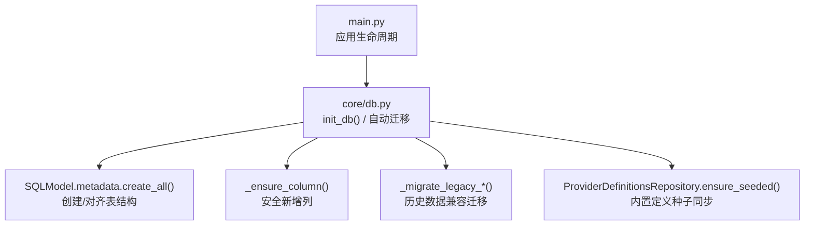
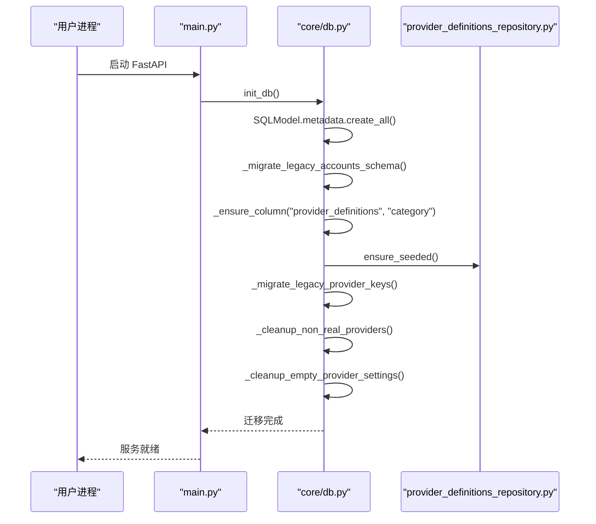
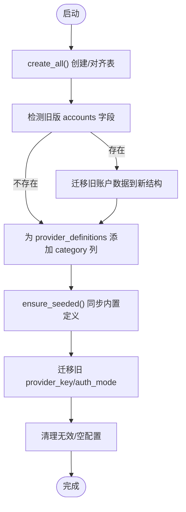
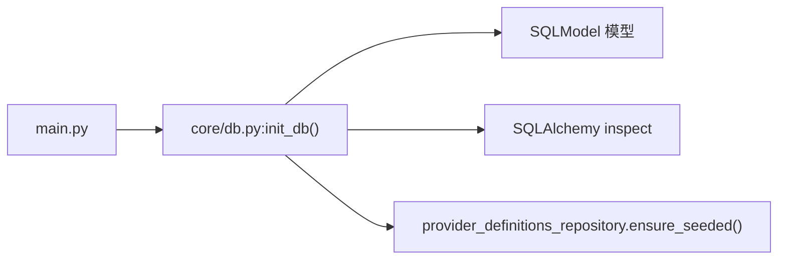

# 数据库迁移管理

<cite>
**本文引用的文件**
- [core/db.py](file://core/db.py)
- [main.py](file://main.py)
- [infrastructure/provider_definitions_repository.py](file://infrastructure/provider_definitions_repository.py)
- [tests/conftest.py](file://tests/conftest.py)
</cite>

## 目录
1. [简介](#简介)
2. [项目结构](#项目结构)
3. [核心组件](#核心组件)
4. [架构总览](#架构总览)
5. [详细组件分析](#详细组件分析)
6. [依赖关系分析](#依赖关系分析)
7. [性能考量](#性能考量)
8. [故障排查指南](#故障排查指南)
9. [结论](#结论)
10. [附录](#附录)

## 简介
本文件面向项目的数据库版本控制与迁移策略，聚焦以下目标：
- 说明自动迁移机制的实现方式（表结构检测、字段添加、数据转换等）
- 描述向后兼容性保证措施（旧版字段映射、数据格式转换等）
- 给出手动迁移脚本的编写规范与执行流程建议
- 提供数据备份与恢复策略（增量/全量）
- 说明生产环境部署时的升级流程与回滚机制
- 提供迁移故障排查与修复指南
- 说明多环境数据库同步的最佳实践
- 包含迁移测试与质量保证措施

本项目采用 SQLite 作为默认存储，使用 SQLModel 进行模型定义，并在应用启动时执行“自动迁移”逻辑，确保数据库结构与代码模型一致，同时完成历史数据的兼容转换。

## 项目结构
与数据库迁移相关的核心位置如下：
- 模型与迁移入口：core/db.py
- 应用启动时触发迁移：main.py
- 内置 Provider 定义的种子数据与同步：infrastructure/provider_definitions_repository.py
- 测试隔离与临时数据库：tests/conftest.py

图表来源
- [main.py:67-83](file://main.py#L67-L83)
- [core/db.py:430-445](file://core/db.py#L430-L445)
- [core/db.py:448-459](file://core/db.py#L448-L459)
- [core/db.py:363-427](file://core/db.py#L363-L427)
- [infrastructure/provider_definitions_repository.py:387-433](file://infrastructure/provider_definitions_repository.py#L387-L433)

章节来源
- [main.py:67-83](file://main.py#L67-L83)
- [core/db.py:430-445](file://core/db.py#L430-L445)

## 核心组件
- 引擎与连接
  - 通过环境变量或默认路径创建 SQLite 引擎，便于在不同环境切换数据库文件。
- 模型定义
  - 使用 SQLModel 声明所有表结构，作为“期望状态”的权威来源。
- 自动迁移入口
  - 应用启动时调用 init_db()，负责建表、补齐列、清理脏数据、同步种子数据、执行历史兼容迁移。
- 安全加列
  - _ensure_column() 在 SQLite 环境下实现“不存在则添加”的安全语义。
- 历史兼容迁移
  - 针对旧版 accounts 表结构和 provider_key/auth_mode 命名变更，提供数据转换与清洗逻辑。
- 内置 Provider 定义种子
  - ensure_seeded() 将代码中的内置定义写入数据库，并合并用户自定义元数据。

章节来源
- [core/db.py:16-22](file://core/db.py#L16-L22)
- [core/db.py:25-302](file://core/db.py#L25-L302)
- [core/db.py:430-445](file://core/db.py#L430-L445)
- [core/db.py:448-459](file://core/db.py#L448-L459)
- [core/db.py:363-427](file://core/db.py#L363-L427)
- [infrastructure/provider_definitions_repository.py:387-433](file://infrastructure/provider_definitions_repository.py#L387-L433)

## 架构总览
应用启动时，FastAPI 的生命周期钩子会调用 init_db()，随后加载平台与 Provider 注册表，并启动调度器与任务运行时。数据库侧的自动迁移在此阶段完成，确保后续业务逻辑可稳定运行。

图表来源
- [main.py:67-83](file://main.py#L67-L83)
- [core/db.py:430-445](file://core/db.py#L430-L445)
- [infrastructure/provider_definitions_repository.py:387-433](file://infrastructure/provider_definitions_repository.py#L387-L433)

## 详细组件分析

### 自动迁移机制
- 表结构检测与创建
  - 通过 SQLModel.metadata.create_all(engine) 确保所有模型对应的表存在且与模型定义一致。
- 安全新增列
  - _ensure_column() 先检查表是否存在、列是否已存在，再执行 ALTER TABLE ADD COLUMN，避免重复操作。
- 历史数据兼容迁移
  - _migrate_legacy_accounts_schema()：检测旧版 accounts 表是否存在遗留字段；若存在，先将旧数据转换为新的账户图结构，再重建 accounts 表并创建索引。
  - _migrate_legacy_provider_keys()：将旧版 provider_key 和 auth_mode 映射到新版命名，并修正无效值。
- 种子数据同步
  - ProviderDefinitionsRepository().ensure_seeded()：将内置 Provider 定义写入数据库，更新 label/description/fields 等元数据，保留用户自定义 metadata。

图表来源
- [core/db.py:430-445](file://core/db.py#L430-L445)
- [core/db.py:448-459](file://core/db.py#L448-L459)
- [core/db.py:363-427](file://core/db.py#L363-L427)
- [infrastructure/provider_definitions_repository.py:387-433](file://infrastructure/provider_definitions_repository.py#L387-L433)

章节来源
- [core/db.py:430-445](file://core/db.py#L430-L445)
- [core/db.py:448-459](file://core/db.py#L448-L459)
- [core/db.py:363-427](file://core/db.py#L363-L427)
- [infrastructure/provider_definitions_repository.py:387-433](file://infrastructure/provider_definitions_repository.py#L387-L433)

### 向后兼容性保证
- 旧版字段映射
  - 对 legacy accounts 表中的 region/token/status/trial_end_time/cashier_url/extra_json 等字段进行读取与转换，写入新的账户图结构中。
- 旧版键名与认证模式映射
  - 将旧版 provider_key 映射至新版 key，并将无效的 auth_mode 修正为有效值或默认值。
- 数据清洗
  - 清理非真实邮箱的 definition 与空设置，避免干扰前端展示与运行时选择。

章节来源
- [core/db.py:337-344](file://core/db.py#L337-L344)
- [core/db.py:363-427](file://core/db.py#L363-L427)
- [core/db.py:482-599](file://core/db.py#L482-L599)
- [core/db.py:602-630](file://core/db.py#L602-L630)

### 手动迁移脚本编写规范与执行流程（建议）
虽然当前项目采用“启动时自动迁移”，但在复杂场景下仍建议遵循以下规范：
- 幂等性
  - 任何迁移脚本必须可重复执行而不产生副作用（如使用“存在则跳过”的检查）。
- 原子性与事务
  - 使用数据库事务包裹批量变更，失败时整体回滚。
- 可观测性
  - 记录关键步骤日志与影响行数，便于审计与排障。
- 版本化
  - 为每次迁移赋予唯一版本号，避免重复执行与冲突。
- 执行流程建议
  - 开发/测试：在 CI 中执行迁移脚本并验证 API 与用例。
  - 预生产：先在镜像或容器内执行迁移，确认无异常后再发布。
  - 生产：滚动发布或蓝绿发布，配合健康检查与回滚预案。

[本节为通用实践建议，不直接分析具体文件]

### 数据备份与恢复策略
- 全量备份
  - 对于 SQLite，可直接复制数据库文件进行全量备份。建议在低峰期或停机窗口执行。
- 增量备份
  - SQLite 原生不支持 WAL 级别的增量导出，可通过定期快照 + 差异文件的方式模拟增量。
- 恢复流程
  - 停止服务 → 替换数据库文件 → 重启服务 → 校验关键表与计数 → 观察错误日志。
- 注意事项
  - 备份前关闭外键约束检查（如需），恢复后重新开启。
  - 备份文件需加密与权限控制，防止敏感信息泄露。

[本节为通用实践建议，不直接分析具体文件]

### 生产环境部署时的升级流程与回滚机制
- 升级流程
  - 构建新镜像 → 部署新版本 → 应用启动时自动执行 init_db() → 健康检查通过 → 流量切回。
- 回滚机制
  - 若新版本出现严重问题，立即回滚至上一版本镜像，并恢复对应版本的数据库文件（如有必要）。
  - 由于当前迁移多为“向前兼容”（新增列、数据转换），通常具备较好的回滚友好性。
- 风险控制
  - 灰度发布、分批次升级、监控告警、快速回滚预案。

[本节为通用实践建议，不直接分析具体文件]

### 迁移故障排查与修复指南
- 常见问题定位
  - 启动时报错：查看 init_db() 相关日志，确认 create_all() 与迁移函数是否成功。
  - 列重复添加：检查 _ensure_column() 是否被多次调用且未正确判断列存在性。
  - 旧数据丢失：核查 _migrate_legacy_*() 的数据读取与转换逻辑。
- 修复建议
  - 在测试库上复现问题，逐步缩小范围。
  - 必要时手工执行 SQL 修复（谨慎操作，务必先备份）。
  - 增加更细粒度的日志输出，便于追踪迁移过程。

章节来源
- [core/db.py:430-445](file://core/db.py#L430-L445)
- [core/db.py:448-459](file://core/db.py#L448-L459)
- [core/db.py:363-427](file://core/db.py#L363-L427)

### 多环境数据库同步最佳实践
- 环境隔离
  - 不同环境使用不同的 DATABASE_URL，避免互相污染。
- 结构一致性
  - 以代码中的 SQLModel 模型为准，确保各环境均通过 create_all() 对齐结构。
- 种子数据
  - 使用 ensure_seeded() 保证内置定义在各环境一致，用户自定义数据由运维导入。
- 数据同步
  - 仅同步必要的参考数据（如 Provider 定义），业务数据按环境独立。
- 验证
  - 部署后执行健康检查与关键查询，确认结构、种子数据与业务可用性。

章节来源
- [core/db.py:16-22](file://core/db.py#L16-L22)
- [infrastructure/provider_definitions_repository.py:387-433](file://infrastructure/provider_definitions_repository.py#L387-L433)

### 迁移测试与质量保证
- 测试隔离
  - 使用独立的临时 SQLite 文件，避免影响本地或 CI 的真实数据库。
- 重置策略
  - 每个测试前后 drop_all() 并 recreate_all()，确保完全隔离。
- 覆盖范围
  - 覆盖自动迁移、字段新增、历史数据兼容、种子数据同步等关键路径。
- 持续集成
  - 在 CI 中执行迁移与测试，确保每次提交都验证数据库变更的正确性。

章节来源
- [tests/conftest.py:1-56](file://tests/conftest.py#L1-L56)

## 依赖关系分析
- main.py 在应用生命周期中调用 core/db.init_db()，从而触发自动迁移。
- core/db.py 依赖 SQLModel 的元数据与 SQLAlchemy 的 inspect 能力，用于表结构检测与安全加列。
- infrastructure/provider_definitions_repository.py 提供内置 Provider 定义的种子数据，并在启动时同步到数据库。

图表来源
- [main.py:67-83](file://main.py#L67-L83)
- [core/db.py:430-445](file://core/db.py#L430-L445)
- [infrastructure/provider_definitions_repository.py:387-433](file://infrastructure/provider_definitions_repository.py#L387-L433)

章节来源
- [main.py:67-83](file://main.py#L67-L83)
- [core/db.py:430-445](file://core/db.py#L430-L445)
- [infrastructure/provider_definitions_repository.py:387-433](file://infrastructure/provider_definitions_repository.py#L387-L433)

## 性能考量
- 启动时迁移
  - create_all() 与迁移逻辑在应用启动时执行，可能带来短暂延迟。建议在冷启动后进行健康检查。
- 大表迁移
  - 历史数据迁移应分批处理，避免长时间锁表与内存占用过高。
- 索引优化
  - 迁移过程中按需创建索引，提升查询性能。
- 并发访问
  - SQLite 并发有限，生产环境建议使用只读副本或考虑迁移至支持高并发的数据库。

[本节为通用实践建议，不直接分析具体文件]

## 故障排查指南
- 启动失败
  - 检查环境变量 DATABASE_URL 是否正确指向目标数据库。
  - 查看 init_db() 日志，确认 create_all() 与迁移函数是否抛出异常。
- 列重复或缺失
  - 检查 _ensure_column() 的判断逻辑，确保不会重复添加列。
- 数据不一致
  - 核查 _migrate_legacy_*() 的数据读取与转换逻辑，必要时手工修复。
- 种子数据未生效
  - 确认 ensure_seeded() 是否被调用，以及用户自定义 metadata 是否被覆盖。

章节来源
- [core/db.py:16-22](file://core/db.py#L16-L22)
- [core/db.py:430-445](file://core/db.py#L430-L445)
- [core/db.py:448-459](file://core/db.py#L448-L459)
- [core/db.py:363-427](file://core/db.py#L363-L427)
- [infrastructure/provider_definitions_repository.py:387-433](file://infrastructure/provider_definitions_repository.py#L387-L433)

## 结论
本项目通过“启动时自动迁移”的方式，结合 SQLModel 的模型驱动与 SQLite 的安全加列能力，实现了稳定的数据库版本控制与向后兼容。历史数据迁移与种子数据同步确保了系统升级过程中的平滑过渡。建议在生产环境中配合备份、灰度发布与健康检查，进一步提升可靠性与可维护性。

[本节为总结性内容，不直接分析具体文件]

## 附录
- 关键函数与路径
  - 自动迁移入口：core/db.py 中的 init_db()
  - 安全加列：core/db.py 中的 _ensure_column()
  - 历史兼容迁移：core/db.py 中的 _migrate_legacy_accounts_schema() 与 _migrate_legacy_provider_keys()
  - 种子数据同步：infrastructure/provider_definitions_repository.py 中的 ensure_seeded()
  - 应用启动：main.py 中的 lifespan 钩子

章节来源
- [core/db.py:430-445](file://core/db.py#L430-L445)
- [core/db.py:448-459](file://core/db.py#L448-L459)
- [core/db.py:363-427](file://core/db.py#L363-L427)
- [infrastructure/provider_definitions_repository.py:387-433](file://infrastructure/provider_definitions_repository.py#L387-L433)
- [main.py:67-83](file://main.py#L67-L83)