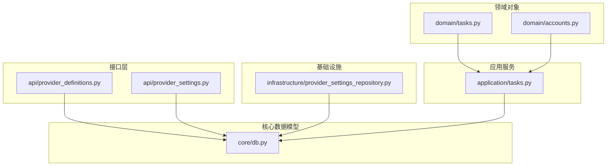
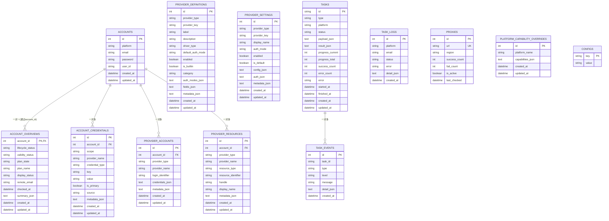
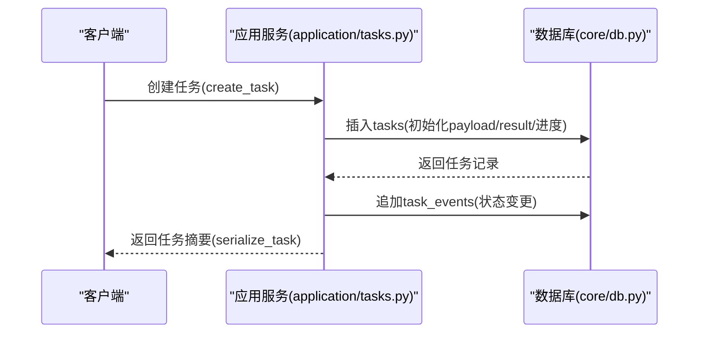

# 数据模型定义

<cite>
**本文引用的文件**
- [core/db.py](file://core/db.py)
- [domain/tasks.py](file://domain/tasks.py)
- [domain/accounts.py](file://domain/accounts.py)
- [application/tasks.py](file://application/tasks.py)
- [infrastructure/provider_settings_repository.py](file://infrastructure/provider_settings_repository.py)
- [api/provider_definitions.py](file://api/provider_definitions.py)
- [api/provider_settings.py](file://api/provider_settings.py)
</cite>

## 目录
1. [简介](#简介)
2. [项目结构](#项目结构)
3. [核心组件](#核心组件)
4. [架构总览](#架构总览)
5. [详细组件分析](#详细组件分析)
6. [依赖关系分析](#依赖关系分析)
7. [性能考虑](#性能考虑)
8. [故障排查指南](#故障排查指南)
9. [结论](#结论)
10. [附录：表结构与数据字典](#附录表结构与数据字典)

## 简介
本文件面向系统的数据层，聚焦于核心数据实体与表结构的完整说明。重点覆盖以下关键模型：AccountModel（账户）、TaskModel（任务）、ProviderDefinitionModel（提供商定义）、ProviderSettingModel（提供商设置），并补充账户概览、凭证、资源、任务日志/事件、代理、平台能力覆盖等辅助表。文档包含字段定义、数据类型、约束与索引、外键关系、JSON 字段的存储策略与使用模式、数据验证规则与业务约束，并提供完整的表结构图和数据字典。

## 项目结构
数据模型集中在 core/db.py，通过 SQLModel 声明式建模；领域对象在 domain/* 中用于应用层传输与校验；API 层在 api/* 中定义请求体；基础设施层在 infrastructure/* 中提供仓库访问。任务执行与序列化逻辑位于 application/tasks.py。

图表来源
- [core/db.py:25-288](file://core/db.py#L25-L288)
- [domain/tasks.py:8-44](file://domain/tasks.py#L8-L44)
- [domain/accounts.py:8-100](file://domain/accounts.py#L8-L100)
- [application/tasks.py:129-198](file://application/tasks.py#L129-L198)
- [api/provider_definitions.py:12-21](file://api/provider_definitions.py#L12-L21)
- [api/provider_settings.py:12-22](file://api/provider_settings.py#L12-L22)
- [infrastructure/provider_settings_repository.py:15-37](file://infrastructure/provider_settings_repository.py#L15-L37)

章节来源
- [core/db.py:25-288](file://core/db.py#L25-L288)
- [domain/tasks.py:8-44](file://domain/tasks.py#L8-L44)
- [domain/accounts.py:8-100](file://domain/accounts.py#L8-L100)
- [application/tasks.py:129-198](file://application/tasks.py#L129-L198)
- [api/provider_definitions.py:12-21](file://api/provider_definitions.py#L12-L21)
- [api/provider_settings.py:12-22](file://api/provider_settings.py#L12-L22)
- [infrastructure/provider_settings_repository.py:15-37](file://infrastructure/provider_settings_repository.py#L15-L37)

## 核心组件
本节概述各核心表的职责与关键字段，后续章节展开细节。

- 账户相关
  - accounts：基础账户信息（平台、邮箱、密码、用户ID）
  - account_overviews：账户生命周期、有效性、套餐状态及摘要 JSON
  - account_credentials：账户凭据（按作用域、提供方、类型、键值管理）
  - provider_accounts：账户关联的第三方提供方账号
  - provider_resources：账户关联的第三方提供方资源

- 提供商配置
  - provider_definitions：提供方定义（类型、键、标签、驱动族、认证模式、字段定义、元数据）
  - provider_settings：提供方具体实例设置（显示名、认证模式、启用/默认标记、配置/认证/元数据 JSON）

- 任务与日志
  - tasks：任务主记录（类型、平台、状态、负载 JSON、结果 JSON、进度、计数、错误、时间戳）
  - task_events：任务事件流（类型、级别、消息、详情 JSON）
  - task_logs：任务执行日志（平台、邮箱、状态、错误、详情 JSON）

- 其他
  - proxies：代理地址与统计
  - platform_capability_overrides：平台能力覆盖（能力列表 JSON）
  - configs：全局键值配置

章节来源
- [core/db.py:25-301](file://core/db.py#L25-L301)

## 架构总览
下图展示核心表之间的关联关系与主要索引设计。

图表来源
- [core/db.py:25-301](file://core/db.py#L25-L301)

章节来源
- [core/db.py:25-301](file://core/db.py#L25-L301)

## 详细组件分析

### AccountModel（账户模型）
- 表名：accounts
- 主键：id（自增整数）
- 字段
  - platform：字符串，索引
  - email：字符串，索引
  - password：字符串（必填）
  - user_id：字符串，默认空
  - created_at / updated_at：UTC 时间戳，自动填充
- 约束与索引
  - 唯一性：无显式唯一约束（建议业务层保证 platform+email 唯一）
  - 索引：platform、email
- 关联
  - 被 account_overviews、account_credentials、provider_accounts、provider_resources 通过 account_id 外键引用
- 业务语义
  - 表示一个平台上的登录账户，包含基本身份信息与时间戳

章节来源
- [core/db.py:25-34](file://core/db.py#L25-L34)

### AccountOverviewModel（账户概览）
- 表名：account_overviews
- 主键：account_id（同时为外键，指向 accounts.id）
- 字段
  - lifecycle_status：字符串，默认 registered，索引
  - validity_status：字符串，默认 unknown，索引
  - plan_state：字符串，默认 unknown，索引
  - plan_name：字符串，默认空
  - display_status：字符串，默认 registered，索引
  - remote_email：字符串，默认空
  - checked_at：可空时间戳
  - summary_json：文本，默认 {}，用于存储动态摘要
  - created_at / updated_at：UTC 时间戳
- 约束与索引
  - 外键：account_id -> accounts.id
  - 索引：lifecycle_status、validity_status、display_status
- JSON 字段
  - summary_json：通过 get_summary/set_summary 进行序列化和反序列化，确保空对象兜底
- 业务语义
  - 描述账户的生命周期、有效性、套餐状态以及可扩展的摘要信息

章节来源
- [core/db.py:37-56](file://core/db.py#L37-L56)

### AccountCredentialModel（账户凭据）
- 表名：account_credentials
- 主键：id
- 字段
  - account_id：整型，索引，外键指向 accounts.id
  - scope：字符串，默认 platform，索引
  - provider_name：字符串，索引
  - credential_type：字符串，默认 secret，索引
  - key：字符串，索引
  - value：字符串
  - is_primary：布尔，默认 False
  - source：字符串，默认空
  - metadata_json：文本，默认 {}
  - created_at / updated_at：UTC 时间戳
- 约束与索引
  - 外键：account_id -> accounts.id
  - 索引：account_id、scope、provider_name、credential_type、key
- JSON 字段
  - metadata_json：通过 get_metadata/set_metadata 安全读写
- 业务语义
  - 以细粒度方式管理账户在不同作用域下的凭据，支持多种类型和来源

章节来源
- [core/db.py:59-79](file://core/db.py#L59-L79)

### ProviderAccountModel（提供方账号）
- 表名：provider_accounts
- 主键：id
- 字段
  - account_id：整型，索引，外键指向 accounts.id
  - provider_type：字符串，默认 mailbox，索引
  - provider_name：字符串，索引
  - login_identifier：字符串，索引
  - credentials_json：文本，默认 {}
  - metadata_json：文本，默认 {}
  - created_at / updated_at：UTC 时间戳
- 约束与索引
  - 外键：account_id -> accounts.id
  - 索引：account_id、provider_type、provider_name、login_identifier
- JSON 字段
  - credentials_json、metadata_json：通过 get_credentials/get_metadata 与 set_* 方法安全读写
- 业务语义
  - 将平台账户与第三方提供方账号建立映射，并保存其凭据与元数据

章节来源
- [core/db.py:82-106](file://core/db.py#L82-L106)

### ProviderResourceModel（提供方资源）
- 表名：provider_resources
- 主键：id
- 字段
  - account_id：整型，索引，外键指向 accounts.id
  - provider_type：字符串，默认 mailbox，索引
  - provider_name：字符串，索引
  - resource_type：字符串，默认 resource，索引
  - resource_identifier：字符串，索引
  - handle：字符串
  - display_name：字符串
  - metadata_json：文本，默认 {}
  - created_at / updated_at：UTC 时间戳
- 约束与索引
  - 外键：account_id -> accounts.id
  - 索引：account_id、provider_type、provider_name、resource_type、resource_identifier
- JSON 字段
  - metadata_json：通过 get_metadata/set_metadata 安全读写
- 业务语义
  - 记录账户在第三方提供方中的资源（如邮箱别名、短信号等）

章节来源
- [core/db.py:109-128](file://core/db.py#L109-L128)

### ProviderDefinitionModel（提供商定义）
- 表名：provider_definitions
- 主键：id
- 字段
  - provider_type：字符串，索引
  - provider_key：字符串，索引
  - label：字符串，默认空
  - description：字符串，默认空
  - driver_type：字符串，默认空
  - default_auth_mode：字符串，默认空
  - enabled：布尔，默认 True
  - is_builtin：布尔，默认 False
  - category：字符串，默认空（枚举含义见注释）
  - auth_modes_json：文本，默认 []
  - fields_json：文本，默认 []
  - metadata_json：文本，默认 {}
  - created_at / updated_at：UTC 时间戳
- 约束与索引
  - 唯一约束：(provider_type, provider_key)
  - 索引：provider_type、provider_key
- JSON 字段
  - auth_modes_json、fields_json、metadata_json：通过 get_* / set_* 方法安全读写
- 业务语义
  - 定义某类提供方（如邮箱、短信、验证码）的配置模板与可用认证模式

章节来源
- [core/db.py:131-169](file://core/db.py#L131-L169)

### ProviderSettingModel（提供商设置）
- 表名：provider_settings
- 主键：id
- 字段
  - provider_type：字符串，索引
  - provider_key：字符串，索引
  - display_name：字符串，默认空
  - auth_mode：字符串，默认空
  - enabled：布尔，默认 True
  - is_default：布尔，默认 False
  - config_json：文本，默认 {}
  - auth_json：文本，默认 {}
  - metadata_json：文本，默认 {}
  - created_at / updated_at：UTC 时间戳
- 约束与索引
  - 唯一约束：(provider_type, provider_key)
  - 索引：provider_type、provider_key
- JSON 字段
  - config_json、auth_json、metadata_json：通过 get_* / set_* 方法安全读写
- 业务语义
  - 针对某个 provider 的具体实例化配置与认证信息，支持启用/默认标记

章节来源
- [core/db.py:172-207](file://core/db.py#L172-L207)

### TaskModel（任务模型）
- 表名：tasks
- 主键：id（字符串，由应用生成）
- 字段
  - type：字符串，索引
  - platform：字符串，默认空，索引
  - status：字符串，默认 pending，索引
  - payload_json：文本，默认 {}
  - result_json：文本，默认 {}
  - progress_current / progress_total：整型，默认 0
  - success_count / error_count：整型，默认 0
  - error：字符串，默认空
  - started_at / finished_at：可空时间戳
  - created_at / updated_at：UTC 时间戳
- 约束与索引
  - 索引：type、platform、status
- JSON 字段
  - payload_json：任务输入负载，通过 get_payload/set_payload 读写
  - result_json：任务输出结果，通过 get_result/set_result 读写
- 业务语义
  - 承载异步任务的创建、执行、进度与结果，配合 task_events 实现事件溯源

章节来源
- [core/db.py:241-270](file://core/db.py#L241-L270)

### TaskEventModel（任务事件）
- 表名：task_events
- 主键：id
- 字段
  - task_id：字符串，索引
  - type：字符串，默认 log，索引
  - level：字符串，默认 info
  - message：字符串，默认空
  - detail_json：文本，默认 {}
  - created_at：UTC 时间戳
- 约束与索引
  - 索引：task_id、type
- JSON 字段
  - detail_json：通过 get_detail/set_detail 安全读写
- 业务语义
  - 记录任务运行过程中的事件与日志，便于追踪与回放

章节来源
- [core/db.py:273-288](file://core/db.py#L273-L288)

### TaskLog（任务日志）
- 表名：task_logs
- 主键：id
- 字段
  - platform：字符串（必填）
  - email：字符串（必填）
  - status：字符串（success | failed）
  - error：字符串，默认空
  - detail_json：文本，默认 {}
  - created_at：UTC 时间戳
- 约束与索引
  - 无显式索引（可按需添加）
- JSON 字段
  - detail_json：结构化详情
- 业务语义
  - 记录任务执行结果与错误，常用于审计与统计

章节来源
- [core/db.py:229-238](file://core/db.py#L229-L238)

### ProxyModel（代理）
- 表名：proxies
- 主键：id
- 字段
  - url：字符串，唯一
  - region：字符串，默认空
  - success_count / fail_count：整型，默认 0
  - is_active：布尔，默认 True
  - last_checked：可空时间戳
- 约束与索引
  - 唯一约束：url
- 业务语义
  - 维护代理池及其健康度统计

章节来源
- [core/db.py:291-301](file://core/db.py#L291-L301)

### PlatformCapabilityOverrideModel（平台能力覆盖）
- 表名：platform_capability_overrides
- 主键：id
- 字段
  - platform_name：字符串，索引
  - capabilities_json：文本，默认 {}
  - created_at / updated_at：UTC 时间戳
- 约束与索引
  - 唯一约束：platform_name
  - 索引：platform_name
- JSON 字段
  - capabilities_json：通过 get_capabilities/set_capabilities 安全读写
- 业务语义
  - 对平台能力清单进行运行时覆盖，支持扩展点

章节来源
- [core/db.py:210-226](file://core/db.py#L210-L226)

### ConfigItem（全局配置）
- 表名：configs
- 主键：key
- 字段
  - value：字符串，默认空
- 业务语义
  - 简单键值配置存储

章节来源
- [core/config_store.py:7-11](file://core/config_store.py#L7-L11)

## 依赖关系分析
- 账户体系
  - accounts 是中心实体，被 account_overviews、account_credentials、provider_accounts、provider_resources 引用
  - 这些子表通过 account_id 外键与 accounts 形成强一致性关系
- 提供商体系
  - provider_definitions 与 provider_settings 通过 (provider_type, provider_key) 唯一约束保持一一对应
  - 设置项可引用定义的认证模式与字段定义，但数据库层未强制外键，依赖应用层校验
- 任务体系
  - tasks 与 task_events 通过 task_id 关联，形成一对多事件流
  - task_logs 独立记录执行结果，不直接关联 tasks（可通过 platform/email 间接关联）
- 索引与查询优化
  - 高频查询字段均建索引：accounts.platform/email、overviews.lifecycle_status/validity_status/display_status、tasks.type/platform/status、provider_definitions/settings 的 provider_type/provider_key 等
- 迁移与清理
  - 启动时执行 schema 迁移与数据清洗（如旧列迁移、空设置清理、非真实提供方清理）

章节来源
- [core/db.py:337-445](file://core/db.py#L337-L445)
- [core/db.py:462-630](file://core/db.py#L462-L630)

## 性能考虑
- JSON 字段
  - 所有 JSON 字段均以 TEXT 存储，读取时通过 get_* 方法解析，写入时通过 set_* 方法序列化，统一使用 ensure_ascii=False 以保持中文可读性
  - 建议在应用层对 JSON 结构做最小化与必要校验，避免过大负载影响 I/O
- 索引策略
  - 对常用过滤字段建立索引（如 platform、email、status、provider_type、provider_key）
  - 复合索引可根据实际查询模式补充（例如 tasks 的 platform+status）
- 事务与并发
  - 使用 Session 包裹写操作，确保原子性；长事务应避免
- 迁移成本
  - 启动时执行迁移与清理，注意在大库上可能带来短暂锁或 IO 压力，建议在低峰期执行

[本节为通用指导，无需特定文件引用]

## 故障排查指南
- JSON 解析异常
  - 现象：get_* 抛出异常或返回空对象
  - 处理：set_* 方法已做空值兜底；若出现脏数据，可在迁移脚本中修复
- 唯一约束冲突
  - 现象：插入 provider_definitions/settings 时报唯一约束冲突
  - 处理：检查 (provider_type, provider_key) 是否重复；必要时先删除旧记录再插入
- 外键约束失败
  - 现象：插入 account_overviews/account_credentials 等报外键错误
  - 处理：确认 accounts 记录存在；或在迁移前禁用外键检查（仅临时）
- 任务状态不一致
  - 现象：tasks.status 与 task_events 不一致
  - 处理：通过 task_id 拉取事件流核对；必要时根据事件重放修正状态

章节来源
- [core/db.py:347-352](file://core/db.py#L347-L352)
- [core/db.py:401-427](file://core/db.py#L401-L427)
- [core/db.py:462-630](file://core/db.py#L462-L630)

## 结论
本数据模型以 SQLite + SQLModel 为基础，围绕账户、提供商、任务三大核心域构建。通过 JSON 字段实现灵活扩展，结合索引与唯一约束保障查询性能与数据一致性。应用层通过 Repository 与服务层封装 CRUD 与序列化逻辑，API 层暴露稳定接口。整体设计兼顾扩展性与可维护性，适合快速迭代与多平台接入场景。

[本节为总结性内容，无需特定文件引用]

## 附录：表结构与数据字典

### 表结构图（ER）
参见“架构总览”中的 ER 图。

### 数据字典（核心表）

- accounts
  - id：整数，主键，自增
  - platform：字符串，索引，必填
  - email：字符串，索引，必填
  - password：字符串，必填
  - user_id：字符串，默认空
  - created_at / updated_at：UTC 时间戳，自动填充

- account_overviews
  - account_id：整数，主键+外键，指向 accounts.id
  - lifecycle_status：字符串，默认 registered，索引
  - validity_status：字符串，默认 unknown，索引
  - plan_state：字符串，默认 unknown，索引
  - plan_name：字符串，默认空
  - display_status：字符串，默认 registered，索引
  - remote_email：字符串，默认空
  - checked_at：可空时间戳
  - summary_json：文本，默认 {}，动态摘要
  - created_at / updated_at：UTC 时间戳

- account_credentials
  - id：整数，主键
  - account_id：整数，索引+外键，指向 accounts.id
  - scope：字符串，默认 platform，索引
  - provider_name：字符串，索引
  - credential_type：字符串，默认 secret，索引
  - key：字符串，索引
  - value：字符串
  - is_primary：布尔，默认 False
  - source：字符串，默认空
  - metadata_json：文本，默认 {}
  - created_at / updated_at：UTC 时间戳

- provider_accounts
  - id：整数，主键
  - account_id：整数，索引+外键，指向 accounts.id
  - provider_type：字符串，默认 mailbox，索引
  - provider_name：字符串，索引
  - login_identifier：字符串，索引
  - credentials_json：文本，默认 {}
  - metadata_json：文本，默认 {}
  - created_at / updated_at：UTC 时间戳

- provider_resources
  - id：整数，主键
  - account_id：整数，索引+外键，指向 accounts.id
  - provider_type：字符串，默认 mailbox，索引
  - provider_name：字符串，索引
  - resource_type：字符串，默认 resource，索引
  - resource_identifier：字符串，索引
  - handle：字符串
  - display_name：字符串
  - metadata_json：文本，默认 {}
  - created_at / updated_at：UTC 时间戳

- provider_definitions
  - id：整数，主键
  - provider_type：字符串，索引
  - provider_key：字符串，索引
  - label：字符串，默认空
  - description：字符串，默认空
  - driver_type：字符串，默认空
  - default_auth_mode：字符串，默认空
  - enabled：布尔，默认 True
  - is_builtin：布尔，默认 False
  - category：字符串，默认空
  - auth_modes_json：文本，默认 []
  - fields_json：文本，默认 []
  - metadata_json：文本，默认 {}
  - created_at / updated_at：UTC 时间戳
  - 唯一约束：(provider_type, provider_key)

- provider_settings
  - id：整数，主键
  - provider_type：字符串，索引
  - provider_key：字符串，索引
  - display_name：字符串，默认空
  - auth_mode：字符串，默认空
  - enabled：布尔，默认 True
  - is_default：布尔，默认 False
  - config_json：文本，默认 {}
  - auth_json：文本，默认 {}
  - metadata_json：文本，默认 {}
  - created_at / updated_at：UTC 时间戳
  - 唯一约束：(provider_type, provider_key)

- tasks
  - id：字符串，主键
  - type：字符串，索引
  - platform：字符串，默认空，索引
  - status：字符串，默认 pending，索引
  - payload_json：文本，默认 {}
  - result_json：文本，默认 {}
  - progress_current / progress_total：整数，默认 0
  - success_count / error_count：整数，默认 0
  - error：字符串，默认空
  - started_at / finished_at：可空时间戳
  - created_at / updated_at：UTC 时间戳

- task_events
  - id：整数，主键
  - task_id：字符串，索引
  - type：字符串，默认 log，索引
  - level：字符串，默认 info
  - message：字符串，默认空
  - detail_json：文本，默认 {}
  - created_at：UTC 时间戳

- task_logs
  - id：整数，主键
  - platform：字符串，必填
  - email：字符串，必填
  - status：字符串（success | failed）
  - error：字符串，默认空
  - detail_json：文本，默认 {}
  - created_at：UTC 时间戳

- proxies
  - id：整数，主键
  - url：字符串，唯一
  - region：字符串，默认空
  - success_count / fail_count：整数，默认 0
  - is_active：布尔，默认 True
  - last_checked：可空时间戳

- platform_capability_overrides
  - id：整数，主键
  - platform_name：字符串，索引
  - capabilities_json：文本，默认 {}
  - created_at / updated_at：UTC 时间戳
  - 唯一约束：platform_name

- configs
  - key：字符串，主键
  - value：字符串，默认空

章节来源
- [core/db.py:25-301](file://core/db.py#L25-L301)
- [core/config_store.py:7-11](file://core/config_store.py#L7-L11)

### JSON 字段存储策略与使用模式
- 存储格式
  - 所有 JSON 字段以 TEXT 存储，使用 json.dumps(data or {}, ensure_ascii=False) 序列化
  - 读取时使用 json.loads(value or "{}") 反序列化，并保证返回空对象兜底
- 典型字段
  - summary_json：账户概览的动态摘要（如套餐、状态、扩展信息）
  - payload_json / result_json：任务输入/输出负载
  - detail_json：任务事件与日志的结构化详情
  - credentials_json / metadata_json：提供方账号/资源的凭据与元数据
  - auth_modes_json / fields_json：提供商定义的认证模式与表单字段定义
  - capabilities_json：平台能力覆盖
- 使用模式
  - 通过模型提供的 get_* / set_* 方法读写，避免直接操作底层字符串
  - 在应用层对 JSON 结构进行校验与版本兼容处理

章节来源
- [core/db.py:52-56](file://core/db.py#L52-L56)
- [core/db.py:75-79](file://core/db.py#L75-L79)
- [core/db.py:96-106](file://core/db.py#L96-L106)
- [core/db.py:124-128](file://core/db.py#L124-L128)
- [core/db.py:153-169](file://core/db.py#L153-L169)
- [core/db.py:191-207](file://core/db.py#L191-L207)
- [core/db.py:260-270](file://core/db.py#L260-L270)
- [core/db.py:284-288](file://core/db.py#L284-L288)
- [core/db.py:222-226](file://core/db.py#L222-L226)

### 数据验证规则与业务约束
- 唯一性
  - provider_definitions 与 provider_settings：(provider_type, provider_key) 唯一
  - proxies：url 唯一
  - platform_capability_overrides：platform_name 唯一
- 必填与默认值
  - accounts：platform、email、password 必填
  - tasks：id、type、status 有默认值；payload/result JSON 默认空对象
  - provider_definitions/settings：enabled 默认 True，is_default 默认 False
- 状态机与枚举
  - tasks.status：pending（默认）、running、completed、failed 等（由应用层控制）
  - task_logs.status：success | failed
  - provider_definitions.category：free | selfhost | custom（约定）
- 外键约束
  - account_overviews、account_credentials、provider_accounts、provider_resources：account_id 外键指向 accounts.id
  - task_events：task_id 索引关联 tasks（数据库层未强制外键，应用层保证一致）
- 应用层校验
  - API 请求体在 FastAPI 中使用 Pydantic 模型校验（如 provider_definitions/settings 的 upsert 请求）
  - 领域对象在 domain/* 中以 dataclass 表达，限制字段类型与默认值

章节来源
- [core/db.py:131-176](file://core/db.py#L131-L176)
- [core/db.py:229-248](file://core/db.py#L229-L248)
- [core/db.py:291-301](file://core/db.py#L291-L301)
- [api/provider_definitions.py:12-21](file://api/provider_definitions.py#L12-L21)
- [api/provider_settings.py:12-22](file://api/provider_settings.py#L12-L22)

### 任务创建与序列化流程（示例）

图表来源
- [application/tasks.py:174-198](file://application/tasks.py#L174-L198)
- [core/db.py:241-270](file://core/db.py#L241-L270)

章节来源
- [application/tasks.py:129-198](file://application/tasks.py#L129-L198)
- [core/db.py:241-270](file://core/db.py#L241-L270)