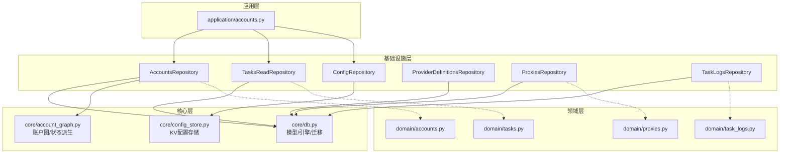
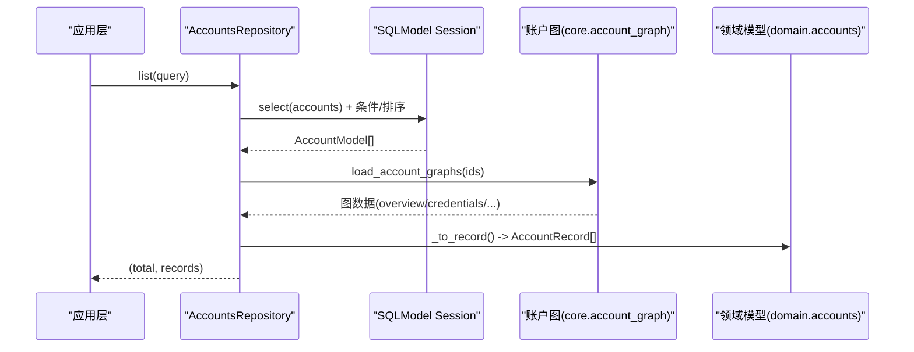
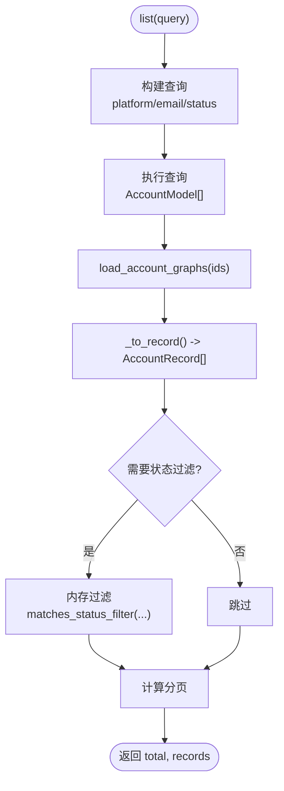
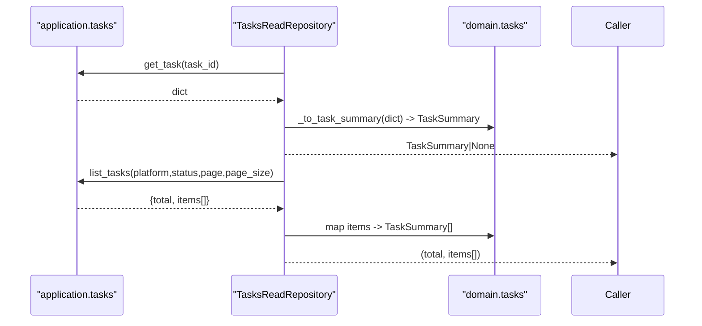
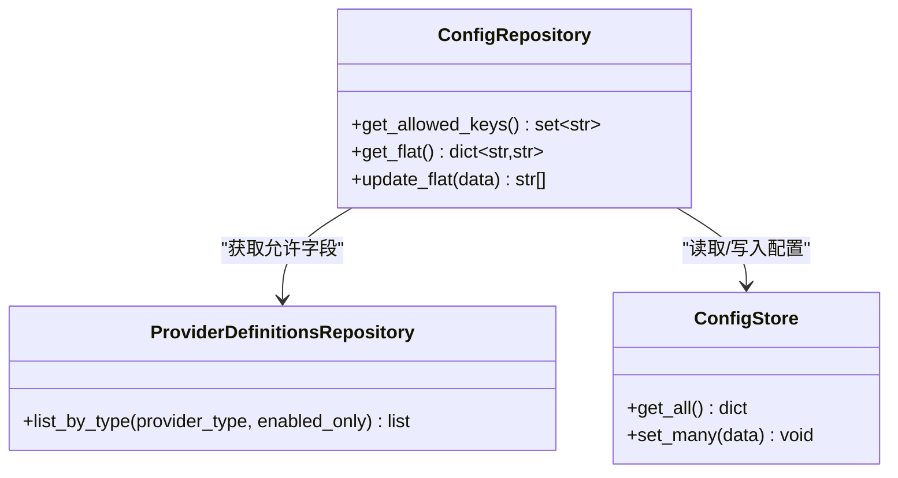
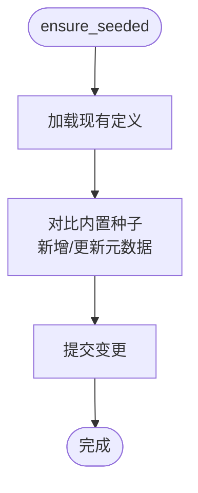
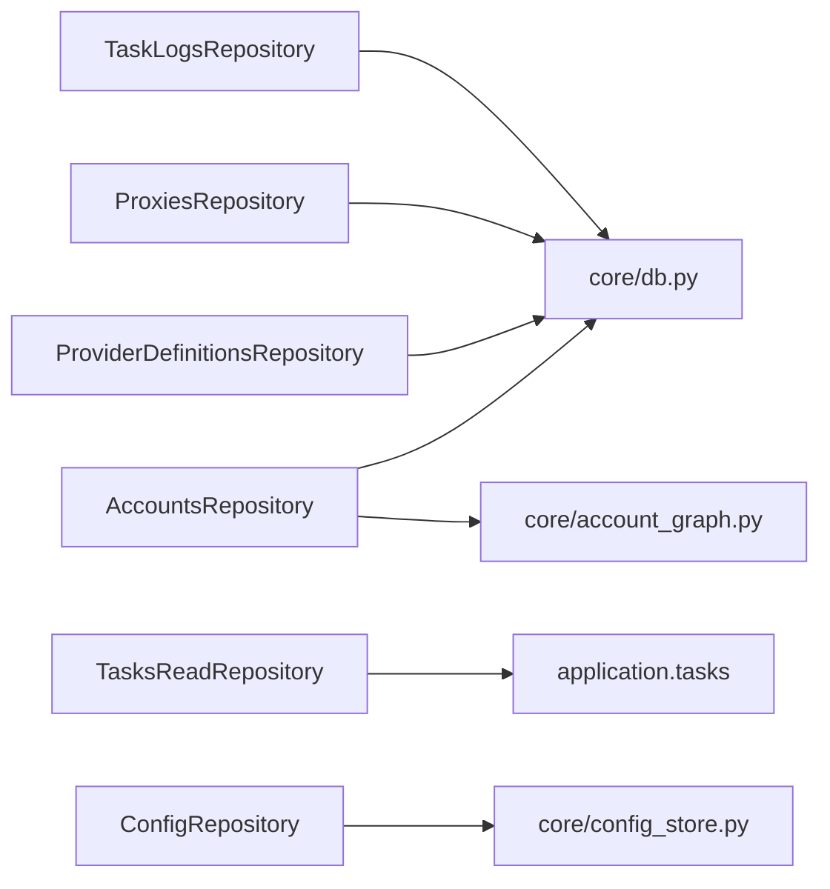

# 数据访问层设计

<cite>
**本文引用的文件**
- [core/db.py](file://core/db.py)
- [infrastructure/accounts_repository.py](file://infrastructure/accounts_repository.py)
- [infrastructure/tasks_read_repository.py](file://infrastructure/tasks_read_repository.py)
- [infrastructure/config_repository.py](file://infrastructure/config_repository.py)
- [infrastructure/provider_definitions_repository.py](file://infrastructure/provider_definitions_repository.py)
- [infrastructure/proxies_repository.py](file://infrastructure/proxies_repository.py)
- [infrastructure/task_logs_repository.py](file://infrastructure/task_logs_repository.py)
- [domain/accounts.py](file://domain/accounts.py)
- [domain/tasks.py](file://domain/tasks.py)
- [domain/proxies.py](file://domain/proxies.py)
- [domain/task_logs.py](file://domain/task_logs.py)
- [core/account_graph.py](file://core/account_graph.py)
- [core/config_store.py](file://core/config_store.py)
- [application/accounts.py](file://application/accounts.py)
</cite>

## 目录
1. [简介](#简介)
2. [项目结构](#项目结构)
3. [核心组件](#核心组件)
4. [架构总览](#架构总览)
5. [详细组件分析](#详细组件分析)
6. [依赖关系分析](#依赖关系分析)
7. [性能考虑](#性能考虑)
8. [故障排查指南](#故障排查指南)
9. [结论](#结论)
10. [附录](#附录)

## 简介
本设计文档聚焦于项目的数据访问层，围绕 Repository 模式在账户、任务、配置、代理、任务日志等域中的实现与职责边界展开。文档说明抽象接口与具体实现的对应关系、查询优化策略（索引、分页、批量）、事务管理与一致性保证、审计与版本控制、迁移与备份恢复方案，以及性能监控与慢查询分析方法，并提供常见数据访问模式与最佳实践指导。

## 项目结构
数据访问层采用分层组织：
- 领域模型（domain）：定义跨层的数据契约（如 AccountRecord、TaskSummary、ProxyRecord）。
- 基础设施（infrastructure）：Repository 实现，封装 SQLModel/SQLAlchemy 的数据库访问逻辑。
- 核心库（core）：数据库引擎、模型定义、配置存储、账户图（account graph）等共享能力。
- 应用层（application）：编排业务用例，调用 Repository 完成用例级流程。

图表来源
- [application/accounts.py:42-160](file://application/accounts.py#L42-L160)
- [infrastructure/accounts_repository.py:98-392](file://infrastructure/accounts_repository.py#L98-L392)
- [infrastructure/tasks_read_repository.py:46-57](file://infrastructure/tasks_read_repository.py#L46-L57)
- [infrastructure/config_repository.py:7-44](file://infrastructure/config_repository.py#L7-L44)
- [infrastructure/provider_definitions_repository.py:387-561](file://infrastructure/provider_definitions_repository.py#L387-L561)
- [infrastructure/proxies_repository.py:21-72](file://infrastructure/proxies_repository.py#L21-L72)
- [infrastructure/task_logs_repository.py:27-41](file://infrastructure/task_logs_repository.py#L27-L41)
- [core/db.py:25-290](file://core/db.py#L25-L290)
- [core/account_graph.py:1-200](file://core/account_graph.py#L1-L200)
- [core/config_store.py:7-49](file://core/config_store.py#L7-L49)

章节来源
- [core/db.py:25-290](file://core/db.py#L25-L290)
- [core/config_store.py:7-49](file://core/config_store.py#L7-L49)
- [infrastructure/accounts_repository.py:98-392](file://infrastructure/accounts_repository.py#L98-L392)
- [infrastructure/tasks_read_repository.py:46-57](file://infrastructure/tasks_read_repository.py#L46-L57)
- [infrastructure/config_repository.py:7-44](file://infrastructure/config_repository.py#L7-L44)
- [infrastructure/provider_definitions_repository.py:387-561](file://infrastructure/provider_definitions_repository.py#L387-L561)
- [infrastructure/proxies_repository.py:21-72](file://infrastructure/proxies_repository.py#L21-L72)
- [infrastructure/task_logs_repository.py:27-41](file://infrastructure/task_logs_repository.py#L27-L41)
- [application/accounts.py:42-160](file://application/accounts.py#L42-L160)

## 核心组件
- AccountsRepository：账户主表及账户图（概览、凭证、第三方账号/资源）的读写、导入导出、统计。
- TasksReadRepository：只读的任务摘要与事件列表，适配领域对象。
- ConfigRepository：系统配置的白名单过滤与扁平化读写。
- ProviderDefinitionsRepository：提供程序定义的种子数据、CRUD、模板推导。
- ProxiesRepository：代理地址的增删改查与批量导入。
- TaskLogsRepository：任务执行日志的分页查询。

章节来源
- [infrastructure/accounts_repository.py:98-392](file://infrastructure/accounts_repository.py#L98-L392)
- [infrastructure/tasks_read_repository.py:46-57](file://infrastructure/tasks_read_repository.py#L46-L57)
- [infrastructure/config_repository.py:7-44](file://infrastructure/config_repository.py#L7-L44)
- [infrastructure/provider_definitions_repository.py:387-561](file://infrastructure/provider_definitions_repository.py#L387-L561)
- [infrastructure/proxies_repository.py:21-72](file://infrastructure/proxies_repository.py#L21-L72)
- [infrastructure/task_logs_repository.py:27-41](file://infrastructure/task_logs_repository.py#L27-L41)

## 架构总览
数据访问层以 Repository 为统一入口，屏蔽底层 SQLModel/SQLite 细节；领域模型作为跨层契约；核心层提供数据库引擎、模型、账户图与配置存储；应用层编排用例并调用 Repository。

图表来源
- [infrastructure/accounts_repository.py:111-133](file://infrastructure/accounts_repository.py#L111-L133)
- [core/account_graph.py:1-200](file://core/account_graph.py#L1-L200)
- [domain/accounts.py:8-100](file://domain/accounts.py#L8-L100)

## 详细组件分析

### AccountsRepository（账户仓库）
- 职责边界
  - 账户主表 CRUD、按平台/邮箱/状态筛选与分页。
  - 账户图同步与读取（概览、凭证、第三方账号/资源），用于丰富展示与统计。
  - 批量导入与 CSV 导出。
  - 统计聚合（按平台、生命周期、计划状态、有效性、显示状态）。
- 关键流程
  - 列表/导出：构建查询 -> 获取模型 -> 加载账户图 -> 转换为领域记录 -> 可选状态过滤 -> 分页返回。
  - 创建/更新：持久化主表 -> 写入/合并账户图 -> 刷新并返回领域记录。
  - 删除：清理账户图 -> 删除主记录。
  - 导入：批量插入主记录 -> 回填账户图字段（兼容旧版 extra 字段映射）。
- 数据一致性
  - 使用 with Session(engine) 管理会话，显式 commit 确保原子性。
  - 账户图变更与主表变更在同一会话中提交。
- 查询优化
  - 使用索引字段 platform/email 进行等值/包含匹配。
  - 通过 order_by(created_at desc, id desc) 稳定排序。
  - 列表后在内存中进行复杂状态过滤（display/lifecycle/plan/validity），避免过度复杂的 SQL 组合。
- 扩展点
  - 可引入缓存层（如 Redis）缓存热点账户图或统计结果。
  - 对大批量导入可改用 bulk insert 提升吞吐。

图表来源
- [infrastructure/accounts_repository.py:111-133](file://infrastructure/accounts_repository.py#L111-L133)
- [infrastructure/accounts_repository.py:143-162](file://infrastructure/accounts_repository.py#L143-L162)
- [core/account_graph.py:1-200](file://core/account_graph.py#L1-L200)

章节来源
- [infrastructure/accounts_repository.py:98-392](file://infrastructure/accounts_repository.py#L98-L392)
- [core/account_graph.py:1-200](file://core/account_graph.py#L1-L200)
- [domain/accounts.py:8-100](file://domain/accounts.py#L8-L100)

### TasksReadRepository（任务只读仓库）
- 职责边界
  - 提供任务摘要与事件列表的只读访问，适配领域对象 TaskSummary/TaskEvent。
- 关键流程
  - get/list/list_events：调用上层 application.tasks 提供的查询函数，转换结果为领域对象。
- 适用场景
  - 前端任务历史、进度与事件流展示。

图表来源
- [infrastructure/tasks_read_repository.py:46-57](file://infrastructure/tasks_read_repository.py#L46-L57)
- [domain/tasks.py:8-44](file://domain/tasks.py#L8-L44)

章节来源
- [infrastructure/tasks_read_repository.py:46-57](file://infrastructure/tasks_read_repository.py#L46-L57)
- [domain/tasks.py:8-44](file://domain/tasks.py#L8-L44)

### ConfigRepository（配置仓库）
- 职责边界
  - 基于白名单过滤的配置读取与批量写入，结合 ProviderDefinitionsRepository 动态扩展允许的配置键。
- 关键流程
  - get_allowed_keys：基础键 + 各 provider 类型字段 key。
  - get_flat/update_flat：从 config_store 读取/写入，仅允许白名单键。
- 安全与一致性
  - 严格白名单校验防止任意键写入。
  - set_many 批量写入，单会话内提交。

图表来源
- [infrastructure/config_repository.py:7-44](file://infrastructure/config_repository.py#L7-L44)
- [infrastructure/provider_definitions_repository.py:437-474](file://infrastructure/provider_definitions_repository.py#L437-L474)
- [core/config_store.py:7-49](file://core/config_store.py#L7-L49)

章节来源
- [infrastructure/config_repository.py:7-44](file://infrastructure/config_repository.py#L7-L44)
- [core/config_store.py:7-49](file://core/config_store.py#L7-L49)

### ProviderDefinitionsRepository（提供程序定义仓库）
- 职责边界
  - 内置 provider 定义的种子数据注入与元数据同步。
  - 按类型查询、按 key 查询、驱动模板去重、保存/删除定义。
- 关键流程
  - ensure_seeded：启动时同步内置定义到数据库，更新 label/description/fields/auth_modes 等元数据。
  - save：根据 driver_type 复用默认 auth_modes/fields，支持新增与更新。
  - delete：存在关联设置时阻止删除，保障引用完整性。

图表来源
- [infrastructure/provider_definitions_repository.py:387-434](file://infrastructure/provider_definitions_repository.py#L387-L434)

章节来源
- [infrastructure/provider_definitions_repository.py:387-561](file://infrastructure/provider_definitions_repository.py#L387-L561)

### ProxiesRepository（代理仓库）
- 职责边界
  - 代理地址的增删改查与批量导入，支持启用/禁用切换。
- 关键流程
  - create/bulk_create：去重插入，批量提交。
  - toggle：翻转 is_active 标志。
- 数据一致性
  - 每个操作独立会话并提交，保证幂等与一致性。

章节来源
- [infrastructure/proxies_repository.py:21-72](file://infrastructure/proxies_repository.py#L21-L72)
- [domain/proxies.py:8-35](file://domain/proxies.py#L8-L35)

### TaskLogsRepository（任务日志仓库）
- 职责边界
  - 任务执行日志的分页查询，支持按平台过滤。
- 关键流程
  - list：计数查询 + 分页查询，将 detail_json 解析为字典返回。

章节来源
- [infrastructure/task_logs_repository.py:27-41](file://infrastructure/task_logs_repository.py#L27-L41)
- [domain/task_logs.py:8-17](file://domain/task_logs.py#L8-L17)

## 依赖关系分析
- 耦合与内聚
  - AccountsRepository 与 core/account_graph 强耦合，负责账户图数据的同步与读取，内聚度高。
  - TasksReadRepository 仅依赖 application.tasks 的查询能力，职责单一。
  - ConfigRepository 通过白名单机制降低与外部配置系统的耦合。
- 直接/间接依赖
  - 所有 Repository 均依赖 core/db 的 engine 与模型。
  - AccountsRepository 间接依赖 domain.accounts 的领域对象。
- 外部集成点
  - SQLite 引擎由环境变量 ACCOUNT_MANAGER_DATABASE_URL 控制，便于替换存储后端。
  - 配置存储通过 core/config_store 持久化至 SQLite。

图表来源
- [infrastructure/accounts_repository.py:98-392](file://infrastructure/accounts_repository.py#L98-L392)
- [infrastructure/tasks_read_repository.py:46-57](file://infrastructure/tasks_read_repository.py#L46-L57)
- [infrastructure/config_repository.py:7-44](file://infrastructure/config_repository.py#L7-L44)
- [infrastructure/provider_definitions_repository.py:387-561](file://infrastructure/provider_definitions_repository.py#L387-L561)
- [infrastructure/proxies_repository.py:21-72](file://infrastructure/proxies_repository.py#L21-L72)
- [infrastructure/task_logs_repository.py:27-41](file://infrastructure/task_logs_repository.py#L27-L41)
- [core/db.py:25-290](file://core/db.py#L25-L290)

章节来源
- [core/db.py:25-290](file://core/db.py#L25-L290)
- [infrastructure/accounts_repository.py:98-392](file://infrastructure/accounts_repository.py#L98-L392)
- [infrastructure/tasks_read_repository.py:46-57](file://infrastructure/tasks_read_repository.py#L46-L57)
- [infrastructure/config_repository.py:7-44](file://infrastructure/config_repository.py#L7-L44)
- [infrastructure/provider_definitions_repository.py:387-561](file://infrastructure/provider_definitions_repository.py#L387-L561)
- [infrastructure/proxies_repository.py:21-72](file://infrastructure/proxies_repository.py#L21-L72)
- [infrastructure/task_logs_repository.py:27-41](file://infrastructure/task_logs_repository.py#L27-L41)

## 性能考虑
- 索引使用
  - accounts.platform/email 建立索引，提高等值与包含查询效率。
  - account_overviews.lifecycle_status/validity_status/plan_state/display_status 建立索引，利于状态筛选与统计。
  - tasks.type/platform/status、task_events.task_id/type 建立索引，加速任务与事件查询。
  - proxies.url 唯一索引，避免重复插入。
- 查询优化
  - 列表查询使用 order_by(created_at desc, id desc) 稳定排序，减少回表开销。
  - 复杂状态过滤在内存中进行，避免复杂 SQL 组合导致执行计划劣化。
  - 分页查询限制 page_size 上限，防止大结果集拖垮响应。
- 批量操作
  - ProxiesRepository.bulk_create 批量插入，减少往返次数。
  - AccountsRepository.import_lines 批量插入主记录后统一回填账户图，减少多次提交。
- 缓存建议
  - 对热点账户图或统计结果可引入 Redis 缓存，设置合理过期时间。
  - 配置读取可短期缓存白名单与配置项，降低频繁 IO。
- 连接与会话
  - 使用 with Session(engine) 自动管理会话生命周期，避免连接泄漏。
  - 长事务需拆分，避免锁竞争。

章节来源
- [core/db.py:25-290](file://core/db.py#L25-L290)
- [infrastructure/accounts_repository.py:111-133](file://infrastructure/accounts_repository.py#L111-L133)
- [infrastructure/proxies_repository.py:38-51](file://infrastructure/proxies_repository.py#L38-L51)
- [infrastructure/task_logs_repository.py:28-40](file://infrastructure/task_logs_repository.py#L28-L40)

## 故障排查指南
- 常见问题定位
  - 账户图缺失或不一致：检查账户创建/更新流程是否调用 patch_account_graph/sync_account_graph，确认 session.commit 成功。
  - 配置写入失败：核对白名单 keys，确认 ConfigRepository.update_flat 传入的键均在允许集合内。
  - 任务日志为空：确认 task_logs 表是否有记录，检查分页参数与平台过滤条件。
- 错误处理策略
  - 仓库方法对不存在记录返回 None/False，调用方需做空值处理。
  - 导入流程对异常行进行容错，继续处理后续行。
- 调试建议
  - 开启 SQL 日志，观察实际执行的 SQL 与参数。
  - 对慢查询使用 EXPLAIN 分析执行计划，必要时调整索引或查询条件。

章节来源
- [infrastructure/accounts_repository.py:164-242](file://infrastructure/accounts_repository.py#L164-L242)
- [infrastructure/config_repository.py:30-44](file://infrastructure/config_repository.py#L30-L44)
- [infrastructure/task_logs_repository.py:28-40](file://infrastructure/task_logs_repository.py#L28-L40)

## 结论
本项目数据访问层通过 Repository 模式清晰划分了账户、任务、配置、代理、日志等域的职责边界，结合核心层的账户图与配置存储，实现了高内聚、低耦合的数据访问体系。通过合理的索引设计与分页/批量策略，保障了查询性能与可扩展性。建议在后续演进中引入缓存层与更细粒度的事务边界，进一步提升吞吐与稳定性。

## 附录

### 事务管理与数据一致性
- 会话管理：所有 Repository 使用 with Session(engine) 管理会话，确保异常时回滚。
- 原子性：账户主表与账户图的写入在同一会话中提交，保证一致性。
- 幂等性：导入流程对重复项进行去重，避免重复数据。

章节来源
- [infrastructure/accounts_repository.py:164-242](file://infrastructure/accounts_repository.py#L164-L242)
- [infrastructure/proxies_repository.py:27-51](file://infrastructure/proxies_repository.py#L27-L51)

### 审计日志与版本控制
- 审计日志：任务执行结果与错误信息写入 task_logs 表，便于追溯。
- 版本控制：数据库初始化时执行迁移脚本，处理旧版字段与键名映射，确保平滑升级。

章节来源
- [core/db.py:229-290](file://core/db.py#L229-L290)
- [core/db.py:363-446](file://core/db.py#L363-L446)
- [core/db.py:513-600](file://core/db.py#L513-L600)

### 数据迁移与备份恢复
- 迁移方案
  - 启动时执行 init_db，创建表结构并运行迁移逻辑（旧版 accounts 字段迁移、provider key 映射、清理无效数据）。
  - 使用 _ensure_column 安全添加列，避免破坏已有数据。
- 备份恢复
  - SQLite 文件级备份：停止服务后复制 account_manager.db。
  - 恢复：将备份文件替换当前数据库文件，重启服务。

章节来源
- [core/db.py:430-446](file://core/db.py#L430-L446)
- [core/db.py:448-460](file://core/db.py#L448-L460)

### 性能监控与慢查询分析
- 监控指标
  - 查询耗时：记录每次查询的执行时间与参数。
  - 慢查询阈值：设定阈值（如 >200ms）告警。
- 分析方法
  - 使用 EXPLAIN 分析执行计划，识别全表扫描与缺失索引。
  - 针对高频查询优化条件与索引，必要时引入缓存。

[本节为通用指导，不直接分析具体文件]

### 常见数据访问模式与最佳实践
- 分页查询：始终使用 offset/limit，限制 page_size 上限。
- 批量写入：优先使用批量插入，减少网络往返。
- 白名单校验：配置写入必须经过白名单过滤。
- 空值处理：仓库返回 None/False 时，调用方需做空值分支。
- 会话管理：使用上下文管理器管理会话，避免泄漏。

[本节为通用指导，不直接分析具体文件]