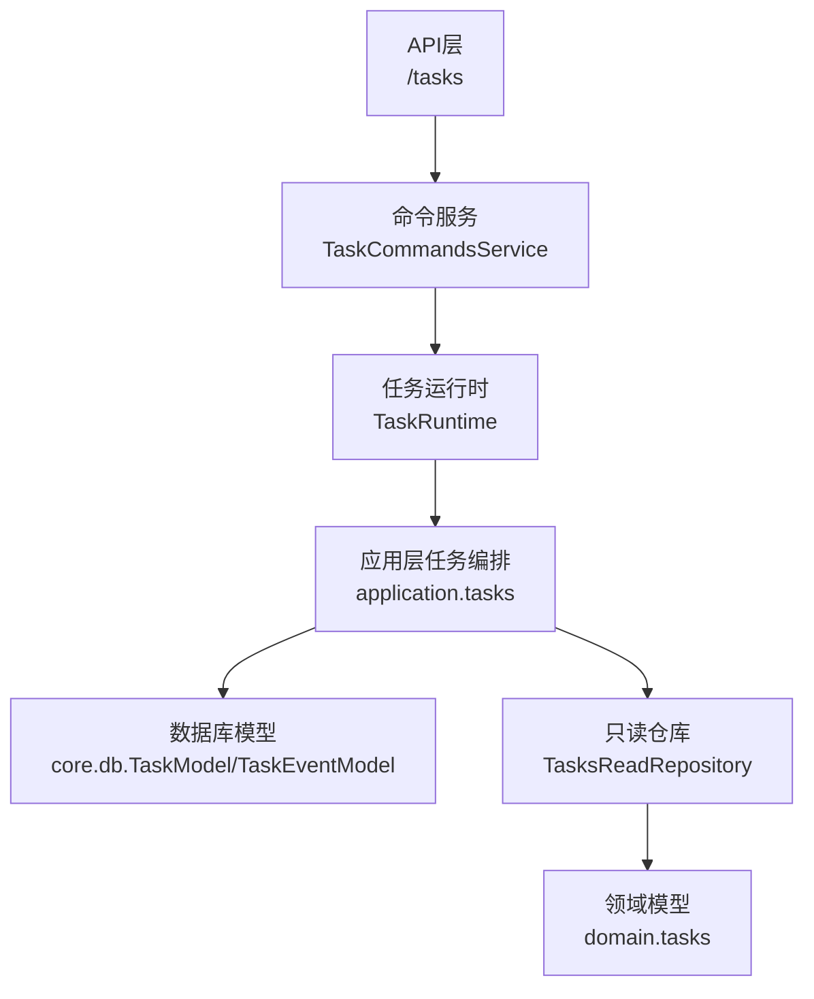
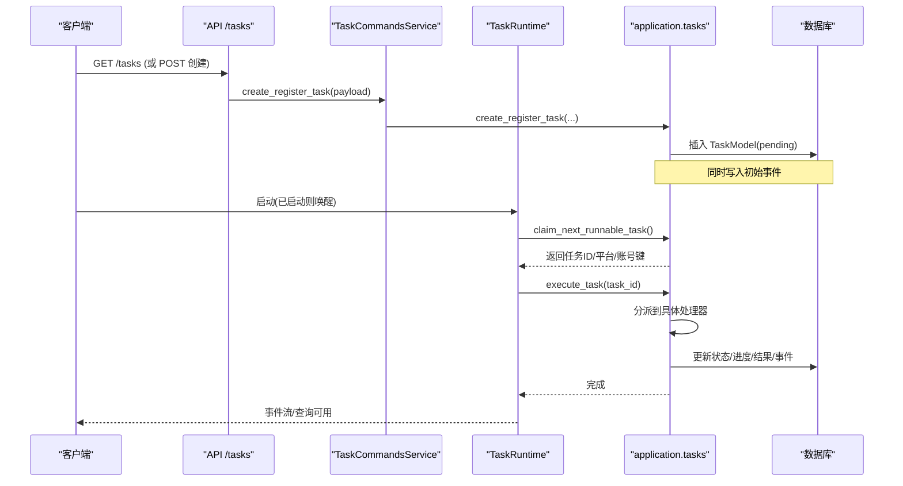
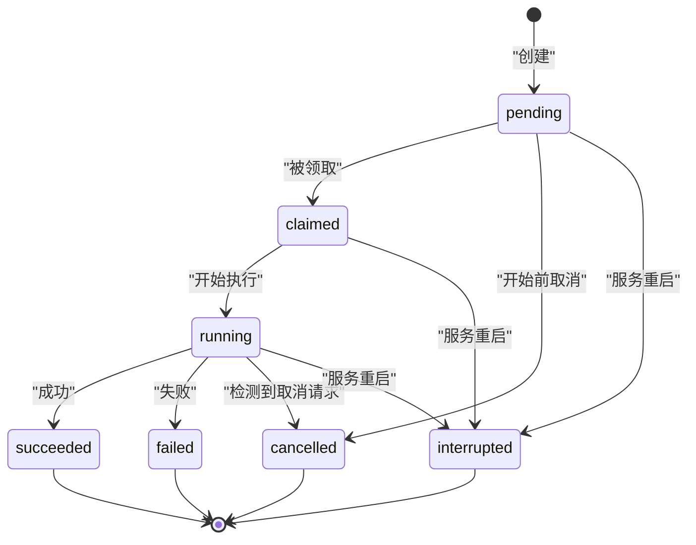
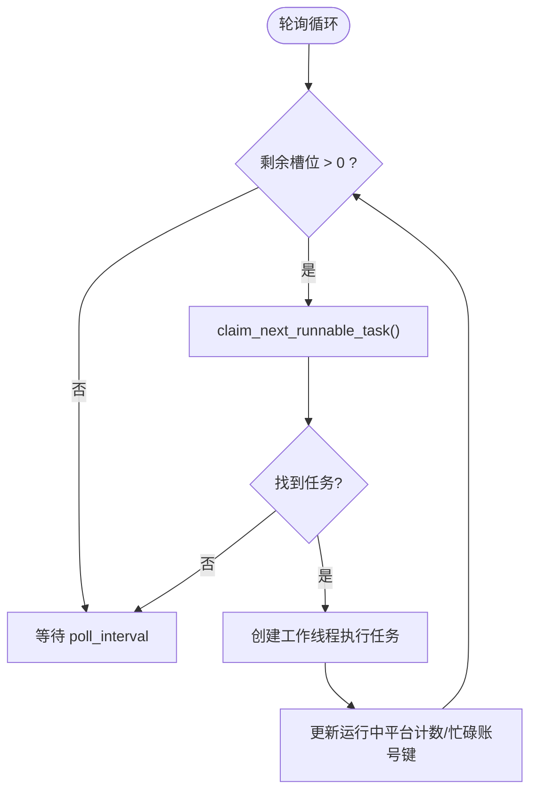
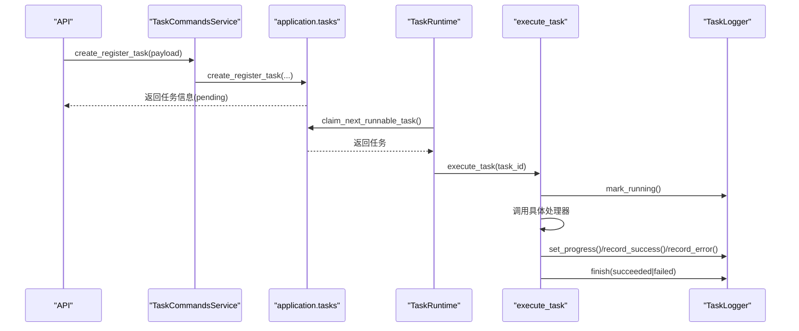
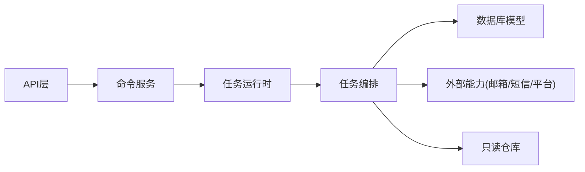

# 任务生命周期管理

<cite>
**本文引用的文件**
- [application/tasks.py](file://application/tasks.py)
- [services/task_runtime.py](file://services/task_runtime.py)
- [core/db.py](file://core/db.py)
- [infrastructure/tasks_read_repository.py](file://infrastructure/tasks_read_repository.py)
- [api/tasks.py](file://api/tasks.py)
- [application/task_commands.py](file://application/task_commands.py)
- [domain/tasks.py](file://domain/tasks.py)
</cite>

## 目录
1. [简介](#简介)
2. [项目结构](#项目结构)
3. [核心组件](#核心组件)
4. [架构总览](#架构总览)
5. [详细组件分析](#详细组件分析)
6. [依赖关系分析](#依赖关系分析)
7. [性能与调度特性](#性能与调度特性)
8. [故障排查指南](#故障排查指南)
9. [结论](#结论)
10. [附录：任务类型与示例](#附录任务类型与示例)

## 简介
本文件系统性说明 Any Auto Register 中“任务”的完整生命周期，覆盖从创建、调度、执行到结果处理与清理的全过程。重点包括：
- 任务状态机设计（pending/claimed/running/succeeded/failed/interrupted/cancelled）
- 任务优先级与公平调度（按创建时间排序、平台并发限制、账号键冲突避免）
- 结果持久化与事件流（任务进度、错误列表、日志事件）
- 失败恢复策略（服务重启中断恢复、取消机制）
- 重试与退避（当前实现未内置通用指数退避；注册流程内针对特定场景有额外尝试策略）

## 项目结构
围绕任务生命周期的关键模块如下：
- application/tasks.py：任务编排、状态流转、执行器分发、进度与结果记录、事件写入、取消与中断恢复
- services/task_runtime.py：单进程任务运行时，负责轮询取任务、线程池并发控制、工作线程回收
- core/db.py：任务相关数据模型（TaskModel、TaskEventModel、TaskLog），以及数据库引擎
- infrastructure/tasks_read_repository.py：只读仓库，将底层查询结果转换为领域对象 TaskSummary/TaskEvent
- api/tasks.py：对外暴露的任务查询接口（列表、详情、事件）
- application/task_commands.py：命令式入口（创建任务、取消任务、SSE 事件流）
- domain/tasks.py：领域数据类（TaskProgress、TaskSummary、TaskEvent）

图表来源
- [api/tasks.py:11-29](file://api/tasks.py#L11-L29)
- [application/task_commands.py:20-48](file://application/task_commands.py#L20-L48)
- [services/task_runtime.py:18-101](file://services/task_runtime.py#L18-L101)
- [application/tasks.py:174-373](file://application/tasks.py#L174-L373)
- [core/db.py:241-288](file://core/db.py#L241-L288)
- [infrastructure/tasks_read_repository.py:46-57](file://infrastructure/tasks_read_repository.py#L46-L57)
- [domain/tasks.py:8-44](file://domain/tasks.py#L8-L44)

章节来源
- [application/tasks.py:174-373](file://application/tasks.py#L174-L373)
- [services/task_runtime.py:18-101](file://services/task_runtime.py#L18-L101)
- [core/db.py:241-288](file://core/db.py#L241-L288)
- [infrastructure/tasks_read_repository.py:46-57](file://infrastructure/tasks_read_repository.py#L46-L57)
- [api/tasks.py:11-29](file://api/tasks.py#L11-L29)
- [application/task_commands.py:20-48](file://application/task_commands.py#L20-L48)
- [domain/tasks.py:8-44](file://domain/tasks.py#L8-L44)

## 核心组件
- 任务模型与事件
  - TaskModel：任务主表，包含类型、平台、状态、负载、结果、进度、计数、时间戳等
  - TaskEventModel：任务事件表，用于记录日志、状态变更等
  - TaskLog：账号级任务日志（成功/失败）
- 任务编排与执行
  - create_*：创建不同任务的工厂方法（注册、账号检查、批量检查、平台动作）
  - execute_task：根据任务类型分派到具体处理器
  - TaskLogger：统一记录进度、错误、成功、结果数据、结束状态
- 任务运行时
  - TaskRuntime：启动/停止、轮询取任务、并发控制、工作线程回收
- 只读查询
  - TasksReadRepository：将任务与事件序列化为领域对象，供上层使用

章节来源
- [core/db.py:229-288](file://core/db.py#L229-L288)
- [application/tasks.py:174-373](file://application/tasks.py#L174-L373)
- [services/task_runtime.py:18-101](file://services/task_runtime.py#L18-L101)
- [infrastructure/tasks_read_repository.py:46-57](file://infrastructure/tasks_read_repository.py#L46-L57)

## 架构总览
任务从创建到完成的关键路径：
1. 客户端通过 API 或命令服务创建任务（如注册任务）
2. 任务以 pending 状态持久化
3. TaskRuntime 轮询并 claim_next_runnable_task 获取可执行任务
4. 为每个任务创建独立线程执行 execute_task
5. 执行过程中通过 TaskLogger 更新进度、记录错误/成功、最终 finish
6. 完成后状态变为 succeeded/failed/interrupted/cancelled
7. 前端可通过 SSE 拉取事件流，或通过 REST 查询任务与事件

图表来源
- [api/tasks.py:11-29](file://api/tasks.py#L11-L29)
- [application/task_commands.py:20-48](file://application/task_commands.py#L20-L48)
- [application/tasks.py:174-373](file://application/tasks.py#L174-L373)
- [services/task_runtime.py:18-101](file://services/task_runtime.py#L18-L101)
- [core/db.py:241-288](file://core/db.py#L241-L288)

## 详细组件分析

### 任务状态机与流转规则
- 状态集合
  - 活跃态：pending、claimed、running、cancel_requested
  - 终态：succeeded、failed、interrupted、cancelled
- 转换规则
  - 创建：pending
  - 被领取：pending → claimed（claim_next_runnable_task）
  - 开始执行：claimed → running（TaskLogger.mark_running）
  - 正常完成：running → succeeded（finish）
  - 异常完成：running → failed（finish）
  - 服务重启中断：非终态 → interrupted（mark_incomplete_tasks_interrupted）
  - 取消：
    - pending → cancelled（request_cancel）
    - 其他活跃态 → cancel_requested（request_cancel），执行器检测到后转为 cancelled

图表来源
- [application/tasks.py:31-50](file://application/tasks.py#L31-L50)
- [application/tasks.py:296-338](file://application/tasks.py#L296-L338)
- [application/tasks.py:385-457](file://application/tasks.py#L385-L457)

章节来源
- [application/tasks.py:31-50](file://application/tasks.py#L31-L50)
- [application/tasks.py:296-338](file://application/tasks.py#L296-L338)
- [application/tasks.py:385-457](file://application/tasks.py#L385-L457)

### 执行调度与并发控制
- 调度策略
  - 按创建时间顺序选择 pending 任务（FIFO）
  - 平台维度并发限制：同一平台最多 max_parallel_per_platform 个任务并行
  - 账号键冲突避免：若任务涉及特定账号键，且该键正忙，则跳过
- 并发模型
  - TaskRuntime 维护最大并发数 max_parallel_tasks
  - 每个任务一个工作线程，完成后自动回收
- 资源分配
  - 注册任务支持代理池（proxy_pool）动态选择与反馈
  - 邮箱实例在任务内共享以避免并发初始化问题

图表来源
- [services/task_runtime.py:47-85](file://services/task_runtime.py#L47-L85)
- [application/tasks.py:340-368](file://application/tasks.py#L340-L368)

章节来源
- [services/task_runtime.py:47-85](file://services/task_runtime.py#L47-L85)
- [application/tasks.py:340-368](file://application/tasks.py#L340-L368)

### 任务创建与执行流程
- 创建任务
  - create_register_task：创建注册任务，设置 progress_total=count
  - create_account_check_task：单个账号有效性检查
  - create_account_check_all_task：批量检查，progress_total=limit
  - create_platform_action_task：平台自定义动作
- 执行任务
  - execute_task：根据 type 路由到对应处理器
  - 注册任务处理器内部：
    - 解析并发度、代理、邮箱、短信提供者等配置
    - 构建平台实例并执行 register
    - 成功后保存账户、可选自动升级链接生成、CPA上传、Any2API推送
    - 记录成功/失败、进度、结果数据、现金链接等

图表来源
- [application/task_commands.py:20-24](file://application/task_commands.py#L20-L24)
- [application/tasks.py:174-240](file://application/tasks.py#L174-L240)
- [application/tasks.py:570-595](file://application/tasks.py#L570-L595)
- [application/tasks.py:385-457](file://application/tasks.py#L385-L457)

章节来源
- [application/tasks.py:174-240](file://application/tasks.py#L174-L240)
- [application/tasks.py:570-595](file://application/tasks.py#L570-L595)
- [application/tasks.py:385-457](file://application/tasks.py#L385-L457)

### 结果处理与清理机制
- 结果存储
  - TaskModel.result_json：结构化结果（errors、cashier_urls、data）
  - TaskEventModel：事件流（log/state），支持增量拉取
  - TaskLog：账号级成功/失败日志
- 清理
  - 工作线程结束后从运行时移除
  - 服务重启时，非终态任务标记为 interrupted 并记录事件

章节来源
- [core/db.py:229-288](file://core/db.py#L229-L288)
- [application/tasks.py:296-316](file://application/tasks.py#L296-L316)
- [services/task_runtime.py:87-98](file://services/task_runtime.py#L87-L98)

### 任务状态查询接口
- REST 接口
  - GET /tasks：分页查询任务列表，支持 platform/status 过滤
  - GET /tasks/{task_id}：获取任务详情
  - GET /tasks/{task_id}/events：获取任务事件（since, limit）
- 查询服务
  - TasksQueryService：封装读取逻辑，序列化领域对象

章节来源
- [api/tasks.py:11-29](file://api/tasks.py#L11-L29)
- [infrastructure/tasks_read_repository.py:46-57](file://infrastructure/tasks_read_repository.py#L46-L57)
- [application/tasks_query.py:7-68](file://application/tasks_query.py#L7-L68)

## 依赖关系分析
- 低耦合分层
  - API 层仅依赖命令服务与查询服务
  - 命令服务协调任务运行时与任务编排
  - 任务编排专注状态与业务逻辑，不关心线程调度
  - 运行时专注并发与生命周期管理
  - 数据访问集中在 core.db，领域对象在 domain.tasks
- 外部依赖
  - 代理池 proxy_pool（注册任务）
  - 邮箱/短信/平台插件（通过注册表加载）
  - Any2API/CPA 上传（可选）

图表来源
- [api/tasks.py:11-29](file://api/tasks.py#L11-L29)
- [application/task_commands.py:20-48](file://application/task_commands.py#L20-L48)
- [services/task_runtime.py:18-101](file://services/task_runtime.py#L18-L101)
- [application/tasks.py:174-373](file://application/tasks.py#L174-L373)
- [core/db.py:241-288](file://core/db.py#L241-L288)

章节来源
- [api/tasks.py:11-29](file://api/tasks.py#L11-L29)
- [application/task_commands.py:20-48](file://application/task_commands.py#L20-L48)
- [services/task_runtime.py:18-101](file://services/task_runtime.py#L18-L101)
- [application/tasks.py:174-373](file://application/tasks.py#L174-L373)
- [core/db.py:241-288](file://core/db.py#L241-L288)

## 性能与调度特性
- 调度算法
  - FIFO 优先：按 created_at 升序选取 pending 任务
  - 平台公平性：限制同平台并发数，避免单一平台独占资源
  - 账号键互斥：避免对同一账号进行并发操作
- 并发模型
  - 进程内多线程：TaskRuntime 维护线程池上限
  - 每任务独立线程，执行完毕即回收
- 资源分配
  - 代理池动态选择与反馈（成功/失败计数）
  - 邮箱实例在任务内复用，减少重复初始化开销
- 可扩展点
  - 可在 claim_next_runnable_task 中引入更复杂的优先级队列（例如基于业务权重）
  - 可增加任务级别的重试队列与退避策略

[本节为通用性能讨论，不直接分析具体文件]

## 故障排查指南
- 常见问题定位
  - 任务长时间 pending：检查 TaskRuntime 是否启动、是否有空闲槽位、平台并发限制是否过严
  - 任务频繁失败：查看任务事件与错误列表，确认平台/代理/邮箱配置是否正确
  - 服务重启后任务中断：系统会自动将非终态任务标记为 interrupted，需重新提交或人工干预
- 诊断手段
  - 通过 /tasks/{task_id}/events 拉取事件流，观察状态变化与错误信息
  - 检查 TaskModel.error_count 与 result.errors 列表
  - 核对代理池统计与平台插件日志

章节来源
- [application/tasks.py:296-316](file://application/tasks.py#L296-L316)
- [application/tasks.py:414-457](file://application/tasks.py#L414-L457)
- [api/tasks.py:24-29](file://api/tasks.py#L24-L29)

## 结论
Any Auto Register 的任务系统采用清晰的分层设计与明确的状态机，结合轻量级的线程池运行时实现了稳定可靠的异步任务执行。其优势在于：
- 状态机完备，覆盖成功、失败、中断、取消等场景
- 调度简单高效，具备平台维度的公平性与账号键互斥
- 结果与事件持久化完善，便于追踪与调试
- 扩展性强，易于接入更多平台与外部能力

未来可考虑增强：
- 引入任务优先级队列与更细粒度的重试/退避策略
- 增加分布式锁与多进程/多节点部署支持
- 提供更丰富的监控指标与告警

[本节为总结性内容，不直接分析具体文件]

## 附录：任务类型与示例
以下示例展示如何创建不同类型的任务（以函数路径代替代码片段）：
- 异步注册任务
  - 参考：[create_register_task:201-208](file://application/tasks.py#L201-L208)
  - 用途：批量注册指定平台的账号，支持并发与代理
- 批量验证任务
  - 参考：[create_account_check_all_task:225-231](file://application/tasks.py#L225-L231)
  - 用途：批量检查账号有效性，更新账户概览与生命周期状态
- 定时检查任务
  - 参考：[Scheduler.check_accounts_valid:65-111](file://core/scheduler.py#L65-L111)
  - 用途：周期性检测账号有效性，更新账户状态与摘要
- 平台动作任务
  - 参考：[create_platform_action_task:234-240](file://application/tasks.py#L234-L240)
  - 用途：执行平台自定义动作（如支付链接生成、权限操作等）

章节来源
- [application/tasks.py:201-240](file://application/tasks.py#L201-L240)
- [core/scheduler.py:65-111](file://core/scheduler.py#L65-L111)