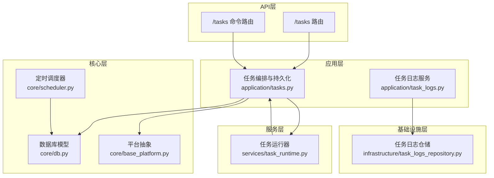
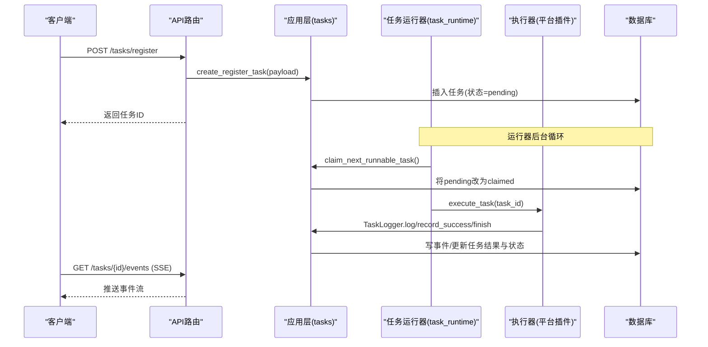
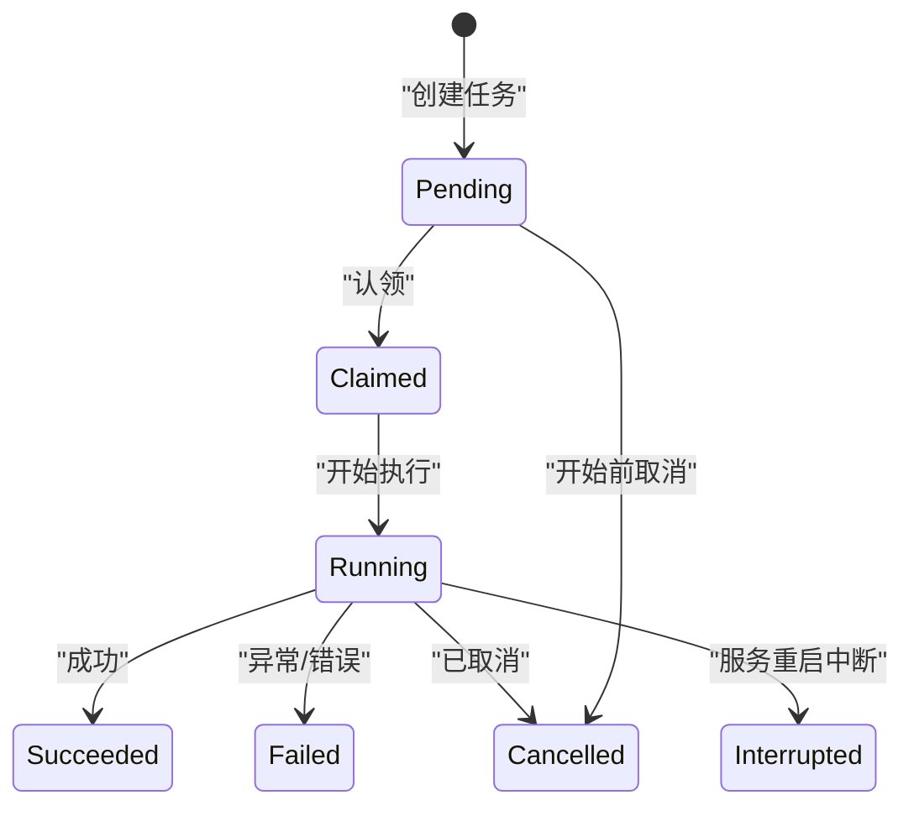
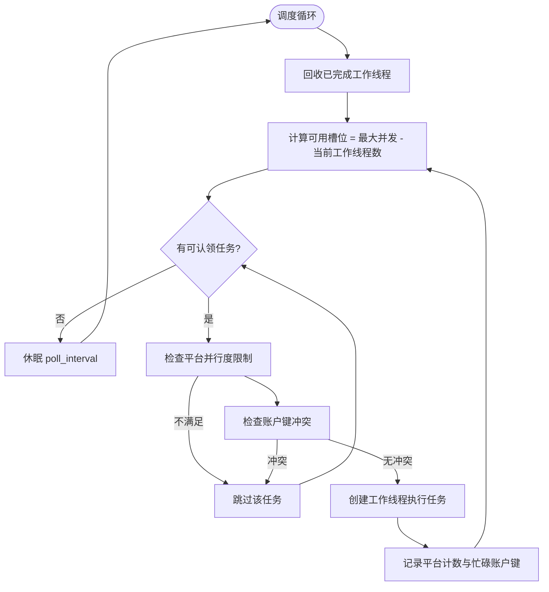
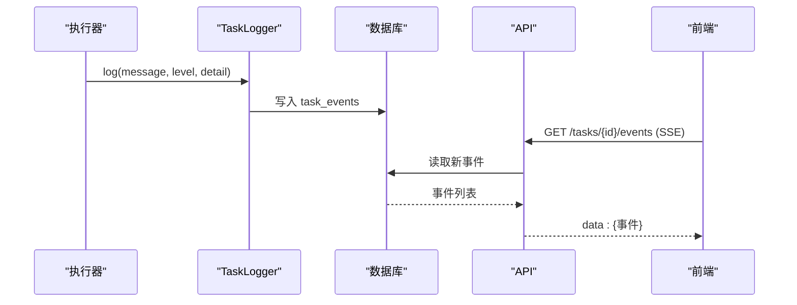
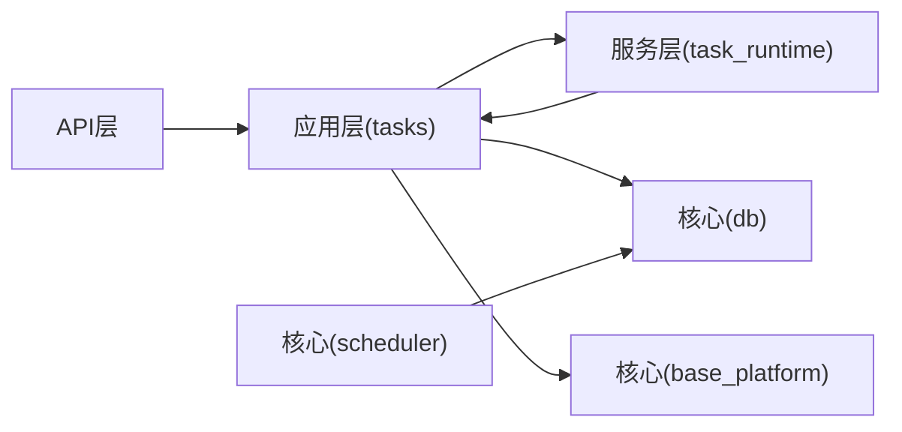

# 任务调度系统

<cite>
**本文引用的文件**
- [core/scheduler.py](file://core/scheduler.py)
- [services/task_runtime.py](file://services/task_runtime.py)
- [application/tasks.py](file://application/tasks.py)
- [domain/tasks.py](file://domain/tasks.py)
- [core/db.py](file://core/db.py)
- [api/tasks.py](file://api/tasks.py)
- [api/task_commands.py](file://api/task_commands.py)
- [application/task_logs.py](file://application/task_logs.py)
- [infrastructure/task_logs_repository.py](file://infrastructure/task_logs_repository.py)
- [core/base_platform.py](file://core/base_platform.py)
</cite>

## 目录
1. [简介](#简介)
2. [项目结构](#项目结构)
3. [核心组件](#核心组件)
4. [架构总览](#架构总览)
5. [详细组件分析](#详细组件分析)
6. [依赖关系分析](#依赖关系分析)
7. [性能与并发控制](#性能与并发控制)
8. [故障排查指南](#故障排查指南)
9. [结论](#结论)
10. [附录：使用示例](#附录使用示例)

## 简介
本文件系统性阐述 Any Auto Register 的任务调度系统设计，覆盖任务生命周期（创建、状态流转、执行调度、结果处理、错误重试）、并发控制（线程池、任务队列、资源限制）、运行时管理（隔离、内存、监控）、日志与追踪（结构化日志、实时流、调试信息），以及优先级与失败恢复策略。文档兼顾理论与实践，帮助读者从整体到细节掌握系统的运行机制与扩展方式。

## 项目结构
围绕任务调度，代码主要分布在以下模块：
- API 层：对外暴露任务创建、查询、取消、事件流等接口
- 应用层：任务编排、持久化、状态机、执行器分发、日志记录
- 服务层：进程内任务运行器（线程调度）
- 核心层：数据库模型、平台抽象、定时调度器
- 基础设施层：日志仓储、配置与能力解析

**图表来源**
- [api/tasks.py:1-30](file://api/tasks.py#L1-L30)
- [api/task_commands.py:1-51](file://api/task_commands.py#L1-L51)
- [application/tasks.py:174-373](file://application/tasks.py#L174-L373)
- [services/task_runtime.py:18-101](file://services/task_runtime.py#L18-L101)
- [core/db.py:229-288](file://core/db.py#L229-L288)
- [core/base_platform.py:124-165](file://core/base_platform.py#L124-L165)
- [core/scheduler.py:19-115](file://core/scheduler.py#L19-L115)
- [infrastructure/task_logs_repository.py:27-41](file://infrastructure/task_logs_repository.py#L27-L41)

**章节来源**
- [api/tasks.py:1-30](file://api/tasks.py#L1-L30)
- [api/task_commands.py:1-51](file://api/task_commands.py#L1-L51)
- [application/tasks.py:174-373](file://application/tasks.py#L174-L373)
- [services/task_runtime.py:18-101](file://services/task_runtime.py#L18-L101)
- [core/db.py:229-288](file://core/db.py#L229-L288)
- [core/base_platform.py:124-165](file://core/base_platform.py#L124-L165)
- [core/scheduler.py:19-115](file://core/scheduler.py#L19-L115)
- [infrastructure/task_logs_repository.py:27-41](file://infrastructure/task_logs_repository.py#L27-L41)

## 核心组件
- 任务模型与事件模型：定义任务、事件、日志的数据结构与序列化方法
- 任务编排与状态机：任务创建、认领、执行、完成、取消、中断的全流程
- 任务运行器：单进程多线程调度，按平台并行度与账户键冲突进行资源控制
- 平台抽象：统一注册、校验、动作执行入口，支持多种执行器与身份模式
- 定时调度器：周期性检查账号有效期与批量有效性检测
- 日志与追踪：结构化事件存储与SSE实时推送

**章节来源**
- [domain/tasks.py:8-44](file://domain/tasks.py#L8-L44)
- [core/db.py:229-288](file://core/db.py#L229-L288)
- [application/tasks.py:174-458](file://application/tasks.py#L174-L458)
- [services/task_runtime.py:18-101](file://services/task_runtime.py#L18-L101)
- [core/base_platform.py:124-165](file://core/base_platform.py#L124-L165)
- [core/scheduler.py:19-115](file://core/scheduler.py#L19-L115)

## 架构总览
任务从API进入，经应用层持久化为“待执行”任务；运行器轮询并认领任务，分配工作线程执行；执行过程中通过TaskLogger写入结构化事件；完成后更新任务结果与状态；前端可通过SSE订阅事件流。

**图表来源**
- [api/task_commands.py:29-51](file://api/task_commands.py#L29-L51)
- [application/tasks.py:174-240](file://application/tasks.py#L174-L240)
- [application/tasks.py:340-373](file://application/tasks.py#L340-L373)
- [application/tasks.py:570-595](file://application/tasks.py#L570-L595)
- [services/task_runtime.py:47-92](file://services/task_runtime.py#L47-L92)
- [core/db.py:241-288](file://core/db.py#L241-L288)

## 详细组件分析

### 任务生命周期与状态机
- 任务类型：注册(register)、账号校验(account_check)、批量校验(account_check_all)、平台动作(platform_action)
- 状态集合：pending、claimed、running、succeeded、failed、interrupted、cancel_requested、cancelled
- 关键流程：
  - 创建：create_* 函数生成任务并写入数据库，初始状态为 pending
  - 认领：claim_next_runnable_task 按创建时间顺序挑选 pending 任务，考虑平台并行度与账户键冲突，标记为 claimed
  - 执行：execute_task 根据类型分派处理器，TaskLogger.mark_running 转为 running
  - 结果：成功/失败/取消/中断时 finish，写入结果与结束时间
  - 取消：request_cancel 在 pending 直接置 cancelled；否则置 cancel_requested，执行中会检查并退出
  - 中断：服务重启后 mark_incomplete_tasks_interrupted 将非终态任务置 interrupted

**图表来源**
- [application/tasks.py:26-50](file://application/tasks.py#L26-L50)
- [application/tasks.py:174-240](file://application/tasks.py#L174-L240)
- [application/tasks.py:318-338](file://application/tasks.py#L318-L338)
- [application/tasks.py:340-373](file://application/tasks.py#L340-L373)
- [application/tasks.py:371-458](file://application/tasks.py#L371-L458)
- [application/tasks.py:296-316](file://application/tasks.py#L296-L316)

**章节来源**
- [application/tasks.py:26-50](file://application/tasks.py#L26-L50)
- [application/tasks.py:174-240](file://application/tasks.py#L174-L240)
- [application/tasks.py:296-338](file://application/tasks.py#L296-L338)
- [application/tasks.py:340-373](file://application/tasks.py#L340-L373)
- [application/tasks.py:371-458](file://application/tasks.py#L371-L458)

### 并发控制机制
- 全局并发上限：TaskRuntime.max_parallel_tasks 限制同时运行的任务数
- 平台级并发：max_parallel_per_platform 限制同一平台的并行任务数
- 账户键冲突：对 account_check/platform_action 等任务，基于 account_keys 避免同一账户被并发操作
- 线程模型：每个任务一个工作线程；运行器主线程负责轮询与调度
- 内部任务级锁：_task_locks 保证同一任务的并发修改安全

**图表来源**
- [services/task_runtime.py:47-92](file://services/task_runtime.py#L47-L92)
- [application/tasks.py:340-373](file://application/tasks.py#L340-L373)
- [application/tasks.py:78-84](file://application/tasks.py#L78-L84)

**章节来源**
- [services/task_runtime.py:18-101](file://services/task_runtime.py#L18-L101)
- [application/tasks.py:78-84](file://application/tasks.py#L78-L84)
- [application/tasks.py:340-373](file://application/tasks.py#L340-L373)

### 任务运行时管理与隔离
- 任务隔离：每个任务独立线程，避免互相阻塞；账户键冲突防止同一账户并发访问
- 内存管理：任务对象轻量，结果与日志以JSON持久化；线程结束后及时清理
- 性能监控：TaskLogger 记录进度、成功/错误计数、结构化事件；SSE 实时推送
- 平台实例：构建平台实例时注入共享邮箱或代理，减少重复初始化开销

**章节来源**
- [application/tasks.py:500-532](file://application/tasks.py#L500-L532)
- [application/tasks.py:371-458](file://application/tasks.py#L371-L458)
- [services/task_runtime.py:47-92](file://services/task_runtime.py#L47-L92)

### 日志记录与追踪
- 结构化事件：TaskEventModel 记录 type、level、message、detail_json、created_at
- 实时日志流：/tasks/{id}/logs/stream 提供 SSE 流，支持心跳与断线重连提示
- 任务日志表：TaskLog 记录每次账号级别的成功/失败及详情
- 查询与分页：TaskLogsService 提供分页列表

**图表来源**
- [application/tasks.py:281-293](file://application/tasks.py#L281-L293)
- [api/task_commands.py:42-51](file://api/task_commands.py#L42-L51)
- [application/task_logs.py:7-29](file://application/task_logs.py#L7-L29)
- [infrastructure/task_logs_repository.py:27-41](file://infrastructure/task_logs_repository.py#L27-L41)
- [core/db.py:273-288](file://core/db.py#L273-L288)

**章节来源**
- [application/tasks.py:281-293](file://application/tasks.py#L281-L293)
- [api/task_commands.py:42-51](file://api/task_commands.py#L42-L51)
- [application/task_logs.py:7-29](file://application/task_logs.py#L7-L29)
- [infrastructure/task_logs_repository.py:27-41](file://infrastructure/task_logs_repository.py#L27-L41)
- [core/db.py:273-288](file://core/db.py#L273-L288)

### 任务优先级与失败恢复
- 优先级：当前实现按 created_at 升序选择 pending 任务，即先进先出（FIFO）
- 失败恢复：
  - 服务重启：mark_incomplete_tasks_interrupted 将非终态任务标记为 interrupted，避免悬挂
  - 取消：request_cancel 支持在 pending 直接取消或在运行中标记 cancel_requested，执行中检查退出
  - 重试：注册任务支持 HeroSMS 号码复用与额外尝试，达到目标成功后仍可尝试更多次数

**章节来源**
- [application/tasks.py:340-373](file://application/tasks.py#L340-L373)
- [application/tasks.py:296-316](file://application/tasks.py#L296-L316)
- [application/tasks.py:318-338](file://application/tasks.py#L318-L338)
- [application/tasks.py:692-870](file://application/tasks.py#L692-L870)

### 定时任务与账号有效性检测
- 定时检查 trial 到期：每小时扫描 accounts，若 trial_end_time 小于当前时间则更新为 expired
- 批量有效性检测：check_accounts_valid 拉取最近 N 个有效状态账号，调用平台 check_valid 并更新摘要

**章节来源**
- [core/scheduler.py:44-64](file://core/scheduler.py#L44-L64)
- [core/scheduler.py:65-111](file://core/scheduler.py#L65-L111)

## 依赖关系分析
- API 依赖 application 层的服务方法，后者依赖 services 的任务运行器与 core 的数据库与平台抽象
- 任务运行器依赖 application 的任务编排与持久化逻辑
- 平台抽象提供统一的 register/check/execute_action 接口，具体平台实现位于 platforms 目录
- 定时调度器依赖数据库与平台能力，用于维护账号生命周期状态

**图表来源**
- [api/tasks.py:1-30](file://api/tasks.py#L1-L30)
- [api/task_commands.py:1-51](file://api/task_commands.py#L1-L51)
- [application/tasks.py:174-373](file://application/tasks.py#L174-L373)
- [services/task_runtime.py:18-101](file://services/task_runtime.py#L18-L101)
- [core/db.py:229-288](file://core/db.py#L229-L288)
- [core/base_platform.py:124-165](file://core/base_platform.py#L124-L165)
- [core/scheduler.py:19-115](file://core/scheduler.py#L19-L115)

**章节来源**
- [api/tasks.py:1-30](file://api/tasks.py#L1-L30)
- [api/task_commands.py:1-51](file://api/task_commands.py#L1-L51)
- [application/tasks.py:174-373](file://application/tasks.py#L174-L373)
- [services/task_runtime.py:18-101](file://services/task_runtime.py#L18-L101)
- [core/db.py:229-288](file://core/db.py#L229-L288)
- [core/base_platform.py:124-165](file://core/base_platform.py#L124-L165)
- [core/scheduler.py:19-115](file://core/scheduler.py#L19-L115)

## 性能与并发控制
- 线程池管理：注册任务内部使用 ThreadPoolExecutor 控制并发，默认并发受 count 与 concurrency 限制，且上限为5
- 任务队列：基于数据库 tasks 表的 pending 状态作为队列，由运行器轮询认领
- 资源限制：
  - 全局并发：max_parallel_tasks
  - 平台并发：max_parallel_per_platform
  - 账户键冲突：避免同一账户被并发操作
- 内存与I/O：结果与日志以JSON持久化，降低内存占用；SSE 流式输出减少前端压力
- 优化建议：
  - 根据CPU与外部API速率调整 max_parallel_tasks 与平台并发
  - 合理设置 poll_interval 平衡延迟与数据库压力
  - 对高频任务启用批量化与缓存（如邮箱初始化共享）

[本节为通用指导，无需特定文件引用]

## 故障排查指南
- 任务未执行：
  - 检查任务是否处于 pending；确认运行器已启动且未达并发上限
  - 查看 claim_next_runnable_task 的平台与账户键限制是否导致跳过
- 任务卡住：
  - 检查是否请求了取消但未生效；确认执行器是否定期检查 is_cancel_requested
  - 服务重启后是否被标记为 interrupted
- 日志缺失：
  - 确认 TaskLogger 是否正确写入 task_events；检查 SSE 连接与 since 参数
- 账号有效性检测失败：
  - 检查平台 check_valid 实现与网络/代理配置；查看 batch 检测的错误计数

**章节来源**
- [application/tasks.py:340-373](file://application/tasks.py#L340-L373)
- [application/tasks.py:393-397](file://application/tasks.py#L393-L397)
- [application/tasks.py:296-316](file://application/tasks.py#L296-L316)
- [api/task_commands.py:42-51](file://api/task_commands.py#L42-L51)
- [core/scheduler.py:65-111](file://core/scheduler.py#L65-L111)

## 结论
Any Auto Register 的任务调度系统以数据库为队列、线程为执行单元，结合平台并发与账户键冲突控制，实现了稳定可靠的异步任务处理。通过结构化事件与SSE流，提供了完整的可观测性与调试能力。配合定时调度器，系统能够自动维护账号生命周期状态。未来可在优先级、重试策略与分布式扩展方面进一步增强。

[本节为总结性内容，无需特定文件引用]

## 附录：使用示例
以下为常见任务类型的创建与管理示例（以API调用为例）：

- 异步注册任务
  - 调用：POST /tasks/register
  - 参数：platform、count、concurrency、proxy、executor_type、captcha_solver、extra
  - 说明：创建多个账号注册任务，内部按 concurrency 并发执行，支持代理与验证码求解

- 账号校验任务
  - 调用：POST /tasks/account_check（通过 application 层封装）
  - 参数：account_id
  - 说明：校验单个账号有效性，更新账号摘要与生命周期状态

- 批量账号校验任务
  - 调用：POST /tasks/account_check_all（通过 application 层封装）
  - 参数：platform、limit
  - 说明：批量检查最近 N 个账号的有效性，统计有效/无效/错误数量

- 平台动作任务
  - 调用：POST /tasks/platform_action（通过 application 层封装）
  - 参数：platform、account_id、action_id、params
  - 说明：执行平台自定义动作，如生成试用链接、支付链接等

- 查询与事件流
  - 查询任务：GET /tasks/{task_id}
  - 事件流：GET /tasks/{task_id}/logs/stream（SSE）
  - 说明：获取任务状态与实时事件，支持断线重连与心跳

- 取消任务
  - 调用：POST /tasks/{task_id}/cancel
  - 说明：在 pending 阶段直接取消；在运行中请求取消，执行器检测到后退出

**章节来源**
- [api/task_commands.py:17-51](file://api/task_commands.py#L17-L51)
- [application/tasks.py:201-240](file://application/tasks.py#L201-L240)
- [application/tasks.py:872-953](file://application/tasks.py#L872-L953)
- [api/tasks.py:11-29](file://api/tasks.py#L11-L29)