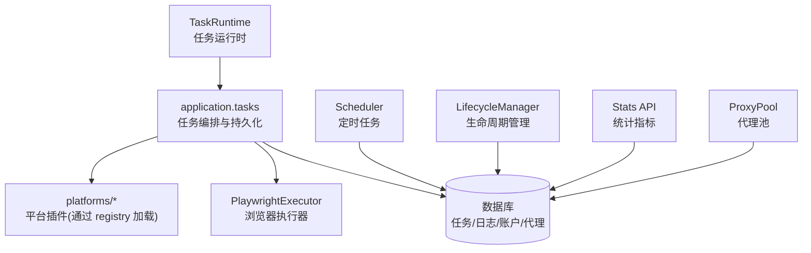
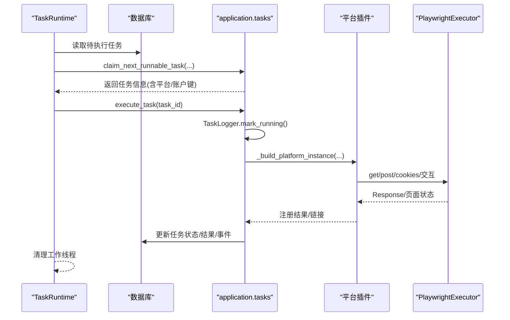
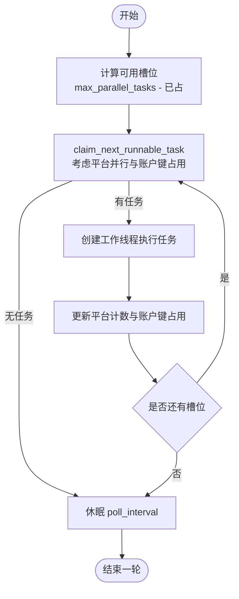
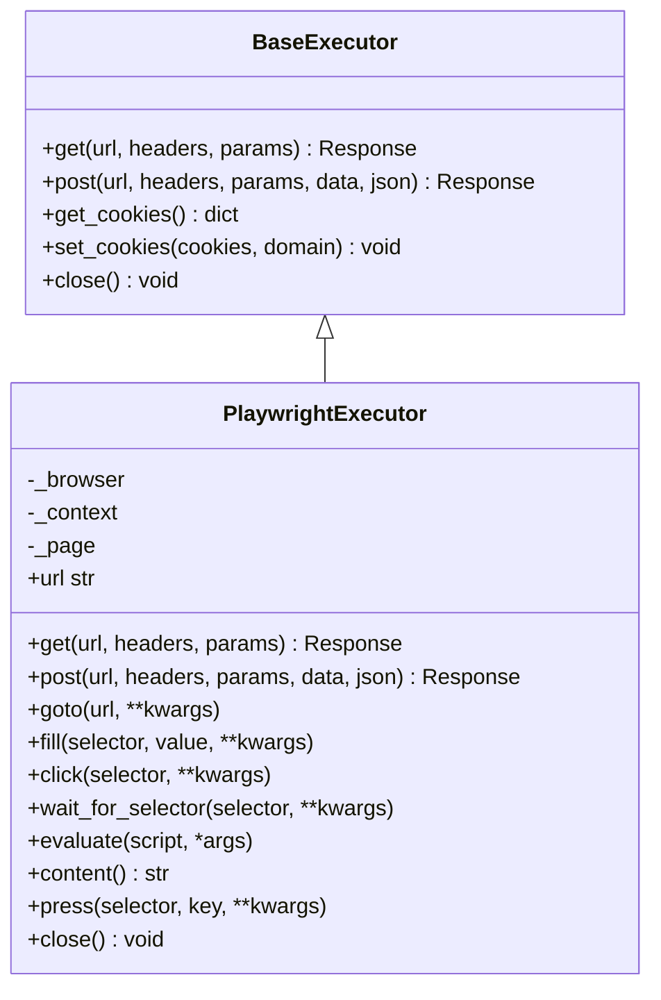
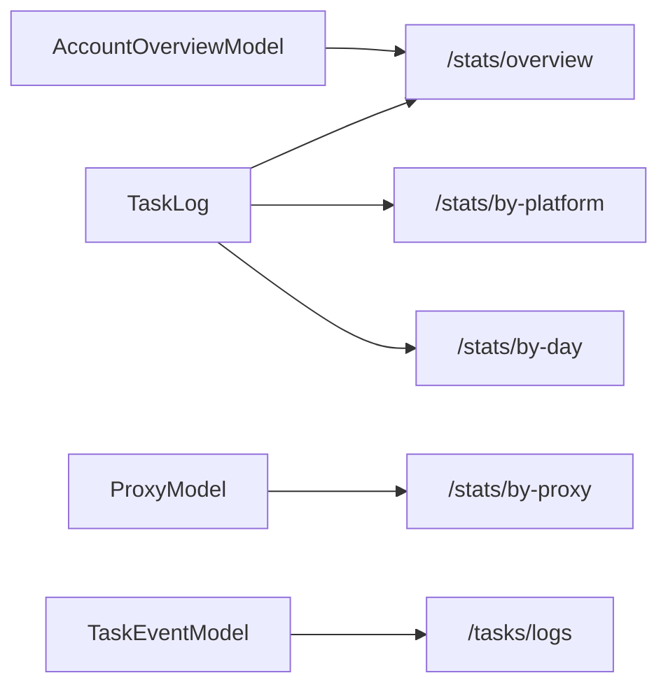
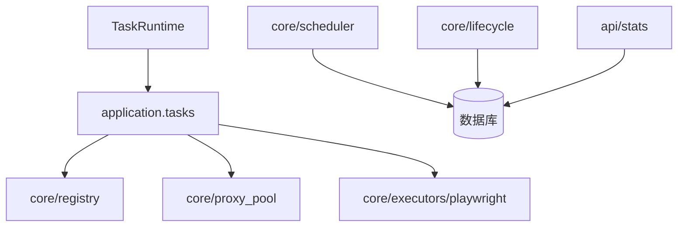

# 任务运行时管理

<cite>
**本文引用的文件**
- [services/task_runtime.py](file://services/task_runtime.py)
- [application/tasks.py](file://application/tasks.py)
- [core/base_executor.py](file://core/base_executor.py)
- [core/executors/playwright.py](file://core/executors/playwright.py)
- [core/scheduler.py](file://core/scheduler.py)
- [core/lifecycle.py](file://core/lifecycle.py)
- [core/registry.py](file://core/registry.py)
- [core/proxy_pool.py](file://core/proxy_pool.py)
- [api/stats.py](file://api/stats.py)
- [infrastructure/task_logs_repository.py](file://infrastructure/task_logs_repository.py)
- [domain/tasks.py](file://domain/tasks.py)
</cite>

## 目录
1. [简介](#简介)
2. [项目结构](#项目结构)
3. [核心组件](#核心组件)
4. [架构总览](#架构总览)
5. [详细组件分析](#详细组件分析)
6. [依赖关系分析](#依赖关系分析)
7. [性能考量](#性能考量)
8. [故障排查指南](#故障排查指南)
9. [结论](#结论)
10. [附录](#附录)

## 简介
本文件系统性介绍 Any Auto Register 的任务运行时管理系统，围绕任务隔离、内存与资源管理、执行环境构建、监控指标与诊断工具展开。系统采用单进程多线程的调度模型，通过数据库层面的任务状态与账户键锁实现任务级并发控制；浏览器执行器基于 Playwright 提供 headless/headed 模式；内置定时调度与生命周期管理用于账号有效性检测、过期预警与 token 续期；统计 API 提供注册成功率、按平台/日期/代理维度的聚合指标，便于实时监控与报告生成。

## 项目结构
- 任务调度与执行：TaskRuntime 负责拉取可执行任务并分发到工作线程；application.tasks 提供任务创建、认领、执行、日志记录与结果持久化。
- 执行器抽象与实现：BaseExecutor 定义统一 HTTP/浏览器操作接口；PlaywrightExecutor 提供具体实现，支持代理、超时、Cookie 管理等。
- 平台插件与能力：registry 自动扫描 platforms 目录加载平台插件，暴露能力元数据。
- 定时与生命周期：scheduler 与 lifecycle 分别承担周期性检查（如 trial 到期）与账号生命周期管理（有效性检测、token 刷新、CPA 同步）。
- 代理池：proxy_pool 提供动态/静态代理选择与成功率反馈。
- 监控与统计：api.stats 提供概览、按平台/日期/代理维度统计；task_logs_repository 提供日志分页查询。

**图表来源**
- [services/task_runtime.py:18-101](file://services/task_runtime.py#L18-L101)
- [application/tasks.py:174-595](file://application/tasks.py#L174-L595)
- [core/executors/playwright.py:5-134](file://core/executors/playwright.py#L5-L134)
- [core/scheduler.py:19-115](file://core/scheduler.py#L19-L115)
- [core/lifecycle.py:458-528](file://core/lifecycle.py#L458-L528)
- [api/stats.py:18-152](file://api/stats.py#L18-L152)
- [core/proxy_pool.py:9-91](file://core/proxy_pool.py#L9-L91)

**章节来源**
- [services/task_runtime.py:18-101](file://services/task_runtime.py#L18-L101)
- [application/tasks.py:174-595](file://application/tasks.py#L174-L595)
- [core/executors/playwright.py:5-134](file://core/executors/playwright.py#L5-L134)
- [core/scheduler.py:19-115](file://core/scheduler.py#L19-L115)
- [core/lifecycle.py:458-528](file://core/lifecycle.py#L458-L528)
- [api/stats.py:18-152](file://api/stats.py#L18-L152)
- [core/proxy_pool.py:9-91](file://core/proxy_pool.py#L9-L91)

## 核心组件
- 任务运行时 TaskRuntime：单进程内多线程调度，维护最大并行度与每平台并行上限，周期轮询数据库领取任务，分配工作线程执行。
- 任务编排 application.tasks：任务创建、认领、执行、进度更新、事件日志、结果持久化；提供 TaskLogger 统一记录。
- 执行器 BaseExecutor/PlaywrightExecutor：抽象 HTTP/浏览器操作，PlaywrightExecutor 支持 headless/headed、代理、默认超时、Cookie 管理。
- 平台注册表 registry：自动扫描并加载平台插件，提供能力查询。
- 定时调度 scheduler：每小时检查 trial 到期等。
- 生命周期管理 lifecycle：周期性账号有效性检测、token 刷新、CPA 同步、过期预警。
- 代理池 proxy_pool：动态/静态代理选择，成功/失败计数与自动禁用策略。
- 统计 API stats：全局概览、按平台/日期/代理维度统计、错误聚合。

**章节来源**
- [services/task_runtime.py:18-101](file://services/task_runtime.py#L18-L101)
- [application/tasks.py:174-595](file://application/tasks.py#L174-L595)
- [core/base_executor.py:19-49](file://core/base_executor.py#L19-L49)
- [core/executors/playwright.py:5-134](file://core/executors/playwright.py#L5-L134)
- [core/registry.py:25-38](file://core/registry.py#L25-L38)
- [core/scheduler.py:19-115](file://core/scheduler.py#L19-L115)
- [core/lifecycle.py:458-528](file://core/lifecycle.py#L458-L528)
- [core/proxy_pool.py:9-91](file://core/proxy_pool.py#L9-L91)
- [api/stats.py:18-152](file://api/stats.py#L18-L152)

## 架构总览
任务从创建到执行的完整流程如下：
- 创建任务：create_task/create_register_task 等写入数据库，初始状态为 pending。
- 任务认领：TaskRuntime._loop 调用 claim_next_runnable_task 获取可执行任务，考虑平台并行限制与账户键占用。
- 任务执行：execute_task 根据类型分派处理器，使用 TaskLogger 记录进度、事件与结果。
- 环境构建：_build_platform_instance 构造平台实例，注入邮箱、代理、验证码求解器等配置。
- 执行器使用：平台逻辑通过 BaseExecutor/PlaywrightExecutor 发起网络请求或操控浏览器。
- 结果持久化：success/error/cashier_urls/result 等写入数据库，事件追加至任务事件表。

**图表来源**
- [services/task_runtime.py:47-99](file://services/task_runtime.py#L47-L99)
- [application/tasks.py:340-395](file://application/tasks.py#L340-L395)
- [application/tasks.py:570-595](file://application/tasks.py#L570-L595)
- [application/tasks.py:500-532](file://application/tasks.py#L500-L532)
- [core/executors/playwright.py:37-71](file://core/executors/playwright.py#L37-L71)

## 详细组件分析

### 任务隔离机制
- 进程隔离：当前实现为单进程多线程，未进行进程级隔离。可通过外部编排（容器/多进程）扩展。
- 内存隔离：同一进程共享内存空间，但通过线程局部变量与对象作用域减少交叉影响；每个任务的工作线程独立执行，避免共享可变状态。
- 资源隔离：
  - 平台并行限制：通过 running_platform_counts 与 max_parallel_per_platform 控制同平台并发。
  - 账户键占用：通过 busy_account_keys 防止同一账户被多个任务同时处理。
  - 浏览器上下文：PlaywrightExecutor 每次创建新的 Context/Page，避免跨任务 Cookie/会话污染。
  - 代理池：按成功/失败统计选择代理，失败过多自动禁用，降低资源争用。

**图表来源**
- [services/task_runtime.py:47-85](file://services/task_runtime.py#L47-L85)
- [application/tasks.py:340-368](file://application/tasks.py#L340-L368)

**章节来源**
- [services/task_runtime.py:18-101](file://services/task_runtime.py#L18-L101)
- [application/tasks.py:340-368](file://application/tasks.py#L340-L368)
- [core/executors/playwright.py:14-35](file://core/executors/playwright.py#L14-L35)
- [core/proxy_pool.py:9-91](file://core/proxy_pool.py#L9-L91)

### 内存管理机制
- 内存分配：Python 解释器自动管理堆内存；任务对象、平台实例、浏览器上下文在任务线程中创建并在结束后释放。
- 垃圾回收：任务线程退出后，引用计数下降触发 GC；PlaywrightExecutor.close 显式关闭浏览器与上下文，避免资源泄漏。
- 内存泄漏检测与建议：
  - 确保 TaskLogger 与平台实例不在全局缓存中持有长生命周期引用。
  - 避免在任务间共享可变状态；必要时使用线程安全数据结构。
  - 对大对象（如页面 HTML、响应体）及时释放或转为流式处理。
- 优化建议：
  - 合理设置 Playwright 默认超时与视口，减少无用渲染开销。
  - 复用邮箱实例（shared_mailbox）以减少重复初始化成本。
  - 控制并发规模，避免过多浏览器实例导致内存峰值过高。

**章节来源**
- [core/executors/playwright.py:14-35](file://core/executors/playwright.py#L14-L35)
- [core/executors/playwright.py:129-134](file://core/executors/playwright.py#L129-L134)
- [application/tasks.py:727-748](file://application/tasks.py#L727-L748)

### 任务执行环境构建
- 依赖加载：registry.load_all 自动扫描并导入各平台 plugin 模块，完成平台类注册。
- 环境变量与配置：RegisterConfig 注入 executor_type、captcha_solver、proxy、extra 等；邮箱提供商通过 ProviderSettingsRepository 解析默认值。
- 安全沙箱：
  - 浏览器执行器启用 headless 模式，禁用自动化特征参数，降低被检测风险。
  - 通过代理池隔离网络出口，避免 IP 关联。
  - 验证码求解器（如 Turnstile）通过 VM 或外部服务解算，不直接执行不可信脚本。

**图表来源**
- [core/base_executor.py:19-49](file://core/base_executor.py#L19-L49)
- [core/executors/playwright.py:5-134](file://core/executors/playwright.py#L5-L134)

**章节来源**
- [core/registry.py:25-38](file://core/registry.py#L25-L38)
- [application/tasks.py:500-532](file://application/tasks.py#L500-L532)
- [core/executors/playwright.py:14-35](file://core/executors/playwright.py#L14-L35)

### 性能监控与指标收集
- 指标来源：
  - 任务日志：TaskLog 记录平台、邮箱、状态、错误与详情。
  - 任务事件：TaskEventModel 记录任务级别的事件（状态变更、进度、错误）。
  - 代理统计：ProxyModel.success_count/fail_count 反映代理质量。
  - 账户概览：AccountOverviewModel.lifecycle_status 等字段。
- 统计 API：
  - /stats/overview：总注册数、成功率、账号状态分布。
  - /stats/by-platform：按平台统计成功率。
  - /stats/by-day：按天趋势（可过滤平台）。
  - /stats/by-proxy：代理成功率排行。
  - /stats/errors：最近失败错误聚合（可按平台与天数过滤）。
- 实时监控面板示例：
  - 前端定期调用 /stats/overview 与 /stats/by-day 绘制成功率曲线与分布图。
  - 结合 /tasks/logs 分页拉取最新日志，展示实时任务进展。
- 性能报告生成：
  - 导出 /stats/by-day 与 /stats/errors 数据，生成日报/周报，识别瓶颈与高频错误。
- 异常告警配置：
  - 当 /stats/errors 中某错误计数超过阈值时触发告警。
  - 代理连续失败达到自动禁用阈值时通知运维。

**图表来源**
- [api/stats.py:18-152](file://api/stats.py#L18-L152)
- [infrastructure/task_logs_repository.py:27-41](file://infrastructure/task_logs_repository.py#L27-L41)

**章节来源**
- [api/stats.py:18-152](file://api/stats.py#L18-L152)
- [infrastructure/task_logs_repository.py:27-41](file://infrastructure/task_logs_repository.py#L27-L41)

### 任务调试与诊断工具
- 日志收集：
  - TaskLogger.log 将事件写入数据库并打印控制台，便于集中采集。
  - /tasks/logs 提供分页查询，支持按平台过滤。
- 堆栈跟踪：
  - 捕获异常时记录 error 与 detail_json，可在日志中查看堆栈片段。
- 性能剖析：
  - 通过 /stats/by-day 与 /stats/by-platform 观察耗时高峰与失败集中点。
  - 结合代理成功率分析网络层瓶颈。
- 最佳实践：
  - 在关键步骤调用 logger.set_progress 更新进度，便于前端展示。
  - 对失败任务追加错误分类标签，提升排障效率。

**章节来源**
- [application/tasks.py:371-457](file://application/tasks.py#L371-L457)
- [infrastructure/task_logs_repository.py:27-41](file://infrastructure/task_logs_repository.py#L27-L41)

## 依赖关系分析
- TaskRuntime 依赖 application.tasks 的任务编排与持久化。
- application.tasks 依赖 core.registry 加载平台插件，依赖 core.proxy_pool 获取代理。
- PlaywrightExecutor 依赖 playwright 库，提供浏览器自动化能力。
- scheduler 与 lifecycle 依赖数据库与平台插件进行周期性维护。
- stats API 依赖数据库聚合统计。

**图表来源**
- [services/task_runtime.py:18-101](file://services/task_runtime.py#L18-L101)
- [application/tasks.py:174-595](file://application/tasks.py#L174-L595)
- [core/registry.py:25-38](file://core/registry.py#L25-L38)
- [core/proxy_pool.py:9-91](file://core/proxy_pool.py#L9-L91)
- [core/executors/playwright.py:5-134](file://core/executors/playwright.py#L5-L134)
- [core/scheduler.py:19-115](file://core/scheduler.py#L19-L115)
- [core/lifecycle.py:458-528](file://core/lifecycle.py#L458-L528)
- [api/stats.py:18-152](file://api/stats.py#L18-L152)

**章节来源**
- [services/task_runtime.py:18-101](file://services/task_runtime.py#L18-L101)
- [application/tasks.py:174-595](file://application/tasks.py#L174-L595)
- [core/registry.py:25-38](file://core/registry.py#L25-L38)
- [core/proxy_pool.py:9-91](file://core/proxy_pool.py#L9-L91)
- [core/executors/playwright.py:5-134](file://core/executors/playwright.py#L5-L134)
- [core/scheduler.py:19-115](file://core/scheduler.py#L19-L115)
- [core/lifecycle.py:458-528](file://core/lifecycle.py#L458-L528)
- [api/stats.py:18-152](file://api/stats.py#L18-L152)

## 性能考量
- 并发控制：合理设置 max_parallel_tasks 与 max_parallel_per_platform，避免过度并发导致资源竞争。
- 浏览器资源：headless 模式减少 CPU/GPU 占用；设置合适视口与超时，避免无效渲染。
- 代理选择：优先动态代理，回退静态池；连续失败自动禁用，提高整体成功率。
- 数据库访问：批量操作与分页查询，减少锁竞争；任务状态更新使用事务保证一致性。
- 监控采样：按需拉取统计接口，避免高频轮询造成额外负载。

[本节为通用指导，无需特定文件来源]

## 故障排查指南
- 任务中断：服务重启后，未完成任务会被标记为 interrupted，需重新提交或恢复。
- 取消任务：支持请求取消，任务进入 cancel_requested 或 cancelled 状态。
- 代理失效：代理连续失败达到阈值自动禁用，需检查网络或更换代理。
- 平台错误：通过 /stats/errors 聚合最近失败错误，定位高频问题。
- 日志定位：使用 /tasks/logs 分页查看任务事件，结合 detail_json 分析异常堆栈。

**章节来源**
- [application/tasks.py:296-338](file://application/tasks.py#L296-L338)
- [core/proxy_pool.py:56-66](file://core/proxy_pool.py#L56-L66)
- [api/stats.py:135-152](file://api/stats.py#L135-L152)
- [infrastructure/task_logs_repository.py:27-41](file://infrastructure/task_logs_repository.py#L27-L41)

## 结论
Any Auto Register 的任务运行时以单进程多线程为核心，通过数据库驱动的任务状态机与账户键锁实现细粒度并发控制；执行器抽象与 Playwright 实现提供灵活的浏览器自动化能力；定时调度与生命周期管理保障账号健康与合规；统计 API 与日志体系支撑实时监控与诊断。建议在大规模部署时引入进程/容器隔离与更严格的资源配额，进一步提升稳定性与可观测性。

[本节为总结，无需特定文件来源]

## 附录
- 数据模型参考：
  - 任务摘要与事件：TaskSummary、TaskProgress、TaskEvent
  - 任务日志：TaskLogRecord

**章节来源**
- [domain/tasks.py:8-44](file://domain/tasks.py#L8-L44)