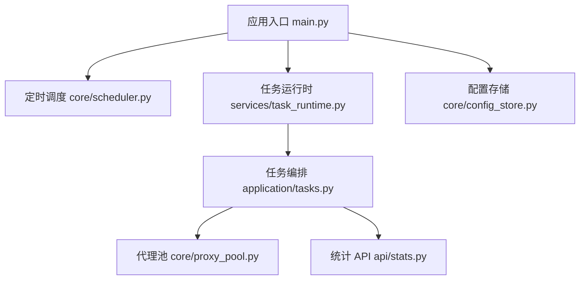
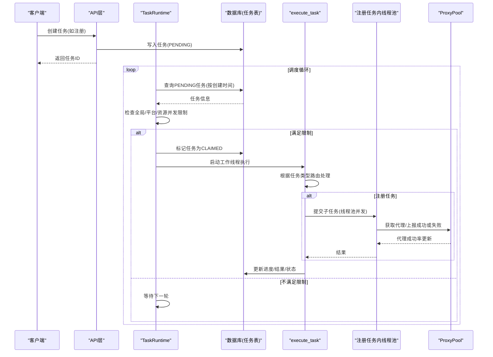
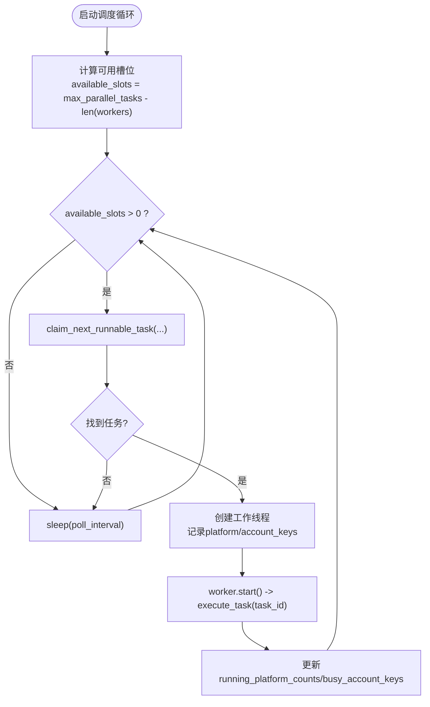
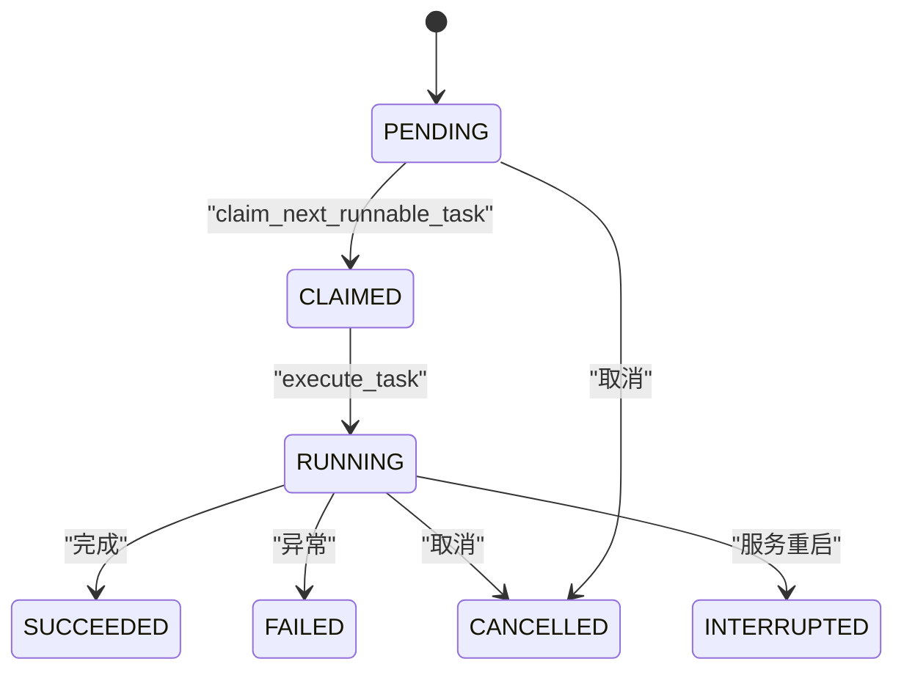
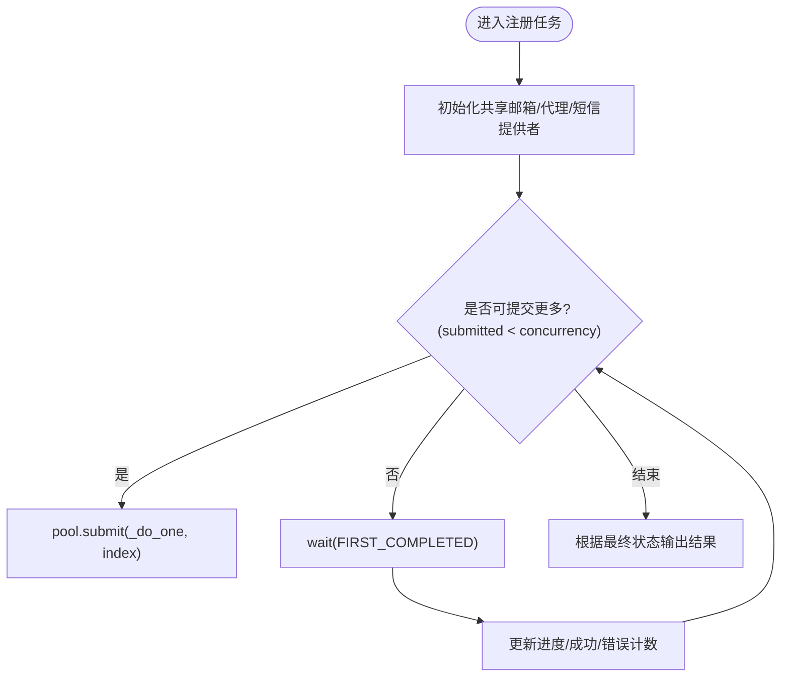
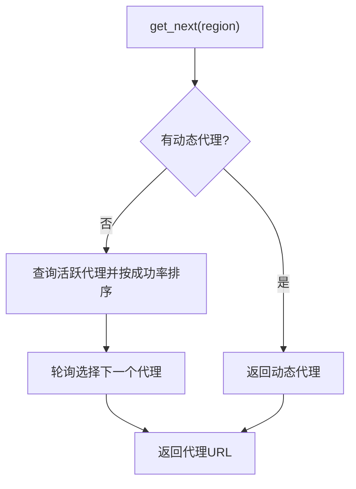
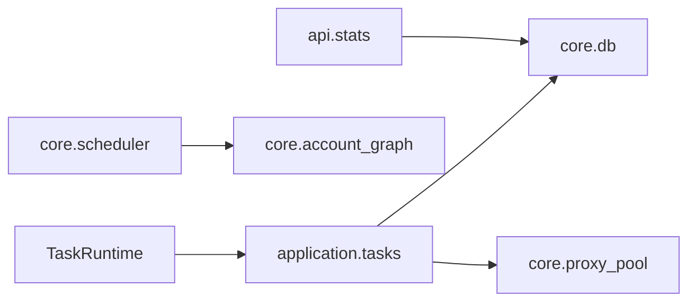

# 并发控制机制

<cite>
**本文引用的文件**
- [main.py](file://main.py)
- [services/task_runtime.py](file://services/task_runtime.py)
- [application/tasks.py](file://application/tasks.py)
- [core/scheduler.py](file://core/scheduler.py)
- [core/proxy_pool.py](file://core/proxy_pool.py)
- [api/stats.py](file://api/stats.py)
- [core/config_store.py](file://core/config_store.py)
</cite>

## 目录
1. [简介](#简介)
2. [项目结构](#项目结构)
3. [核心组件](#核心组件)
4. [架构总览](#架构总览)
5. [详细组件分析](#详细组件分析)
6. [依赖关系分析](#依赖关系分析)
7. [性能考量](#性能考量)
8. [故障排查指南](#故障排查指南)
9. [结论](#结论)
10. [附录：配置与调优示例](#附录配置与调优示例)

## 简介
本文件围绕 Any Auto Register 的并发控制机制进行深入解析，重点覆盖以下方面：
- 线程池管理的设计原理：全局并发上限、平台级并发限制、资源级并发（账号键）隔离。
- 任务队列的实现方式：基于数据库的任务持久化队列，按创建时间顺序调度；注册任务内部使用内存线程池进行细粒度并发。
- 并发限制实现：全局并发、平台级并发、资源级并发（账号键）三重限制。
- 死锁检测与预防：基于任务级互斥锁、取消信号轮询、超时/中断恢复策略。
- 监控指标与调优：通过统计接口和代理池健康度反馈优化并发参数。
- 分布式扩展建议：分布式锁、任务分片与负载均衡策略。

## 项目结构
系统启动时初始化数据库、加载平台与提供商、启动定时调度器、任务运行时与生命周期管理器。任务运行时负责从持久化队列中拉取可执行任务，并受全局与平台级并发限制约束，为每个任务分配工作线程执行具体业务逻辑。

图表来源
- [main.py:67-91](file://main.py#L67-L91)
- [core/scheduler.py:19-43](file://core/scheduler.py#L19-L43)
- [services/task_runtime.py:18-85](file://services/task_runtime.py#L18-L85)
- [application/tasks.py:340-368](file://application/tasks.py#L340-L368)
- [core/proxy_pool.py:9-45](file://core/proxy_pool.py#L9-L45)
- [api/stats.py:18-52](file://api/stats.py#L18-L52)
- [core/config_store.py:13-48](file://core/config_store.py#L13-L48)

章节来源
- [main.py:67-91](file://main.py#L67-L91)

## 核心组件
- 任务运行时 TaskRuntime：单进程任务分发器，维护全局并发上限与运行中的工作线程集合，周期性扫描并派发任务。
- 任务编排 application.tasks：提供任务创建、状态流转、取消、进度更新、日志记录、以及不同任务类型的执行流程。
- 代理池 ProxyPool：动态或静态代理选择、成功率统计、失败自动禁用。
- 统计 API stats：提供全局概览、按平台/按天/按代理的成功率等指标。
- 配置存储 config_store：持久化 key-value 配置项，可用于保存并发相关设置。

章节来源
- [services/task_runtime.py:18-101](file://services/task_runtime.py#L18-L101)
- [application/tasks.py:174-368](file://application/tasks.py#L174-L368)
- [core/proxy_pool.py:9-91](file://core/proxy_pool.py#L9-L91)
- [api/stats.py:18-152](file://api/stats.py#L18-L152)
- [core/config_store.py:13-48](file://core/config_store.py#L13-L48)

## 架构总览
下图展示了从请求到任务执行的完整并发控制路径，包括全局并发、平台级并发、资源级并发以及任务内线程池并发。

图表来源
- [services/task_runtime.py:47-85](file://services/task_runtime.py#L47-L85)
- [application/tasks.py:340-368](file://application/tasks.py#L340-L368)
- [application/tasks.py:692-869](file://application/tasks.py#L692-L869)
- [core/proxy_pool.py:14-66](file://core/proxy_pool.py#L14-L66)

## 详细组件分析

### 任务运行时 TaskRuntime：全局并发与平台级并发控制
- 设计要点
  - 全局并发上限：通过 max_parallel_tasks 限制同时运行的任务数，避免系统过载。
  - 平台级并发限制：通过 running_platform_counts 计数，确保同一平台的并发不超过 max_parallel_per_platform。
  - 资源级并发限制：通过 busy_account_keys 集合，避免同一账号被多个任务同时操作。
  - 工作线程生命周期：每个任务一个工作线程，完成后从 workers 字典移除，防止泄漏。
  - 清理机制：_reap_workers 定期回收已结束的工作线程。

图表来源
- [services/task_runtime.py:47-85](file://services/task_runtime.py#L47-L85)

章节来源
- [services/task_runtime.py:18-101](file://services/task_runtime.py#L18-L101)

### 任务队列：持久化队列与优先级策略
- 持久化队列
  - 任务以数据库记录形式存在，状态机包含 PENDING、CLAIMED、RUNNING、SUCCEEDED、FAILED、CANCELLED、INTERRUPTED 等。
  - claim_next_runnable_task 按 created_at 升序选取第一个满足并发限制的任务，保证公平性与基本优先级。
- 优先级策略
  - 当前实现采用“先进先出”的简单优先级；如需更复杂优先级（如高优任务优先），可在查询条件中加入优先级字段排序。
- 任务取消与中断
  - request_cancel 将任务置为 CANCEL_REQUESTED 或直接 CANCELLED（若尚未开始）。
  - 执行过程中通过 is_cancel_requested 轮询检查，支持优雅退出。
  - 服务重启时将非终态任务标记为 INTERRUPTED，避免悬挂任务。

图表来源
- [application/tasks.py:31-50](file://application/tasks.py#L31-L50)
- [application/tasks.py:318-338](file://application/tasks.py#L318-L338)
- [application/tasks.py:296-316](file://application/tasks.py#L296-L316)

章节来源
- [application/tasks.py:174-368](file://application/tasks.py#L174-L368)

### 注册任务内线程池：内存队列与并发控制
- 线程池大小
  - 通过 payload.concurrency 控制注册任务的并发度，默认最小为1，最大为5，且不超过 count。
  - 使用 ThreadPoolExecutor 管理子任务，提交与回收由 wait(FIRST_COMPLETED) 驱动。
- 内存队列
  - 未引入外部消息队列，任务在内存中以 futures 字典暂存，按完成事件推进。
- 资源竞争处理
  - 共享邮箱实例在任务级别预创建，避免并发初始化冲突。
  - 代理池报告成功/失败，影响后续代理选择权重。
- 特殊场景
  - HeroSMS 模式：支持号码复用与额外尝试次数，动态调整 progress_total 与目标成功数。

图表来源
- [application/tasks.py:692-869](file://application/tasks.py#L692-L869)

章节来源
- [application/tasks.py:692-869](file://application/tasks.py#L692-L869)

### 代理池：资源级别的并发与可用性保障
- 代理选择策略
  - 优先动态代理（若配置启用），否则回退到静态代理池。
  - 静态代理按 success_count/(success_count+fail_count) 排序，优先选择历史成功率高的代理。
- 健康度与自恢复
  - report_success/report_fail 更新成功率与最近检查时间。
  - 连续失败达到阈值自动禁用代理，降低风险。
- 并发影响
  - 代理池本身无严格并发限制，但通过成功率反馈间接影响整体吞吐与稳定性。

图表来源
- [core/proxy_pool.py:14-45](file://core/proxy_pool.py#L14-L45)

章节来源
- [core/proxy_pool.py:9-91](file://core/proxy_pool.py#L9-L91)

### 定时调度：后台任务与资源监控
- 定时任务
  - Scheduler 每小时检查 trial 到期账号并更新状态。
  - 支持批量检测账号有效性，按平台过滤与限制数量。
- 资源监控
  - 通过统计接口聚合注册成功率、账号状态分布、按天趋势、代理成功率排行与错误聚合。

章节来源
- [core/scheduler.py:19-114](file://core/scheduler.py#L19-L114)
- [api/stats.py:18-152](file://api/stats.py#L18-L152)

## 依赖关系分析
- 模块耦合
  - TaskRuntime 依赖 application.tasks 的任务选择与执行函数。
  - application.tasks 依赖 core.db 进行任务持久化，依赖 core.proxy_pool 进行代理选择与健康度更新。
  - core.scheduler 与 core.account_graph 交互更新账号生命周期状态。
- 潜在循环依赖
  - 当前代码通过延迟导入（如 from ... import ...）避免循环依赖，保持模块解耦。
- 外部依赖
  - FastAPI、SQLModel、threading、concurrent.futures 等标准库与框架。

图表来源
- [services/task_runtime.py:8-8](file://services/task_runtime.py#L8-L8)
- [application/tasks.py:12-24](file://application/tasks.py#L12-L24)
- [core/scheduler.py:6-10](file://core/scheduler.py#L6-L10)
- [api/stats.py:6-9](file://api/stats.py#L6-L9)

章节来源
- [services/task_runtime.py:1-101](file://services/task_runtime.py#L1-101)
- [application/tasks.py:1-120](file://application/tasks.py#L1-L120)
- [core/scheduler.py:1-43](file://core/scheduler.py#L1-L43)
- [api/stats.py:1-52](file://api/stats.py#L1-L52)

## 性能考量
- 全局并发与平台级并发
  - 合理设置 max_parallel_tasks 与 max_parallel_per_platform，避免单一平台占用过多资源。
  - 建议根据 CPU 核数、IO 密集程度与外部服务限流进行调优。
- 任务内线程池
  - 注册任务并发度受 payload.concurrency 限制，建议结合代理成功率与平台响应时间调整。
  - 共享邮箱实例减少重复初始化开销，提升吞吐。
- 代理池健康度
  - 利用成功率反馈选择更稳定的代理，降低失败重试成本。
  - 连续失败自动禁用代理，提高鲁棒性。
- 监控指标
  - 通过 /stats/overview、/stats/by-platform、/stats/by-day、/stats/by-proxy 观察成功率与趋势。
  - 关注错误聚合，定位瓶颈与不稳定因素。

[本节为通用指导，无需特定文件引用]

## 故障排查指南
- 任务悬挂或中断
  - 服务重启后非终态任务会被标记为 INTERRUPTED，可通过任务列表查看。
  - 检查 claim_next_runnable_task 是否正确释放 CLAIMED 状态。
- 并发超限
  - 若任务长时间处于 PENDING，检查全局/平台/资源并发限制是否过严。
  - 查看 running_platform_counts 与 busy_account_keys 是否导致任务无法派发。
- 代理问题
  - 代理成功率下降或频繁失败，检查 proxy_pool 的健康度与自动禁用逻辑。
  - 确认动态代理配置是否生效。
- 取消任务
  - 调用 request_cancel 后，执行端应轮询 is_cancel_requested 并优雅退出。

章节来源
- [application/tasks.py:296-338](file://application/tasks.py#L296-L338)
- [core/proxy_pool.py:47-66](file://core/proxy_pool.py#L47-L66)

## 结论
Any Auto Register 的并发控制采用“三层限制 + 持久化队列 + 线程池内并发”的组合方案：
- 全局并发限制保护系统资源，平台级并发避免热点平台独占，资源级并发（账号键）防止数据竞争。
- 任务队列基于数据库持久化，保证可靠性与可观测性；注册任务内部使用内存线程池提升吞吐。
- 代理池健康度反馈与自动禁用机制增强稳定性。
- 通过统计接口与配置存储，可实现持续监控与动态调优。
- 面向分布式环境，可扩展为分布式锁、任务分片与负载均衡策略，进一步提升水平扩展能力。

[本节为总结，无需特定文件引用]

## 附录：配置与调优示例
- 全局并发与平台级并发
  - 在 TaskRuntime 初始化时设置 max_parallel_tasks 与 max_parallel_per_platform，例如：
    - 低负载环境：max_parallel_tasks=3，max_parallel_per_platform=1
    - 高负载环境：适当提高 max_parallel_tasks，但仍需限制单平台并发以避免资源争用。
- 注册任务并发
  - 通过 payload.concurrency 控制注册任务内线程池大小，建议范围 1-5，并结合代理成功率与平台限流调整。
- 代理池调优
  - 启用动态代理或配置静态代理池，关注成功率与失败次数，必要时手动禁用不稳定代理。
- 监控指标
  - 定期查看 /stats/overview 与 /stats/by-proxy，识别瓶颈与异常。
  - 结合 /stats/errors 聚合错误信息，针对性优化。
- 配置存储
  - 使用 config_store 持久化关键配置项（如并发上限、代理开关等），便于管理与版本控制。

章节来源
- [services/task_runtime.py:18-26](file://services/task_runtime.py#L18-L26)
- [application/tasks.py:692-708](file://application/tasks.py#L692-L708)
- [core/proxy_pool.py:14-66](file://core/proxy_pool.py#L14-L66)
- [api/stats.py:18-152](file://api/stats.py#L18-L152)
- [core/config_store.py:13-48](file://core/config_store.py#L13-L48)