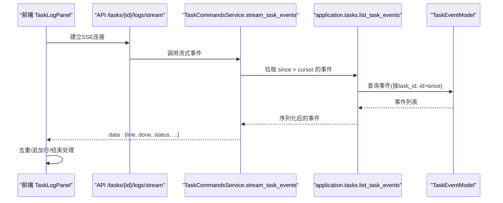
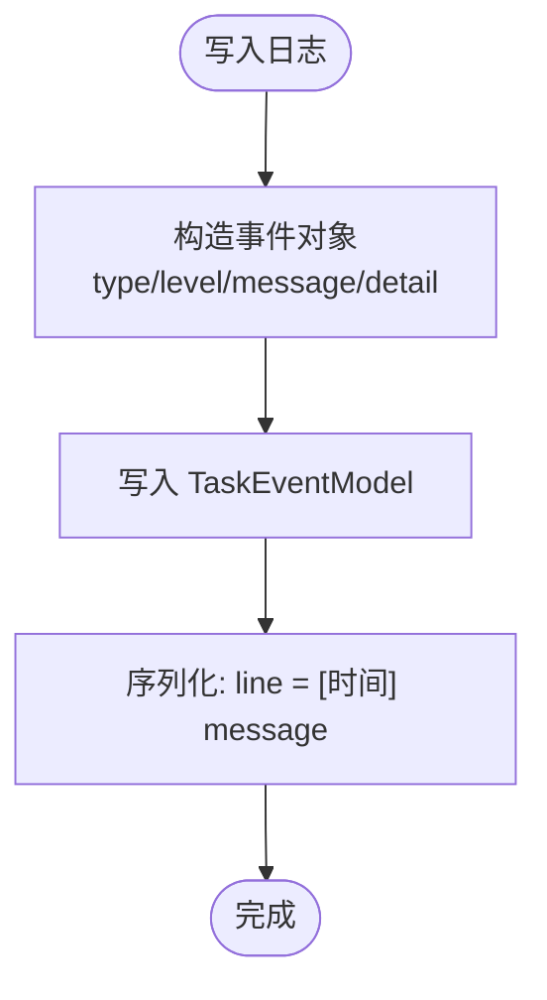
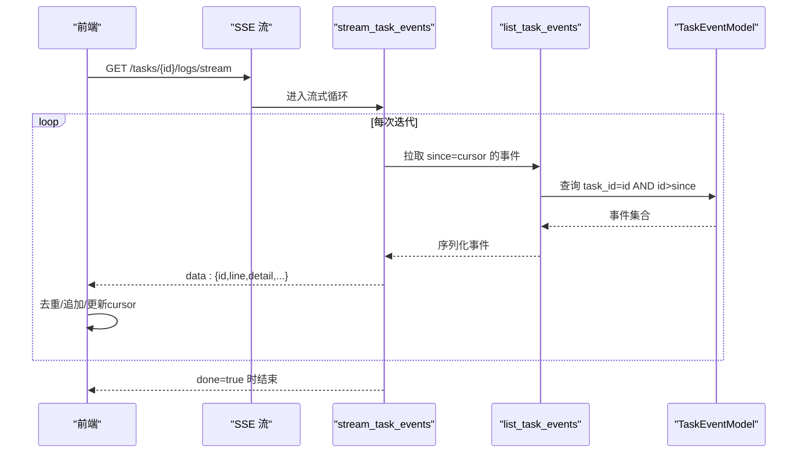
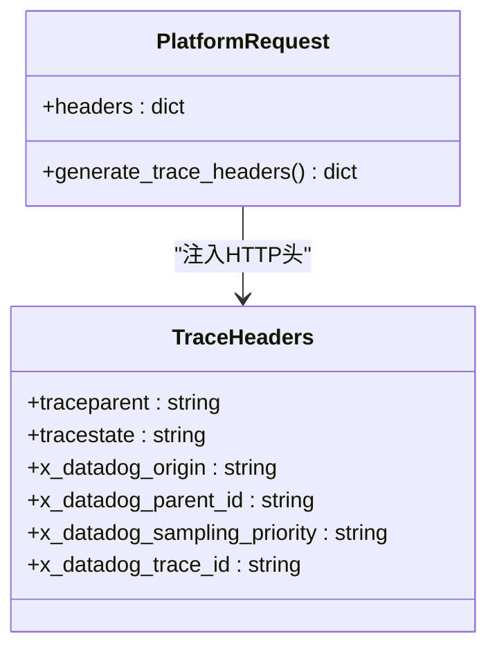
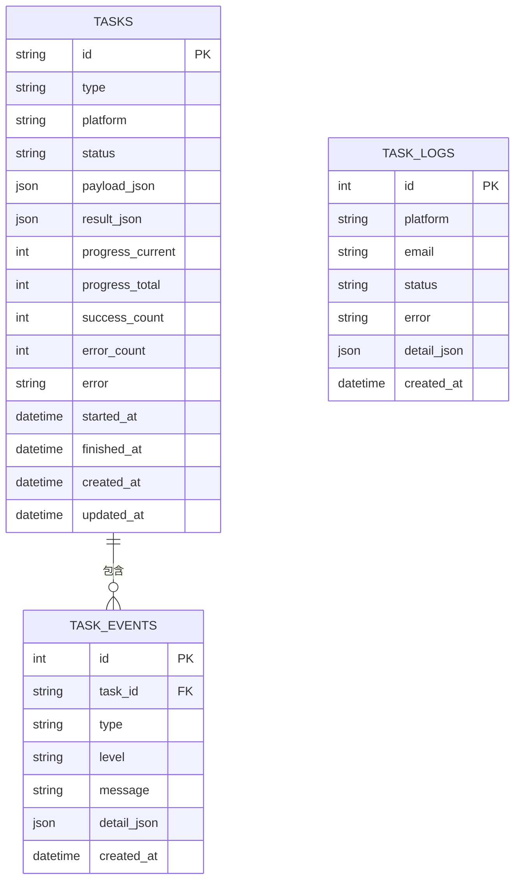
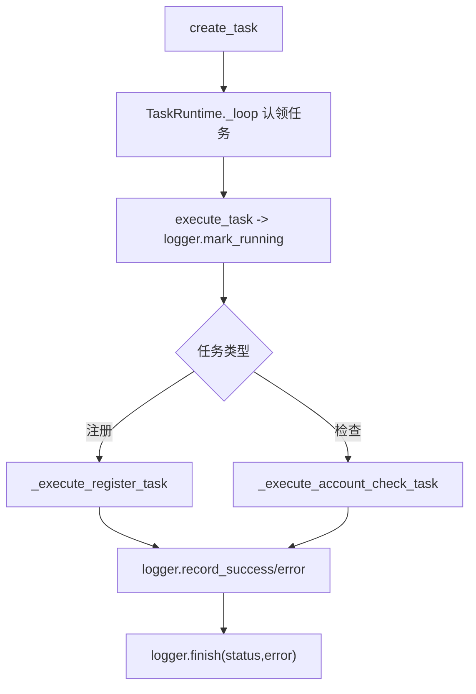
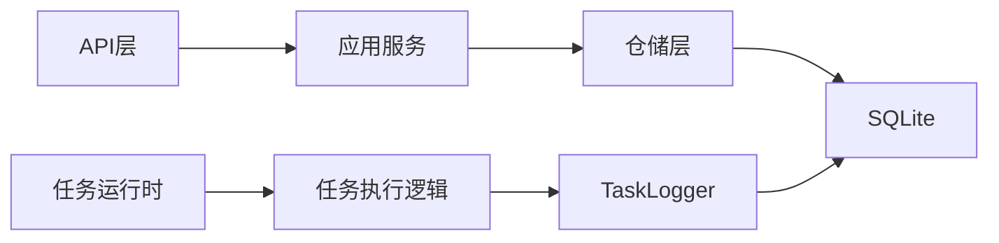

# 日志记录与追踪

<cite>
**本文引用的文件**
- [core/db.py](file://core/db.py)
- [domain/task_logs.py](file://domain/task_logs.py)
- [infrastructure/task_logs_repository.py](file://infrastructure/task_logs_repository.py)
- [application/task_logs.py](file://application/task_logs.py)
- [api/task_logs.py](file://api/task_logs.py)
- [application/tasks.py](file://application/tasks.py)
- [services/task_runtime.py](file://services/task_runtime.py)
- [application/task_commands.py](file://application/task_commands.py)
- [frontend/src/components/tasks/TaskLogPanel.tsx](file://frontend/src/components/tasks/TaskLogPanel.tsx)
- [platforms/chatgpt/register.py](file://platforms/chatgpt/register.py)
- [platforms/chatgpt/browser_register.py](file://platforms/chatgpt/browser_register.py)
- [core/datetime_utils.py](file://core/datetime_utils.py)
</cite>

## 目录
1. [简介](#简介)
2. [项目结构](#项目结构)
3. [核心组件](#核心组件)
4. [架构总览](#架构总览)
5. [详细组件分析](#详细组件分析)
6. [依赖关系分析](#依赖关系分析)
7. [性能考量](#性能考量)
8. [故障排查指南](#故障排查指南)
9. [结论](#结论)
10. [附录：使用示例与最佳实践](#附录使用示例与最佳实践)

## 简介
本文件系统性介绍 Any Auto Register 的日志记录与追踪系统，覆盖结构化日志设计、实时日志流、分布式追踪、存储与检索策略、以及分析与排障方法。目标是帮助开发者快速理解并正确使用该系统的完整能力，同时提供可操作的配置与扩展建议。

## 项目结构
日志与追踪相关代码按分层组织：
- 领域模型：任务日志记录（TaskLogRecord）
- 基础设施：数据库模型（TaskModel、TaskEventModel、TaskLog）、仓库（TaskLogsRepository）
- 应用服务：任务编排与事件写入（TaskLogger、append_task_event、list_task_events）、任务日志查询服务（TaskLogsService）
- API 层：任务日志列表接口（/tasks/logs）
- 运行时：任务调度与执行（TaskRuntime、execute_task）
- 前端：SSE 实时日志面板（TaskLogPanel）
- 平台侧：部分平台在外部调用中注入链路头（traceparent 等）

```mermaid
graph TB
subgraph "API"
A["/tasks/logs"]
end
subgraph "应用层"
B["TaskLogsService"]
C["TaskLogger / append_task_event"]
D["list_task_events"]
end
subgraph "基础设施"
E["TaskLogsRepository"]
F["DB: TaskModel / TaskEventModel / TaskLog"]
end
subgraph "运行时"
G["TaskRuntime"]
end
subgraph "前端"
H["TaskLogPanel (SSE)"]
end
A --> B
B --> E
E --> F
C --> F
D --> F
G --> C
H --> |SSE /tasks/{id}/logs/stream| D
```

图表来源
- [api/task_logs.py:11-13](file://api/task_logs.py#L11-L13)
- [application/task_logs.py:11-28](file://application/task_logs.py#L11-L28)
- [infrastructure/task_logs_repository.py:27-40](file://infrastructure/task_logs_repository.py#L27-L40)
- [core/db.py:241-285](file://core/db.py#L241-L285)
- [application/tasks.py:267-293](file://application/tasks.py#L267-L293)
- [application/task_commands.py:32-48](file://application/task_commands.py#L32-L48)
- [frontend/src/components/tasks/TaskLogPanel.tsx:67-85](file://frontend/src/components/tasks/TaskLogPanel.tsx#L67-L85)

章节来源
- [api/task_logs.py:11-13](file://api/task_logs.py#L11-L13)
- [application/task_logs.py:11-28](file://application/task_logs.py#L11-L28)
- [infrastructure/task_logs_repository.py:27-40](file://infrastructure/task_logs_repository.py#L27-L40)
- [core/db.py:241-285](file://core/db.py#L241-L285)
- [application/tasks.py:267-293](file://application/tasks.py#L267-L293)
- [application/task_commands.py:32-48](file://application/task_commands.py#L32-L48)
- [frontend/src/components/tasks/TaskLogPanel.tsx:67-85](file://frontend/src/components/tasks/TaskLogPanel.tsx#L67-L85)

## 核心组件
- 任务事件与结果持久化
  - 任务模型 TaskModel：任务元数据、进度、错误计数、时间戳等
  - 任务事件模型 TaskEventModel：每条日志/状态变更事件，包含 level、message、detail_json
  - 任务日志模型 TaskLog：注册成功/失败的汇总日志，便于统计与审计
- 任务日志写入与读取
  - TaskLogger：统一的任务内日志入口，支持 level、event_type、detail
  - append_task_event：将事件写入数据库
  - list_task_events：按 since 游标增量拉取事件
- 任务日志查询服务
  - TaskLogsService + TaskLogsRepository：分页查询 TaskLog 列表，支持按 platform 过滤
- 实时日志流
  - stream_task_events：基于 SSE 推送事件，前端通过 EventSource 消费
- 分布式追踪
  - 平台侧在外部 HTTP 请求中注入 traceparent 等头部，用于跨服务链路追踪

章节来源
- [core/db.py:241-285](file://core/db.py#L241-L285)
- [application/tasks.py:281-293](file://application/tasks.py#L281-L293)
- [application/tasks.py:371-457](file://application/tasks.py#L371-L457)
- [application/task_logs.py:11-28](file://application/task_logs.py#L11-L28)
- [infrastructure/task_logs_repository.py:27-40](file://infrastructure/task_logs_repository.py#L27-L40)
- [application/task_commands.py:32-48](file://application/task_commands.py#L32-L48)
- [platforms/chatgpt/register.py:102-114](file://platforms/chatgpt/register.py#L102-L114)
- [platforms/chatgpt/browser_register.py:1138-1149](file://platforms/chatgpt/browser_register.py#L1138-L1149)

## 架构总览
下图展示从任务创建到事件落库、再到前端实时展示的端到端流程。



图表来源
- [application/task_commands.py:32-48](file://application/task_commands.py#L32-L48)
- [application/tasks.py:267-278](file://application/tasks.py#L267-L278)
- [core/db.py:273-285](file://core/db.py#L273-L285)
- [frontend/src/components/tasks/TaskLogPanel.tsx:67-85](file://frontend/src/components/tasks/TaskLogPanel.tsx#L67-L85)

## 详细组件分析

### 结构化日志设计原则
- 字段定义
  - 任务事件：id、task_id、type、level、message、detail、created_at、line（含本地时钟前缀）
  - 任务日志：id、platform、email、status、error、detail、created_at
- 日志级别划分
  - info：常规信息
  - warning：异常但非致命
  - error：失败或需要关注的错误
- 格式规范
  - 时间统一为 UTC 并序列化为 ISO 字符串（末尾 Z）
  - 文本行 line 由 format_local_clock 生成“[HH:MM:SS] 消息”形式，便于前端渲染
- 写入路径
  - 业务侧通过 TaskLogger.log 写入事件；注册成功/失败时额外写入 TaskLog 汇总



图表来源
- [application/tasks.py:281-293](file://application/tasks.py#L281-L293)
- [application/tasks.py:161-171](file://application/tasks.py#L161-L171)
- [core/datetime_utils.py:19-23](file://core/datetime_utils.py#L19-L23)

章节来源
- [application/tasks.py:161-171](file://application/tasks.py#L161-L171)
- [application/tasks.py:281-293](file://application/tasks.py#L281-L293)
- [core/datetime_utils.py:19-23](file://core/datetime_utils.py#L19-L23)
- [domain/task_logs.py:8-17](file://domain/task_logs.py#L8-L17)

### 实时日志流处理机制
- 后端
  - stream_task_events 以 SSE 协议持续输出事件，支持 retry 提示和心跳
  - 使用 since 游标增量拉取，避免重复
- 前端
  - 使用 EventSource 连接 /tasks/{taskId}/logs/stream
  - 维护 seenEventIds 去重，cursor 推进，收到 done 后关闭连接并回调



图表来源
- [application/task_commands.py:32-48](file://application/task_commands.py#L32-L48)
- [application/tasks.py:267-278](file://application/tasks.py#L267-L278)
- [frontend/src/components/tasks/TaskLogPanel.tsx:38-85](file://frontend/src/components/tasks/TaskLogPanel.tsx#L38-L85)

章节来源
- [application/task_commands.py:32-48](file://application/task_commands.py#L32-L48)
- [application/tasks.py:267-278](file://application/tasks.py#L267-L278)
- [frontend/src/components/tasks/TaskLogPanel.tsx:38-85](file://frontend/src/components/tasks/TaskLogPanel.tsx#L38-L85)

### 分布式追踪实现方案
- 请求 ID 与链路头
  - 平台侧在发起外部请求时生成 traceparent、tracestate、x-datadog-* 等头部，用于下游链路追踪
- 跨服务跟踪
  - 通过标准 W3C Trace Context 头部传递上下文，使下游服务可关联同一链路
- 注意
  - 当前链路头由平台侧生成并附加到外部调用，未在本项目内部形成统一的 TraceContext 中间件



图表来源
- [platforms/chatgpt/register.py:102-114](file://platforms/chatgpt/register.py#L102-L114)
- [platforms/chatgpt/browser_register.py:1138-1149](file://platforms/chatgpt/browser_register.py#L1138-L1149)

章节来源
- [platforms/chatgpt/register.py:102-114](file://platforms/chatgpt/register.py#L102-L114)
- [platforms/chatgpt/browser_register.py:1138-1149](file://platforms/chatgpt/browser_register.py#L1138-L1149)

### 日志存储与检索策略
- 本地存储
  - SQLite 引擎，默认数据库文件位于项目根目录 account_manager.db
  - 表结构：tasks、task_events、task_logs
- 数据库存储
  - TaskEventModel：逐条事件，适合时序查询与回放
  - TaskLog：聚合型日志，便于按平台/邮箱统计
- 检索方式
  - 列表：TaskLogsRepository.list 支持分页与平台过滤
  - 事件：list_task_events 支持 since 游标增量拉取
  - 任务：list_tasks 支持平台/状态过滤与分页



图表来源
- [core/db.py:241-285](file://core/db.py#L241-L285)

章节来源
- [core/db.py:16-22](file://core/db.py#L16-L22)
- [core/db.py:241-285](file://core/db.py#L241-L285)
- [infrastructure/task_logs_repository.py:27-40](file://infrastructure/task_logs_repository.py#L27-L40)
- [application/task_logs.py:11-28](file://application/task_logs.py#L11-L28)

### 任务执行与日志集成
- 任务生命周期
  - 创建任务 -> 分配执行线程 -> 标记运行 -> 执行处理器 -> 记录成功/失败 -> 结束
- 日志集成点
  - 开始执行：mark_running 写入 state 事件
  - 执行过程：业务逻辑通过 TaskLogger.log 写入日志
  - 结束：finish 写入最终状态与错误摘要
- 并发控制
  - TaskRuntime 限制全局并行度与单平台并行度，避免资源竞争



图表来源
- [services/task_runtime.py:47-92](file://services/task_runtime.py#L47-L92)
- [application/tasks.py:570-595](file://application/tasks.py#L570-L595)
- [application/tasks.py:371-457](file://application/tasks.py#L371-L457)

章节来源
- [services/task_runtime.py:47-92](file://services/task_runtime.py#L47-L92)
- [application/tasks.py:570-595](file://application/tasks.py#L570-L595)
- [application/tasks.py:371-457](file://application/tasks.py#L371-L457)

## 依赖关系分析
- 低耦合分层
  - API 仅依赖 Service，Service 依赖 Repository，Repository 依赖 DB 模型
- 关键依赖链
  - TaskLogger -> append_task_event -> TaskEventModel
  - TaskLogsService -> TaskLogsRepository -> TaskLog
  - stream_task_events -> list_task_events -> TaskEventModel
- 潜在风险
  - 高并发下对 SQLite 的写压力需关注（可通过限流、批量化写入优化）
  - 前端 SSE 断线重连需健壮处理（已实现重试与健康标志）



图表来源
- [application/task_logs.py:11-28](file://application/task_logs.py#L11-L28)
- [infrastructure/task_logs_repository.py:27-40](file://infrastructure/task_logs_repository.py#L27-L40)
- [application/tasks.py:281-293](file://application/tasks.py#L281-L293)
- [services/task_runtime.py:47-92](file://services/task_runtime.py#L47-L92)

章节来源
- [application/task_logs.py:11-28](file://application/task_logs.py#L11-L28)
- [infrastructure/task_logs_repository.py:27-40](file://infrastructure/task_logs_repository.py#L27-L40)
- [application/tasks.py:281-293](file://application/tasks.py#L281-L293)
- [services/task_runtime.py:47-92](file://services/task_runtime.py#L47-L92)

## 性能考量
- 事件拉取分页与游标
  - list_task_events 限制 limit，避免一次性加载过多数据
- 前端去重与滚动
  - 使用 seenEventIds 去重，cursor 推进减少重复传输
- 数据库索引
  - task_events.task_id、task_events.type 等字段具备索引，提升查询效率
- 并发与限流
  - TaskRuntime 限制全局与单平台并行度，降低资源争用

章节来源
- [application/tasks.py:267-278](file://application/tasks.py#L267-L278)
- [core/db.py:273-285](file://core/db.py#L273-L285)
- [services/task_runtime.py:19-22](file://services/task_runtime.py#L19-L22)
- [services/task_runtime.py:47-92](file://services/task_runtime.py#L47-L92)

## 故障排查指南
- 常见问题定位
  - 任务中断：启动时会将未完成任务标记为 interrupted，并写入警告事件
  - 取消任务：请求取消后会写入警告事件，并在执行中检测取消标志
  - 事件丢失：前端通过 since 游标与去重保证不丢不漏
- 诊断步骤
  - 查看任务状态与错误计数
  - 拉取事件流，定位失败阶段
  - 查看 TaskLog 汇总，确认平台/邮箱维度结果
- 工具与接口
  - /tasks/logs：分页查询任务日志
  - /tasks/{id}/logs/stream：SSE 实时事件流
  - /tasks：任务列表与详情

章节来源
- [application/tasks.py:296-316](file://application/tasks.py#L296-L316)
- [application/tasks.py:318-338](file://application/tasks.py#L318-L338)
- [api/task_logs.py:11-13](file://api/task_logs.py#L11-L13)
- [application/task_commands.py:32-48](file://application/task_commands.py#L32-L48)

## 结论
该系统通过清晰的分层设计与标准化的事件模型，实现了可靠的日志记录、实时推送与基础分布式追踪能力。结合 SQLite 的轻量存储与 SSE 的实时性，满足自动化注册场景下的可观测性与可运维性需求。建议在后续演进中引入更完善的链路追踪中间件与日志轮转策略，以支撑更大规模与更高吞吐的场景。

## 附录：使用示例与最佳实践
- 添加自定义日志
  - 在任务执行过程中使用 TaskLogger.log(message, level="info|warning|error", event_type="log|state", detail={...})
  - 参考路径：[application/tasks.py:371-383](file://application/tasks.py#L371-L383)
- 配置日志轮转
  - 当前事件与汇总日志均持久化至 SQLite；如需轮转，可在部署层对数据库文件进行归档与清理策略
  - 参考路径：[core/db.py:16-22](file://core/db.py#L16-L22)
- 设置告警规则
  - 基于 TaskLog 的 status=failed 与 error 字段，结合定时任务或监控探针触发告警
  - 参考路径：[domain/task_logs.py:8-17](file://domain/task_logs.py#L8-L17)、[infrastructure/task_logs_repository.py:27-40](file://infrastructure/task_logs_repository.py#L27-L40)
- 前端接入实时日志
  - 使用 EventSource 连接 /tasks/{taskId}/logs/stream，处理 data 事件并渲染
  - 参考路径：[frontend/src/components/tasks/TaskLogPanel.tsx:67-85](file://frontend/src/components/tasks/TaskLogPanel.tsx#L67-L85)
- 分布式追踪
  - 在平台侧外部调用中注入 traceparent 等头部，确保下游可关联链路
  - 参考路径：[platforms/chatgpt/register.py:102-114](file://platforms/chatgpt/register.py#L102-L114)、[platforms/chatgpt/browser_register.py:1138-1149](file://platforms/chatgpt/browser_register.py#L1138-L1149)