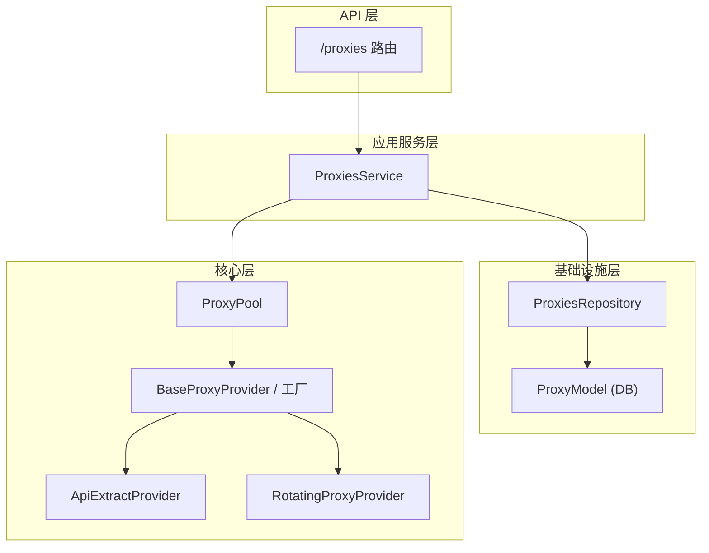
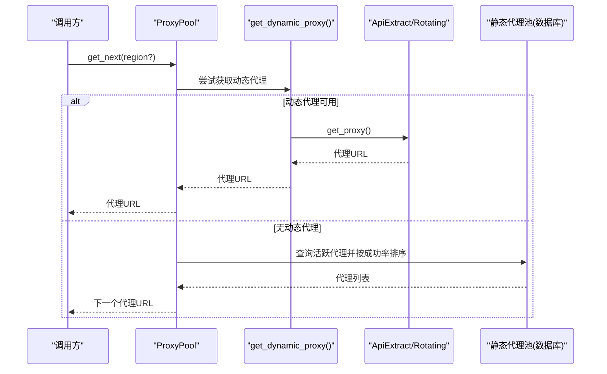
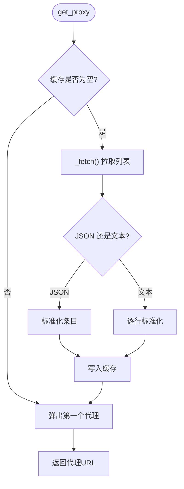
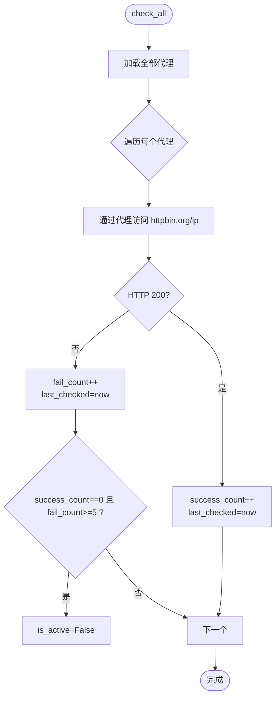
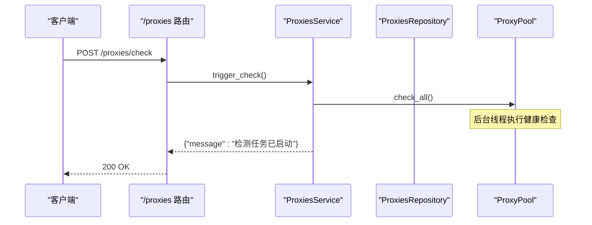
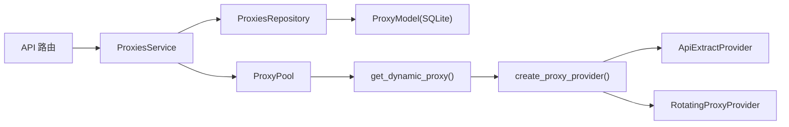

# 代理服务集成

<cite>
**本文引用的文件**
- [api_extract.py](file://providers/proxy/api_extract.py)
- [rotating_gateway.py](file://providers/proxy/rotating_gateway.py)
- [proxy_providers.py](file://core/proxy_providers.py)
- [proxy_pool.py](file://core/proxy_pool.py)
- [proxies_repository.py](file://infrastructure/proxies_repository.py)
- [proxies.py](file://application/proxies.py)
- [proxies.py](file://api/proxies.py)
- [db.py](file://core/db.py)
- [proxies.py](file://domain/proxies.py)
- [test_proxy_providers.py](file://tests/test_proxy_providers.py)
</cite>

## 目录
1. [简介](#简介)
2. [项目结构](#项目结构)
3. [核心组件](#核心组件)
4. [架构总览](#架构总览)
5. [详细组件分析](#详细组件分析)
6. [依赖关系分析](#依赖关系分析)
7. [性能考量](#性能考量)
8. [故障排查指南](#故障排查指南)
9. [结论](#结论)
10. [附录：配置与最佳实践](#附录：配置与最佳实践)

## 简介
本文件系统性阐述代理服务的集成实现，覆盖两类动态代理提供者（API 提取器、旋转网关）以及静态代理池的协同工作。重点包括：
- 代理获取与健康检查：从第三方 API 拉取或固定网关返回，结合质量评估与自动轮换。
- 代理池管理：添加、批量导入、启用/禁用、按区域筛选、负载均衡与故障转移。
- 错误处理：连接超时、IP 被封、代理失效等场景的处理策略。
- 配置管理：代理源配置、轮换策略、认证设置。
- 集成示例与最佳实践：监控、优化与成本控制。

## 项目结构
代理相关代码分层清晰：
- API 层：暴露 REST 接口用于增删改查与触发健康检查。
- 应用服务层：编排业务逻辑，协调仓库与代理池。
- 基础设施层：数据库读写（SQLModel）。
- 核心层：动态代理提供者抽象与工厂、代理池调度。
- 领域模型：统一的数据结构与命令对象。

**图表来源**
- [proxies.py:1-59](file://api/proxies.py#L1-L59)
- [proxies.py:1-49](file://application/proxies.py#L1-L49)
- [proxies_repository.py:1-72](file://infrastructure/proxies_repository.py#L1-L72)
- [db.py:291-301](file://core/db.py#L291-L301)
- [proxy_providers.py:20-74](file://core/proxy_providers.py#L20-L74)
- [proxy_pool.py:1-91](file://core/proxy_pool.py#L1-L91)

**章节来源**
- [proxies.py:1-59](file://api/proxies.py#L1-L59)
- [proxies.py:1-49](file://application/proxies.py#L1-L49)
- [proxies_repository.py:1-72](file://infrastructure/proxies_repository.py#L1-L72)
- [db.py:291-301](file://core/db.py#L291-L301)
- [proxy_providers.py:20-74](file://core/proxy_providers.py#L20-L74)
- [proxy_pool.py:1-91](file://core/proxy_pool.py#L1-L91)

## 核心组件
- 动态代理提供者基类与工厂：定义统一接口 get_proxy()，并按 provider_key 创建具体实现。
- API 提取器：调用 HTTP API 获取代理列表，支持文本行与多种 JSON 格式，自动补全协议与可选认证。
- 旋转网关：固定网关地址，每次请求由网关侧自动切换出口 IP。
- 代理池：优先使用动态代理；若无则回退到静态代理池，按成功率排序轮询，支持区域过滤。
- 健康检查：对静态代理进行连通性检测，更新成功/失败计数并自动禁用连续失败的代理。
- 数据持久化：通过 SQLModel 维护代理记录与状态。

**章节来源**
- [proxy_providers.py:20-103](file://core/proxy_providers.py#L20-L103)
- [api_extract.py:16-106](file://providers/proxy/api_extract.py#L16-L106)
- [rotating_gateway.py:10-31](file://providers/proxy/rotating_gateway.py#L10-L31)
- [proxy_pool.py:9-91](file://core/proxy_pool.py#L9-L91)
- [db.py:291-301](file://core/db.py#L291-L301)

## 架构总览
下图展示了“获取代理”的主流程：上层先尝试动态代理提供者（API 提取器或旋转网关），若不可用则回退至静态代理池；健康检查在后台线程中运行，持续评估代理质量。

**图表来源**
- [proxy_pool.py:14-45](file://core/proxy_pool.py#L14-L45)
- [proxy_providers.py:77-103](file://core/proxy_providers.py#L77-L103)
- [api_extract.py:99-106](file://providers/proxy/api_extract.py#L99-L106)
- [rotating_gateway.py:29-31](file://providers/proxy/rotating_gateway.py#L29-L31)

## 详细组件分析

### API 提取器（ApiExtractProvider）
- 功能要点
  - 从配置的 API URL 拉取代理列表，支持纯文本（每行一个）与 JSON（数组或包含 data/proxies/list 等键的对象）。
  - 自动规范化为完整 URL，支持 http/https/socks4/socks5 协议，并可注入用户名/密码。
  - 内部缓存代理列表，逐个弹出，耗尽后重新拉取。
  - 异常时记录警告并返回空结果，保证健壮性。
- 关键路径
  - 构造参数：api_url、protocol、username、password、timeout。
  - from_config：从配置读取 proxy_api_url、proxy_protocol、proxy_username、proxy_password。
  - _fetch/_normalize/_looks_like_proxy：解析与格式化。
  - get_proxy：线程安全地返回下一个代理。

**图表来源**
- [api_extract.py:54-106](file://providers/proxy/api_extract.py#L54-L106)

**章节来源**
- [api_extract.py:16-106](file://providers/proxy/api_extract.py#L16-L106)
- [test_proxy_providers.py:15-101](file://tests/test_proxy_providers.py#L15-L101)

### 旋转网关（RotatingProxyProvider）
- 功能要点
  - 固定网关地址，每次请求返回同一网关 URL，由网关侧负责出口 IP 轮换。
  - 适用于 BrightData、Oxylabs、IPRoyal 等提供固定入口的代理商。
- 关键路径
  - 构造参数：gateway_url。
  - from_config：从配置读取 proxy_gateway_url。
  - get_proxy：始终返回网关 URL（非空）。

**章节来源**
- [rotating_gateway.py:10-31](file://providers/proxy/rotating_gateway.py#L10-L31)
- [test_proxy_providers.py:103-113](file://tests/test_proxy_providers.py#L103-L113)

### 动态代理提供者工厂与发现
- 工厂 create_proxy_provider：根据 provider_key 选择 ApiExtractProvider 或 RotatingProxyProvider，并校验必要配置。
- 动态发现 get_dynamic_proxy：从 ProviderSettingsRepository 读取已启用的代理配置，合并 config/auth/extra，依次尝试获取代理，任一成功即返回。
- 懒加载：通过 __getattr__ 延迟导入具体模块，降低启动开销。

**章节来源**
- [proxy_providers.py:20-103](file://core/proxy_providers.py#L20-L103)
- [test_proxy_providers.py:115-134](file://tests/test_proxy_providers.py#L115-L134)

### 代理池（ProxyPool）
- 优先级策略
  - 优先尝试动态代理（API 提取器/旋转网关）。
  - 若无动态代理，回退到静态代理池（数据库中的活跃代理）。
- 负载均衡
  - 按 success_count/(success_count+fail_count) 计算成功率并降序排序，轮询选取。
  - 支持 region 过滤。
- 健康检查
  - check_all：遍历所有代理，访问 httpbin.org/ip 验证连通性，成功则增加 success_count，失败则增加 fail_count。
  - 自动禁用：当 success_count==0 且 fail_count>=5 时，标记 is_active=False。
- 报告接口
  - report_success/report_fail：供外部调用以更新统计与最后检查时间。

**图表来源**
- [proxy_pool.py:68-87](file://core/proxy_pool.py#L68-L87)

**章节来源**
- [proxy_pool.py:9-91](file://core/proxy_pool.py#L9-L91)

### 数据模型与仓储
- 领域模型
  - ProxyRecord：代理记录（id、url、region、success/fail 计数、是否活跃、最后检查时间）。
  - 命令对象：ProxyCreateCommand、ProxyBulkCreateCommand、ProxyCheckSummary。
- 数据库模型
  - ProxyModel：映射 proxies 表，字段包括 url（唯一）、region、计数、is_active、last_checked。
- 仓储 ProxiesRepository
  - list/create/bulk_create/delete/toggle：封装 CRUD 与去重、批量插入、启用/禁用切换。

**章节来源**
- [proxies.py:8-35](file://domain/proxies.py#L8-L35)
- [db.py:291-301](file://core/db.py#L291-L301)
- [proxies_repository.py:1-72](file://infrastructure/proxies_repository.py#L1-L72)

### API 与服务编排
- API 路由
  - GET /proxies：列出所有代理。
  - POST /proxies：新增单个代理（重复返回 400）。
  - POST /proxies/bulk：批量新增。
  - DELETE /proxies/{id}：删除代理。
  - PATCH /proxies/{id}/toggle：切换启用/禁用。
  - POST /proxies/check：异步触发健康检查。
- 服务 ProxiesService
  - 聚合仓储操作，序列化输出。
  - trigger_check 启动后台线程执行 proxy_pool.check_all。

**图表来源**
- [proxies.py:57-59](file://api/proxies.py#L57-L59)
- [proxies.py:34-36](file://application/proxies.py#L34-L36)
- [proxy_pool.py:68-87](file://core/proxy_pool.py#L68-L87)

**章节来源**
- [proxies.py:1-59](file://api/proxies.py#L1-L59)
- [proxies.py:1-49](file://application/proxies.py#L1-L49)

## 依赖关系分析
- 耦合与内聚
  - 动态代理提供者与工厂解耦，通过 provider_key 扩展新类型。
  - 代理池与提供者通过统一接口交互，便于替换与测试。
  - 仓储与模型分离，便于单元测试与数据迁移。
- 外部依赖
  - requests：用于 API 提取与健康检查。
  - SQLModel/SQLite：本地持久化。
- 潜在循环依赖
  - 当前设计避免直接循环引用，采用延迟导入与分层隔离。

**图表来源**
- [proxy_providers.py:53-74](file://core/proxy_providers.py#L53-L74)
- [proxy_pool.py:14-45](file://core/proxy_pool.py#L14-L45)
- [proxies_repository.py:21-72](file://infrastructure/proxies_repository.py#L21-L72)

**章节来源**
- [proxy_providers.py:53-103](file://core/proxy_providers.py#L53-L103)
- [proxy_pool.py:14-91](file://core/proxy_pool.py#L14-L91)
- [proxies_repository.py:21-72](file://infrastructure/proxies_repository.py#L21-L72)

## 性能考量
- 动态代理缓存：API 提取器内部缓存列表，减少频繁网络请求。
- 负载均衡：按成功率排序并轮询，提升整体可用性。
- 健康检查：后台线程执行，避免阻塞主流程；限制超时与目标站点以降低开销。
- 数据库访问：使用 Session 上下文管理，批量插入减少事务次数。
- 建议
  - 合理设置 API 提取器的 timeout 与重试策略。
  - 定期触发健康检查，保持代理质量数据新鲜。
  - 对高并发场景考虑连接池与异步 I/O 改造。

[本节为通用指导，不直接分析具体文件]

## 故障排查指南
- 常见问题与定位
  - 动态代理未配置：工厂会抛出运行时错误，提示缺少 API URL 或网关地址。
  - API 请求失败：日志记录警告，返回 None，系统自动回退到静态代理池。
  - 代理连续失败：自动禁用，需人工介入修复或更换。
  - 健康检查超时：检查网络连通性与目标站点可达性。
- 排查步骤
  - 查看 API 层响应与日志，确认请求是否到达服务。
  - 检查 ProviderSettings 是否正确启用并配置了必要的认证信息。
  - 使用 /proxies/check 触发健康检查，观察 success/fail 计数变化。
  - 核对数据库 proxies 表的 is_active 与 last_checked 字段。
- 恢复策略
  - 对连续失败的代理进行隔离与修复，必要时删除重建。
  - 调整 API 提取器的协议与认证参数，确保能正确解析返回内容。
  - 对于旋转网关，确认网关地址有效且具备鉴权能力。

**章节来源**
- [proxy_providers.py:53-74](file://core/proxy_providers.py#L53-L74)
- [api_extract.py:54-62](file://providers/proxy/api_extract.py#L54-L62)
- [proxy_pool.py:56-87](file://core/proxy_pool.py#L56-L87)

## 结论
本代理子系统通过“动态提供者 + 静态池”的双轨机制，实现了高可用的代理获取与自动轮换。API 提取器兼容多种返回格式，旋转网关简化了复杂供应商的接入；代理池基于成功率进行负载均衡，并结合健康检查实现故障转移。配合完善的 API 与服务编排，可快速集成到各类平台注册与自动化流程中。

[本节为总结性内容，不直接分析具体文件]

## 附录：配置与最佳实践

### 支持的代理服务类型
- API 提取器（api_extract）
  - 适用场景：第三方提供“拉取代理列表”的 HTTP API。
  - 关键配置项
    - proxy_api_url：代理列表 API 地址。
    - proxy_protocol：默认协议（http/https/socks4/socks5）。
    - proxy_username/proxy_password：可选认证，将注入到代理 URL。
- 旋转网关（rotating_gateway）
  - 适用场景：固定网关地址，出口 IP 由服务商自动轮换。
  - 关键配置项
    - proxy_gateway_url：网关地址（通常含用户与密码）。

**章节来源**
- [proxy_providers.py:53-74](file://core/proxy_providers.py#L53-L74)
- [api_extract.py:25-52](file://providers/proxy/api_extract.py#L25-L52)
- [rotating_gateway.py:19-27](file://providers/proxy/rotating_gateway.py#L19-L27)

### 轮换策略与负载均衡
- 动态优先：若配置了启用的动态代理，优先使用。
- 静态回退：无动态代理时，从数据库中选择活跃代理，按成功率排序轮询。
- 区域过滤：可按 region 筛选代理，满足地域需求。

**章节来源**
- [proxy_pool.py:14-45](file://core/proxy_pool.py#L14-L45)

### 认证设置
- API 提取器支持在代理 URL 中注入用户名与密码。
- 旋转网关需在网关 URL 中携带认证信息。
- 配置来源于 ProviderSettingsRepository，支持多实例与默认值。

**章节来源**
- [proxy_providers.py:82-103](file://core/proxy_providers.py#L82-L103)
- [api_extract.py:89-97](file://providers/proxy/api_extract.py#L89-L97)

### 集成示例（步骤指引）
- 启用 API 提取器
  - 在 ProviderSettings 中添加类型为 proxy、key 为 api_extract 的配置，填写 proxy_api_url、可选协议与认证。
  - 调用 /proxies/check 触发健康检查，观察统计变化。
- 启用旋转网关
  - 在 ProviderSettings 中添加类型为 proxy、key 为 rotating_gateway 的配置，填写 proxy_gateway_url。
  - 直接使用返回的网关 URL 发起请求，由网关负责轮换。
- 管理静态代理
  - 通过 /proxies 接口新增或批量导入代理。
  - 使用 toggle 控制启用/禁用，使用 check 触发健康检查。

**章节来源**
- [proxies.py:1-59](file://api/proxies.py#L1-L59)
- [proxies.py:1-49](file://application/proxies.py#L1-L49)

### 监控与成本优化
- 监控指标
  - 成功/失败计数、最后检查时间、启用状态。
  - 动态代理获取成功率与耗时。
- 优化建议
  - 定期清理长期失败的代理，减少无效请求。
  - 对高频场景使用旋转网关，降低拉取开销。
  - 合理设置超时与重试，避免雪崩。
- 成本控制
  - 按需启用动态代理，避免不必要的 API 调用。
  - 对静态代理进行区域与质量分级，优先使用高性价比代理。

[本节为通用指导，不直接分析具体文件]