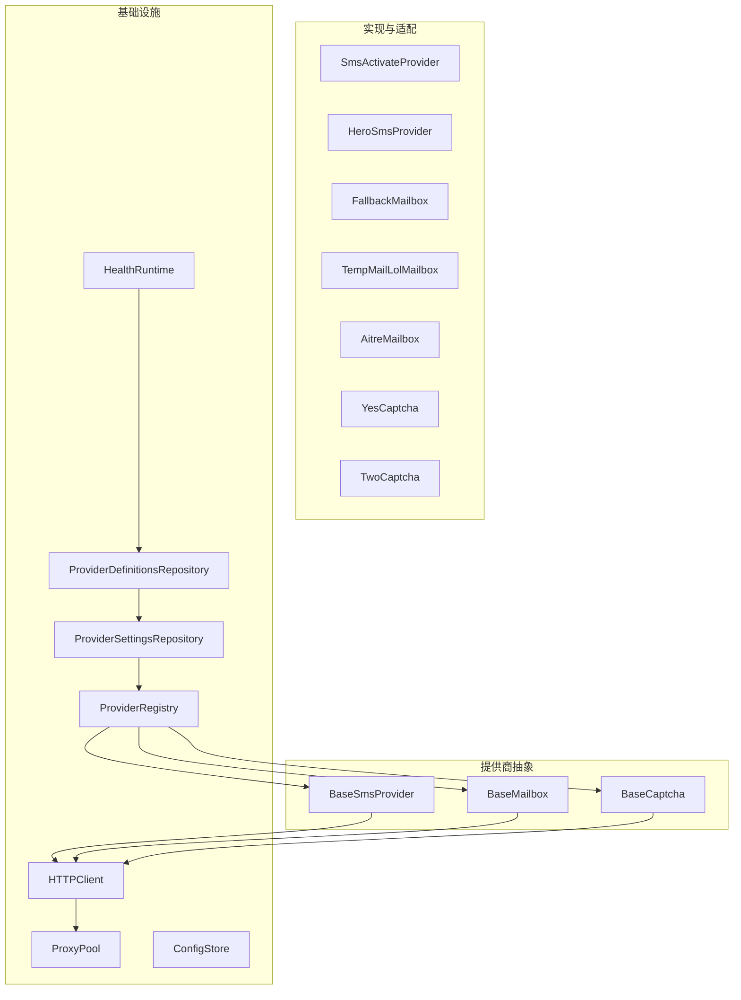
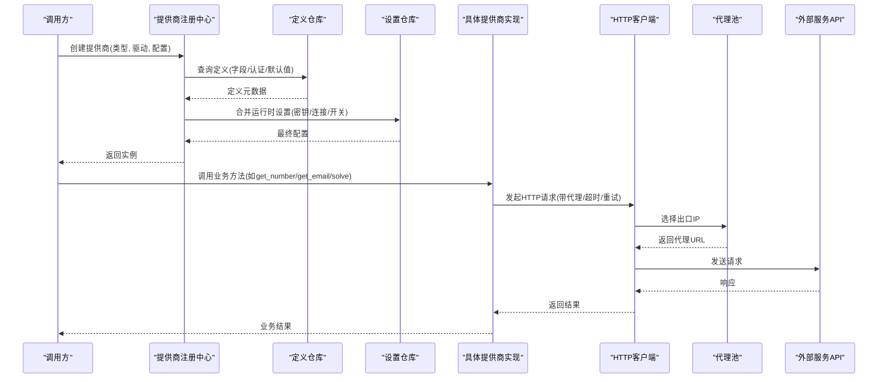
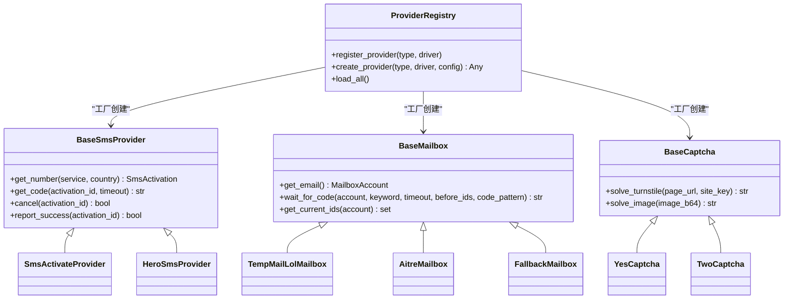
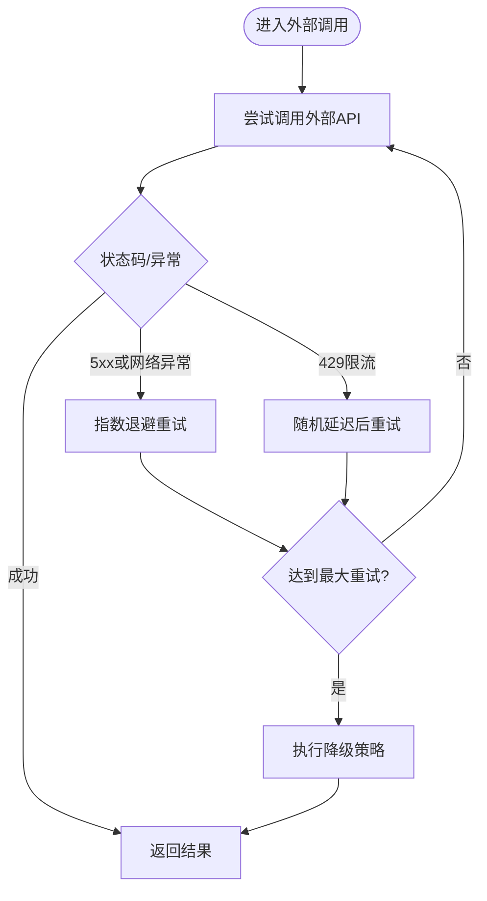
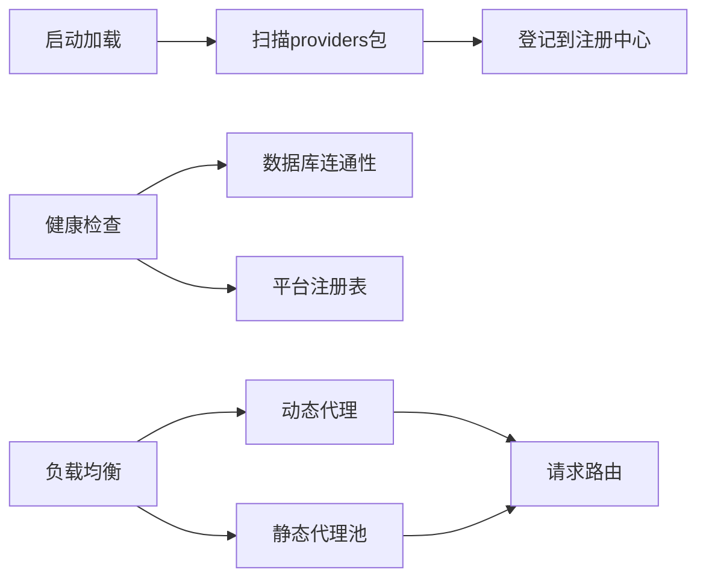
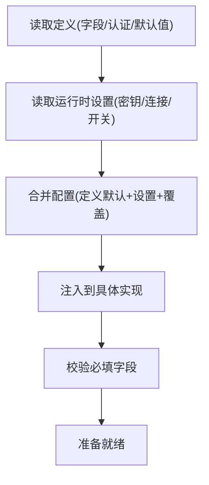
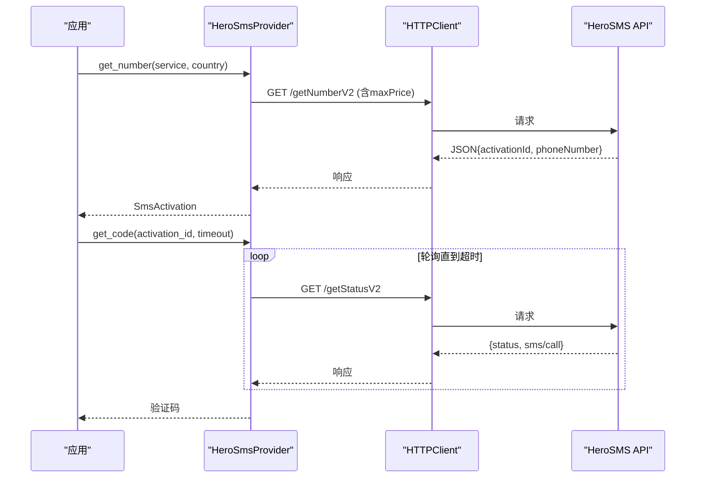
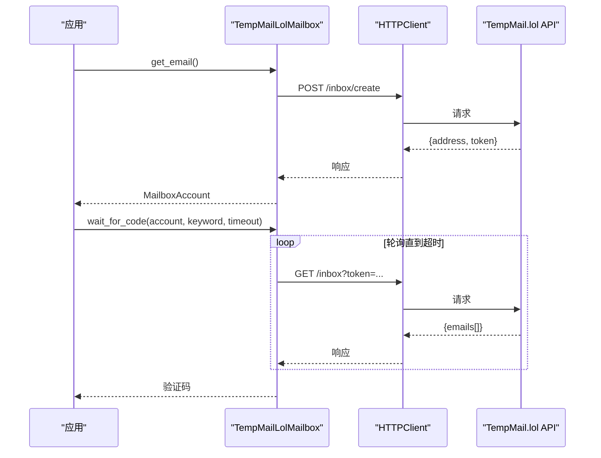
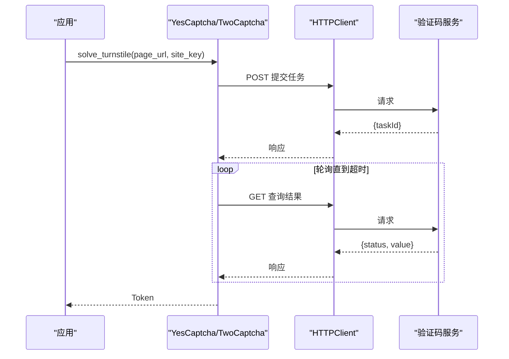
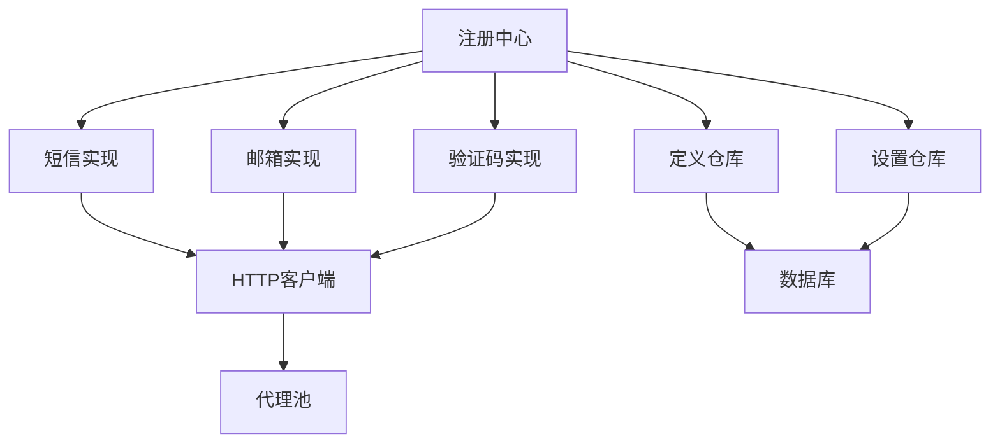

# 外部服务集成模式

<cite>
**本文引用的文件**
- [providers/registry.py](file://providers/registry.py)
- [core/base_sms.py](file://core/base_sms.py)
- [core/base_mailbox.py](file://core/base_mailbox.py)
- [core/base_captcha.py](file://core/base_captcha.py)
- [infrastructure/provider_definitions_repository.py](file://infrastructure/provider_definitions_repository.py)
- [infrastructure/provider_settings_repository.py](file://infrastructure/provider_settings_repository.py)
- [core/http_client.py](file://core/http_client.py)
- [core/proxy_pool.py](file://core/proxy_pool.py)
- [core/config_store.py](file://core/config_store.py)
- [core/registration/errors.py](file://core/registration/errors.py)
- [infrastructure/health_runtime.py](file://infrastructure/health_runtime.py)
- [services/turnstile_solver/db_results.py](file://services/turnstile_solver/db_results.py)
</cite>

## 目录
1. [简介](#简介)
2. [项目结构](#项目结构)
3. [核心组件](#核心组件)
4. [架构总览](#架构总览)
5. [详细组件分析](#详细组件分析)
6. [依赖关系分析](#依赖关系分析)
7. [性能考量](#性能考量)
8. [故障排查指南](#故障排查指南)
9. [结论](#结论)
10. [附录](#附录)

## 简介
本文件系统性阐述 Any Auto Register 的外部服务集成模式设计，覆盖提供商抽象层、适配器与工厂、依赖注入、错误处理（异常分类、重试、降级、熔断）、服务发现（动态注册、健康检查、负载均衡）、配置管理（连接参数、认证信息、超时、限流），以及短信、邮箱、验证码等具体接入示例与性能优化策略（连接池、缓存、异步）。

## 项目结构
系统围绕“提供商类型”进行解耦：短信（sms）、邮箱（mailbox）、验证码（captcha）、代理（proxy）各自拥有统一抽象与多实现。运行时通过数据库中的“定义+设置”驱动实例化，结合工厂方法完成装配；HTTP 客户端提供统一网络能力；代理池负责出口 IP 选择与健康度统计；健康检查暴露服务就绪状态。

图表来源
- [providers/registry.py:1-91](file://providers/registry.py#L1-L91)
- [core/base_sms.py:28-182](file://core/base_sms.py#L28-L182)
- [core/base_mailbox.py:27-348](file://core/base_mailbox.py#L27-L348)
- [core/base_captcha.py:5-98](file://core/base_captcha.py#L5-L98)
- [infrastructure/provider_definitions_repository.py:387-561](file://infrastructure/provider_definitions_repository.py#L387-L561)
- [infrastructure/provider_settings_repository.py:15-167](file://infrastructure/provider_settings_repository.py#L15-L167)
- [core/http_client.py:39-145](file://core/http_client.py#L39-L145)
- [core/proxy_pool.py:9-91](file://core/proxy_pool.py#L9-L91)
- [core/config_store.py:13-49](file://core/config_store.py#L13-L49)
- [infrastructure/health_runtime.py:11-41](file://infrastructure/health_runtime.py#L11-L41)

章节来源
- [providers/registry.py:1-91](file://providers/registry.py#L1-L91)
- [core/base_sms.py:28-182](file://core/base_sms.py#L28-L182)
- [core/base_mailbox.py:27-348](file://core/base_mailbox.py#L27-L348)
- [core/base_captcha.py:5-98](file://core/base_captcha.py#L5-L98)
- [infrastructure/provider_definitions_repository.py:387-561](file://infrastructure/provider_definitions_repository.py#L387-L561)
- [infrastructure/provider_settings_repository.py:15-167](file://infrastructure/provider_settings_repository.py#L15-L167)
- [core/http_client.py:39-145](file://core/http_client.py#L39-L145)
- [core/proxy_pool.py:9-91](file://core/proxy_pool.py#L9-L91)
- [core/config_store.py:13-49](file://core/config_store.py#L13-L49)
- [infrastructure/health_runtime.py:11-41](file://infrastructure/health_runtime.py#L11-L41)

## 核心组件
- 提供商注册中心：集中维护各类型提供商的类映射，支持启动时自动扫描加载，并提供统一工厂创建实例。
- 短信提供商抽象：定义租号、取码、取消、成功上报等接口；内置 SMS-Activate 与 HeroSMS 两种实现，含号码复用、重发、价格自适应等策略。
- 邮箱提供商抽象：定义获取邮箱、等待验证码/链接、当前邮件 ID 集合等接口；内置多种临时邮箱与固定邮箱实现，并支持按顺序回退的多 provider 组合。
- 验证码提供商抽象：定义 Turnstile 与图片验证码求解接口；支持本地求解器、人工打码与第三方云端识别。
- 配置与定义仓库：从数据库读取提供商元数据（字段、认证方式、默认值）与运行时设置（密钥、连接地址、开关），合并后注入到具体实现。
- HTTP 客户端：封装 curl_cffi Session，统一代理、超时、重试、SSL 校验、重定向控制。
- 代理池：优先使用动态代理，否则从数据库轮询静态代理，基于成功率排序与失败禁用机制。
- 健康检查：聚合数据库连通性、平台注册表可用性、求解器运行状态。

章节来源
- [providers/registry.py:38-91](file://providers/registry.py#L38-L91)
- [core/base_sms.py:28-182](file://core/base_sms.py#L28-L182)
- [core/base_mailbox.py:27-348](file://core/base_mailbox.py#L27-L348)
- [core/base_captcha.py:5-98](file://core/base_captcha.py#L5-L98)
- [infrastructure/provider_definitions_repository.py:387-561](file://infrastructure/provider_definitions_repository.py#L387-L561)
- [infrastructure/provider_settings_repository.py:15-167](file://infrastructure/provider_settings_repository.py#L15-L167)
- [core/http_client.py:39-145](file://core/http_client.py#L39-L145)
- [core/proxy_pool.py:9-91](file://core/proxy_pool.py#L9-L91)
- [infrastructure/health_runtime.py:11-41](file://infrastructure/health_runtime.py#L11-L41)

## 架构总览
下图展示从调用方到具体外部服务的请求链路，包括提供商解析、配置合并、HTTP 调用、代理选择与重试。

图表来源
- [providers/registry.py:51-63](file://providers/registry.py#L51-L63)
- [infrastructure/provider_definitions_repository.py:437-450](file://infrastructure/provider_definitions_repository.py#L437-L450)
- [infrastructure/provider_settings_repository.py:39-55](file://infrastructure/provider_settings_repository.py#L39-L55)
- [core/http_client.py:85-145](file://core/http_client.py#L85-L145)
- [core/proxy_pool.py:14-45](file://core/proxy_pool.py#L14-L45)

## 详细组件分析

### 提供商抽象层与适配器模式
- 统一接口：短信、邮箱、验证码均通过 ABC 定义最小必要接口，屏蔽底层差异。
- 适配器/工厂：注册中心在启动时扫描 providers 包，将标注的类加入全局映射；create_provider 根据类型与驱动查找类并调用 from_config 构造实例。
- 依赖注入：具体实现所需连接参数、认证信息、开关由 ProviderSettingsRepository 与 ProviderDefinitionsRepository 合并后注入，避免硬编码。

图表来源
- [core/base_sms.py:28-182](file://core/base_sms.py#L28-L182)
- [core/base_mailbox.py:27-348](file://core/base_mailbox.py#L27-L348)
- [core/base_captcha.py:5-98](file://core/base_captcha.py#L5-L98)
- [providers/registry.py:38-91](file://providers/registry.py#L38-L91)

章节来源
- [core/base_sms.py:28-182](file://core/base_sms.py#L28-L182)
- [core/base_mailbox.py:27-348](file://core/base_mailbox.py#L27-L348)
- [core/base_captcha.py:5-98](file://core/base_captcha.py#L5-L98)
- [providers/registry.py:38-91](file://providers/registry.py#L38-L91)

### 错误处理策略
- 异常分类：注册流程相关异常集中在 core/registration/errors.py，涵盖身份解析、验证码配置、OTP 超时、浏览器会话复用、平台不支持等场景。
- 重试机制：HTTP 客户端对 5xx 与网络异常进行指数退避重试；临时邮箱 Web 方案对 429 做有限次重试与随机延迟。
- 降级处理：邮箱 FallbackMailbox 按顺序尝试多个 provider，任一成功即固定后续收发；短信 HeroSMS 在 V2 失败时回退到 V1 接口。
- 熔断保护：代理池对连续失败的代理自动禁用；短信 HeroSMS 对号码复用设置最大次数与生命周期，避免无限重用。

图表来源
- [core/http_client.py:114-145](file://core/http_client.py#L114-L145)
- [core/base_mailbox.py:718-772](file://core/base_mailbox.py#L718-L772)
- [core/base_sms.py:670-712](file://core/base_sms.py#L670-L712)
- [core/proxy_pool.py:56-66](file://core/proxy_pool.py#L56-L66)

章节来源
- [core/registration/errors.py:4-26](file://core/registration/errors.py#L4-L26)
- [core/http_client.py:114-145](file://core/http_client.py#L114-L145)
- [core/base_mailbox.py:718-772](file://core/base_mailbox.py#L718-L772)
- [core/base_sms.py:670-712](file://core/base_sms.py#L670-L712)
- [core/proxy_pool.py:56-66](file://core/proxy_pool.py#L56-L66)

### 服务发现机制
- 动态注册：注册中心在启动时导入 providers.captcha/proxy/sms/mailbox 子模块，并通过装饰器将实现类登记到全局映射。
- 健康检查：HealthRuntime 检测数据库连通性与平台注册表可用性，并报告求解器是否运行。
- 负载均衡：代理池按成功率排序轮询静态代理；动态代理优先于静态池；短信 HeroSMS 可自动选择最优国家（价格最低且库存充足）。

图表来源
- [providers/registry.py:70-91](file://providers/registry.py#L70-L91)
- [infrastructure/health_runtime.py:11-41](file://infrastructure/health_runtime.py#L11-L41)
- [core/proxy_pool.py:14-45](file://core/proxy_pool.py#L14-L45)
- [core/base_sms.py:527-579](file://core/base_sms.py#L527-L579)

章节来源
- [providers/registry.py:70-91](file://providers/registry.py#L70-L91)
- [infrastructure/health_runtime.py:11-41](file://infrastructure/health_runtime.py#L11-L41)
- [core/proxy_pool.py:14-45](file://core/proxy_pool.py#L14-L45)
- [core/base_sms.py:527-579](file://core/base_sms.py#L527-L579)

### 配置管理
- 连接参数：各提供商定义中包含 API 地址、域名、Scope 等连接字段，运行时通过 settings 合并。
- 认证信息：auth_modes 与 fields 描述认证方式（token、apikey、password、pool 等），敏感字段标记为 secret。
- 超时设置：HTTP 客户端默认超时与重试延迟可配置；各 provider 内部也设置独立超时。
- 限流配置：HTTP 客户端对 5xx 与 429 做重试与退避；代理池对失败代理自动禁用；邮箱 Web 方案对 429 做有限重试。

图表来源
- [infrastructure/provider_definitions_repository.py:437-450](file://infrastructure/provider_definitions_repository.py#L437-L450)
- [infrastructure/provider_settings_repository.py:39-55](file://infrastructure/provider_settings_repository.py#L39-L55)
- [core/http_client.py:23-32](file://core/http_client.py#L23-L32)

章节来源
- [infrastructure/provider_definitions_repository.py:437-450](file://infrastructure/provider_definitions_repository.py#L437-L450)
- [infrastructure/provider_settings_repository.py:39-55](file://infrastructure/provider_settings_repository.py#L39-L55)
- [core/http_client.py:23-32](file://core/http_client.py#L23-L32)

### 集成示例

#### 短信服务提供商接入（以 HeroSMS 为例）
- 定义与设置：在定义仓库中声明 hero-sms_api 驱动及其字段（API Key、默认国家/服务、最大价格、自动选国等）。
- 运行时创建：通过 create_provider 或上层回调，传入 provider_key 与配置，实例化 HeroSmsProvider。
- 业务流程：get_number 获取号码（支持动态价格与 V2/V1 回退），get_code 轮询取码，report_success/cancel 管理生命周期。
- 性能优化：号码复用缓存（进程内+持久化文件），限制复用次数与有效期；自动选国按价格与库存择优。

图表来源
- [core/base_sms.py:328-800](file://core/base_sms.py#L328-L800)
- [core/http_client.py:85-145](file://core/http_client.py#L85-L145)

章节来源
- [core/base_sms.py:328-800](file://core/base_sms.py#L328-L800)
- [core/http_client.py:85-145](file://core/http_client.py#L85-L145)

#### 邮箱服务提供商接入（以 TempMail.lol 为例）
- 定义与设置：声明 tempmail_lol_api 驱动，无需认证字段。
- 运行时创建：create_mailbox 根据 provider_key 与启用列表构建实例，若配置了多个则包装为 FallbackMailbox。
- 业务流程：get_email 创建临时邮箱，wait_for_code/wait_for_link 轮询拉取邮件并提取验证码或验证链接。

图表来源
- [core/base_mailbox.py:557-651](file://core/base_mailbox.py#L557-L651)
- [core/base_mailbox.py:289-348](file://core/base_mailbox.py#L289-L348)
- [core/http_client.py:85-145](file://core/http_client.py#L85-L145)

章节来源
- [core/base_mailbox.py:557-651](file://core/base_mailbox.py#L557-L651)
- [core/base_mailbox.py:289-348](file://core/base_mailbox.py#L289-L348)
- [core/http_client.py:85-145](file://core/http_client.py#L85-L145)

#### 验证码解决服务接入（以 YesCaptcha/2Captcha 为例）
- 定义与设置：声明 yescaptcha_api/twocaptcha_api 驱动，配置 Client/API Key。
- 运行时创建：create_captcha_solver 根据 provider_key 与合并后的设置实例化对应求解器。
- 业务流程：solve_turnstile 提交页面 URL 与 site_key，返回 Token；solve_image 提交图片 Base64，返回文字。

图表来源
- [core/base_captcha.py:67-98](file://core/base_captcha.py#L67-L98)
- [core/http_client.py:85-145](file://core/http_client.py#L85-L145)

章节来源
- [core/base_captcha.py:67-98](file://core/base_captcha.py#L67-L98)
- [core/http_client.py:85-145](file://core/http_client.py#L85-L145)

## 依赖关系分析
- 低耦合高内聚：抽象层仅定义接口，实现类通过注册中心装配；配置与实现分离，便于扩展与维护。
- 直接依赖：
  - 注册中心依赖 providers 子包；
  - 各提供商实现依赖 HTTP 客户端与代理池；
  - 配置仓库依赖数据库模型；
  - 健康检查依赖数据库与平台注册表。
- 间接依赖：
  - 上层业务通过 create_provider/create_mailbox/create_captcha_solver 获取实例，不感知具体实现细节；
  - 代理池依赖动态代理提供者与数据库代理记录。

图表来源
- [providers/registry.py:38-91](file://providers/registry.py#L38-L91)
- [core/base_sms.py:28-182](file://core/base_sms.py#L28-L182)
- [core/base_mailbox.py:27-348](file://core/base_mailbox.py#L27-L348)
- [core/base_captcha.py:5-98](file://core/base_captcha.py#L5-L98)
- [core/http_client.py:39-145](file://core/http_client.py#L39-L145)
- [core/proxy_pool.py:9-91](file://core/proxy_pool.py#L9-L91)
- [infrastructure/provider_definitions_repository.py:387-561](file://infrastructure/provider_definitions_repository.py#L387-L561)
- [infrastructure/provider_settings_repository.py:15-167](file://infrastructure/provider_settings_repository.py#L15-L167)

章节来源
- [providers/registry.py:38-91](file://providers/registry.py#L38-L91)
- [core/base_sms.py:28-182](file://core/base_sms.py#L28-L182)
- [core/base_mailbox.py:27-348](file://core/base_mailbox.py#L27-L348)
- [core/base_captcha.py:5-98](file://core/base_captcha.py#L5-L98)
- [core/http_client.py:39-145](file://core/http_client.py#L39-L145)
- [core/proxy_pool.py:9-91](file://core/proxy_pool.py#L9-L91)
- [infrastructure/provider_definitions_repository.py:387-561](file://infrastructure/provider_definitions_repository.py#L387-L561)
- [infrastructure/provider_settings_repository.py:15-167](file://infrastructure/provider_settings_repository.py#L15-L167)

## 性能考量
- 连接池与会话复用：HTTP 客户端使用 curl_cffi Session，减少握手开销；可按需关闭释放。
- 缓存机制：
  - 短信号码复用：进程内缓存+持久化文件，限制生命周期与成功次数，避免频繁租号。
  - 验证码结果内存存储：临时任务结果保存在内存字典，支持清理过期条目。
- 异步调用：邮箱 Web 方案在浏览器线程中执行请求，避免阻塞主流程；可通过线程池并发提升吞吐。
- 负载均衡与降级：代理池按成功率排序轮询；邮箱多 provider 回退；短信 V2 失败回退 V1。
- 限流与退避：HTTP 客户端对 5xx 与 429 做指数退避与有限重试；邮箱 Web 对 429 随机延迟重试。

章节来源
- [core/http_client.py:73-83](file://core/http_client.py#L73-L83)
- [core/base_sms.py:588-615](file://core/base_sms.py#L588-L615)
- [services/turnstile_solver/db_results.py:1-27](file://services/turnstile_solver/db_results.py#L1-L27)
- [core/base_mailbox.py:693-772](file://core/base_mailbox.py#L693-L772)
- [core/proxy_pool.py:14-45](file://core/proxy_pool.py#L14-L45)
- [core/base_sms.py:670-712](file://core/base_sms.py#L670-L712)

## 故障排查指南
- 常见异常分类：
  - 身份解析失败、验证码配置不可用、OTP 超时、浏览器会话复用失败、平台不支持等。
- 定位步骤：
  - 检查健康端点：数据库连通性、平台注册表、求解器运行状态。
  - 检查代理：代理池统计成功/失败计数，连续失败将被禁用。
  - 检查重试与降级：HTTP 客户端日志包含重试次数与错误原因；邮箱 Web 对 429 的重试日志。
  - 检查配置合并：确认定义与设置已正确加载，必填认证字段已配置。
- 建议操作：
  - 调整超时与重试参数；
  - 切换备用 provider（邮箱回退、短信回退）；
  - 清理或重置代理池状态；
  - 重启服务以重新加载定义与设置。

章节来源
- [core/registration/errors.py:4-26](file://core/registration/errors.py#L4-L26)
- [infrastructure/health_runtime.py:11-41](file://infrastructure/health_runtime.py#L11-L41)
- [core/proxy_pool.py:56-66](file://core/proxy_pool.py#L56-L66)
- [core/http_client.py:114-145](file://core/http_client.py#L114-L145)
- [core/base_mailbox.py:718-772](file://core/base_mailbox.py#L718-L772)

## 结论
Any Auto Register 通过统一的提供商抽象、注册中心与配置仓库，实现了对外部服务的高内聚、低耦合集成。借助 HTTP 客户端、代理池与健康检查，系统在稳定性与可观测性方面具备良好基础。配合缓存、重试、降级与负载均衡策略，能够在复杂外部环境下保持较高的可用性与性能。新增提供商只需遵循抽象接口并在定义与设置中声明，即可快速接入。

## 附录
- 关键路径参考：
  - 提供商注册与工厂：[providers/registry.py:38-91](file://providers/registry.py#L38-L91)
  - 短信抽象与实现：[core/base_sms.py:28-800](file://core/base_sms.py#L28-L800)
  - 邮箱抽象与实现：[core/base_mailbox.py:27-800](file://core/base_mailbox.py#L27-L800)
  - 验证码抽象与创建：[core/base_captcha.py:5-98](file://core/base_captcha.py#L5-L98)
  - 配置定义与设置：[infrastructure/provider_definitions_repository.py:387-561](file://infrastructure/provider_definitions_repository.py#L387-L561), [infrastructure/provider_settings_repository.py:15-167](file://infrastructure/provider_settings_repository.py#L15-L167)
  - HTTP 客户端：[core/http_client.py:39-228](file://core/http_client.py#L39-L228)
  - 代理池：[core/proxy_pool.py:9-91](file://core/proxy_pool.py#L9-L91)
  - 健康检查：[infrastructure/health_runtime.py:11-41](file://infrastructure/health_runtime.py#L11-L41)
  - 验证码结果缓存：[services/turnstile_solver/db_results.py:1-27](file://services/turnstile_solver/db_results.py#L1-L27)