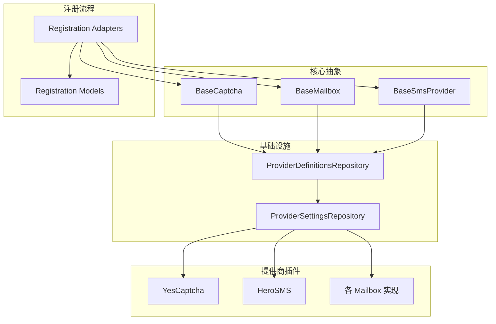
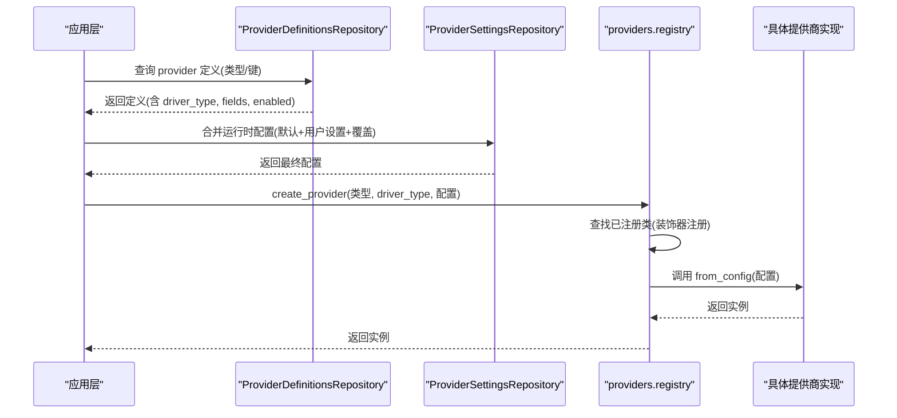
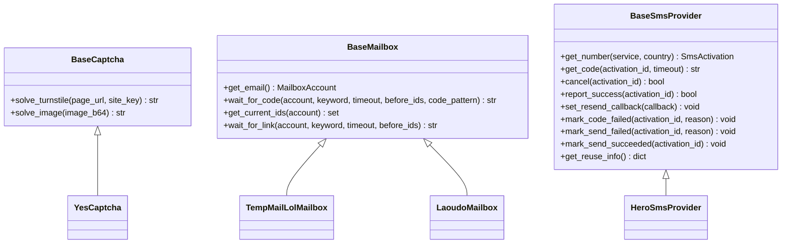
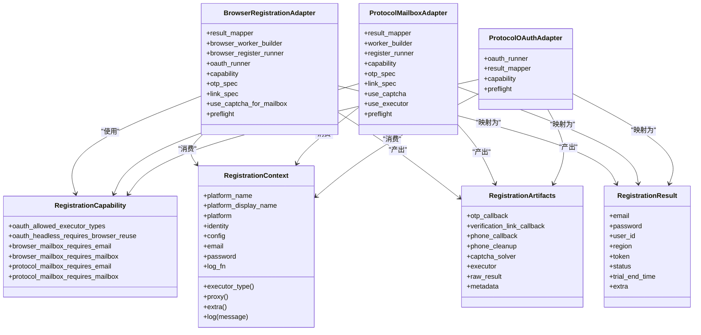
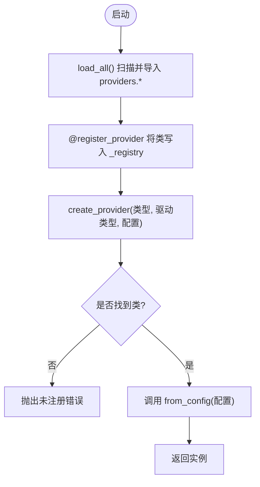
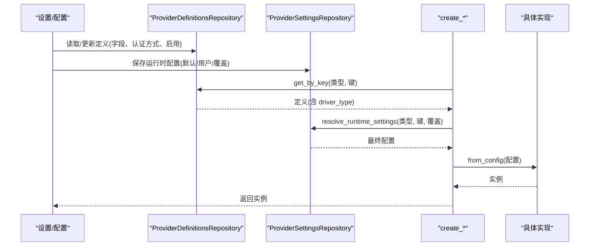
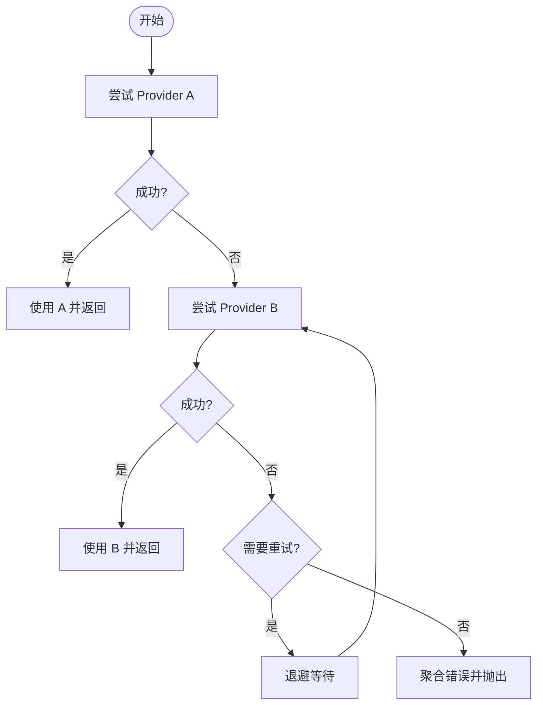
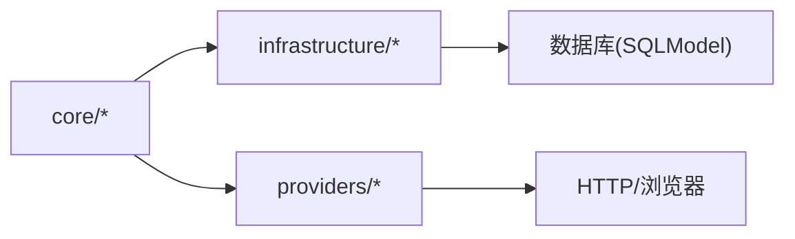
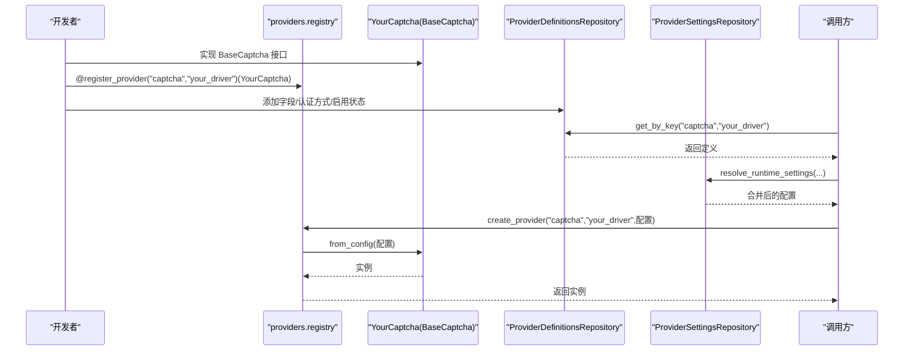

# 提供商架构设计

<cite>
**本文引用的文件**
- [core/base_captcha.py](file://core/base_captcha.py)
- [core/base_mailbox.py](file://core/base_mailbox.py)
- [core/base_sms.py](file://core/base_sms.py)
- [providers/registry.py](file://providers/registry.py)
- [infrastructure/provider_definitions_repository.py](file://infrastructure/provider_definitions_repository.py)
- [infrastructure/provider_settings_repository.py](file://infrastructure/provider_settings_repository.py)
- [core/registration/adapters.py](file://core/registration/adapters.py)
- [core/registration/models.py](file://core/registration/models.py)
- [core/registration/errors.py](file://core/registration/errors.py)
- [providers/captcha/yescaptcha.py](file://providers/captcha/yescaptcha.py)
- [providers/sms/herosms.py](file://providers/sms/herosms.py)
</cite>

## 目录
1. [简介](#简介)
2. [项目结构](#项目结构)
3. [核心组件](#核心组件)
4. [架构总览](#架构总览)
5. [详细组件分析](#详细组件分析)
6. [依赖关系分析](#依赖关系分析)
7. [性能考量](#性能考量)
8. [故障排查指南](#故障排查指南)
9. [结论](#结论)
10. [附录：扩展新提供商类型示例](#附录：扩展新提供商类型示例)

## 简介
本文件系统性阐述 Any Auto Register 的“提供商架构设计”，围绕统一接口定义、适配器模式、工厂与动态加载、依赖注入（配置驱动与运行时服务发现）、错误处理策略，以及可扩展性展开。重点覆盖验证码、邮箱、短信三类提供商的统一抽象、注册与创建流程，并结合具体源码路径进行说明，帮助读者从基础概念到高级特性完整掌握该架构。

## 项目结构
整体采用“核心抽象 + 基础设施 + 提供商插件”的分层组织：
- 核心抽象：在 core 下定义 BaseCaptcha、BaseMailbox、BaseSmsProvider 等基类，明确统一能力边界。
- 基础设施：提供 ProviderDefinitionsRepository、ProviderSettingsRepository 等，负责 provider 元数据与配置的持久化与合并。
- 提供商插件：在 providers 下按类型划分（captcha、mailbox、sms、proxy），通过装饰器注册到全局注册表，实现热插拔。
- 注册流程适配：core/registration 提供适配器与模型，将上层平台注册流程与底层提供商解耦。

图表来源
- [core/base_captcha.py:5-15](file://core/base_captcha.py#L5-L15)
- [core/base_mailbox.py:27-49](file://core/base_mailbox.py#L27-L49)
- [core/base_sms.py:28-70](file://core/base_sms.py#L28-L70)
- [infrastructure/provider_definitions_repository.py:387-474](file://infrastructure/provider_definitions_repository.py#L387-L474)
- [infrastructure/provider_settings_repository.py:15-55](file://infrastructure/provider_settings_repository.py#L15-L55)
- [core/registration/adapters.py:27-59](file://core/registration/adapters.py#L27-L59)
- [core/registration/models.py:7-66](file://core/registration/models.py#L7-L66)

章节来源
- [core/base_captcha.py:5-15](file://core/base_captcha.py#L5-L15)
- [core/base_mailbox.py:27-49](file://core/base_mailbox.py#L27-L49)
- [core/base_sms.py:28-70](file://core/base_sms.py#L28-L70)
- [infrastructure/provider_definitions_repository.py:387-474](file://infrastructure/provider_definitions_repository.py#L387-L474)
- [infrastructure/provider_settings_repository.py:15-55](file://infrastructure/provider_settings_repository.py#L15-L55)
- [core/registration/adapters.py:27-59](file://core/registration/adapters.py#L27-L59)
- [core/registration/models.py:7-66](file://core/registration/models.py#L7-L66)

## 核心组件
- BaseCaptcha：定义验证码求解的统一接口（Turnstile、图片验证码），并通过懒加载导出具体实现，便于按需引入。
- BaseMailbox：定义临时邮箱/收件服务的统一接口（获取邮箱、等待验证码/链接、邮件ID集合），并提供多提供商回退包装器 FallbackMailbox。
- BaseSmsProvider：定义接码服务的统一接口（租号、取码、取消、成功上报、重发回调、复用信息等），并内置 SMS-Activate 与 HeroSMS 的具体实现。
- 提供商注册表 providers.registry：提供装饰器式注册、模块自动扫描导入、统一工厂 create_provider。
- 基础设施仓库：ProviderDefinitionsRepository 维护 provider 元数据（字段、认证方式、启用状态等）；ProviderSettingsRepository 负责运行时配置合并与默认值解析。
- 注册流程适配：adapters 与 models 将平台注册上下文、能力声明、结果映射与提供商调用解耦。

章节来源
- [core/base_captcha.py:5-15](file://core/base_captcha.py#L5-L15)
- [core/base_mailbox.py:27-49](file://core/base_mailbox.py#L27-L49)
- [core/base_sms.py:28-70](file://core/base_sms.py#L28-L70)
- [providers/registry.py:38-62](file://providers/registry.py#L38-L62)
- [infrastructure/provider_definitions_repository.py:387-474](file://infrastructure/provider_definitions_repository.py#L387-L474)
- [infrastructure/provider_settings_repository.py:15-55](file://infrastructure/provider_settings_repository.py#L15-L55)
- [core/registration/adapters.py:27-59](file://core/registration/adapters.py#L27-L59)
- [core/registration/models.py:7-66](file://core/registration/models.py#L7-L66)

## 架构总览
下图展示从“配置/定义”到“运行时实例”的端到端流程，体现配置驱动的对象创建、运行时服务发现与工厂模式。

图表来源
- [infrastructure/provider_definitions_repository.py:387-474](file://infrastructure/provider_definitions_repository.py#L387-L474)
- [infrastructure/provider_settings_repository.py:39-55](file://infrastructure/provider_settings_repository.py#L39-L55)
- [providers/registry.py:51-62](file://providers/registry.py#L51-L62)
- [providers/captcha/yescaptcha.py:13-18](file://providers/captcha/yescaptcha.py#L13-L18)

章节来源
- [infrastructure/provider_definitions_repository.py:387-474](file://infrastructure/provider_definitions_repository.py#L387-L474)
- [infrastructure/provider_settings_repository.py:39-55](file://infrastructure/provider_settings_repository.py#L39-L55)
- [providers/registry.py:51-62](file://providers/registry.py#L51-L62)
- [providers/captcha/yescaptcha.py:13-18](file://providers/captcha/yescaptcha.py#L13-L18)

## 详细组件分析

### 统一接口定义：BaseCaptcha / BaseMailbox / BaseSmsProvider
- BaseCaptcha
  - 抽象方法：solve_turnstile、solve_image，强制所有验证码实现遵循相同契约。
  - 懒加载导出：避免启动时加载全部实现，降低冷启动开销。
- BaseMailbox
  - 抽象方法：get_email、wait_for_code、get_current_ids；可选 wait_for_link。
  - FallbackMailbox：顺序尝试多个提供商，失败记录错误并继续下一个，最终聚合异常或返回首个可用实例。
- BaseSmsProvider
  - 抽象方法：get_number、get_code、cancel；可选 report_success、set_resend_callback、标记发送成功/失败、复用信息。
  - 内置实现：SMS-Activate、HeroSMS，封装各自 API 差异，对外暴露一致行为。

图表来源
- [core/base_captcha.py:5-15](file://core/base_captcha.py#L5-L15)
- [core/base_mailbox.py:27-49](file://core/base_mailbox.py#L27-L49)
- [core/base_sms.py:28-70](file://core/base_sms.py#L28-L70)
- [providers/captcha/yescaptcha.py:7-18](file://providers/captcha/yescaptcha.py#L7-L18)
- [core/base_sms.py:108-181](file://core/base_sms.py#L108-L181)
- [core/base_mailbox.py:350-474](file://core/base_mailbox.py#L350-L474)
- [core/base_mailbox.py:557-651](file://core/base_mailbox.py#L557-L651)

章节来源
- [core/base_captcha.py:5-15](file://core/base_captcha.py#L5-L15)
- [core/base_mailbox.py:27-49](file://core/base_mailbox.py#L27-L49)
- [core/base_sms.py:28-70](file://core/base_sms.py#L28-L70)
- [providers/captcha/yescaptcha.py:7-18](file://providers/captcha/yescaptcha.py#L7-L18)
- [core/base_sms.py:108-181](file://core/base_sms.py#L108-L181)
- [core/base_mailbox.py:350-474](file://core/base_mailbox.py#L350-L474)
- [core/base_mailbox.py:557-651](file://core/base_mailbox.py#L557-L651)

### 适配器模式与注册流程
- 适配器角色
  - BrowserRegistrationAdapter：封装浏览器注册工作流，支持 OTP/链接等待、前置检查、OAuth 执行等。
  - ProtocolMailboxAdapter / ProtocolOAuthAdapter：面向协议型注册与 OAuth 流程的适配，统一结果映射与能力声明。
- 能力与上下文
  - RegistrationCapability：声明不同执行器/身份模式/OAuth 的能力约束。
  - RegistrationContext：承载平台名、显示名、平台实例、身份、配置、邮箱密码、日志函数等。
  - RegistrationArtifacts：保存 OTP/链接/手机回调、验证码求解器、执行器、原始结果、元数据等。
  - RegistrationResult：标准化注册结果（邮箱、密码、用户ID、区域、令牌、状态、试用结束时间、额外信息）。

图表来源
- [core/registration/adapters.py:27-59](file://core/registration/adapters.py#L27-L59)
- [core/registration/models.py:7-66](file://core/registration/models.py#L7-L66)

章节来源
- [core/registration/adapters.py:27-59](file://core/registration/adapters.py#L27-L59)
- [core/registration/models.py:7-66](file://core/registration/models.py#L7-L66)

### 工厂模式与动态类加载
- 装饰器注册：@register_provider("类型", "驱动类型") 将类加入全局注册表。
- 模块扫描：load_all() 扫描 providers.captcha、providers.proxy、providers.sms、providers.mailbox 子模块并导入，触发装饰器注册。
- 统一工厂：create_provider(类型, 驱动类型, 配置) 查找类并调用其 from_config(config) 创建实例。
- 具体示例：YesCaptcha 通过装饰器注册，并在 from_config 中校验 Key 后构造实例；HeroSMS 通过 re-export 并在 sms/__init__ 中注册。

图表来源
- [providers/registry.py:38-62](file://providers/registry.py#L38-L62)
- [providers/registry.py:70-91](file://providers/registry.py#L70-L91)
- [providers/captcha/yescaptcha.py:7-18](file://providers/captcha/yescaptcha.py#L7-L18)
- [providers/sms/herosms.py:10-18](file://providers/sms/herosms.py#L10-L18)

章节来源
- [providers/registry.py:38-62](file://providers/registry.py#L38-L62)
- [providers/registry.py:70-91](file://providers/registry.py#L70-L91)
- [providers/captcha/yescaptcha.py:7-18](file://providers/captcha/yescaptcha.py#L7-L18)
- [providers/sms/herosms.py:10-18](file://providers/sms/herosms.py#L10-L18)

### 依赖注入机制：配置驱动与运行时服务发现
- 配置驱动对象创建
  - ProviderDefinitionsRepository 提供内置定义种子数据（字段、认证方式、启用状态等），确保升级时元数据同步。
  - ProviderSettingsRepository 合并“定义默认值 + 用户配置 + 运行时覆盖”，得到最终配置。
  - 工厂 create_provider 依据 driver_type 选择具体类，并由 from_config 完成实例化。
- 运行时服务发现
  - load_all() 自动发现并注册所有提供商模块，无需硬编码导入。
  - 邮箱创建 create_mailbox 根据 provider_key 与 enabled 列表构建单例或 FallbackMailbox，支持显式 fallbacks 与默认启用项追加。

图表来源
- [infrastructure/provider_definitions_repository.py:387-474](file://infrastructure/provider_definitions_repository.py#L387-L474)
- [infrastructure/provider_settings_repository.py:39-55](file://infrastructure/provider_settings_repository.py#L39-L55)
- [core/base_mailbox.py:289-348](file://core/base_mailbox.py#L289-L348)
- [core/base_captcha.py:67-98](file://core/base_captcha.py#L67-L98)

章节来源
- [infrastructure/provider_definitions_repository.py:387-474](file://infrastructure/provider_definitions_repository.py#L387-L474)
- [infrastructure/provider_settings_repository.py:39-55](file://infrastructure/provider_settings_repository.py#L39-L55)
- [core/base_mailbox.py:289-348](file://core/base_mailbox.py#L289-L348)
- [core/base_captcha.py:67-98](file://core/base_captcha.py#L67-L98)

### 错误处理策略：异常分类、重试与降级
- 异常分类
  - 注册流程异常：RegistrationError 及其子类（身份解析失败、验证码配置不可用、OTP 超时、浏览器复用要求、不支持的路径）。
  - 提供商异常：具体实现抛出的 RuntimeError/TimeoutError 等，如未配置 Key、API 错误、无号码等。
- 重试机制
  - Temp-Mail Web 请求遇到 429 时指数退避重试（最多 4 次），并打印重试信息。
  - SMS-Activate/HeroSMS 轮询状态，等待验证码或处理重发状态。
- 降级处理
  - FallbackMailbox：按顺序尝试多个邮箱提供商，失败记录并继续下一个，最终聚合错误。
  - 邮箱创建 create_mailbox：若主 provider 初始化失败且非首选，则跳过并记录警告；若无任何可用实例则报错。
  - 验证码创建 create_captcha_solver：对未启用或未配置的情况直接抛出明确错误，阻止后续流程。

图表来源
- [core/base_mailbox.py:51-118](file://core/base_mailbox.py#L51-L118)
- [core/base_mailbox.py:289-348](file://core/base_mailbox.py#L289-L348)
- [core/base_mailbox.py:718-772](file://core/base_mailbox.py#L718-L772)
- [core/base_captcha.py:67-98](file://core/base_captcha.py#L67-L98)
- [core/base_sms.py:155-181](file://core/base_sms.py#L155-L181)

章节来源
- [core/base_mailbox.py:51-118](file://core/base_mailbox.py#L51-L118)
- [core/base_mailbox.py:289-348](file://core/base_mailbox.py#L289-L348)
- [core/base_mailbox.py:718-772](file://core/base_mailbox.py#L718-L772)
- [core/base_captcha.py:67-98](file://core/base_captcha.py#L67-L98)
- [core/base_sms.py:155-181](file://core/base_sms.py#L155-L181)

## 依赖关系分析
- 低耦合高内聚
  - 抽象层（core）不感知具体提供商实现，仅依赖统一接口。
  - 基础设施层（infrastructure）只关注定义与配置的读写，不关心业务逻辑。
  - 提供商插件（providers）通过装饰器注册，被注册表统一管理。
- 直接/间接依赖
  - Base* 基类被具体实现继承；注册表依赖 providers.* 包；创建函数依赖基础设施仓库。
- 外部依赖与集成点
  - HTTP 客户端（requests/curl_cffi）、浏览器（Camoufox）、数据库（SQLModel/SQLite）等。
- 循环依赖风险
  - 通过懒导入（如 base_captcha 中的 __getattr__）避免启动时循环导入。

图表来源
- [core/base_captcha.py:21-35](file://core/base_captcha.py#L21-L35)
- [providers/registry.py:70-91](file://providers/registry.py#L70-L91)
- [core/base_mailbox.py:718-772](file://core/base_mailbox.py#L718-L772)

章节来源
- [core/base_captcha.py:21-35](file://core/base_captcha.py#L21-L35)
- [providers/registry.py:70-91](file://providers/registry.py#L70-L91)
- [core/base_mailbox.py:718-772](file://core/base_mailbox.py#L718-L772)

## 性能考量
- 懒加载与按需导入：base_captcha 通过 __getattr__ 延迟导入具体实现，减少启动开销。
- 浏览器资源管理：TempMailWeb 使用线程池与浏览器会话复用，避免频繁启动浏览器。
- 网络重试与退避：HTTP 429 场景下的指数退避，提升稳定性。
- 号码复用与缓存：HeroSMS 支持本地缓存与复用策略，减少重复租号成本。
- 批量邮箱回退：FallbackMailbox 顺序尝试，提高成功率同时控制失败成本。

[本节为通用指导，不直接分析具体文件]

## 故障排查指南
- 常见问题定位
  - 未启用或未配置：create_captcha_solver/create_mailbox 会抛出明确错误，检查 ProviderDefinitionsRepository 与 ProviderSettingsRepository 的配置。
  - 第三方 API 错误：查看具体实现抛出的 RuntimeError/TimeoutError，结合日志定位（如 YesCaptcha 任务创建失败、Temp-Mail Web 非 JSON 响应）。
  - 429 限流：Temp-Mail Web 会在多次重试后仍失败时抛出错误，建议调整重试间隔或切换提供商。
- 调试建议
  - 启用日志输出，观察 FallbackMailbox 的尝试顺序与失败原因。
  - 检查 ProviderSettingsRepository 的 resolve_runtime_settings 返回值，确认配置合并是否符合预期。
  - 对于短信提供商，关注 get_status/getStatusV2 的状态流转与去重逻辑。

章节来源
- [core/base_captcha.py:67-98](file://core/base_captcha.py#L67-L98)
- [core/base_mailbox.py:289-348](file://core/base_mailbox.py#L289-L348)
- [core/base_mailbox.py:718-772](file://core/base_mailbox.py#L718-L772)
- [core/base_sms.py:155-181](file://core/base_sms.py#L155-L181)

## 结论
Any Auto Register 的提供商架构以统一接口为核心，通过装饰器注册、模块扫描、工厂模式与配置驱动实现松耦合与高扩展性。基础设施层提供稳定的定义与配置管理能力，注册流程适配器屏蔽了平台差异，错误处理策略保障了鲁棒性。整体设计既满足当前验证码、邮箱、短信三类提供商的统一接入，也为未来新增提供商类型提供了清晰路径。

[本节为总结，不直接分析具体文件]

## 附录：扩展新提供商类型示例
以下以“新增一个验证码提供商”为例，展示如何基于现有架构扩展：

步骤概览
- 定义实现类：继承 BaseCaptcha，实现 solve_turnstile/solve_image。
- 装饰器注册：使用 @register_provider("captcha", "your_driver") 注册。
- 提供 from_config：从配置字典中读取密钥/地址等参数并构造实例。
- 定义元数据：在 ProviderDefinitionsRepository 的内置定义中添加字段、认证方式、启用状态等。
- 运行时创建：通过 create_captcha_solver 或 create_provider 使用。

图表来源
- [providers/registry.py:38-62](file://providers/registry.py#L38-L62)
- [providers/captcha/yescaptcha.py:7-18](file://providers/captcha/yescaptcha.py#L7-L18)
- [infrastructure/provider_definitions_repository.py:387-474](file://infrastructure/provider_definitions_repository.py#L387-L474)
- [infrastructure/provider_settings_repository.py:39-55](file://infrastructure/provider_settings_repository.py#L39-L55)
- [core/base_captcha.py:67-98](file://core/base_captcha.py#L67-L98)

章节来源
- [providers/registry.py:38-62](file://providers/registry.py#L38-L62)
- [providers/captcha/yescaptcha.py:7-18](file://providers/captcha/yescaptcha.py#L7-L18)
- [infrastructure/provider_definitions_repository.py:387-474](file://infrastructure/provider_definitions_repository.py#L387-L474)
- [infrastructure/provider_settings_repository.py:39-55](file://infrastructure/provider_settings_repository.py#L39-L55)
- [core/base_captcha.py:67-98](file://core/base_captcha.py#L67-L98)