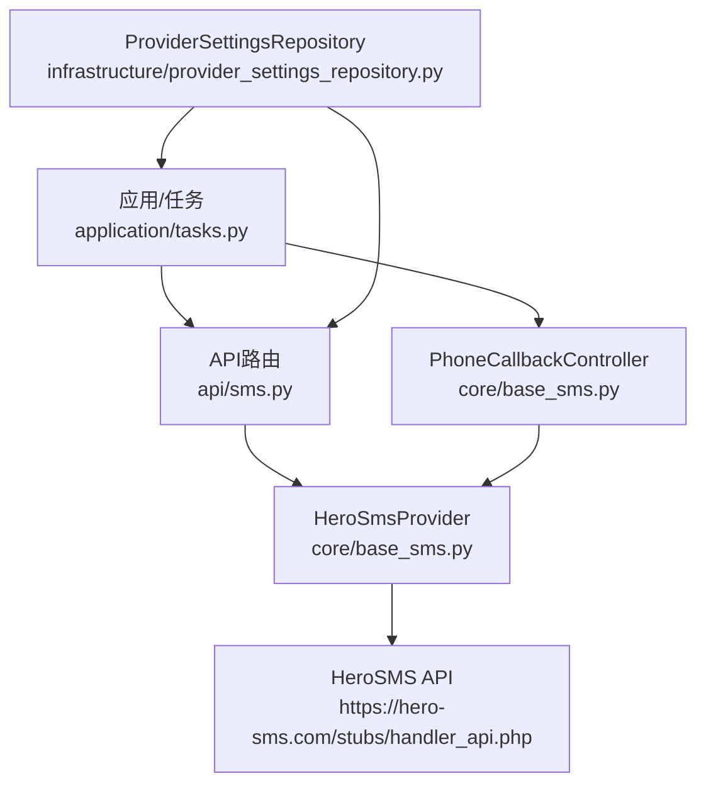
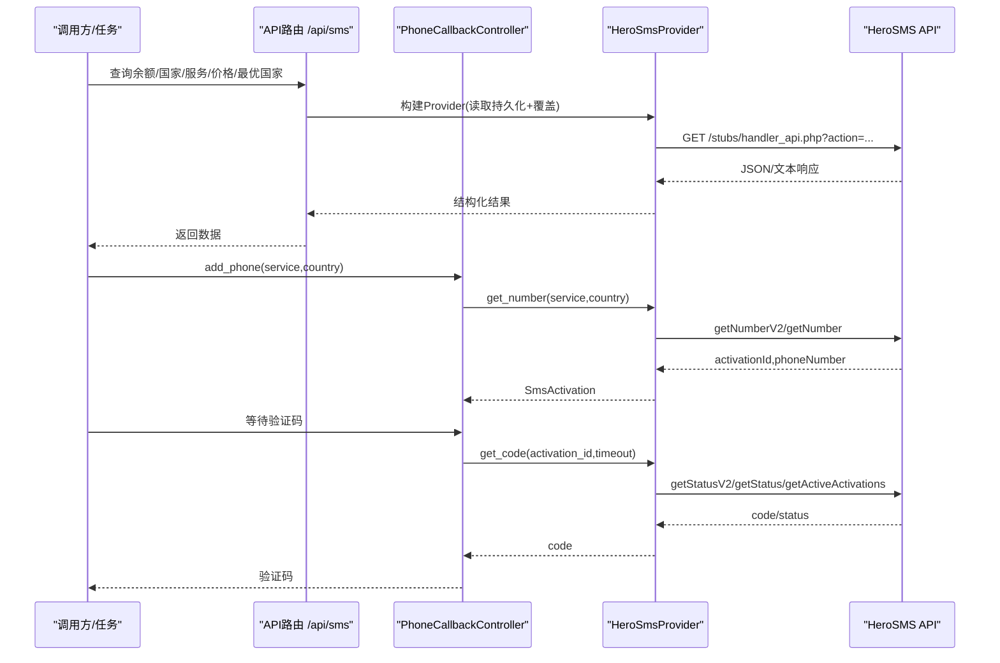
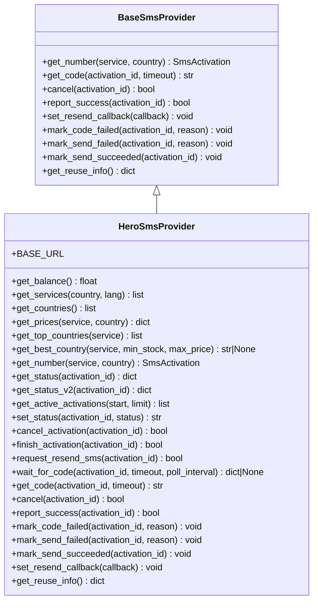
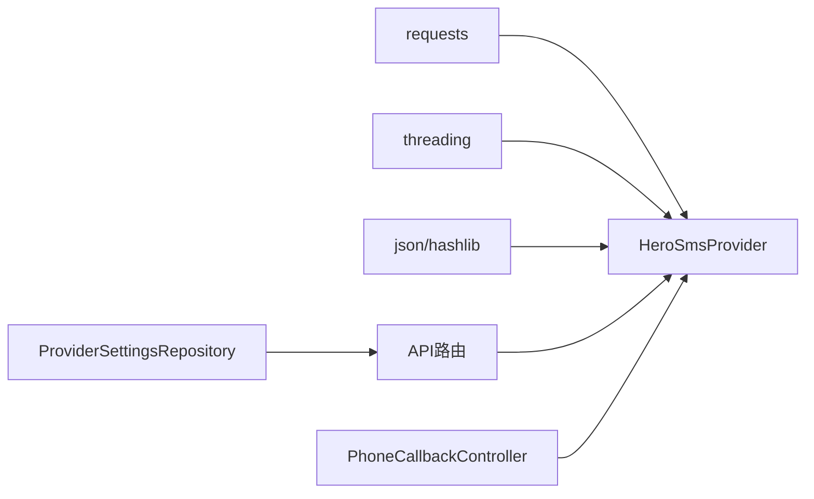

# Herosms服务集成

<cite>
**本文引用的文件**
- [providers/sms/herosms.py](file://providers/sms/herosms.py)
- [core/base_sms.py](file://core/base_sms.py)
- [api/sms.py](file://api/sms.py)
- [infrastructure/provider_settings_repository.py](file://infrastructure/provider_settings_repository.py)
- [application/tasks.py](file://application/tasks.py)
- [tests/test_herosms_api.py](file://tests/test_herosms_api.py)
- [tests/test_tasks_herosms.py](file://tests/test_tasks_herosms.py)
</cite>

## 目录
1. [简介](#简介)
2. [项目结构](#项目结构)
3. [核心组件](#核心组件)
4. [架构总览](#架构总览)
5. [详细组件分析](#详细组件分析)
6. [依赖关系分析](#依赖关系分析)
7. [性能与并发控制](#性能与并发控制)
8. [故障排查指南](#故障排查指南)
9. [结论](#结论)
10. [附录：配置示例与最佳实践](#附录：配置示例与最佳实践)

## 简介
本文件系统性介绍项目中对 HeroSMS 短信服务的集成实现，重点围绕 HeroSmsProvider 的 API 认证、请求构造、响应解析、国家代码与服务类型选择、验证码缓存与复用机制、连接池与并发控制策略（含锁与缓存系统）、错误处理策略以及完整配置与使用示例。文档同时给出架构图与时序图，帮助读者快速理解端到端流程。

## 项目结构
HeroSMS 相关能力主要分布在以下模块：
- providers/sms/herosms.py：将 HeroSmsProvider 注册到统一提供者注册表，便于运行时加载。
- core/base_sms.py：实现 BaseSmsProvider 抽象及 HeroSmsProvider、SmsBowerProvider 等具体实现；包含全局缓存、锁、号码复用、状态轮询、回调控制器等核心逻辑。
- api/sms.py：暴露 HeroSMS/SMSBower 的查询接口（余额、国家、服务、价格、最优国家等）。
- infrastructure/provider_settings_repository.py：提供 ProviderSettingsRepository，用于读取/合并持久化配置与运行时覆盖。
- application/tasks.py：任务层解析默认 SMS 提供商与配置，供自动化任务使用。
- tests/*：针对 HeroSMS 的配置选项、余额接口、任务配置解析的测试用例。

图表来源
- [core/base_sms.py:328-1266](file://core/base_sms.py#L328-L1266)
- [api/sms.py:1-215](file://api/sms.py#L1-L215)
- [infrastructure/provider_settings_repository.py:39-55](file://infrastructure/provider_settings_repository.py#L39-L55)
- [application/tasks.py:602-614](file://application/tasks.py#L602-L614)

章节来源
- [providers/sms/herosms.py:1-19](file://providers/sms/herosms.py#L1-L19)
- [core/base_sms.py:1-1266](file://core/base_sms.py#L1-L1266)
- [api/sms.py:1-215](file://api/sms.py#L1-L215)
- [infrastructure/provider_settings_repository.py:1-167](file://infrastructure/provider_settings_repository.py#L1-L167)
- [application/tasks.py:602-614](file://application/tasks.py#L602-L614)
- [tests/test_herosms_api.py:1-28](file://tests/test_herosms_api.py#L1-L28)
- [tests/test_tasks_herosms.py:1-43](file://tests/test_tasks_herosms.py#L1-L43)

## 核心组件
- BaseSmsProvider：定义统一的接码服务接口（获取号码、等待验证码、取消、成功上报、重试回调等）。
- HeroSmsProvider：HeroSMS 的具体实现，支持：
  - 动态价格上限与 V2/V1 号码获取兼容
  - 智能国家选择（按价格与库存）
  - 验证码去重与事件规范化
  - 号码复用与生命周期管理（缓存、锁、超时）
  - 多通道状态查询（V2 sms/call、V1 getStatus、活跃激活列表）
  - 自动重发与 OpenAI 回调联动
- PhoneCallbackController：封装“租号-收码-完成/释放”的生命周期，并集成自动国家选择与锁管理。
- API 路由：对外暴露查询余额、国家、服务、价格、最优国家等接口。
- ProviderSettingsRepository：集中管理 Provider 配置与认证信息，支持默认值、持久化配置与运行时覆盖。

章节来源
- [core/base_sms.py:28-71](file://core/base_sms.py#L28-L71)
- [core/base_sms.py:328-1026](file://core/base_sms.py#L328-L1026)
- [core/base_sms.py:1103-1266](file://core/base_sms.py#L1103-L1266)
- [api/sms.py:1-215](file://api/sms.py#L1-L215)
- [infrastructure/provider_settings_repository.py:39-55](file://infrastructure/provider_settings_repository.py#L39-L55)

## 架构总览
下图展示了从任务/调用方到 HeroSMS 的端到端交互路径，包括配置解析、号码租用、验证码轮询、缓存与锁的使用。

图表来源
- [api/sms.py:35-147](file://api/sms.py#L35-L147)
- [core/base_sms.py:725-923](file://core/base_sms.py#L725-L923)
- [core/base_sms.py:1124-1192](file://core/base_sms.py#L1124-L1192)

## 详细组件分析

### HeroSmsProvider 类详解
- API 认证机制
  - 所有需要鉴权的请求通过 _request 方法注入 api_key 参数。
  - 部分只读接口（如 getServicesList、getCountries）可跳过鉴权（needs_key=False），但余额、号码、状态等需鉴权。
- 请求格式构造
  - 统一通过 requests.get 调用 BASE_URL，参数以 query string 传递。
  - 号码获取优先尝试 getNumberV2，失败或无号码时回退到 getNumber。
  - 动态价格上限：先查询 getPrices，基于实际成本计算 effective_max_price，避免分配到虚拟号码。
- 响应数据解析
  - 状态解析：_parse_hero_status_text 标准化 v1 文本状态。
  - V2 状态：get_status_v2 支持 sms/call 双通道，结合事件字段规范化与去重。
  - 国家/服务/价格：get_countries、get_services、get_prices、get_top_countries 等，兼容多种返回格式。
- 验证码缓存与复用
  - 全局缓存：_HERO_SMS_CACHE 持久化到 data/.herosms_phone_cache.json，记录 activation_id、phone_number、used_codes、attempted_sms_keys、acquired_at、use_count、reuse_stopped 等。
  - 生命周期：HERO_SMS_PHONE_LIFETIME 控制号码有效期；达到上限或剩余时间不足时停止复用。
  - 去重：基于事件字段规范化生成唯一 key，避免重复提交相同验证码。
- 并发控制与锁
  - _HERO_SMS_VERIFY_LOCK：RLock，保护同一时刻仅一个验证流程进入（防止并发冲突）。
  - _HERO_SMS_CACHE_LOCK：Lock，保护缓存读写与持久化。
- 自动重发与回调
  - wait_for_code 在超时前周期性轮询，必要时触发 request_resend_sms。
  - 支持设置 openai_resend_callback，在特定条件下触发上游重发。
- 错误处理
  - 网络异常：_request 抛出 HTTPError，上层捕获后降级或回退。
  - 余额不足/无号码：get_balance/get_number 中识别并抛出明确异常。
  - 验证码获取失败：wait_for_code 超时返回空；mark_code_failed 触发重发与缓存标记。

图表来源
- [core/base_sms.py:28-71](file://core/base_sms.py#L28-L71)
- [core/base_sms.py:328-1026](file://core/base_sms.py#L328-L1026)

章节来源
- [core/base_sms.py:328-1026](file://core/base_sms.py#L328-L1026)

### 国家代码与服务类型选择
- 默认值：HERO_SMS_DEFAULT_SERVICE="dr"，HERO_SMS_DEFAULT_COUNTRY="187"。
- 智能国家选择：get_best_country 优先使用 getTopCountriesByServiceRank，否则降级到 getPrices 全量解析；内置白名单限制（例如当前仅泰国确认走 SMS）。
- 服务映射：支持传入 service 代码（如 "dr"），也可通过配置项 sms_service 或 herosms_service 指定。

章节来源
- [core/base_sms.py:188-194](file://core/base_sms.py#L188-L194)
- [core/base_sms.py:419-579](file://core/base_sms.py#L419-L579)
- [core/base_sms.py:1074-1086](file://core/base_sms.py#L1074-L1086)

### 验证码缓存机制与去重
- 事件规范化：_canonical_sms_event_fields 将不同字段名归一化为 channel/time/text/from/url 等。
- 去重键：_sms_event_key 基于 activation_id、code 与规范化后的事件字段生成唯一键，避免重复提交。
- 候选判定：_make_sms_candidate/_candidate_is_attempted 结合 used_codes 与 attempted_sms_keys 判断是否已尝试过。
- 缓存持久化：_save_cache 写入 data/.herosms_phone_cache.json，序列化 set 为排序列表，保证幂等与可恢复。

章节来源
- [core/base_sms.py:240-326](file://core/base_sms.py#L240-L326)
- [core/base_sms.py:581-634](file://core/base_sms.py#L581-L634)
- [core/base_sms.py:968-988](file://core/base_sms.py#L968-L988)

### 连接池管理与并发控制策略
- 连接池：requests 库默认复用连接，无需额外配置；可通过 proxy 参数设置代理。
- 并发控制：
  - _HERO_SMS_VERIFY_LOCK（RLock）：确保同一时间只有一个验证流程持有锁，避免并发竞争导致的状态不一致。
  - _HERO_SMS_CACHE_LOCK（Lock）：保护缓存读写与持久化，防止多线程并发写冲突。
- 号码复用：
  - 根据 phone_success_max 与 HERO_SMS_PHONE_LIFETIME 控制复用次数与时长。
  - 成功上报 report_success 时更新 use_count，并在达到上限或即将过期时停止复用。

章节来源
- [core/base_sms.py:191-193](file://core/base_sms.py#L191-L193)
- [core/base_sms.py:725-765](file://core/base_sms.py#L725-L765)
- [core/base_sms.py:914-966](file://core/base_sms.py#L914-L966)

### API 路由与配置解析
- API 路由：/api/sms/herosms/{countries,services,balance,prices,top-countries,best-country} 提供查询能力。
- 配置解析：_provider_from_payload 从持久化配置与请求体合并得到 Provider 实例；支持 inline api_key 覆盖。
- 任务配置：application/tasks._resolve_sms_provider_for_task 读取默认 provider 与配置，支持运行时覆盖。

章节来源
- [api/sms.py:19-147](file://api/sms.py#L19-L147)
- [application/tasks.py:602-614](file://application/tasks.py#L602-L614)
- [tests/test_herosms_api.py:4-27](file://tests/test_herosms_api.py#L4-L27)
- [tests/test_tasks_herosms.py:7-42](file://tests/test_tasks_herosms.py#L7-L42)

## 依赖关系分析
- HeroSmsProvider 依赖 requests 进行 HTTP 通信，依赖 threading 进行锁控制，依赖 json/hashlib 进行缓存与去重。
- API 路由依赖 ProviderSettingsRepository 读取持久化配置。
- PhoneCallbackController 依赖 HeroSmsProvider 实现号码租用与验证码获取，并管理生命周期与锁释放。

图表来源
- [core/base_sms.py:328-1026](file://core/base_sms.py#L328-L1026)
- [api/sms.py:1-215](file://api/sms.py#L1-L215)
- [infrastructure/provider_settings_repository.py:39-55](file://infrastructure/provider_settings_repository.py#L39-L55)

章节来源
- [core/base_sms.py:328-1026](file://core/base_sms.py#L328-L1026)
- [api/sms.py:1-215](file://api/sms.py#L1-L215)
- [infrastructure/provider_settings_repository.py:39-55](file://infrastructure/provider_settings_repository.py#L39-L55)

## 性能与并发控制
- 轮询策略：wait_for_code 默认每 3 秒轮询一次，支持自定义 poll_interval；超时前自动触发重发。
- 动态价格上限：通过 getPrices 获取实际成本，设置 effective_max_price，减少分配到虚拟号码的概率。
- 缓存命中：复用号码时直接返回已有 activation_id，减少网络开销。
- 锁粒度：细粒度锁保护缓存与验证流程，避免全局阻塞。
- 建议：
  - 合理设置 register_phone_extra_max 与 register_reuse_phone_to_max，平衡复用与稳定性。
  - 在高并发场景下，适当增大超时与轮询间隔，降低服务端压力。
  - 使用代理时注意超时与重试策略，避免频繁失败影响整体吞吐。

[本节为通用性能讨论，不直接分析具体文件]

## 故障排查指南
- 网络异常
  - 现象：_request 抛出 HTTPError 或连接超时。
  - 处理：API 路由捕获异常并返回 502；上层可重试或切换代理。
- 余额不足
  - 现象：get_balance 或 get_number 返回余额不足提示。
  - 处理：检查账户余额，充值后再试；或在配置中调整 max_price。
- 验证码获取失败
  - 现象：wait_for_code 超时未收到验证码。
  - 处理：调用 mark_code_failed 触发重发；检查服务是否支持该国家；尝试自动国家选择或回退到默认国家。
- 号码被拒绝/已达上限
  - 现象：mark_send_failed 检测到 limit/already/too many/exceeded 等关键词。
  - 处理：停止复用（_stop_reuse），更换国家或服务。
- 缓存失效
  - 现象：缓存文件损坏或版本不一致。
  - 处理：删除 data/.herosms_phone_cache.json 重建；检查 API Key 与服务/国家配置一致性。

章节来源
- [api/sms.py:48-147](file://api/sms.py#L48-L147)
- [core/base_sms.py:645-712](file://core/base_sms.py#L645-L712)
- [core/base_sms.py:845-923](file://core/base_sms.py#L845-L923)
- [core/base_sms.py:983-1008](file://core/base_sms.py#L983-L1008)

## 结论
HeroSmsProvider 提供了健壮的接码能力，涵盖认证、请求构造、响应解析、智能国家选择、验证码去重与缓存、并发控制与自动重发等关键特性。通过 ProviderSettingsRepository 统一管理配置，API 路由提供便捷的查询能力，PhoneCallbackController 封装了完整的生命周期管理。建议在生产环境中合理配置国家与服务、调整超时与轮询策略，并结合监控与日志进行问题定位。

[本节为总结性内容，不直接分析具体文件]

## 附录：配置示例与最佳实践

### 配置项说明
- API 密钥
  - herosms_api_key：HeroSMS 的 API Key，必填。
- 默认国家与服务
  - sms_country 或 herosms_country：默认国家代码（如 "187"）。
  - sms_service 或 herosms_service：默认服务代码（如 "dr"）。
- 价格与复用
  - herosms_max_price：最大价格上限（可选，-1 表示不限制）。
  - register_reuse_phone_to_max：是否启用号码复用至上限。
  - register_phone_extra_max 或 register_phone_success_max：号码成功使用次数上限。
- 代理
  - sms_proxy 或 proxy：HTTP/HTTPS 代理地址（可选）。
- 智能国家选择
  - herosms_auto_country：启用自动选择最优国家。
  - herosms_auto_country_min_stock：最低库存阈值。
  - herosms_auto_country_max_price：最高价格限制。

章节来源
- [core/base_sms.py:1074-1086](file://core/base_sms.py#L1074-L1086)
- [core/base_sms.py:1131-1150](file://core/base_sms.py#L1131-L1150)
- [api/sms.py:35-45](file://api/sms.py#L35-L45)

### 使用示例
- 查询余额
  - POST /api/sms/herosms/balance，请求体可包含 api_key（覆盖持久化配置）。
  - 若未配置 API Key，返回 400。
- 查询国家/服务/价格
  - GET /api/sms/herosms/countries
  - GET /api/sms/herosms/services?country=...
  - POST /api/sms/herosms/prices，请求体包含 service、country。
- 自动选择最优国家
  - POST /api/sms/herosms/best-country，请求体包含 service、min_stock、max_price。
  - 返回 country 与 detail（价格、库存等）。

章节来源
- [tests/test_herosms_api.py:14-27](file://tests/test_herosms_api.py#L14-L27)
- [api/sms.py:48-147](file://api/sms.py#L48-L147)

### 最佳实践
- 开启智能国家选择：在高并发或资源紧张场景下，自动选择价格低且库存充足的国家，提高成功率。
- 合理设置复用策略：根据业务需求调整 register_phone_extra_max，避免过度复用导致账号被封。
- 监控与日志：记录每次租号、收码、重发、取消等操作，便于问题追踪。
- 代理与超时：在网络不稳定地区，配置代理并适当增加超时时间，提升鲁棒性。
- 错误处理：对余额不足、无号码、验证码失败等场景进行分级处理，必要时切换到备用提供商。

[本节为通用指导，不直接分析具体文件]