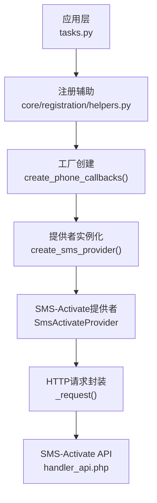
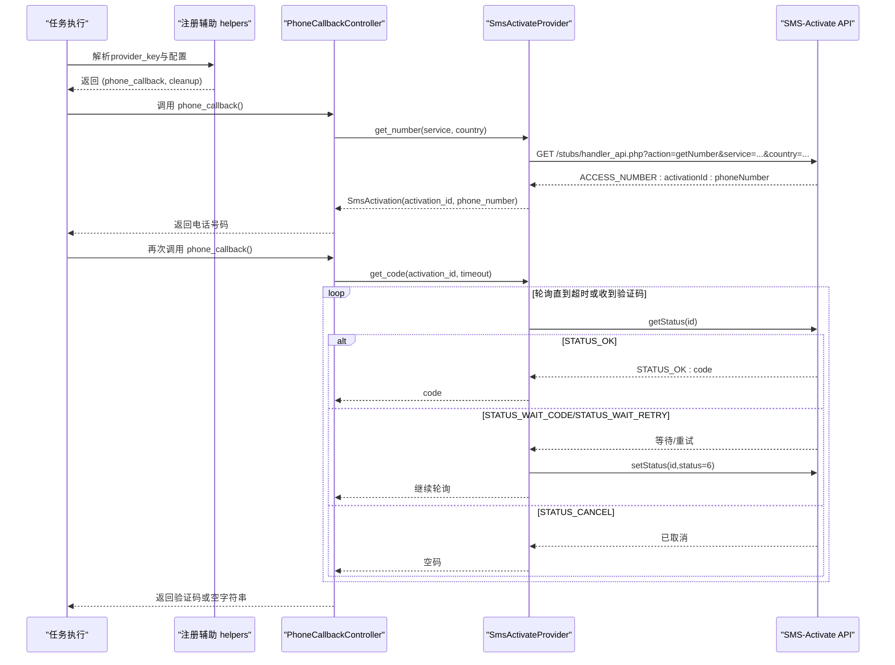
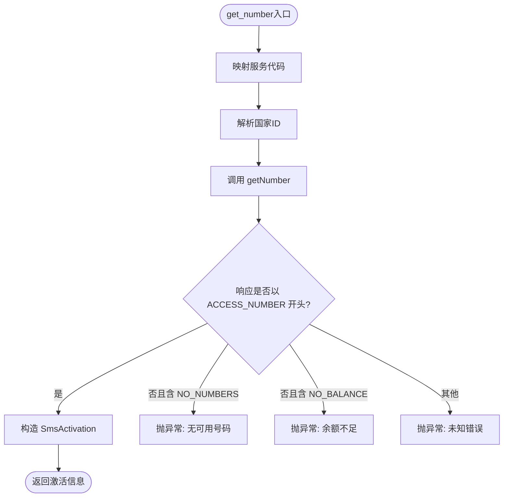
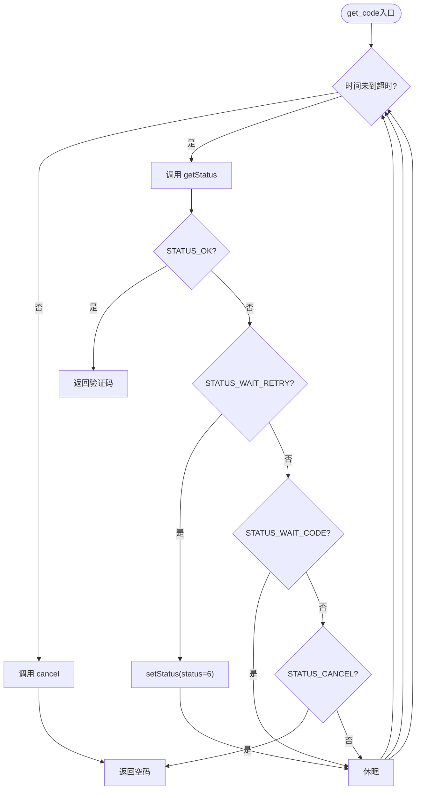
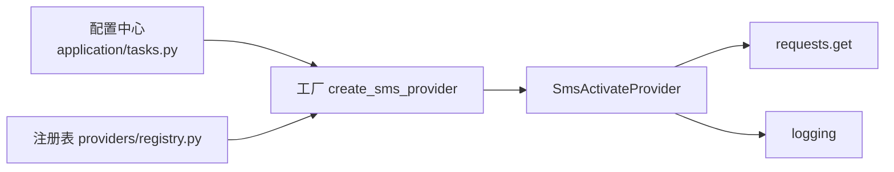

# SMS Activate服务集成

<cite>
**本文引用的文件**
- [core/base_sms.py](file://core/base_sms.py)
- [providers/sms/sms_activate.py](file://providers/sms/sms_activate.py)
- [providers/registry.py](file://providers/registry.py)
- [core/registration/helpers.py](file://core/registration/helpers.py)
- [application/tasks.py](file://application/tasks.py)
- [tests/test_sms_provider.py](file://tests/test_sms_provider.py)
</cite>

## 目录
1. [简介](#简介)
2. [项目结构](#项目结构)
3. [核心组件](#核心组件)
4. [架构总览](#架构总览)
5. [详细组件分析](#详细组件分析)
6. [依赖关系分析](#依赖关系分析)
7. [性能考虑](#性能考虑)
8. [故障排查指南](#故障排查指南)
9. [结论](#结论)
10. [附录：配置与使用示例](#附录：配置与使用示例)

## 简介
本文件面向需要在自动化注册流程中接入短信验证码服务的开发者，聚焦于SMS Activate的集成实现。内容涵盖：
- API认证方式、请求参数格式、响应数据结构
- 平台特有功能：号码池管理（通过服务代码映射）、服务类型映射、地区代码选择
- 验证码获取全流程：申请号码、轮询状态、状态检查、释放机制
- 错误处理策略：余额不足、无可用号码、API限流、服务不可用等异常
- 配置指南：API密钥、代理、重试与超时参数
- 实际使用示例与性能优化建议

## 项目结构
SMS Activate相关逻辑集中在以下位置：
- 提供者注册与发现：providers/sms/sms_activate.py、providers/registry.py
- 核心实现与抽象：core/base_sms.py（包含SmsActivateProvider及通用流程）
- 任务侧集成：core/registration/helpers.py、application/tasks.py
- 测试用例：tests/test_sms_provider.py

图表来源
- [application/tasks.py:602-614](file://application/tasks.py#L602-L614)
- [core/registration/helpers.py:79-147](file://core/registration/helpers.py#L79-L147)
- [core/base_sms.py:1063-1100](file://core/base_sms.py#L1063-L1100)
- [core/base_sms.py:118-128](file://core/base_sms.py#L118-L128)

章节来源
- [application/tasks.py:602-614](file://application/tasks.py#L602-L614)
- [core/registration/helpers.py:79-147](file://core/registration/helpers.py#L79-L147)
- [providers/sms/sms_activate.py:1-11](file://providers/sms/sms_activate.py#L1-L11)
- [providers/registry.py:70-91](file://providers/registry.py#L70-L91)

## 核心组件
- BaseSmsProvider：定义统一的接码能力接口（租号、取码、取消、成功上报等）。
- SmsActivateProvider：基于SMS-Activate API的具体实现，负责：
  - 服务代码映射（如cursor→ot、chatgpt→dr等）
  - 国家ID解析（支持别名与国家代码数字ID）
  - 余额查询、租号、状态轮询、取消、成功上报
- PhoneCallbackController：将“租号—取码—成功/取消”包装为可调用对象，提供生命周期钩子（发送成功/失败、验证码失败重试等）。
- create_sms_provider / create_phone_callbacks：根据配置动态创建提供者与回调控制器。

章节来源
- [core/base_sms.py:28-71](file://core/base_sms.py#L28-L71)
- [core/base_sms.py:108-182](file://core/base_sms.py#L108-L182)
- [core/base_sms.py:1103-1266](file://core/base_sms.py#L1103-L1266)

## 架构总览
下图展示了从任务触发到最终获取验证码的完整调用链，以及SMS Activate特有的服务/国家映射与状态轮询流程。

图表来源
- [core/base_sms.py:136-177](file://core/base_sms.py#L136-L177)
- [core/base_sms.py:1124-1192](file://core/base_sms.py#L1124-L1192)

## 详细组件分析

### SMS-Activate提供者（SmsActivateProvider）
- 认证方式：所有请求均携带api_key参数；基础URL固定为https://api.sms-activate.guru/stubs/handler_api.php。
- 请求参数：
  - getBalance：action=getBalance
  - getNumber：action=getNumber，service=服务代码，country=国家ID
  - getStatus：action=getStatus，id=激活ID
  - setStatus：action=setStatus，id=激活ID，status=状态码（如6表示等待重试，8表示取消）
- 响应数据：
  - 文本协议，常见前缀包括ACCESS_BALANCE、ACCESS_NUMBER、STATUS_OK、STATUS_WAIT_CODE、STATUS_WAIT_RETRY、STATUS_CANCEL等。
- 服务类型映射：内置字典将平台名映射到SMS-Activate服务代码（例如cursor→ot、chatgpt/openai→dr、google→go、microsoft→mg），未匹配时使用默认值。
- 国家代码选择：支持传入国家别名（如us、ru、th）或直接传数字ID；未指定时回退到默认国家。
- 错误处理：
  - NO_NUMBERS：当前无可用号码
  - NO_BALANCE：余额不足
  - 其他非预期响应：抛出运行时异常并附带原始响应片段

图表来源
- [core/base_sms.py:77-106](file://core/base_sms.py#L77-L106)
- [core/base_sms.py:136-153](file://core/base_sms.py#L136-L153)

章节来源
- [core/base_sms.py:108-182](file://core/base_sms.py#L108-L182)
- [tests/test_sms_provider.py:17-39](file://tests/test_sms_provider.py#L17-L39)

### 验证码轮询与状态检查（get_code）
- 轮询策略：在timeout时间内循环调用getStatus，遇到STATUS_WAIT_CODE则休眠后继续；遇到STATUS_WAIT_RETRY会先调用setStatus设置重试状态再等待；遇到STATUS_CANCEL直接返回空码。
- 超时处理：若超时仍未收到验证码，主动调用cancel释放号码并返回空码。
- 自动重试：对需要重试的状态，内部自动调用setStatus(status=6)后再继续轮询。

图表来源
- [core/base_sms.py:155-177](file://core/base_sms.py#L155-L177)

章节来源
- [core/base_sms.py:155-177](file://core/base_sms.py#L155-L177)

### 号码释放与成功上报
- 取消释放：调用setStatus(status=8)进行释放，返回中包含ACCESS视为成功。
- 成功上报：调用setStatus(status=6)标记号码已成功使用；对于某些提供者（如HeroSMS）会在成功后更新复用计数与缓存。
- PhoneCallbackController.cleanup：若未完成则优先尝试report_success，否则cancel释放。

章节来源
- [core/base_sms.py:175-181](file://core/base_sms.py#L175-L181)
- [core/base_sms.py:1222-1246](file://core/base_sms.py#L1222-L1246)

### 提供者注册与工厂
- 注册：sms_activate模块在导入时将SmsActivateProvider注册到“sms”类型的“sms_activate_api”驱动键下。
- 工厂：create_sms_provider根据provider_key与配置创建具体实例；当provider_key为sms_activate或sms_activate_api时，读取sms_activate_api_key作为认证凭据，并支持默认国家与代理设置。

章节来源
- [providers/sms/sms_activate.py:1-11](file://providers/sms/sms_activate.py#L1-L11)
- [core/base_sms.py:1063-1100](file://core/base_sms.py#L1063-L1100)
- [providers/registry.py:70-91](file://providers/registry.py#L70-L91)

### 任务侧集成与回调控制
- 任务侧通过helpers解析provider_key与配置，合并全局默认与任务参数，生成phone_callback与cleanup函数。
- PhoneCallbackController封装了“首次调用租号、二次调用取码”的状态机，并在必要时调用set_resend_callback、mark_send_failed/succeeded等钩子。

章节来源
- [core/registration/helpers.py:79-147](file://core/registration/helpers.py#L79-L147)
- [core/base_sms.py:1103-1266](file://core/base_sms.py#L1103-L1266)
- [application/tasks.py:602-614](file://application/tasks.py#L602-L614)

## 依赖关系分析
- 低耦合抽象：BaseSmsProvider定义了统一接口，便于替换不同接码服务。
- 明确的外部依赖：requests用于HTTP请求；logging用于日志记录。
- 配置来源：
  - 任务参数extra中的sms_provider、sms_activate_api_key、sms_proxy等
  - 全局默认设置（ProviderSettingsRepository）
  - 历史兼容字段（如sms_activate_api_key）
- 注册机制：通过providers.registry.load_all扫描并导入各provider模块，完成驱动注册。

图表来源
- [application/tasks.py:602-614](file://application/tasks.py#L602-L614)
- [providers/registry.py:70-91](file://providers/registry.py#L70-L91)
- [core/base_sms.py:118-128](file://core/base_sms.py#L118-L128)

章节来源
- [providers/registry.py:1-91](file://providers/registry.py#L1-L91)
- [core/base_sms.py:118-128](file://core/base_sms.py#L118-L128)

## 性能考虑
- 轮询间隔：get_code采用固定休眠（约3秒）轮询，避免高频请求导致限流。
- 超时控制：get_code支持timeout参数，防止长时间阻塞。
- 代理支持：通过构造函数传入proxy，减少网络延迟或规避地域限制。
- 服务/国家映射：提前映射服务代码与国家ID，减少额外查询开销。
- 并发安全：虽然SMS-Activate实现本身未引入复杂锁，但同进程内应避免重复并发请求同一号码的验证码。

[本节为通用指导，不直接分析具体文件]

## 故障排查指南
- 余额不足：当API返回NO_BALANCE时，需充值账户或更换账号。
- 无可用号码：当返回NO_NUMBERS时，可尝试切换国家或服务代码，或稍后重试。
- 服务不可用/网络错误：requests.raise_for_status会抛出异常，需检查网络与代理配置。
- 验证码未到达：确认目标平台是否正确发送短信至该号码；必要时调用setStatus(status=6)请求重发。
- 号码无效/被拒绝：上层可调用mark_send_failed通知提供者，以便停止复用或调整策略。

章节来源
- [core/base_sms.py:130-153](file://core/base_sms.py#L130-L153)
- [core/base_sms.py:155-177](file://core/base_sms.py#L155-L177)

## 结论
本项目对SMS Activate的集成实现了清晰的抽象与完整的流程控制，覆盖认证、参数映射、轮询取码、释放与成功上报等关键环节。通过工厂与回调控制器，上层任务可以以最小成本接入并稳定运行。结合合理的超时、轮询间隔与代理配置，可在多数场景下获得良好的成功率与性能表现。

[本节为总结性内容，不直接分析具体文件]

## 附录：配置与使用示例

### 配置项说明
- API密钥：sms_activate_api_key（必填）
- 默认国家：sms_activate_country 或 sms_activate_default_country（可选，未设置时回退到默认）
- 代理：sms_proxy 或 proxy（可选）
- 服务代码：可通过service参数传入平台名（如chatgpt、cursor），内部会自动映射到SMS-Activate服务代码

章节来源
- [core/base_sms.py:1063-1073](file://core/base_sms.py#L1063-L1073)
- [core/base_sms.py:77-106](file://core/base_sms.py#L77-L106)

### 使用示例（概念流程）
- 初始化：通过create_phone_callbacks(provider_key="sms_activate", config={...}, service="chatgpt", country="us")获取(phone_callback, cleanup)。
- 申请号码：调用phone_callback()，内部会执行getNumber并返回电话号码。
- 获取验证码：再次调用phone_callback()，内部会轮询getStatus直至收到验证码或超时。
- 清理：调用cleanup()，若未成功则释放号码；若已成功则标记完成。

章节来源
- [core/base_sms.py:1124-1192](file://core/base_sms.py#L1124-L1192)
- [core/base_sms.py:1249-1266](file://core/base_sms.py#L1249-L1266)
- [tests/test_sms_provider.py:79-167](file://tests/test_sms_provider.py#L79-L167)

### 错误处理最佳实践
- 捕获RuntimeError并提示用户检查余额或网络。
- 对NO_NUMBERS错误，可尝试切换国家或服务代码后重试。
- 对STATUS_WAIT_RETRY，内部已自动处理；若仍失败，可增加超时或降低并发。
- 对网络异常，检查代理配置与DNS解析。

章节来源
- [core/base_sms.py:130-153](file://core/base_sms.py#L130-L153)
- [core/base_sms.py:155-177](file://core/base_sms.py#L155-L177)