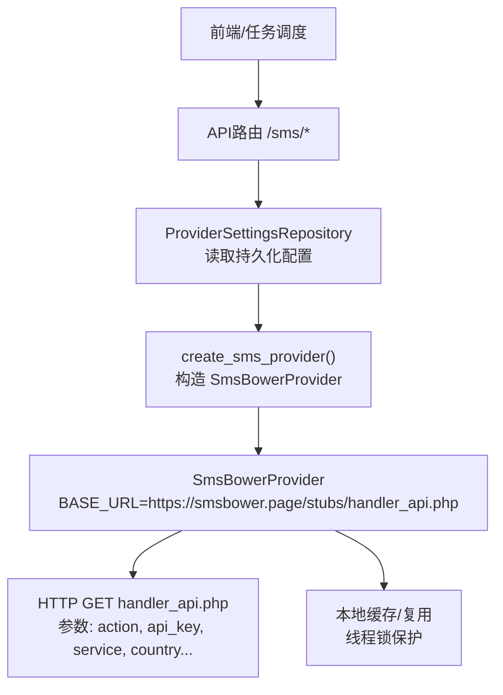
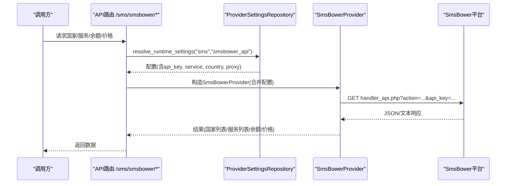
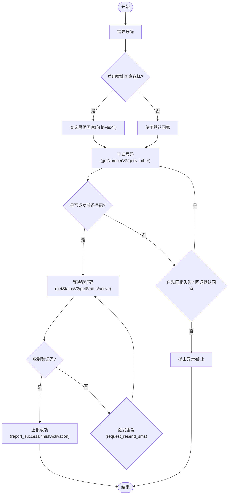
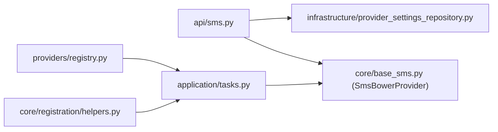

# SmsBower服务集成

<cite>
**本文引用的文件**
- [providers/sms/smsbower.py](file://providers/sms/smsbower.py)
- [core/base_sms.py](file://core/base_sms.py)
- [api/sms.py](file://api/sms.py)
- [providers/registry.py](file://providers/registry.py)
- [infrastructure/provider_settings_repository.py](file://infrastructure/provider_settings_repository.py)
- [core/registration/helpers.py](file://core/registration/helpers.py)
- [application/tasks.py](file://application/tasks.py)
- [tests/test_sms_provider.py](file://tests/test_sms_provider.py)
</cite>

## 目录
1. [简介](#简介)
2. [项目结构](#项目结构)
3. [核心组件](#核心组件)
4. [架构总览](#架构总览)
5. [详细组件分析](#详细组件分析)
6. [依赖关系分析](#依赖关系分析)
7. [性能与可靠性](#性能与可靠性)
8. [故障排查指南](#故障排查指南)
9. [结论](#结论)
10. [附录：配置与API参考](#附录：配置与api参考)

## 简介
本文件面向需要在系统中集成SmsBower短信接码服务的开发者，系统性说明其API规范、认证机制、数据交换格式、业务逻辑（号码供应商选择、服务分类、价格计算）、验证码获取的完整生命周期、错误处理与重试策略、配置项与代理支持，并提供调试技巧与常见问题定位方法。SmsBower在本项目中以“SMS-Activate兼容”的HTTP API形式实现，仅Base URL不同，复用HeroSMS/SMS-Activate的通用能力。

## 项目结构
围绕SmsBower的关键代码分布在以下位置：
- 提供者注册与发现：providers/registry.py
- 提供者实现与统一抽象：core/base_sms.py（包含SmsBowerProvider）
- 对外API路由：api/sms.py（暴露国家、服务、余额、价格等查询接口）
- 运行时配置解析：infrastructure/provider_settings_repository.py
- 注册流程中的电话回调装配：core/registration/helpers.py、application/tasks.py
- 单元测试覆盖：tests/test_sms_provider.py

图表来源
- [api/sms.py:152-166](file://api/sms.py#L152-L166)
- [core/base_sms.py:1028-1040](file://core/base_sms.py#L1028-L1040)
- [infrastructure/provider_settings_repository.py:39-55](file://infrastructure/provider_settings_repository.py#L39-L55)

章节来源
- [providers/registry.py:1-91](file://providers/registry.py#L1-L91)
- [core/base_sms.py:1-1266](file://core/base_sms.py#L1-L1266)
- [api/sms.py:1-215](file://api/sms.py#L1-L215)
- [infrastructure/provider_settings_repository.py:1-167](file://infrastructure/provider_settings_repository.py#L1-L167)
- [core/registration/helpers.py:79-147](file://core/registration/helpers.py#L79-L147)
- [application/tasks.py:602-629](file://application/tasks.py#L602-L629)

## 核心组件
- BaseSmsProvider：定义统一的手机号租用、验证码等待、取消、成功上报等接口契约。
- HeroSmsProvider：实现SMS-Activate/HeroSMS兼容的复杂逻辑，包括动态价格、V2/V1回退、状态轮询、自动重发、号码复用与去重、失败标记等。
- SmsBowerProvider：继承自HeroSmsProvider，仅重写BASE_URL为SmsBower端点，并强制所有接口携带api_key。
- PhoneCallbackController：封装“申请号码→等待验证码→成功/失败/清理”的生命周期，支持智能国家选择、回退策略、超时与重试。
- ProviderSettingsRepository：从数据库加载provider定义与配置，合并运行时覆盖值，形成最终配置字典。
- API路由：提供国家、服务、余额、价格、最优国家等查询接口，便于前端或外部系统调用。

章节来源
- [core/base_sms.py:28-71](file://core/base_sms.py#L28-L71)
- [core/base_sms.py:328-1026](file://core/base_sms.py#L328-L1026)
- [core/base_sms.py:1028-1040](file://core/base_sms.py#L1028-L1040)
- [core/base_sms.py:1103-1266](file://core/base_sms.py#L1103-L1266)
- [infrastructure/provider_settings_repository.py:39-55](file://infrastructure/provider_settings_repository.py#L39-L55)
- [api/sms.py:152-215](file://api/sms.py#L152-L215)

## 架构总览
SmsBower通过统一的Provider抽象接入系统，API层负责鉴权与参数组装，底层通过HTTP请求与SmsBower平台交互。PhoneCallbackController在注册流程中协调号码申请与验证码接收，内置重试、降级与资源释放策略。

图表来源
- [api/sms.py:152-215](file://api/sms.py#L152-L215)
- [core/base_sms.py:1028-1040](file://core/base_sms.py#L1028-L1040)
- [infrastructure/provider_settings_repository.py:39-55](file://infrastructure/provider_settings_repository.py#L39-L55)

## 详细组件分析

### SmsBowerProvider与API规范
- 基类与协议：BaseSmsProvider定义了get_number/get_code/cancel/report_success等标准方法。
- 兼容性与差异：SmsBowerProvider继承HeroSmsProvider，BASE_URL指向https://smsbower.page/stubs/handler_api.php；_request强制在所有请求中附带api_key（即使某些接口理论上可不带）。
- 常用action：
  - getNumber/getNumberV2：申请号码
  - getStatus/getStatusV2：查询验证码状态
  - getServicesList/getCountries/getPrices：查询服务、国家、价格
  - setStatus/cancelActivation/finishActivation：控制号码生命周期
  - getActiveActivations：查询活跃激活
- 数据格式：
  - V2接口返回JSON，包含activationId、phoneNumber、countryPhoneCode、activationCost等字段。
  - V1接口返回文本，如ACCESS_NUMBER:activationId:phoneNumber。
  - 状态查询可能返回STATUS_OK:code、STATUS_WAIT_CODE、STATUS_WAIT_RETRY、STATUS_CANCEL等。

章节来源
- [core/base_sms.py:28-71](file://core/base_sms.py#L28-L71)
- [core/base_sms.py:1028-1040](file://core/base_sms.py#L1028-L1040)
- [core/base_sms.py:645-712](file://core/base_sms.py#L645-L712)
- [core/base_sms.py:767-804](file://core/base_sms.py#L767-L804)

### 认证机制
- 认证参数：api_key作为查询参数传递至handler_api.php。SmsBowerProvider对所有请求均附加api_key。
- 配置来源：
  - 持久化配置：ProviderSettingsRepository根据provider_type="sms"和provider_key="smsbower_api"读取配置，合并默认值、存储的配置与运行时覆盖。
  - 请求覆盖：API路由允许通过payload.api_key临时覆盖。
- 安全建议：避免将api_key硬编码到前端；优先使用后端聚合配置。

章节来源
- [core/base_sms.py:1028-1040](file://core/base_sms.py#L1028-L1040)
- [infrastructure/provider_settings_repository.py:39-55](file://infrastructure/provider_settings_repository.py#L39-L55)
- [api/sms.py:152-166](file://api/sms.py#L152-L166)

### 数据交换格式
- 申请号码：
  - V2 JSON：{"activationId":"...","phoneNumber":"+...","countryPhoneCode":"...","activationCost":...}
  - V1文本："ACCESS_NUMBER:activationId:phoneNumber"
- 状态查询：
  - V1文本："STATUS_OK:code"、"STATUS_WAIT_CODE"、"STATUS_WAIT_RETRY"、"STATUS_CANCEL"
  - V2 JSON：可能包含status、sms/call通道信息、verificationType等
- 价格与服务：
  - getPrices：{country_id: {service_code: {cost/price, count}}}
  - getServicesList：数组或映射，需兼容多种返回形态
  - getCountries：数组或映射，需兼容多种返回形态

章节来源
- [core/base_sms.py:645-712](file://core/base_sms.py#L645-L712)
- [core/base_sms.py:767-804](file://core/base_sms.py#L767-L804)
- [core/base_sms.py:371-428](file://core/base_sms.py#L371-L428)

### 业务逻辑：号码供应商选择、服务分类、价格计算
- 服务分类：
  - 内部维护服务代码映射（如cursor→ot、chatgpt/openai→dr），用于不同平台的适配。
  - 可通过getServicesList动态获取服务列表。
- 国家选择：
  - 支持固定国家或智能选择：get_best_country按价格排序并过滤库存，优先选择满足最低库存与最高价格限制的国家。
  - 对OpenAI等平台存在国家白名单限制（例如仅泰国确认走SMS），可据此筛选。
- 价格计算：
  - 动态获取实际价格，设置maxPrice为实际价格的倍数（留余量），但不超过用户配置上限。
  - 若NO_NUMBERS且未达用户上限，则提高maxPrice重试。

章节来源
- [core/base_sms.py:77-96](file://core/base_sms.py#L77-L96)
- [core/base_sms.py:419-579](file://core/base_sms.py#L419-L579)
- [core/base_sms.py:645-712](file://core/base_sms.py#L645-L712)

### 验证码获取流程（完整生命周期）

图表来源
- [core/base_sms.py:1103-1266](file://core/base_sms.py#L1103-L1266)
- [core/base_sms.py:845-923](file://core/base_sms.py#L845-L923)
- [core/base_sms.py:645-712](file://core/base_sms.py#L645-L712)

章节来源
- [core/base_sms.py:1103-1266](file://core/base_sms.py#L1103-L1266)
- [core/base_sms.py:845-923](file://core/base_sms.py#L845-L923)

### 错误处理与重试机制
- 网络与API错误：
  - requests.get超时与raise_for_status捕获；对V2不可用或JSON解析失败时回退到V1。
  - 当getNumberV2返回NO_NUMBERS且未达到用户maxPrice上限时，提升maxPrice重试。
- 验证码等待：
  - 轮询getStatusV2/getStatus/getActiveActivations，遇到STATUS_WAIT_RETRY会主动设置状态并重试。
  - 长时间无码时触发重发（request_resend_sms），并可选调用外部重发回调（如OpenAI场景）。
- 号码复用与限制：
  - 基于本地缓存与线程锁实现号码复用，记录已用验证码与尝试过的短信事件键，避免重复提交。
  - 当目标服务拒绝号码或达到限额（limit/already/too many/exceeded/maximum/上限/已达），停止复用并清理。
- 资源释放：
  - 清理阶段若未完成，调用cancel或finishActivation确保号码释放。

章节来源
- [core/base_sms.py:645-712](file://core/base_sms.py#L645-L712)
- [core/base_sms.py:845-923](file://core/base_sms.py#L845-L923)
- [core/base_sms.py:983-1007](file://core/base_sms.py#L983-L1007)
- [core/base_sms.py:1233-1246](file://core/base_sms.py#L1233-L1246)

### 配置说明
- API端点：
  - BASE_URL = https://smsbower.page/stubs/handler_api.php
- 认证参数：
  - api_key：必须配置，所有接口均需携带
- 服务与国家：
  - default_service/default_country：可通过配置或请求覆盖
  - auto_select_country：启用后自动查询最优国家（价格最低+库存充足）
  - auto_country_min_stock/auto_country_max_price：智能选择的库存与价格阈值
- 价格控制：
  - max_price：最大价格限制；内部会根据实际价格动态调整maxPrice
- 代理支持：
  - sms_proxy/proxy：传入requests的proxies参数，支持http/https代理
- 超时与重试：
  - _request默认timeout=30；get_code默认timeout=120；wait_for_code默认timeout=180，轮询间隔3秒
- 号码复用：
  - register_reuse_phone_to_max：是否允许复用号码直到上限
  - register_phone_extra_max/register_phone_success_max：成功次数上限
- 配置来源优先级：
  - 定义默认值 → 持久化配置 → 运行时覆盖（extra/payload）

章节来源
- [core/base_sms.py:1028-1040](file://core/base_sms.py#L1028-L1040)
- [core/base_sms.py:1087-1099](file://core/base_sms.py#L1087-L1099)
- [core/base_sms.py:1131-1150](file://core/base_sms.py#L1131-L1150)
- [infrastructure/provider_settings_repository.py:39-55](file://infrastructure/provider_settings_repository.py#L39-L55)
- [api/sms.py:152-166](file://api/sms.py#L152-L166)

### 集成示例与调试技巧
- 快速上手步骤：
  1) 在ProviderSettingsRepository中保存smsbower_api配置（含api_key、service、country、proxy等）
  2) 调用/api/sms/smsbower/countries、/api/sms/smsbower/services、/api/sms/smsbower/balance、/api/sms/smsbower/prices验证连通性
  3) 在注册流程中使用create_phone_callbacks，传入provider_key="smsbower_api"与配置
  4) 监听日志输出，关注“准备租用手机号”“已成功租到号码”“等待短信验证码”“收到验证码”“短信验证成功”等关键日志
- 常见调试要点：
  - 检查api_key是否正确，未配置时会返回空列表或抛出400错误
  - 若自动国家选择失败，查看是否因库存不足或价格超限；必要时放宽min_stock或max_price
  - 若多次收到相同验证码但被忽略，检查attempted_sms_keys与used_codes的去重逻辑
  - 若目标服务拒绝号码，查看mark_send_failed是否命中限流关键词并停止复用
  - 网络超时或API限制：观察轮询与重发行为，必要时增大timeout或降低并发

章节来源
- [api/sms.py:152-215](file://api/sms.py#L152-L215)
- [core/base_sms.py:1103-1266](file://core/base_sms.py#L1103-L1266)
- [tests/test_sms_provider.py:79-266](file://tests/test_sms_provider.py#L79-L266)

## 依赖关系分析
- 模块耦合：
  - api/sms.py依赖ProviderSettingsRepository与SmsBowerProvider
  - core/base_sms.py提供统一抽象与具体实现，被api与注册流程共同使用
  - providers/registry.py负责插件发现与工厂创建
  - application/tasks.py与core/registration/helpers.py在任务执行时装配phone_callback
- 外部依赖：
  - requests用于HTTP请求
  - SQLModel用于持久化配置读写
- 潜在循环依赖：
  - 当前结构清晰，未见循环导入；ProviderSettingsRepository与definitions解耦

图表来源
- [api/sms.py:1-215](file://api/sms.py#L1-L215)
- [infrastructure/provider_settings_repository.py:1-167](file://infrastructure/provider_settings_repository.py#L1-L167)
- [core/base_sms.py:1-1266](file://core/base_sms.py#L1-L1266)
- [providers/registry.py:1-91](file://providers/registry.py#L1-L91)
- [application/tasks.py:602-629](file://application/tasks.py#L602-L629)
- [core/registration/helpers.py:79-147](file://core/registration/helpers.py#L79-L147)

章节来源
- [providers/registry.py:1-91](file://providers/registry.py#L1-L91)
- [application/tasks.py:602-629](file://application/tasks.py#L602-L629)
- [core/registration/helpers.py:79-147](file://core/registration/helpers.py#L79-L147)

## 性能与可靠性
- 性能优化：
  - 动态价格与maxPrice策略减少虚拟号码分配，提高成功率
  - 号码复用与本地缓存减少重复申请，降低延迟与成本
  - 多源状态查询（V2/V1/active）提高验证码获取鲁棒性
- 可靠性保障：
  - 超时与重试：网络超时、API限制、服务降级均有相应处理
  - 去重机制：基于sms_key与used_codes避免重复提交
  - 资源释放：清理阶段确保号码释放，防止资源泄漏
- 监控建议：
  - 记录每次getNumberV2/getNumber的请求与响应摘要
  - 统计不同国家的成功率与平均耗时
  - 监控reusability指标（alive、remaining_seconds、stop_reason）

[本节为通用指导，不直接分析具体文件]

## 故障排查指南
- 未配置API Key：
  - 现象：/sms/smsbower/countries返回空列表；/sms/smsbower/balance报400
  - 处理：检查ProviderSettingsRepository中smsbower_api_key是否设置
- 无可用号码：
  - 现象：getNumber返回NO_NUMBERS
  - 处理：提高maxPrice或切换国家；检查库存与价格限制
- 验证码迟迟未到：
  - 现象：轮询多次仍为STATUS_WAIT_CODE
  - 处理：检查重发逻辑是否触发；确认目标平台是否发送；适当延长timeout
- 号码被拒绝：
  - 现象：mark_send_failed命中限流关键词
  - 处理：停止复用，更换国家或服务；检查目标平台限制
- 重复验证码被忽略：
  - 现象：同一验证码被used_codes或attempted_sms_keys过滤
  - 处理：确认allow_same_code逻辑；必要时调整去重策略

章节来源
- [api/sms.py:152-215](file://api/sms.py#L152-L215)
- [core/base_sms.py:645-712](file://core/base_sms.py#L645-L712)
- [core/base_sms.py:845-923](file://core/base_sms.py#L845-L923)
- [core/base_sms.py:983-1007](file://core/base_sms.py#L983-L1007)

## 结论
SmsBower在本项目中以高度复用的方式接入，借助HeroSmsProvider的成熟能力实现了稳定的号码申请、验证码获取、错误处理与资源管理。通过ProviderSettingsRepository集中管理配置，结合API路由提供便捷的查询能力，开发者可以快速完成集成与调试。建议在生产环境中合理配置国家选择策略、价格上限与超时参数，并结合日志与监控持续优化成功率与成本。

[本节为总结，不直接分析具体文件]

## 附录：配置与API参考
- 配置键（示例）：
  - smsbower_api_key：认证密钥
  - sms_service/smsbower_service：默认服务代码
  - sms_country/smsbower_country：默认国家ID
  - smsbower_max_price：最大价格限制
  - sms_proxy/proxy：代理地址
  - register_reuse_phone_to_max：是否允许复用
  - register_phone_extra_max/register_phone_success_max：成功次数上限
  - herosms_auto_country/smsbower_auto_country：智能国家选择开关
  - herosms_auto_country_min_stock/smsbower_auto_country_min_stock：最小库存
  - herosms_auto_country_max_price/smsbower_auto_country_max_price：最高价格
- API端点（示例）：
  - GET /sms/smsbower/countries：获取国家列表
  - GET /sms/smsbower/services?country=...：获取服务列表
  - POST /sms/smsbower/balance：查询余额
  - POST /sms/smsbower/prices：查询价格
- 调试技巧：
  - 使用浏览器或curl测试API端点，确认连通性与鉴权
  - 开启详细日志，关注关键节点（申请号码、等待验证码、重发、成功/失败）
  - 针对特定平台（如OpenAI）注意国家白名单与WhatsApp限制

章节来源
- [core/base_sms.py:1087-1099](file://core/base_sms.py#L1087-L1099)
- [core/base_sms.py:1131-1150](file://core/base_sms.py#L1131-L1150)
- [api/sms.py:152-215](file://api/sms.py#L152-L215)
- [infrastructure/provider_settings_repository.py:39-55](file://infrastructure/provider_settings_repository.py#L39-L55)