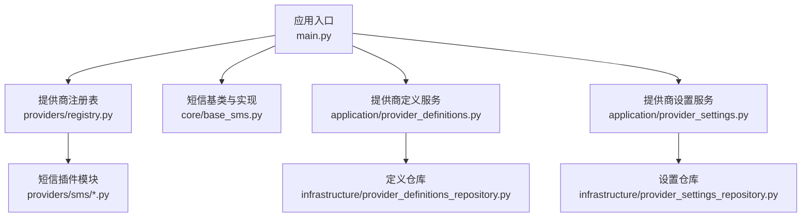
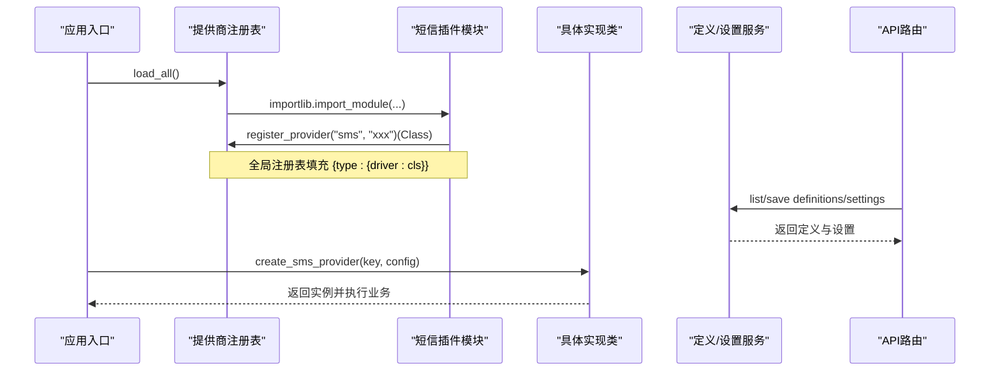
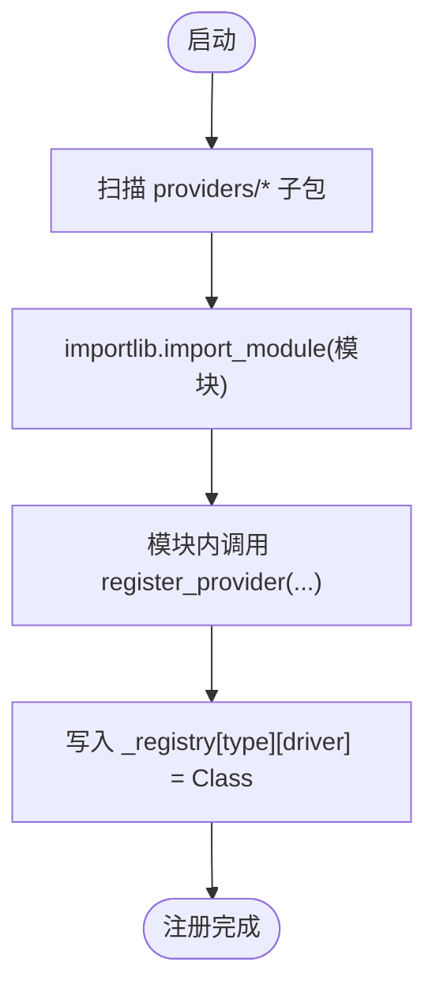
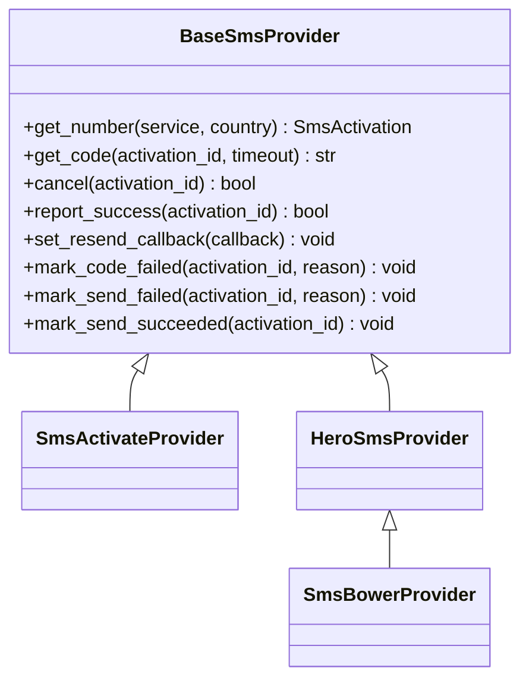
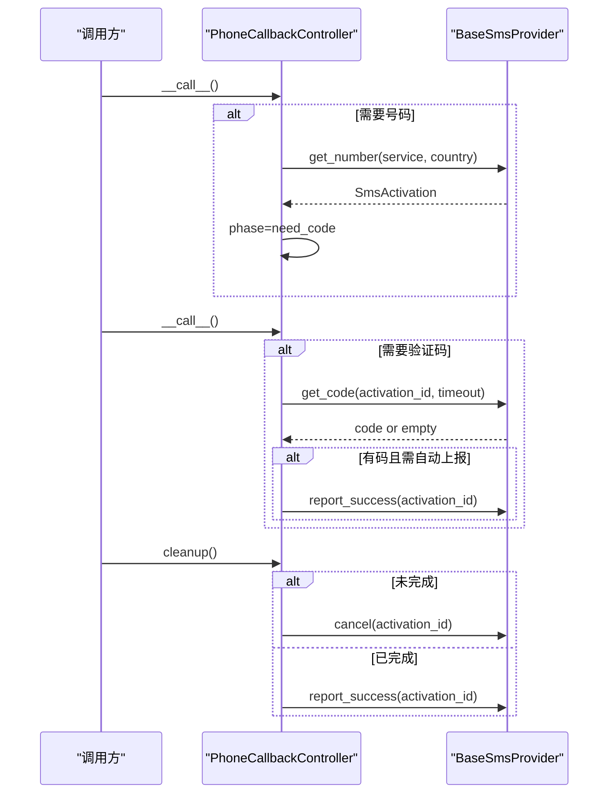
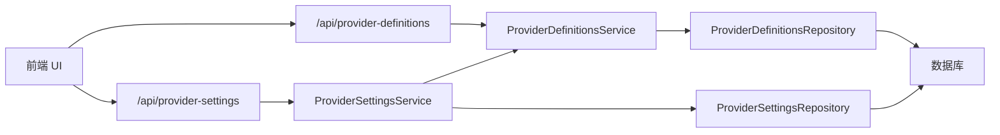
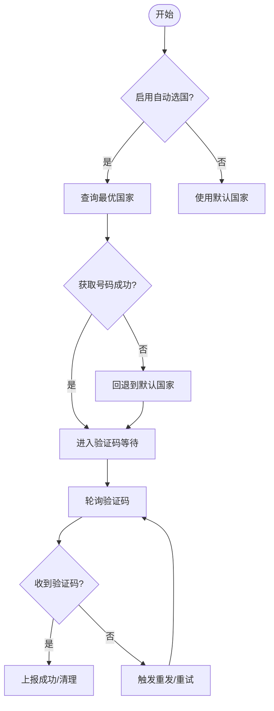
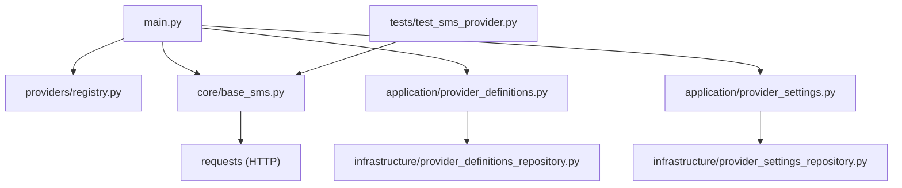

# 短信提供商注册表

<cite>
**本文引用的文件**
- [main.py](file://main.py)
- [providers/registry.py](file://providers/registry.py)
- [core/base_sms.py](file://core/base_sms.py)
- [providers/sms/herosms.py](file://providers/sms/herosms.py)
- [providers/sms/sms_activate.py](file://providers/sms/sms_activate.py)
- [providers/sms/smsbower.py](file://providers/sms/smsbower.py)
- [infrastructure/provider_definitions_repository.py](file://infrastructure/provider_definitions_repository.py)
- [application/provider_definitions.py](file://application/provider_definitions.py)
- [api/provider_definitions.py](file://api/provider_definitions.py)
- [application/provider_settings.py](file://application/provider_settings.py)
- [api/provider_settings.py](file://api/provider_settings.py)
- [infrastructure/provider_settings_repository.py](file://infrastructure/provider_settings_repository.py)
- [tests/test_sms_provider.py](file://tests/test_sms_provider.py)
</cite>

## 目录
1. [简介](#简介)
2. [项目结构](#项目结构)
3. [核心组件](#核心组件)
4. [架构总览](#架构总览)
5. [详细组件分析](#详细组件分析)
6. [依赖关系分析](#依赖关系分析)
7. [性能与可用性](#性能与可用性)
8. [故障排查指南](#故障排查指南)
9. [结论](#结论)
10. [附录：扩展开发指南](#附录：扩展开发指南)

## 简介
本系统提供统一的短信服务提供商（SMS Provider）注册、发现、配置与运行时实例化机制。通过“定义 + 设置 + 驱动”的分层设计，开发者可以以插件方式接入新的接码平台；系统在启动时自动扫描并加载所有已注册的短信提供商，并在任务执行时根据配置动态创建具体实现实例，完成号码租用、验证码获取、成功/失败上报与资源释放等完整生命周期管理。同时提供多提供商切换策略（默认/启用顺序、智能国家选择、回退重试），以及面向前端的可视化配置与管理能力。

## 项目结构
- 应用入口负责初始化数据库、加载平台与短信提供商插件，并启动调度与服务。
- 提供商注册表位于 providers.registry，提供装饰器式注册、模块扫描导入、统一工厂方法。
- 短信提供商基类与具体实现位于 core.base_sms，包含 SMS-Activate、HeroSMS、SMSBower 的实现及 PhoneCallbackController。
- 提供商“定义”与“设置”分别由 infrastructure/application/api 三层协作管理，支持内置模板、用户自定义、字段校验与序列化。
- 前端通过 ProviderCards 等组件调用后端 API 完成新增、启用、设为默认等操作。

**图表来源**
- [main.py:63-71](file://main.py#L63-L71)
- [providers/registry.py:70-90](file://providers/registry.py#L70-L90)
- [core/base_sms.py:28-67](file://core/base_sms.py#L28-L67)
- [application/provider_definitions.py:6-53](file://application/provider_definitions.py#L6-L53)
- [application/provider_settings.py:7-88](file://application/provider_settings.py#L7-L88)

**章节来源**
- [main.py:63-71](file://main.py#L63-L71)
- [providers/registry.py:70-90](file://providers/registry.py#L70-L90)

## 核心组件
- 提供商注册表：提供 register_provider 装饰器、load_all 自动扫描、create_provider 工厂方法。
- 短信提供商基类 BaseSmsProvider：定义 get_number/get_code/cancel/report_success 等接口契约。
- 具体实现：SmsActivateProvider、HeroSmsProvider、SmsBowerProvider。
- PhoneCallbackController：封装手机号租用、验证码等待、成功/失败上报、清理释放的完整流程。
- 提供商定义与设置：定义元数据（label、fields、auth_modes）、运行时配置（config/auth/metadata）。
- API 层：暴露 /provider-definitions 与 /provider-settings 等 REST 接口供前端使用。

**章节来源**
- [providers/registry.py:38-67](file://providers/registry.py#L38-L67)
- [core/base_sms.py:28-67](file://core/base_sms.py#L28-L67)
- [core/base_sms.py:108-182](file://core/base_sms.py#L108-L182)
- [core/base_sms.py:328-1041](file://core/base_sms.py#L328-L1041)
- [core/base_sms.py:1103-1266](file://core/base_sms.py#L1103-L1266)
- [infrastructure/provider_definitions_repository.py:17-384](file://infrastructure/provider_definitions_repository.py#L17-L384)
- [application/provider_definitions.py:6-53](file://application/provider_definitions.py#L6-L53)
- [application/provider_settings.py:7-88](file://application/provider_settings.py#L7-L88)
- [api/provider_definitions.py:1-53](file://api/provider_definitions.py#L1-L53)
- [api/provider_settings.py:1-120](file://api/provider_settings.py#L1-L120)

## 架构总览
系统采用“插件式注册 + 配置驱动”的架构：
- 启动阶段：应用入口初始化数据库后，调用 load_all() 扫描 providers/* 下的短信插件模块，触发各模块中的 register_provider 装饰器，将具体类注入全局注册表。
- 运行阶段：业务侧通过 create_sms_provider 或 PhoneCallbackController 按 provider_key 与配置创建实例，执行号码租用与验证码获取。
- 配置管理：通过 /provider-definitions 与 /provider-settings 维护提供商元数据与运行时配置，前端可直观增删改查、启用/禁用、设置默认项。

**图表来源**
- [main.py:63-71](file://main.py#L63-L71)
- [providers/registry.py:70-90](file://providers/registry.py#L70-L90)
- [providers/sms/herosms.py:10-18](file://providers/sms/herosms.py#L10-L18)
- [providers/sms/sms_activate.py:7-10](file://providers/sms/sms_activate.py#L7-L10)
- [providers/sms/smsbower.py:6-9](file://providers/sms/smsbower.py#L6-L9)
- [api/provider_definitions.py:24-53](file://api/provider_definitions.py#L24-L53)
- [api/provider_settings.py:25-120](file://api/provider_settings.py#L25-L120)

## 详细组件分析

### 提供商注册表与动态发现
- 注册表结构：_registry 为嵌套字典 {provider_type: {driver_type: class}}，支持 mailbox/captcha/sms/proxy 四类。
- 装饰器注册：register_provider(provider_type, driver_type) 将类映射到注册表。
- 自动加载：load_all() 在启动时遍历 providers.captcha/proxy/sms/mailbox 子包，逐个 import 模块，触发装饰器注册。
- 工厂方法：create_provider(type, driver, config) 查找类并调用其 from_config(config) 构造实例（短信实现未使用该通用工厂，而是使用专用 create_sms_provider）。

**图表来源**
- [providers/registry.py:28-43](file://providers/registry.py#L28-L43)
- [providers/registry.py:70-90](file://providers/registry.py#L70-L90)

**章节来源**
- [providers/registry.py:28-90](file://providers/registry.py#L28-L90)

### 短信提供商基类与具体实现
- BaseSmsProvider：抽象出 get_number/get_code/cancel/report_success 等核心方法，并提供可选回调 mark_code_failed/mark_send_failed/mark_send_succeeded/set_resend_callback。
- SmsActivateProvider：对接 SMS-Activate 平台，支持余额查询、号码租用、状态轮询、取消与成功上报。
- HeroSmsProvider：功能更丰富，支持 V2 JSON 接口、号码复用缓存、自动重发、智能国家选择、价格上限控制、事件去重等。
- SmsBowerProvider：继承 HeroSmsProvider，仅覆盖 BASE_URL 与请求逻辑，兼容 HeroSMS 风格 API。

**图表来源**
- [core/base_sms.py:28-67](file://core/base_sms.py#L28-L67)
- [core/base_sms.py:108-182](file://core/base_sms.py#L108-L182)
- [core/base_sms.py:328-1041](file://core/base_sms.py#L328-L1041)

**章节来源**
- [core/base_sms.py:28-67](file://core/base_sms.py#L28-L67)
- [core/base_sms.py:108-182](file://core/base_sms.py#L108-L182)
- [core/base_sms.py:328-1041](file://core/base_sms.py#L328-L1041)

### PhoneCallbackController 生命周期管理
- 阶段模型：need_number → need_code → done，支持外部回调 set_resend_callback。
- 号码租用：优先尝试自动选国（HeroSMS/SMSBower），失败回退到默认国家；支持线程锁保护共享状态。
- 验证码等待：轮询 getStatusV2/getStatus/getActiveActivations，去重处理，必要时触发重发。
- 成功/失败上报：根据 auto_report_success_on_code 决定是否立即上报；失败时记录原因并触发上游重发。
- 资源清理：cleanup 中根据是否已完成决定 cancel 或 report_success，并释放验证锁。

**图表来源**
- [core/base_sms.py:1103-1266](file://core/base_sms.py#L1103-L1266)

**章节来源**
- [core/base_sms.py:1103-1266](file://core/base_sms.py#L1103-L1266)

### 提供商定义与设置（命名约定、接口规范、依赖注入）
- 定义（Definition）：描述 provider_type、provider_key、driver_type、label、description、auth_modes、fields、category、enabled 等元数据；支持内置种子数据与用户自定义。
- 设置（Setting）：存储运行时配置（config/auth/metadata）、显示名、认证模式、是否启用、是否默认等。
- 命名约定：
  - provider_type：如 sms、mailbox、captcha、proxy。
  - provider_key：唯一标识，如 herosms_api、sms_activate_api、smsbower_api。
  - driver_type：实际驱动族，通常与 provider_key 一致或指向同一实现族。
- 依赖注入：
  - 插件模块在 import 时通过 register_provider 将类注入注册表。
  - 运行时通过 create_sms_provider 按 provider_key 解析配置并构造实例。
  - 前端通过 API 保存 definition 与 setting，后端服务层组合定义与设置生成最终配置。

**图表来源**
- [api/provider_definitions.py:1-53](file://api/provider_definitions.py#L1-L53)
- [api/provider_settings.py:1-120](file://api/provider_settings.py#L1-L120)
- [application/provider_definitions.py:6-53](file://application/provider_definitions.py#L6-L53)
- [application/provider_settings.py:7-88](file://application/provider_settings.py#L7-L88)
- [infrastructure/provider_definitions_repository.py:387-561](file://infrastructure/provider_definitions_repository.py#L387-L561)
- [infrastructure/provider_settings_repository.py:39-125](file://infrastructure/provider_settings_repository.py#L39-L125)

**章节来源**
- [infrastructure/provider_definitions_repository.py:17-384](file://infrastructure/provider_definitions_repository.py#L17-L384)
- [infrastructure/provider_definitions_repository.py:387-561](file://infrastructure/provider_definitions_repository.py#L387-L561)
- [application/provider_definitions.py:6-53](file://application/provider_definitions.py#L6-L53)
- [application/provider_settings.py:7-88](file://application/provider_settings.py#L7-L88)
- [api/provider_definitions.py:1-53](file://api/provider_definitions.py#L1-L53)
- [api/provider_settings.py:1-120](file://api/provider_settings.py#L1-L120)

### 多提供商切换策略
- 默认与启用顺序：ProviderSettingsRepository.list_enabled 按 is_default 与 id 排序，前端可设置默认项。
- 智能国家选择：HeroSmsProvider.get_best_country 基于价格与库存选择最优国家；PhoneCallbackController 在 need_number 阶段自动尝试，失败回退到默认国家。
- 故障转移：自动选国失败时回退；验证码获取失败时触发重发；未知错误抛出异常并由上层重试。
- 性能监控：HeroSmsProvider 提供 reuse_info 与 last_code_result，便于统计复用次数、剩余时间、停止原因等。

**图表来源**
- [core/base_sms.py:527-579](file://core/base_sms.py#L527-L579)
- [core/base_sms.py:1124-1192](file://core/base_sms.py#L1124-L1192)
- [core/base_sms.py:845-912](file://core/base_sms.py#L845-L912)

**章节来源**
- [core/base_sms.py:527-579](file://core/base_sms.py#L527-L579)
- [core/base_sms.py:845-912](file://core/base_sms.py#L845-L912)
- [core/base_sms.py:1124-1192](file://core/base_sms.py#L1124-L1192)

## 依赖关系分析
- 应用入口 main.py 在 lifespan 中依次初始化数据库、加载平台与短信提供商插件，并启动调度与服务。
- 提供商注册表依赖 Python 标准库 importlib/pkgutil 进行模块扫描与导入。
- 短信实现依赖 requests 进行 HTTP 调用，并使用线程锁保护共享缓存。
- 定义与设置服务依赖 SQLModel Session 访问数据库，提供 CRUD 与序列化能力。
- 测试用例通过 monkeypatch 模拟网络与缓存，验证控制器行为与边界条件。

**图表来源**
- [main.py:63-71](file://main.py#L63-L71)
- [providers/registry.py:21-24](file://providers/registry.py#L21-L24)
- [core/base_sms.py:4-15](file://core/base_sms.py#L4-L15)
- [infrastructure/provider_definitions_repository.py:6-8](file://infrastructure/provider_definitions_repository.py#L6-L8)
- [infrastructure/provider_settings_repository.py:6-8](file://infrastructure/provider_settings_repository.py#L6-L8)
- [tests/test_sms_provider.py:1-15](file://tests/test_sms_provider.py#L1-L15)

**章节来源**
- [main.py:63-71](file://main.py#L63-L71)
- [providers/registry.py:21-24](file://providers/registry.py#L21-L24)
- [core/base_sms.py:4-15](file://core/base_sms.py#L4-L15)
- [infrastructure/provider_definitions_repository.py:6-8](file://infrastructure/provider_definitions_repository.py#L6-L8)
- [infrastructure/provider_settings_repository.py:6-8](file://infrastructure/provider_settings_repository.py#L6-L8)
- [tests/test_sms_provider.py:1-15](file://tests/test_sms_provider.py#L1-L15)

## 性能与可用性
- 号码复用与缓存：HeroSmsProvider 使用进程级缓存与持久化文件，减少重复租用成本；支持最大成功次数与生命周期控制。
- 智能国家选择：基于价格与库存排序，提升成功率并降低成本。
- 并发安全：使用线程锁保护共享状态，避免竞争条件。
- 超时与重试：验证码等待支持超时与轮询间隔控制；自动重发机制提高鲁棒性。
- 资源清理：cleanup 确保未使用号码及时释放，避免资源泄漏。

[本节为通用指导，不直接分析具体文件]

## 故障排查指南
- 常见错误：
  - 未配置 API Key：create_sms_provider 会抛出运行时异常，检查对应 provider_key 的配置项。
  - 无可用号码：检查国家代码与服务映射，或启用自动选国；查看日志中的 NO_NUMBERS 提示。
  - 验证码未到达：确认目标服务是否正确发送；检查重发回调是否生效；查看 last_code_result 与 used_codes/attempted_sms_keys。
- 调试建议：
  - 使用单元测试模拟网络与缓存，验证控制器行为（参考 tests/test_sms_provider.py）。
  - 通过 /api/provider-settings/test 对邮箱提供商进行测试（短信提供商暂不支持在线测试，需在任务中验证）。
  - 观察 PhoneCallbackController 日志，确认阶段转换与关键操作。

**章节来源**
- [core/base_sms.py:1063-1100](file://core/base_sms.py#L1063-L1100)
- [core/base_sms.py:1124-1192](file://core/base_sms.py#L1124-L1192)
- [tests/test_sms_provider.py:42-77](file://tests/test_sms_provider.py#L42-L77)
- [api/provider_settings.py:61-82](file://api/provider_settings.py#L61-L82)

## 结论
本系统通过清晰的注册表机制、标准化的提供商接口、完善的定义与设置管理，实现了短信提供商的动态发现、灵活配置与稳定运行。结合智能国家选择、号码复用、自动重发与资源清理，提供了高可用与高性能的接码能力。开发者可依据扩展指南快速接入新平台，并通过前端界面进行可视化管理。

[本节为总结，不直接分析具体文件]

## 附录：扩展开发指南

### 新增短信提供商步骤
1. 实现提供商类：
   - 继承 BaseSmsProvider，实现 get_number/get_code/cancel/report_success 等方法。
   - 如需复用 HeroSMS 能力，可继承 HeroSmsProvider 并覆盖 BASE_URL 与请求逻辑。
2. 注册提供商：
   - 在 providers/sms 下新建模块，导入实现类并调用 register_provider("sms", "your_driver")(YourProvider)。
   - 确保模块能被 load_all() 扫描到。
3. 添加定义与设置：
   - 在 infrastructure/provider_definitions_repository.py 的 _BUILTIN_DEFINITIONS 中添加条目，定义 label、fields、auth_modes 等。
   - 前端可通过 /api/provider-definitions 与 /api/provider-settings 创建与编辑。
4. 配置与测试：
   - 在前端启用并填写配置，或通过 API 保存。
   - 使用单元测试模拟网络与缓存，验证控制器行为与边界条件。

**章节来源**
- [core/base_sms.py:28-67](file://core/base_sms.py#L28-L67)
- [core/base_sms.py:1028-1041](file://core/base_sms.py#L1028-L1041)
- [providers/sms/herosms.py:10-18](file://providers/sms/herosms.py#L10-L18)
- [providers/sms/sms_activate.py:7-10](file://providers/sms/sms_activate.py#L7-L10)
- [providers/sms/smsbower.py:6-9](file://providers/sms/smsbower.py#L6-L9)
- [infrastructure/provider_definitions_repository.py:17-384](file://infrastructure/provider_definitions_repository.py#L17-L384)
- [tests/test_sms_provider.py:42-77](file://tests/test_sms_provider.py#L42-L77)

### 最佳实践
- 命名规范：provider_key 应简洁明确，driver_type 与实际实现保持一致。
- 配置安全：敏感字段（如 API Key）标记为 secret，避免明文展示。
- 容错设计：实现 mark_code_failed/mark_send_failed 以触发重发与停止复用。
- 性能优化：启用号码复用与智能国家选择，合理设置超时与轮询间隔。
- 可观测性：利用 reuse_info 与日志输出监控状态与问题。

[本节为通用指导，不直接分析具体文件]