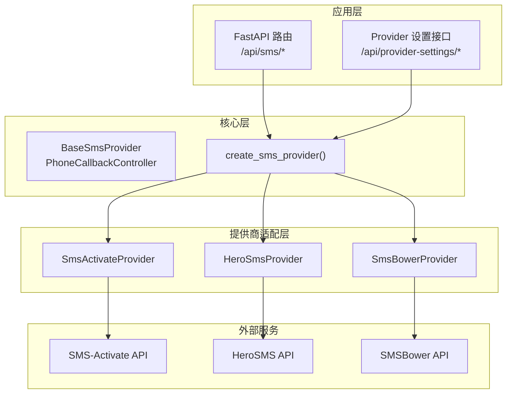
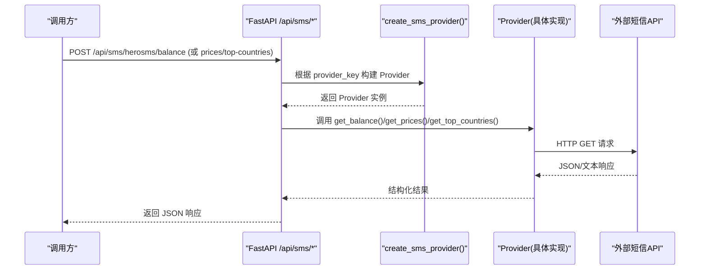
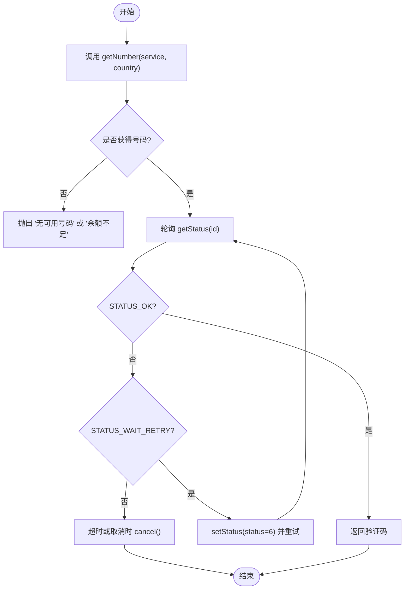
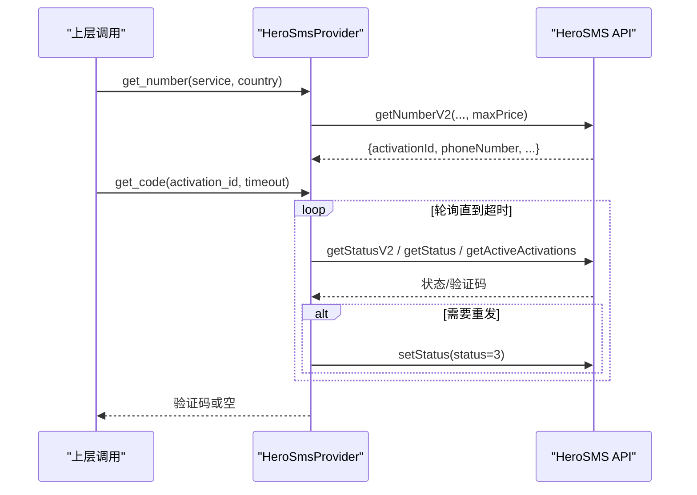
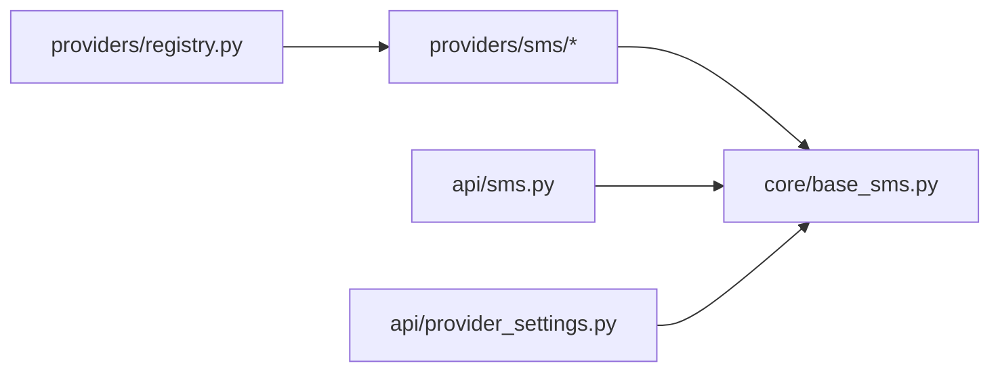

# 短信服务提供商集成

<cite>
**本文引用的文件**
- [core/base_sms.py](file://core/base_sms.py)
- [providers/sms/herosms.py](file://providers/sms/herosms.py)
- [providers/sms/sms_activate.py](file://providers/sms/sms_activate.py)
- [providers/sms/smsbower.py](file://providers/sms/smsbower.py)
- [api/sms.py](file://api/sms.py)
- [providers/registry.py](file://providers/registry.py)
- [application/provider_definitions.py](file://application/provider_definitions.py)
- [api/provider_settings.py](file://api/provider_settings.py)
- [tests/test_herosms_api.py](file://tests/test_herosms_api.py)
- [tests/test_sms_provider.py](file://tests/test_sms_provider.py)
</cite>

## 目录
1. [简介](#简介)
2. [项目结构](#项目结构)
3. [核心组件](#核心组件)
4. [架构总览](#架构总览)
5. [详细组件分析](#详细组件分析)
6. [依赖关系分析](#依赖关系分析)
7. [性能与并发优化](#性能与并发优化)
8. [故障排查指南](#故障排查指南)
9. [结论](#结论)
10. [附录：配置与最佳实践](#附录配置与最佳实践)

## 简介
本文件面向“短信验证码获取”的完整集成实现，覆盖 Herosms、SMS Activate、SmsBower 三大接码服务的接入方式。文档从系统架构、数据流、错误处理、配置管理到性能优化进行系统化说明，并提供可操作的集成示例与最佳实践，帮助读者在生产环境中稳定、高效地接入短信服务。

## 项目结构
围绕短信能力，代码采用“统一抽象 + 多提供商实现 + 注册发现 + API 暴露”的分层设计：
- 统一抽象与流程控制：core/base_sms.py
- 各提供商适配：providers/sms/*（herosms.py、sms_activate.py、smsbower.py）
- 全局注册与加载：providers/registry.py
- HTTP API 暴露：api/sms.py
- 配置定义与设置：application/provider_definitions.py、api/provider_settings.py
- 测试用例：tests/test_*

**图表来源**
- [api/sms.py:1-215](file://api/sms.py#L1-L215)
- [core/base_sms.py:1063-1100](file://core/base_sms.py#L1063-L1100)
- [providers/sms/herosms.py:1-19](file://providers/sms/herosms.py#L1-L19)
- [providers/sms/sms_activate.py:1-11](file://providers/sms/sms_activate.py#L1-L11)
- [providers/sms/smsbower.py:1-10](file://providers/sms/smsbower.py#L1-L10)

**章节来源**
- [api/sms.py:1-215](file://api/sms.py#L1-L215)
- [providers/registry.py:1-91](file://providers/registry.py#L1-L91)
- [application/provider_definitions.py:1-54](file://application/provider_definitions.py#L1-L54)
- [api/provider_settings.py:1-120](file://api/provider_settings.py#L1-L120)

## 核心组件
- BaseSmsProvider：定义统一的号码租用、验证码等待、取消、成功上报等接口。
- SmsActivateProvider：基于 SMS-Activate 兼容 API 的实现，支持余额查询、国家/服务映射、状态轮询与重试。
- HeroSmsProvider：在基础之上增强“重发、去重、短号复用、智能国家选择、V2/V1 双通道状态查询”。
- SmsBowerProvider：继承 HeroSmsProvider，仅更换 Base URL，保持 API 兼容。
- PhoneCallbackController：封装“先租号后取码”的回调生命周期，自动处理超时、释放、成功标记与重发回调。
- create_sms_provider：根据 provider_key 动态创建具体提供商实例。

**章节来源**
- [core/base_sms.py:28-71](file://core/base_sms.py#L28-L71)
- [core/base_sms.py:108-182](file://core/base_sms.py#L108-L182)
- [core/base_sms.py:328-1026](file://core/base_sms.py#L328-L1026)
- [core/base_sms.py:1028-1041](file://core/base_sms.py#L1028-L1041)
- [core/base_sms.py:1103-1246](file://core/base_sms.py#L1103-L1246)
- [core/base_sms.py:1063-1100](file://core/base_sms.py#L1063-L1100)

## 架构总览
整体调用链：前端或任务调度通过 FastAPI 暴露的 /api/sms/* 触发；后端解析请求并构造 Provider；Provider 调用各自外部 API；PhoneCallbackController 协调“租号 → 轮询 → 取码 → 完成/取消”的完整流程。

**图表来源**
- [api/sms.py:64-117](file://api/sms.py#L64-L117)
- [core/base_sms.py:1063-1100](file://core/base_sms.py#L1063-L1100)
- [core/base_sms.py:365-428](file://core/base_sms.py#L365-L428)

## 详细组件分析

### SMS-Activate 提供商
- 认证与请求：通过 api_key 作为查询参数，GET 到固定 BASE_URL。
- 服务与国家映射：内置服务与国家 ID 映射表，支持数字国家 ID 直接传入。
- 号码租用：getNumber 返回 ACCESS_NUMBER:activationId:phoneNumber；无号/余额不足会抛出明确异常。
- 验证码获取：getStatus 轮询，遇到 WAIT_CODE/WAIT_RETRY 循环等待；超时则 cancel。
- 取消与成功上报：setStatus 控制状态，report_success 标记使用成功。

**图表来源**
- [core/base_sms.py:108-182](file://core/base_sms.py#L108-L182)

**章节来源**
- [core/base_sms.py:77-106](file://core/base_sms.py#L77-L106)
- [core/base_sms.py:108-182](file://core/base_sms.py#L108-L182)

### HeroSMS 提供商
- 认证与请求：GET 到 hero-sms.com/stubs/handler_api.php，支持代理与超时控制。
- 号码租用：优先 getNumberV2(JSON)，失败回退 getNumber(文本)；动态计算 maxPrice 提高成功率。
- 智能国家选择：getTopCountriesByServiceRank/getPrices 排序，按价格与库存筛选最优国家。
- 验证码获取：wait_for_code 同时尝试 v2/v1/active 三种来源，去重避免重复提交无效验证码；支持定时重发。
- 号码复用：本地缓存激活信息，限制有效期与成功次数，减少重复租号成本。
- 取消与完成：cancelActivation/finishActivation 兜底 setStatus。

**图表来源**
- [core/base_sms.py:645-712](file://core/base_sms.py#L645-L712)
- [core/base_sms.py:845-923](file://core/base_sms.py#L845-L923)

**章节来源**
- [core/base_sms.py:328-526](file://core/base_sms.py#L328-L526)
- [core/base_sms.py:527-580](file://core/base_sms.py#L527-L580)
- [core/base_sms.py:581-666](file://core/base_sms.py#L581-L666)
- [core/base_sms.py:725-765](file://core/base_sms.py#L725-L765)
- [core/base_sms.py:767-837](file://core/base_sms.py#L767-L837)
- [core/base_sms.py:845-923](file://core/base_sms.py#L845-L923)
- [core/base_sms.py:925-1026](file://core/base_sms.py#L925-L1026)

### SMSBower 提供商
- 与 HeroSMS 完全一致的 API 行为，仅 Base URL 不同（smsbower.page）。
- 所有接口均需携带 api_key。

**章节来源**
- [providers/sms/smsbower.py:1-10](file://providers/sms/smsbower.py#L1-L10)
- [core/base_sms.py:1028-1041](file://core/base_sms.py#L1028-L1041)

### 提供商注册与工厂
- 各 providers/sms/*.py 模块通过 register_provider("sms", "<key>") 将类注入全局注册表。
- load_all() 扫描 providers 包并导入所有子模块，完成自动发现。
- create_sms_provider(provider_key, config) 根据 key 创建对应实例，校验必填字段。

**章节来源**
- [providers/sms/herosms.py:1-19](file://providers/sms/herosms.py#L1-L19)
- [providers/sms/sms_activate.py:1-11](file://providers/sms/sms_activate.py#L1-L11)
- [providers/sms/smsbower.py:1-10](file://providers/sms/smsbower.py#L1-L10)
- [providers/registry.py:1-91](file://providers/registry.py#L1-L91)
- [core/base_sms.py:1063-1100](file://core/base_sms.py#L1063-L1100)

### HTTP API 暴露
- /api/sms/herosms/*：国家列表、服务列表、余额、价格、top countries、best country。
- /api/sms/smsbower/*：同上，但针对 SMSBower。
- 所有接口均支持从请求体或持久化设置中读取 api_key、service、country、proxy 等参数。

**章节来源**
- [api/sms.py:1-215](file://api/sms.py#L1-L215)
- [tests/test_herosms_api.py:1-28](file://tests/test_herosms_api.py#L1-L28)

### 回调控制器 PhoneCallbackController
- 生命周期：need_number → need_code → done/cleanup。
- 自动国家选择：当启用 herosms_auto_country/smsbower_auto_country 时，优先查询最优国家，失败回退默认国家。
- 验证码等待：调用 provider.get_code(timeout=180)，支持自动报告成功或延迟成功。
- 清理策略：未成功则 cancel，已成功则 finish；确保资源释放。

**章节来源**
- [core/base_sms.py:1103-1246](file://core/base_sms.py#L1103-L1246)

## 依赖关系分析
- 低耦合：BaseSmsProvider 定义契约，具体实现只关注各自 API 差异。
- 高内聚：每个提供商模块职责单一，便于扩展与维护。
- 注册解耦：通过 registry 统一管理，新增提供商只需注册即可被系统发现。
- API 层与业务层分离：/api/sms/* 仅负责入参校验与转发，核心逻辑集中在 core/base_sms.py。

**图表来源**
- [providers/registry.py:1-91](file://providers/registry.py#L1-L91)
- [api/sms.py:1-215](file://api/sms.py#L1-L215)
- [api/provider_settings.py:1-120](file://api/provider_settings.py#L1-L120)

**章节来源**
- [providers/registry.py:1-91](file://providers/registry.py#L1-L91)
- [core/base_sms.py:1063-1100](file://core/base_sms.py#L1063-L1100)

## 性能与并发优化
- 连接与超时：HTTP 请求统一设置超时（如 20-30s），避免阻塞；可通过 proxy 提升网络稳定性。
- 轮询间隔：验证码等待采用 3s 间隔，兼顾时效性与服务端压力。
- 号码复用：HeroSMS 提供短号复用机制，限制有效期与最大成功次数，降低重复租号成本。
- 智能国家选择：按价格与库存排序，优先低成本且库存充足的国家，提升成功率与性价比。
- 并发安全：HeroSMS 使用线程锁保护共享缓存与激活状态，避免并发冲突。
- 建议：
  - 合理设置超时与轮询间隔，避免频繁请求导致限流。
  - 开启号码复用并设置合理的 phone_success_max，平衡成本与稳定性。
  - 在高并发场景下，结合代理池与重试策略，提升鲁棒性。

[本节为通用指导，不直接分析具体文件]

## 故障排查指南
- 网络异常：requests 抛出异常时，外层捕获并记录日志；建议在调用端增加重试与降级策略。
- 服务不可用：若 getNumberV2 失败，自动回退 getNumber；若仍失败，抛出明确错误信息以便定位。
- 余额不足：SMS-Activate 与 HeroSMS 在余额不足时会返回特定标识，需提示充值或切换提供商。
- 验证码未到达：wait_for_code 支持定时重发（setStatus=3），并在 OpenAI 场景下触发外部重发回调。
- 号码被拒绝：mark_send_failed 识别“已达上限/Too many”等关键词，停止复用并记录原因。
- 调试建议：
  - 使用 /api/sms/*/balance 与 /prices 验证连通性与余额。
  - 查看日志中的“自动选择最优国家”、“已成功租到号码”、“收到验证码”等关键日志。
  - 通过单元测试快速验证关键路径（如 getNumberV2、去重、重发）。

**章节来源**
- [core/base_sms.py:149-153](file://core/base_sms.py#L149-L153)
- [core/base_sms.py:670-712](file://core/base_sms.py#L670-L712)
- [core/base_sms.py:898-912](file://core/base_sms.py#L898-L912)
- [core/base_sms.py:1002-1008](file://core/base_sms.py#L1002-L1008)
- [tests/test_sms_provider.py:314-369](file://tests/test_sms_provider.py#L314-L369)
- [tests/test_sms_provider.py:370-433](file://tests/test_sms_provider.py#L370-L433)

## 结论
本项目以清晰的抽象与模块化设计，实现了 Herosms、SMS Activate、SmsBower 的统一接入。通过智能国家选择、号码复用、多通道状态查询与完善的错误处理，显著提升了验证码获取的成功率与稳定性。配合 API 暴露与配置管理，用户可快速集成并生产部署。

[本节为总结，不直接分析具体文件]

## 附录：配置与最佳实践
- API 密钥设置：
  - SMS-Activate：sms_activate_api_key
  - HeroSMS：herosms_api_key
  - SMSBower：smsbower_api_key
  - 可通过 /api/provider-settings 保存与读取运行时配置。
- 代理配置：
  - 支持 http/https 代理字符串；HeroSMS 对 singbox:// 等特殊格式做兼容处理。
- 限流控制：
  - 合理设置轮询间隔与超时；必要时结合代理池与重试策略。
- 连接池与并发：
  - requests 默认会话可复用 TCP 连接；在高并发场景建议使用连接池与异步客户端（如 aiohttp/httpx）进一步优化。
- 性能优化：
  - 开启号码复用并设置 phone_success_max；
  - 使用 getTopCountriesByServiceRank 获取最优国家；
  - 利用 V2 接口与 active 列表多渠道获取验证码，提升成功率。
- 集成示例（参考路径）：
  - 余额查询：POST /api/sms/herosms/balance
  - 价格查询：POST /api/sms/herosms/prices
  - 国家推荐：POST /api/sms/herosms/top-countries 与 best-country
  - 回调流程：PhoneCallbackController 的 __call__ 与 cleanup

**章节来源**
- [api/provider_settings.py:25-82](file://api/provider_settings.py#L25-L82)
- [core/base_sms.py:233-238](file://core/base_sms.py#L233-L238)
- [core/base_sms.py:430-526](file://core/base_sms.py#L430-L526)
- [core/base_sms.py:1103-1246](file://core/base_sms.py#L1103-L1246)
- [api/sms.py:64-147](file://api/sms.py#L64-L147)