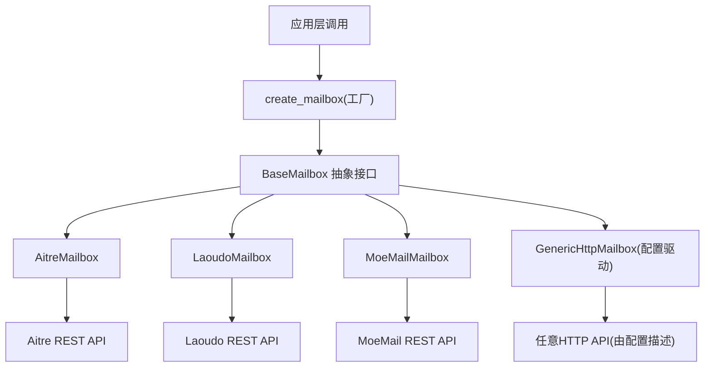
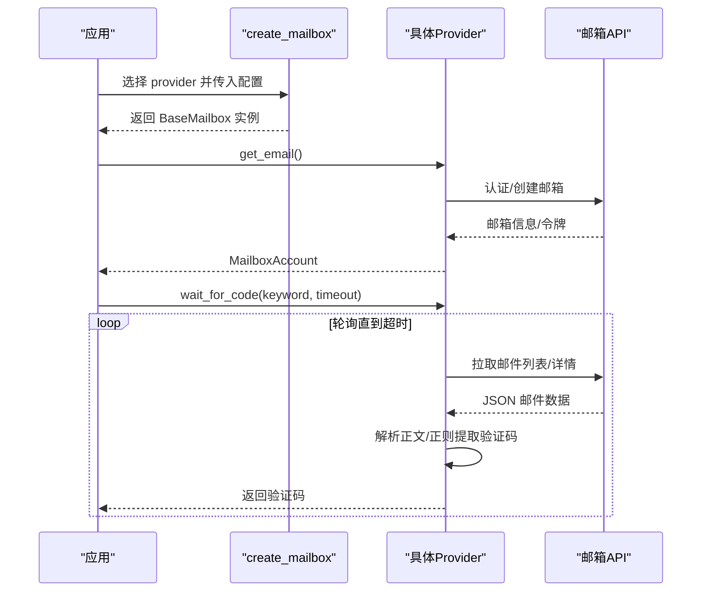
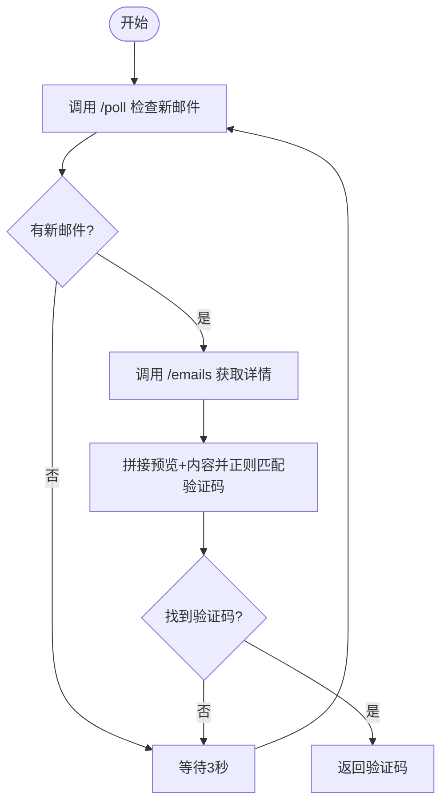
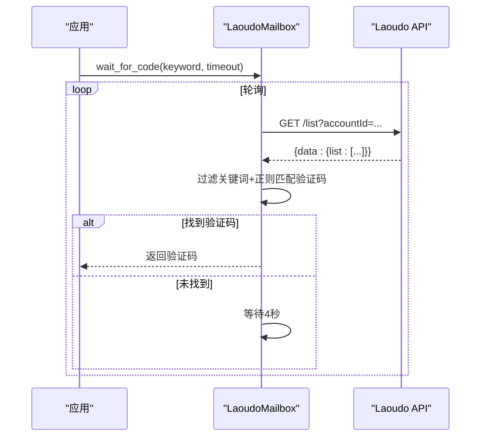
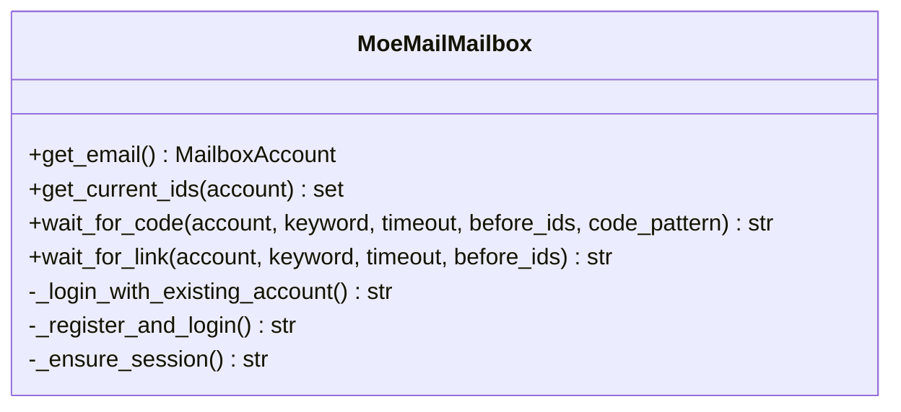
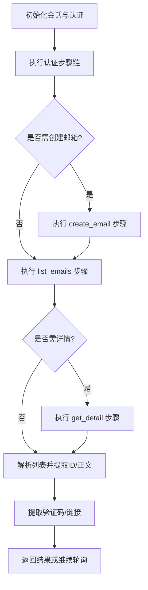
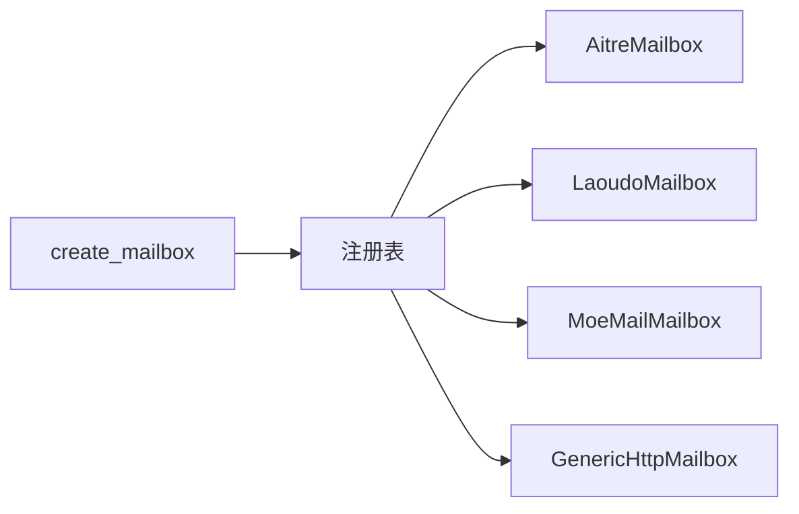

# API邮箱服务集成

<cite>
**本文引用的文件**
- [core/base_mailbox.py](file://core/base_mailbox.py)
- [core/generic_http_mailbox.py](file://core/generic_http_mailbox.py)
- [providers/mailbox/aitre.py](file://providers/mailbox/aitre.py)
- [providers/mailbox/laoudo.py](file://providers/mailbox/laoudo.py)
- [providers/mailbox/moemail.py](file://providers/mailbox/moemail.py)
- [platforms/chatgpt/constants.py](file://platforms/chatgpt/constants.py)
</cite>

## 目录
1. [简介](#简介)
2. [项目结构](#项目结构)
3. [核心组件](#核心组件)
4. [架构总览](#架构总览)
5. [详细组件分析](#详细组件分析)
6. [依赖关系分析](#依赖关系分析)
7. [性能与可靠性](#性能与可靠性)
8. [故障排除指南](#故障排除指南)
9. [结论](#结论)
10. [附录：配置与最佳实践](#附录配置与最佳实践)

## 简介
本指南面向需要集成第三方API邮箱服务的开发者，重点覆盖Aitre、Laoudo、MoeMail等基于RESTful API的邮箱提供商。文档从系统架构、认证机制、邮件操作接口、数据格式处理到SDK使用示例与最佳实践进行系统化说明，并提供常见问题的排查方法。

## 项目结构
本项目采用“提供者驱动 + 统一抽象”的设计：
- 统一的邮箱抽象基类定义在 core/base_mailbox.py，所有邮箱提供商实现该接口，屏蔽差异。
- 通用HTTP邮箱驱动 core/generic_http_mailbox.py 通过配置描述端点与步骤，支持零代码接入新邮箱类型。
- 各具体提供商以轻量注册模块形式挂载到统一注册表，如 providers/mailbox/aitre.py、laoudo.py、moemail.py。

图表来源
- [core/base_mailbox.py:27-48](file://core/base_mailbox.py#L27-L48)
- [core/base_mailbox.py:289-347](file://core/base_mailbox.py#L289-L347)
- [core/generic_http_mailbox.py:75-103](file://core/generic_http_mailbox.py#L75-L103)

章节来源
- [core/base_mailbox.py:27-48](file://core/base_mailbox.py#L27-L48)
- [core/base_mailbox.py:289-347](file://core/base_mailbox.py#L289-L347)
- [core/generic_http_mailbox.py:75-103](file://core/generic_http_mailbox.py#L75-L103)

## 核心组件
- BaseMailbox：定义邮箱服务统一接口（获取邮箱、等待验证码/链接、获取当前邮件ID集合）。
- FallbackMailbox：按顺序尝试多个provider，创建成功后固定使用同一provider收件。
- 具体Provider实现：
  - AitreMailbox：对接 mail.aitre.cc 临时邮箱。
  - LaoudoMailbox：对接 laoudo.com 邮箱服务。
  - MoeMailMailbox：对接 MoeMail (sall.cc) 邮箱服务，支持自动注册或复用账号。
- GenericHttpMailbox：数据驱动的通用HTTP邮箱驱动，通过配置描述认证、创建、列表、详情等步骤。

章节来源
- [core/base_mailbox.py:27-48](file://core/base_mailbox.py#L27-L48)
- [core/base_mailbox.py:51-118](file://core/base_mailbox.py#L51-L118)
- [core/base_mailbox.py:350-555](file://core/base_mailbox.py#L350-L555)
- [core/base_mailbox.py:1200-1488](file://core/base_mailbox.py#L1200-L1488)
- [core/generic_http_mailbox.py:75-103](file://core/generic_http_mailbox.py#L75-L103)

## 架构总览
整体流程：
- 上层通过 create_mailbox(provider, extra, proxy) 选择并实例化具体邮箱驱动。
- 每个驱动封装对特定邮箱API的认证、请求、响应解析与重试策略。
- 统一接口暴露 get_email、wait_for_code、wait_for_link、get_current_ids，屏蔽底层差异。

图表来源
- [core/base_mailbox.py:289-347](file://core/base_mailbox.py#L289-L347)
- [core/base_mailbox.py:350-555](file://core/base_mailbox.py#L350-L555)
- [core/base_mailbox.py:1200-1488](file://core/base_mailbox.py#L1200-L1488)

## 详细组件分析

### Aitre 邮箱服务集成
- 认证方式：无需额外鉴权头，通过邮箱地址标识资源。
- 主要接口：
  - 获取邮箱：直接返回已配置的邮箱地址。
  - 获取当前ID：调用 /emails?email=... 获取邮件ID集合。
  - 等待验证码：调用 /poll?email=...&lastCheck=... 检查是否有新邮件，再调用 /emails 获取详情，使用正则匹配6位数字验证码。
  - 等待链接：同上，但提取验证链接。
- 数据格式：JSON，字段包括 emails、id、preview、content 等。
- 错误处理：网络异常捕获后返回空集合或抛出超时异常。

图表来源
- [core/base_mailbox.py:476-555](file://core/base_mailbox.py#L476-L555)

章节来源
- [core/base_mailbox.py:476-555](file://core/base_mailbox.py#L476-L555)
- [providers/mailbox/aitre.py:1-6](file://providers/mailbox/aitre.py#L1-L6)

### Laoudo 邮箱服务集成
- 认证方式：通过 authorization 头传递 token。
- 主要接口：
  - 获取邮箱：返回预置邮箱及账户元信息。
  - 获取当前ID：调用 /list?accountId=... 获取邮件ID集合。
  - 等待验证码：轮询 /list，过滤关键词，正则匹配6位数字验证码。
  - 等待链接：轮询 /list，提取验证链接。
- 数据格式：JSON，data.list 包含邮件项，字段 id/emailId、subject、content/html。
- 错误处理：网络异常捕获后返回空集合或抛出超时异常。

图表来源
- [core/base_mailbox.py:350-474](file://core/base_mailbox.py#L350-L474)

章节来源
- [core/base_mailbox.py:350-474](file://core/base_mailbox.py#L350-L474)
- [providers/mailbox/laoudo.py:1-6](file://providers/mailbox/laoudo.py#L1-L6)

### MoeMail 邮箱服务集成
- 认证方式：支持两种模式
  - 使用已有账号登录（用户名/密码或 session-token），通过表单提交登录并获取会话Cookie。
  - 自动注册新账号并登录。
- 主要接口：
  - 获取邮箱：POST /api/emails/generate 生成临时邮箱，返回 email/id。
  - 获取当前ID：GET /api/emails/{id} 获取消息列表ID。
  - 等待验证码：轮询 /api/emails/{id}，优先读取 verification_code 字段，否则正则匹配6位数字。
  - 等待链接：轮询并提取验证链接。
- 数据格式：JSON，messages 数组包含 content/text/body/html/subject 等。
- 错误处理：注册/登录失败抛出运行时异常；网络异常捕获后继续轮询或超时。

图表来源
- [core/base_mailbox.py:1200-1488](file://core/base_mailbox.py#L1200-L1488)

章节来源
- [core/base_mailbox.py:1200-1488](file://core/base_mailbox.py#L1200-L1488)
- [providers/mailbox/moemail.py:1-6](file://providers/mailbox/moemail.py#L1-L6)

### 通用HTTP邮箱驱动（GenericHttpMailbox）
- 设计目标：通过配置描述认证、创建、列表、详情等步骤，零代码新增邮箱类型。
- 认证机制：
  - auth_type 支持 none、bearer、header、api_key_param。
  - 自动注入 Authorization 或自定义Header，或在查询参数中注入 api key。
- 步骤管道：
  - auth_steps[]：可选的多步认证。
  - create_email：可选，用于动态创建邮箱。
  - list_emails：必需，用于获取邮件列表。
  - get_detail：可选，用于获取邮件详情。
- 数据解析：
  - response_list_path：定位返回列表的路径。
  - response_id_field：邮件ID字段名。
  - response_body_fields：正文字段集合，默认 subject,content,html,text,body,preview。
- 变量池：
  - 步骤间共享变量，支持从响应中提取并用于后续步骤模板渲染。
- 错误处理：
  - 非JSON响应包装为 {"_text": resp.text}。
  - 超时与网络异常捕获后继续轮询或抛出超时异常。

图表来源
- [core/generic_http_mailbox.py:75-103](file://core/generic_http_mailbox.py#L75-L103)
- [core/generic_http_mailbox.py:105-161](file://core/generic_http_mailbox.py#L105-L161)
- [core/generic_http_mailbox.py:165-257](file://core/generic_http_mailbox.py#L165-L257)
- [core/generic_http_mailbox.py:270-474](file://core/generic_http_mailbox.py#L270-L474)

章节来源
- [core/generic_http_mailbox.py:75-103](file://core/generic_http_mailbox.py#L75-L103)
- [core/generic_http_mailbox.py:105-161](file://core/generic_http_mailbox.py#L105-L161)
- [core/generic_http_mailbox.py:165-257](file://core/generic_http_mailbox.py#L165-L257)
- [core/generic_http_mailbox.py:270-474](file://core/generic_http_mailbox.py#L270-L474)

## 依赖关系分析
- 工厂方法 create_mailbox 根据 provider 键查找定义与设置，构建具体实例或回退链。
- 各Provider通过 register_provider 注册到统一注册表，便于扩展。
- 通用HTTP驱动依赖 requests.Session 管理连接与Cookie，支持代理与UA注入。

图表来源
- [core/base_mailbox.py:262-347](file://core/base_mailbox.py#L262-L347)
- [providers/mailbox/aitre.py:1-6](file://providers/mailbox/aitre.py#L1-L6)
- [providers/mailbox/laoudo.py:1-6](file://providers/mailbox/laoudo.py#L1-L6)
- [providers/mailbox/moemail.py:1-6](file://providers/mailbox/moemail.py#L1-L6)

章节来源
- [core/base_mailbox.py:262-347](file://core/base_mailbox.py#L262-L347)
- [providers/mailbox/aitre.py:1-6](file://providers/mailbox/aitre.py#L1-L6)
- [providers/mailbox/laoudo.py:1-6](file://providers/mailbox/laoudo.py#L1-L6)
- [providers/mailbox/moemail.py:1-6](file://providers/mailbox/moemail.py#L1-L6)

## 性能与可靠性
- 轮询间隔：各Provider在等待验证码/链接时采用固定间隔（3-5秒），避免高频请求导致限流。
- 超时控制：统一在 wait_for_code/wait_for_link 中设置超时，防止无限等待。
- 重试机制：
  - Temp-Mail Web 驱动内置429限流重试逻辑，指数退避与随机抖动。
  - 其他驱动在网络异常时静默重试直至超时。
- 连接复用：
  - GenericHttpMailbox 使用 requests.Session 复用连接与Cookie。
  - MoeMail 维护会话以复用登录状态。
- 性能监控：
  - 可在外部接入链路追踪头（如Datadog trace headers）进行端到端监控。
  - 建议记录关键步骤耗时与错误码，便于定位瓶颈。

章节来源
- [core/base_mailbox.py:409-474](file://core/base_mailbox.py#L409-L474)
- [core/base_mailbox.py:494-555](file://core/base_mailbox.py#L494-L555)
- [core/base_mailbox.py:1200-1488](file://core/base_mailbox.py#L1200-L1488)
- [core/generic_http_mailbox.py:165-257](file://core/generic_http_mailbox.py#L165-L257)
- [platforms/chatgpt/constants.py:293-334](file://platforms/chatgpt/constants.py#L293-L334)

## 故障排除指南
- 认证失败：
  - Laoudo：检查 authorization 头是否正确。
  - MoeMail：确认用户名/密码或 session-token 有效；若自动注册失败，检查注册接口返回的错误信息。
  - GenericHttpMailbox：校验 auth_type 与 auth_token 配置。
- 网络异常：
  - 检查代理配置与超时设置。
  - 查看日志中的HTTP状态码与响应体片段。
- 验证码未收到：
  - 确认关键词过滤条件是否过严。
  - 调整 code_pattern 以适配不同邮箱格式。
  - 延长 timeout 或降低轮询频率。
- 限流与429：
  - 参考 Temp-Mail Web 的重试逻辑，适当增加退避时间。
- 错误码映射：
  - 可结合平台常量定义将HTTP状态码映射为业务错误码，便于统一处理。

章节来源
- [core/base_mailbox.py:350-474](file://core/base_mailbox.py#L350-L474)
- [core/base_mailbox.py:476-555](file://core/base_mailbox.py#L476-L555)
- [core/base_mailbox.py:1200-1488](file://core/base_mailbox.py#L1200-L1488)
- [platforms/chatgpt/constants.py:293-334](file://platforms/chatgpt/constants.py#L293-L334)

## 结论
本项目通过统一抽象与数据驱动的方式，实现了对多种API邮箱服务的稳定集成。Aitre、Laoudo、MoeMail等提供商均遵循一致的接口契约，便于替换与扩展。GenericHttpMailbox进一步降低了新提供商的接入成本。建议在集成过程中关注认证配置、轮询策略与错误处理，并结合外部监控提升可观测性。

## 附录：配置与最佳实践
- 连接池配置：
  - 使用 requests.Session 复用连接，合理设置超时与代理。
  - 对于高并发场景，考虑连接池大小与线程数限制。
- 重试机制：
  - 对429等限流状态实施指数退避与随机抖动。
  - 对网络异常进行有限次重试，避免雪崩。
- 性能监控：
  - 记录关键步骤耗时、错误率与重试次数。
  - 接入链路追踪，便于问题定位。
- SDK使用示例路径：
  - 创建邮箱：参考 create_mailbox 与各Provider的 get_email 实现。
  - 等待验证码：参考 wait_for_code 在各Provider中的轮询与解析逻辑。
  - 等待链接：参考 wait_for_link 的链接提取算法。
- 分页处理：
  - 根据Provider返回结构，使用 response_list_path 定位列表。
  - 对大数据量场景，结合 limit/offset 或时间戳分页。
- 错误码映射：
  - 将HTTP状态码与业务错误码对应，便于上层统一处理。

[无章节来源，因为本节提供一般性指导]