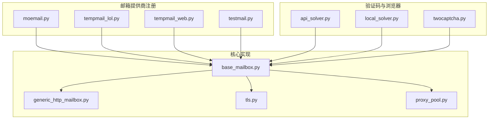
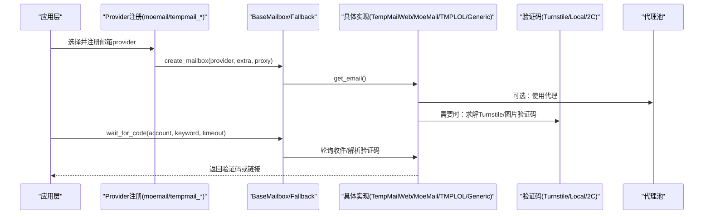
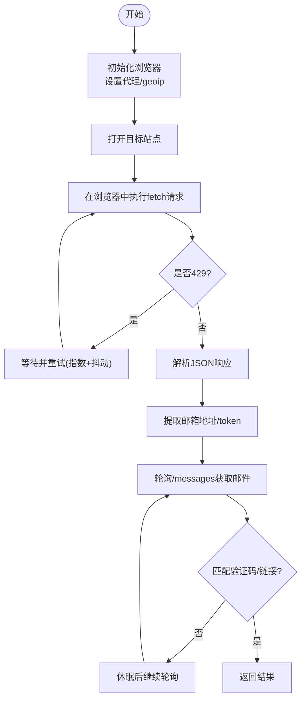
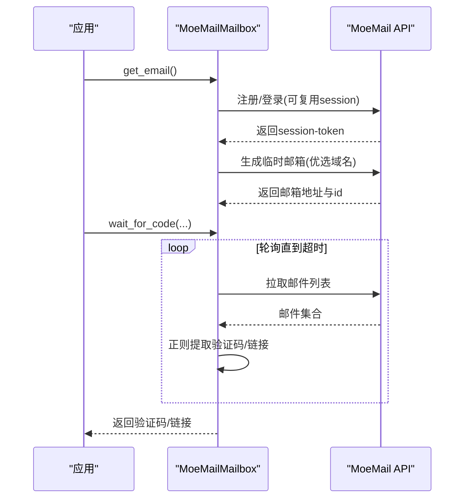
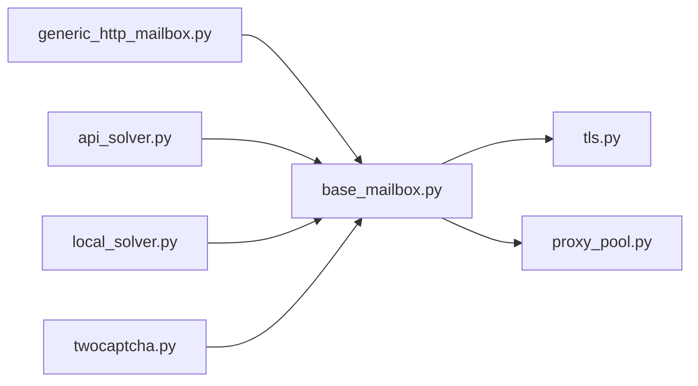

# Web邮箱服务集成

<cite>
**本文引用的文件**
- [core/base_mailbox.py](file://core/base_mailbox.py)
- [providers/mailbox/moemail.py](file://providers/mailbox/moemail.py)
- [providers/mailbox/tempmail_lol.py](file://providers/mailbox/tempmail_lol.py)
- [providers/mailbox/tempmail_web.py](file://providers/mailbox/tempmail_web.py)
- [providers/mailbox/testmail.py](file://providers/mailbox/testmail.py)
- [core/generic_http_mailbox.py](file://core/generic_http_mailbox.py)
- [core/proxy_pool.py](file://core/proxy_pool.py)
- [core/tls.py](file://core/tls.py)
- [services/turnstile_solver/api_solver.py](file://services/turnstile_solver/api_solver.py)
- [providers/captcha/local_solver.py](file://providers/captcha/local_solver.py)
- [providers/captcha/twocaptcha.py](file://providers/captcha/twocaptcha.py)
</cite>

## 目录
1. [简介](#简介)
2. [项目结构](#项目结构)
3. [核心组件](#核心组件)
4. [架构总览](#架构总览)
5. [详细组件分析](#详细组件分析)
6. [依赖关系分析](#依赖关系分析)
7. [性能与稳定性](#性能与稳定性)
8. [故障排查指南](#故障排查指南)
9. [结论](#结论)
10. [附录：集成示例与调试方法](#附录：集成示例与调试方法)

## 简介
本文件系统化梳理 Web 邮箱服务的自动化集成方案，覆盖 MoEmail、TempMail.lol、TempMail Web、TestMail 等提供商的浏览器自动化与 HTTP API 调用方式。重点说明页面加载、表单填写、验证码处理、邮件获取（DOM解析/JS执行/动态内容）、反爬策略应对（User-Agent轮换、代理使用、请求频率控制），并提供截图记录、日志分析与异常处理的实践建议，确保端到端稳定可用。

## 项目结构
仓库采用分层模块化组织：
- providers/mailbox：各邮箱提供商注册入口，实际实现集中在 core/base_mailbox.py 与 core/generic_http_mailbox.py
- core：通用能力（基类、HTTP驱动、TLS工具、代理池）
- services/turnstile_solver：Turnstile 验证码解决器（含浏览器上下文、UA/Sec-CH-UA、代理注入）
- providers/captcha：第三方/本地验证码求解器

图表来源
- [providers/mailbox/moemail.py:1-6](file://providers/mailbox/moemail.py#L1-L6)
- [providers/mailbox/tempmail_lol.py:1-6](file://providers/mailbox/tempmail_lol.py#L1-L6)
- [providers/mailbox/tempmail_web.py:1-6](file://providers/mailbox/tempmail_web.py#L1-L6)
- [providers/mailbox/testmail.py:1-6](file://providers/mailbox/testmail.py#L1-L6)
- [core/base_mailbox.py:1-350](file://core/base_mailbox.py#L1-L350)
- [core/generic_http_mailbox.py:1-120](file://core/generic_http_mailbox.py#L1-L120)
- [core/tls.py:1-34](file://core/tls.py#L1-L34)
- [core/proxy_pool.py:1-91](file://core/proxy_pool.py#L1-L91)
- [services/turnstile_solver/api_solver.py:64-943](file://services/turnstile_solver/api_solver.py#L64-L943)
- [providers/captcha/local_solver.py:17-52](file://providers/captcha/local_solver.py#L17-L52)
- [providers/captcha/twocaptcha.py:42-63](file://providers/captcha/twocaptcha.py#L42-L63)

章节来源
- [core/base_mailbox.py:1-350](file://core/base_mailbox.py#L1-L350)
- [core/generic_http_mailbox.py:1-120](file://core/generic_http_mailbox.py#L1-L120)

## 核心组件
- BaseMailbox 抽象接口：统一 get_email/wait_for_code/wait_for_link/get_current_ids 契约，便于多 provider 切换与回退
- FallbackMailbox：按顺序尝试多个 mailbox，创建成功后固定使用同一 provider 收件，提升鲁棒性
- TempMailWebMailbox：基于 Camoufox 浏览器自动化访问 web2.temp-mail.org，通过 page.evaluate 在浏览器内发起 fetch 请求，规避服务端反爬检测
- MoeMailMailbox：自动注册/登录 MoeMail（sall.cc），生成临时邮箱并轮询收件；支持复用 session-token
- TempMailLolMailbox：直接调用 tempmail.lol 的 REST API 创建邮箱与拉取邮件
- GenericHttpMailbox：数据驱动的通用 HTTP 邮箱驱动，通过配置描述认证、创建邮箱、列表、详情等步骤，零代码扩展新邮箱类型
- 验证码解决：Turnstile 浏览器求解（api_solver）与外部/本地 solver（local_solver、twocaptcha）

章节来源
- [core/base_mailbox.py:27-118](file://core/base_mailbox.py#L27-L118)
- [core/base_mailbox.py:557-917](file://core/base_mailbox.py#L557-L917)
- [core/base_mailbox.py:1200-1488](file://core/base_mailbox.py#L1200-L1488)
- [core/generic_http_mailbox.py:75-474](file://core/generic_http_mailbox.py#L75-L474)
- [services/turnstile_solver/api_solver.py:64-943](file://services/turnstile_solver/api_solver.py#L64-L943)
- [providers/captcha/local_solver.py:17-52](file://providers/captcha/local_solver.py#L17-L52)
- [providers/captcha/twocaptcha.py:42-63](file://providers/captcha/twocaptcha.py#L42-L63)

## 架构总览
下图展示从上层 provider 注册到具体实现的调用链，以及验证码与代理的协作关系。

图表来源
- [core/base_mailbox.py:289-348](file://core/base_mailbox.py#L289-L348)
- [core/base_mailbox.py:557-917](file://core/base_mailbox.py#L557-L917)
- [core/base_mailbox.py:1200-1488](file://core/base_mailbox.py#L1200-L1488)
- [core/generic_http_mailbox.py:270-474](file://core/generic_http_mailbox.py#L270-L474)
- [services/turnstile_solver/api_solver.py:64-943](file://services/turnstile_solver/api_solver.py#L64-L943)
- [core/proxy_pool.py:14-45](file://core/proxy_pool.py#L14-L45)

## 详细组件分析

### TempMail Web（web2.temp-mail.org）
- 浏览器自动化：使用 Camoufox 启动 headless 浏览器，必要时注入代理与 geoip；通过 page.goto 加载目标站点
- 请求封装：在浏览器上下文中执行 JS fetch，携带 referrer、Accept、Authorization 等头，避免被服务端识别为爬虫
- 限流重试：遇到 429 时指数退避+随机抖动，最多重试若干次
- 邮件获取：通过 /messages 获取消息列表，合并 subject/body/text/content/html 字段，正则提取6位验证码或验证链接
- 资源释放：析构时关闭浏览器与线程池

图表来源
- [core/base_mailbox.py:654-917](file://core/base_mailbox.py#L654-L917)

章节来源
- [core/base_mailbox.py:654-917](file://core/base_mailbox.py#L654-L917)

### MoeMail（sall.cc）
- 会话管理：支持传入 session-token 复用，否则自动注册新用户并登录，维护 Session/Cookie
- 域名优选：优先选择信誉较好的域名（如 sall.cc），降低被云厂商拒绝概率
- 邮箱生成：调用 /api/emails/generate 生成临时邮箱，附带过期时间
- 收件轮询：按 account_id 拉取邮件列表，拼接正文字段，正则提取验证码或链接
- 反爬：设置标准 UA、Referer、Origin，屏蔽 TLS 告警

图表来源
- [core/base_mailbox.py:1200-1488](file://core/base_mailbox.py#L1200-L1488)

章节来源
- [core/base_mailbox.py:1200-1488](file://core/base_mailbox.py#L1200-L1488)

### TempMail.lol
- 直接 HTTP API：POST /inbox/create 创建邮箱，GET /inbox?token=... 拉取邮件
- 验证码/链接：合并 subject/body/html，正则提取6位验证码或链接
- 代理：支持 http/https 代理字典注入

章节来源
- [core/base_mailbox.py:557-652](file://core/base_mailbox.py#L557-L652)

### TestMail（namespace/tag 模式）
- 通过 GenericHttpMailbox 的数据驱动管道，支持 namespace_tag 模式构造邮箱地址（如 {namespace}.{tag}@inbox.testmail.app）
- 列表与详情：通过 list_emails 与可选 get_detail 步骤获取邮件详情，提取验证码或链接

章节来源
- [core/generic_http_mailbox.py:270-474](file://core/generic_http_mailbox.py#L270-L474)

### Turnstile 验证码处理
- 浏览器上下文：按需配置 user_agent、sec-ch-ua、viewport，注入反检测脚本（隐藏 webdriver、window.chrome 等）
- 代理注入：支持带认证的代理格式，解析并注入 context_options
- 页面加载：以 domcontentloaded 快速进入，阻塞渲染以提升稳定性
- 结果轮询：提交任务后轮询结果，超时抛出异常

章节来源
- [services/turnstile_solver/api_solver.py:64-943](file://services/turnstile_solver/api_solver.py#L64-L943)
- [providers/captcha/local_solver.py:17-52](file://providers/captcha/local_solver.py#L17-L52)
- [providers/captcha/twocaptcha.py:42-63](file://providers/captcha/twocaptcha.py#L42-L63)

## 依赖关系分析
- 模块耦合：
  - providers/mailbox/* 仅负责注册，逻辑集中在 core/base_mailbox.py 与 core/generic_http_mailbox.py，低耦合高内聚
  - base_mailbox 依赖 tls（TLS 安全开关）、proxy_pool（代理选择）
  - turnstile_solver 独立提供浏览器级验证码求解，可被任意流程调用
- 外部依赖：
  - requests/curl_cffi 用于 HTTP 请求
  - Camoufox 用于浏览器自动化
  - 数据库（SQLModel）用于代理池状态持久化

图表来源
- [core/base_mailbox.py:1-350](file://core/base_mailbox.py#L1-L350)
- [core/generic_http_mailbox.py:1-120](file://core/generic_http_mailbox.py#L1-L120)
- [core/tls.py:1-34](file://core/tls.py#L1-L34)
- [core/proxy_pool.py:1-91](file://core/proxy_pool.py#L1-L91)
- [services/turnstile_solver/api_solver.py:64-943](file://services/turnstile_solver/api_solver.py#L64-L943)
- [providers/captcha/local_solver.py:17-52](file://providers/captcha/local_solver.py#L17-L52)
- [providers/captcha/twocaptcha.py:42-63](file://providers/captcha/twocaptcha.py#L42-L63)

章节来源
- [core/base_mailbox.py:1-350](file://core/base_mailbox.py#L1-L350)
- [core/generic_http_mailbox.py:1-120](file://core/generic_http_mailbox.py#L1-L120)
- [core/proxy_pool.py:1-91](file://core/proxy_pool.py#L1-L91)

## 性能与稳定性
- 请求频率控制：
  - TempMail Web 对 429 进行指数退避+随机抖动，限制并发与重试次数
  - 各 provider 轮询间隔 3-5 秒，避免高频触发限流
- 代理与 UA：
  - 支持 http/https 代理，Camoufox 可注入 geoip；requests 会话可标记 verify=False 并屏蔽告警
  - 默认 UA 模拟主流浏览器，必要时可通过配置调整
- 容错与回退：
  - FallbackMailbox 支持多 provider 顺序尝试，失败自动切换
  - 异常捕获广泛，网络错误、解析错误均做降级处理
- 资源管理：
  - 浏览器实例与线程池在析构时关闭，避免资源泄漏

[本节为通用指导，不直接分析具体文件]

## 故障排查指南
- 常见错误定位：
  - 429 限流：检查 TempMail Web 的重试日志与退避策略
  - 验证码未返回：确认 keyword 过滤条件、code_pattern 正则是否匹配目标格式
  - 登录失败（MoeMail）：检查 session-token 是否有效、CSRF token 是否正确传递
  - 代理不可用：查看代理池健康检查与失败计数，必要时更换代理
- 调试手段：
  - 开启 verbose 日志，关注 “[TempMailWeb]”、“[MoeMail]” 等前缀输出
  - 使用浏览器开发者工具抓取 Network 与 Console 日志，比对 page.evaluate 的请求参数
  - 截图记录：在关键节点截取页面快照，辅助定位 UI 变化导致的元素定位失败
- 异常处理：
  - 所有轮询函数在超时时抛出 TimeoutError，调用方应捕获并记录上下文（邮箱地址、keyword、timeout）
  - 网络异常统一 try/except 包裹，保证主流程不被中断

章节来源
- [core/base_mailbox.py:603-652](file://core/base_mailbox.py#L603-L652)
- [core/base_mailbox.py:849-902](file://core/base_mailbox.py#L849-L902)
- [core/base_mailbox.py:1429-1488](file://core/base_mailbox.py#L1429-L1488)
- [core/generic_http_mailbox.py:338-474](file://core/generic_http_mailbox.py#L338-L474)
- [core/proxy_pool.py:68-87](file://core/proxy_pool.py#L68-L87)

## 结论
该方案通过统一的 BaseMailbox 接口与数据驱动的 GenericHttpMailbox，将多种 Web 邮箱提供商整合为一致的自动化体验。TempMail Web 借助浏览器环境绕过服务端反爬，MoeMail 通过会话复用与域名优选提升成功率，TempMail.lol/TestMail 则通过简洁 API 完成收发。配合代理池、UA 伪装、频率控制与验证码求解，整体具备较高的稳定性与可扩展性。

[本节为总结性内容，不直接分析具体文件]

## 附录：集成示例与调试方法
- 集成步骤（概念流程）
  - 选择 provider：根据业务需求选择 moemail_api、tempmail_web_api、tempmail_lol_api、testmail_api
  - 配置参数：在 provider_settings 中填写 api_url、auth_token、proxy 等
  - 创建邮箱：调用 get_email() 获取 MailboxAccount
  - 等待验证码：调用 wait_for_code(account, keyword, timeout, code_pattern)
  - 等待链接：调用 wait_for_link(account, keyword, timeout)
- 调试建议
  - 日志：启用详细日志，关注各 provider 的前缀输出
  - 截图：在浏览器自动化路径中，于关键步骤调用 page.screenshot() 保存快照
  - 抓包：使用浏览器 Network 面板或 HAR 工具记录请求，核对请求头与响应体
  - 代理：通过 proxy_pool 动态获取代理，观察成功/失败统计
  - 验证码：若需 Turnstile，确保浏览器上下文正确注入 UA/Sec-CH-UA，并使用 solver 轮询结果

[本节为通用指导，不直接分析具体文件]