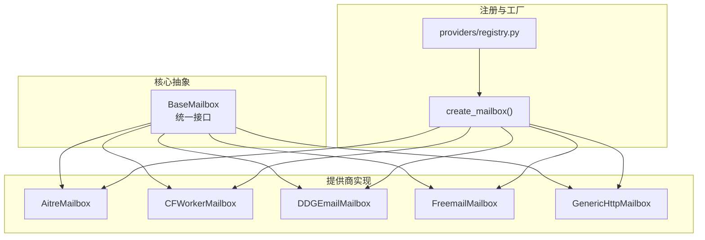
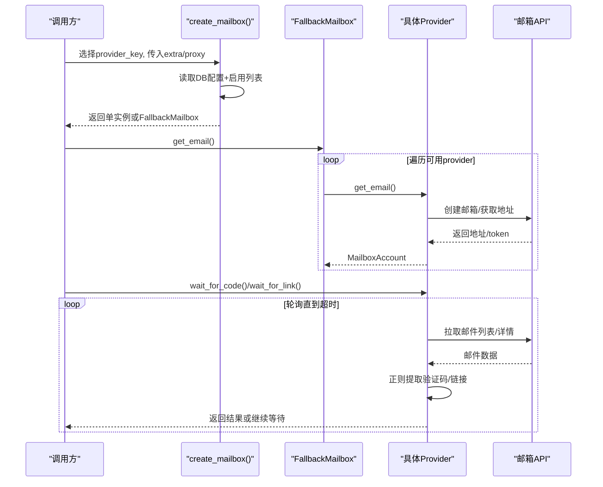
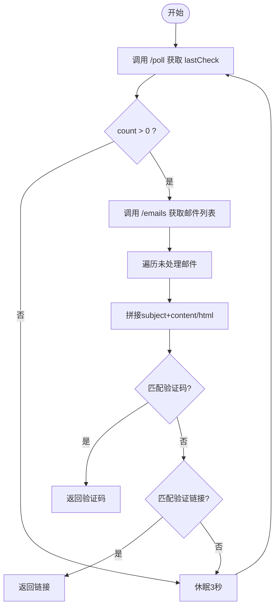
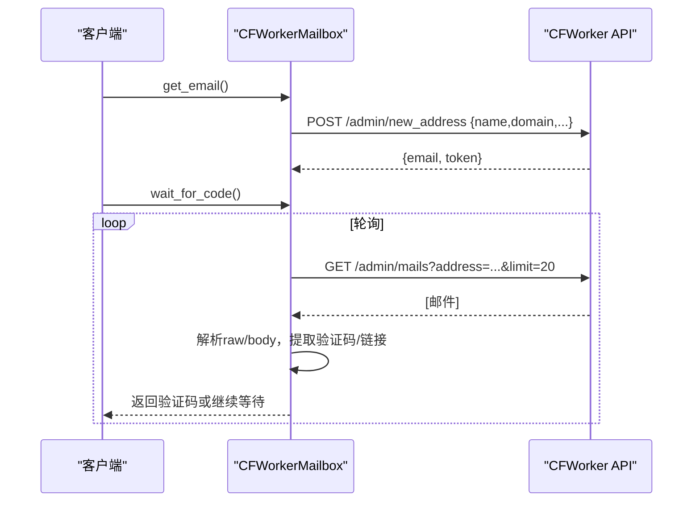
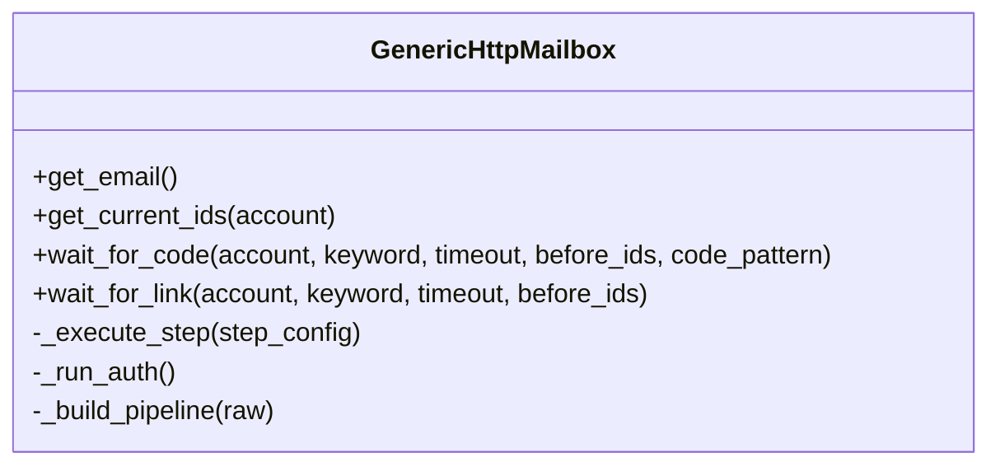
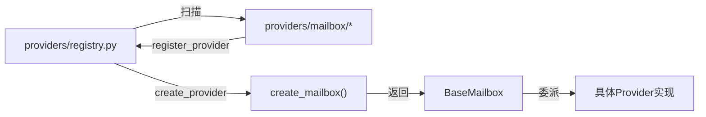

# 临时邮箱服务集成

<cite>
**本文引用的文件**
- [core/base_mailbox.py](file://core/base_mailbox.py)
- [providers/mailbox/aitre.py](file://providers/mailbox/aitre.py)
- [providers/mailbox/cfworker.py](file://providers/mailbox/cfworker.py)
- [providers/mailbox/ddg_email.py](file://providers/mailbox/ddg_email.py)
- [providers/mailbox/freemail.py](file://providers/mailbox/freemail.py)
- [core/generic_http_mailbox.py](file://core/generic_http_mailbox.py)
- [providers/registry.py](file://providers/registry.py)
- [README.md](file://README.md)
</cite>

## 目录
1. [简介](#简介)
2. [项目结构](#项目结构)
3. [核心组件](#核心组件)
4. [架构总览](#架构总览)
5. [详细组件分析](#详细组件分析)
6. [依赖关系分析](#依赖关系分析)
7. [性能与可靠性](#性能与可靠性)
8. [故障排查指南](#故障排查指南)
9. [结论](#结论)
10. [附录：配置与使用模式](#附录配置与使用模式)

## 简介
本文件面向“临时邮箱服务”的集成实现，围绕 AITRE、CFWorker、DDG Email、Freemail 等提供商的技术架构与 API 接口进行系统化说明。文档覆盖邮箱创建流程（地址生成、域名选择、有效期管理）、邮件接收机制（轮询查询、Webhook 回调、实时通知）、邮件解析（HTML 内容提取、验证码识别、链接处理），并提供错误重试、超时处理、并发控制等工程化实践建议。同时给出通用 HTTP 驱动的配置范式，帮助快速接入任意临时邮箱服务。

## 项目结构
本项目采用插件化 provider 体系，邮箱能力以 BaseMailbox 抽象为核心，具体提供商通过工厂与注册表动态装配。关键路径：
- 抽象与统一入口：core/base_mailbox.py
- 各提供商实现：core/base_mailbox.py 内嵌多个 Mailbox 类；部分通过 providers/mailbox/*.py 注册到统一注册表
- 通用 HTTP 驱动：core/generic_http_mailbox.py，支持零代码接入新邮箱服务
- Provider 注册与发现：providers/registry.py
- 用户可见说明：README.md

图表来源
- [core/base_mailbox.py:27-348](file://core/base_mailbox.py#L27-L348)
- [providers/registry.py:28-91](file://providers/registry.py#L28-L91)

章节来源
- [core/base_mailbox.py:27-348](file://core/base_mailbox.py#L27-L348)
- [providers/registry.py:28-91](file://providers/registry.py#L28-L91)

## 核心组件
- BaseMailbox：定义 get_email、wait_for_code、get_current_ids、wait_for_link 等统一接口，屏蔽不同邮箱服务的差异。
- FallbackMailbox：按顺序尝试多个 provider，创建成功后固定使用同一 provider 收件，提升容错性。
- 各提供商实现：
  - AitreMailbox：基于 mail.aitre.cc 的临时邮箱，提供轮询获取邮件并解析验证码或链接。
  - CFWorkerMailbox：基于 Cloudflare Worker 自建临时邮箱，支持管理员令牌或指纹头，自动创建地址并拉取邮件。
  - DDGEmailMailbox：DuckDuckGo Email Protection，结合 IMAP/转发能力读取邮件。
  - FreemailMailbox：Cloudflare Worker 自建 freemail，支持管理员令牌或用户名密码认证。
  - GenericHttpMailbox：数据驱动的通用 HTTP 驱动，通过 pipeline_config + settings 描述认证、创建、列表、详情等步骤，无需新增代码即可适配新邮箱服务。
- 工厂与注册：create_mailbox 根据 provider key 从数据库配置中解析运行时设置，组装实例；providers/registry.py 负责扫描与注册所有 mailbox 模块。

章节来源
- [core/base_mailbox.py:27-348](file://core/base_mailbox.py#L27-L348)
- [core/generic_http_mailbox.py:75-474](file://core/generic_http_mailbox.py#L75-L474)
- [providers/registry.py:28-91](file://providers/registry.py#L28-L91)

## 架构总览
下图展示从上层调用到具体邮箱提供商的完整链路，包括 fallback 策略、轮询等待、验证码/链接解析。

图表来源
- [core/base_mailbox.py:289-348](file://core/base_mailbox.py#L289-L348)
- [core/base_mailbox.py:476-555](file://core/base_mailbox.py#L476-L555)
- [core/base_mailbox.py:1071-1198](file://core/base_mailbox.py#L1071-L1198)
- [core/base_mailbox.py:1490-1599](file://core/base_mailbox.py#L1490-L1599)
- [core/generic_http_mailbox.py:270-474](file://core/generic_http_mailbox.py#L270-L474)

## 详细组件分析

### AITRE 临时邮箱
- 技术要点
  - 地址生成：由外部传入 email，或通过上层流程生成后交由 AitreMailbox 管理。
  - 邮件接收：通过 /poll 增量拉取（lastCheck）和 /emails 列表接口，过滤已读邮件 ID，避免重复处理。
  - 验证码/链接解析：合并 subject 与 content/html，默认匹配 6 位数字验证码；链接提取优先匹配含 verif/confirm/magic/auth 等关键字的 URL。
  - 超时与重试：wait_for_code/wait_for_link 内部循环轮询，默认间隔约 3s，超时抛出 TimeoutError。
- 适用场景：公共临时邮箱服务，适合快速验证与自动化注册。

图表来源
- [core/base_mailbox.py:476-555](file://core/base_mailbox.py#L476-L555)

章节来源
- [core/base_mailbox.py:476-555](file://core/base_mailbox.py#L476-L555)
- [providers/mailbox/aitre.py:1-6](file://providers/mailbox/aitre.py#L1-L6)

### CFWorker 自建临时邮箱
- 技术要点
  - 地址生成：POST /admin/new_address，可指定 domain、enablePrefix，返回 email 与 token/jwt。
  - 邮件接收：GET /admin/mails 分页拉取，支持 limit/offset/address 参数。
  - 验证码/链接解析：优先匹配 XXXXXX（特定平台邮件格式），其次在 MIME body 中去除邮箱/时间戳干扰后匹配 6 位数字；链接提取逻辑同通用函数。
  - 认证：x-admin-auth 头，可选 x-fingerprint。
- 适用场景：完全自主可控的临时邮箱，适合企业级或高并发场景。

图表来源
- [core/base_mailbox.py:1071-1198](file://core/base_mailbox.py#L1071-L1198)
- [providers/mailbox/cfworker.py:1-6](file://providers/mailbox/cfworker.py#L1-L6)

章节来源
- [core/base_mailbox.py:1071-1198](file://core/base_mailbox.py#L1071-L1198)
- [providers/mailbox/cfworker.py:1-6](file://providers/mailbox/cfworker.py#L1-L6)

### DDG Email（DuckDuckGo Email Protection）
- 技术要点
  - 认证：bearer token 与 IMAP 主机/账号/密码组合，用于访问受保护的 @duck.com 别名邮箱。
  - 邮件接收：通过 IMAP 协议拉取邮件，或在通用 HTTP 模式下通过 API 封装。
  - 验证码/链接解析：与通用解析一致，支持自定义 code_pattern。
- 适用场景：需要私密别名与稳定收信能力的场景。

章节来源
- [core/base_mailbox.py:182-189](file://core/base_mailbox.py#L182-L189)
- [providers/mailbox/ddg_email.py:1-6](file://providers/mailbox/ddg_email.py#L1-L6)

### Freemail（Cloudflare Worker 自建）
- 技术要点
  - 认证：支持 admin_token 或 username/password 两种模式，登录后维护 Session。
  - 地址生成：GET /api/generate 返回临时邮箱地址。
  - 邮件接收：GET /api/emails?mailbox=...&limit=...，支持 verification_code 字段直接提取，否则回退到 preview/subject 正则匹配。
  - 链接解析：复用通用 _extract_verification_link。
- 适用场景：自托管临时邮箱，灵活可控。

章节来源
- [core/base_mailbox.py:1490-1599](file://core/base_mailbox.py#L1490-L1599)
- [providers/mailbox/freemail.py:1-6](file://providers/mailbox/freemail.py#L1-L6)

### 通用 HTTP 邮箱驱动（GenericHttpMailbox）
- 设计目标：通过 DB 配置描述认证、创建邮箱、拉取列表、获取详情等步骤，零代码新增邮箱类型。
- 关键能力
  - 步骤管道：auth_steps → create_email → list_emails → get_detail（可选）。
  - 变量池：支持 {var} 模板替换，跨步骤传递值（如 api_url、token、message_id）。
  - 认证注入：Bearer、Header、API Key 作为查询参数等多种方式。
  - 验证码/链接：支持 response_body_fields 多字段拼接，verification_code 直取，正则匹配 6 位数字；链接提取同通用函数。
  - 超时与重试：每个步骤可配置 timeout；整体 wait_for_code/wait_for_link 循环轮询直至超时。
- 适用场景：任何提供 HTTP API 的临时邮箱服务，均可通过配置接入。

图表来源
- [core/generic_http_mailbox.py:75-474](file://core/generic_http_mailbox.py#L75-L474)

章节来源
- [core/generic_http_mailbox.py:75-474](file://core/generic_http_mailbox.py#L75-L474)

## 依赖关系分析
- 抽象与实现解耦：BaseMailbox 定义统一接口，具体提供商仅关注自身 API 细节。
- 工厂与注册：create_mailbox 根据 provider key 与运行时设置构建实例；providers/registry.py 扫描 providers/mailbox/* 完成自动注册。
- 通用驱动扩展：GenericHttpMailbox 通过 pipeline_config 与 settings 解耦 API 差异，降低新增提供商成本。
- 回退策略：FallbackMailbox 在创建阶段按顺序尝试多个 provider，失败时自动切换，提高鲁棒性。

图表来源
- [providers/registry.py:28-91](file://providers/registry.py#L28-L91)
- [core/base_mailbox.py:289-348](file://core/base_mailbox.py#L289-L348)

章节来源
- [providers/registry.py:28-91](file://providers/registry.py#L28-L91)
- [core/base_mailbox.py:289-348](file://core/base_mailbox.py#L289-L348)

## 性能与可靠性
- 轮询频率与超时
  - 多数 provider 默认 3s 轮询一次，超时默认 120s，可根据业务调整。
  - Temp-Mail Web 内置 429 限流重试与随机退避，减少被限流影响。
- 并发控制
  - Temp-Mail Web 使用线程池串行执行浏览器操作，避免并发冲突。
  - 通用 HTTP 驱动通过 Session 复用连接，减少握手开销。
- 错误处理
  - 网络异常、JSON 解析失败均捕获并忽略，继续轮询。
  - 超时明确抛出 TimeoutError，便于上层重试或告警。
- 资源释放
  - Temp-Mail Web 析构时关闭浏览器与线程池，防止资源泄漏。

[本节为通用指导，不直接分析具体文件]

## 故障排查指南
- 常见问题
  - 无法创建邮箱：检查 provider 是否启用、API 地址是否正确、认证头是否配置。
  - 收不到验证码：确认关键词过滤、code_pattern 是否匹配；检查 lastCheck 增量拉取是否生效。
  - 链接提取失败：确认邮件正文包含 verif/confirm/magic/auth 等关键字；检查 HTML 清洗与 URL 提取逻辑。
  - 429 限流：Temp-Mail Web 会自动重试；其他 provider 可适当增加轮询间隔。
- 定位方法
  - 查看日志输出（如 [TempMailWeb]、[CFWorker]、[MoeMail] 等前缀）。
  - 检查 get_current_ids 返回的邮件 ID 集合，确认去重逻辑。
  - 对 GenericHttpMailbox，检查 pipeline_config 中的 path/method/headers/body 是否正确渲染。

章节来源
- [core/base_mailbox.py:654-917](file://core/base_mailbox.py#L654-L917)
- [core/base_mailbox.py:1071-1198](file://core/base_mailbox.py#L1071-L1198)
- [core/generic_http_mailbox.py:195-257](file://core/generic_http_mailbox.py#L195-L257)

## 结论
本项目通过 BaseMailbox 抽象与工厂注册机制，将多种临时邮箱提供商统一接入，支持灵活的创建、轮询、解析与回退策略。AITRE、CFWorker、DDG Email、Freemail 等提供商覆盖了公共与自托管场景，GenericHttpMailbox 进一步降低了新服务的接入成本。结合超时、重试、并发控制与错误处理，形成一套稳健的临时邮箱集成方案。

[本节为总结，不直接分析具体文件]

## 附录：配置与使用模式
- 邮箱服务选择与配置
  - 在“全局配置”页添加邮箱 provider，后端根据 provider catalog 自动渲染表单字段。
  - 推荐 MoeMail（自托管）、Laoudo（固定域名）、Cloudflare Worker 自建、Testmail（并发友好）、DDG Email（私密别名）、Freemail（自托管）、DuckMail、TempMail.lol、Temp-Mail Web。
- 创建流程
  - 地址生成：由各 provider 自行实现，可能涉及随机用户名、域名选择、有效期设置（如 MoeMail 的 expiryTime）。
  - 域名选择：MoeMail 优先选择信誉较好的域名，避免被云厂商拒绝。
  - 有效期管理：部分 provider 支持设置过期时间，需在配置中体现。
- 邮件接收机制
  - 轮询查询：大多数 provider 采用轮询，间隔 3s，超时 120s。
  - Webhook 回调：当前实现未见显式 Webhook 回调；如需实时通知，可在上层引入消息队列或事件总线。
  - 实时通知：可通过 SSE 推送任务状态与日志，前端实时显示。
- 邮件解析功能
  - HTML 内容提取：合并 subject/content/html/text/body/preview 字段，必要时清洗邮箱与时间戳干扰。
  - 验证码识别：默认匹配 6 位数字，支持自定义 code_pattern；Freemail 支持 verification_code 直取。
  - 链接处理：优先匹配含 verif/confirm/magic/auth/signin/signup/continue 等关键字的 URL。
- 错误重试与超时
  - 轮询超时：默认 120s，可按需调整。
  - 限流重试：Temp-Mail Web 内置 429 重试与退避；其他 provider 可在上层增加重试策略。
- 并发控制
  - 浏览器相关操作（如 Temp-Mail Web）使用线程池串行执行，避免并发冲突。
  - HTTP 请求复用 Session，减少连接开销。
- 最佳实践
  - 使用 FallbackMailbox 提升容错，按优先级配置多个 provider。
  - 对关键平台（如 AI 注册）优先选择稳定性高的 provider（如 Laoudo、自托管）。
  - 合理设置关键词与 code_pattern，提高解析准确率。
  - 监控超时与失败率，及时告警与切换 provider。

章节来源
- [README.md:181-200](file://README.md#L181-L200)
- [core/base_mailbox.py:120-159](file://core/base_mailbox.py#L120-L159)
- [core/base_mailbox.py:476-555](file://core/base_mailbox.py#L476-L555)
- [core/base_mailbox.py:1071-1198](file://core/base_mailbox.py#L1071-L1198)
- [core/base_mailbox.py:1490-1599](file://core/base_mailbox.py#L1490-L1599)
- [core/generic_http_mailbox.py:75-474](file://core/generic_http_mailbox.py#L75-L474)