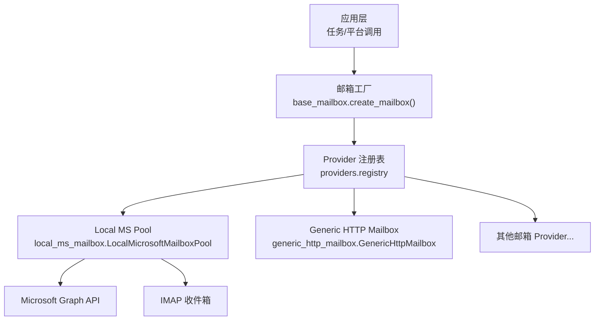
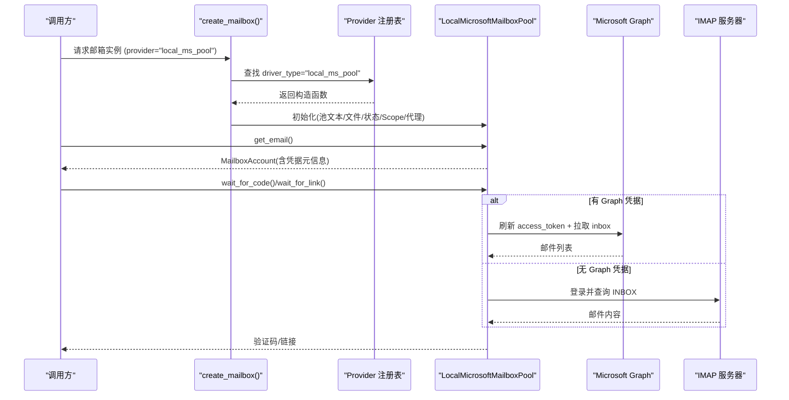
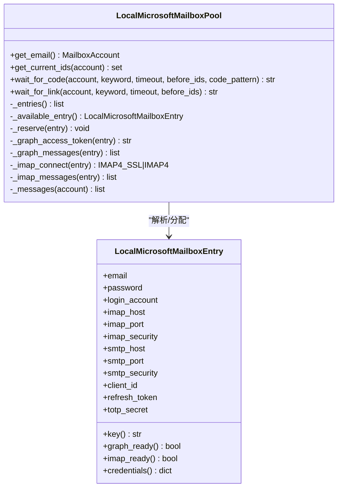
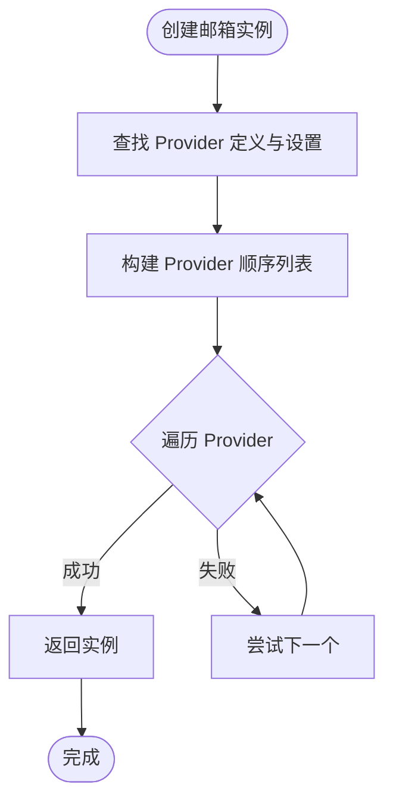
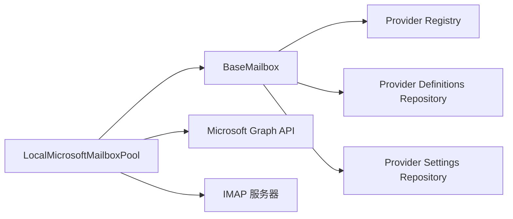

# 企业邮箱服务集成

<cite>
**本文引用的文件**
- [providers/mailbox/local_ms_pool.py](file://providers/mailbox/local_ms_pool.py)
- [core/local_ms_mailbox.py](file://core/local_ms_mailbox.py)
- [core/base_mailbox.py](file://core/base_mailbox.py)
- [core/generic_http_mailbox.py](file://core/generic_http_mailbox.py)
- [providers/registry.py](file://providers/registry.py)
- [README.md](file://README.md)
</cite>

## 目录
1. [简介](#简介)
2. [项目结构](#项目结构)
3. [核心组件](#核心组件)
4. [架构总览](#架构总览)
5. [详细组件分析](#详细组件分析)
6. [依赖关系分析](#依赖关系分析)
7. [性能与扩展性](#性能与扩展性)
8. [故障排查指南](#故障排查指南)
9. [结论](#结论)
10. [附录：部署与使用示例](#附录部署与使用示例)

## 简介
本文件面向企业级邮箱服务的集成与管理，重点解析“本地微软邮箱池（Local MS Pool）”的技术架构、管理机制与邮件收发能力。该方案支持从本地文本或文件中批量导入 Outlook/Hotmail/Live 账户，优先通过 Microsoft Graph API 读取收件箱，若未配置 Graph 凭据则回退到 IMAP；同时提供统一的邮箱 Provider 注册与工厂创建机制，便于接入更多邮箱源。文档涵盖账户批量管理、资源分配、状态监控、协议连接、认证机制、邮件处理能力以及部署配置与优化建议。

## 项目结构
围绕邮箱能力的关键目录与文件如下：
- providers/mailbox：邮箱 Provider 插件入口，将具体实现注册到统一注册表
- core/local_ms_mailbox.py：本地微软邮箱池的核心实现
- core/base_mailbox.py：邮箱抽象基类、工厂方法与通用逻辑
- core/generic_http_mailbox.py：数据驱动的通用 HTTP 邮箱驱动
- providers/registry.py：Provider 统一注册与加载
- README.md：项目概览与邮箱 Provider 列表说明

图表来源
- [core/base_mailbox.py:262-348](file://core/base_mailbox.py#L262-L348)
- [providers/registry.py:28-91](file://providers/registry.py#L28-L91)
- [core/local_ms_mailbox.py:161-290](file://core/local_ms_mailbox.py#L161-L290)

章节来源
- [core/base_mailbox.py:262-348](file://core/base_mailbox.py#L262-L348)
- [providers/registry.py:28-91](file://providers/registry.py#L28-L91)
- [core/local_ms_mailbox.py:161-290](file://core/local_ms_mailbox.py#L161-L290)
- [README.md:183-199](file://README.md#L183-L199)

## 核心组件
- LocalMicrosoftMailboxPool：本地微软邮箱池实现，负责从本地文本/文件解析账户、分配与保留账号、通过 Graph 或 IMAP 拉取邮件、等待验证码/链接。
- BaseMailbox 及 FallbackMailbox：定义邮箱 Provider 的统一接口与多 Provider 回退策略。
- GenericHttpMailbox：通过配置描述端点与步骤，零代码适配任意 HTTP 邮箱服务。
- Provider Registry：统一扫描并注册各 Provider，运行时按 key 创建实例。

章节来源
- [core/local_ms_mailbox.py:161-502](file://core/local_ms_mailbox.py#L161-L502)
- [core/base_mailbox.py:27-118](file://core/base_mailbox.py#L27-L118)
- [core/generic_http_mailbox.py:75-161](file://core/generic_http_mailbox.py#L75-L161)
- [providers/registry.py:38-91](file://providers/registry.py#L38-L91)

## 架构总览
系统采用“Provider + 工厂 + 注册表”的插件化架构：
- 启动时扫描 providers/* 下的模块，执行各自的 register_provider 装饰器，将实现类登记到全局注册表。
- 运行时通过 create_mailbox(provider_key, extra, proxy) 根据 provider key 选择对应工厂函数，构造具体邮箱实例。
- Local MS Pool 作为 mailbox 的一种实现，既可作为独立 Provider，也可被 FallbackMailbox 组合使用，形成高可用链路。

图表来源
- [core/base_mailbox.py:289-348](file://core/base_mailbox.py#L289-L348)
- [providers/registry.py:70-91](file://providers/registry.py#L70-L91)
- [core/local_ms_mailbox.py:344-438](file://core/local_ms_mailbox.py#L344-L438)

## 详细组件分析

### Local MS Pool：技术架构与管理机制
- 账户来源与解析
  - 支持从内存文本或本地文件读取“心蓝通用格式”行，自动兼容多种分隔符与注释行，去重后生成账户条目。
  - 每个条目包含邮箱、密码、登录账号、IMAP/SMTP 配置、标签、恢复邮箱、Client Id/Refresh Token、TOTP Secret 等字段。
- 资源分配与状态管理
  - 每次获取邮箱会尝试从池中选择一个未被使用的账户（可配置是否允许复用），并在状态文件中记录占用时间戳与来源标识，避免并发重复分配。
  - 状态文件持久化在默认路径下，支持跨进程共享。
- 邮件读取策略
  - 优先使用 Microsoft Graph API：通过 refresh_token 换取 access_token，拉取最近邮件列表，提取主题、预览与正文片段。
  - 若无 Graph 凭据，则回退到 IMAP：根据安全模式选择 SSL/TLS 连接，登录并只读查询 INBOX，解析 RFC822 消息体，提取文本内容。
- 验证码与链接等待
  - 轮询新邮件，清理 HTML/脚本/邮箱地址等噪声，匹配正则提取 6 位验证码或验证链接。
  - 支持关键词过滤与超时控制。

图表来源
- [core/local_ms_mailbox.py:36-86](file://core/local_ms_mailbox.py#L36-L86)
- [core/local_ms_mailbox.py:161-290](file://core/local_ms_mailbox.py#L161-L290)
- [core/local_ms_mailbox.py:344-438](file://core/local_ms_mailbox.py#L344-L438)

章节来源
- [core/local_ms_mailbox.py:103-158](file://core/local_ms_mailbox.py#L103-L158)
- [core/local_ms_mailbox.py:194-248](file://core/local_ms_mailbox.py#L194-L248)
- [core/local_ms_mailbox.py:344-438](file://core/local_ms_mailbox.py#L344-L438)
- [core/local_ms_mailbox.py:454-502](file://core/local_ms_mailbox.py#L454-L502)

### 邮箱 Provider 注册与工厂
- 注册机制
  - 每个邮箱 Provider 模块通过装饰器将自身以“类型/驱动名”的形式注册到全局注册表。
  - 启动时统一扫描 providers.captcha/proxy/sms/mailbox 子包，动态导入所有模块完成注册。
- 工厂方法
  - base_mailbox.create_mailbox 根据 provider key 查找定义与设置，组装参数并调用对应工厂函数创建实例。
  - 支持显式 fallbacks 与已启用 provider 列表合并，构建 FallbackMailbox 链，提升可用性。

图表来源
- [providers/registry.py:70-91](file://providers/registry.py#L70-L91)
- [core/base_mailbox.py:289-348](file://core/base_mailbox.py#L289-L348)

章节来源
- [providers/registry.py:38-91](file://providers/registry.py#L38-L91)
- [core/base_mailbox.py:289-348](file://core/base_mailbox.py#L289-L348)

### 通用 HTTP 邮箱驱动
- 数据驱动管道
  - 通过 pipeline_config（来自 provider_definitions.metadata_json）与 settings（用户 UI 填写）合并构建步骤：auth_steps → create_email → list_emails → get_detail。
  - 支持变量渲染、Cookie 提取、JSON/表单体、查询参数注入、API Key 注入等。
- 灵活适配
  - 当无 metadata 时，可从 flat settings 自动推断 list_emails/create_email/get_detail 步骤。
  - 支持 email_mode=fixed/namespace_tag/generate，满足固定邮箱、命名空间标签、动态创建等多种场景。

章节来源
- [core/generic_http_mailbox.py:75-161](file://core/generic_http_mailbox.py#L75-L161)
- [core/generic_http_mailbox.py:165-257](file://core/generic_http_mailbox.py#L165-L257)
- [core/generic_http_mailbox.py:270-336](file://core/generic_http_mailbox.py#L270-L336)
- [core/generic_http_mailbox.py:338-474](file://core/generic_http_mailbox.py#L338-L474)

## 依赖关系分析
- 组件耦合
  - Local MS Pool 依赖 base_mailbox 提供的抽象与工具（如 _extract_verification_link）。
  - 工厂方法依赖 provider_definitions_repository 与 provider_settings_repository 获取定义与运行时设置。
  - Provider Registry 与各邮箱模块松耦合，通过装饰器解耦注册过程。
- 外部依赖
  - Microsoft Graph API：用于高效拉取邮件与附件元信息。
  - IMAP：作为回退通道，直接访问邮箱服务器。
  - requests/imaplib/email：网络与邮件解析库。

图表来源
- [core/local_ms_mailbox.py:161-290](file://core/local_ms_mailbox.py#L161-L290)
- [core/base_mailbox.py:289-348](file://core/base_mailbox.py#L289-L348)
- [providers/registry.py:70-91](file://providers/registry.py#L70-L91)

章节来源
- [core/local_ms_mailbox.py:161-290](file://core/local_ms_mailbox.py#L161-L290)
- [core/base_mailbox.py:289-348](file://core/base_mailbox.py#L289-L348)
- [providers/registry.py:70-91](file://providers/registry.py#L70-L91)

## 性能与扩展性
- 连接与并发
  - Graph 调用使用带超时的 HTTP 请求，支持代理；IMAP 连接按需建立并在 finally 中关闭，避免连接泄漏。
  - 线程锁保护邮箱分配，防止并发重复使用同一账户。
- 可扩展性
  - 新增邮箱 Provider 仅需在 providers/mailbox 下添加模块并使用装饰器注册，无需修改核心流程。
  - 通用 HTTP 驱动可通过配置快速接入新的邮箱服务，减少代码改动。
- 优化建议
  - 合理设置 Graph scope，最小权限原则降低风险。
  - 对高频轮询场景，适当增大 wait_for_code/link 的超时与间隔，降低网络压力。
  - 使用代理池与重试策略，提高稳定性。

[本节为通用指导，不直接分析具体文件]

## 故障排查指南
- 常见错误与定位
  - 本地邮箱池为空或未解析到有效邮箱：检查 pool_text/pool_file 内容与格式。
  - Graph 刷新令牌失败：确认 client_id/refresh_token 有效且 scope 正确。
  - IMAP 连接失败：检查 host/port/security 配置与服务连通性。
  - 等待验证码/链接超时：确认目标邮箱确实收到邮件，调整关键词与正则。
- 日志与调试
  - 观察 Provider 初始化失败日志，定位配置问题。
  - 查看状态文件 used 记录，确认账户是否被占用。

章节来源
- [core/local_ms_mailbox.py:194-248](file://core/local_ms_mailbox.py#L194-L248)
- [core/local_ms_mailbox.py:344-438](file://core/local_ms_mailbox.py#L344-L438)
- [core/local_ms_mailbox.py:454-502](file://core/local_ms_mailbox.py#L454-L502)

## 结论
本地微软邮箱池提供了企业级邮箱集成的关键能力：批量账户导入、资源分配与状态管理、双通道邮件读取（Graph/IMAP）、验证码与链接提取。结合 Provider 注册与工厂机制，系统具备高度可扩展性与高可用性。通过合理的配置与优化，可满足大规模自动化注册与企业邮箱管理的复杂需求。

[本节为总结，不直接分析具体文件]

## 附录：部署与使用示例
- 配置要点
  - 邮箱 Provider 选择 local_ms_pool，并配置以下参数：
    - local_ms_pool_text：内联的账户文本
    - local_ms_pool_file：账户文件路径
    - local_ms_pool_state_file：状态文件路径
    - local_ms_graph_scope：Graph 权限范围
    - local_ms_pool_allow_reuse：是否允许重复使用账户
    - proxy：HTTP 代理
  - 账户文件格式参考“心蓝通用格式”，每行一个账户，支持多种分隔符与注释。
- 使用流程
  - 通过 create_mailbox("local_ms_pool", extra, proxy) 获取邮箱实例。
  - 调用 get_email() 获取可用邮箱与凭据元信息。
  - 调用 wait_for_code()/wait_for_link() 等待验证码或链接。
- 负载均衡与故障转移
  - 使用 FallbackMailbox 组合多个邮箱 Provider，主 Provider 失败时自动切换到备用 Provider。
  - 通过显式 fallbacks 与已启用 Provider 列表控制优先级。
- 性能优化
  - 合理设置 Graph scope 与超时，减少无效请求。
  - 使用代理与重试策略，提升网络稳定性。
  - 对 IMAP 连接进行复用与及时释放，避免资源浪费。

章节来源
- [core/base_mailbox.py:232-242](file://core/base_mailbox.py#L232-L242)
- [core/base_mailbox.py:289-348](file://core/base_mailbox.py#L289-L348)
- [core/local_ms_mailbox.py:161-290](file://core/local_ms_mailbox.py#L161-L290)
- [README.md:183-199](file://README.md#L183-L199)