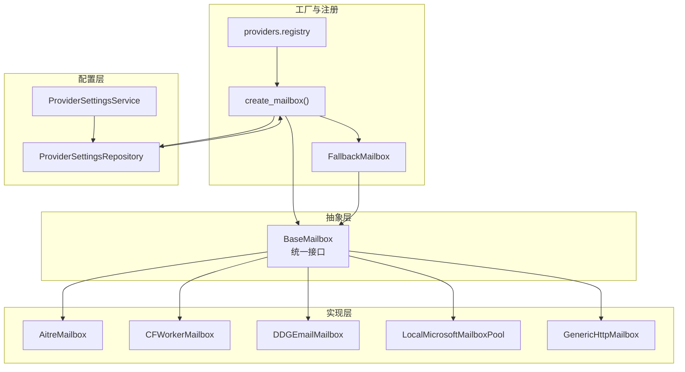
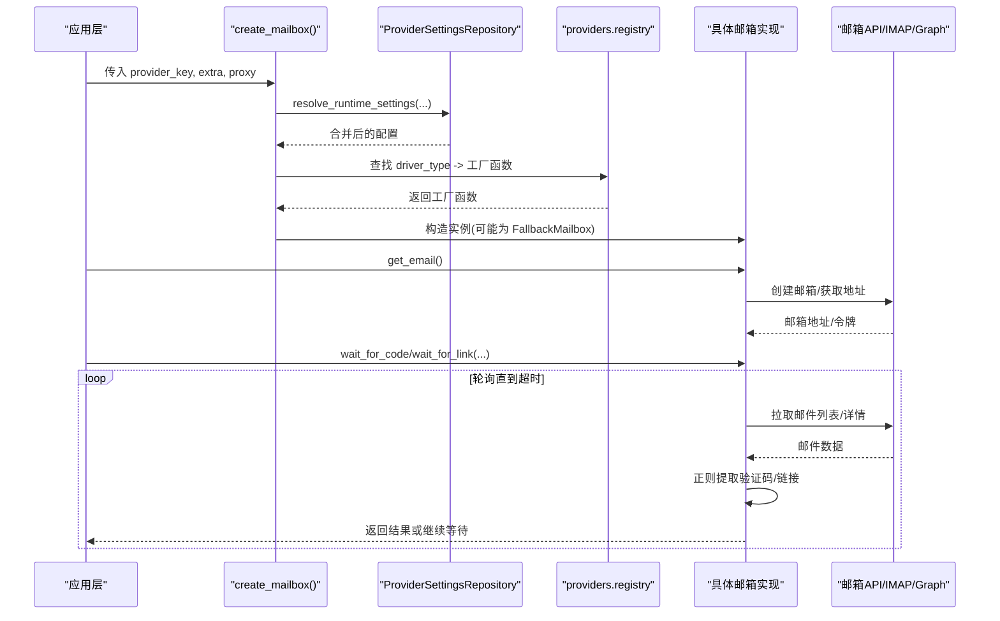
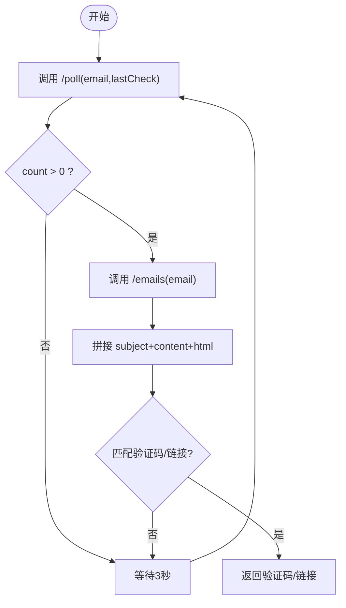
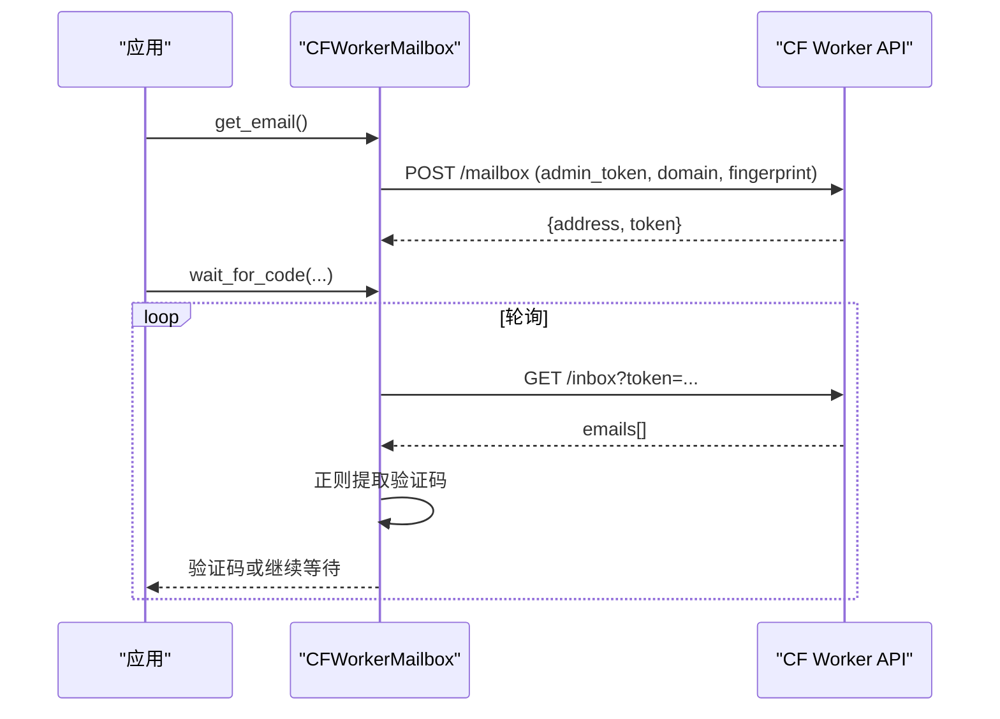
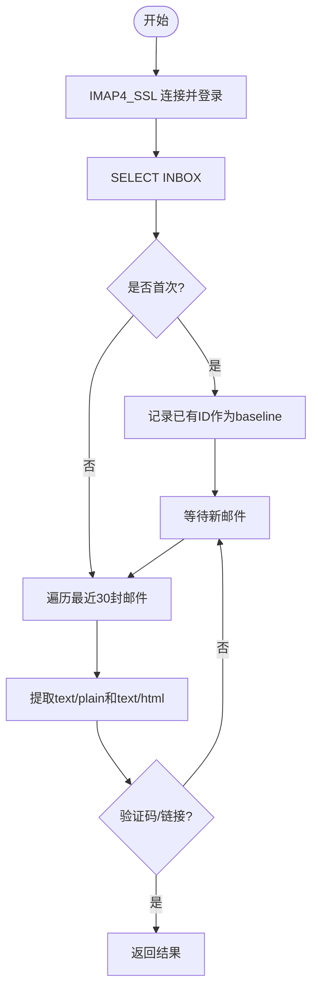
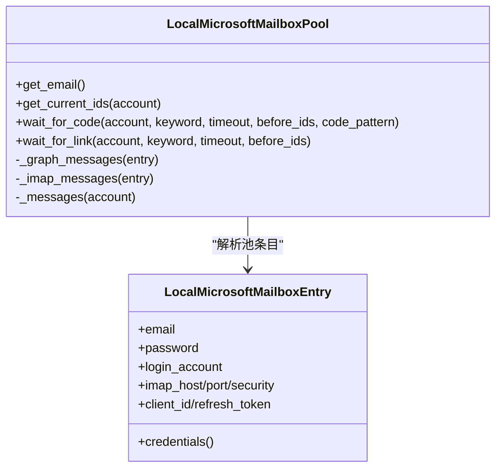
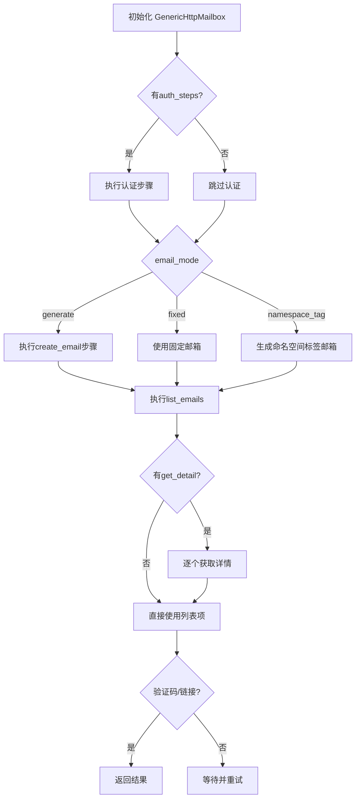
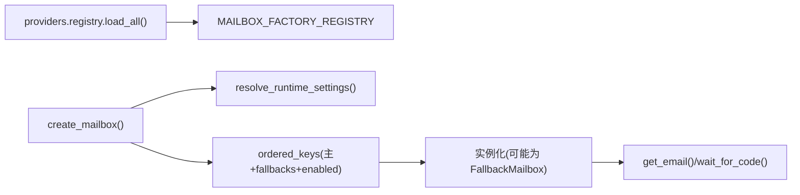

# 邮箱服务提供商集成

<cite>
**本文引用的文件**
- [core/base_mailbox.py](file://core/base_mailbox.py)
- [core/local_ms_mailbox.py](file://core/local_ms_mailbox.py)
- [core/generic_http_mailbox.py](file://core/generic_http_mailbox.py)
- [providers/mailbox/aitre.py](file://providers/mailbox/aitre.py)
- [providers/mailbox/cfworker.py](file://providers/mailbox/cfworker.py)
- [providers/mailbox/ddg_email.py](file://providers/mailbox/ddg_email.py)
- [providers/mailbox/local_ms_pool.py](file://providers/mailbox/local_ms_pool.py)
- [providers/registry.py](file://providers/registry.py)
- [application/provider_settings.py](file://application/provider_settings.py)
- [infrastructure/provider_settings_repository.py](file://infrastructure/provider_settings_repository.py)
</cite>

## 目录
1. [简介](#简介)
2. [项目结构](#项目结构)
3. [核心组件](#核心组件)
4. [架构总览](#架构总览)
5. [详细组件分析](#详细组件分析)
6. [依赖关系分析](#依赖关系分析)
7. [性能与可靠性](#性能与可靠性)
8. [故障排查指南](#故障排查指南)
9. [结论](#结论)
10. [附录：配置与最佳实践](#附录配置与最佳实践)

## 简介
本指南面向需要集成多种邮箱服务提供商的系统，覆盖临时邮箱服务（AITRE、CFWorker、DDG Email）与企业邮箱服务（Local MS Pool）的接入方式。内容涵盖：
- API 调用与邮件收发流程
- 验证码提取与验证链接处理
- 错误处理策略（延迟、不可用、域名限制等）
- 配置管理（服务选择、认证信息、超时设置）
- 集成示例与最佳实践（邮件解析、HTML 处理、安全性考虑）

## 项目结构
本项目采用“抽象基类 + 多实现 + 统一注册”的分层设计：
- 抽象层：定义统一的邮箱接口 BaseMailbox，屏蔽不同服务商差异
- 实现层：各提供商具体实现（AITRE、CFWorker、DDG Email、Local MS Pool 等）
- 工厂与注册：通过 providers/registry 自动发现并创建实例；create_mailbox 支持回退链
- 配置层：ProviderSettingsRepository 负责从数据库加载默认值、认证信息与运行时覆盖

图表来源
- [core/base_mailbox.py:27-48](file://core/base_mailbox.py#L27-L48)
- [providers/registry.py:70-91](file://providers/registry.py#L70-L91)
- [core/base_mailbox.py:289-348](file://core/base_mailbox.py#L289-L348)
- [infrastructure/provider_settings_repository.py:39-55](file://infrastructure/provider_settings_repository.py#L39-L55)

章节来源
- [core/base_mailbox.py:27-48](file://core/base_mailbox.py#L27-L48)
- [providers/registry.py:70-91](file://providers/registry.py#L70-L91)
- [core/base_mailbox.py:289-348](file://core/base_mailbox.py#L289-L348)
- [infrastructure/provider_settings_repository.py:39-55](file://infrastructure/provider_settings_repository.py#L39-L55)

## 核心组件
- BaseMailbox：定义 get_email、wait_for_code、get_current_ids、wait_for_link 四个核心方法，所有邮箱实现必须遵循该契约。
- FallbackMailbox：按顺序尝试多个 provider，创建成功后固定使用同一 provider 进行收件，提升鲁棒性。
- GenericHttpMailbox：数据驱动的通用 HTTP 驱动，通过 pipeline_config 描述 auth_steps/create_email/list_emails/get_detail 等步骤，零代码新增邮箱类型。
- LocalMicrosoftMailboxPool：企业邮箱池，优先走 Microsoft Graph，失败时回退到 IMAP；支持本地文本池与状态持久化。
- 各 Provider 模块：AITRE、CFWorker、DDG Email、Local MS Pool 通过 register_provider 注册到统一注册表。

章节来源
- [core/base_mailbox.py:27-48](file://core/base_mailbox.py#L27-L48)
- [core/base_mailbox.py:51-118](file://core/base_mailbox.py#L51-L118)
- [core/generic_http_mailbox.py:75-104](file://core/generic_http_mailbox.py#L75-L104)
- [core/local_ms_mailbox.py:161-192](file://core/local_ms_mailbox.py#L161-L192)
- [providers/mailbox/aitre.py:1-6](file://providers/mailbox/aitre.py#L1-L6)
- [providers/mailbox/cfworker.py:1-6](file://providers/mailbox/cfworker.py#L1-L6)
- [providers/mailbox/ddg_email.py:1-6](file://providers/mailbox/ddg_email.py#L1-L6)
- [providers/mailbox/local_ms_pool.py:1-6](file://providers/mailbox/local_ms_pool.py#L1-L6)

## 架构总览
下图展示从上层调用到具体邮箱实现的完整流程，包括配置解析、实例创建、回退机制与轮询获取验证码/链接。

图表来源
- [core/base_mailbox.py:289-348](file://core/base_mailbox.py#L289-L348)
- [infrastructure/provider_settings_repository.py:39-55](file://infrastructure/provider_settings_repository.py#L39-L55)
- [providers/registry.py:70-91](file://providers/registry.py#L70-L91)

## 详细组件分析

### 临时邮箱服务：AITRE
- 接入方式：通过 AitreMailbox 直接对接 mail.aitre.cc 的 /poll 与 /emails 接口。
- 邮箱生成：由外部提供邮箱地址，实现中仅封装查询与轮询。
- 验证码/链接：轮询 /poll，有新邮件后拉取 /emails，拼接 subject/content/html，使用正则提取6位验证码或提取验证链接。
- 错误处理：网络异常捕获后忽略，继续轮询；超时抛出 TimeoutError。

图表来源
- [core/base_mailbox.py:476-554](file://core/base_mailbox.py#L476-L554)

章节来源
- [core/base_mailbox.py:476-554](file://core/base_mailbox.py#L476-L554)
- [providers/mailbox/aitre.py:1-6](file://providers/mailbox/aitre.py#L1-L6)

### 临时邮箱服务：CFWorker
- 接入方式：通过 CFWorkerMailbox 对接自定义 CF Worker 提供的管理 API（如 admin token、domain、fingerprint）。
- 邮箱生成：通常通过 POST 创建邮箱，返回 address/token。
- 验证码/链接：轮询收件箱，提取验证码或链接。
- 错误处理：对 429 限流进行指数退避重试；JSON 解析失败抛错。

图表来源
- [core/base_mailbox.py:654-800](file://core/base_mailbox.py#L654-L800)
- [providers/mailbox/cfworker.py:1-6](file://providers/mailbox/cfworker.py#L1-L6)

章节来源
- [core/base_mailbox.py:654-800](file://core/base_mailbox.py#L654-L800)
- [providers/mailbox/cfworker.py:1-6](file://providers/mailbox/cfworker.py#L1-L6)

### 临时邮箱服务：DDG Email（DuckDuckGo Email Protection）
- 接入方式：通过 DDGEmailMailbox 使用 IMAP 连接 DuckDuckGo 提供的邮箱别名，支持 bearer 与 IMAP 双通道。
- 邮箱生成：可固定邮箱或通过服务生成（取决于配置），实现中主要关注收件。
- 验证码/链接：IMAP 登录 INBOX，首次建立 baseline 跳过历史邮件，只监听新邮件；正文提取 text/plain 与 text/html，正则提取验证码或链接。
- 错误处理：IMAP 连接异常捕获；针对特定服务商（如 163/126/yeah.net）发送 ID 命令兼容；超时抛错。

图表来源
- [core/base_mailbox.py:1350-1952](file://core/base_mailbox.py#L1350-L1952)
- [providers/mailbox/ddg_email.py:1-6](file://providers/mailbox/ddg_email.py#L1-L6)

章节来源
- [core/base_mailbox.py:1350-1952](file://core/base_mailbox.py#L1350-L1952)
- [providers/mailbox/ddg_email.py:1-6](file://providers/mailbox/ddg_email.py#L1-L6)

### 企业邮箱服务：Local MS Pool（本地微软邮箱池）
- 接入方式：从本地文本池读取 Xinlan/BH Mailer “common” 格式账号行，支持 Graph 与 IMAP 两种收件路径。
- 邮箱生成：从池中选择一个未使用的邮箱（可配置允许复用），返回 MailboxAccount。
- 验证码/链接：优先通过 Microsoft Graph 拉取 inbox 消息；若无 Graph 凭据则回退到 IMAP；清洗 HTML 与脚本后正则提取验证码或链接。
- 错误处理：refresh_token 换 access_token 失败抛错；Graph 读取失败抛错；IMAP 连接/登录失败抛错；状态文件持久化用于去重。

图表来源
- [core/local_ms_mailbox.py:118-158](file://core/local_ms_mailbox.py#L118-L158)
- [core/local_ms_mailbox.py:161-192](file://core/local_ms_mailbox.py#L161-L192)
- [core/local_ms_mailbox.py:344-381](file://core/local_ms_mailbox.py#L344-L381)
- [core/local_ms_mailbox.py:394-432](file://core/local_ms_mailbox.py#L394-L432)
- [core/local_ms_mailbox.py:454-501](file://core/local_ms_mailbox.py#L454-L501)

章节来源
- [core/local_ms_mailbox.py:118-158](file://core/local_ms_mailbox.py#L118-L158)
- [core/local_ms_mailbox.py:161-192](file://core/local_ms_mailbox.py#L161-L192)
- [core/local_ms_mailbox.py:344-381](file://core/local_ms_mailbox.py#L344-L381)
- [core/local_ms_mailbox.py:394-432](file://core/local_ms_mailbox.py#L394-L432)
- [core/local_ms_mailbox.py:454-501](file://core/local_ms_mailbox.py#L454-L501)
- [providers/mailbox/local_ms_pool.py:1-6](file://providers/mailbox/local_ms_pool.py#L1-L6)

### 通用 HTTP 邮箱驱动（扩展能力）
- 作用：通过 pipeline_config 描述任意 HTTP 邮箱服务的步骤，无需写代码即可接入新服务。
- 关键步骤：
  - auth_steps：可选的多步认证
  - create_email：可选的动态邮箱生成
  - list_emails：必需，拉取邮件列表
  - get_detail：可选，获取单封邮件详情
- 变量注入：支持在步骤间传递变量（如 email、account_id、message_id、session_token），便于复杂工作流。
- 超时与重试：每个步骤可配置 timeout；异常被捕获后继续轮询，最终超时抛错。

图表来源
- [core/generic_http_mailbox.py:75-104](file://core/generic_http_mailbox.py#L75-L104)
- [core/generic_http_mailbox.py:105-161](file://core/generic_http_mailbox.py#L105-L161)
- [core/generic_http_mailbox.py:195-257](file://core/generic_http_mailbox.py#L195-L257)
- [core/generic_http_mailbox.py:270-315](file://core/generic_http_mailbox.py#L270-L315)
- [core/generic_http_mailbox.py:317-411](file://core/generic_http_mailbox.py#L317-L411)
- [core/generic_http_mailbox.py:413-473](file://core/generic_http_mailbox.py#L413-L473)

章节来源
- [core/generic_http_mailbox.py:75-104](file://core/generic_http_mailbox.py#L75-L104)
- [core/generic_http_mailbox.py:105-161](file://core/generic_http_mailbox.py#L105-L161)
- [core/generic_http_mailbox.py:195-257](file://core/generic_http_mailbox.py#L195-L257)
- [core/generic_http_mailbox.py:270-315](file://core/generic_http_mailbox.py#L270-L315)
- [core/generic_http_mailbox.py:317-411](file://core/generic_http_mailbox.py#L317-L411)
- [core/generic_http_mailbox.py:413-473](file://core/generic_http_mailbox.py#L413-L473)

## 依赖关系分析
- 注册与发现：providers/registry 扫描 providers.mailbox 下的模块，将各邮箱实现注册到全局字典。
- 工厂创建：create_mailbox 根据 provider_key 查找定义与设置，构建 ordered_keys（含显式 fallbacks 与已启用项），再依次创建实例；若多于一个实例则包装为 FallbackMailbox。
- 配置合并：ProviderSettingsRepository.resolve_runtime_settings 将定义默认字段、数据库配置、认证信息、运行时覆盖合并为最终 extra。
- 回退策略：FallbackMailbox 在 get_email 失败时记录错误并尝试下一个 provider；后续收件固定使用创建成功的 provider。

图表来源
- [providers/registry.py:70-91](file://providers/registry.py#L70-L91)
- [core/base_mailbox.py:262-348](file://core/base_mailbox.py#L262-L348)
- [infrastructure/provider_settings_repository.py:39-55](file://infrastructure/provider_settings_repository.py#L39-L55)

章节来源
- [providers/registry.py:70-91](file://providers/registry.py#L70-L91)
- [core/base_mailbox.py:262-348](file://core/base_mailbox.py#L262-L348)
- [infrastructure/provider_settings_repository.py:39-55](file://infrastructure/provider_settings_repository.py#L39-L55)

## 性能与可靠性
- 轮询间隔：多数实现采用 3-5 秒轮询，避免频繁请求导致限流。
- 超时控制：wait_for_code/wait_for_link 均支持 timeout 参数，超时抛出 TimeoutError，便于上层重试或降级。
- 限流处理：CFWorker 实现中对 429 进行退避重试；其他实现通过异常捕获与继续轮询提高容错。
- 资源隔离：TempMailWeb 使用线程池与浏览器实例隔离请求；Local MS Pool 使用线程锁保护池分配。
- 建议：
  - 合理设置 timeout（例如 120-300 秒）与轮询间隔（3-5 秒）
  - 对高并发场景启用代理与用户代理伪装
  - 对 Graph/IMAP 连接设置连接池或复用会话

[本节为通用指导，不直接分析具体文件]

## 故障排查指南
- 邮箱服务不可用
  - 现象：get_email 或轮询失败，抛出 RuntimeError 或 TimeoutError
  - 处理：检查网络、代理、认证信息；启用 fallbacks 切换到其他 provider
  - 参考：create_mailbox 的错误收集与 FallbackMailbox 行为
- 邮件延迟
  - 现象：验证码/链接迟迟未到
  - 处理：增大 timeout；降低轮询频率；检查关键词过滤是否过严
  - 参考：各实现的 wait_for_code/wait_for_link 轮询逻辑
- 域名限制
  - 现象：某些平台拒绝临时域名
  - 处理：使用企业邮箱（Local MS Pool）或自定义域名（GenericHttpMailbox）
  - 参考：AITRE 等临时邮箱的实现与选择策略
- 认证失败
  - 现象：Bearer/IMAP/Graph 认证失败
  - 处理：校验 token、用户名密码、scope；刷新 refresh_token
  - 参考：Local MS Pool 的 Graph 与 IMAP 认证流程

章节来源
- [core/base_mailbox.py:289-348](file://core/base_mailbox.py#L289-L348)
- [core/base_mailbox.py:476-554](file://core/base_mailbox.py#L476-L554)
- [core/base_mailbox.py:654-800](file://core/base_mailbox.py#L654-L800)
- [core/base_mailbox.py:1350-1952](file://core/base_mailbox.py#L1350-L1952)
- [core/local_ms_mailbox.py:344-381](file://core/local_ms_mailbox.py#L344-L381)

## 结论
本项目通过抽象接口与多实现解耦了不同邮箱服务的差异，提供了灵活的工厂与回退机制，以及数据驱动的通用 HTTP 驱动，能够以最小成本接入新的邮箱服务。对于临时邮箱与企业邮箱，分别提供了高效稳定的实现，并通过配置管理与错误处理保障系统可靠性。

[本节为总结，不直接分析具体文件]

## 附录：配置与最佳实践

### 配置管理
- 服务选择
  - 在设置页配置 mailbox 类型的 provider_key，并启用默认项
  - 可通过 mail_provider_fallbacks 指定回退顺序
- 认证信息
  - 各 provider 的认证字段（如 api_url、bearer、admin_token、IMAP 配置、Graph client_id/refresh_token）通过 ProviderSettingsRepository 存储与合并
- 超时设置
  - 各实现默认超时约 10-15 秒；wait_for_* 默认 120 秒，可按需调整
- 推荐配置
  - 临时邮箱：优先使用稳定且信誉好的域名（如 AITRE、TempMail Web）
  - 企业邮箱：优先 Graph，失败回退 IMAP；开启 allow_reuse 按需复用

章节来源
- [application/provider_settings.py:7-88](file://application/provider_settings.py#L7-L88)
- [infrastructure/provider_settings_repository.py:39-55](file://infrastructure/provider_settings_repository.py#L39-L55)
- [core/base_mailbox.py:289-348](file://core/base_mailbox.py#L289-L348)

### 集成示例与最佳实践
- 邮件解析
  - 通用实现：拼接 subject/content/html/text/body/preview，使用正则提取验证码
  - 企业邮箱：清洗 HTML 与脚本，去除邮箱地址干扰，再正则匹配
- HTML 处理
  - 移除 style/script 标签，剥离无关内容，保留可读文本
  - 注意编码转换（utf-8 替换错误字符）
- 安全性考虑
  - 使用 HTTPS 与证书校验；必要时标记不安全请求并抑制警告
  - 敏感信息（token、密码）仅存储在 auth 字段，并在 UI 中脱敏预览
  - 对第三方服务进行代理与 UA 伪装，降低被封风险

章节来源
- [core/base_mailbox.py:120-149](file://core/base_mailbox.py#L120-L149)
- [core/local_ms_mailbox.py:446-452](file://core/local_ms_mailbox.py#L446-L452)
- [core/generic_http_mailbox.py:165-191](file://core/generic_http_mailbox.py#L165-L191)
- [core/base_mailbox.py:1923-1952](file://core/base_mailbox.py#L1923-L1952)