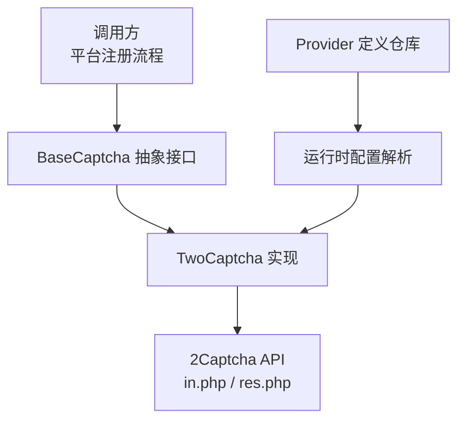
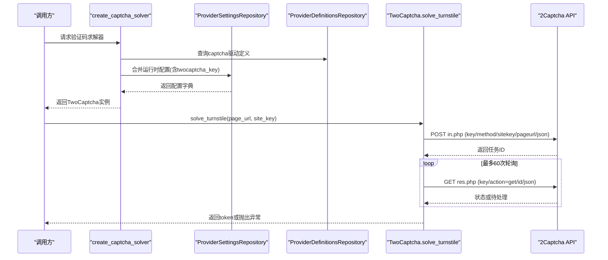
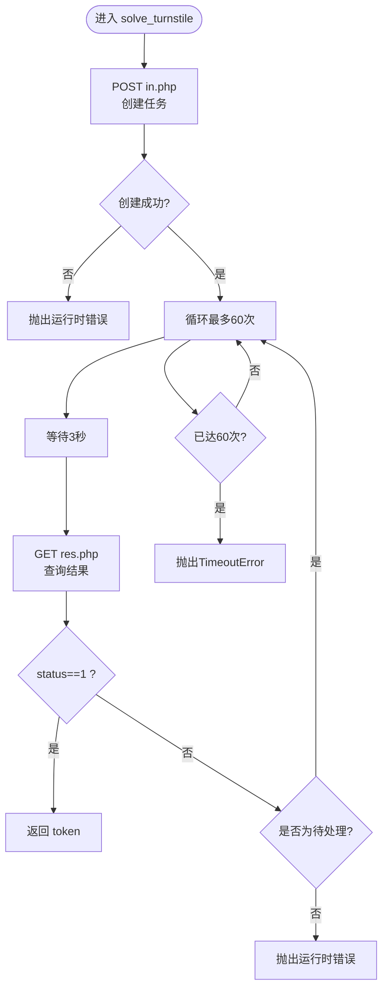
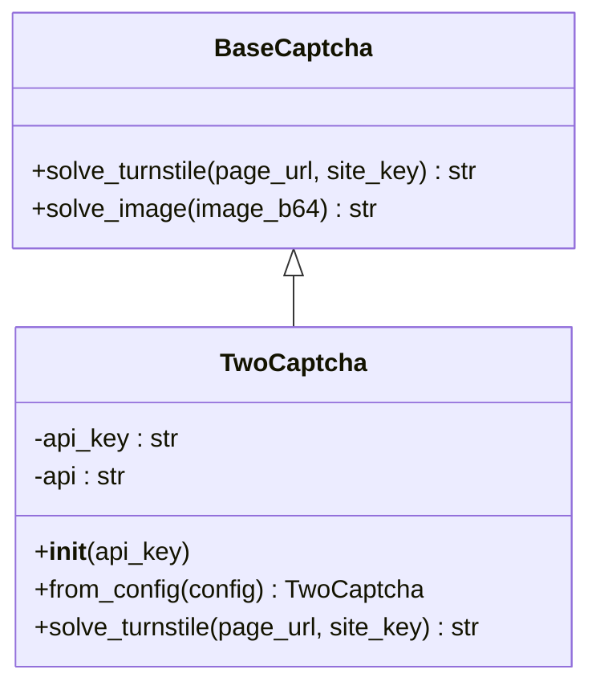
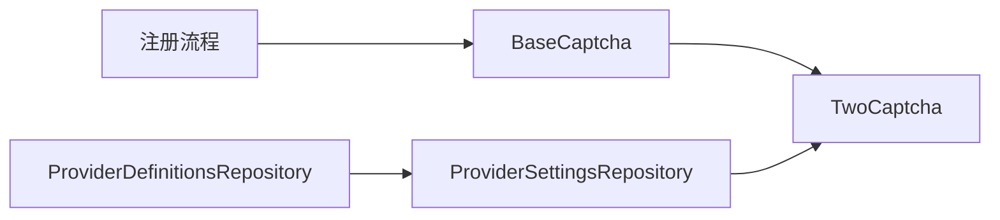

# 2Captcha服务集成

<cite>
**本文引用的文件**
- [providers/captcha/twocaptcha.py](file://providers/captcha/twocaptcha.py)
- [core/base_captcha.py](file://core/base_captcha.py)
- [infrastructure/provider_definitions_repository.py](file://infrastructure/provider_definitions_repository.py)
- [infrastructure/provider_settings_repository.py](file://infrastructure/provider_settings_repository.py)
- [core/http_client.py](file://core/http_client.py)
- [core/registration/errors.py](file://core/registration/errors.py)
</cite>

## 目录
1. [简介](#简介)
2. [项目结构](#项目结构)
3. [核心组件](#核心组件)
4. [架构总览](#架构总览)
5. [详细组件分析](#详细组件分析)
6. [依赖关系分析](#依赖关系分析)
7. [性能考量](#性能考量)
8. [故障排查指南](#故障排查指南)
9. [结论](#结论)
10. [附录](#附录)

## 简介
本文件面向需要在自动化注册流程中接入2Captcha Turnstile验证码识别的开发者，系统性说明从配置、任务创建、结果轮询到异常处理的完整实现。重点围绕 TwoCaptcha 类的 solve_turnstile 方法，解释其POST创建任务与GET轮询结果的机制、重试与超时策略，并结合项目的Provider定义与设置体系，给出可操作的配置示例与最佳实践。同时提供常见问题的定位与解决思路。

## 项目结构
本项目将验证码能力以Provider插件形式组织，2Captcha作为云端验证码提供商之一，通过统一的BaseCaptcha接口暴露Turnstile求解能力。相关关键路径如下：
- 验证码抽象与工厂：core/base_captcha.py
- 2Captcha实现：providers/captcha/twocaptcha.py
- Provider元数据（字段、认证方式等）：infrastructure/provider_definitions_repository.py
- 运行时配置解析：infrastructure/provider_settings_repository.py
- HTTP客户端通用重试逻辑（供其他模块参考）：core/http_client.py
- 注册流程错误类型（用于上层统一处理）：core/registration/errors.py

图表来源
- [core/base_captcha.py:5-14](file://core/base_captcha.py#L5-L14)
- [providers/captcha/twocaptcha.py:6-17](file://providers/captcha/twocaptcha.py#L6-L17)
- [infrastructure/provider_definitions_repository.py:239-267](file://infrastructure/provider_definitions_repository.py#L239-L267)
- [infrastructure/provider_settings_repository.py:39-55](file://infrastructure/provider_settings_repository.py#L39-L55)

章节来源
- [core/base_captcha.py:5-14](file://core/base_captcha.py#L5-L14)
- [providers/captcha/twocaptcha.py:6-17](file://providers/captcha/twocaptcha.py#L6-L17)
- [infrastructure/provider_definitions_repository.py:239-267](file://infrastructure/provider_definitions_repository.py#L239-L267)
- [infrastructure/provider_settings_repository.py:39-55](file://infrastructure/provider_settings_repository.py#L39-L55)

## 核心组件
- BaseCaptcha：定义验证码求解的统一接口，包括solve_turnstile与solve_image。
- TwoCaptcha：基于2Captcha云服务的Turnstile求解实现，负责创建任务、轮询结果、错误处理与超时控制。
- Provider定义与设置：通过数据库中的内置定义描述2Captcha所需的认证字段（API Key），并在运行时合并用户配置，注入到TwoCaptcha实例中。

章节来源
- [core/base_captcha.py:5-14](file://core/base_captcha.py#L5-L14)
- [providers/captcha/twocaptcha.py:6-17](file://providers/captcha/twocaptcha.py#L6-L17)
- [infrastructure/provider_definitions_repository.py:239-267](file://infrastructure/provider_definitions_repository.py#L239-L267)
- [infrastructure/provider_settings_repository.py:39-55](file://infrastructure/provider_settings_repository.py#L39-L55)

## 架构总览
下图展示了从配置到求解的端到端流程：系统读取Provider定义与运行时设置，构造TwoCaptcha实例；业务侧调用solve_turnstile，内部先POST创建任务，再循环GET轮询直至成功或失败/超时。

图表来源
- [core/base_captcha.py:67-97](file://core/base_captcha.py#L67-L97)
- [providers/captcha/twocaptcha.py:19-60](file://providers/captcha/twocaptcha.py#L19-L60)
- [infrastructure/provider_definitions_repository.py:239-267](file://infrastructure/provider_definitions_repository.py#L239-L267)
- [infrastructure/provider_settings_repository.py:39-55](file://infrastructure/provider_settings_repository.py#L39-L55)

## 详细组件分析

### TwoCaptcha.solve_turnstile 实现原理
- 任务创建（POST）
  - 端点：{api}/in.php
  - 参数：key（API密钥）、method=turnstile、sitekey（站点标识）、pageurl（页面URL）、json=1
  - 超时：30秒
  - 响应校验：status为1表示创建成功；否则抛出运行时错误；必须包含request字段作为任务ID
- 结果轮询（GET）
  - 端点：{api}/res.php
  - 参数：key、action=get、id（任务ID）、json=1
  - 超时：30秒
  - 轮询策略：最多60次，每次间隔3秒；当status=1时返回request字段（token）；若返回非“CAPCHA_NOT_READY”/“CAPTCHA_NOT_READY”的错误码，直接抛出运行时错误
  - 超时处理：达到最大轮询次数仍未成功则抛出TimeoutError
- 错误处理策略
  - 网络层：raise_for_status()对HTTP错误进行拦截
  - 业务层：对非预期响应结构与状态码进行断言并抛出明确异常
  - 超时：显式抛出TimeoutError，便于上层区分“等待过久”与“业务错误”

图表来源
- [providers/captcha/twocaptcha.py:19-60](file://providers/captcha/twocaptcha.py#L19-L60)

章节来源
- [providers/captcha/twocaptcha.py:19-60](file://providers/captcha/twocaptcha.py#L19-L60)

### 配置与实例化（from_config 与 create_captcha_solver）
- from_config
  - 从配置字典中读取twocaptcha_key，缺失时抛出运行时错误，确保强约束
- create_captcha_solver
  - 根据Provider定义与运行时设置，选择driver_type为twocaptcha_api时，读取twocaptcha_key并构造TwoCaptcha实例
  - 未配置或Key为空时抛出运行时错误，阻止后续流程继续

图表来源
- [core/base_captcha.py:5-14](file://core/base_captcha.py#L5-L14)
- [providers/captcha/twocaptcha.py:6-17](file://providers/captcha/twocaptcha.py#L6-L17)

章节来源
- [providers/captcha/twocaptcha.py:12-17](file://providers/captcha/twocaptcha.py#L12-L17)
- [core/base_captcha.py:67-97](file://core/base_captcha.py#L67-L97)
- [infrastructure/provider_definitions_repository.py:239-267](file://infrastructure/provider_definitions_repository.py#L239-L267)
- [infrastructure/provider_settings_repository.py:39-55](file://infrastructure/provider_settings_repository.py#L39-L55)

### 使用示例与最佳实践
- 配置示例
  - 在Provider设置中启用twocaptcha_api，并填写twocaptcha_key（API Key）
  - 可通过Provider定义的字段键名进行配置，运行时由resolve_runtime_settings合并
- 代码片段指引
  - 获取实例：通过create_captcha_solver("twocaptcha_api")获得TwoCaptcha对象
  - 调用求解：调用solve_turnstile(page_url, site_key)获取Turnstile token
  - 异常处理：捕获运行时错误与TimeoutError，分别对应“业务错误/网络错误”和“轮询超时”
- 最佳实践
  - 在调用前校验twocaptcha_key是否已配置，避免空Key导致无效请求
  - 对网络异常与业务异常进行分类处理，记录日志并支持重试或降级
  - 合理设置业务超时阈值，结合2Captcha的60次×3秒轮询上限，避免长时间阻塞

章节来源
- [infrastructure/provider_definitions_repository.py:239-267](file://infrastructure/provider_definitions_repository.py#L239-L267)
- [infrastructure/provider_settings_repository.py:39-55](file://infrastructure/provider_settings_repository.py#L39-L55)
- [core/base_captcha.py:67-97](file://core/base_captcha.py#L67-L97)
- [providers/captcha/twocaptcha.py:19-60](file://providers/captcha/twocaptcha.py#L19-L60)

## 依赖关系分析
- TwoCaptcha依赖requests进行HTTP通信，并通过BaseCaptcha接口被上层统一调度
- Provider定义与设置仓库提供元数据与运行时配置，确保Key等敏感信息正确注入
- 上层注册流程可使用统一的错误类型进行异常分类

图表来源
- [core/base_captcha.py:5-14](file://core/base_captcha.py#L5-L14)
- [providers/captcha/twocaptcha.py:6-17](file://providers/captcha/twocaptcha.py#L6-L17)
- [infrastructure/provider_definitions_repository.py:239-267](file://infrastructure/provider_definitions_repository.py#L239-L267)
- [infrastructure/provider_settings_repository.py:39-55](file://infrastructure/provider_settings_repository.py#L39-L55)

章节来源
- [core/base_captcha.py:5-14](file://core/base_captcha.py#L5-L14)
- [providers/captcha/twocaptcha.py:6-17](file://providers/captcha/twocaptcha.py#L6-L17)
- [infrastructure/provider_definitions_repository.py:239-267](file://infrastructure/provider_definitions_repository.py#L239-L267)
- [infrastructure/provider_settings_repository.py:39-55](file://infrastructure/provider_settings_repository.py#L39-L55)

## 性能考量
- 轮询开销：60次×3秒=180秒最大等待时间，适合短时任务；在高并发场景下注意限流与资源占用
- 网络超时：每次请求设置30秒超时，避免长期挂起
- 并发与重试：如需更高吞吐，可在调用方引入并发控制与指数退避重试（参考HTTP客户端的重试模式）
- 资源优化：减少不必要的日志与调试输出，降低I/O压力

[本节为通用指导，不直接分析具体文件]

## 故障排查指南
- 网络超时
  - 现象：请求长时间无响应或抛出超时异常
  - 排查：检查网络连通性、代理配置、DNS解析；确认2Captcha服务可达
  - 建议：适当增加外层超时阈值，或在调用方加入重试与降级策略
- API限流
  - 现象：频繁请求被拒绝或返回限流错误
  - 排查：观察HTTP状态码与响应体；检查调用频率
  - 建议：在调用方实施速率限制与退避重试
- 任务失败
  - 现象：创建任务失败或轮询返回非待处理错误
  - 排查：核对sitekey与pageurl是否正确；确认twocaptcha_key有效；查看2Captcha返回的具体错误信息
  - 建议：记录完整请求与响应上下文，便于定位问题
- 轮询超时
  - 现象：达到最大轮询次数仍未得到token
  - 排查：确认目标网站Turnstile加载正常；检查网络与代理；必要时提高业务超时阈值
  - 建议：在调用方捕获TimeoutError并做重试或切换备用方案

章节来源
- [providers/captcha/twocaptcha.py:19-60](file://providers/captcha/twocaptcha.py#L19-L60)
- [core/http_client.py:109-145](file://core/http_client.py#L109-L145)
- [core/registration/errors.py:4-27](file://core/registration/errors.py#L4-L27)

## 结论
TwoCaptcha在该项目中以Provider插件形式提供Turnstile验证码识别能力，通过统一的BaseCaptcha接口与Provider配置体系，实现了清晰的职责分离与可扩展性。solve_turnstile采用“POST创建+GET轮询”的标准流程，具备明确的错误处理与超时控制。配合合理的配置与异常处理策略，可在自动化注册场景中稳定运行。

[本节为总结性内容，不直接分析具体文件]

## 附录
- 计费模式与准确率
  - 计费模式：按任务数量计费（具体单价与套餐以2Captcha官方为准）
  - 准确率：Turnstile识别成功率受站点策略、页面环境、代理质量等多因素影响
  - 适用场景：需要云端人工或智能识别Turnstile的自动化注册、登录等流程
- 快速上手清单
  - 在Provider设置中启用twocaptcha_api并填写twocaptcha_key
  - 通过create_captcha_solver获取TwoCaptcha实例
  - 调用solve_turnstile(page_url, site_key)获取token
  - 捕获并处理运行时错误与TimeoutError

[本节为补充信息，不直接分析具体文件]