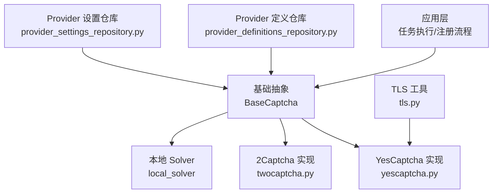
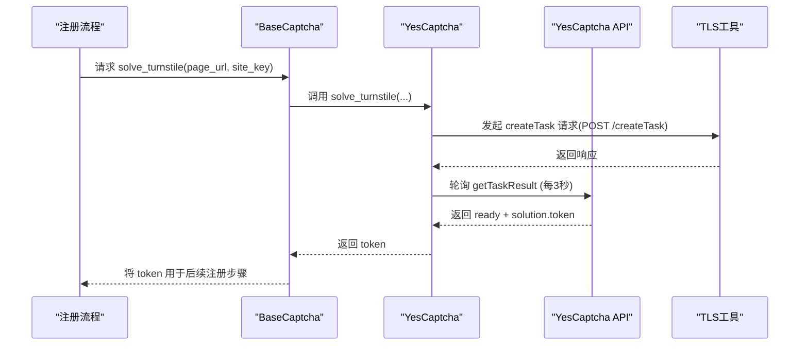
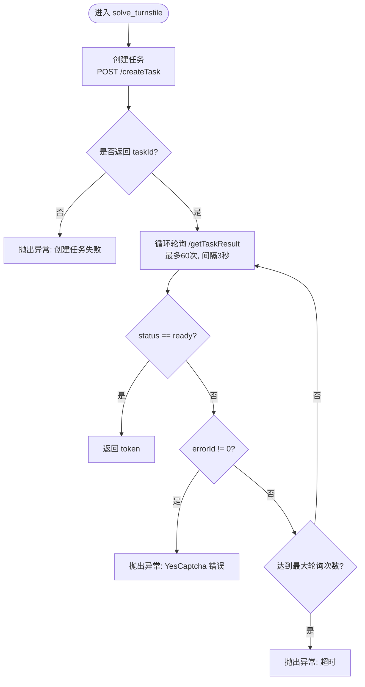
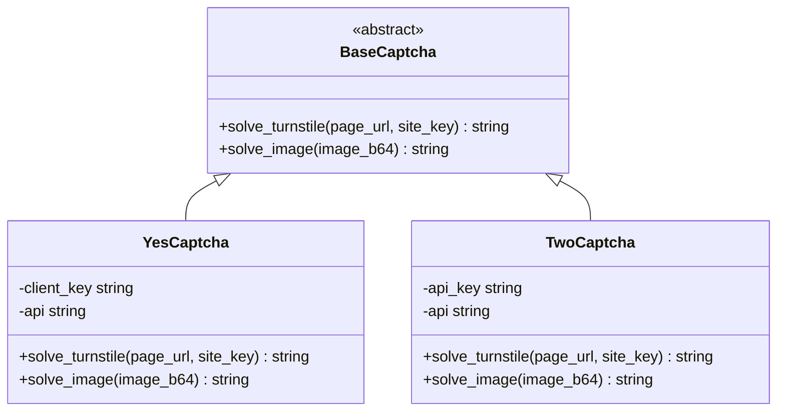
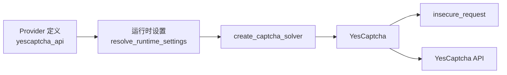

# YesCaptcha服务集成

<cite>
**本文引用的文件**
- [providers/captcha/yescaptcha.py](file://providers/captcha/yescaptcha.py)
- [core/base_captcha.py](file://core/base_captcha.py)
- [infrastructure/provider_definitions_repository.py](file://infrastructure/provider_definitions_repository.py)
- [infrastructure/provider_settings_repository.py](file://infrastructure/provider_settings_repository.py)
- [core/tls.py](file://core/tls.py)
- [providers/captcha/twocaptcha.py](file://providers/captcha/twocaptcha.py)
- [services/turnstile_solver/start.py](file://services/turnstile_solver/start.py)
- [README.md](file://README.md)
</cite>

## 目录
1. [简介](#简介)
2. [项目结构](#项目结构)
3. [核心组件](#核心组件)
4. [架构总览](#架构总览)
5. [详细组件分析](#详细组件分析)
6. [依赖关系分析](#依赖关系分析)
7. [性能与成本优化](#性能与成本优化)
8. [故障排查指南](#故障排查指南)
9. [结论](#结论)
10. [附录：配置项与最佳实践](#附录配置项与最佳实践)

## 简介
本文件面向需要在 Any Auto Register 中接入 YesCaptcha 验证码解决服务的开发者与运维人员，提供从服务初始化、API 密钥配置、Turnstile 验证码提交与结果获取的完整流程说明；对比 YesCaptcha 与 2Captcha 的差异；给出可操作的集成示例路径、错误处理与重试策略、以及成本控制与性能优化建议。同时涵盖常见问题（调用失败、识别错误、网络问题）的处理方法。

## 项目结构
本项目采用插件化 Provider 体系，验证码能力通过 providers/captcha 下的具体实现接入，并通过基础设施层 provider_definitions_repository 与 provider_settings_repository 完成定义与运行时配置的加载。YesCaptcha 作为云端 Turnstile 求解器之一，遵循统一的 BaseCaptcha 接口，便于在注册流程中无缝替换或扩展。

图表来源
- [core/base_captcha.py:5-14](file://core/base_captcha.py#L5-L14)
- [providers/captcha/yescaptcha.py:7-42](file://providers/captcha/yescaptcha.py#L7-L42)
- [providers/captcha/twocaptcha.py:6-63](file://providers/captcha/twocaptcha.py#L6-L63)
- [infrastructure/provider_definitions_repository.py:239-281](file://infrastructure/provider_definitions_repository.py#L239-L281)
- [infrastructure/provider_settings_repository.py:39-55](file://infrastructure/provider_settings_repository.py#L39-L55)
- [core/tls.py:19-23](file://core/tls.py#L19-L23)

章节来源
- [core/base_captcha.py:5-14](file://core/base_captcha.py#L5-L14)
- [providers/captcha/yescaptcha.py:7-42](file://providers/captcha/yescaptcha.py#L7-L42)
- [infrastructure/provider_definitions_repository.py:239-281](file://infrastructure/provider_definitions_repository.py#L239-L281)
- [infrastructure/provider_settings_repository.py:39-55](file://infrastructure/provider_settings_repository.py#L39-L55)
- [core/tls.py:19-23](file://core/tls.py#L19-L23)

## 核心组件
- BaseCaptcha：统一验证码接口，声明 solve_turnstile 与 solve_image 两个抽象方法，确保不同实现具备一致调用方式。
- YesCaptcha：云端 Turnstile 求解器，负责创建任务、轮询结果并返回 token。
- Provider 定义与设置：通过数据库驱动的定义与运行时设置，动态启用/禁用与参数注入。
- TLS 工具：封装 requests 调用，默认关闭证书校验并抑制告警，适配内网或代理环境。

章节来源
- [core/base_captcha.py:5-14](file://core/base_captcha.py#L5-L14)
- [providers/captcha/yescaptcha.py:7-42](file://providers/captcha/yescaptcha.py#L7-L42)
- [infrastructure/provider_definitions_repository.py:239-281](file://infrastructure/provider_definitions_repository.py#L239-L281)
- [core/tls.py:19-23](file://core/tls.py#L19-L23)

## 架构总览
YesCaptcha 在系统中的角色是“云端 Turnstile 求解器”。注册流程遇到 Turnstile 时，系统根据已启用的验证码 Provider 选择 YesCaptcha，构造任务并提交到 YesCaptcha API，随后轮询获取 token 并回传给上层流程继续注册。

图表来源
- [providers/captcha/yescaptcha.py:20-39](file://providers/captcha/yescaptcha.py#L20-L39)
- [core/tls.py:19-23](file://core/tls.py#L19-L23)

章节来源
- [providers/captcha/yescaptcha.py:20-39](file://providers/captcha/yescaptcha.py#L20-L39)
- [core/tls.py:19-23](file://core/tls.py#L19-L23)

## 详细组件分析

### YesCaptcha 组件
- 职责：封装与 YesCaptcha 云端的交互，包括创建 Turnstile 任务、轮询结果、错误与超时处理。
- 关键行为：
  - 使用 insecure_request 发送 POST 到 /createTask，携带 clientKey、websiteURL、websiteKey。
  - 循环轮询 /getTaskResult，等待 status=ready，提取 solution.token。
  - 若 errorId!=0 则抛出异常；若轮询达到上限则抛出超时。
- 数据流：输入 page_url、site_key；输出 token。
- 复杂度：轮询次数固定为 60 次，每次间隔 3 秒，最大耗时约 180 秒。

图表来源
- [providers/captcha/yescaptcha.py:20-39](file://providers/captcha/yescaptcha.py#L20-L39)

章节来源
- [providers/captcha/yescaptcha.py:20-39](file://providers/captcha/yescaptcha.py#L20-L39)

### BaseCaptcha 与工厂
- BaseCaptcha 定义了统一接口，使上层无需关心具体实现。
- create_captcha_solver 根据 provider_key 与 driver_type 实例化具体验证码服务，支持 yescaptcha_api、twocaptcha_api、local_solver 等。
- has_captcha_configured 检查某 provider 是否已配置且可用。

图表来源
- [core/base_captcha.py:5-14](file://core/base_captcha.py#L5-L14)
- [providers/captcha/yescaptcha.py:7-42](file://providers/captcha/yescaptcha.py#L7-L42)
- [providers/captcha/twocaptcha.py:6-63](file://providers/captcha/twocaptcha.py#L6-L63)

章节来源
- [core/base_captcha.py:5-14](file://core/base_captcha.py#L5-L14)
- [core/base_captcha.py:67-97](file://core/base_captcha.py#L67-L97)

### Provider 定义与运行时设置
- 定义：在内置定义中包含 YesCaptcha，driver_type 为 yescaptcha_api，字段包含 yescaptcha_key（Client Key）。
- 设置：运行时通过 resolve_runtime_settings 合并默认值、用户配置与覆盖参数，供 create_captcha_solver 使用。
- 启用顺序：可通过 get_enabled_captcha_order 获取启用的验证码 provider 列表（排除 manual 与 local_solver），用于多 provider 场景的优先级控制。

章节来源
- [infrastructure/provider_definitions_repository.py:239-281](file://infrastructure/provider_definitions_repository.py#L239-L281)
- [infrastructure/provider_settings_repository.py:39-55](file://infrastructure/provider_settings_repository.py#L39-L55)
- [infrastructure/provider_settings_repository.py:67-79](file://infrastructure/provider_settings_repository.py#L67-L79)

### TLS 工具
- insecure_request 对 requests 调用设置 verify=False 并屏蔽 InsecureRequestWarning，适用于内网或代理环境。
- mark_session_insecure 可用于 Session 级别关闭证书校验。

章节来源
- [core/tls.py:19-23](file://core/tls.py#L19-L23)

## 依赖关系分析
- YesCaptcha 依赖 BaseCaptcha 接口，通过 register_provider 注册为 captcha 类型的 yescaptcha_api 驱动。
- 创建与运行期：
  - create_captcha_solver 读取 provider 定义与设置，实例化 YesCaptcha。
  - YesCaptcha 使用 core.tls.insecure_request 进行 HTTP 调用。
- 与 2Captcha 的关系：两者均实现 BaseCaptcha，可在同一系统中并存并按优先级选择。

图表来源
- [infrastructure/provider_definitions_repository.py:239-281](file://infrastructure/provider_definitions_repository.py#L239-L281)
- [infrastructure/provider_settings_repository.py:39-55](file://infrastructure/provider_settings_repository.py#L39-L55)
- [core/base_captcha.py:67-97](file://core/base_captcha.py#L67-L97)
- [providers/captcha/yescaptcha.py:7-42](file://providers/captcha/yescaptcha.py#L7-L42)
- [core/tls.py:19-23](file://core/tls.py#L19-L23)

章节来源
- [core/base_captcha.py:67-97](file://core/base_captcha.py#L67-L97)
- [providers/captcha/yescaptcha.py:7-42](file://providers/captcha/yescaptcha.py#L7-L42)
- [infrastructure/provider_definitions_repository.py:239-281](file://infrastructure/provider_definitions_repository.py#L239-L281)
- [infrastructure/provider_settings_repository.py:39-55](file://infrastructure/provider_settings_repository.py#L39-L55)
- [core/tls.py:19-23](file://core/tls.py#L19-L23)

## 性能与成本优化
- 轮询频率与超时：
  - YesCaptcha 轮询间隔为 3 秒，最大轮询 60 次，整体最长约 180 秒。可根据业务容忍度调整轮询策略（例如缩短间隔或减少次数）以降低延迟。
- 并发限制：
  - 当前实现未显式限制并发，建议在调用侧（注册流程或服务管理器）增加并发控制，避免短时间内大量请求触发限流或风控。
- 成本控制：
  - 合理选择验证码 provider 优先级，优先使用成功率更高或成本更低的方案。
  - 结合代理质量降低被风控概率，减少重复请求带来的额外费用。
- 性能优化：
  - 复用连接：如需高并发，可考虑基于 requests.Session 复用连接（需配合 TLS 工具标记为不安全）。
  - 降级策略：当 YesCaptcha 持续失败时，自动切换到其他 provider（如 2Captcha 或本地 Solver）。

[本节为通用指导，不直接分析具体文件]

## 故障排查指南
- API 调用失败：
  - 检查 Client Key 是否正确配置（yescaptcha_key）。
  - 确认网络连通性与代理设置，必要时使用本地 Solver 或切换 provider。
  - 查看错误响应中的 errorId，定位具体错误原因。
- 验证码识别错误：
  - 检查 page_url 与 site_key 是否与目标页面一致。
  - 更换代理 IP，避免高风险 IP 导致更严格的验证。
  - 降低并发，避免同一 IP 短时间大量请求。
- 网络连接问题：
  - 确认 TLS 工具配置（verify=False）与代理可达。
  - Docker 环境下注意端口占用与依赖安装（如 Camoufox）。
- 本地 Solver 启动超时：
  - 首次启动可能需要下载或初始化浏览器依赖，执行相应命令后重启 Solver。
  - 若不使用本地 Solver，可直接配置 YesCaptcha 或 2Captcha。

章节来源
- [providers/captcha/yescaptcha.py:20-39](file://providers/captcha/yescaptcha.py#L20-L39)
- [README.md:388-419](file://README.md#L388-L419)

## 结论
YesCaptcha 在本项目中以标准化 Provider 形式接入，提供稳定的 Turnstile 识别能力。通过统一的 BaseCaptcha 接口与 Provider 定义/设置机制，系统实现了灵活的多 provider 管理与运行时配置。结合合理的并发控制、代理质量与降级策略，可以在保证成功率的同时有效控制成本与风险。

[本节为总结性内容，不直接分析具体文件]

## 附录：配置项与最佳实践

### 服务初始化与密钥配置
- 在 Provider 定义中启用 YesCaptcha，并在运行时设置中填写 Client Key（yescaptcha_key）。
- 通过 create_captcha_solver 按 provider_key 获取实例，内部会校验 key 是否存在。

章节来源
- [infrastructure/provider_definitions_repository.py:239-281](file://infrastructure/provider_definitions_repository.py#L239-L281)
- [core/base_captcha.py:67-97](file://core/base_captcha.py#L67-L97)

### 验证码提交与结果获取
- 调用 solve_turnstile(page_url, site_key)，内部会创建任务并轮询结果，最终返回 token。
- 若出现错误或超时，捕获异常并进行重试或降级。

章节来源
- [providers/captcha/yescaptcha.py:20-39](file://providers/captcha/yescaptcha.py#L20-L39)

### 与其他验证码服务的差异与特点
- YesCaptcha vs 2Captcha：
  - 两者均支持 Turnstile，但 API 端点与参数不同；YesCaptcha 使用 /createTask 与 /getTaskResult，2Captcha 使用 /in.php 与 /res.php。
  - 轮询逻辑相似，均存在超时与错误处理。
- 本地 Solver：
  - 适合离线或内网环境，依赖 Camoufox 等浏览器自动化组件。

章节来源
- [providers/captcha/twocaptcha.py:19-60](file://providers/captcha/twocaptcha.py#L19-L60)
- [services/turnstile_solver/start.py:15-28](file://services/turnstile_solver/start.py#L15-L28)

### 配置选项
- 代理设置：
  - 通过全局代理池或旋转网关配置，影响验证码请求的网络出口。
- 超时配置：
  - YesCaptcha 请求超时为 30 秒，轮询最大 60 次，间隔 3 秒。
- 并发限制：
  - 建议在调用侧控制并发，避免触发服务商限流或目标平台风控。

章节来源
- [providers/captcha/yescaptcha.py:20-39](file://providers/captcha/yescaptcha.py#L20-L39)
- [infrastructure/provider_definitions_repository.py:352-383](file://infrastructure/provider_definitions_repository.py#L352-L383)

### 最佳实践
- 成本控制：
  - 合理选择 provider 优先级，优先使用成功率高的方案；结合代理质量降低失败率。
- 性能优化：
  - 控制并发、复用连接、合理设置超时与重试。
- 错误恢复：
  - 实现多 provider 降级；对网络错误进行指数退避重试；记录日志以便定位问题。

[本节为通用指导，不直接分析具体文件]