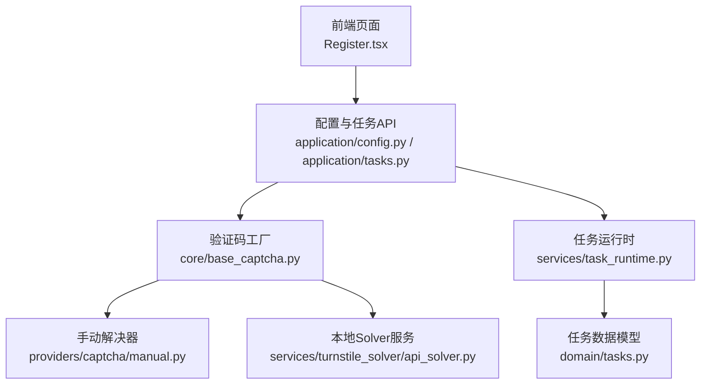
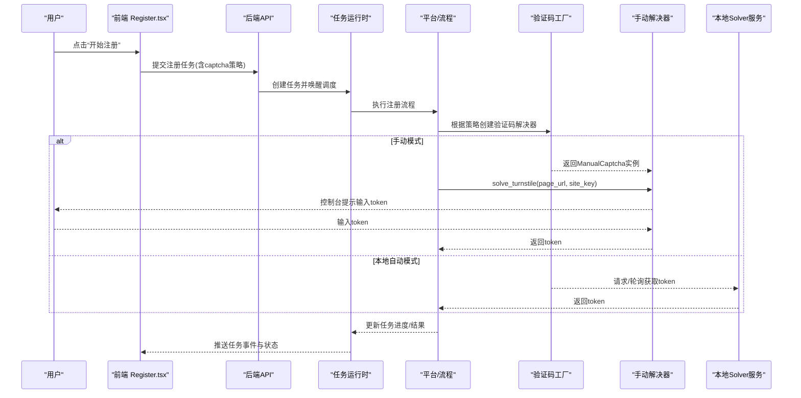
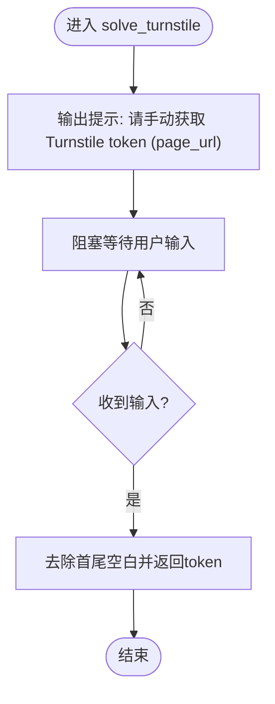
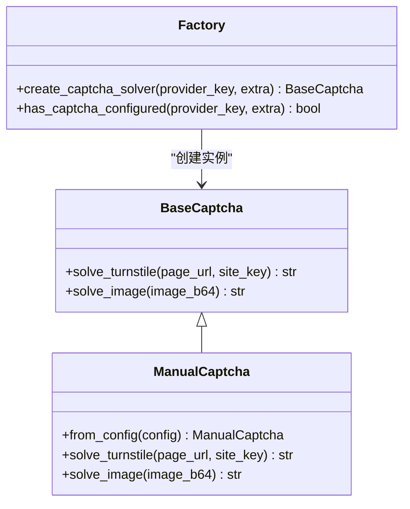
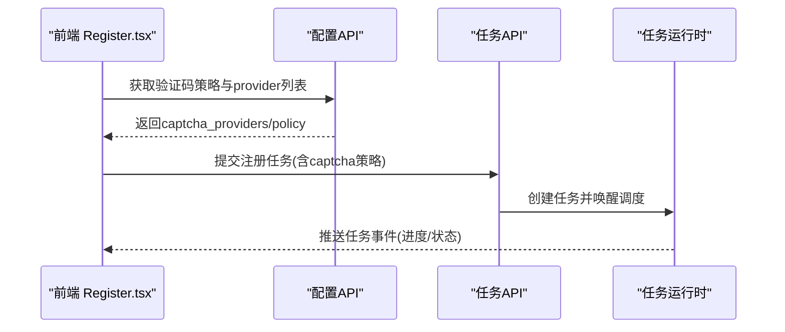
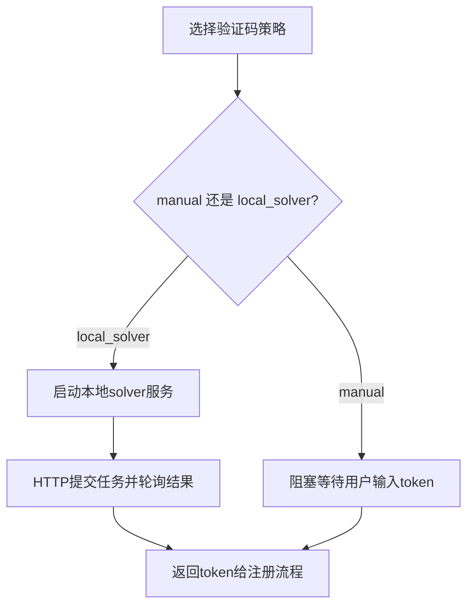
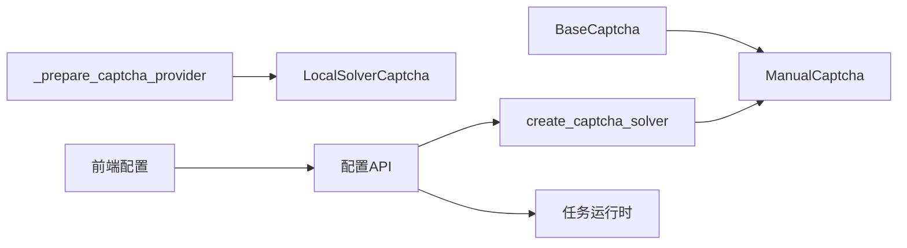

# 手动验证码解决器

<cite>
**本文引用的文件**
- [providers/captcha/manual.py](file://providers/captcha/manual.py)
- [core/base_captcha.py](file://core/base_captcha.py)
- [core/base_platform.py](file://core/base_platform.py)
- [services/turnstile_solver/api_solver.py](file://services/turnstile_solver/api_solver.py)
- [application/config.py](file://application/config.py)
- [application/provider_settings.py](file://application/provider_settings.py)
- [infrastructure/provider_settings_repository.py](file://infrastructure/provider_settings_repository.py)
- [frontend/src/pages/Register.tsx](file://frontend/src/pages/Register.tsx)
- [frontend/src/lib/config-options.ts](file://frontend/src/lib/config-options.ts)
- [domain/tasks.py](file://domain/tasks.py)
- [application/tasks.py](file://application/tasks.py)
- [services/task_runtime.py](file://services/task_runtime.py)
- [README.md](file://README.md)
</cite>

## 目录
1. [简介](#简介)
2. [项目结构](#项目结构)
3. [核心组件](#核心组件)
4. [架构总览](#架构总览)
5. [详细组件分析](#详细组件分析)
6. [依赖关系分析](#依赖关系分析)
7. [性能与可用性](#性能与可用性)
8. [故障排查指南](#故障排查指南)
9. [结论](#结论)
10. [附录：使用示例与最佳实践](#附录使用示例与最佳实践)

## 简介
本文件面向“手动验证码解决器”的使用与集成，围绕以下目标展开：
- 工作机制：验证码展示、人工输入接口、状态管理。
- 使用场景：复杂验证码、AI无法识别、质量验证环节。
- 配置与集成：界面集成、回调处理、异步任务管理。
- 使用示例：验证码显示、用户输入处理、结果返回流程。
- 优势与局限：准确性高但效率低、适合小规模应用。
- 用户体验优化：界面设计、操作引导、错误提示。
- 与自动化流程集成：人机协作模式、任务调度策略、状态同步机制。

## 项目结构
本项目将“验证码解决器”抽象为可插拔的 Provider，并通过统一的基类与工厂方法创建实例。手动解决器作为其中一种实现，采用阻塞式交互等待人工输入。注册流程在需要验证码时通过平台能力与适配器构造并注入解决器实例；前端提供配置与执行入口，后端负责任务调度与状态流转。

图表来源
- [core/base_captcha.py:67-97](file://core/base_captcha.py#L67-L97)
- [providers/captcha/manual.py:6-18](file://providers/captcha/manual.py#L6-L18)
- [services/turnstile_solver/api_solver.py:516-614](file://services/turnstile_solver/api_solver.py#L516-L614)
- [application/config.py:23-37](file://application/config.py#L23-L37)
- [services/task_runtime.py:18-101](file://services/task_runtime.py#L18-L101)
- [domain/tasks.py:8-44](file://domain/tasks.py#L8-L44)

章节来源
- [core/base_captcha.py:67-97](file://core/base_captcha.py#L67-L97)
- [providers/captcha/manual.py:6-18](file://providers/captcha/manual.py#L6-L18)
- [application/config.py:23-37](file://application/config.py#L23-L37)
- [services/task_runtime.py:18-101](file://services/task_runtime.py#L18-L101)
- [domain/tasks.py:8-44](file://domain/tasks.py#L8-L44)

## 核心组件
- 验证码基类与工厂
  - 定义统一接口 solve_turnstile 与 solve_image，并提供 create_captcha_solver 工厂方法用于按 provider_key 创建具体实现。
  - 对 manual 类型直接返回 ManualCaptcha 实例；同时提供 has_captcha_configured 判断是否已配置（manual 视为已配置）。
- 手动解决器实现
  - 通过标准输入阻塞等待用户输入 Turnstile token 或图片验证码文字，并返回字符串结果。
- 平台侧集成
  - 平台在准备阶段会收集可用的验证码 provider 列表，并在需要时调用 _prepare_captcha_provider 启动本地 solver 服务（当 driver_type 为 local_solver）。
- 前端配置与执行
  - 注册页提供验证码策略选择与执行按钮；设置页展示当前验证码策略与可用 provider。
- 任务运行时
  - 后台线程循环拉取可执行任务，分配工作线程执行，维护并发度与每平台并行限制，并将任务事件持久化供前端流式读取。

章节来源
- [core/base_captcha.py:5-14](file://core/base_captcha.py#L5-L14)
- [core/base_captcha.py:48-97](file://core/base_captcha.py#L48-L97)
- [providers/captcha/manual.py:6-18](file://providers/captcha/manual.py#L6-L18)
- [core/base_platform.py:372-410](file://core/base_platform.py#L372-L410)
- [frontend/src/pages/Register.tsx:14-29](file://frontend/src/pages/Register.tsx#L14-L29)
- [services/task_runtime.py:18-101](file://services/task_runtime.py#L18-L101)

## 架构总览
下图展示了从前端触发到验证码解决的端到端流程，包括手动模式与本地自动模式的对比路径。

图表来源
- [core/base_captcha.py:67-97](file://core/base_captcha.py#L67-L97)
- [providers/captcha/manual.py:14-18](file://providers/captcha/manual.py#L14-L18)
- [services/turnstile_solver/api_solver.py:516-614](file://services/turnstile_solver/api_solver.py#L516-L614)
- [services/task_runtime.py:47-101](file://services/task_runtime.py#L47-L101)
- [frontend/src/pages/Register.tsx:510-524](file://frontend/src/pages/Register.tsx#L510-L524)

## 详细组件分析

### 手动验证码解决器（ManualCaptcha）
- 职责
  - 提供 solve_turnstile 与 solve_image 两个方法，分别用于获取 Turnstile token 和图片验证码文字。
  - 通过标准输入阻塞等待用户输入，适用于调试、质量验证或小规模场景。
- 关键行为
  - 打印包含 page_url 的提示信息，等待用户输入后返回 token。
  - 对图片验证码以 base64 形式接收，提示用户输入对应文字。
- 适用性
  - 无需外部服务，零依赖；但会阻塞执行线程，不适合高并发。

图表来源
- [providers/captcha/manual.py:14-18](file://providers/captcha/manual.py#L14-L18)

章节来源
- [providers/captcha/manual.py:6-18](file://providers/captcha/manual.py#L6-L18)

### 验证码工厂与配置
- 工厂方法
  - create_captcha_solver 根据 provider_key 创建具体实现；当 key 为 manual 时直接返回 ManualCaptcha。
- 配置检查
  - has_captcha_configured 对 manual 类型直接返回 True，表示无需额外鉴权字段即可启用。
- 策略聚合
  - 平台侧收集候选 provider 时会跳过 manual，避免将其混入自动回退链；但可通过显式配置选择 manual。
  - 配置选项服务暴露 captcha_providers、captcha_drivers、captcha_policy 等，供前端渲染策略选择。

图表来源
- [core/base_captcha.py:5-14](file://core/base_captcha.py#L5-L14)
- [core/base_captcha.py:48-97](file://core/base_captcha.py#L48-L97)
- [providers/captcha/manual.py:6-18](file://providers/captcha/manual.py#L6-L18)

章节来源
- [core/base_captcha.py:48-97](file://core/base_captcha.py#L48-L97)
- [application/config.py:23-37](file://application/config.py#L23-L37)
- [application/provider_settings.py:45-52](file://application/provider_settings.py#L45-L52)
- [infrastructure/provider_settings_repository.py:67-79](file://infrastructure/provider_settings_repository.py#L67-L79)

### 前端集成与任务执行
- 注册页
  - 表单默认包含验证码策略字段；提交后触发任务创建与轮询。
  - 展示执行摘要（Executor、Verification），以及任务状态与进度。
- 设置页
  - 展示当前验证码策略与可用 provider 列表，支持查看策略说明与注意事项。
- 任务状态
  - 前端基于任务状态集合与文本映射展示运行态、完成态与失败态。

图表来源
- [frontend/src/pages/Register.tsx:14-29](file://frontend/src/pages/Register.tsx#L14-L29)
- [frontend/src/pages/Register.tsx:510-524](file://frontend/src/pages/Register.tsx#L510-L524)
- [application/config.py:23-37](file://application/config.py#L23-L37)
- [services/task_runtime.py:47-101](file://services/task_runtime.py#L47-L101)

章节来源
- [frontend/src/pages/Register.tsx:14-29](file://frontend/src/pages/Register.tsx#L14-L29)
- [frontend/src/pages/Register.tsx:510-524](file://frontend/src/pages/Register.tsx#L510-L524)
- [frontend/src/lib/config-options.ts:44-87](file://frontend/src/lib/config-options.ts#L44-L87)
- [domain/tasks.py:8-44](file://domain/tasks.py#L8-L44)

### 与本地自动 Solver 的协作
- 当选择 local_solver 时，平台会在准备阶段尝试启动本地 solver 服务，随后通过 HTTP 接口提交任务并轮询结果。
- 手动模式与本地自动模式可并存：手动用于兜底或质量验证，自动用于批量与高吞吐场景。

图表来源
- [core/base_platform.py:396-410](file://core/base_platform.py#L396-L410)
- [services/turnstile_solver/api_solver.py:516-614](file://services/turnstile_solver/api_solver.py#L516-L614)

章节来源
- [core/base_platform.py:396-410](file://core/base_platform.py#L396-L410)
- [services/turnstile_solver/api_solver.py:516-614](file://services/turnstile_solver/api_solver.py#L516-L614)

## 依赖关系分析
- 模块耦合
  - 手动解决器仅依赖基类接口，无外部网络依赖，耦合度低。
  - 工厂与平台侧通过 provider_key 解耦，便于扩展新的验证码实现。
- 外部依赖
  - 本地自动模式依赖 HTTP 服务与健康检查；手动模式不依赖外部服务。
- 潜在风险
  - 手动模式阻塞主执行线程，不适合高并发；需配合任务队列与限流策略。
  - 本地 solver 启动失败会影响自动模式，但不影响手动模式。

图表来源
- [core/base_captcha.py:67-97](file://core/base_captcha.py#L67-L97)
- [core/base_platform.py:396-410](file://core/base_platform.py#L396-L410)
- [application/config.py:23-37](file://application/config.py#L23-L37)
- [services/task_runtime.py:47-101](file://services/task_runtime.py#L47-L101)

章节来源
- [core/base_captcha.py:67-97](file://core/base_captcha.py#L67-L97)
- [core/base_platform.py:396-410](file://core/base_platform.py#L396-L410)
- [application/config.py:23-37](file://application/config.py#L23-L37)
- [services/task_runtime.py:47-101](file://services/task_runtime.py#L47-L101)

## 性能与可用性
- 手动模式
  - 优点：零依赖、准确率高、适合复杂验证码与质量验证。
  - 缺点：阻塞交互、吞吐低、不适合大规模自动化。
- 本地自动模式
  - 优点：非阻塞、可批量、适合高吞吐。
  - 缺点：依赖浏览器与环境初始化，存在启动超时风险。
- 建议
  - 小规模或测试环境优先手动模式；生产环境结合自动模式与远程服务。
  - 合理设置任务并发与每平台并行度，避免资源争用。

[本节为通用指导，不直接分析具体文件]

## 故障排查指南
- 常见问题
  - 验证码失败：确认 provider 已正确配置；协议模式优先远程服务；浏览器模式 Camoufox 会先尝试自动点击，失败回退远程 Solver；检查代理 IP 质量。
  - Solver 启动超时：首次启动可能需下载/初始化浏览器依赖；检查端口占用与环境依赖；如不依赖本地 Solver，可切换至 YesCaptcha 或 2Captcha。
- 定位步骤
  - 查看任务事件与错误信息，确认卡在验证码阶段。
  - 若使用手动模式，确认控制台提示与用户输入是否正常。
  - 若使用本地自动模式，检查健康检查与服务日志。

章节来源
- [README.md:388-434](file://README.md#L388-L434)

## 结论
手动验证码解决器提供了简单可靠的兜底方案，尤其适用于复杂验证码与质量验证环节。其零依赖与高准确率的优势使其在小规模应用中表现良好。对于大规模自动化，建议结合本地或远程自动 Solver，并通过任务调度与并发控制提升整体吞吐。

[本节为总结性内容，不直接分析具体文件]

## 附录：使用示例与最佳实践

### 使用场景
- 复杂验证码：当 AI 无法识别或成功率低时，切换到手动模式进行兜底。
- 质量验证：在新平台或新策略上线前，使用手动模式验证流程稳定性。
- 小规模应用：开发测试或低频任务，手动模式足够且易于调试。

### 配置与集成
- 前端集成
  - 在注册页中确保验证码策略字段可见并可编辑；提交任务时携带所选策略。
  - 在设置页展示当前策略与可用 provider，便于运维调整。
- 回调处理
  - 手动模式下，控制台会提示输入 token；确保执行环境具备标准输入能力。
- 异步任务管理
  - 使用任务运行时统一管理任务生命周期；通过事件流实时反馈进度与状态。

章节来源
- [frontend/src/pages/Register.tsx:14-29](file://frontend/src/pages/Register.tsx#L14-L29)
- [frontend/src/pages/Register.tsx:510-524](file://frontend/src/pages/Register.tsx#L510-L524)
- [application/config.py:23-37](file://application/config.py#L23-L37)
- [services/task_runtime.py:47-101](file://services/task_runtime.py#L47-L101)

### 人机协作模式
- 策略编排
  - 优先自动模式，失败或检测为复杂验证码时回退手动模式。
- 任务调度
  - 限制每平台并行度，避免同一账号或 IP 频繁触发风控。
- 状态同步
  - 通过任务事件流向用户展示进度与结果，必要时提示人工介入。

章节来源
- [core/base_platform.py:372-410](file://core/base_platform.py#L372-L410)
- [infrastructure/provider_settings_repository.py:67-79](file://infrastructure/provider_settings_repository.py#L67-L79)
- [domain/tasks.py:8-44](file://domain/tasks.py#L8-L44)

### 用户体验优化建议
- 界面设计
  - 清晰展示当前验证码策略与执行摘要；提供一键切换策略的能力。
- 操作引导
  - 在手动模式下提供明确的操作提示与帮助链接；在自动模式下提供健康检查与重试指引。
- 错误提示
  - 对常见错误给出可操作的修复建议；对超时与失败提供重试与降级策略。

[本节为通用指导，不直接分析具体文件]