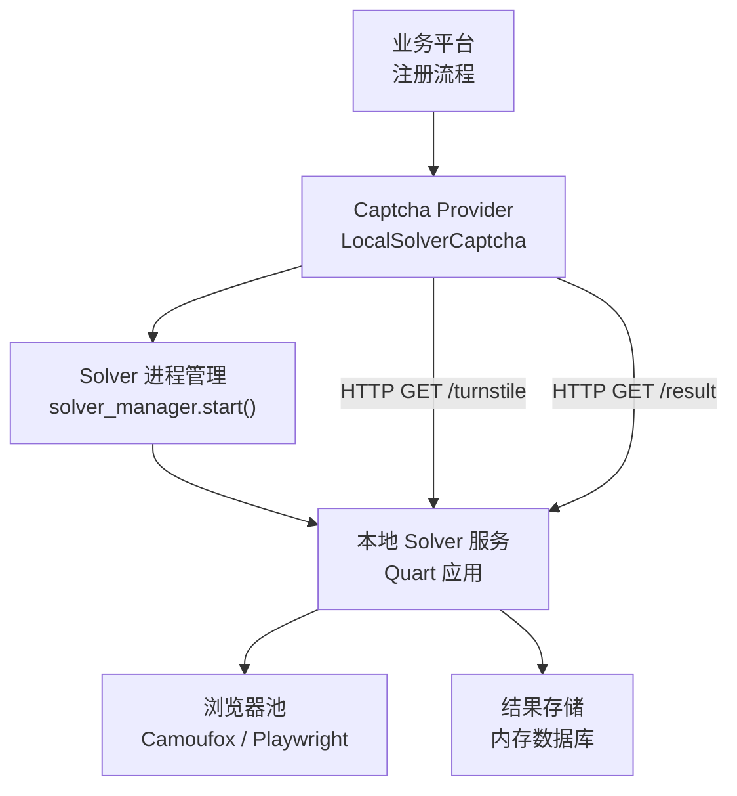
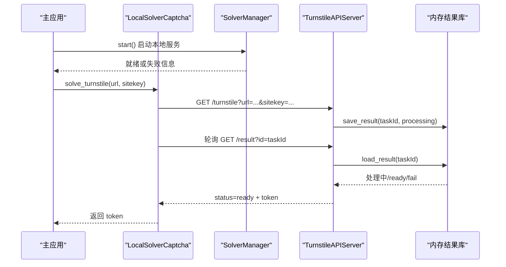
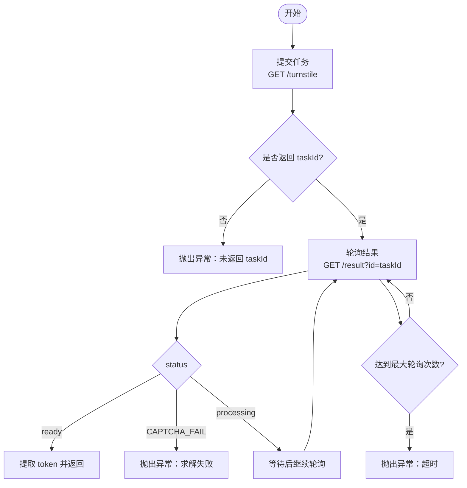
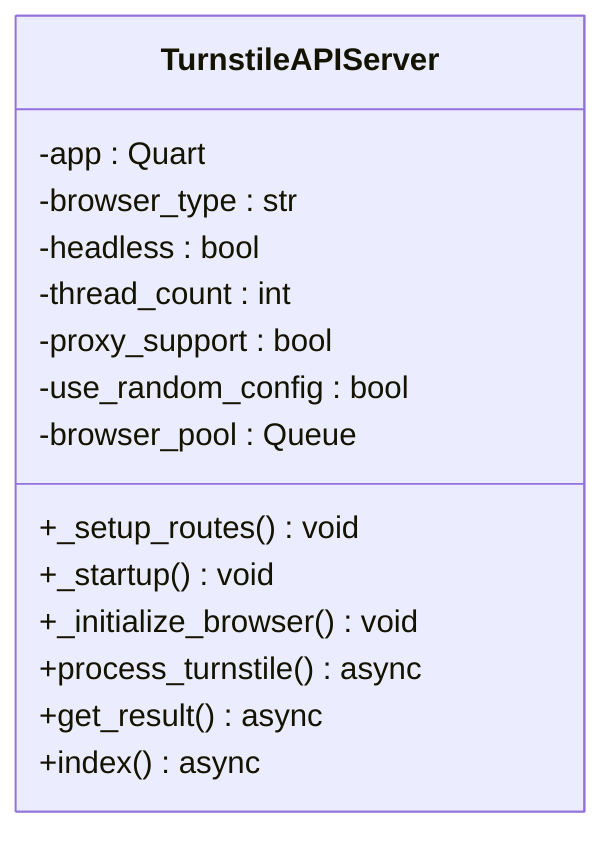
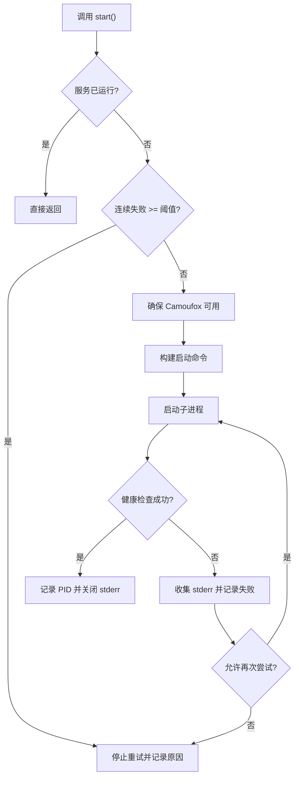
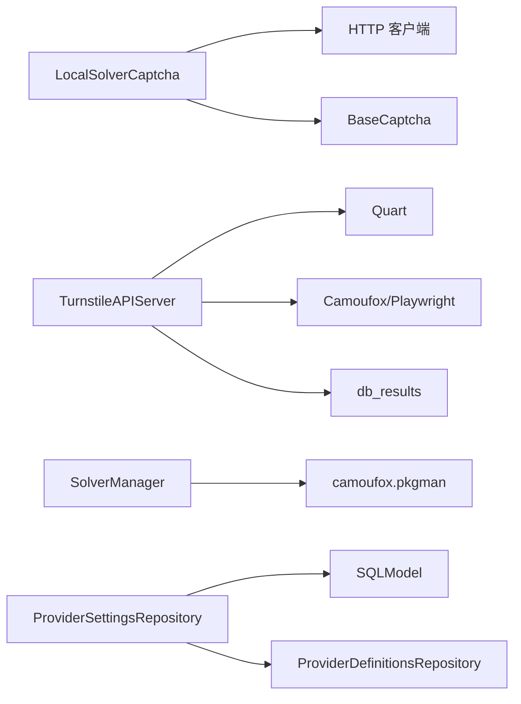

# 本地验证码解决器

<cite>
**本文引用的文件**
- [providers/captcha/local_solver.py](file://providers/captcha/local_solver.py)
- [core/base_captcha.py](file://core/base_captcha.py)
- [services/turnstile_solver/start.py](file://services/turnstile_solver/start.py)
- [services/turnstile_solver/api_solver.py](file://services/turnstile_solver/api_solver.py)
- [services/turnstile_solver/db_results.py](file://services/turnstile_solver/db_results.py)
- [services/solver_manager.py](file://services/solver_manager.py)
- [infrastructure/provider_settings_repository.py](file://infrastructure/provider_settings_repository.py)
- [platforms/chatgpt/constants.py](file://platforms/chatgpt/constants.py)
- [README_en.md](file://README_en.md)
</cite>

## 目录
1. [简介](#简介)
2. [项目结构](#项目结构)
3. [核心组件](#核心组件)
4. [架构总览](#架构总览)
5. [详细组件分析](#详细组件分析)
6. [依赖关系分析](#依赖关系分析)
7. [性能与优化](#性能与优化)
8. [故障诊断与调试](#故障诊断与调试)
9. [结论](#结论)
10. [附录：配置与集成示例](#附录：配置与集成示例)

## 简介
本技术文档围绕“本地验证码解决器”展开，聚焦 Turnstile 类型验证码的本地化解决方案。该方案通过独立进程提供 HTTP API，由主应用以 Provider 方式调用，实现与云端服务解耦的本地处理能力。其优势在于离线可用、数据不出本机、成本可控，并可通过浏览器池与并发控制提升吞吐。

## 项目结构
本地验证码解决器涉及以下关键模块：
- 客户端侧 Provider：封装对本地 solver 服务的 HTTP 调用与轮询逻辑
- 服务端侧 Solver：基于 Quart 的异步 Web 服务，管理浏览器实例与任务结果存储
- 进程管理器：负责启动、健康检查、重启与资源清理
- 配置与发现：Provider 定义与运行时设置解析，自动选择与启用本地 solver

图表来源
- [providers/captcha/local_solver.py:17-49](file://providers/captcha/local_solver.py#L17-L49)
- [services/turnstile_solver/start.py:15-28](file://services/turnstile_solver/start.py#L15-L28)
- [services/turnstile_solver/api_solver.py:135-140](file://services/turnstile_solver/api_solver.py#L135-L140)
- [services/solver_manager.py:73-155](file://services/solver_manager.py#L73-L155)

章节来源
- [providers/captcha/local_solver.py:1-80](file://providers/captcha/local_solver.py#L1-L80)
- [services/turnstile_solver/start.py:1-33](file://services/turnstile_solver/start.py#L1-L33)
- [services/turnstile_solver/api_solver.py:1-200](file://services/turnstile_solver/api_solver.py#L1-L200)
- [services/solver_manager.py:1-229](file://services/solver_manager.py#L1-L229)
- [infrastructure/provider_settings_repository.py:39-79](file://infrastructure/provider_settings_repository.py#L39-L79)

## 核心组件
- LocalSolverCaptcha：本地验证码 Provider，封装提交任务与轮询结果的 HTTP 调用
- TurnstileAPIServer：本地 Solver 服务，提供 /turnstile 与 /result 接口，管理浏览器与任务状态
- SolverManager：进程级管理，负责启动、健康检查、失败保护与重启
- ProviderSettingsRepository：运行时设置解析，支持默认值、覆盖与启用顺序

章节来源
- [providers/captcha/local_solver.py:6-52](file://providers/captcha/local_solver.py#L6-L52)
- [services/turnstile_solver/api_solver.py:62-140](file://services/turnstile_solver/api_solver.py#L62-L140)
- [services/solver_manager.py:21-155](file://services/solver_manager.py#L21-L155)
- [infrastructure/provider_settings_repository.py:39-79](file://infrastructure/provider_settings_repository.py#L39-L79)

## 架构总览
本地解决器采用“进程外服务 + 进程内 Provider”的架构：
- 主进程通过 Provider 发起请求到本地 Solver 服务
- Solver 服务使用 Camoufox/Playwright 驱动浏览器完成 Turnstile 验证
- 任务结果暂存于内存数据库，供轮询获取
- 进程管理器确保服务可用性，具备失败保护与自动恢复能力

图表来源
- [services/solver_manager.py:73-155](file://services/solver_manager.py#L73-L155)
- [providers/captcha/local_solver.py:17-49](file://providers/captcha/local_solver.py#L17-L49)
- [services/turnstile_solver/api_solver.py:991-1033](file://services/turnstile_solver/api_solver.py#L991-L1033)
- [services/turnstile_solver/db_results.py:10-16](file://services/turnstile_solver/db_results.py#L10-L16)

## 详细组件分析

### LocalSolverCaptcha（本地 Provider）
职责
- 将 Turnstile 求解任务提交至本地 Solver 服务
- 轮询结果直至 ready 或失败，超时抛出异常
- 暴露 from_config 与 start_solver 辅助方法

关键点
- 提交接口：/turnstile，参数 url、sitekey
- 轮询接口：/result，参数 id
- 错误处理：errorId 非零时抛出异常；status=CAPTCHA_FAIL 直接失败；轮询次数上限避免无限等待

图表来源
- [providers/captcha/local_solver.py:17-49](file://providers/captcha/local_solver.py#L17-L49)

章节来源
- [providers/captcha/local_solver.py:6-52](file://providers/captcha/local_solver.py#L6-L52)

### TurnstileAPIServer（本地 Solver 服务）
职责
- 提供 /turnstile 与 /result 接口
- 初始化浏览器池（Camoufox/Playwright），按线程数创建页面
- 维护任务结果（内存数据库），支持周期性清理

关键点
- 路由注册：/turnstile、/result、/
- 启动钩子：before_serving 初始化数据库与浏览器池
- 结果处理：根据 value/status 返回 ready/processing/fail

图表来源
- [services/turnstile_solver/api_solver.py:62-140](file://services/turnstile_solver/api_solver.py#L62-L140)
- [services/turnstile_solver/api_solver.py:991-1033](file://services/turnstile_solver/api_solver.py#L991-L1033)

章节来源
- [services/turnstile_solver/api_solver.py:1-200](file://services/turnstile_solver/api_solver.py#L1-L200)
- [services/turnstile_solver/api_solver.py:991-1051](file://services/turnstile_solver/api_solver.py#L991-L1051)

### SolverManager（进程管理）
职责
- 检测本地服务是否运行
- 启动前确保 Camoufox 二进制可用（必要时下载）
- 启动子进程并等待就绪，捕获 stderr 用于诊断
- 提供 stop/restart 与失败保护（连续失败计数）

关键点
- is_running：通过健康检查判断服务状态
- start：构建命令、启动子进程、等待端口可访问
- stop：终止子进程或按端口查找并杀掉残留进程
- restart：重置失败计数并重启

图表来源
- [services/solver_manager.py:21-155](file://services/solver_manager.py#L21-L155)

章节来源
- [services/solver_manager.py:1-229](file://services/solver_manager.py#L1-L229)

### ProviderSettingsRepository（配置与发现）
职责
- 合并定义默认值、持久化配置与运行时覆盖
- 列出启用的 captcha provider，排除 manual/local_solver
- 提供 get_default_provider_key 等工具方法

关键点
- resolve_runtime_settings：按字段定义注入默认值，再叠加持久化与覆盖
- list_enabled：按 enabled 排序，优先非默认项
- get_enabled_captcha_order：过滤掉 manual 与 local_solver，便于后续策略

章节来源
- [infrastructure/provider_settings_repository.py:39-79](file://infrastructure/provider_settings_repository.py#L39-L79)

## 依赖关系分析
- LocalSolverCaptcha 依赖 requests 进行 HTTP 调用，依赖 BaseCaptcha 抽象
- TurnstileAPIServer 依赖 Quart、Camoufox/Playwright、rich 日志与内存结果库
- SolverManager 依赖 camoufox.pkgman 进行浏览器安装检测与下载
- ProviderSettingsRepository 依赖 SQLModel 与 ProviderDefinitionsRepository

图表来源
- [providers/captcha/local_solver.py:1-80](file://providers/captcha/local_solver.py#L1-L80)
- [services/turnstile_solver/api_solver.py:1-200](file://services/turnstile_solver/api_solver.py#L1-L200)
- [services/solver_manager.py:41-70](file://services/solver_manager.py#L41-L70)
- [infrastructure/provider_settings_repository.py:15-55](file://infrastructure/provider_settings_repository.py#L15-L55)

章节来源
- [providers/captcha/local_solver.py:1-80](file://providers/captcha/local_solver.py#L1-L80)
- [services/turnstile_solver/api_solver.py:1-200](file://services/turnstile_solver/api_solver.py#L1-L200)
- [services/solver_manager.py:1-229](file://services/solver_manager.py#L1-L229)
- [infrastructure/provider_settings_repository.py:1-167](file://infrastructure/provider_settings_repository.py#L1-L167)

## 性能与优化
- 模型缓存：本地方案无需加载外部 OCR 模型，依赖浏览器引擎与站点交互，减少网络与模型 IO 开销
- 批处理优化：当前实现为单任务轮询模式；可在 Provider 层引入队列与并发限制，结合 Solver 的 thread_count 调整整体吞吐
- GPU 加速：Turnstile 验证主要依赖浏览器渲染与 JS 执行，GPU 作用有限；建议优先优化浏览器池大小与并发度
- 内存管理：结果存储为内存字典，需定期清理旧结果以避免内存增长
- 并发控制：SolverManager 默认 thread=1；可根据机器资源调大，但需注意浏览器资源占用与目标站点反爬策略

章节来源
- [services/turnstile_solver/db_results.py:18-27](file://services/turnstile_solver/db_results.py#L18-L27)
- [services/turnstile_solver/start.py:15-28](file://services/turnstile_solver/start.py#L15-L28)
- [services/solver_manager.py:94-108](file://services/solver_manager.py#L94-L108)

## 故障诊断与调试
常见问题与定位技巧
- 启动超时：本地服务在 30 秒内未完成健康检查，常见原因为首次下载 Camoufox、端口占用或缺少依赖
- 连续失败保护：连续多次启动失败会停止重试，需手动排查并重启
- 结果轮询失败：/result 返回 errorId 非零或 status=CAPTCHA_FAIL，检查浏览器环境、代理与站点风控
- 日志与监控：Solver 使用自定义日志类输出彩色结构化日志；主进程记录子进程 stderr 片段用于定位

实用步骤
- 确认端口 8889 未被占用且服务可访问
- 查看 Solver 子进程 stderr 输出，定位启动异常
- 检查 Camoufox 二进制是否已安装或下载成功
- 调整 thread_count 与并发度，观察成功率与资源占用变化

章节来源
- [services/solver_manager.py:115-155](file://services/solver_manager.py#L115-L155)
- [services/turnstile_solver/api_solver.py:33-59](file://services/turnstile_solver/api_solver.py#L33-L59)
- [README_en.md:402-410](file://README_en.md#L402-L410)

## 结论
本地验证码解决器通过进程外服务与浏览器自动化，实现了 Turnstile 的本地化处理，具备离线可用、隐私安全与成本可控的优势。配合进程管理与配置解析，系统具备良好的健壮性与可扩展性。在生产环境中，应合理配置并发与资源限制，并结合日志与监控持续优化稳定性与性能。

## 附录：配置与集成示例
- 配置本地 solver
  - 在 Provider 定义中将 driver_type 设置为 local_solver
  - 运行时设置中提供 solver_url（通常为 http://localhost:8889）
  - 使用 create_captcha_solver 或平台自动选择机制启用本地 solver

- 启动与服务管理
  - 通过 solver_manager.start() 自动拉起本地服务
  - 使用 solver_status/restart 接口查询状态与重启
  - 若需要手动启动，可直接运行 services/turnstile_solver/start.py

- 集成到平台注册流程
  - 平台在遇到 Turnstile 时调用 captcha.solve_turnstile(url, sitekey)
  - 若失败，可回退到远程服务（如 YesCaptcha/2Captcha）或人工处理

- 最佳实践
  - 内存管理：定期清理旧结果，避免内存泄漏
  - 并发控制：根据机器 CPU/内存与目标站点风控调整 thread_count 与并发
  - 错误处理：捕获超时与失败异常，记录上下文并触发告警
  - 日志记录：开启详细日志，保留 stderr 片段以便问题回溯

章节来源
- [core/base_captcha.py:67-97](file://core/base_captcha.py#L67-L97)
- [services/solver_manager.py:21-155](file://services/solver_manager.py#L21-L155)
- [application/system.py:6-14](file://application/system.py#L6-L14)
- [platforms/chatgpt/constants.py:256-281](file://platforms/chatgpt/constants.py#L256-L281)