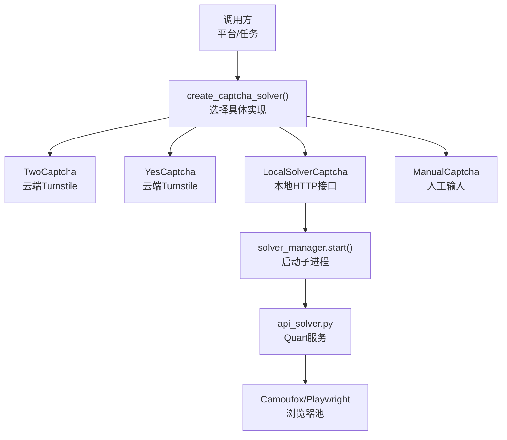
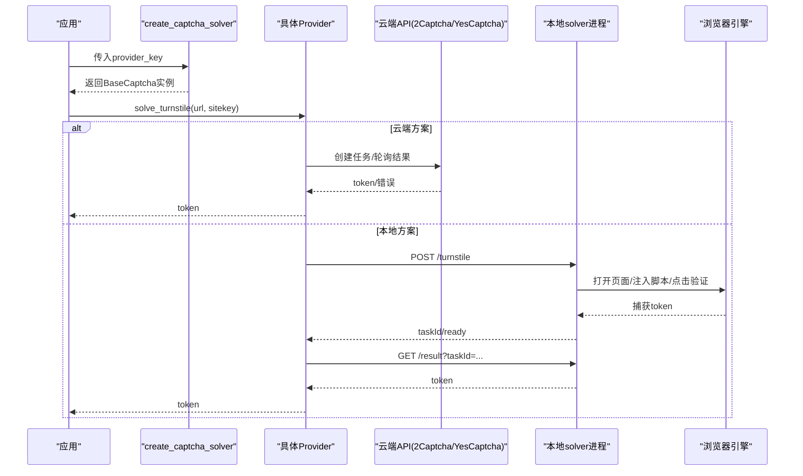
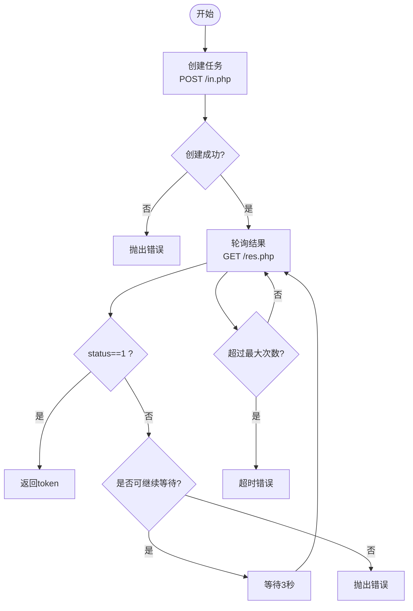
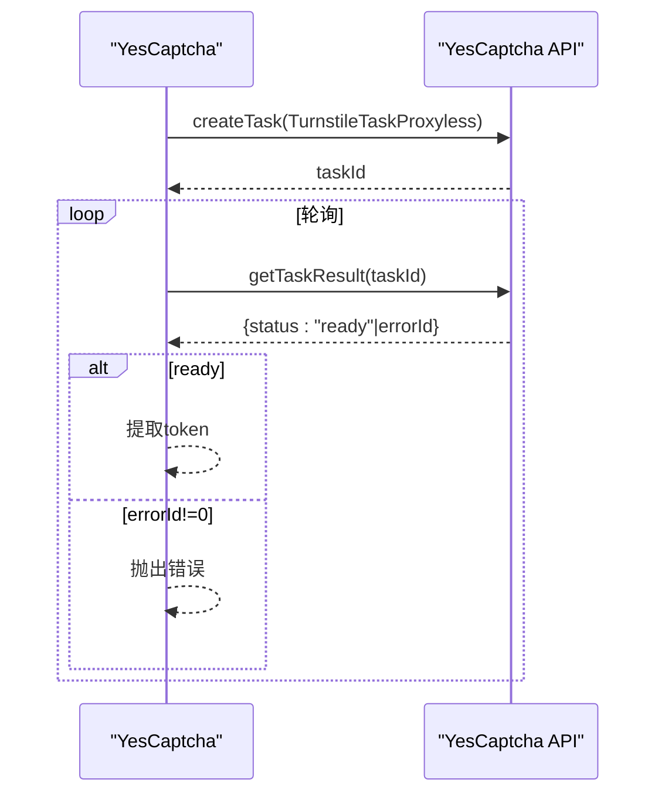
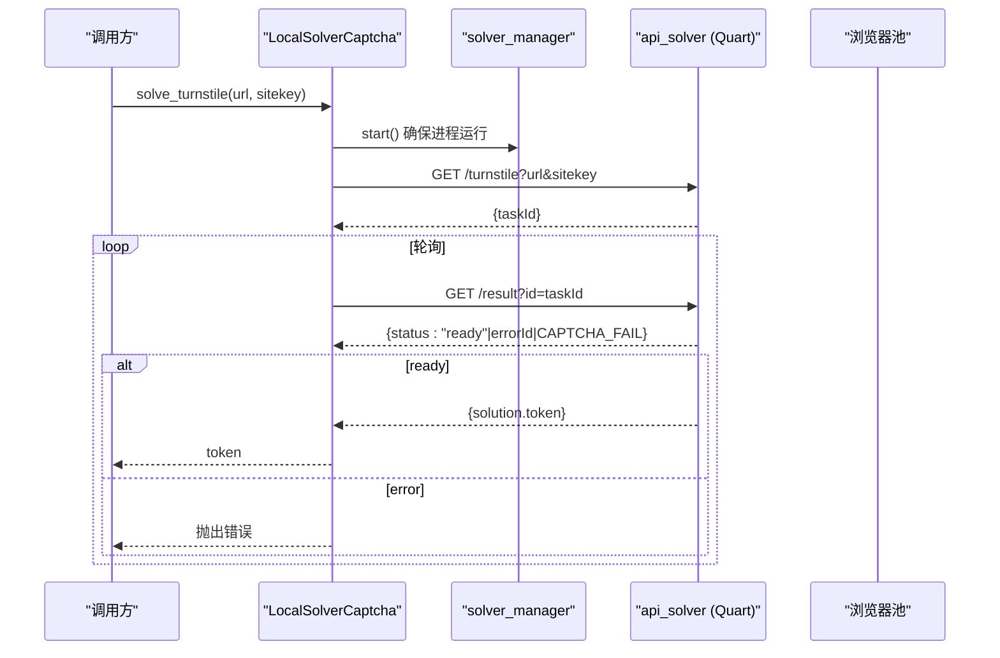
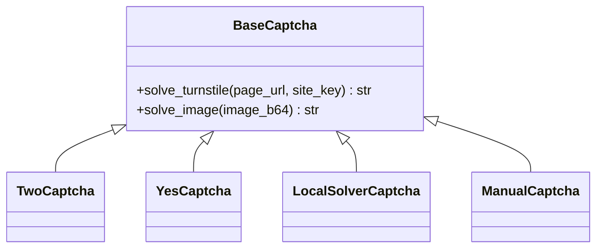

# 验证码解决服务集成

<cite>
**本文引用的文件**
- [core/base_captcha.py](file://core/base_captcha.py)
- [providers/captcha/twocaptcha.py](file://providers/captcha/twocaptcha.py)
- [providers/captcha/yescaptcha.py](file://providers/captcha/yescaptcha.py)
- [providers/captcha/local_solver.py](file://providers/captcha/local_solver.py)
- [providers/captcha/manual.py](file://providers/captcha/manual.py)
- [services/solver_manager.py](file://services/solver_manager.py)
- [services/turnstile_solver/api_solver.py](file://services/turnstile_solver/api_solver.py)
- [providers/registry.py](file://providers/registry.py)
- [infrastructure/provider_settings_repository.py](file://infrastructure/provider_settings_repository.py)
- [application/provider_settings.py](file://application/provider_settings.py)
</cite>

## 目录
1. [简介](#简介)
2. [项目结构](#项目结构)
3. [核心组件](#核心组件)
4. [架构总览](#架构总览)
5. [详细组件分析](#详细组件分析)
6. [依赖关系分析](#依赖关系分析)
7. [性能与并发](#性能与并发)
8. [错误处理与重试](#错误处理与重试)
9. [配置管理](#配置管理)
10. [集成示例与最佳实践](#集成示例与最佳实践)
11. [故障排查指南](#故障排查指南)
12. [结论](#结论)

## 简介
本文件系统性介绍验证码解决服务的集成实现，覆盖 2Captcha、YesCaptcha、本地解决器（Local Solver）以及手动解决等方案。重点说明：
- 图片上传与结果获取流程（针对 Turnstile 的 token 获取）
- 识别流程：页面加载、元素定位、脚本注入、token 捕获
- 重试机制与错误处理：网络异常、服务限流、识别失败
- 配置管理：API 密钥、代理设置、超时配置
- 并发控制、成本优化与准确率提升的最佳实践

## 项目结构
验证码能力以“抽象基类 + 多实现”的方式组织，统一通过注册表发现并创建实例；本地 solver 作为独立进程提供 HTTP API，由管理器负责生命周期管理。

图表来源
- [core/base_captcha.py:67-97](file://core/base_captcha.py#L67-L97)
- [providers/captcha/twocaptcha.py:19-60](file://providers/captcha/twocaptcha.py#L19-L60)
- [providers/captcha/yescaptcha.py:20-39](file://providers/captcha/yescaptcha.py#L20-L39)
- [providers/captcha/local_solver.py:17-49](file://providers/captcha/local_solver.py#L17-L49)
- [services/solver_manager.py:73-155](file://services/solver_manager.py#L73-L155)
- [services/turnstile_solver/api_solver.py:135-156](file://services/turnstile_solver/api_solver.py#L135-L156)

章节来源
- [core/base_captcha.py:67-97](file://core/base_captcha.py#L67-L97)
- [providers/registry.py:70-90](file://providers/registry.py#L70-L90)

## 核心组件
- BaseCaptcha：定义 solve_turnstile(page_url, site_key) -> str 的统一接口，所有实现均遵循该契约。
- TwoCaptcha：通过 2Captcha 云 API 提交 Turnstile 任务并轮询结果。
- YesCaptcha：通过 YesCaptcha 云 API 提交 Turnstile 任务并轮询结果。
- LocalSolverCaptcha：调用本地 api_solver 服务（HTTP），内部使用 Camoufox/Playwright 驱动浏览器完成 Turnstile。
- ManualCaptcha：阻塞等待用户从控制台输入 token。
- solver_manager：负责本地 solver 进程的启动、健康检查、停止与重启，含连续失败保护。
- api_solver：Quart 服务，暴露 /turnstile 与 /result 接口，维护浏览器池，执行识别逻辑。

章节来源
- [core/base_captcha.py:5-14](file://core/base_captcha.py#L5-L14)
- [providers/captcha/twocaptcha.py:1-64](file://providers/captcha/twocaptcha.py#L1-L64)
- [providers/captcha/yescaptcha.py:1-43](file://providers/captcha/yescaptcha.py#L1-L43)
- [providers/captcha/local_solver.py:1-80](file://providers/captcha/local_solver.py#L1-L80)
- [providers/captcha/manual.py:1-19](file://providers/captcha/manual.py#L1-L19)
- [services/solver_manager.py:1-229](file://services/solver_manager.py#L1-L229)
- [services/turnstile_solver/api_solver.py:135-156](file://services/turnstile_solver/api_solver.py#L135-L156)

## 架构总览
整体采用“工厂创建 + 异步后端服务”的解耦设计：
- 上层通过 create_captcha_solver 按 provider_key 获取具体实现
- 云端方案直接 HTTP 轮询第三方 API
- 本地方案通过 HTTP 与 solver 子进程通信，后者用浏览器自动化完成识别
- 统一错误类型：TimeoutError、RuntimeError，便于上层重试或降级

图表来源
- [core/base_captcha.py:67-97](file://core/base_captcha.py#L67-L97)
- [providers/captcha/twocaptcha.py:19-60](file://providers/captcha/twocaptcha.py#L19-L60)
- [providers/captcha/yescaptcha.py:20-39](file://providers/captcha/yescaptcha.py#L20-L39)
- [providers/captcha/local_solver.py:17-49](file://providers/captcha/local_solver.py#L17-L49)
- [services/turnstile_solver/api_solver.py:950-1033](file://services/turnstile_solver/api_solver.py#L950-L1033)

## 详细组件分析

### TwoCaptcha 集成
- 任务创建：POST 到 /in.php，method=turnstile，携带 sitekey、pageurl
- 结果轮询：GET /res.php?action=get&id=...，直到 status=1 或错误码
- 超时策略：最多轮询约 180 秒（60次×3秒），抛出 TimeoutError
- 错误处理：非预期状态直接抛 RuntimeError

图表来源
- [providers/captcha/twocaptcha.py:19-60](file://providers/captcha/twocaptcha.py#L19-L60)

章节来源
- [providers/captcha/twocaptcha.py:19-60](file://providers/captcha/twocaptcha.py#L19-L60)

### YesCaptcha 集成
- 任务创建：POST /createTask，task.type=TurnstileTaskProxyless
- 结果查询：POST /getTaskResult，直到 status=ready
- 超时策略：最多轮询约 180 秒，抛出 TimeoutError
- 错误处理：errorId!=0 时抛出 RuntimeError

图表来源
- [providers/captcha/yescaptcha.py:20-39](file://providers/captcha/yescaptcha.py#L20-L39)

章节来源
- [providers/captcha/yescaptcha.py:20-39](file://providers/captcha/yescaptcha.py#L20-L39)

### 本地解决器（Local Solver）
- 启动方式：通过 solver_manager.start() 拉起子进程，自动检测/下载 Camoufox 浏览器
- HTTP 接口：/turnstile 提交任务，/result 查询结果
- 识别流程：
  - 从浏览器池取一个上下文（支持代理、UA、sec-ch-ua）
  - 访问目标页面，拦截无关资源加速加载
  - 注入脚本监听 Turnstile 回调，或尝试多种点击策略触发验证
  - 将 token 写入隐藏字段并通过回调捕获
  - 结果持久化到数据库，供 /result 查询
- 错误处理：连接断开、CAPTCHA_FAIL、未知错误等均有明确返回

图表来源
- [providers/captcha/local_solver.py:17-49](file://providers/captcha/local_solver.py#L17-L49)
- [services/solver_manager.py:73-155](file://services/solver_manager.py#L73-L155)
- [services/turnstile_solver/api_solver.py:950-1033](file://services/turnstile_solver/api_solver.py#L950-L1033)

章节来源
- [providers/captcha/local_solver.py:17-49](file://providers/captcha/local_solver.py#L17-L49)
- [services/solver_manager.py:73-155](file://services/solver_manager.py#L73-L155)
- [services/turnstile_solver/api_solver.py:158-240](file://services/turnstile_solver/api_solver.py#L158-L240)
- [services/turnstile_solver/api_solver.py:624-780](file://services/turnstile_solver/api_solver.py#L624-L780)
- [services/turnstile_solver/api_solver.py:950-1033](file://services/turnstile_solver/api_solver.py#L950-L1033)

### 手动解决（Manual）
- 阻塞等待用户在控制台输入 token 或图片验证码
- 适用于调试或兜底场景

章节来源
- [providers/captcha/manual.py:14-18](file://providers/captcha/manual.py#L14-L18)

## 依赖关系分析
- 抽象层：BaseCaptcha 定义统一接口
- 实现层：各 provider 通过 @register_provider 注册到全局 registry
- 工厂层：create_captcha_solver 根据 provider_key 解析 driver_type 并实例化
- 配置层：ProviderSettingsRepository 合并定义默认值、存储配置与运行时覆盖
- 进程层：solver_manager 管理本地 solver 进程的生命周期与健康检查

图表来源
- [core/base_captcha.py:5-14](file://core/base_captcha.py#L5-L14)
- [providers/captcha/twocaptcha.py:6-17](file://providers/captcha/twocaptcha.py#L6-L17)
- [providers/captcha/yescaptcha.py:7-18](file://providers/captcha/yescaptcha.py#L7-L18)
- [providers/captcha/local_solver.py:6-15](file://providers/captcha/local_solver.py#L6-L15)
- [providers/captcha/manual.py:6-12](file://providers/captcha/manual.py#L6-L12)

章节来源
- [providers/registry.py:38-62](file://providers/registry.py#L38-L62)
- [core/base_captcha.py:67-97](file://core/base_captcha.py#L67-L97)
- [infrastructure/provider_settings_repository.py:39-55](file://infrastructure/provider_settings_repository.py#L39-L55)

## 性能与并发
- 本地 solver 使用浏览器池（线程数可配置），减少重复启动开销
- 资源拦截：仅允许必要资源（document/script/xhr/fetch/stylesheet），阻断媒体、字体、统计等，降低带宽与渲染成本
- 随机 UA 与 sec-ch-ua：提高绕过成功率，避免指纹一致导致被风控
- 代理支持：可从 proxies.txt 读取并随机选择，增强稳定性
- 云端方案轮询间隔与次数固定，建议结合业务超时做外层重试

[本节为通用指导，不直接分析具体文件]

## 错误处理与重试
- 云端方案：
  - 2Captcha：非 CAPTCHA_NOT_READY/CAPCHA_NOT_READY 的错误立即抛出；轮询超时抛出 TimeoutError
  - YesCaptcha：errorId!=0 抛出 RuntimeError；轮询超时抛出 TimeoutError
- 本地方案：
  - /result 返回 errorId 或 CAPTCHA_FAIL 时向上抛出错误
  - 浏览器断开或初始化失败会记录并跳过当前任务
- 进程管理：
  - 连续失败达到阈值后停止自动重试，需手动重启
  - stop/restart 会清理端口占用进程，避免残留

章节来源
- [providers/captcha/twocaptcha.py:42-60](file://providers/captcha/twocaptcha.py#L42-L60)
- [providers/captcha/yescaptcha.py:30-39](file://providers/captcha/yescaptcha.py#L30-L39)
- [providers/captcha/local_solver.py:30-49](file://providers/captcha/local_solver.py#L30-L49)
- [services/solver_manager.py:15-38](file://services/solver_manager.py#L15-L38)
- [services/solver_manager.py:158-223](file://services/solver_manager.py#L158-L223)

## 配置管理
- 提供者定义与设置：
  - ProviderDefinitionsRepository 提供字段定义与默认值
  - ProviderSettingsRepository.resolve_runtime_settings 合并定义默认值、存储配置与运行时覆盖
- 前端/后端保存：
  - application.provider_settings.ProviderSettingsService.save_setting 持久化 provider 配置
- 关键配置项：
  - API 密钥：twocaptcha_key、yescaptcha_key
  - 本地 solver：solver_url（可选，默认 http://localhost:8889）
  - 代理：本地 solver 通过 proxies.txt 配置（用户名密码或直连）
  - 超时：云端请求 timeout=30s；轮询次数与间隔在实现内固定

章节来源
- [infrastructure/provider_settings_repository.py:39-55](file://infrastructure/provider_settings_repository.py#L39-L55)
- [application/provider_settings.py:16-32](file://application/provider_settings.py#L16-L32)
- [providers/captcha/twocaptcha.py:13-17](file://providers/captcha/twocaptcha.py#L13-L17)
- [providers/captcha/yescaptcha.py:13-18](file://providers/captcha/yescaptcha.py#L13-L18)
- [providers/captcha/local_solver.py:13-15](file://providers/captcha/local_solver.py#L13-L15)

## 集成示例与最佳实践
- 选择 provider：
  - 高可用优先：YesCaptcha/2Captcha
  - 低成本/可控：LocalSolver（需维护浏览器环境）
  - 调试兜底：Manual
- 并发控制：
  - 本地 solver 通过 thread 参数控制浏览器池大小，避免过多并发导致资源耗尽
  - 云端方案可在调用侧加队列/限速，避免触发限流
- 成本优化：
  - 合理设置超时与重试上限，避免无效消耗
  - 本地方案利用资源拦截与随机 UA，降低误判率
- 准确率提升：
  - 使用真实站点 URL 与正确 sitekey
  - 本地 solver 启用代理与随机 UA/sec-ch-ua
  - 必要时切换 provider 进行回退

[本节为通用指导，不直接分析具体文件]

## 故障排查指南
- 本地 solver 无法启动：
  - 检查 Camoufox 是否已安装或下载成功
  - 查看连续失败计数与 last_error 信息
  - 确认端口未被占用
- 识别失败：
  - 检查 /result 返回的 errorId/errorDescription
  - 确认页面能正常加载且存在 Turnstile 元素
  - 检查代理格式与可用性
- 云端 API 报错：
  - 核对 API Key 是否正确
  - 关注轮询返回的错误码，区分“未完成”与“失败”
  - 适当增加超时或重试次数

章节来源
- [services/solver_manager.py:21-38](file://services/solver_manager.py#L21-L38)
- [services/solver_manager.py:41-70](file://services/solver_manager.py#L41-L70)
- [services/turnstile_solver/api_solver.py:950-1033](file://services/turnstile_solver/api_solver.py#L950-L1033)
- [providers/captcha/local_solver.py:30-49](file://providers/captcha/local_solver.py#L30-L49)

## 结论
本项目以统一的 BaseCaptcha 接口整合了多种验证码解决方式，兼顾云端与本地方案，具备完善的进程管理、错误处理与配置管理能力。推荐在生产环境中：
- 优先使用云端服务保证稳定性
- 配合本地 solver 降低成本并提高可控性
- 通过合理的并发、代理与 UA 策略提升成功率
- 建立监控与告警，及时发现问题并自动恢复

[本节为总结性内容，不直接分析具体文件]